# 工作区管理

<cite>
**本文引用的文件**
- [api/tenant/workspaces.tsp](file://api/tenant/workspaces.tsp)
- [api/tenant/models.tsp](file://api/tenant/models.tsp)
- [api/tenant/organizations.tsp](file://api/tenant/organizations.tsp)
- [api/tenant/users.tsp](file://api/tenant/users.tsp)
- [api/tenant/index.tsp](file://api/tenant/index.tsp)
- [api/shared/common.tsp](file://api/shared/common.tsp)
- [README.md](file://README.md)
</cite>

## 目录
1. [简介](#简介)
2. [项目结构](#项目结构)
3. [核心组件](#核心组件)
4. [架构总览](#架构总览)
5. [详细组件分析](#详细组件分析)
6. [依赖分析](#依赖分析)
7. [性能考虑](#性能考虑)
8. [故障排查指南](#故障排查指南)
9. [结论](#结论)
10. [附录](#附录)

## 简介
本文件面向“nexusbook-api 工作区管理系统”的使用者与维护者，系统性梳理工作区作为数据隔离单元的核心作用、组织内的层级结构与权限模型、工作区实体模型设计、管理操作（创建、更新、归档/恢复、删除）以及成员管理（添加、角色分配、更新、移除）的 API 实现与业务约束。同时提供分页查询工作区列表与成员列表的使用示例，并解释工作区可见性（private/public）对成员访问权限的影响机制。

## 项目结构
工作区管理能力位于租户模块（Tenant）下，采用 TypeSpec 定义 API 与数据模型，核心文件分布如下：
- 租户模块入口：api/tenant/index.tsp
- 工作区 API 与模型：api/tenant/workspaces.tsp、api/tenant/models.tsp
- 组织 API 与模型：api/tenant/organizations.tsp、api/tenant/models.tsp
- 用户 API：api/tenant/users.tsp
- 通用类型与响应模型：api/shared/common.tsp

```mermaid
graph TB
subgraph "租户模块"
IDX["index.tsp<br/>导入各子模块"]
WS["workspaces.tsp<br/>工作区API与模型"]
ORG["organizations.tsp<br/>组织API与模型"]
USR["users.tsp<br/>用户API"]
M["models.tsp<br/>通用数据模型"]
end
COM["common.tsp<br/>通用响应/分页/错误码"]
IDX --> WS
IDX --> ORG
IDX --> USR
WS --> M
ORG --> M
USR --> M
WS --> COM
ORG --> COM
USR --> COM
```

图表来源
- [api/tenant/index.tsp](file://api/tenant/index.tsp#L1-L24)
- [api/tenant/workspaces.tsp](file://api/tenant/workspaces.tsp#L1-L60)
- [api/tenant/organizations.tsp](file://api/tenant/organizations.tsp#L1-L30)
- [api/tenant/users.tsp](file://api/tenant/users.tsp#L1-L26)
- [api/tenant/models.tsp](file://api/tenant/models.tsp#L1-L40)
- [api/shared/common.tsp](file://api/shared/common.tsp#L1-L40)

章节来源
- [api/tenant/index.tsp](file://api/tenant/index.tsp#L1-L24)
- [README.md](file://README.md#L126-L142)

## 核心组件
- 工作区实体模型：包含名称、URL标识（slug）、描述、图标、主题颜色、可见性、负责人、统计信息与归档时间等字段。
- 工作区角色：owner、editor、viewer；owner 拥有最高权限，可管理成员与工作区。
- 成员模型：记录用户在工作区中的角色与状态，支持按角色过滤与分页查询。
- 可见性：public（组织内所有成员可见）、private（仅成员可见）。
- 通用响应与分页：ApiResponse、Page、ErrorCode 等统一结构。

章节来源
- [api/tenant/models.tsp](file://api/tenant/models.tsp#L515-L718)
- [api/shared/common.tsp](file://api/shared/common.tsp#L153-L203)

## 架构总览
工作区管理围绕“组织—工作区—成员—权限”展开，API 通过 TypeSpec 定义清晰的路由与权限约束，数据模型统一于 models.tsp，响应结构统一于 common.tsp。

图表来源
- [api/tenant/workspaces.tsp](file://api/tenant/workspaces.tsp#L177-L630)
- [api/tenant/models.tsp](file://api/tenant/models.tsp#L515-L718)
- [api/shared/common.tsp](file://api/shared/common.tsp#L153-L203)

## 详细组件分析

### 工作区实体模型与可见性
- 名称、URL标识（slug）、描述、图标、主题颜色、可见性（public/private）、负责人、统计信息（成员数、文档数）、归档时间等。
- 可见性影响：
  - public：组织内所有成员可见，但访问权限仍受成员角色限制。
  - private：仅成员可见，非成员无法看到工作区列表或详情。

章节来源
- [api/tenant/models.tsp](file://api/tenant/models.tsp#L515-L636)

### 工作区管理操作（创建/更新/归档/恢复/删除）
- 创建工作区
  - 路由：POST /api/v1/organizations/{organizationId}/workspaces
  - 权限：organization.owner 或 organization.admin
  - 参数：name、slug（组织内唯一）、description、icon、color、visibility（默认 private）
- 更新工作区
  - 路由：PATCH /api/v1/organizations/{organizationId}/workspaces/{workspaceId}
  - 权限：workspace.owner
  - 参数：name、description、icon、color、visibility
- 归档工作区
  - 路由：POST /api/v1/organizations/{organizationId}/workspaces/{workspaceId}/archive
  - 权限：workspace.owner 或 organization.owner/admin
- 恢复归档工作区
  - 路由：POST /api/v1/organizations/{organizationId}/workspaces/{workspaceId}/restore
  - 权限：workspace.owner 或 organization.owner/admin
- 删除工作区（软删除）
  - 路由：DELETE /api/v1/organizations/{organizationId}/workspaces/{workspaceId}
  - 权限：workspace.owner 或 organization.owner

说明：归档/恢复与删除均通过专用端点触发，权限模型明确区分工作区级 owner 与组织级 owner/admin。

章节来源
- [api/tenant/workspaces.tsp](file://api/tenant/workspaces.tsp#L180-L422)

### 工作区成员管理（添加/角色分配/更新/移除）
- 列出成员
  - 路由：GET /api/v1/organizations/{organizationId}/workspaces/{workspaceId}/members
  - 权限：工作区成员
  - 参数：page、pageSize、role（可选过滤）
- 添加成员
  - 路由：POST /api/v1/organizations/{organizationId}/workspaces/{workspaceId}/members
  - 权限：workspace.owner
  - 约束：用户必须是组织成员；默认角色 editor
- 获取成员详情
  - 路由：GET /api/v1/organizations/{organizationId}/workspaces/{workspaceId}/members/{memberId}
  - 权限：工作区成员
- 更新成员
  - 路由：PATCH /api/v1/organizations/{organizationId}/workspaces/{workspaceId}/members/{memberId}
  - 权限：workspace.owner
  - 参数：role、status
- 移除成员
  - 路由：DELETE /api/v1/organizations/{organizationId}/workspaces/{workspaceId}/members/{memberId}
  - 权限：workspace.owner

权限控制要点：
- 仅 workspace.owner 可进行成员角色分配、更新与移除。
- 成员必须为组织成员，否则拒绝添加。
- 成员详情查询需具备工作区成员身份。

章节来源
- [api/tenant/workspaces.tsp](file://api/tenant/workspaces.tsp#L424-L630)
- [api/tenant/models.tsp](file://api/tenant/models.tsp#L662-L718)

### 分页查询与过滤
- 工作区列表
  - 路由：GET /api/v1/organizations/{organizationId}/workspaces
  - 参数：page、pageSize、visibility（public/private）、includeArchived（是否包含归档）
  - 说明：仅返回用户有权限访问的工作区
- 成员列表
  - 路由：GET /api/v1/organizations/{organizationId}/workspaces/{workspaceId}/members
  - 参数：page、pageSize、role（按角色过滤）

章节来源
- [api/tenant/workspaces.tsp](file://api/tenant/workspaces.tsp#L216-L261)
- [api/shared/common.tsp](file://api/shared/common.tsp#L153-L203)

### 工作区可见性对成员访问权限的影响
- public：组织内所有成员可见工作区，但仍需在工作区中具备有效成员身份才能访问具体资源。
- private：仅工作区成员可见工作区，非成员无法看到工作区列表或详情。
- 以上行为由 API 的“成员身份”与“可见性”共同决定，具体访问控制在服务端实现（本仓库以 TypeSpec 定义权限约束与返回结构）。

章节来源
- [api/tenant/models.tsp](file://api/tenant/models.tsp#L515-L531)
- [api/tenant/workspaces.tsp](file://api/tenant/workspaces.tsp#L216-L261)

### 类图：工作区与成员模型

图表来源
- [api/tenant/models.tsp](file://api/tenant/models.tsp#L515-L718)

## 依赖分析
- 工作区 API 依赖：
  - 数据模型：Workspace、WorkspaceMember、WorkspaceRole、WorkspaceVisibility、MemberStatus、User、UserRef
  - 响应结构：ApiResponse、Page、ErrorCode
  - 组织 API 与用户 API 为上下文补充（成员归属、组织边界）
- 耦合与内聚：
  - 工作区 API 与模型耦合紧密，职责清晰（创建、查询、成员管理、归档/恢复/删除）
  - 与组织 API 的边界明确：工作区在组织内创建与存在，成员来源为组织成员
  - 与用户 API 的边界明确：成员来自用户，用户信息可选包含

图表来源
- [api/tenant/workspaces.tsp](file://api/tenant/workspaces.tsp#L177-L630)
- [api/tenant/models.tsp](file://api/tenant/models.tsp#L515-L718)
- [api/shared/common.tsp](file://api/shared/common.tsp#L153-L203)
- [api/tenant/organizations.tsp](file://api/tenant/organizations.tsp#L170-L498)
- [api/tenant/users.tsp](file://api/tenant/users.tsp#L112-L268)

章节来源
- [api/tenant/index.tsp](file://api/tenant/index.tsp#L1-L24)

## 性能考虑
- 分页查询：合理设置 page 与 pageSize，避免一次性返回大量数据。
- 过滤条件：利用 visibility 与 includeArchived 控制返回范围，减少无效数据传输。
- 成员列表：按角色过滤（role）可降低前端筛选成本。
- 响应结构：统一使用 Page 结构，便于前端缓存与增量加载。

## 故障排查指南
- 常见错误码（工作区相关）
  - WORKSPACE_NOT_FOUND：工作区不存在
  - WORKSPACE_SLUG_ALREADY_EXISTS：URL标识重复
  - WORKSPACE_PERMISSION_DENIED：权限不足（如非 owner 操作成员或工作区更新）
  - WORKSPACE_NOT_MEMBER：非工作区成员访问详情或成员列表
  - WORKSPACE_MEMBER_NOT_FOUND：成员不存在
- 排查步骤
  - 确认调用者是否具备相应权限（workspace.owner 或 organization.owner/admin）
  - 确认目标用户是否为组织成员（添加成员前校验）
  - 确认可见性设置与访问范围（public/private）
  - 检查分页参数与过滤条件是否合理

章节来源
- [api/shared/common.tsp](file://api/shared/common.tsp#L80-L152)

## 结论
工作区管理以“组织—工作区—成员—权限”为核心，通过清晰的 API 路由与严格的权限约束，实现了数据隔离与协作权限的精细化控制。工作区实体模型覆盖了名称、URL标识、描述、图标、主题颜色、可见性、负责人与统计信息等关键属性；成员管理支持按角色分配与状态控制；分页查询与过滤提升了大规模场景下的可用性。归档/恢复与软删除提供了生命周期管理能力，配合可见性策略，保障了组织内协作的安全与效率。

## 附录

### API 使用示例（基于 TypeSpec 注释中的 cURL 示例）
- 创建工作区
  - 路由：POST /api/v1/organizations/{organizationId}/workspaces
  - 权限：organization.owner 或 organization.admin
  - 示例：参见 [workspaces.tsp](file://api/tenant/workspaces.tsp#L180-L215)
- 列出组织的工作区
  - 路由：GET /api/v1/organizations/{organizationId}/workspaces?page=&pageSize=&visibility=&includeArchived=
  - 权限：无需特殊权限（仅返回可访问工作区）
  - 示例：参见 [workspaces.tsp](file://api/tenant/workspaces.tsp#L216-L261)
- 获取工作区详情
  - 路由：GET /api/v1/organizations/{organizationId}/workspaces/{workspaceId}
  - 权限：工作区成员
  - 示例：参见 [workspaces.tsp](file://api/tenant/workspaces.tsp#L263-L291)
- 更新工作区信息
  - 路由：PATCH /api/v1/organizations/{organizationId}/workspaces/{workspaceId}
  - 权限：workspace.owner
  - 示例：参见 [workspaces.tsp](file://api/tenant/workspaces.tsp#L293-L332)
- 归档工作区
  - 路由：POST /api/v1/organizations/{organizationId}/workspaces/{workspaceId}/archive
  - 权限：workspace.owner 或 organization.owner/admin
  - 示例：参见 [workspaces.tsp](file://api/tenant/workspaces.tsp#L334-L380)
- 恢复归档工作区
  - 路由：POST /api/v1/organizations/{organizationId}/workspaces/{workspaceId}/restore
  - 权限：workspace.owner 或 organization.owner/admin
  - 示例：参见 [workspaces.tsp](file://api/tenant/workspaces.tsp#L364-L392)
- 删除工作区（软删除）
  - 路由：DELETE /api/v1/organizations/{organizationId}/workspaces/{workspaceId}
  - 权限：workspace.owner 或 organization.owner
  - 示例：参见 [workspaces.tsp](file://api/tenant/workspaces.tsp#L394-L422)
- 列出工作区成员
  - 路由：GET /api/v1/organizations/{organizationId}/workspaces/{workspaceId}/members?page=&pageSize=&role=
  - 权限：工作区成员
  - 示例：参见 [workspaces.tsp](file://api/tenant/workspaces.tsp#L424-L470)
- 添加工作区成员
  - 路由：POST /api/v1/organizations/{organizationId}/workspaces/{workspaceId}/members
  - 权限：workspace.owner
  - 约束：用户必须是组织成员；默认角色 editor
  - 示例：参见 [workspaces.tsp](file://api/tenant/workspaces.tsp#L472-L511)
- 获取工作区成员详情
  - 路由：GET /api/v1/organizations/{organizationId}/workspaces/{workspaceId}/members/{memberId}
  - 权限：工作区成员
  - 示例：参见 [workspaces.tsp](file://api/tenant/workspaces.tsp#L513-L547)
- 更新工作区成员角色
  - 路由：PATCH /api/v1/organizations/{organizationId}/workspaces/{workspaceId}/members/{memberId}
  - 权限：workspace.owner
  - 示例：参见 [workspaces.tsp](file://api/tenant/workspaces.tsp#L549-L593)
- 移除工作区成员
  - 路由：DELETE /api/v1/organizations/{organizationId}/workspaces/{workspaceId}/members/{memberId}
  - 权限：workspace.owner
  - 示例：参见 [workspaces.tsp](file://api/tenant/workspaces.tsp#L595-L630)