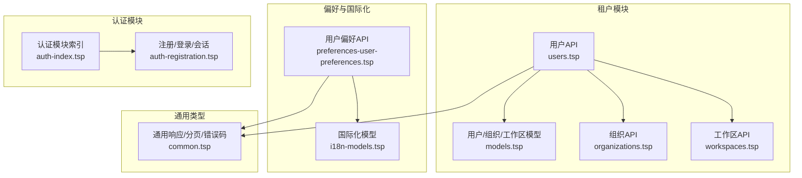
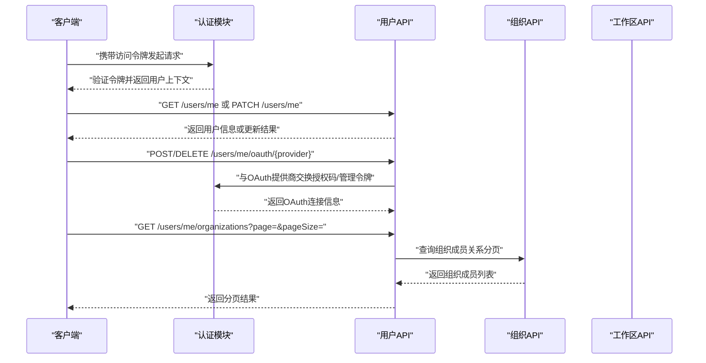
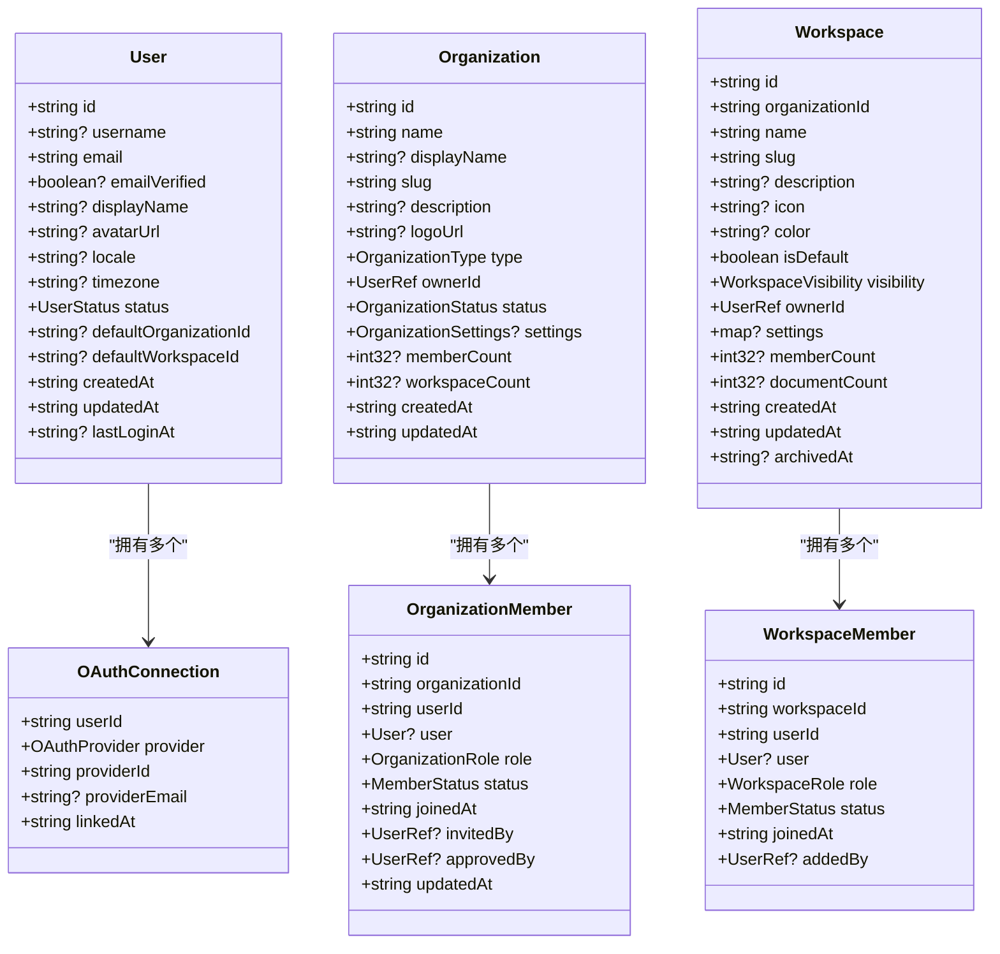
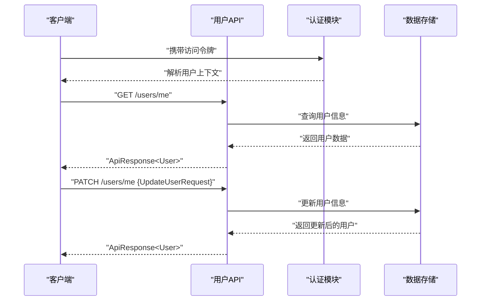
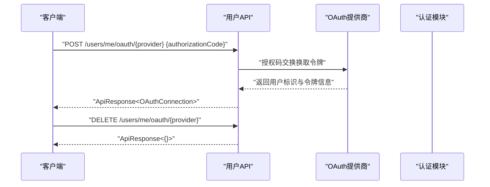
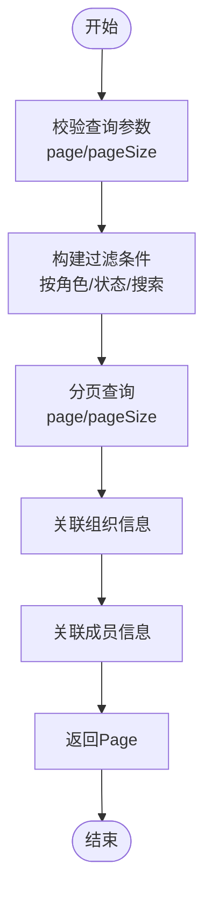
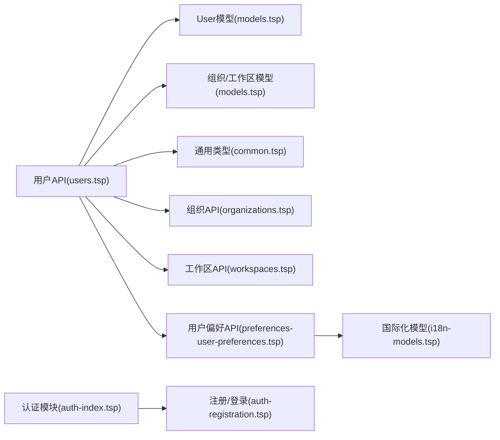

# 用户管理

<cite>
**本文引用的文件**
- [users.tsp](file://api/tenant/users.tsp)
- [models.tsp（租户）](file://api/tenant/models.tsp)
- [common.tsp](file://api/shared/common.tsp)
- [organizations.tsp](file://api/tenant/organizations.tsp)
- [workspaces.tsp](file://api/tenant/workspaces.tsp)
- [preferences-user-preferences.tsp](file://api/preferences/user-preferences.tsp)
- [i18n-models.tsp](file://api/i18n/models.tsp)
- [auth-index.tsp](file://api/auth/index.tsp)
- [auth-registration.tsp](file://api/auth/registration.tsp)
- [docs-authentication.md](file://docs-src/guides/authentication.md)
</cite>

## 目录
1. [简介](#简介)
2. [项目结构](#项目结构)
3. [核心组件](#核心组件)
4. [架构总览](#架构总览)
5. [详细组件分析](#详细组件分析)
6. [依赖分析](#依赖分析)
7. [性能考虑](#性能考虑)
8. [故障排查指南](#故障排查指南)
9. [结论](#结论)
10. [附录](#附录)

## 简介
本文件面向nexusbook-api的用户管理系统，聚焦于用户实体模型设计、用户信息获取与更新API、OAuth绑定与解绑流程、用户组织成员关系获取与分页查询优化，以及与认证模块的集成方式。文档提供API使用示例与数据结构说明，帮助开发者快速理解并正确集成用户管理能力。

## 项目结构
用户管理相关能力由多个模块协同实现：
- 用户API与模型：位于租户模块的用户接口与数据模型
- 组织与工作区：用户组织成员关系与工作区成员关系
- 偏好设置：用户偏好API（语言、区域等）
- 国际化：语言、时区、货币等国际化配置模型
- 认证模块：OAuth2/OIDC、令牌管理、会话管理等

图表来源
- [users.tsp](file://api/tenant/users.tsp#L1-L268)
- [models.tsp（租户）](file://api/tenant/models.tsp#L1-L220)
- [organizations.tsp](file://api/tenant/organizations.tsp#L1-L120)
- [workspaces.tsp](file://api/tenant/workspaces.tsp#L1-L120)
- [preferences-user-preferences.tsp](file://api/preferences/user-preferences.tsp#L1-L190)
- [i18n-models.tsp](file://api/i18n/models.tsp#L1-L120)
- [auth-index.tsp](file://api/auth/index.tsp#L1-L37)
- [auth-registration.tsp](file://api/auth/registration.tsp#L170-L252)
- [common.tsp](file://api/shared/common.tsp#L153-L204)

章节来源
- [users.tsp](file://api/tenant/users.tsp#L1-L268)
- [models.tsp（租户）](file://api/tenant/models.tsp#L1-L220)
- [organizations.tsp](file://api/tenant/organizations.tsp#L1-L120)
- [workspaces.tsp](file://api/tenant/workspaces.tsp#L1-L120)
- [preferences-user-preferences.tsp](file://api/preferences/user-preferences.tsp#L1-L190)
- [i18n-models.tsp](file://api/i18n/models.tsp#L1-L120)
- [auth-index.tsp](file://api/auth/index.tsp#L1-L37)
- [auth-registration.tsp](file://api/auth/registration.tsp#L170-L252)
- [common.tsp](file://api/shared/common.tsp#L153-L204)

## 核心组件
- 用户实体模型：包含显示名称、头像URL、语言偏好、时区、默认组织与工作区等关键属性
- 用户API：提供获取与更新当前用户信息、OAuth绑定/解绑、列出OAuth连接、列出用户组织等接口
- 组织与工作区：用户在组织/工作区中的成员关系与角色
- 偏好设置：用户语言、区域等偏好API
- 认证模块：OAuth2/OIDC、令牌管理、会话管理

章节来源
- [models.tsp（租户）](file://api/tenant/models.tsp#L65-L157)
- [users.tsp](file://api/tenant/users.tsp#L111-L267)
- [organizations.tsp](file://api/tenant/organizations.tsp#L112-L168)
- [workspaces.tsp](file://api/tenant/workspaces.tsp#L135-L170)
- [preferences-user-preferences.tsp](file://api/preferences/user-preferences.tsp#L1-L190)
- [auth-index.tsp](file://api/auth/index.tsp#L1-L37)

## 架构总览
用户管理通过统一的认证令牌在请求链路中传递用户上下文，随后由用户API根据令牌解析出当前用户并执行相应操作。OAuth绑定/解绑涉及第三方提供商授权码交换与令牌管理；组织与工作区成员关系查询采用分页机制，支持大型组织的性能优化。

图表来源
- [users.tsp](file://api/tenant/users.tsp#L111-L267)
- [organizations.tsp](file://api/tenant/organizations.tsp#L285-L338)
- [auth-registration.tsp](file://api/auth/registration.tsp#L170-L252)
- [auth-index.tsp](file://api/auth/index.tsp#L1-L37)

## 详细组件分析

### 用户实体模型设计
- 关键属性
  - 显示名称、头像URL、语言偏好、时区、默认组织ID、默认工作区ID、状态、创建/更新/最后登录时间等
- 设计要点
  - 语言偏好与区域设置可与国际化模型配合，支持多语言与区域格式
  - 时区字段用于统一展示与计算，避免跨时区显示差异
  - 默认组织与工作区字段便于快速定位用户上下文

图表来源
- [models.tsp（租户）](file://api/tenant/models.tsp#L65-L157)
- [models.tsp（租户）](file://api/tenant/models.tsp#L185-L215)
- [models.tsp（租户）](file://api/tenant/models.tsp#L303-L394)
- [models.tsp（租户）](file://api/tenant/models.tsp#L444-L511)
- [models.tsp（租户）](file://api/tenant/models.tsp#L533-L636)
- [models.tsp（租户）](file://api/tenant/models.tsp#L662-L718)

章节来源
- [models.tsp（租户）](file://api/tenant/models.tsp#L65-L157)
- [models.tsp（租户）](file://api/tenant/models.tsp#L185-L215)
- [models.tsp（租户）](file://api/tenant/models.tsp#L303-L394)
- [models.tsp（租户）](file://api/tenant/models.tsp#L444-L511)
- [models.tsp（租户）](file://api/tenant/models.tsp#L533-L636)
- [models.tsp（租户）](file://api/tenant/models.tsp#L662-L718)

### 用户信息获取与更新API
- GET /api/v1/users/me
  - 功能：返回当前登录用户的完整信息，包含默认组织与工作区
  - 响应：标准ApiResponse包裹User
- PATCH /api/v1/users/me
  - 功能：更新当前用户的个人信息与偏好设置
  - 请求体：UpdateUserRequest（可选字段：displayName、avatarUrl、locale、timezone、defaultOrganizationId、defaultWorkspaceId）
  - 响应：标准ApiResponse包裹User

图表来源
- [users.tsp](file://api/tenant/users.tsp#L111-L160)
- [models.tsp（租户）](file://api/tenant/models.tsp#L65-L157)
- [common.tsp](file://api/shared/common.tsp#L153-L177)

章节来源
- [users.tsp](file://api/tenant/users.tsp#L111-L160)
- [models.tsp（租户）](file://api/tenant/models.tsp#L65-L157)
- [common.tsp](file://api/shared/common.tsp#L153-L177)

### OAuth绑定与解绑流程
- 绑定
  - POST /api/v1/users/me/oauth/{provider}
  - 请求体：BindOAuthRequest（authorizationCode、redirectUri）
  - 响应：OAuthConnection
- 解绑
  - DELETE /api/v1/users/me/oauth/{provider}
  - 响应：空对象
- 列出连接
  - GET /api/v1/users/me/oauth
  - 响应：OAuthConnection数组

图表来源
- [users.tsp](file://api/tenant/users.tsp#L162-L236)
- [models.tsp（租户）](file://api/tenant/models.tsp#L145-L176)
- [models.tsp（租户）](file://api/tenant/models.tsp#L185-L215)
- [auth-registration.tsp](file://api/auth/registration.tsp#L170-L252)
- [auth-index.tsp](file://api/auth/index.tsp#L1-L37)

章节来源
- [users.tsp](file://api/tenant/users.tsp#L162-L236)
- [models.tsp（租户）](file://api/tenant/models.tsp#L145-L176)
- [models.tsp（租户）](file://api/tenant/models.tsp#L185-L215)
- [auth-registration.tsp](file://api/auth/registration.tsp#L170-L252)
- [auth-index.tsp](file://api/auth/index.tsp#L1-L37)

### 用户组织成员关系与分页查询
- GET /api/v1/users/me/organizations
  - 查询参数：page（默认1）、pageSize（默认20）
  - 响应：Page<UserOrganizationMembership>
  - UserOrganizationMembership包含Organization与OrganizationMember
- 大型组织性能优化建议
  - 合理设置pageSize（推荐20-100）
  - 使用过滤与排序减少数据量
  - 对高频查询建立索引（组织ID、用户ID、角色、状态）

图表来源
- [users.tsp](file://api/tenant/users.tsp#L238-L267)
- [organizations.tsp](file://api/tenant/organizations.tsp#L285-L338)
- [models.tsp（租户）](file://api/tenant/models.tsp#L303-L394)
- [models.tsp（租户）](file://api/tenant/models.tsp#L444-L511)
- [common.tsp](file://api/shared/common.tsp#L179-L204)

章节来源
- [users.tsp](file://api/tenant/users.tsp#L238-L267)
- [organizations.tsp](file://api/tenant/organizations.tsp#L285-L338)
- [models.tsp（租户）](file://api/tenant/models.tsp#L303-L394)
- [models.tsp（租户）](file://api/tenant/models.tsp#L444-L511)
- [common.tsp](file://api/shared/common.tsp#L179-L204)

### 用户偏好设置API
- GET /api/v1/users/me/preferences
  - 查询参数：section（可选，如regional）
  - 响应：UserPreferences
- PATCH /api/v1/users/me/preferences
  - 请求体：可部分更新general、appearance、regional、accessibility、privacy等
  - 响应：UserPreferences
- POST /api/v1/users/me/preferences/reset
  - 请求体：sections或resetAll
  - 响应：UserPreferences
- GET/PUT /api/v1/users/me/preferences/language
  - 获取/更新语言偏好

章节来源
- [preferences-user-preferences.tsp](file://api/preferences/user-preferences.tsp#L1-L190)
- [i18n-models.tsp](file://api/i18n/models.tsp#L200-L325)

## 依赖分析
- 用户API依赖
  - 用户模型：User、OAuthConnection
  - 组织/工作区模型：Organization、OrganizationMember、Workspace、WorkspaceMember
  - 通用响应与分页：ApiResponse、Page
- 认证模块依赖
  - OAuth2/OIDC、令牌管理、会话管理
  - 用户登录响应包含accessToken、refreshToken、expiresIn与用户信息

图表来源
- [users.tsp](file://api/tenant/users.tsp#L111-L267)
- [models.tsp（租户）](file://api/tenant/models.tsp#L65-L215)
- [organizations.tsp](file://api/tenant/organizations.tsp#L112-L168)
- [workspaces.tsp](file://api/tenant/workspaces.tsp#L135-L170)
- [preferences-user-preferences.tsp](file://api/preferences/user-preferences.tsp#L1-L190)
- [i18n-models.tsp](file://api/i18n/models.tsp#L1-L120)
- [auth-index.tsp](file://api/auth/index.tsp#L1-L37)
- [auth-registration.tsp](file://api/auth/registration.tsp#L170-L252)
- [common.tsp](file://api/shared/common.tsp#L153-L204)

章节来源
- [users.tsp](file://api/tenant/users.tsp#L111-L267)
- [models.tsp（租户）](file://api/tenant/models.tsp#L65-L215)
- [organizations.tsp](file://api/tenant/organizations.tsp#L112-L168)
- [workspaces.tsp](file://api/tenant/workspaces.tsp#L135-L170)
- [preferences-user-preferences.tsp](file://api/preferences/user-preferences.tsp#L1-L190)
- [i18n-models.tsp](file://api/i18n/models.tsp#L1-L120)
- [auth-index.tsp](file://api/auth/index.tsp#L1-L37)
- [auth-registration.tsp](file://api/auth/registration.tsp#L170-L252)
- [common.tsp](file://api/shared/common.tsp#L153-L204)

## 性能考虑
- 分页策略
  - 合理设置pageSize（推荐20-100），避免过大导致响应延迟
  - 使用过滤与排序减少数据量
  - 对高频查询建立索引（组织ID、用户ID、角色、状态）
- 大数据量场景
  - 优先使用服务端过滤而非全量拉取后客户端过滤
  - 对超大组织采用游标分页（cursor）以提升深分页性能
- 令牌与会话
  - 合理设置访问令牌有效期与刷新策略，降低频繁鉴权成本
  - 会话管理与速率限制结合，防止滥用

章节来源
- [docs-authentication.md](file://docs-src/guides/authentication.md#L180-L450)
- [common.tsp](file://api/shared/common.tsp#L179-L204)

## 故障排查指南
- 常见错误码
  - 用户相关：USER_NOT_FOUND、USER_ALREADY_EXISTS、EMAIL_ALREADY_USED
  - OAuth相关：OAUTH_PROVIDER_NOT_SUPPORTED、OAUTH_PROVIDER_ALREADY_LINKED、OAUTH_PROVIDER_NOT_LINKED
  - 组织相关：ORG_NOT_FOUND、ORG_PERMISSION_DENIED、ORG_ALREADY_MEMBER、ORG_NOT_MEMBER
  - 工作区相关：WORKSPACE_NOT_FOUND、WORKSPACE_PERMISSION_DENIED、WORKSPACE_NOT_MEMBER
- 建议排查步骤
  - 确认访问令牌有效且未过期
  - 检查请求参数（如OAuth授权码、provider名称、分页参数）
  - 核对用户权限（组织/工作区成员角色）
  - 查看服务端日志与速率限制触发情况

章节来源
- [common.tsp](file://api/shared/common.tsp#L80-L151)

## 结论
用户管理系统围绕用户实体模型与API接口展开，结合认证模块实现令牌驱动的用户上下文传递。通过OAuth绑定/解绑、组织成员关系查询与分页优化，能够满足中小到大型组织的用户管理需求。建议在实际集成中遵循最小权限原则、合理分页与过滤策略，并配合认证模块的安全最佳实践。

## 附录

### API使用示例（cURL）
- 获取当前用户信息
  - curl -X GET https://open.nexusbook.com/api/v1/users/me -H "Authorization: Bearer TOKEN"
- 更新当前用户信息
  - curl -X PATCH https://open.nexusbook.com/api/v1/users/me -H "Authorization: Bearer TOKEN" -H "Content-Type: application/json" -d '{"displayName":"张三","locale":"zh-CN","timezone":"Asia/Shanghai"}'
- 绑定OAuth提供商
  - curl -X POST https://open.nexusbook.com/api/v1/users/me/oauth/github -H "Authorization: Bearer TOKEN" -H "Content-Type: application/json" -d '{"authorizationCode":"AUTH_CODE_FROM_GITHUB"}'
- 解绑OAuth提供商
  - curl -X DELETE https://open.nexusbook.com/api/v1/users/me/oauth/github -H "Authorization: Bearer TOKEN"
- 列出OAuth连接
  - curl -X GET https://open.nexusbook.com/api/v1/users/me/oauth -H "Authorization: Bearer TOKEN"
- 列出用户加入的组织（分页）
  - curl -X GET "https://open.nexusbook.com/api/v1/users/me/organizations?page=1&pageSize=20" -H "Authorization: Bearer TOKEN"

章节来源
- [users.tsp](file://api/tenant/users.tsp#L111-L267)

### 数据结构说明
- User
  - 字段：id、username、email、emailVerified、displayName、avatarUrl、locale、timezone、status、defaultOrganizationId、defaultWorkspaceId、createdAt、updatedAt、lastLoginAt
- UpdateUserRequest
  - 字段：displayName、avatarUrl、locale、timezone、defaultOrganizationId、defaultWorkspaceId
- OAuthConnection
  - 字段：userId、provider、providerId、providerEmail、linkedAt
- UserOrganizationMembership
  - 字段：organization（Organization）、membership（OrganizationMember）
- ApiResponse<T>
  - 字段：success、code、message、payload
- Page<T>
  - 字段：items、page、pageSize、total

章节来源
- [models.tsp（租户）](file://api/tenant/models.tsp#L65-L157)
- [models.tsp（租户）](file://api/tenant/models.tsp#L185-L215)
- [models.tsp（租户）](file://api/tenant/models.tsp#L303-L394)
- [models.tsp（租户）](file://api/tenant/models.tsp#L444-L511)
- [common.tsp](file://api/shared/common.tsp#L153-L204)

### 与认证模块的集成
- 令牌管理
  - 访问令牌短期有效，刷新令牌长期有效，支持“记住我”延长
  - 使用JWKS端点获取验证公钥，验证JWT签名与声明
- 会话管理
  - 列出/吊销会话，支持强制退出所有其他会话
- OAuth2/OIDC
  - 支持授权码流程、客户端凭证流程、OIDC发现与JWKS
  - 用户登录响应包含accessToken、refreshToken、expiresIn与用户信息

章节来源
- [auth-index.tsp](file://api/auth/index.tsp#L1-L37)
- [auth-registration.tsp](file://api/auth/registration.tsp#L170-L252)
- [docs-authentication.md](file://docs-src/guides/authentication.md#L180-L450)