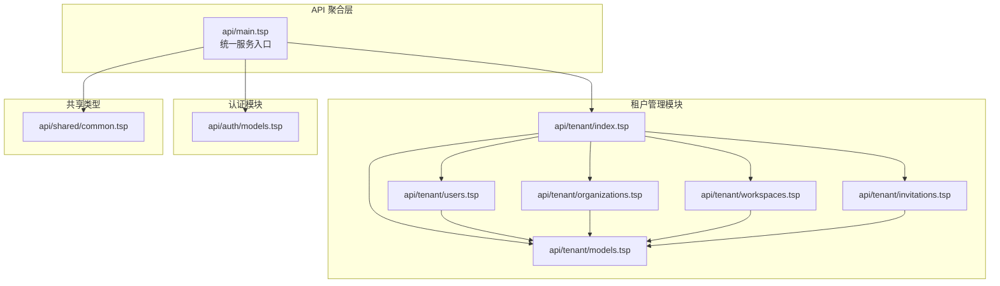
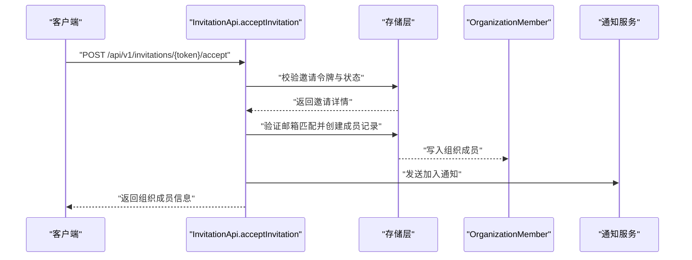
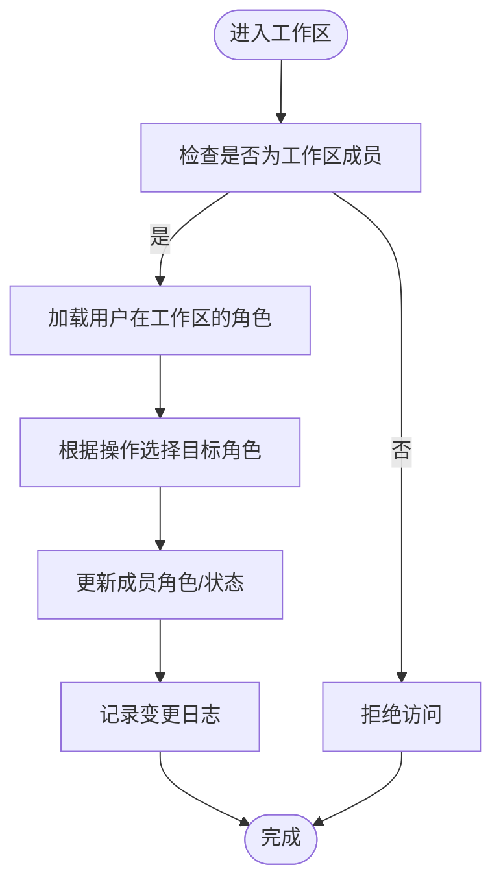
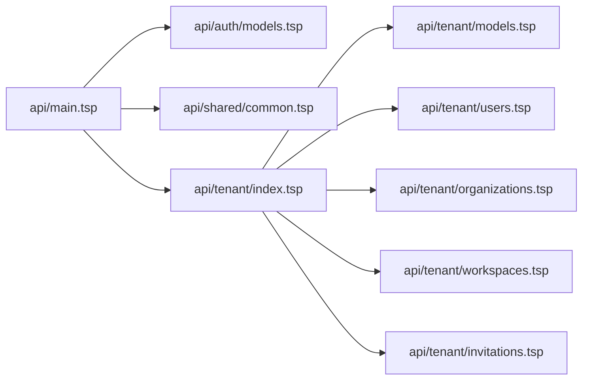

# 租户管理系统

<cite>
**本文引用的文件**
- [api/main.tsp](file://api/main.tsp)
- [api/tenant/index.tsp](file://api/tenant/index.tsp)
- [api/tenant/models.tsp](file://api/tenant/models.tsp)
- [api/tenant/users.tsp](file://api/tenant/users.tsp)
- [api/tenant/organizations.tsp](file://api/tenant/organizations.tsp)
- [api/tenant/workspaces.tsp](file://api/tenant/workspaces.tsp)
- [api/tenant/invitations.tsp](file://api/tenant/invitations.tsp)
- [api/shared/common.tsp](file://api/shared/common.tsp)
- [api/auth/models.tsp](file://api/auth/models.tsp)
- [api/document/index.tsp](file://api/document/index.tsp)
</cite>

## 目录
1. [简介](#简介)
2. [项目结构](#项目结构)
3. [核心组件](#核心组件)
4. [架构总览](#架构总览)
5. [详细组件分析](#详细组件分析)
6. [依赖关系分析](#依赖关系分析)
7. [性能考量](#性能考量)
8. [故障排查指南](#故障排查指南)
9. [结论](#结论)
10. [附录](#附录)

## 简介
本文件面向 NexusBook 租户管理系统，聚焦多租户架构下的用户（Users）、组织（Organizations）、工作区（Workspaces）与邀请（Invitations）四大实体模型与关系设计。文档阐述：
- 组织层级结构如何支撑企业级权限隔离与资源归属
- 工作区作为数据隔离单元的作用，以及用户在多个工作区间权限切换机制
- 邀请流程的实现细节（令牌生成、有效期控制、角色分配、接受流程）
- 各管理接口的使用方式、数据验证规则与安全控制策略
- 与认证模块的集成方式，确保租户上下文在请求链路中的正确传递

## 项目结构
租户管理模块位于 api/tenant 目录，采用“按领域划分”的模块化组织方式，核心文件如下：
- models.tsp：定义用户、组织、工作区、邀请等核心数据模型与枚举
- users.tsp：用户信息查询、更新、OAuth 绑定/解绑、列出加入的组织
- organizations.tsp：组织创建、详情、更新、删除、成员管理、离开组织
- workspaces.tsp：工作区创建、列表、详情、更新、归档/恢复、删除、成员管理
- invitations.tsp：组织邀请创建、列表、撤销、接受、加入申请的提交、审批/拒绝、取消

同时，系统通过 api/main.tsp 汇聚各模块，统一对外暴露 OpenAPI 服务；认证模块位于 api/auth，提供 OAuth2/OIDC 能力；共享类型位于 api/shared/common.tsp，统一响应格式与错误码。



图表来源
- [api/main.tsp](file://api/main.tsp#L96-L134)
- [api/tenant/index.tsp](file://api/tenant/index.tsp#L1-L24)
- [api/tenant/models.tsp](file://api/tenant/models.tsp#L1-L120)
- [api/tenant/users.tsp](file://api/tenant/users.tsp#L1-L120)
- [api/tenant/organizations.tsp](file://api/tenant/organizations.tsp#L1-L120)
- [api/tenant/workspaces.tsp](file://api/tenant/workspaces.tsp#L1-L120)
- [api/tenant/invitations.tsp](file://api/tenant/invitations.tsp#L1-L120)
- [api/auth/models.tsp](file://api/auth/models.tsp#L1-L120)
- [api/shared/common.tsp](file://api/shared/common.tsp#L1-L120)

章节来源
- [api/main.tsp](file://api/main.tsp#L96-L134)
- [api/tenant/index.tsp](file://api/tenant/index.tsp#L1-L24)

## 核心组件
本节对四个核心实体模型进行深入解析，涵盖字段语义、约束与关系。

- 用户（User）
  - 关键字段：唯一标识、用户名、邮箱、显示名、头像、语言偏好、时区、状态、默认组织与工作区、创建/更新时间、最后登录时间
  - 状态枚举：活跃、暂停、删除
  - 与 OAuth 提供商的连接信息（OAuthConnection），支持多种第三方登录
- 组织（Organization）
  - 关键字段：唯一标识、名称、显示名、URL 友好标识（slug）、描述、Logo、类型（个人/团队/企业）、所有者、状态、设置、成员数、工作区数、创建/更新时间
  - 设置项：是否允许公开加入、是否需要审批、邀请有效期（天）、新成员默认角色、允许的邮箱域名白名单
  - 角色枚举：拥有者、管理员、普通成员、访客
  - 成员关系（OrganizationMember）：用户在组织内的角色与状态、加入时间、邀请人/审批人
- 工作区（Workspace）
  - 关键字段：唯一标识、所属组织、名称、URL 友好标识（组织内唯一）、描述、图标、主题色、是否默认、可见性（公开/私有）、负责人、设置、成员数、文档数、创建/更新/归档时间
  - 角色枚举：负责人、编辑者、查看者
  - 成员关系（WorkspaceMember）：用户在工作区内的角色与状态、加入时间、添加者
- 邀请（Invitation）
  - 关键字段：唯一标识、目标组织、被邀请邮箱、邀请人、邀请人信息（可选）、邀请角色、邀请令牌、状态（待处理/已接受/已过期/已撤销）
  - 加入申请（JoinRequest）：组织内申请加入的流程，支持审批/拒绝/取消

章节来源
- [api/tenant/models.tsp](file://api/tenant/models.tsp#L27-L142)
- [api/tenant/models.tsp](file://api/tenant/models.tsp#L145-L216)
- [api/tenant/models.tsp](file://api/tenant/models.tsp#L219-L394)
- [api/tenant/models.tsp](file://api/tenant/models.tsp#L397-L511)
- [api/tenant/models.tsp](file://api/tenant/models.tsp#L515-L636)
- [api/tenant/models.tsp](file://api/tenant/models.tsp#L639-L718)
- [api/tenant/models.tsp](file://api/tenant/models.tsp#L721-L836)

## 架构总览
租户管理模块围绕“用户-组织-工作区-邀请”四要素构建，形成清晰的层级与边界：
- 用户是系统最基础的身份实体，支持多种登录方式并通过 OAuth 连接第三方身份提供商
- 组织是用户协作的基本单元，每个用户注册后自动创建一个个人组织；组织内可创建多个工作区
- 工作区是实际业务开展的容器，大部分文档操作在工作区内进行；工作区具备可见性与成员权限控制
- 邀请与加入申请提供组织成员扩展机制，支持多种策略（公开加入、审批、白名单、有效期）

```mermaid
classDiagram
class User {
+string id
+string? username
+string email
+string? displayName
+string? avatarUrl
+string? locale
+string? timezone
+UserStatus status
+string? defaultOrganizationId
+string? defaultWorkspaceId
+string createdAt
+string updatedAt
+string? lastLoginAt
}
class OAuthConnection {
+string userId
+OAuthProvider provider
+string providerId
+string? providerEmail
+string linkedAt
}
class Organization {
+string id
+string name
+string? displayName
+string slug
+string? description
+string? logoUrl
+OrganizationType type
+UserRef ownerId
+OrganizationStatus status
+OrganizationSettings? settings
+int32? memberCount
+int32? workspaceCount
+string createdAt
+string updatedAt
}
class OrganizationMember {
+string id
+string organizationId
+string userId
+User? user
+OrganizationRole role
+MemberStatus status
+string joinedAt
+UserRef? invitedBy
+UserRef? approvedBy
+string updatedAt
}
class Workspace {
+string id
+string organizationId
+string name
+string slug
+string? description
+string? icon
+string? color
+boolean isDefault
+WorkspaceVisibility visibility
+UserRef ownerId
+{}? settings
+int32? memberCount
+int32? documentCount
+string createdAt
+string updatedAt
+string? archivedAt
}
class WorkspaceMember {
+string id
+string workspaceId
+string userId
+User? user
+WorkspaceRole role
+MemberStatus status
+string joinedAt
+UserRef? addedBy
}
class Invitation {
+string id
+string organizationId
+string email
+UserRef inviterUserId
+User? inviter
+OrganizationRole role
+string token
+InvitationStatus status
}
User "1" o-- "0..*" OAuthConnection : "绑定"
Organization "1" o-- "0..*" OrganizationMember : "成员"
User "1" o-- "0..*" OrganizationMember : "成员"
Organization "1" o-- "0..*" Workspace : "工作区"
Workspace "1" o-- "0..*" WorkspaceMember : "成员"
Organization "1" o-- "0..*" Invitation : "邀请"
```

图表来源
- [api/tenant/models.tsp](file://api/tenant/models.tsp#L27-L142)
- [api/tenant/models.tsp](file://api/tenant/models.tsp#L145-L216)
- [api/tenant/models.tsp](file://api/tenant/models.tsp#L219-L394)
- [api/tenant/models.tsp](file://api/tenant/models.tsp#L397-L511)
- [api/tenant/models.tsp](file://api/tenant/models.tsp#L515-L636)
- [api/tenant/models.tsp](file://api/tenant/models.tsp#L639-L718)
- [api/tenant/models.tsp](file://api/tenant/models.tsp#L721-L836)

## 详细组件分析

### 用户管理（Users）
- 主要能力
  - 获取当前用户信息：返回用户基本信息、默认组织与工作区
  - 更新当前用户信息：支持显示名、头像、语言、时区、默认组织/工作区等
  - OAuth 绑定/解绑：支持多种提供商（Google、GitHub、微信、钉钉、飞书）
  - 列出当前用户加入的组织：返回组织与成员角色信息
- 数据验证与安全
  - 更新请求体字段均为可选，避免强制覆盖
  - OAuth 绑定时需提供授权码与可选重定向 URI
  - 列表接口支持分页参数（页码、每页数量）
- 与租户上下文的关系
  - 当前用户信息与默认组织/工作区字段，体现用户在多租户环境中的活动上下文

章节来源
- [api/tenant/users.tsp](file://api/tenant/users.tsp#L1-L120)
- [api/tenant/users.tsp](file://api/tenant/users.tsp#L120-L268)

### 组织管理（Organizations）
- 主要能力
  - 创建组织：名称、URL 标识、类型、描述、设置等
  - 获取组织详情：包含当前用户角色与所有者信息
  - 更新组织信息：名称、显示名、描述、Logo、设置等
  - 删除组织：软删除（标记为归档）
  - 成员管理：列出成员、添加成员、更新成员角色/状态、移除成员、离开组织
- 权限与策略
  - 组织成员角色：拥有者、管理员、普通成员、访客
  - 成员状态：活跃、暂停
  - 组织设置：公开加入开关、审批需求、邀请有效期、默认角色、邮箱域名白名单
- 数据验证与安全
  - 创建/更新请求体字段均为可选或带默认值
  - 成员操作需满足权限门槛（拥有者或管理员）
  - 离开组织时禁止拥有者直接离开，需先转让所有权

章节来源
- [api/tenant/organizations.tsp](file://api/tenant/organizations.tsp#L1-L120)
- [api/tenant/organizations.tsp](file://api/tenant/organizations.tsp#L120-L268)
- [api/tenant/organizations.tsp](file://api/tenant/organizations.tsp#L268-L498)

### 工作区管理（Workspaces）
- 主要能力
  - 创建工作区：名称、URL 标识（组织内唯一）、描述、图标、主题色、可见性（默认私有）
  - 列出组织工作区：支持可见性过滤、是否包含归档
  - 获取工作区详情：包含当前用户角色与负责人信息
  - 更新工作区信息：名称、描述、图标、主题色、可见性
  - 归档/恢复/删除：支持软删除（归档）
  - 成员管理：列出成员、添加成员（需为组织成员）、更新成员角色/状态、移除成员
- 权限与策略
  - 工作区角色：负责人、编辑者、查看者
  - 可见性：公开（组织内成员可见）、私有（仅成员可见）
- 数据验证与安全
  - 创建/更新请求体字段均为可选或带默认值
  - 成员添加需满足组织成员前提
  - 归档/恢复/删除需满足权限门槛（工作区负责人或组织管理员/拥有者）

章节来源
- [api/tenant/workspaces.tsp](file://api/tenant/workspaces.tsp#L1-L120)
- [api/tenant/workspaces.tsp](file://api/tenant/workspaces.tsp#L120-L360)
- [api/tenant/workspaces.tsp](file://api/tenant/workspaces.tsp#L360-L631)

### 邀请与加入申请（Invitations & Join Requests）
- 邀请流程
  - 创建邀请：指定邮箱、邀请角色（默认成员）、留言、有效期（默认7天）
  - 列出邀请：支持按状态过滤
  - 获取邀请详情、撤销邀请（需权限或创建者）
  - 接受邀请：通过邀请令牌接受，验证邮箱匹配后创建组织成员记录
  - 拒绝邀请：拒绝加入组织
  - 通过令牌获取邀请信息：用于邀请接受页面展示
- 加入申请流程
  - 提交加入申请：前置条件为未加入该组织且组织允许申请加入
  - 列出申请：支持按状态过滤
  - 获取申请详情
  - 批准/拒绝申请：批准时可授予角色与审核备注，拒绝时需提供拒绝原因
  - 取消申请：仅申请人本人可操作
- 数据验证与安全
  - 邀请令牌用于链接，支持过期控制与状态管理
  - 组织设置中的邀请有效期与默认角色影响邀请行为
  - 批准/拒绝流程需满足权限门槛（拥有者或管理员）

章节来源
- [api/tenant/invitations.tsp](file://api/tenant/invitations.tsp#L1-L120)
- [api/tenant/invitations.tsp](file://api/tenant/invitations.tsp#L120-L323)
- [api/tenant/invitations.tsp](file://api/tenant/invitations.tsp#L323-L548)

### 邀请接受流程时序


图表来源
- [api/tenant/invitations.tsp](file://api/tenant/invitations.tsp#L252-L299)

### 工作区成员权限切换流程


图表来源
- [api/tenant/workspaces.tsp](file://api/tenant/workspaces.tsp#L472-L631)

## 依赖关系分析
- 模块耦合
  - 租户管理模块内部高度内聚：users/organizations/workspaces/invitations 均依赖 models.tsp 的统一数据模型
  - api/main.tsp 将认证、租户、文档、扩展、国际化、偏好、计费、审计等模块汇聚为统一服务入口
- 外部依赖
  - 认证模块提供 OAuth2/OIDC 能力，用户信息声明中包含角色与租户列表，便于前端/后端识别当前租户上下文
  - 共享类型模块提供统一响应格式（ApiResponse）与错误码（ErrorCode），保证跨模块一致性



图表来源
- [api/main.tsp](file://api/main.tsp#L96-L134)
- [api/tenant/index.tsp](file://api/tenant/index.tsp#L1-L24)
- [api/auth/models.tsp](file://api/auth/models.tsp#L1-L120)
- [api/shared/common.tsp](file://api/shared/common.tsp#L1-L120)

章节来源
- [api/main.tsp](file://api/main.tsp#L96-L134)
- [api/tenant/index.tsp](file://api/tenant/index.tsp#L1-L24)
- [api/auth/models.tsp](file://api/auth/models.tsp#L1-L120)
- [api/shared/common.tsp](file://api/shared/common.tsp#L1-L120)

## 性能考量
- 分页与查询
  - 列表接口普遍支持分页参数（页码、每页数量），建议前端按需请求，避免一次性拉取大量数据
  - 组织与工作区列表支持过滤（如可见性、角色、状态、搜索），合理使用可减少无效数据传输
- 缓存策略
  - 对于只读的用户信息、组织详情、工作区详情等，可在边缘或应用层引入缓存，降低数据库压力
- 并发控制
  - 文档模块采用版本号进行并发控制，虽然不在本节讨论范围内，但体现了系统对并发一致性的重视，租户管理相关更新也应遵循类似的幂等与冲突处理原则
- 负载均衡与限流
  - 邀请与加入申请接口可能成为热点，建议结合速率限制与排队策略，防止滥用

## 故障排查指南
- 常见错误码与含义
  - 认证相关：无效令牌、未授权、禁止访问
  - 用户相关：用户不存在、邮箱已被使用、OAuth 提供商不支持、已绑定/未绑定
  - 组织相关：组织不存在、URL 标识已存在、权限不足、已是成员、非成员、拥有者不可离开、成员不存在
  - 工作区相关：工作区不存在、URL 标识已存在、权限不足、非成员、成员不存在
  - 邀请相关：邀请不存在、已过期、已接受、邮箱不匹配、已撤销
  - 加入申请相关：申请不存在、已存在、已处理
- 排查步骤
  - 确认请求头携带有效 Bearer Token
  - 核对路径参数（组织ID、工作区ID、邀请ID、申请ID）是否正确
  - 检查请求体字段类型与必填项是否满足接口要求
  - 对于邀请/加入申请，确认邮箱匹配、有效期与状态
  - 对于权限不足问题，确认当前用户在组织/工作区的角色与状态

章节来源
- [api/shared/common.tsp](file://api/shared/common.tsp#L80-L152)
- [api/shared/common.tsp](file://api/shared/common.tsp#L153-L177)
- [api/tenant/invitations.tsp](file://api/tenant/invitations.tsp#L1-L120)
- [api/tenant/organizations.tsp](file://api/tenant/organizations.tsp#L1-L120)
- [api/tenant/workspaces.tsp](file://api/tenant/workspaces.tsp#L1-L120)
- [api/tenant/users.tsp](file://api/tenant/users.tsp#L1-L120)

## 结论
本租户管理系统通过清晰的实体模型与严格的权限控制，实现了企业级多租户协作所需的隔离与治理能力。用户在多组织/多工作区间切换由默认组织与工作区字段承载，配合邀请与加入申请流程，既保障了开放协作，又维持了组织边界与数据安全。认证模块提供的用户信息声明与租户列表，为租户上下文在请求链路中的传递提供了基础支撑。建议在生产环境中结合缓存、限流与审计策略，持续优化性能与安全性。

## 附录
- 与认证模块的集成要点
  - 用户信息声明（UserInfo）包含角色与租户列表，可用于前端侧切换租户上下文
  - OAuth2/OIDC 流程支持授权码与客户端凭证两种模式，便于不同场景接入
  - JWT 公钥集（JWKS）用于令牌验证，确保跨服务的一致性
- 文档模块与租户上下文
  - 文档模块通过 tenant-document.tsp 支持组织与工作区级文档，租户上下文在文档路由与鉴权中保持一致

章节来源
- [api/auth/models.tsp](file://api/auth/models.tsp#L212-L276)
- [api/document/index.tsp](file://api/document/index.tsp#L1-L31)