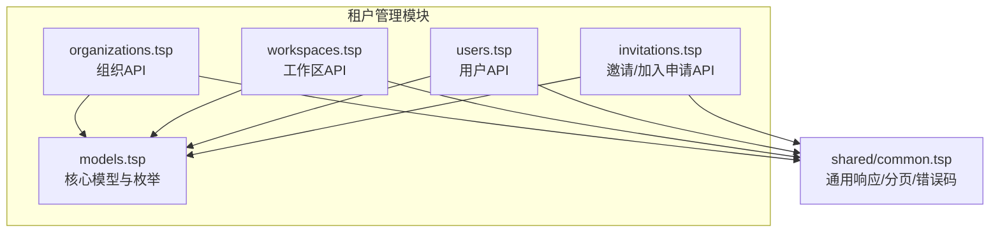
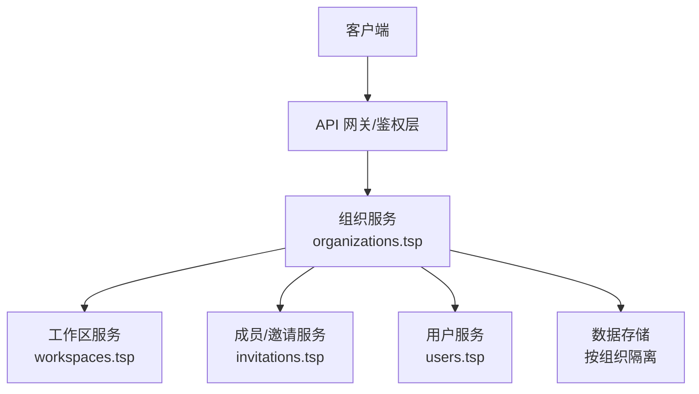
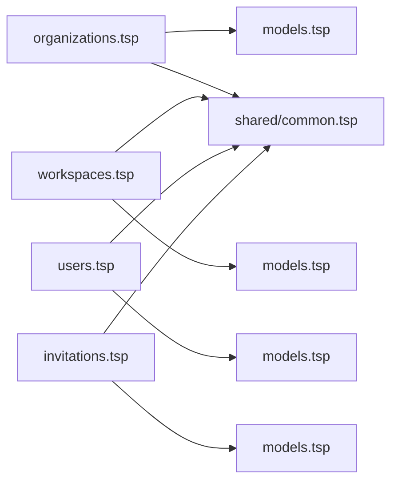
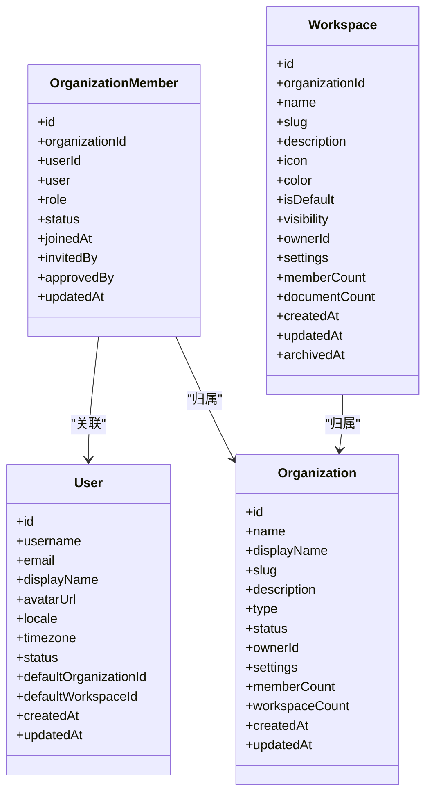

# 组织管理

<cite>
**本文引用的文件**
- [api/tenant/organizations.tsp](file://api/tenant/organizations.tsp)
- [api/tenant/models.tsp](file://api/tenant/models.tsp)
- [api/tenant/users.tsp](file://api/tenant/users.tsp)
- [api/tenant/workspaces.tsp](file://api/tenant/workspaces.tsp)
- [api/tenant/invitations.tsp](file://api/tenant/invitations.tsp)
- [api/shared/common.tsp](file://api/shared/common.tsp)
- [README.md](file://README.md)
- [STORY.md](file://STORY.md)
</cite>

## 目录
1. [简介](#简介)
2. [项目结构](#项目结构)
3. [核心组件](#核心组件)
4. [架构概览](#架构概览)
5. [详细组件分析](#详细组件分析)
6. [依赖分析](#依赖分析)
7. [性能考虑](#性能考虑)
8. [故障排查指南](#故障排查指南)
9. [结论](#结论)
10. [附录](#附录)

## 简介
本文件面向 naxusbook-api 的“组织管理”能力，系统化梳理组织实体模型、生命周期管理（创建、更新、删除）、成员管理（添加、角色更新、状态管理、移除、离开）、成员分页查询与过滤搜索、以及多租户架构下的数据隔离策略。文档同时提供 cURL 示例与 API 使用说明，帮助开发者快速集成与排障。

## 项目结构
组织管理相关能力集中在 api/tenant 模块，采用“按领域拆分”的模块化设计：
- models.tsp：组织、成员、工作区、邀请等核心数据模型与枚举
- organizations.tsp：组织生命周期与成员管理 API
- workspaces.tsp：工作区生命周期与成员管理 API
- users.tsp：用户信息与组织成员关系查询 API
- invitations.tsp：邀请与加入申请 API
- shared/common.tsp：统一响应结构、分页、错误码等通用类型

图表来源
- [api/tenant/organizations.tsp](file://api/tenant/organizations.tsp#L1-L60)
- [api/tenant/models.tsp](file://api/tenant/models.tsp#L1-L60)
- [api/tenant/workspaces.tsp](file://api/tenant/workspaces.tsp#L1-L40)
- [api/tenant/users.tsp](file://api/tenant/users.tsp#L1-L40)
- [api/tenant/invitations.tsp](file://api/tenant/invitations.tsp#L1-L40)
- [api/shared/common.tsp](file://api/shared/common.tsp#L1-L40)

章节来源
- [README.md](file://README.md#L126-L169)
- [STORY.md](file://STORY.md#L36-L76)

## 核心组件
- 组织实体模型
  - 名称、显示名称、URL标识（slug）、描述、类型、状态、设置、所有者、成员计数、工作区计数、时间戳等
- 组织成员模型
  - 成员记录、所属组织、用户、角色、状态、加入时间、邀请人/审批人、更新时间
- 角色与状态
  - 组织角色：owner、admin、member、guest；成员状态：active、suspended
- 组织设置
  - 公开加入、加入审批、邀请过期天数、默认角色、允许的邮箱域名白名单
- 通用响应与分页
  - ApiResponse、Page、ErrorCode 等统一结构

章节来源
- [api/tenant/models.tsp](file://api/tenant/models.tsp#L217-L424)
- [api/shared/common.tsp](file://api/shared/common.tsp#L153-L203)

## 架构概览
组织管理在多租户架构中通过“组织”作为租户边界，实现数据隔离：
- 每个组织拥有独立的成员、工作区与文档资源
- 组织内的工作区进一步细分权限与访问范围
- API 通过组织 ID 作为路径参数，确保跨域请求落到正确的租户上下文

图表来源
- [api/tenant/organizations.tsp](file://api/tenant/organizations.tsp#L170-L190)
- [api/tenant/workspaces.tsp](file://api/tenant/workspaces.tsp#L177-L180)
- [api/tenant/invitations.tsp](file://api/tenant/invitations.tsp#L133-L140)
- [api/tenant/users.tsp](file://api/tenant/users.tsp#L117-L120)

## 详细组件分析

### 组织实体模型与设置
- 组织模型字段覆盖名称、显示名称、slug、描述、logo、类型、状态、设置、所有者、成员/工作区计数、时间戳
- 组织设置支持：
  - allowPublicJoin：是否允许公开加入
  - requireApproval：加入是否需要审批
  - inviteExpireDays：邀请链接有效期（天）
  - defaultRole：新成员默认角色
  - allowedDomains：允许的邮箱域名白名单
- 组织状态：active、suspended、archived
- 组织角色：owner、admin、member、guest

章节来源
- [api/tenant/models.tsp](file://api/tenant/models.tsp#L217-L424)

### 组织生命周期管理 API
- 创建组织
  - 路径：POST /api/v1/organizations
  - 请求体：name、slug、displayName、description、type、settings
  - 业务规则：创建者自动成为 owner，并自动创建一个默认工作区
  - 权限：无需组织权限，但需认证
- 获取组织详情
  - 路径：GET /api/v1/organizations/{organizationId}
  - 返回：组织详情 + 当前用户角色 + 所有者信息
- 更新组织信息
  - 路径：PATCH /api/v1/organizations/{organizationId}
  - 请求体：name、displayName、description、logoUrl、settings
  - 权限：owner 或 admin
- 删除组织（软删除）
  - 路径：DELETE /api/v1/organizations/{organizationId}
  - 行为：标记为 archived（归档）
  - 权限：owner
- 离开组织（用户主动）
  - 路径：POST /api/v1/organizations/{organizationId}/leave
  - 行为：用户主动离开组织
  - 权限：普通成员；owner 不可直接离开，需先转让所有权

章节来源
- [api/tenant/organizations.tsp](file://api/tenant/organizations.tsp#L198-L283)
- [api/tenant/organizations.tsp](file://api/tenant/organizations.tsp#L474-L497)

### 组织成员管理 API
- 列出成员
  - 路径：GET /api/v1/organizations/{organizationId}/members
  - 查询参数：page、pageSize、role、status、search
  - 权限：组织成员
- 添加成员（直接添加）
  - 路径：POST /api/v1/organizations/{organizationId}/members
  - 请求体：userId、role（默认 member）
  - 权限：owner 或 admin；不能添加 owner
- 获取成员详情
  - 路径：GET /api/v1/organizations/{organizationId}/members/{memberId}
  - 权限：组织成员
- 更新成员角色/状态
  - 路径：PATCH /api/v1/organizations/{organizationId}/members/{memberId}
  - 请求体：role、status
  - 权限：owner 或 admin；不能提升/修改 owner 的角色
- 移除成员
  - 路径：DELETE /api/v1/organizations/{organizationId}/members/{memberId}
  - 权限：owner 或 admin；不能移除 owner
- 离开组织
  - 路径：POST /api/v1/organizations/{organizationId}/leave
  - 权限：普通成员；owner 不可直接离开

章节来源
- [api/tenant/organizations.tsp](file://api/tenant/organizations.tsp#L285-L497)

### 成员列表分页、过滤与搜索
- 分页：page、pageSize（默认 1、20）
- 过滤：role（组织角色）、status（成员状态）
- 搜索：search（按名称、邮箱模糊匹配）
- 实现要点：后端应基于组织 ID 限定查询范围，避免越权访问

章节来源
- [api/tenant/organizations.tsp](file://api/tenant/organizations.tsp#L298-L337)

### 邀请与加入申请（补充成员来源）
- 邀请
  - 创建邀请：POST /api/v1/organizations/{organizationId}/invitations
  - 列出邀请：GET /api/v1/organizations/{organizationId}/invitations
  - 接受邀请：POST /api/v1/invitations/{token}/accept
  - 撤销邀请：DELETE /api/v1/organizations/{organizationId}/invitations/{invitationId}
  - 权限：owner 或 admin；或邀请创建者可撤销
- 加入申请
  - 提交申请：POST /api/v1/organizations/{organizationId}/join-requests
  - 列出申请：GET /api/v1/organizations/{organizationId}/join-requests
  - 批准/拒绝：POST /api/v1/organizations/{organizationId}/join-requests/{requestId}/approve|reject
  - 权限：owner 或 admin；审批时可指定授予角色

章节来源
- [api/tenant/invitations.tsp](file://api/tenant/invitations.tsp#L133-L323)
- [api/tenant/invitations.tsp](file://api/tenant/invitations.tsp#L348-L547)

### 工作区与组织的关系
- 工作区属于组织，拥有组织级别的成员体系
- 默认工作区在组织创建时自动创建，归属组织 owner
- 工作区成员管理遵循工作区角色（owner、editor、viewer）

章节来源
- [api/tenant/organizations.tsp](file://api/tenant/organizations.tsp#L198-L201)
- [api/tenant/workspaces.tsp](file://api/tenant/workspaces.tsp#L1-L40)

### API 使用示例（cURL）
- 创建组织
  - POST /api/v1/organizations
  - 请求体字段：name、slug、type、description（可选）
  - 响应：Organization 对象
- 获取组织详情
  - GET /api/v1/organizations/{organizationId}
  - 响应：OrganizationDetail（含 currentUserRole、owner）
- 更新组织信息
  - PATCH /api/v1/organizations/{organizationId}
  - 请求体：displayName、description（可选）
- 删除组织（软删除）
  - DELETE /api/v1/organizations/{organizationId}
  - 响应：空对象
- 列出成员
  - GET /api/v1/organizations/{organizationId}/members?page=1&pageSize=20&role=admin&status=active&search=张三
- 添加成员
  - POST /api/v1/organizations/{organizationId}/members
  - 请求体：userId、role（可选）
- 更新成员
  - PATCH /api/v1/organizations/{organizationId}/members/{memberId}
  - 请求体：role、status（可选）
- 移除成员
  - DELETE /api/v1/organizations/{organizationId}/members/{memberId}
- 离开组织
  - POST /api/v1/organizations/{organizationId}/leave

章节来源
- [api/tenant/organizations.tsp](file://api/tenant/organizations.tsp#L198-L497)
- [api/tenant/invitations.tsp](file://api/tenant/invitations.tsp#L133-L323)

## 依赖分析
- 组织 API 依赖
  - 组织模型与枚举：models.tsp
  - 统一响应与分页：shared/common.tsp
- 工作区 API 依赖
  - 工作区模型与枚举：models.tsp
  - 统一响应与分页：shared/common.tsp
- 用户 API 依赖
  - 用户模型与枚举：models.tsp
  - 统一响应与分页：shared/common.tsp
- 邀请 API 依赖
  - 邀请模型与枚举：models.tsp
  - 统一响应与分页：shared/common.tsp

图表来源
- [api/tenant/organizations.tsp](file://api/tenant/organizations.tsp#L1-L40)
- [api/tenant/workspaces.tsp](file://api/tenant/workspaces.tsp#L1-L40)
- [api/tenant/users.tsp](file://api/tenant/users.tsp#L1-L40)
- [api/tenant/invitations.tsp](file://api/tenant/invitations.tsp#L1-L40)
- [api/shared/common.tsp](file://api/shared/common.tsp#L1-L40)

章节来源
- [api/tenant/organizations.tsp](file://api/tenant/organizations.tsp#L1-L40)
- [api/tenant/workspaces.tsp](file://api/tenant/workspaces.tsp#L1-L40)
- [api/tenant/users.tsp](file://api/tenant/users.tsp#L1-L40)
- [api/tenant/invitations.tsp](file://api/tenant/invitations.tsp#L1-L40)
- [api/shared/common.tsp](file://api/shared/common.tsp#L1-L40)

## 性能考虑
- 分页与过滤
  - 使用 page、pageSize 控制返回规模，避免一次性拉取大量成员
  - 在后端实现基于组织 ID 的索引扫描，优先使用 role、status、search 等过滤条件
- 搜索优化
  - 对成员姓名、邮箱建立二级索引，支持模糊匹配
- 并发控制
  - 成员角色变更与移除操作建议加锁，防止竞态导致 owner 角色丢失
- 缓存策略
  - 组织详情与成员列表可短期缓存，结合最后修改时间失效

## 故障排查指南
- 常见错误码
  - ORG_NOT_FOUND：组织不存在
  - ORG_SLUG_ALREADY_EXISTS：slug 冲突
  - ORG_PERMISSION_DENIED：权限不足（非 owner/admin）
  - ORG_ALREADY_MEMBER / ORG_NOT_MEMBER：成员状态异常
  - ORG_CANNOT_LEAVE_AS_OWNER：owner 试图离开组织
  - ORG_MEMBER_NOT_FOUND：成员不存在
- 排查步骤
  - 确认请求是否携带有效认证令牌
  - 确认组织 ID 与成员 ID 正确
  - 确认当前用户角色（owner/admin）满足操作权限
  - 检查组织设置（如 requireApproval、allowedDomains）是否影响流程
  - 如涉及邀请/加入申请，确认邀请令牌有效性与邮箱匹配

章节来源
- [api/shared/common.tsp](file://api/shared/common.tsp#L80-L151)

## 结论
组织管理模块以清晰的实体模型与严格的权限控制，提供了完整的组织生命周期与成员管理能力。通过组织 ID 的强约束与多租户隔离，系统在复杂协作场景下保持了良好的一致性与安全性。配合工作区与邀请机制，开发者可快速搭建团队协作与多租户数据隔离方案。

## 附录

### API 定义与权限对照
- 组织
  - 创建：无需组织权限，但需认证
  - 更新/删除：owner 或 admin
  - 离开：普通成员；owner 不可直接离开
- 成员
  - 列表：组织成员
  - 添加/更新/移除：owner 或 admin；不可对 owner 操作
- 邀请/加入申请
  - 创建/撤销/接受/批准/拒绝：owner 或 admin；或邀请创建者可撤销

章节来源
- [api/tenant/organizations.tsp](file://api/tenant/organizations.tsp#L285-L497)
- [api/tenant/invitations.tsp](file://api/tenant/invitations.tsp#L133-L323)

### 数据模型关系图

图表来源
- [api/tenant/models.tsp](file://api/tenant/models.tsp#L303-L424)
- [api/tenant/models.tsp](file://api/tenant/models.tsp#L533-L636)