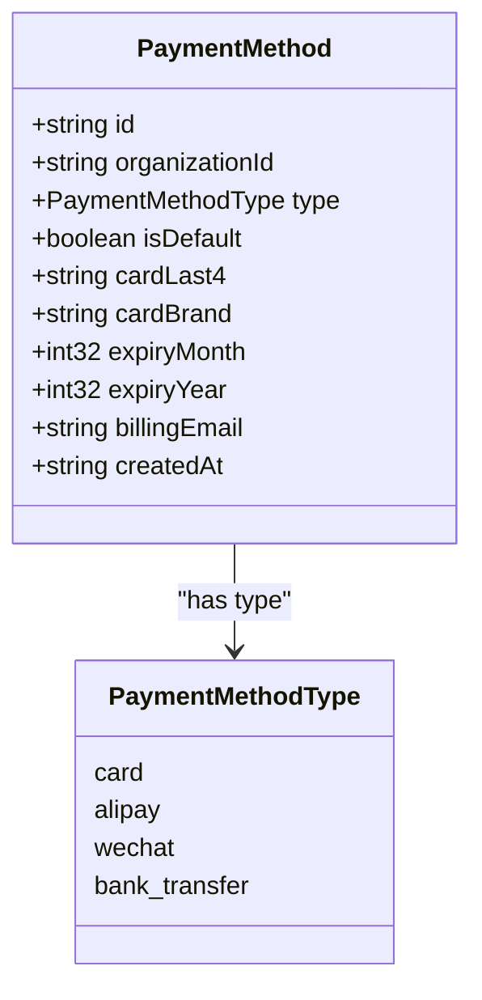
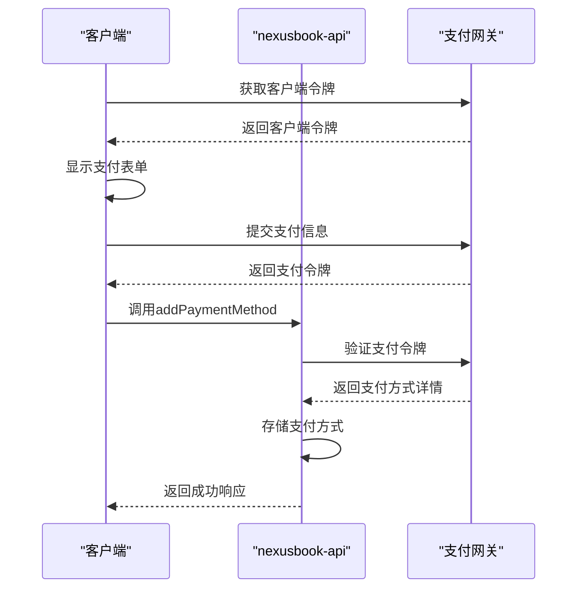

# 支付方式

<cite>
**本文档中引用的文件**   
- [payments.tsp](file://api/billing/payments.tsp)
- [models.tsp](file://api/billing/models.tsp)
- [common.tsp](file://api/shared/common.tsp)
</cite>

## 目录
1. [简介](#简介)
2. [核心功能](#核心功能)
3. [数据模型](#数据模型)
4. [支付网关集成](#支付网关集成)
5. [安全最佳实践](#安全最佳实践)
6. [支付方式变更影响](#支付方式变更影响)
7. [错误处理](#错误处理)
8. [总结](#总结)

## 简介
支付方式管理模块是nexusbook-api商业化运营系统的核心组件，负责组织支付方式的全生命周期管理。该模块提供安全、可靠的支付方式管理接口，支持多种支付方式（如信用卡、支付宝、微信支付等），并与第三方支付网关集成，确保支付数据的安全性和合规性。本模块为订阅管理、账单支付等核心业务功能提供支付支持。

## 核心功能

### PaymentMethodsApi接口功能

#### listPaymentMethods - 列出支付方式
该接口用于获取指定组织的所有支付方式。通过组织ID作为路径参数，返回该组织下所有支付方式的列表，包括支付方式类型、是否为默认支付方式、卡号后四位（如适用）等信息。

**Section sources**
- [payments.tsp](file://api/billing/payments.tsp#L20-L28)

#### addPaymentMethod - 添加支付方式
该接口用于通过支付网关令牌添加新的支付方式。客户端需要提供支付类型、由支付网关生成的支付令牌，以及是否设为默认支付方式的选项。系统会验证令牌的有效性，并将支付方式安全地存储在数据库中。

**Section sources**
- [payments.tsp](file://api/billing/payments.tsp#L30-L47)

#### deletePaymentMethod - 删除支付方式
该接口用于安全删除指定的支付方式。删除操作会验证支付方式的归属，并确保不会删除当前订阅正在使用的支付方式（除非有其他支付方式可用）。删除后，该支付方式将无法用于未来的支付。

**Section sources**
- [payments.tsp](file://api/billing/payments.tsp#L50-L60)

#### setDefaultPaymentMethod - 设置默认支付方式
该接口用于将指定的支付方式设置为组织的默认支付方式。默认支付方式将用于自动续订、账单支付等场景。系统会更新支付方式的状态，并确保同一时间只有一个默认支付方式。

**Section sources**
- [payments.tsp](file://api/billing/payments.tsp#L62-L73)

## 数据模型

### PaymentMethod数据模型
PaymentMethod数据模型定义了支付方式的核心属性，包括：

- **id**: 支付方式唯一标识符
- **organizationId**: 所属组织ID
- **type**: 支付方式类型（信用卡、支付宝、微信支付、银行转账）
- **isDefault**: 是否为默认支付方式
- **cardLast4**: 信用卡号后四位（仅信用卡类型）
- **cardBrand**: 卡品牌（如Visa、MasterCard，仅信用卡类型）
- **expiryMonth**: 过期月份（仅信用卡类型）
- **expiryYear**: 过期年份（仅信用卡类型）
- **billingEmail**: 账单邮箱
- **createdAt**: 添加时间

**Diagram sources **
- [models.tsp](file://api/billing/models.tsp#L335-L365)

### 令牌化机制
系统采用令牌化机制来处理支付信息。当用户添加支付方式时，前端直接与支付网关通信，获取支付令牌（paymentToken）。该令牌随后被发送到后端，用于创建支付方式记录。敏感的支付信息（如完整的信用卡号）永远不会经过或存储在nexusbook-api服务器上，从而降低PCI DSS合规风险。

**Section sources**
- [payments.tsp](file://api/billing/payments.tsp#L42-L43)
- [models.tsp](file://api/billing/models.tsp#L335-L365)

## 支付网关集成

### 集成流程
支付方式管理模块与第三方支付网关（如Stripe）的集成遵循以下流程：

1. **客户端令牌生成**：前端应用从支付网关获取客户端令牌，用于初始化支付表单。
2. **支付信息收集**：用户在前端安全地输入支付信息（如信用卡详情）。
3. **令牌创建**：前端将支付信息发送到支付网关，获取一次性支付令牌。
4. **支付方式添加**：前端将支付令牌发送到nexusbook-api的addPaymentMethod接口。
5. **后端验证**：nexusbook-api后端验证令牌，并与支付网关确认支付方式详情。
6. **存储支付方式**：系统将支付方式的非敏感信息（如卡号后四位、品牌）存储在数据库中，并关联支付网关的客户ID。

**Diagram sources **
- [payments.tsp](file://api/billing/payments.tsp#L37-L47)
- [models.tsp](file://api/billing/models.tsp#L335-L365)

### 支付方式验证
在添加支付方式时，系统会通过支付网关API验证支付令牌的有效性。验证过程包括检查令牌是否未被使用、是否在有效期内，以及支付方式是否处于可支付状态。只有通过验证的支付方式才会被添加到组织的支付方式列表中。

**Section sources**
- [payments.tsp](file://api/billing/payments.tsp#L37-L47)

## 安全最佳实践

### PCI DSS合规性
为确保PCI DSS合规性，系统遵循以下最佳实践：

- **数据最小化**：服务器不存储完整的支付卡号、CVV码等敏感信息。
- **令牌化**：使用支付网关提供的令牌来代表支付方式，避免处理原始支付数据。
- **加密存储**：所有存储的支付相关信息（如令牌、卡号后四位）均使用强加密算法进行加密。
- **安全传输**：所有API通信均通过HTTPS进行，确保数据在传输过程中的安全性。
- **访问控制**：严格的权限控制确保只有授权用户和系统可以访问支付方式管理接口。

**Section sources**
- [payments.tsp](file://api/billing/payments.tsp)
- [models.tsp](file://api/billing/models.tsp)

## 支付方式变更影响

### 对自动扣款的影响
当组织的默认支付方式发生变更时，会对自动扣款流程产生直接影响：

- **新订阅**：新创建的订阅将使用新的默认支付方式进行支付。
- **续订**：现有订阅的续订将使用新的默认支付方式，前提是旧的支付方式已失效或被删除。
- **账单支付**：未支付的账单在自动支付时将使用新的默认支付方式。

系统会记录支付方式变更的历史，以便在支付失败时进行审计和故障排除。

**Section sources**
- [payments.tsp](file://api/billing/payments.tsp#L67-L73)
- [invoices.tsp](file://api/billing/invoices.tsp#L55-L74)

## 错误处理

### 常见错误场景
支付方式管理模块在处理请求时可能会遇到以下常见错误：

- **支付令牌无效**：提供的支付令牌已过期或已被使用。
- **支付方式不存在**：尝试删除或设置默认的支付方式ID不存在。
- **权限不足**：用户没有权限管理指定组织的支付方式。
- **支付网关错误**：与支付网关通信时发生网络或服务错误。
- **默认支付方式冲突**：尝试删除当前默认支付方式而没有其他可用支付方式。

系统会返回标准化的错误响应，包含错误代码和多语言错误消息，帮助客户端进行适当的错误处理。

**Section sources**
- [common.tsp](file://api/shared/common.tsp#L80-L151)
- [payments.tsp](file://api/billing/payments.tsp)

## 总结
支付方式管理模块为nexusbook-api提供了强大而安全的支付能力。通过清晰的API设计、稳健的数据模型和与第三方支付网关的安全集成，该模块确保了支付流程的顺畅和数据的安全。遵循PCI DSS合规性要求和最佳安全实践，该模块为组织的商业化运营提供了可靠的支付基础设施。