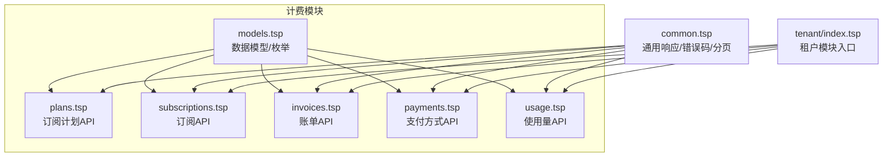
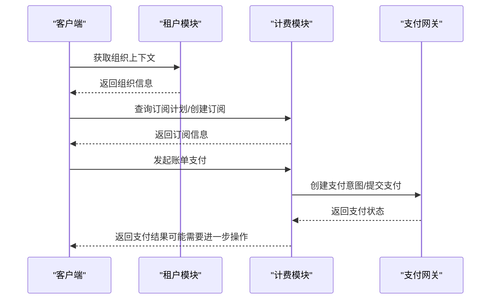
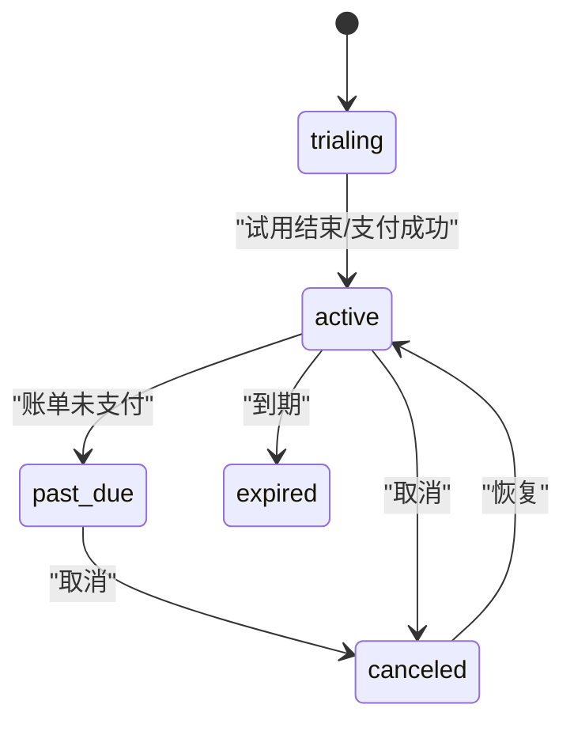
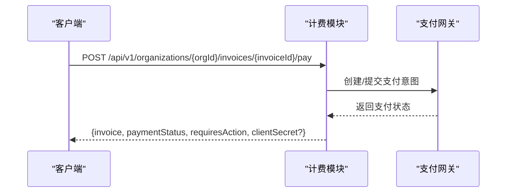
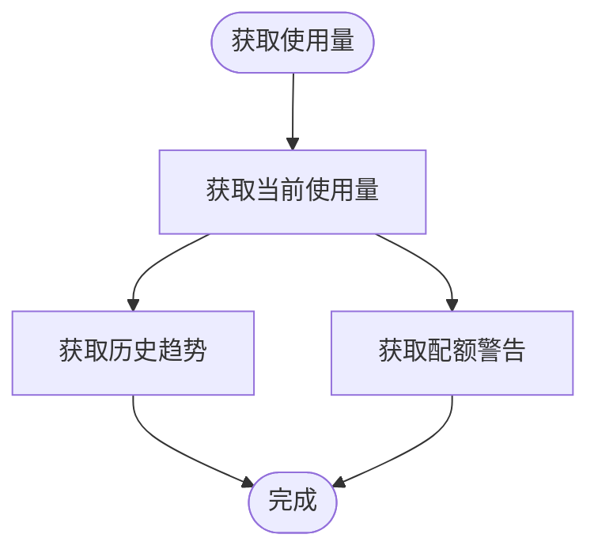
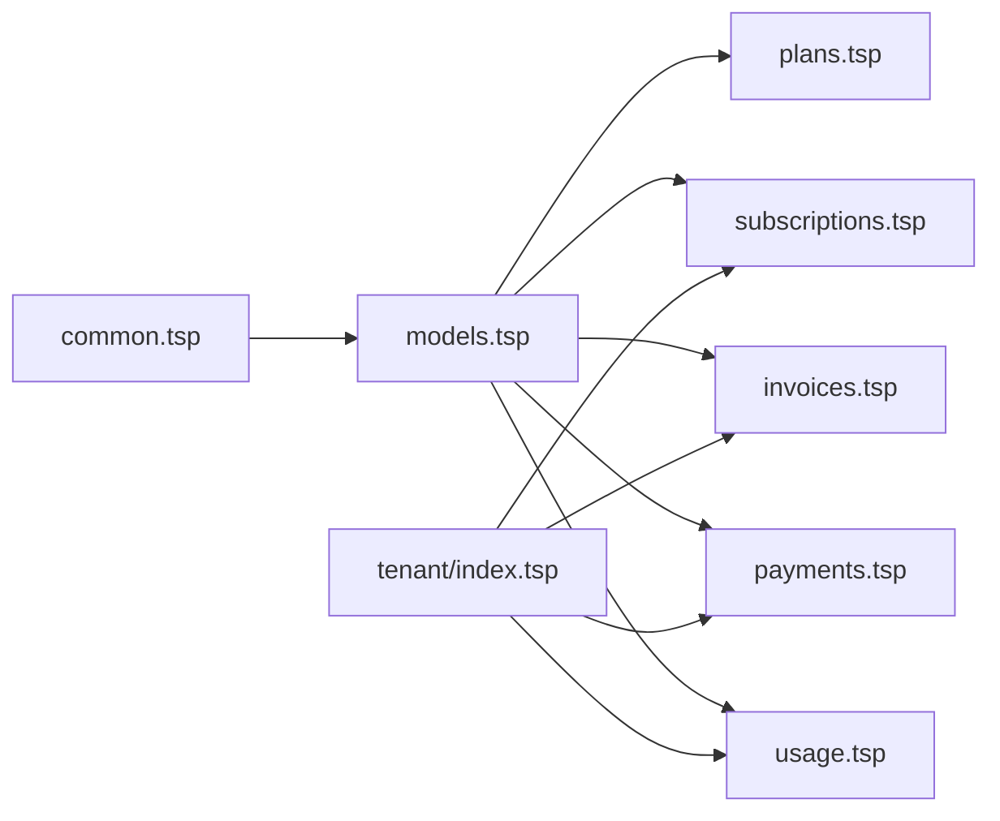

# 计费系统

<cite>
**本文引用的文件**
- [index.tsp](file://api/billing/index.tsp)
- [models.tsp](file://api/billing/models.tsp)
- [plans.tsp](file://api/billing/plans.tsp)
- [subscriptions.tsp](file://api/billing/subscriptions.tsp)
- [invoices.tsp](file://api/billing/invoices.tsp)
- [payments.tsp](file://api/billing/payments.tsp)
- [usage.tsp](file://api/billing/usage.tsp)
- [common.tsp](file://api/shared/common.tsp)
- [index.tsp](file://api/tenant/index.tsp)
- [error-codes.md](file://docs-src/references/error-codes.md)
</cite>

## 目录
1. [简介](#简介)
2. [项目结构](#项目结构)
3. [核心组件](#核心组件)
4. [架构总览](#架构总览)
5. [详细组件分析](#详细组件分析)
6. [依赖关系分析](#依赖关系分析)
7. [性能考虑](#性能考虑)
8. [故障排查指南](#故障排查指南)
9. [结论](#结论)
10. [附录](#附录)

## 简介
本文件面向 naxusbook-api 的计费系统，围绕订阅计划（Plans）、订阅生命周期（Subscriptions）、账单生成（Invoices）、支付集成（Payments）、使用量跟踪（Usage）进行系统化梳理，并结合租户系统（Tenant）说明计费状态如何影响 API 访问权限与功能可用性。文档同时提供 API 端点调用示例路径、错误码处理策略与最佳实践，帮助开发者快速理解并集成计费能力。

## 项目结构
计费模块位于 api/billing 目录下，采用“按领域划分”的组织方式，包含以下子模块：
- 计划管理：订阅计划的查询与详情
- 订阅管理：订阅创建、变更、取消、恢复
- 账单管理：账单列表、详情与支付
- 支付方式管理：支付卡、支付宝、微信、银行转账等
- 使用量与配额：当前使用量、历史趋势、配额警告
- 公共模型与枚举：统一的数据模型与状态枚举
- 共享通用类型：统一响应结构、分页、过滤与错误码

图表来源
- [index.tsp](file://api/billing/index.tsp#L1-L11)
- [models.tsp](file://api/billing/models.tsp#L1-L444)
- [plans.tsp](file://api/billing/plans.tsp#L1-L41)
- [subscriptions.tsp](file://api/billing/subscriptions.tsp#L1-L107)
- [invoices.tsp](file://api/billing/invoices.tsp#L1-L76)
- [payments.tsp](file://api/billing/payments.tsp#L1-L75)
- [usage.tsp](file://api/billing/usage.tsp#L1-L68)
- [common.tsp](file://api/shared/common.tsp#L1-L742)
- [index.tsp](file://api/tenant/index.tsp#L1-L24)

章节来源
- [index.tsp](file://api/billing/index.tsp#L1-L11)
- [common.tsp](file://api/shared/common.tsp#L1-L742)
- [index.tsp](file://api/tenant/index.tsp#L1-L24)

## 核心组件
- 计划（Plans）：提供订阅计划列表与详情，支持按是否包含归档计划筛选；计划包含类型、周期、价格、货币、试用天数、功能特性与配额限制等。
- 订阅（Subscriptions）：提供组织维度的订阅查询、创建/更新、变更计划（升级/降级）、取消与恢复；变更计划支持“立即生效”或“下一计费周期生效”，并返回按比例计费金额与下次账单日期。
- 账单（Invoices）：提供账单列表、详情与支付；支付接口返回支付状态、是否需要进一步操作（如 3D Secure）以及客户端密钥。
- 支付（Payments）：提供支付方式列表、新增、删除、设为默认；新增支付方式需提供支付类型与由支付网关生成的支付 Token。
- 使用量（Usage）：提供组织当前使用量、历史趋势与配额警告；指标覆盖成员数、工作区数、文档数、存储（GB）、API 调用、实时会话等。

章节来源
- [plans.tsp](file://api/billing/plans.tsp#L1-L41)
- [subscriptions.tsp](file://api/billing/subscriptions.tsp#L1-L107)
- [invoices.tsp](file://api/billing/invoices.tsp#L1-L76)
- [payments.tsp](file://api/billing/payments.tsp#L1-L75)
- [usage.tsp](file://api/billing/usage.tsp#L1-L68)
- [models.tsp](file://api/billing/models.tsp#L1-L444)

## 架构总览
计费系统通过 TypeSpec 接口定义与共享通用类型，形成清晰的领域边界与统一响应格式。租户模块负责组织与用户上下文，计费模块基于组织维度提供订阅、账单、支付与使用量能力。

图表来源
- [subscriptions.tsp](file://api/billing/subscriptions.tsp#L1-L107)
- [invoices.tsp](file://api/billing/invoices.tsp#L1-L76)
- [payments.tsp](file://api/billing/payments.tsp#L1-L75)
- [index.tsp](file://api/tenant/index.tsp#L1-L24)

## 详细组件分析

### 订阅计划（Plans）
- 能力概述
  - 列出可用订阅计划，支持 includeArchived 参数控制是否包含已归档计划
  - 获取订阅计划详情
- 关键字段
  - 计划类型：trial（试用）、standard（标准）、custom（定制）
  - 计费周期：monthly（月付）、yearly（年付）
  - 价格与货币：price、currency
  - 试用天数：trialDays
  - 功能特性：features（键、名称、启用状态、限制值）
  - 配额限制：quotas（成员数、工作区数、文档数、存储 GB、API 调用、实时会话）
  - 状态：active、archived
- 实现要点
  - 通过统一响应结构返回列表与详情
  - 支持多语言显示名称与描述

章节来源
- [plans.tsp](file://api/billing/plans.tsp#L1-L41)
- [models.tsp](file://api/billing/models.tsp#L1-L212)

### 订阅生命周期（Subscriptions）
- 能力概述
  - 查询当前组织订阅信息
  - 创建或更新组织订阅（传入 planId、billingCycle、可选 paymentMethodId）
  - 变更订阅计划（targetPlanId、billingCycle、effectiveDate："immediate"|"next_billing_cycle"），返回订阅信息、按比例计费金额与下次账单日期
  - 取消订阅（cancelImmediately、reason、feedback）
  - 恢复已取消的订阅
- 生命周期状态
  - trialing（试用中）、active（活跃）、past_due（逾期）、canceled（已取消）、expired（已过期）
- 关键时间点
  - currentPeriodStart/End：当前计费周期
  - cancelAt/canceledAt：取消时间与实际取消时间
- 实现要点
  - 变更计划支持“立即生效”与“下一计费周期生效”
  - 按比例计费金额用于对齐新旧计划的周期差

图表来源
- [models.tsp](file://api/billing/models.tsp#L56-L67)
- [subscriptions.tsp](file://api/billing/subscriptions.tsp#L1-L107)

章节来源
- [subscriptions.tsp](file://api/billing/subscriptions.tsp#L1-L107)
- [models.tsp](file://api/billing/models.tsp#L214-L257)

### 账单生成与支付（Invoices/Payments）
- 账单（Invoices）
  - 列出组织账单，支持按状态过滤与分页
  - 获取账单详情
  - 支付账单：返回支付状态、是否需要进一步操作（requiresAction）、客户端密钥（用于 3D Secure）
- 支付方式（Payments）
  - 列出支付方式
  - 新增支付方式：type（card/alipay/wechat/bank_transfer）、paymentToken、setAsDefault
  - 删除支付方式
  - 设置默认支付方式
- 税费与周期
  - 账单包含小计、税额、总计、货币、账单项（subscription/usage/addon）
  - 账单周期：periodStart/periodEnd、dueDate、paidAt
- 实现要点
  - 支付接口返回 requiresAction 以适配需要进一步授权的场景（如 3D Secure）
  - 支付方式类型覆盖主流国内与国际渠道

图表来源
- [invoices.tsp](file://api/billing/invoices.tsp#L1-L76)
- [payments.tsp](file://api/billing/payments.tsp#L1-L75)
- [models.tsp](file://api/billing/models.tsp#L277-L332)

章节来源
- [invoices.tsp](file://api/billing/invoices.tsp#L1-L76)
- [payments.tsp](file://api/billing/payments.tsp#L1-L75)
- [models.tsp](file://api/billing/models.tsp#L277-L365)

### 使用量与配额（Usage）
- 能力概述
  - 获取组织当前使用量（members/workspaces/documents/storage/apiCalls/realtimeSessions）
  - 获取使用量历史趋势（支持 hour/day/month 粒度）
  - 获取配额警告（warning/critical）
- 指标与配额
  - 指标类型：members、workspaces、documents、storage_gb、api_calls、realtime_sessions
  - 配额警告严重程度：warning、critical
  - 使用量指标包含 current、limit、percentage、isOverQuota
- 实现要点
  - 历史趋势返回时间戳与数值序列
  - 警告消息支持多语言

图表来源
- [usage.tsp](file://api/billing/usage.tsp#L1-L68)
- [models.tsp](file://api/billing/models.tsp#L367-L444)

章节来源
- [usage.tsp](file://api/billing/usage.tsp#L1-L68)
- [models.tsp](file://api/billing/models.tsp#L367-L444)

### 计费状态与租户系统集成
- 组织维度：订阅、账单、支付与使用量均以 organizationId 为维度
- 计费状态影响 API 权限：当订阅状态为 past_due、canceled、expired 时，建议在租户/鉴权层限制部分功能访问；当处于 trialing 或 active 时，允许完整功能
- 集成建议
  - 在租户模块中，根据 OrganizationSubscription.status 决定功能开关
  - 对于实时协作、API 调用、存储等资源，结合 Usage 与 QuotaWarning 做动态降级或提示

章节来源
- [subscriptions.tsp](file://api/billing/subscriptions.tsp#L1-L107)
- [usage.tsp](file://api/billing/usage.tsp#L1-L68)
- [index.tsp](file://api/tenant/index.tsp#L1-L24)

## 依赖关系分析
- 计费模块依赖
  - models.tsp：统一的数据模型与枚举（PlanType、BillingCycle、SubscriptionStatus、InvoiceStatus、ItemType、PaymentMethodType、MetricType、QuotaSeverity）
  - common.tsp：统一响应结构 ApiResponse、分页 Page、错误码 ErrorCode
- 租户模块依赖
  - 通过组织维度与计费模块交互，实现按组织的计费状态控制

图表来源
- [models.tsp](file://api/billing/models.tsp#L1-L444)
- [common.tsp](file://api/shared/common.tsp#L1-L742)
- [index.tsp](file://api/tenant/index.tsp#L1-L24)

章节来源
- [models.tsp](file://api/billing/models.tsp#L1-L444)
- [common.tsp](file://api/shared/common.tsp#L1-L742)
- [index.tsp](file://api/tenant/index.tsp#L1-L24)

## 性能考虑
- 分页与过滤：列表接口支持分页与状态过滤，建议前端按需加载，避免一次性拉取大量数据
- 历史趋势粒度：hour/day/month 粒度选择应平衡精度与请求量
- 缓存策略：对计划列表与使用量历史可做短期缓存，但需注意配额与订阅状态的实时性要求
- 并发控制：支付与订阅变更涉及幂等性与一致性，建议在业务层做好重试与去重

## 故障排查指南
- 错误响应格式
  - 统一返回结构包含 success、code、message（多语言）、payload
- 常见错误码与处理
  - 认证相关：INVALID_TOKEN、UNAUTHORIZED、FORBIDDEN
  - 参数相关：INVALID_PARAMETER、VALIDATION_ERROR
  - 资源相关：DOC_NOT_FOUND、ROW_NOT_FOUND、VERSION_CONFLICT
  - 速率限制：RATE_LIMIT_EXCEEDED
  - 服务器错误：INTERNAL_ERROR、SERVICE_UNAVAILABLE
- 处理建议
  - 对于可重试错误（如 SERVICE_UNAVAILABLE、INTERNAL_ERROR）采用指数退避重试
  - 对于认证失败，引导用户重新登录或刷新 Token
  - 对于参数错误，校验请求体与路径参数，确保类型与范围正确

章节来源
- [error-codes.md](file://docs-src/references/error-codes.md#L1-L312)
- [common.tsp](file://api/shared/common.tsp#L153-L177)

## 结论
计费系统通过清晰的领域划分与统一的数据模型，提供了从订阅计划、订阅生命周期、账单与支付到使用量与配额的完整闭环。配合租户模块的组织维度，可在不同计费状态下动态调整 API 权限与功能可用性。建议在生产环境中重视支付状态同步、失败重试与配额预警，确保用户体验与财务准确性。

## 附录
- API 端点示例路径（仅提供路径，不展示具体请求体）
  - 计划
    - GET /api/v1/billing/plans
    - GET /api/v1/billing/plans/{planId}
  - 订阅
    - GET /api/v1/organizations/{organizationId}/subscription
    - POST /api/v1/organizations/{organizationId}/subscription
    - POST /api/v1/organizations/{organizationId}/subscription/change-plan
    - POST /api/v1/organizations/{organizationId}/subscription/cancel
    - POST /api/v1/organizations/{organizationId}/subscription/resume
  - 账单
    - GET /api/v1/organizations/{organizationId}/invoices
    - GET /api/v1/organizations/{organizationId}/invoices/{invoiceId}
    - POST /api/v1/organizations/{organizationId}/invoices/{invoiceId}/pay
  - 支付方式
    - GET /api/v1/organizations/{organizationId}/payment-methods
    - POST /api/v1/organizations/{organizationId}/payment-methods
    - DELETE /api/v1/organizations/{organizationId}/payment-methods/{paymentMethodId}
    - POST /api/v1/organizations/{organizationId}/payment-methods/{paymentMethodId}/set-default
  - 使用量
    - GET /api/v1/organizations/{organizationId}/usage
    - GET /api/v1/organizations/{organizationId}/usage/history
    - GET /api/v1/organizations/{organizationId}/usage/warnings

章节来源
- [plans.tsp](file://api/billing/plans.tsp#L1-L41)
- [subscriptions.tsp](file://api/billing/subscriptions.tsp#L1-L107)
- [invoices.tsp](file://api/billing/invoices.tsp#L1-L76)
- [payments.tsp](file://api/billing/payments.tsp#L1-L75)
- [usage.tsp](file://api/billing/usage.tsp#L1-L68)