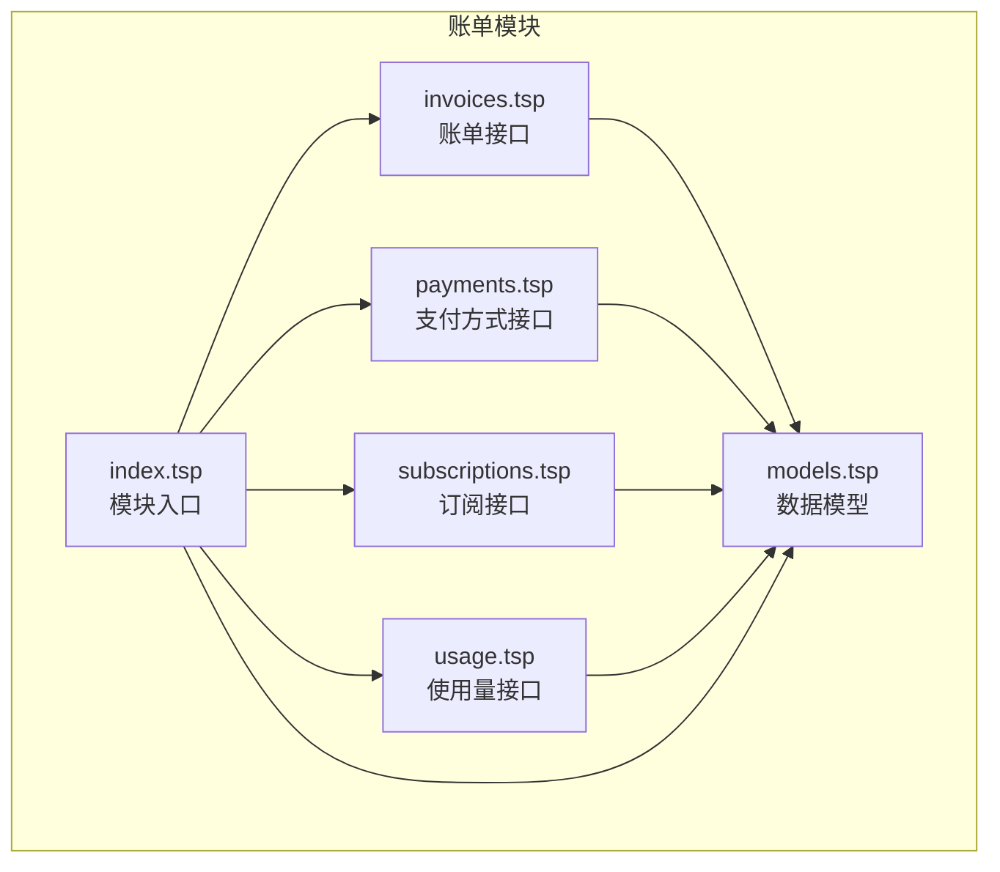
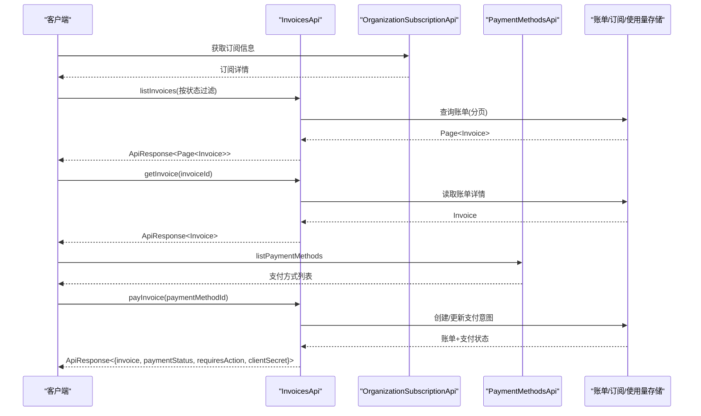
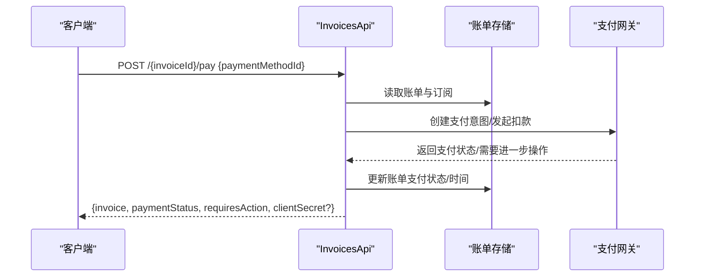
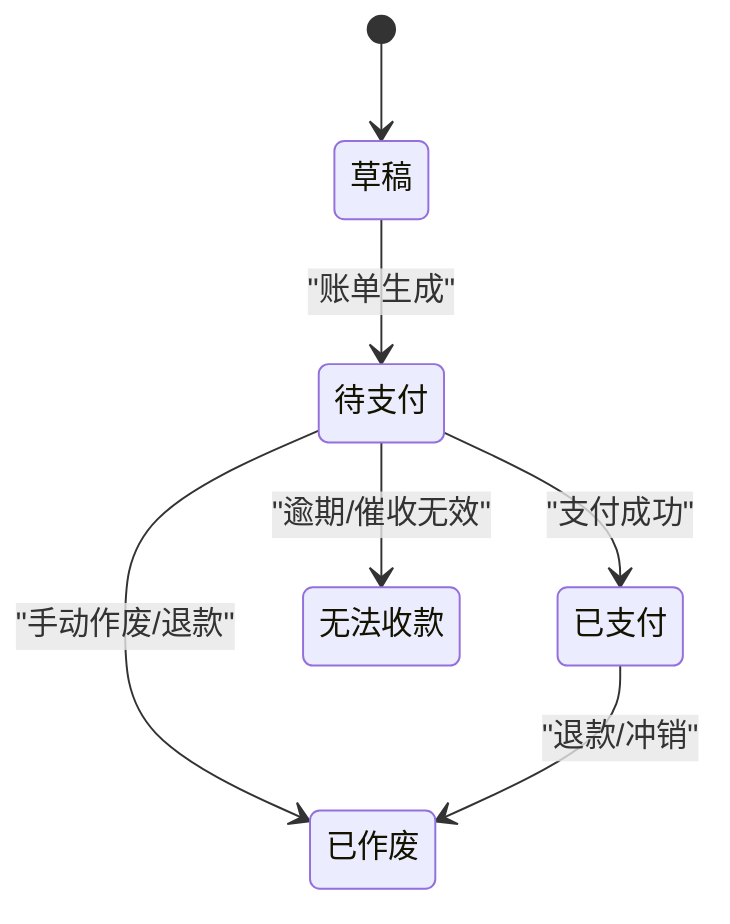
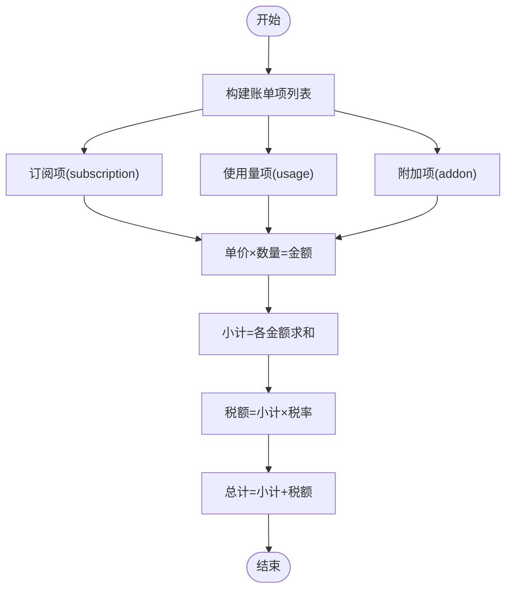
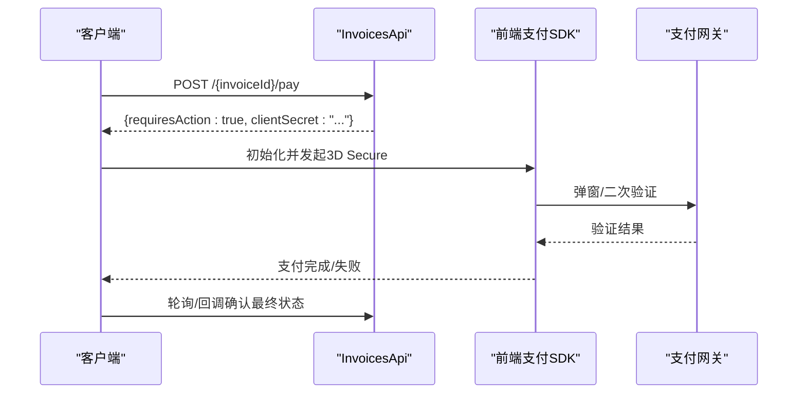
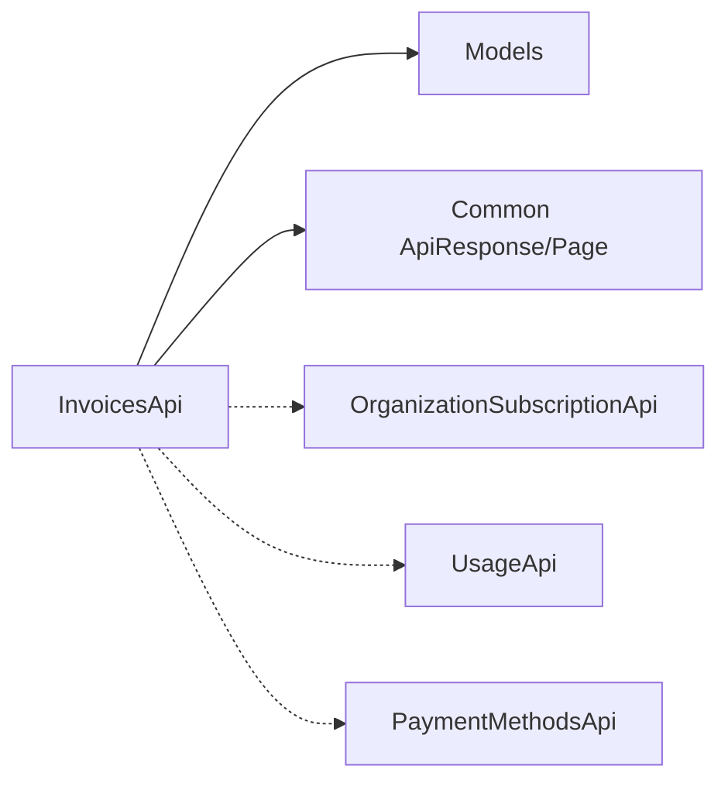

# 账单管理

<cite>
**本文引用的文件**
- [api/billing/invoices.tsp](file://api/billing/invoices.tsp)
- [api/billing/models.tsp](file://api/billing/models.tsp)
- [api/billing/payments.tsp](file://api/billing/payments.tsp)
- [api/billing/subscriptions.tsp](file://api/billing/subscriptions.tsp)
- [api/billing/usage.tsp](file://api/billing/usage.tsp)
- [api/shared/common.tsp](file://api/shared/common.tsp)
- [api/billing/index.tsp](file://api/billing/index.tsp)
</cite>

## 目录
1. [简介](#简介)
2. [项目结构](#项目结构)
3. [核心组件](#核心组件)
4. [架构概览](#架构概览)
5. [详细组件分析](#详细组件分析)
6. [依赖关系分析](#依赖关系分析)
7. [性能考量](#性能考量)
8. [故障排查指南](#故障排查指南)
9. [结论](#结论)
10. [附录](#附录)

## 简介
本文件面向nexusbook-api的账单管理模块，系统化阐述InvoicesApi接口能力：listInvoices支持按状态过滤的分页查询；getInvoice获取单个账单的详细信息；payInvoice处理账单支付流程，并重点解析payInvoice响应中的requiresAction与clientSecret字段在3D Secure等强认证场景下的使用方式。同时，文档深入说明账单状态机（草稿、待支付、已支付、已作废、无法收款等）及其转换条件，解释账单项目（invoice items）的构成与计算逻辑（周期性费用、一次性费用、税费），并给出账单生成时机、重试机制与与支付网关对账流程的建议性说明。

## 项目结构
账单管理模块位于api/billing目录下，采用按功能域划分的文件组织方式：
- invoices.tsp：账单接口定义（listInvoices、getInvoice、payInvoice）
- models.tsp：账单、订阅、支付方式、使用量等核心数据模型
- payments.tsp：支付方式管理接口（与账单支付流程配合）
- subscriptions.tsp：订阅生命周期管理（影响账单生成与状态）
- usage.tsp：使用量与配额监控（影响账单项目构成）
- index.tsp：模块入口，统一导出各子模块

图表来源
- [api/billing/index.tsp](file://api/billing/index.tsp#L1-L11)
- [api/billing/invoices.tsp](file://api/billing/invoices.tsp#L1-L76)
- [api/billing/models.tsp](file://api/billing/models.tsp#L1-L444)
- [api/billing/payments.tsp](file://api/billing/payments.tsp#L1-L75)
- [api/billing/subscriptions.tsp](file://api/billing/subscriptions.tsp#L1-L107)
- [api/billing/usage.tsp](file://api/billing/usage.tsp#L1-L68)

章节来源
- [api/billing/index.tsp](file://api/billing/index.tsp#L1-L11)

## 核心组件
- InvoicesApi接口族
  - listInvoices：按组织ID分页查询账单，支持按InvoiceStatus过滤，返回Page<Invoice>
  - getInvoice：按组织ID与账单ID获取账单详情
  - payInvoice：提交支付请求，返回包含账单、支付状态、是否需要进一步操作、以及3D Secure所需的clientSecret
- 数据模型
  - Invoice：账单实体，包含状态、小计、税额、总计、货币、账单项、计费周期、到期日、支付时间、支付意图ID、账单URL/PDF等
  - InvoiceItem：账单项，包含描述、数量、单价、金额、类型（subscription/usage/addon）
  - InvoiceStatus：账单状态枚举（draft/open/paid/void_status/uncollectible）
  - PaymentMethod：支付方式，包含类型、是否默认、卡号后四位、有效期、账单邮箱等
  - OrganizationSubscription：组织订阅，包含状态、计费周期、取消时间等
  - OrganizationUsage：组织使用量，包含成员、工作区、文档、存储、API调用、实时会话等指标
- 通用响应与分页
  - ApiResponse<T>：统一响应结构，包含success、code、message、payload
  - Page<T>：分页结构，包含items、page、pageSize、total

章节来源
- [api/billing/invoices.tsp](file://api/billing/invoices.tsp#L1-L76)
- [api/billing/models.tsp](file://api/billing/models.tsp#L69-L82)
- [api/billing/models.tsp](file://api/billing/models.tsp#L259-L332)
- [api/billing/models.tsp](file://api/billing/models.tsp#L334-L366)
- [api/billing/models.tsp](file://api/billing/models.tsp#L214-L257)
- [api/billing/models.tsp](file://api/billing/models.tsp#L367-L444)
- [api/shared/common.tsp](file://api/shared/common.tsp#L153-L203)

## 架构概览
账单管理模块围绕“账单”这一核心实体展开，通过订阅与使用量驱动账单生成，通过支付方式完成支付，并以统一的ApiResponse/Page响应格式对外提供服务。

图表来源
- [api/billing/invoices.tsp](file://api/billing/invoices.tsp#L1-L76)
- [api/billing/payments.tsp](file://api/billing/payments.tsp#L1-L75)
- [api/billing/subscriptions.tsp](file://api/billing/subscriptions.tsp#L1-L107)
- [api/shared/common.tsp](file://api/shared/common.tsp#L153-L203)

## 详细组件分析

### InvoicesApi接口族
- listInvoices
  - 输入：organizationId、status(可选)、page、pageSize(默认1/20)
  - 输出：ApiResponse<Page<Invoice>>
  - 适用场景：后台管理、财务报表、客户侧账单列表
- getInvoice
  - 输入：organizationId、invoiceId
  - 输出：ApiResponse<Invoice>
  - 适用场景：账单详情展示、PDF下载、支付入口
- payInvoice
  - 输入：organizationId、invoiceId、request.paymentMethodId
  - 输出：ApiResponse<{invoice, paymentStatus, requiresAction, clientSecret?}>
  - 关键字段说明：
    - requiresAction：当支付需要进一步操作（如3D Secure验证）时为true
    - clientSecret：用于前端发起3D Secure等强认证流程的令牌
  - 适用场景：在线支付、支付网关回调后的状态同步

图表来源
- [api/billing/invoices.tsp](file://api/billing/invoices.tsp#L50-L76)
- [api/billing/models.tsp](file://api/billing/models.tsp#L277-L332)

章节来源
- [api/billing/invoices.tsp](file://api/billing/invoices.tsp#L1-L76)

### 账单状态机与转换条件
- 状态枚举
  - draft：草稿
  - open：待支付
  - paid：已支付
  - void_status：已作废
  - uncollectible：无法收款
- 转换条件（基于模型字段与业务语义）
  - draft → open：账单生成并进入计费周期
  - open → paid：收到支付网关确认且满足入账条件
  - open → void_status：手动作废或退款导致
  - open → uncollectible：逾期超过阈值且催收无效
  - paid → void_status：发生退款或冲销
  - 注：具体触发条件需结合订阅状态、到期日、支付时间、退款记录等综合判定

图表来源
- [api/billing/models.tsp](file://api/billing/models.tsp#L69-L82)
- [api/billing/models.tsp](file://api/billing/models.tsp#L277-L332)

章节来源
- [api/billing/models.tsp](file://api/billing/models.tsp#L69-L82)
- [api/billing/models.tsp](file://api/billing/models.tsp#L277-L332)

### 账单项目（InvoiceItem）构成与计算逻辑
- 账单项类型
  - subscription：订阅周期性费用
  - usage：按使用量计费
  - addon：附加项（一次性或周期性）
- 计算逻辑
  - 单价×数量=金额
  - 小计=各账单项金额之和
  - 税额=按税率计算
  - 总计=小计+税额
- 与订阅/使用量的关系
  - subscription：来源于订阅计划与计费周期
  - usage：来源于usage.tsp中的指标统计
  - addon：可由业务配置或促销活动产生

图表来源
- [api/billing/models.tsp](file://api/billing/models.tsp#L259-L308)
- [api/billing/models.tsp](file://api/billing/models.tsp#L277-L332)
- [api/billing/usage.tsp](file://api/billing/usage.tsp#L1-L68)

章节来源
- [api/billing/models.tsp](file://api/billing/models.tsp#L259-L308)
- [api/billing/models.tsp](file://api/billing/models.tsp#L277-L332)
- [api/billing/usage.tsp](file://api/billing/usage.tsp#L1-L68)

### 3D Secure与强认证场景：requiresAction与clientSecret
- requiresAction
  - 当支付流程需要用户侧进一步操作（如3D Secure弹窗、二次验证）时，返回true
- clientSecret
  - 由支付网关下发，前端在SDK中使用该密钥完成强认证
- 流程要点
  - 后端payInvoice返回requiresAction=true且携带clientSecret
  - 前端使用clientSecret初始化支付SDK，完成认证
  - 认证完成后，前端轮询或接收回调，确认最终支付状态

图表来源
- [api/billing/invoices.tsp](file://api/billing/invoices.tsp#L50-L76)

章节来源
- [api/billing/invoices.tsp](file://api/billing/invoices.tsp#L50-L76)

### 账单生成时机、重试机制与对账流程（建议性说明）
- 账单生成时机
  - 订阅生效或变更生效时生成下一周期账单
  - 使用量超出配额或达到计费阈值时生成usage类账单项
- 重试机制
  - 对于支付失败的账单，可在一定窗口内自动重试
  - 重试策略应考虑幂等性与并发控制
- 对账流程
  - 定期拉取支付网关对账单，比对账单金额、状态与系统记录
  - 对差异进行人工复核与调整，确保账实一致

[本节为概念性说明，不直接分析具体源码文件]

## 依赖关系分析
- InvoicesApi依赖
  - models.tsp：Invoice、InvoiceItem、InvoiceStatus、PaymentMethod等模型
  - shared/common.tsp：ApiResponse、Page等通用响应结构
- 与其他模块的耦合
  - 与subscriptions.tsp：订阅状态与计费周期直接影响账单生成
  - 与usage.tsp：使用量指标决定usage类账单项
  - 与payments.tsp：支付方式列表与默认支付方式选择

图表来源
- [api/billing/invoices.tsp](file://api/billing/invoices.tsp#L1-L76)
- [api/billing/models.tsp](file://api/billing/models.tsp#L1-L444)
- [api/shared/common.tsp](file://api/shared/common.tsp#L153-L203)
- [api/billing/subscriptions.tsp](file://api/billing/subscriptions.tsp#L1-L107)
- [api/billing/usage.tsp](file://api/billing/usage.tsp#L1-L68)
- [api/billing/payments.tsp](file://api/billing/payments.tsp#L1-L75)

章节来源
- [api/billing/invoices.tsp](file://api/billing/invoices.tsp#L1-L76)
- [api/billing/models.tsp](file://api/billing/models.tsp#L1-L444)
- [api/shared/common.tsp](file://api/shared/common.tsp#L153-L203)
- [api/billing/subscriptions.tsp](file://api/billing/subscriptions.tsp#L1-L107)
- [api/billing/usage.tsp](file://api/billing/usage.tsp#L1-L68)
- [api/billing/payments.tsp](file://api/billing/payments.tsp#L1-L75)

## 性能考量
- 分页查询
  - listInvoices默认page=1、pageSize=20，建议前端按需调整，避免过大页码与页尺寸
- 状态过滤
  - 在数据库层面对InvoiceStatus建立索引，提升过滤查询性能
- 响应序列化
  - Invoice包含较多字段，建议按需返回（如仅列表页不需要完整items）

[本节提供一般性指导，不直接分析具体源码文件]

## 故障排查指南
- 常见问题
  - 支付失败：检查支付方式有效性、余额/限额、网络异常
  - 3D Secure未完成：确认前端正确使用clientSecret并完成弹窗验证
  - 账单状态异常：核对订阅状态、到期日、退款记录
- 排查步骤
  - 通过getInvoice确认账单详情与支付意图ID
  - 通过listInvoices按status过滤定位问题账单
  - 对账单状态与支付网关对账单进行交叉比对

章节来源
- [api/billing/invoices.tsp](file://api/billing/invoices.tsp#L1-L76)
- [api/billing/models.tsp](file://api/billing/models.tsp#L277-L332)

## 结论
本文系统梳理了nexusbook-api账单管理模块的接口能力与数据模型，明确了InvoicesApi的分页查询、详情获取与支付流程，并深入解析了账单状态机、账单项构成与计算逻辑，以及3D Secure场景下requiresAction与clientSecret的使用方式。结合订阅、使用量与支付方式模块，可形成从“订阅—账单—支付”的闭环。建议在生产环境中完善重试与对账机制，保障账务一致性与用户体验。

## 附录
- 关键字段速览
  - Invoice：status、subtotal、tax、total、currency、items、periodStart/periodEnd、dueDate、paidAt、paymentIntentId、invoiceUrl、invoicePdfUrl
  - InvoiceItem：description、quantity、unitPrice、amount、type
  - PaymentMethod：type、isDefault、cardLast4、cardBrand、expiryMonth、expiryYear、billingEmail
- 响应结构
  - ApiResponse：success、code、message、payload
  - Page：items、page、pageSize、total

章节来源
- [api/billing/models.tsp](file://api/billing/models.tsp#L259-L332)
- [api/billing/models.tsp](file://api/billing/models.tsp#L334-L366)
- [api/shared/common.tsp](file://api/shared/common.tsp#L153-L203)