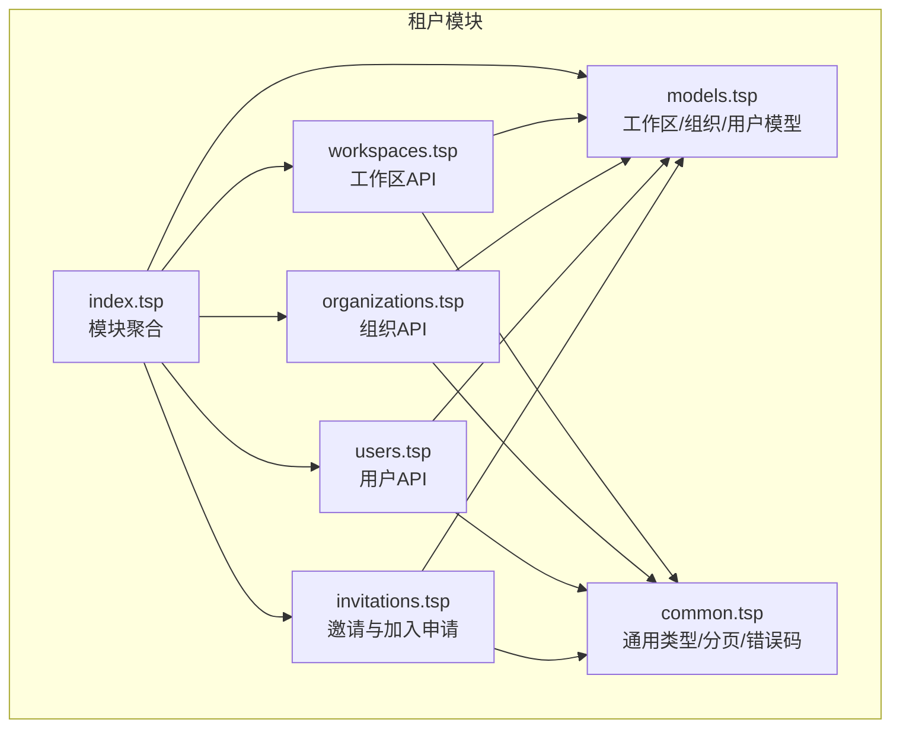
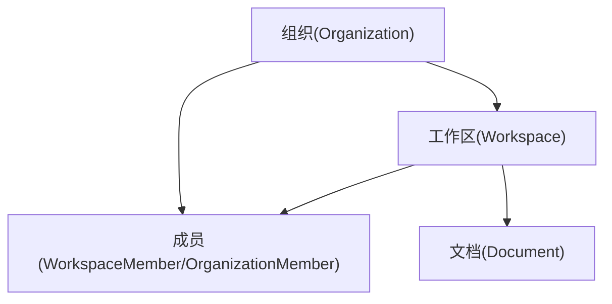
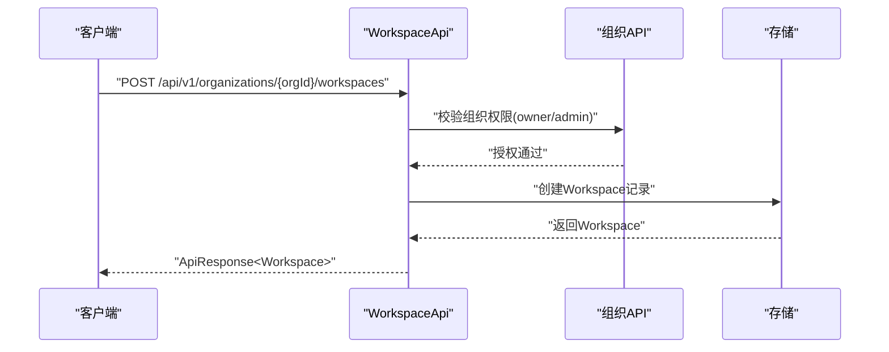
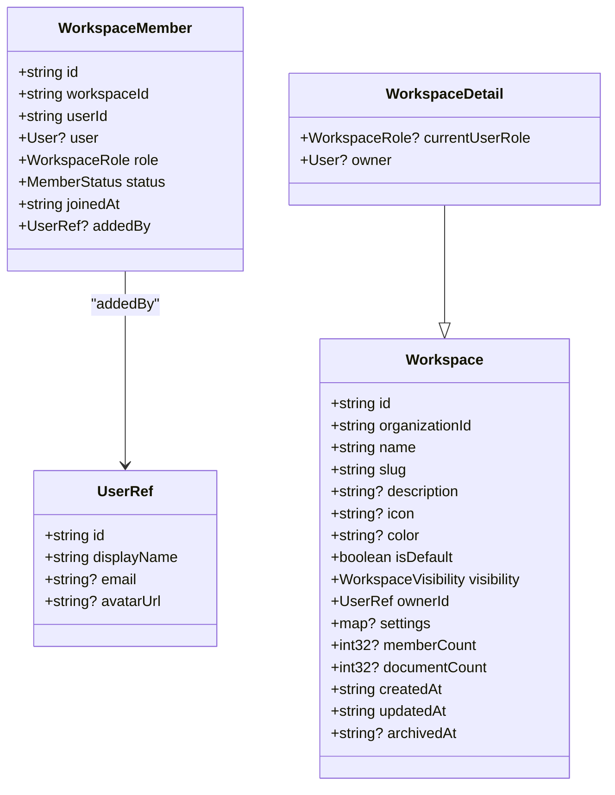
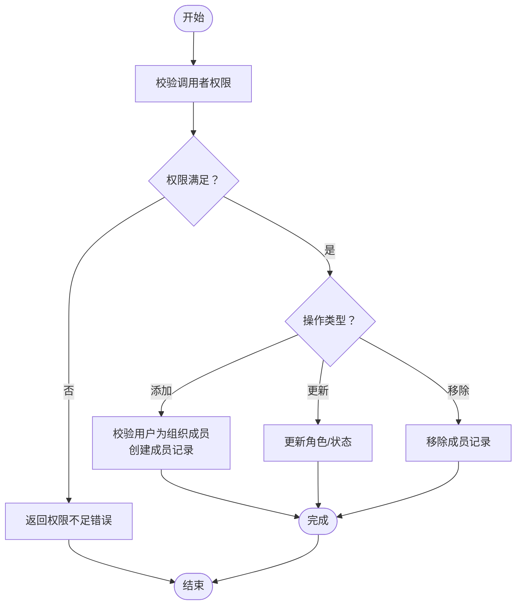
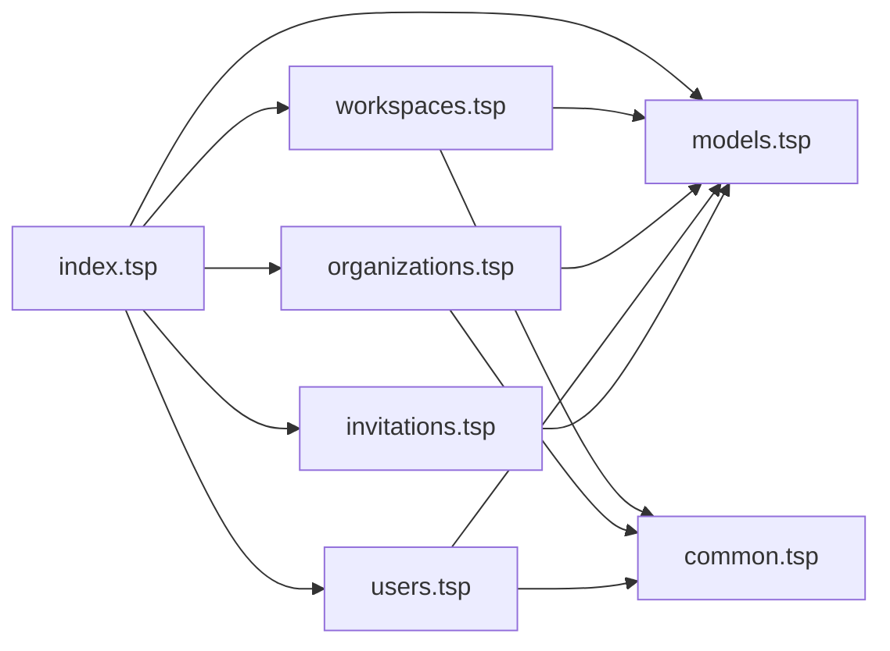

# 工作区管理

<cite>
**本文引用的文件**
- [workspaces.tsp](file://api/tenant/workspaces.tsp)
- [models.tsp](file://api/tenant/models.tsp)
- [organizations.tsp](file://api/tenant/organizations.tsp)
- [users.tsp](file://api/tenant/users.tsp)
- [index.tsp](file://api/tenant/index.tsp)
- [common.tsp](file://api/shared/common.tsp)
- [invitations.tsp](file://api/tenant/invitations.tsp)
</cite>

## 目录
1. [简介](#简介)
2. [项目结构](#项目结构)
3. [核心组件](#核心组件)
4. [架构概览](#架构概览)
5. [详细组件分析](#详细组件分析)
6. [依赖分析](#依赖分析)
7. [性能考虑](#性能考虑)
8. [故障排查指南](#故障排查指南)
9. [结论](#结论)
10. [附录](#附录)

## 简介
本章节面向“工作区管理”的业务目标，系统化阐述工作区（Workspace）作为业务协作单元的角色、与组织的隶属关系、在文档层级结构中的定位（组织级 vs 工作区级文档），并全面文档化工作区API（workspaces.tsp）的功能边界与使用方法。同时，对工作区模型关键属性、角色权限差异、成员管理流程、数据隔离机制以及大规模列表查询的分页与过滤优化策略进行深入说明，并提供典型使用场景示例。

## 项目结构
工作区管理能力由租户模块统一提供，核心文件分布如下：
- 租户模块入口：聚合用户、组织、工作区、邀请等API与模型
- 工作区API：定义工作区的创建、查询、更新、归档/恢复、删除、成员管理等接口
- 工作区模型：定义工作区、工作区可见性、工作区角色、工作区成员等数据结构
- 通用类型：统一响应格式、分页、过滤、错误码等
- 组织与用户：工作区隶属于组织，用户在组织与工作区中承担不同角色
- 邀请：组织层面的成员邀请与加入申请流程，间接影响工作区成员来源

图表来源
- [index.tsp](file://api/tenant/index.tsp#L1-L24)
- [workspaces.tsp](file://api/tenant/workspaces.tsp#L1-L631)
- [models.tsp](file://api/tenant/models.tsp#L1-L942)
- [organizations.tsp](file://api/tenant/organizations.tsp#L1-L498)
- [users.tsp](file://api/tenant/users.tsp#L1-L268)
- [invitations.tsp](file://api/tenant/invitations.tsp#L1-L548)
- [common.tsp](file://api/shared/common.tsp#L1-L742)

章节来源
- [index.tsp](file://api/tenant/index.tsp#L1-L24)

## 核心组件
- 工作区API（WorkspaceApi）：提供工作区生命周期管理与成员管理的REST接口
- 工作区模型（Workspace、WorkspaceMember、WorkspaceRole、WorkspaceVisibility）：定义工作区实体、成员关系、角色与可见性
- 组织模型（Organization、OrganizationRole、MemberStatus）：工作区隶属于组织，成员在组织与工作区分别承担不同角色
- 用户模型（User、UserRef）：工作区成员来源于组织成员
- 通用类型（ApiResponse、Page、ErrorCode）：统一响应结构与错误码
- 邀请模型（Invitation、JoinRequest）：组织成员来源的重要渠道

章节来源
- [workspaces.tsp](file://api/tenant/workspaces.tsp#L171-L631)
- [models.tsp](file://api/tenant/models.tsp#L513-L718)
- [organizations.tsp](file://api/tenant/organizations.tsp#L1-L498)
- [users.tsp](file://api/tenant/users.tsp#L1-L268)
- [common.tsp](file://api/shared/common.tsp#L153-L203)

## 架构概览
工作区管理围绕“组织-工作区-成员-文档”四层协作关系展开：
- 组织是协作的组织单元，包含多个工作区
- 工作区是业务开展的容器，承载文档与协作
- 成员在组织与工作区分别拥有角色，决定访问与操作权限
- 文档操作主要发生在工作区内，但受组织与工作区的权限控制

图表来源
- [models.tsp](file://api/tenant/models.tsp#L303-L718)
- [workspaces.tsp](file://api/tenant/workspaces.tsp#L216-L415)

## 详细组件分析

### 工作区API（WorkspaceApi）
- 路由基址：/api/v1/organizations/{organizationId}/workspaces
- 主要能力：
  - 创建工作区：POST /
  - 列出工作区：GET /（支持分页、可见性过滤、是否包含归档）
  - 获取工作区详情：GET /{workspaceId}
  - 更新工作区：PATCH /{workspaceId}
  - 归档工作区：POST /{workspaceId}/archive
  - 恢复归档工作区：POST /{workspaceId}/restore
  - 删除工作区：DELETE /{workspaceId}
  - 成员管理：
    - 列出成员：GET /{workspaceId}/members（支持分页、按角色过滤）
    - 添加成员：POST /{workspaceId}/members（用户必须是组织成员）
    - 获取成员详情：GET /{workspaceId}/members/{memberId}
    - 更新成员角色/状态：PATCH /{workspaceId}/members/{memberId}
    - 移除成员：DELETE /{workspaceId}/members/{memberId}

图表来源
- [workspaces.tsp](file://api/tenant/workspaces.tsp#L200-L215)
- [organizations.tsp](file://api/tenant/organizations.tsp#L175-L201)

章节来源
- [workspaces.tsp](file://api/tenant/workspaces.tsp#L171-L631)

### 工作区模型与关键属性
- 工作区（Workspace）
  - 标识：id、organizationId
  - 基本信息：name、slug、description、icon、color
  - 状态：isDefault、visibility（public/private）、ownerId、settings
  - 统计：memberCount、documentCount
  - 时间：createdAt、updatedAt、archivedAt
- 工作区可见性（WorkspaceVisibility）：public（组织内成员可见）、private（仅成员可见）
- 工作区角色（WorkspaceRole）：owner（可管理）、editor（可编辑文档）、viewer（只读）
- 工作区成员（WorkspaceMember）：workspaceId、userId、role、status、joinedAt、addedBy
- 工作区详情（WorkspaceDetail）：在Workspace基础上扩展currentUserRole与owner信息

图表来源
- [models.tsp](file://api/tenant/models.tsp#L533-L718)

章节来源
- [models.tsp](file://api/tenant/models.tsp#L513-L718)

### 组织与工作区的隶属关系
- 工作区隶属于组织（organizationId），工作区的可见性与成员来源受组织策略影响
- 组织角色（OrganizationRole）：owner、admin、member、guest
- 组织成员（OrganizationMember）：包含用户在组织内的角色与状态
- 工作区成员必须来自组织成员，添加成员时需校验用户为组织成员

章节来源
- [models.tsp](file://api/tenant/models.tsp#L303-L443)
- [workspaces.tsp](file://api/tenant/workspaces.tsp#L472-L511)

### 成员管理流程
- 列出成员：GET /{workspaceId}/members（支持分页与按角色过滤）
- 添加成员：POST /{workspaceId}/members（需workspace.owner；用户必须是组织成员）
- 更新成员：PATCH /{workspaceId}/members/{memberId}（需workspace.owner；可改role/status）
- 移除成员：DELETE /{workspaceId}/members/{memberId}（需workspace.owner）

图表来源
- [workspaces.tsp](file://api/tenant/workspaces.tsp#L424-L623)
- [models.tsp](file://api/tenant/models.tsp#L444-L512)

章节来源
- [workspaces.tsp](file://api/tenant/workspaces.tsp#L424-L623)

### 工作区角色与权限差异
- owner：可管理工作区与成员，具备最高权限
- editor：可创建与编辑文档
- viewer：只读权限
- 组织owner/admin：在特定操作上可替代或辅助工作区owner执行归档/恢复/删除等动作

章节来源
- [models.tsp](file://api/tenant/models.tsp#L638-L661)
- [workspaces.tsp](file://api/tenant/workspaces.tsp#L334-L410)

### 工作区与文档层级定位
- 工作区是业务协作的容器，大多数文档操作在工作区内进行
- 组织级文档与工作区级文档的划分：组织维度用于跨工作区的治理与策略，工作区维度用于具体业务协作与文档管理

章节来源
- [models.tsp](file://api/tenant/models.tsp#L533-L540)

### 使用示例
- 创建销售团队工作区：组织owner/admin创建工作区，设置slug唯一、visibility为private或public，配置主题色与图标
- 为项目设置独立工作区：在组织下创建独立工作区，分配owner/editor/viewer角色，确保成员来源为组织成员
- 迁移文档资源：通过工作区归档/恢复与成员角色调整，配合组织策略实现资源迁移与权限收敛

章节来源
- [workspaces.tsp](file://api/tenant/workspaces.tsp#L180-L215)
- [organizations.tsp](file://api/tenant/organizations.tsp#L175-L201)

## 依赖分析
- 模块聚合：index.tsp导入models、users、organizations、workspaces、invitations，形成租户管理模块
- API依赖：WorkspaceApi依赖Workspace、WorkspaceMember、WorkspaceRole、WorkspaceVisibility等模型；依赖ApiResponse、Page等通用类型
- 组织与工作区：Workspace.organizationId指向Organization；WorkspaceMember.userId来自User；Invitations与JoinRequests影响组织成员来源

图表来源
- [index.tsp](file://api/tenant/index.tsp#L1-L24)
- [workspaces.tsp](file://api/tenant/workspaces.tsp#L1-L631)
- [models.tsp](file://api/tenant/models.tsp#L1-L942)
- [organizations.tsp](file://api/tenant/organizations.tsp#L1-L498)
- [users.tsp](file://api/tenant/users.tsp#L1-L268)
- [invitations.tsp](file://api/tenant/invitations.tsp#L1-L548)
- [common.tsp](file://api/shared/common.tsp#L1-L742)

章节来源
- [index.tsp](file://api/tenant/index.tsp#L1-L24)

## 性能考虑
- 列表查询分页与过滤
  - 工作区列表：支持page、pageSize、visibility、includeArchived过滤
  - 成员列表：支持page、pageSize、role过滤
  - 建议：合理设置pageSize（如20-100），优先服务端过滤而非全量拉取后客户端过滤
- 大规模工作区列表优化
  - 使用includeArchived=false减少扫描范围
  - 使用visibility过滤缩小候选集
  - 对高频查询建立索引（organizationId、visibility、archivedAt）
- 成员管理优化
  - 批量成员变更建议采用批量接口（若未来扩展）
  - 成员列表分页避免一次性加载过多数据
- 错误码与响应一致性
  - 使用ApiResponse统一错误码（如WORKSPACE_NOT_FOUND、WORKSPACE_PERMISSION_DENIED），便于前端快速定位问题

章节来源
- [workspaces.tsp](file://api/tenant/workspaces.tsp#L216-L261)
- [workspaces.tsp](file://api/tenant/workspaces.tsp#L424-L470)
- [common.tsp](file://api/shared/common.tsp#L80-L152)

## 故障排查指南
- 权限相关
  - 工作区操作需对应角色：owner/editor/viewer；组织owner/admin在特定操作上可辅助
  - 成员添加需用户为组织成员
- 常见错误码
  - WORKSPACE_NOT_FOUND：工作区不存在
  - WORKSPACE_PERMISSION_DENIED：权限不足
  - WORKSPACE_MEMBER_NOT_FOUND：成员不存在
  - ORG_MEMBER_NOT_FOUND：组织成员不存在
- 响应结构
  - 使用ApiResponse结构，关注success、code、message、payload，结合错误码快速定位问题

章节来源
- [workspaces.tsp](file://api/tenant/workspaces.tsp#L293-L410)
- [common.tsp](file://api/shared/common.tsp#L153-L177)
- [common.tsp](file://api/shared/common.tsp#L80-L152)

## 结论
工作区管理以“组织-工作区-成员-文档”为核心协作模型，通过清晰的权限边界与统一的API契约，支撑大规模团队的文档协作与资源治理。建议在生产环境中：
- 严格遵循角色权限约束，避免越权操作
- 使用分页与过滤优化大规模列表查询
- 通过邀请与加入申请流程规范成员来源
- 借助统一响应与错误码体系提升可观测性与可维护性

## 附录
- API参考要点
  - 工作区列表：支持分页、可见性过滤、是否包含归档
  - 成员列表：支持分页、按角色过滤
  - 成员管理：添加、更新、移除均需相应权限
- 数据模型要点
  - WorkspaceVisibility：public/private
  - WorkspaceRole：owner/editor/viewer
  - 组织与工作区的隶属关系与成员来源

章节来源
- [workspaces.tsp](file://api/tenant/workspaces.tsp#L216-L261)
- [workspaces.tsp](file://api/tenant/workspaces.tsp#L424-L470)
- [models.tsp](file://api/tenant/models.tsp#L513-L718)