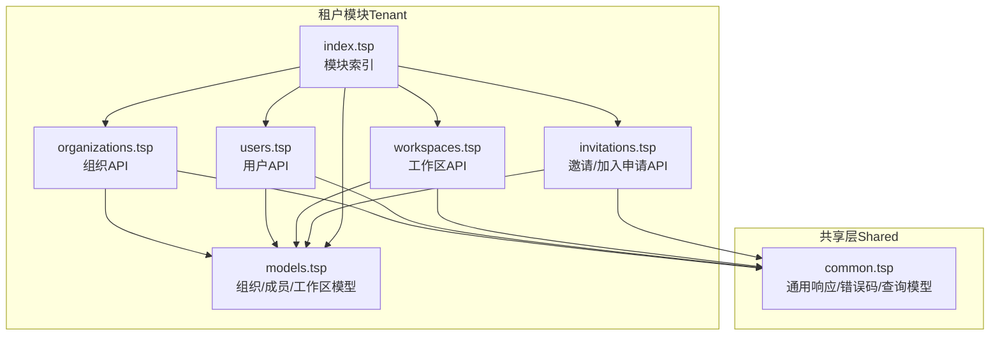
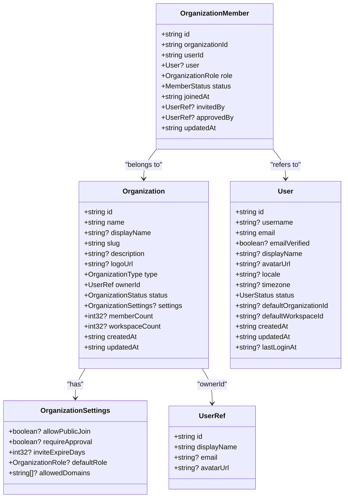
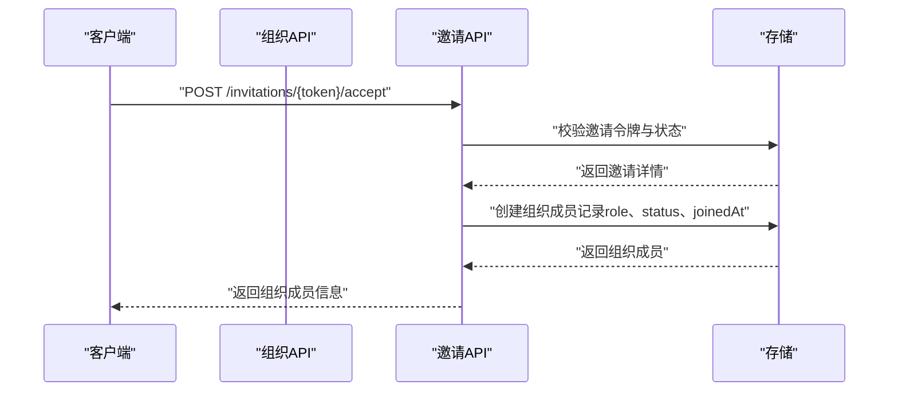
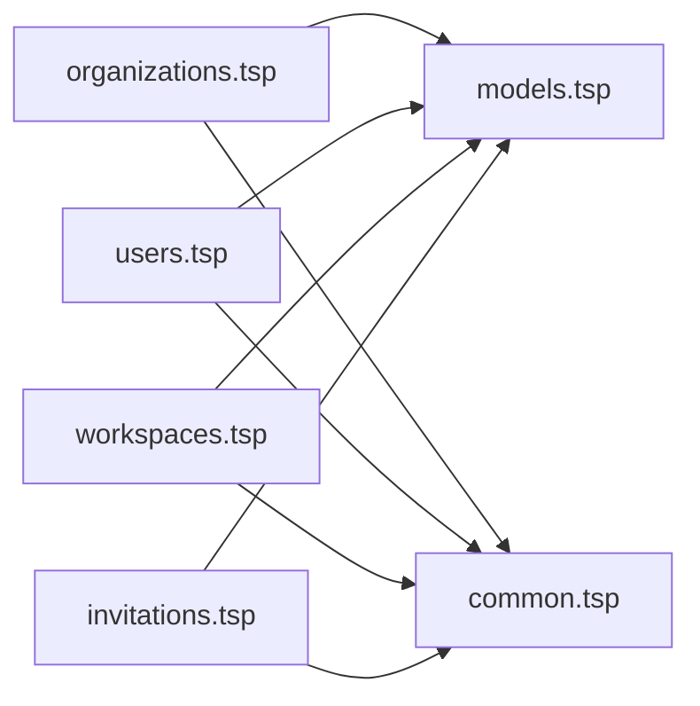

# 组织管理

<cite>
**本文引用的文件**
- [organizations.tsp](file://api/tenant/organizations.tsp)
- [models.tsp](file://api/tenant/models.tsp)
- [users.tsp](file://api/tenant/users.tsp)
- [workspaces.tsp](file://api/tenant/workspaces.tsp)
- [invitations.tsp](file://api/tenant/invitations.tsp)
- [index.tsp](file://api/tenant/index.tsp)
- [common.tsp](file://api/shared/common.tsp)
</cite>

## 目录
1. [简介](#简介)
2. [项目结构](#项目结构)
3. [核心组件](#核心组件)
4. [架构概览](#架构概览)
5. [详细组件分析](#详细组件分析)
6. [依赖分析](#依赖分析)
7. [性能考虑](#性能考虑)
8. [故障排查指南](#故障排查指南)
9. [结论](#结论)
10. [附录](#附录)

## 简介
本章节面向“组织管理”功能，围绕组织（Organization）作为数据隔离边界的核心作用展开，系统性阐述组织类型（个人、团队、企业）的差异与适用场景；全面解析组织API（organizations.tsp）提供的能力，包括创建组织、获取组织详情、更新组织信息、删除组织以及成员管理（添加、更新、移除成员、离开组织）等；文档化组织模型的关键字段（名称、slug、所有者、状态、设置等）及其业务含义；说明组织级策略配置如何影响成员加入流程与权限分配；给出典型使用示例与最佳实践；最后讨论组织数据一致性保障机制与基于组织ID的查询性能优化策略。

## 项目结构
组织管理功能位于租户域（Tenant）模块，采用“按领域划分”的文件组织方式，核心文件如下：
- 组织API定义：api/tenant/organizations.tsp
- 核心数据模型与枚举：api/tenant/models.tsp
- 用户API与组织成员关系：api/tenant/users.tsp
- 工作区API（组织内的资源容器）：api/tenant/workspaces.tsp
- 邀请与加入申请API（成员加入流程）：api/tenant/invitations.tsp
- 模块入口索引：api/tenant/index.tsp
- 通用响应与错误码：api/shared/common.tsp

图表来源
- [index.tsp](file://api/tenant/index.tsp#L1-L24)
- [organizations.tsp](file://api/tenant/organizations.tsp#L1-L60)
- [models.tsp](file://api/tenant/models.tsp#L1-L60)
- [users.tsp](file://api/tenant/users.tsp#L1-L40)
- [workspaces.tsp](file://api/tenant/workspaces.tsp#L1-L40)
- [invitations.tsp](file://api/tenant/invitations.tsp#L1-L40)
- [common.tsp](file://api/shared/common.tsp#L1-L40)

章节来源
- [index.tsp](file://api/tenant/index.tsp#L1-L24)

## 核心组件
- 组织模型（Organization）：包含id、name、displayName、slug、description、logoUrl、type、ownerId、status、settings、memberCount、workspaceCount、createdAt、updatedAt等字段，用于描述组织的基本信息与统计。
- 组织类型（OrganizationType）：personal、team、enterprise，分别对应个人组织、团队组织与企业组织，体现不同规模与治理复杂度。
- 组织状态（OrganizationStatus）：active、suspended、archived，用于生命周期管理。
- 组织设置（OrganizationSettings）：allowPublicJoin、requireApproval、inviteExpireDays、defaultRole、allowedDomains等，决定成员加入策略与默认权限。
- 组织角色（OrganizationRole）：owner、admin、member、guest，定义成员在组织内的权限范围。
- 成员状态（MemberStatus）：active、suspended，控制成员可用性。
- 组织成员（OrganizationMember）：记录成员关系、角色、状态、加入时间、邀请人/审批人等。
- 通用响应与错误码（ApiResponse、ErrorCode）：统一的响应结构与错误码体系，便于前端与集成方处理。

章节来源
- [models.tsp](file://api/tenant/models.tsp#L217-L443)
- [organizations.tsp](file://api/tenant/organizations.tsp#L34-L168)
- [common.tsp](file://api/shared/common.tsp#L80-L177)

## 架构概览
组织管理围绕“组织”这一数据隔离边界构建，组织内包含多个工作区，成员在组织维度获得角色与权限，再在工作区维度获得具体访问控制。成员加入可通过邀请或申请两种路径，最终形成组织成员记录。

图表来源
- [models.tsp](file://api/tenant/models.tsp#L303-L511)
- [models.tsp](file://api/tenant/models.tsp#L267-L301)

## 详细组件分析

### 组织API（organizations.tsp）
- 路由基址：/api/v1/organizations
- 主要端点
  - 创建组织：POST /
  - 获取组织详情：GET /{organizationId}
  - 更新组织信息：PATCH /{organizationId}
  - 删除组织：DELETE /{organizationId}
  - 列出成员：GET /{organizationId}/members
  - 添加成员：POST /{organizationId}/members
  - 获取成员详情：GET /{organizationId}/members/{memberId}
  - 更新成员角色：PATCH /{organizationId}/members/{memberId}
  - 移除成员：DELETE /{organizationId}/members/{memberId}
  - 离开组织：POST /{organizationId}/leave

- 权限与约束
  - 更新、删除组织：仅owner可执行
  - 添加/更新/移除成员：需owner或admin权限
  - 离开组织：普通成员可发起，owner不可主动离开（需先转让所有权）

- 关键请求/响应模型
  - CreateOrganizationRequest：name、slug、displayName、description、type、settings
  - UpdateOrganizationRequest：name、displayName、description、logoUrl、settings
  - AddOrganizationMemberRequest：userId、role（默认member）
  - UpdateOrganizationMemberRequest：role、status

- 成员管理细节
  - 列表支持按role、status过滤与search（名称、邮箱）
  - 成员详情包含用户信息、角色、状态、加入时间、邀请人/审批人

章节来源
- [organizations.tsp](file://api/tenant/organizations.tsp#L170-L498)

### 组织模型与字段语义（models.tsp）
- 组织字段
  - id/name/slug：唯一标识、显示名、URL友好标识
  - displayName/description/logoUrl：品牌与描述信息
  - type：组织类型（personal/team/enterprise）
  - ownerId：所有者用户引用
  - status：组织状态（active/suspended/archived）
  - settings：组织策略（见下节）
  - memberCount/workspaceCount：统计指标
  - createdAt/updatedAt：时间戳
- 组织设置（OrganizationSettings）
  - allowPublicJoin：是否允许公开加入
  - requireApproval：加入是否需要审批
  - inviteExpireDays：邀请链接有效期（天）
  - defaultRole：新成员默认角色
  - allowedDomains：允许的邮箱域名白名单
- 角色与状态
  - OrganizationRole：owner、admin、member、guest
  - MemberStatus：active、suspended

章节来源
- [models.tsp](file://api/tenant/models.tsp#L217-L443)

### 成员加入流程（邀请与加入申请）
- 邀请（Invitation）
  - 创建邀请：POST /organizations/{organizationId}/invitations
  - 列出邀请：GET /organizations/{organizationId}/invitations
  - 接受邀请：POST /invitations/{token}/accept
  - 撤销邀请：DELETE /organizations/{organizationId}/invitations/{invitationId}
  - 拒绝邀请：POST /invitations/{token}/decline
  - 通过令牌获取邀请：GET /invitations/{token}
- 加入申请（JoinRequest）
  - 提交申请：POST /organizations/{organizationId}/join-requests
  - 列出申请：GET /organizations/{organizationId}/join-requests
  - 批准申请：POST /organizations/{organizationId}/join-requests/{requestId}/approve
  - 拒绝申请：POST /organizations/{organizationId}/join-requests/{requestId}/reject
  - 取消申请：DELETE /organizations/{organizationId}/join-requests/{requestId}

- 流程要点
  - 邀请：适合受信任成员快速加入，支持有效期与默认角色
  - 申请：适合开放或半开放组织，结合requireApproval与allowedDomains策略

章节来源
- [invitations.tsp](file://api/tenant/invitations.tsp#L1-L548)

### 用户与组织成员关系（users.tsp）
- 列出用户加入的组织：GET /users/me/organizations
- 返回包含organization与membership（角色、状态）信息
- 用于前端侧展示用户在各组织中的身份

章节来源
- [users.tsp](file://api/tenant/users.tsp#L238-L268)

### 工作区与组织的关系（workspaces.tsp）
- 工作区属于组织，组织内可创建多个工作区
- 工作区成员管理在工作区维度进行，但前提是用户必须是组织成员
- 工作区可见性（public/private）与成员角色（owner/editor/viewer）共同决定访问范围

章节来源
- [workspaces.tsp](file://api/tenant/workspaces.tsp#L1-L120)

### API调用序列（示例：接受邀请加入组织）

图表来源
- [invitations.tsp](file://api/tenant/invitations.tsp#L252-L299)
- [organizations.tsp](file://api/tenant/organizations.tsp#L340-L420)

## 依赖分析
- 模块耦合
  - organizations.tsp 依赖 models.tsp（组织/成员/角色/状态/设置）、common.tsp（ApiResponse/ErrorCode）
  - users.tsp 依赖 models.tsp（User/组织成员关系）、common.tsp
  - workspaces.tsp 依赖 models.tsp（工作区/成员/可见性）、common.tsp
  - invitations.tsp 依赖 models.tsp（邀请/加入申请）、common.tsp
- 外部依赖
  - http/openapi 注解用于生成OpenAPI文档与路由元数据
- 潜在循环依赖
  - 当前文件组织避免了直接循环导入；若后续扩展，应保持“模型定义在models.tsp，API在各自tsp中引用模型”的模式

图表来源
- [organizations.tsp](file://api/tenant/organizations.tsp#L1-L30)
- [users.tsp](file://api/tenant/users.tsp#L1-L20)
- [workspaces.tsp](file://api/tenant/workspaces.tsp#L1-L20)
- [invitations.tsp](file://api/tenant/invitations.tsp#L1-L20)
- [models.tsp](file://api/tenant/models.tsp#L1-L20)
- [common.tsp](file://api/shared/common.tsp#L1-L20)

章节来源
- [index.tsp](file://api/tenant/index.tsp#L1-L24)

## 性能考虑
- 组织ID查询优化
  - 建议在数据库层面为组织表建立复合索引：(id, status) 与 (slug, status)，以加速“按ID查询详情”和“按slug唯一性校验”
  - 对于成员列表查询，建议在成员表上建立索引：(organizationId, role, status, joinedAt)，以支持按组织+角色+状态+时间的高效筛选
- 分页与过滤
  - 列表接口支持page/pageSize，建议配合合适的索引与LIMIT/OFFSET策略，避免深分页导致的性能退化
- 缓存策略
  - 组织基本信息（名称、slug、logo、设置）可缓存短期（如几分钟），降低频繁读取压力
  - 成员列表与统计（memberCount/workspaceCount）可在写入路径上增量维护，减少实时聚合成本
- 并发与一致性
  - 创建组织时，slug唯一性校验应在事务中完成，避免竞态
  - 成员角色变更与状态变更应使用乐观锁或版本号，防止并发覆盖

## 故障排查指南
- 常见错误码（来自通用错误码）
  - ORG_NOT_FOUND：组织不存在
  - ORG_SLUG_ALREADY_EXISTS：slug重复
  - ORG_PERMISSION_DENIED：权限不足（非owner/admin执行需要权限的操作）
  - ORG_ALREADY_MEMBER / ORG_NOT_MEMBER：成员状态异常
  - ORG_CANNOT_LEAVE_AS_OWNER：owner无法主动离开
  - INVITATION_NOT_FOUND / INVITATION_EXPIRED / INVITATION_EMAIL_MISMATCH：邀请相关问题
  - JOIN_REQUEST_NOT_FOUND / JOIN_REQUEST_ALREADY_EXISTS / JOIN_REQUEST_ALREADY_PROCESSED：加入申请相关问题
- 排查步骤
  - 确认请求头Authorization与鉴权有效
  - 核对organizationId与目标组织是否存在且未归档
  - 检查调用者角色是否满足owner/admin要求
  - 对于邀请/申请，确认令牌有效性、邮箱匹配、状态是否过期或已处理
  - 对于成员管理，确认目标成员存在且非owner（owner不可移除）

章节来源
- [common.tsp](file://api/shared/common.tsp#L80-L151)

## 结论
组织管理以“组织”为核心数据隔离边界，通过组织类型、组织设置与成员角色共同定义协作边界与权限范围。组织API提供了完整的生命周期管理与成员管理能力，结合邀请与加入申请机制，既能满足封闭团队的快速协作，也能支持开放组织的合规治理。通过合理的索引设计、缓存策略与并发控制，可在保证数据一致性的前提下提升查询与写入性能。

## 附录

### 典型使用示例
- 企业客户注册新组织
  - 步骤：调用创建组织接口，选择type为企业，设置settings（如requireApproval=true、allowedDomains白名单），随后自动创建默认工作区
  - 参考端点：POST /api/v1/organizations
- 管理员配置组织白名单
  - 步骤：调用更新组织接口，设置settings.allowedDomains为允许的邮箱域名数组
  - 参考端点：PATCH /api/v1/organizations/{organizationId}
- 更新组织品牌信息
  - 步骤：调用更新组织接口，设置displayName、description、logoUrl
  - 参考端点：PATCH /api/v1/organizations/{organizationId}
- 管理员批量添加成员
  - 步骤：调用添加成员接口，传入userId与role（默认member）
  - 参考端点：POST /api/v1/organizations/{organizationId}/members
- 成员离开组织
  - 步骤：调用离开组织接口（owner需先转让所有权）
  - 参考端点：POST /api/v1/organizations/{organizationId}/leave

章节来源
- [organizations.tsp](file://api/tenant/organizations.tsp#L198-L498)
- [invitations.tsp](file://api/tenant/invitations.tsp#L133-L299)
- [users.tsp](file://api/tenant/users.tsp#L238-L268)