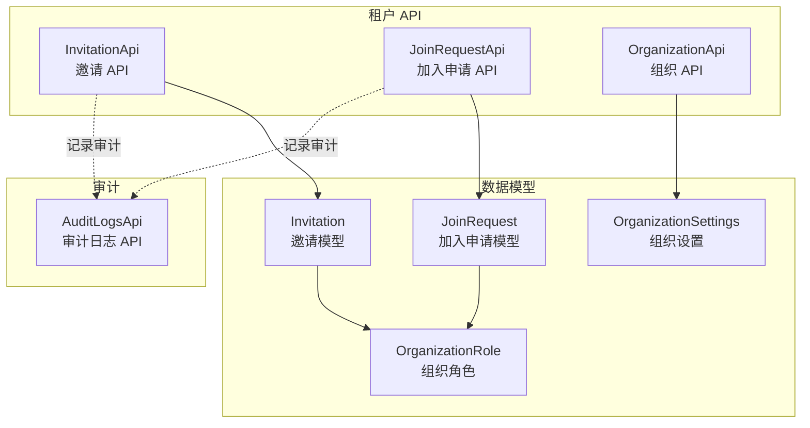
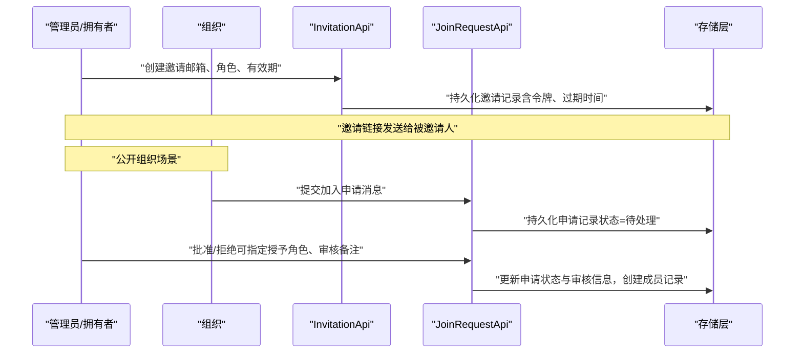
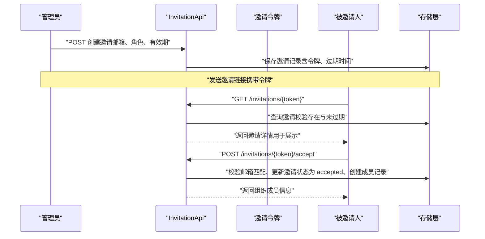
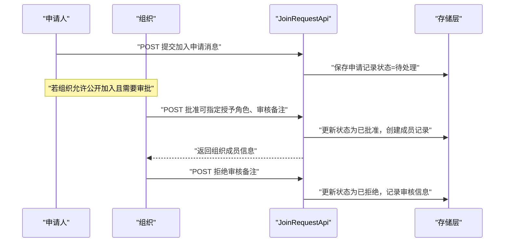
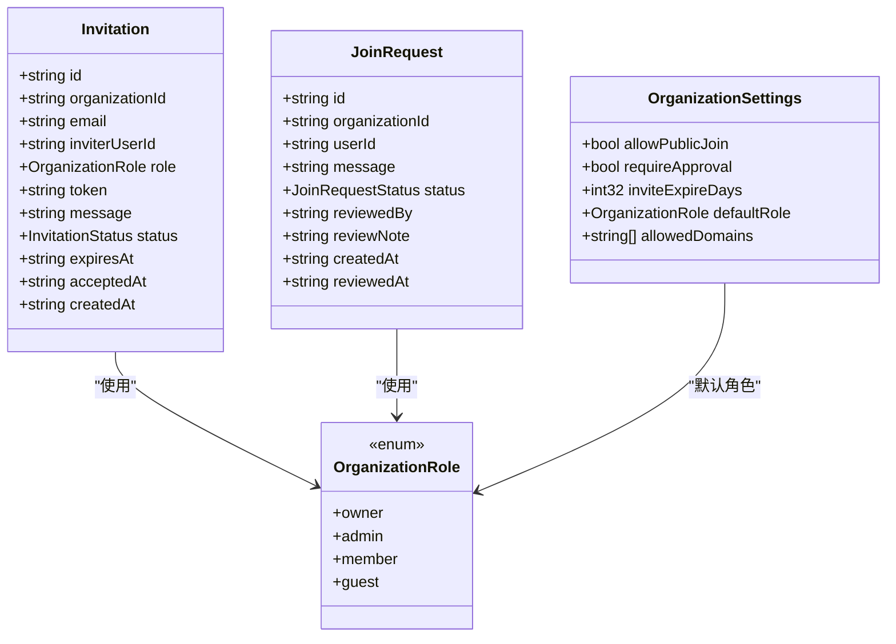
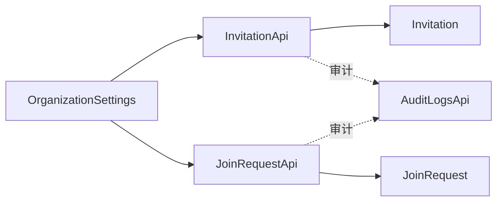

# 邀请系统

<cite>
**本文引用的文件**
- [api/tenant/invitations.tsp](file://api/tenant/invitations.tsp)
- [api/tenant/models.tsp](file://api/tenant/models.tsp)
- [api/tenant/organizations.tsp](file://api/tenant/organizations.tsp)
- [api/audit/logs.tsp](file://api/audit/logs.tsp)
</cite>

## 目录
1. [引言](#引言)
2. [项目结构](#项目结构)
3. [核心组件](#核心组件)
4. [架构总览](#架构总览)
5. [详细组件分析](#详细组件分析)
6. [依赖分析](#依赖分析)
7. [性能考虑](#性能考虑)
8. [故障排查指南](#故障排查指南)
9. [结论](#结论)
10. [附录](#附录)

## 引言
本文件系统化梳理邀请系统的设计与实现，重点覆盖以下方面：
- 邀请与加入申请两种成员引入模式的区别与适用场景
- 邀请 API 的完整能力边界（创建、列表、撤销、接受、拒绝、按令牌查询等）
- 加入申请 API 的完整能力边界（提交、列表、审批、拒绝、取消）
- 邀请与加入申请的核心数据模型字段及语义
- 邀请链接的安全生成与过期策略
- 公开组织的成员增长路径（通过“允许公开加入”与“是否需要审批”配置）
- 典型使用场景示例（管理员批量邀请、外部合作伙伴提交申请、所有者审批）
- 邀请滥用防护与审计日志实践建议

## 项目结构
邀请系统由三部分组成：
- 邀请与加入申请 API 定义：位于租户命名空间下的邀请 API 与加入申请 API
- 核心数据模型：组织设置、邀请、加入申请、组织角色等
- 审计日志 API：用于记录与查询审计事件，支撑合规与风控

图表来源
- [api/tenant/invitations.tsp](file://api/tenant/invitations.tsp#L106-L323)
- [api/tenant/invitations.tsp](file://api/tenant/invitations.tsp#L325-L547)
- [api/tenant/models.tsp](file://api/tenant/models.tsp#L268-L301)
- [api/tenant/models.tsp](file://api/tenant/models.tsp#L751-L836)
- [api/tenant/models.tsp](file://api/tenant/models.tsp#L868-L942)
- [api/audit/logs.tsp](file://api/audit/logs.tsp#L17-L110)

章节来源
- [api/tenant/invitations.tsp](file://api/tenant/invitations.tsp#L106-L323)
- [api/tenant/invitations.tsp](file://api/tenant/invitations.tsp#L325-L547)
- [api/tenant/models.tsp](file://api/tenant/models.tsp#L268-L301)
- [api/tenant/models.tsp](file://api/tenant/models.tsp#L751-L836)
- [api/tenant/models.tsp](file://api/tenant/models.tsp#L868-L942)
- [api/audit/logs.tsp](file://api/audit/logs.tsp#L17-L110)

## 核心组件
- 邀请 API（InvitationApi）
  - 创建邀请、列出邀请、获取邀请详情、撤销邀请、接受邀请、拒绝邀请、按令牌获取邀请信息
- 加入申请 API（JoinRequestApi）
  - 提交加入申请、列出申请、获取申请详情、批准申请、拒绝申请、取消申请
- 核心数据模型
  - 组织设置（包含“允许公开加入”“是否需要审批”“邀请链接有效期”“默认角色”“域名白名单”）
  - 邀请模型（邮箱、邀请人、角色、令牌、状态、过期时间、接受时间、创建时间等）
  - 加入申请模型（申请人、消息、状态、审核人、审核备注、创建时间、审核时间等）
  - 组织角色枚举（owner/admin/member/guest）

章节来源
- [api/tenant/invitations.tsp](file://api/tenant/invitations.tsp#L106-L323)
- [api/tenant/invitations.tsp](file://api/tenant/invitations.tsp#L325-L547)
- [api/tenant/models.tsp](file://api/tenant/models.tsp#L268-L301)
- [api/tenant/models.tsp](file://api/tenant/models.tsp#L751-L836)
- [api/tenant/models.tsp](file://api/tenant/models.tsp#L868-L942)

## 架构总览
邀请系统围绕“组织”这一核心实体展开，通过邀请与加入申请两条路径实现成员引入：
- 邀请路径：管理员/拥有者向外部邮箱发出邀请，被邀请人通过邀请链接完成接受，系统创建组织成员记录
- 加入申请路径：外部人员提交申请，若组织允许公开加入且需要审批，则由管理员审批通过后创建成员记录

图表来源
- [api/tenant/invitations.tsp](file://api/tenant/invitations.tsp#L133-L190)
- [api/tenant/invitations.tsp](file://api/tenant/invitations.tsp#L252-L323)
- [api/tenant/invitations.tsp](file://api/tenant/invitations.tsp#L348-L406)
- [api/tenant/invitations.tsp](file://api/tenant/invitations.tsp#L437-L517)
- [api/tenant/models.tsp](file://api/tenant/models.tsp#L268-L301)

## 详细组件分析

### 邀请 API（InvitationApi）
- 能力清单
  - 创建邀请：POST /organizations/{organizationId}/invitations
  - 列出邀请：GET /organizations/{organizationId}/invitations（支持分页与状态过滤）
  - 获取邀请详情：GET /organizations/{organizationId}/invitations/{invitationId}
  - 撤销邀请：DELETE /organizations/{organizationId}/invitations/{invitationId}
  - 接受邀请：POST /invitations/{token}/accept
  - 拒绝邀请：POST /invitations/{token}/decline
  - 通过令牌获取邀请信息：GET /invitations/{token}
- 权限与约束
  - 创建/撤销/列出/获取详情通常需要组织拥有者或管理员权限
  - 撤销邀请还允许邀请创建者本人操作
  - 接受/拒绝邀请基于邀请令牌，系统校验邮箱匹配后创建成员记录
- 请求/响应模型
  - 创建邀请请求：邮箱、角色、消息、有效期（天）
  - 邀请响应：邀请对象（含令牌、状态、过期时间等）
- 安全与过期
  - 邀请令牌用于链接，避免泄露敏感参数
  - 过期时间由组织设置或请求参数决定，过期后状态变为 expired

图表来源
- [api/tenant/invitations.tsp](file://api/tenant/invitations.tsp#L133-L190)
- [api/tenant/invitations.tsp](file://api/tenant/invitations.tsp#L252-L323)
- [api/tenant/models.tsp](file://api/tenant/models.tsp#L751-L836)

章节来源
- [api/tenant/invitations.tsp](file://api/tenant/invitations.tsp#L106-L323)
- [api/tenant/models.tsp](file://api/tenant/models.tsp#L751-L836)

### 加入申请 API（JoinRequestApi）
- 能力清单
  - 提交加入申请：POST /organizations/{organizationId}/join-requests
  - 列出申请：GET /organizations/{organizationId}/join-requests（支持分页与状态过滤）
  - 获取申请详情：GET /organizations/{organizationId}/join-requests/{requestId}
  - 批准申请：POST /organizations/{organizationId}/join-requests/{requestId}/approve（可指定授予角色与审核备注）
  - 拒绝申请：POST /organizations/{organizationId}/join-requests/{requestId}/reject（需审核备注）
  - 取消申请：DELETE /organizations/{organizationId}/join-requests/{requestId}（仅申请人本人）
- 前置条件
  - 申请人必须不是该组织成员
  - 组织设置允许公开加入（allowPublicJoin）且可能需要审批（requireApproval）
- 审批流程
  - 审批通过后创建组织成员记录，并可发送通知
  - 审批拒绝后记录拒绝原因与审核备注

图表来源
- [api/tenant/invitations.tsp](file://api/tenant/invitations.tsp#L348-L406)
- [api/tenant/invitations.tsp](file://api/tenant/invitations.tsp#L437-L517)
- [api/tenant/models.tsp](file://api/tenant/models.tsp#L868-L942)
- [api/tenant/models.tsp](file://api/tenant/models.tsp#L268-L301)

章节来源
- [api/tenant/invitations.tsp](file://api/tenant/invitations.tsp#L325-L547)
- [api/tenant/models.tsp](file://api/tenant/models.tsp#L868-L942)
- [api/tenant/models.tsp](file://api/tenant/models.tsp#L268-L301)

### 邀请与加入申请的数据模型
- 组织设置（OrganizationSettings）
  - allowPublicJoin：是否允许公开加入
  - requireApproval：加入是否需要审批
  - inviteExpireDays：邀请链接有效期（天）
  - defaultRole：新成员默认角色
  - allowedDomains：允许的邮箱域名白名单
- 邀请模型（Invitation）
  - 关键字段：组织ID、被邀请邮箱、邀请人、邀请角色、邀请令牌、消息、状态、过期时间、接受时间、创建时间
- 加入申请模型（JoinRequest）
  - 关键字段：组织ID、申请人、消息、状态、审核人、审核备注、创建时间、审核时间
- 组织角色（OrganizationRole）
  - owner、admin、member、guest

图表来源
- [api/tenant/models.tsp](file://api/tenant/models.tsp#L268-L301)
- [api/tenant/models.tsp](file://api/tenant/models.tsp#L751-L836)
- [api/tenant/models.tsp](file://api/tenant/models.tsp#L868-L942)
- [api/tenant/models.tsp](file://api/tenant/models.tsp#L397-L424)

章节来源
- [api/tenant/models.tsp](file://api/tenant/models.tsp#L268-L301)
- [api/tenant/models.tsp](file://api/tenant/models.tsp#L751-L836)
- [api/tenant/models.tsp](file://api/tenant/models.tsp#L868-L942)
- [api/tenant/models.tsp](file://api/tenant/models.tsp#L397-L424)

### 邀请链接的安全生成与过期策略
- 安全生成
  - 邀请令牌作为链接参数传递，避免将敏感信息暴露在 URL 查询字符串中
  - 接受/拒绝接口均基于令牌执行，系统应校验邮箱匹配后再创建成员记录
- 过期策略
  - 邀请过期时间由组织设置（inviteExpireDays）或请求参数（expiresInDays）决定
  - 过期后邀请状态变为 expired，无法再接受

章节来源
- [api/tenant/invitations.tsp](file://api/tenant/invitations.tsp#L133-L190)
- [api/tenant/invitations.tsp](file://api/tenant/invitations.tsp#L252-L323)
- [api/tenant/models.tsp](file://api/tenant/models.tsp#L284-L289)
- [api/tenant/models.tsp](file://api/tenant/models.tsp#L751-L836)

### 公开组织的成员增长与审批流程
- 公开组织
  - allowPublicJoin=true 时，外部人员可提交加入申请
  - requireApproval 决定是否需要管理员审批
- 审批流程
  - 审批通过：创建成员记录并可通知申请人
  - 审批拒绝：记录拒绝原因与审核备注

章节来源
- [api/tenant/models.tsp](file://api/tenant/models.tsp#L275-L283)
- [api/tenant/invitations.tsp](file://api/tenant/invitations.tsp#L348-L406)
- [api/tenant/invitations.tsp](file://api/tenant/invitations.tsp#L437-L517)

### 典型使用场景
- 管理员批量邀请团队成员
  - 通过创建邀请接口批量发送邀请，设置合适的邀请角色与有效期
- 外部合作伙伴提交加入申请
  - 在公开组织且需要审批的情况下，合作伙伴提交申请，管理员审批
- 组织所有者审批新成员
  - 对于需要审批的组织，所有者或管理员在后台查看申请并批准/拒绝

章节来源
- [api/tenant/invitations.tsp](file://api/tenant/invitations.tsp#L133-L190)
- [api/tenant/invitations.tsp](file://api/tenant/invitations.tsp#L348-L406)
- [api/tenant/invitations.tsp](file://api/tenant/invitations.tsp#L437-L517)

### 邀请滥用防护与审计日志
- 邀请滥用防护建议
  - 限制单位时间内邀请数量（速率限制）
  - 限制同一邮箱重复邀请频率
  - 白名单域名控制（allowedDomains）
  - 邀请有效期最小化策略
- 审计日志
  - 通过审计日志 API 记录邀请创建、撤销、接受、拒绝、申请创建、审批等关键事件
  - 支持按时间范围、操作者、资源类型等条件检索与导出

章节来源
- [api/audit/logs.tsp](file://api/audit/logs.tsp#L17-L110)
- [api/tenant/models.tsp](file://api/tenant/models.tsp#L296-L301)

## 依赖分析
- 组件耦合
  - InvitationApi 与 JoinRequestApi 均依赖 Invitation 与 JoinRequest 数据模型
  - 组织设置（OrganizationSettings）影响邀请与加入申请的行为（有效期、是否需要审批、是否允许公开加入）
- 外部依赖
  - 审计日志 API 用于记录邀请与申请的关键事件，便于合规与风控

图表来源
- [api/tenant/invitations.tsp](file://api/tenant/invitations.tsp#L106-L323)
- [api/tenant/invitations.tsp](file://api/tenant/invitations.tsp#L325-L547)
- [api/tenant/models.tsp](file://api/tenant/models.tsp#L268-L301)
- [api/audit/logs.tsp](file://api/audit/logs.tsp#L17-L110)

章节来源
- [api/tenant/invitations.tsp](file://api/tenant/invitations.tsp#L106-L323)
- [api/tenant/invitations.tsp](file://api/tenant/invitations.tsp#L325-L547)
- [api/tenant/models.tsp](file://api/tenant/models.tsp#L268-L301)
- [api/audit/logs.tsp](file://api/audit/logs.tsp#L17-L110)

## 性能考虑
- 邀请与申请列表查询应支持分页与状态过滤，避免一次性加载大量数据
- 邀请令牌查询与接受接口应尽量减少数据库往返，必要时增加缓存
- 审计日志查询支持时间范围与多维过滤，建议对常用过滤字段建立索引

## 故障排查指南
- 邀请无法接受
  - 检查邀请是否过期（状态为 expired）
  - 校验邮箱是否与邀请匹配
- 申请无法审批
  - 确认组织设置是否允许公开加入与是否需要审批
  - 检查申请状态是否仍为 pending
- 审计日志缺失
  - 确认审计日志 API 已正确记录邀请与申请相关事件
  - 使用查询接口按时间范围与操作类型检索

章节来源
- [api/tenant/invitations.tsp](file://api/tenant/invitations.tsp#L252-L323)
- [api/tenant/invitations.tsp](file://api/tenant/invitations.tsp#L348-L406)
- [api/audit/logs.tsp](file://api/audit/logs.tsp#L17-L110)

## 结论
邀请系统通过“邀请”和“加入申请”两条路径满足不同场景下的成员引入需求。邀请适合内部协作与定向邀请，加入申请适合公开组织的成员增长。通过组织设置控制有效期、审批与公开加入策略，结合审计日志与速率限制等安全措施，可以有效平衡开放性与安全性。

## 附录
- API 路由与权限概览
  - 邀请 API：创建/撤销/列表/详情/接受/拒绝/按令牌查询
  - 加入申请 API：提交/列表/详情/批准/拒绝/取消
  - 审计日志 API：查询/导出/统计/告警规则

章节来源
- [api/tenant/invitations.tsp](file://api/tenant/invitations.tsp#L106-L323)
- [api/tenant/invitations.tsp](file://api/tenant/invitations.tsp#L325-L547)
- [api/audit/logs.tsp](file://api/audit/logs.tsp#L17-L110)