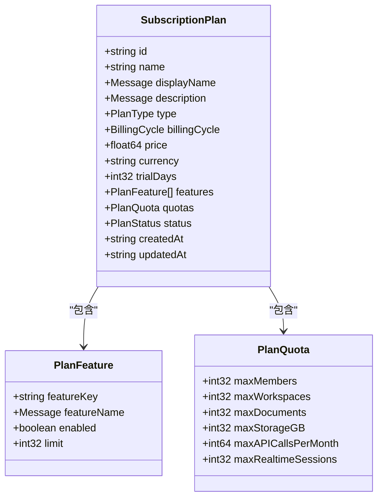
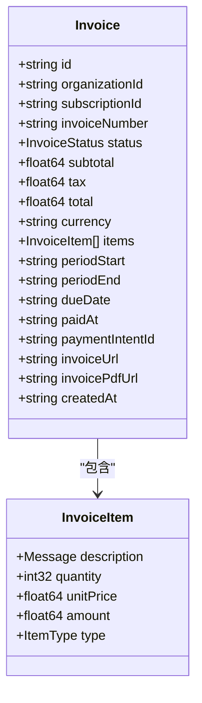
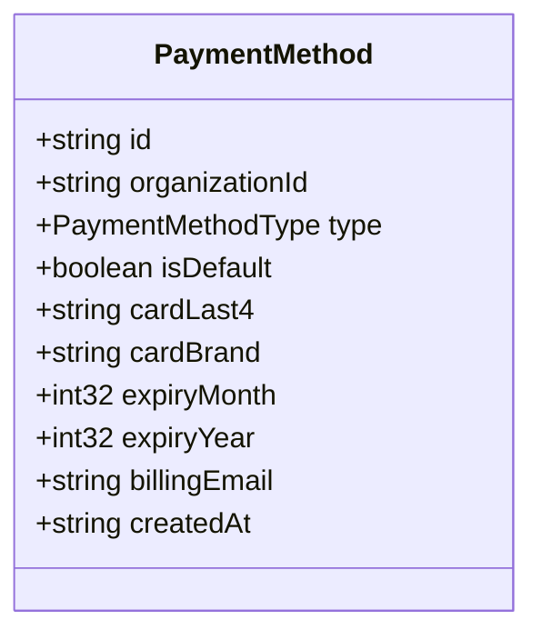
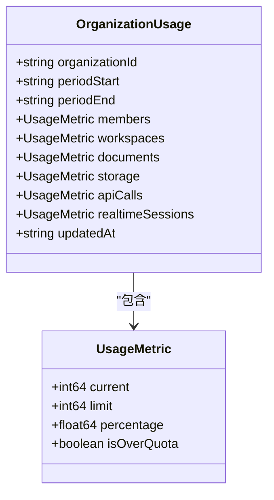
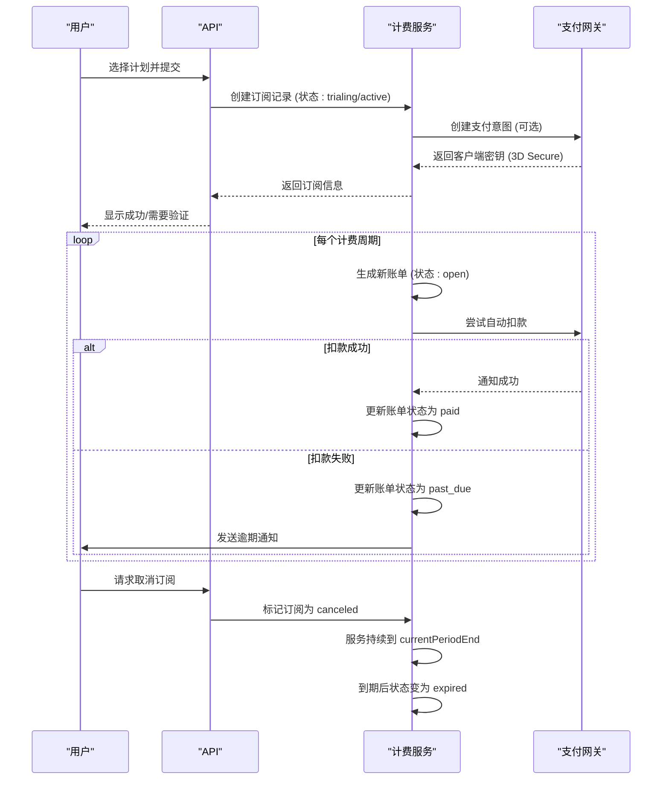

# 计费与租户管理

<cite>
**本文档引用的文件**  
- [main.tsp](file://api/main.tsp)
- [models.tsp](file://api/tenant/models.tsp)
- [users.tsp](file://api/tenant/users.tsp)
- [organizations.tsp](file://api/tenant/organizations.tsp)
- [workspaces.tsp](file://api/tenant/workspaces.tsp)
- [invitations.tsp](file://api/tenant/invitations.tsp)
- [billing/models.tsp](file://api/billing/models.tsp)
- [billing/plans.tsp](file://api/billing/plans.tsp)
- [billing/subscriptions.tsp](file://api/billing/subscriptions.tsp)
- [billing/invoices.tsp](file://api/billing/invoices.tsp)
- [billing/payments.tsp](file://api/billing/payments.tsp)
- [billing/usage.tsp](file://api/billing/usage.tsp)
</cite>

## 目录
1. [引言](#引言)
2. [租户管理模块](#租户管理模块)
3. [多租户数据隔离机制](#多租户数据隔离机制)
4. [计费模块](#计费模块)
5. [订阅生命周期管理](#订阅生命周期管理)
6. [核心API端点](#核心api端点)
7. [支付网关集成与安全考虑](#支付网关集成与安全考虑)
8. [结论](#结论)

## 引言

NexusBook API 是一个功能强大的开源文档管理和数据协作平台，支持多租户架构和商业化运营。本文档详细阐述其租户管理与计费功能，涵盖用户、组织、工作区的管理机制，多租户数据隔离策略，以及完整的计费系统，包括订阅、账单、支付和使用量跟踪。

**Section sources**
- [main.tsp](file://api/main.tsp#L1-L134)

## 租户管理模块

NexusBook 的租户管理模块是整个平台的基石，它定义了用户、组织和工作区的层级结构，并提供了相应的管理API。

### 用户管理

用户是系统中最基础的身份实体。每个用户通过邮箱注册，拥有唯一的用户ID。用户信息包括显示名称、头像、语言偏好和时区等。用户可以绑定多种OAuth提供商（如Google、GitHub、微信）以实现单点登录。

用户通过 `users.tsp` 文件中的 `UserApi` 接口进行管理，主要操作包括：
- **获取当前用户信息** (`GET /api/v1/users/me`)
- **更新用户信息** (`PATCH /api/v1/users/me`)
- **绑定/解绑OAuth** (`POST/DELETE /api/v1/users/me/oauth/{provider}`)

**Section sources**
- [models.tsp](file://api/tenant/models.tsp#L25-L142)
- [users.tsp](file://api/tenant/users.tsp#L10-L268)

### 组织管理

组织是用户协作的基本单元。每个用户注册后会自动创建一个个人组织。组织分为个人、团队和企业三种类型。组织拥有者（owner）拥有最高权限，管理员（admin）可管理成员和设置。

组织通过 `organizations.tsp` 文件中的 `OrganizationApi` 接口进行管理，主要操作包括：
- **创建组织** (`POST /api/v1/organizations`)
- **获取/更新组织信息** (`GET/PATCH /api/v1/organizations/{organizationId}`)
- **列出/添加/更新/移除成员** (`GET/POST/PATCH/DELETE /api/v1/organizations/{organizationId}/members`)
- **用户离开组织** (`POST /api/v1/organizations/{organizationId}/leave`)

**Section sources**
- [models.tsp](file://api/tenant/models.tsp#L217-L394)
- [organizations.tsp](file://api/tenant/organizations.tsp#L10-L498)

### 工作区管理

工作区是实际业务开展的容器，大部分文档操作在工作区内进行。一个组织可以拥有多个工作区，工作区的可见性分为公开（组织内所有成员可见）和私有（仅成员可见）。

工作区通过 `workspaces.tsp` 文件中的 `WorkspaceApi` 接口进行管理，主要操作包括：
- **创建工作区** (`POST /api/v1/organizations/{organizationId}/workspaces`)
- **列出/获取/更新工作区** (`GET/PATCH /api/v1/organizations/{organizationId}/workspaces`)
- **归档/恢复/删除工作区** (`POST/DELETE /api/v1/organizations/{organizationId}/workspaces/{workspaceId}`)
- **管理成员** (`GET/POST/PATCH/DELETE /api/v1/organizations/{organizationId}/workspaces/{workspaceId}/members`)

**Section sources**
- [models.tsp](file://api/tenant/models.tsp#L513-L636)
- [workspaces.tsp](file://api/tenant/workspaces.tsp#L10-L631)

### 用户邀请与加入申请

平台支持两种加入组织的方式：邀请和申请。

- **邀请 (Invitation)**：由组织的owner或admin发起，通过邮件发送邀请链接。被邀请人点击链接后接受邀请即可加入。
- **加入申请 (Join Request)**：当组织设置为允许公开加入时，用户可以主动提交申请，由组织管理员审批。

相关API定义在 `invitations.tsp` 文件中，包括创建邀请、撤销邀请、接受/拒绝邀请、提交申请、审批/拒绝申请等。

**Section sources**
- [models.tsp](file://api/tenant/models.tsp#L719-L800)
- [invitations.tsp](file://api/tenant/invitations.tsp#L10-L548)

## 多租户数据隔离机制

NexusBook 采用严格的多租户架构来确保不同组织的数据完全隔离。其核心机制如下：

1.  **数据模型设计**：所有与租户相关的数据模型（如文档、工作区、账单）都包含 `organizationId` 字段，作为数据归属的硬性标识。
2.  **API路由设计**：大多数API端点的路径都包含 `{organizationId}` 参数，例如 `/api/v1/organizations/{organizationId}/workspaces`。这确保了所有操作都必须在特定组织的上下文中进行。
3.  **访问控制**：在执行任何数据操作前，后端服务会验证当前用户是否是该 `organizationId` 的成员，并检查其角色权限。只有拥有相应权限的用户才能访问或修改数据。
4.  **数据库层面**：在数据库查询中，`organizationId` 是一个关键的过滤条件，确保查询结果仅限于当前用户所属组织的数据。

这种设计保证了即使在共享的数据库实例中，一个组织的用户也无法看到或访问另一个组织的任何数据，实现了逻辑上的完全隔离。

**Section sources**
- [main.tsp](file://api/main.tsp#L96-L134)
- [organizations.tsp](file://api/tenant/organizations.tsp#L17-L28)
- [workspaces.tsp](file://api/tenant/workspaces.tsp#L17-L31)

## 计费模块

计费模块是平台商业化运营的核心，提供了一套完整的订阅、账单和支付解决方案。

### 订阅计划管理

订阅计划定义了服务的定价、功能和配额。`billing/models.tsp` 中的 `SubscriptionPlan` 模型包含了计划的详细信息，如价格、计费周期（月付/年付）、试用天数、功能特性和配额限制（如最大成员数、存储空间）。

通过 `billing/plans.tsp` 中的 `SubscriptionPlansApi`，管理员可以：
- **列出所有可用计划** (`GET /api/v1/billing/plans`)
- **获取特定计划的详情** (`GET /api/v1/billing/plans/{planId}`)

**Diagram sources**
- [billing/models.tsp](file://api/billing/models.tsp#L169-L212)
- [billing/plans.tsp](file://api/billing/plans.tsp#L19-L41)

### 账单生成

当用户的订阅周期结束或发生变更时，系统会自动生成账单。`billing/models.tsp` 中的 `Invoice` 模型代表一张账单，包含账单编号、总金额、状态（草稿、待支付、已支付等）和账单项列表。

`billing/invoices.tsp` 提供了账单管理API：
- **列出组织的所有账单** (`GET /api/v1/organizations/{organizationId}/invoices`)
- **获取账单详情** (`GET /api/v1/organizations/{organizationId}/invoices/{invoiceId}`)
- **支付账单** (`POST /api/v1/organizations/{organizationId}/invoices/{invoiceId}/pay`)

**Diagram sources**
- [billing/models.tsp](file://api/billing/models.tsp#L277-L332)
- [billing/invoices.tsp](file://api/billing/invoices.tsp#L19-L76)

### 支付方式处理

用户可以添加多种支付方式，如信用卡、支付宝、微信支付等。`billing/models.tsp` 中的 `PaymentMethod` 模型存储了支付方式的类型、是否为默认支付方式以及卡号后四位等信息。

`billing/payments.tsp` 提供了支付方式管理API：
- **列出所有支付方式** (`GET /api/v1/organizations/{organizationId}/payment-methods`)
- **添加新的支付方式** (`POST /api/v1/organizations/{organizationId}/payment-methods`)
- **删除支付方式** (`DELETE /api/v1/organizations/{organizationId}/payment-methods/{paymentMethodId}`)
- **设置默认支付方式** (`POST /api/v1/organizations/{organizationId}/payment-methods/{paymentMethodId}/set-default`)

**Diagram sources**
- [billing/models.tsp](file://api/billing/models.tsp#L334-L365)
- [billing/payments.tsp](file://api/billing/payments.tsp#L19-L75)

### 使用量跟踪

系统会实时跟踪组织对各项资源的使用情况，如成员数、文档数、API调用量和存储空间。`billing/models.tsp` 中的 `OrganizationUsage` 模型记录了这些指标的当前使用量、配额限制和使用百分比。

`billing/usage.tsp` 提供了使用量查询API：
- **获取当前使用量** (`GET /api/v1/organizations/{organizationId}/usage`)
- **获取使用量历史趋势** (`GET /api/v1/organizations/{organizationId}/usage/history`)
- **获取配额警告** (`GET /api/v1/organizations/{organizationId}/usage/warnings`)

**Diagram sources**
- [billing/models.tsp](file://api/billing/models.tsp#L382-L413)
- [billing/usage.tsp](file://api/billing/usage.tsp#L19-L68)

## 订阅生命周期管理

订阅的生命周期从创建到最终取消，涵盖了多个状态和操作。

### 订阅状态

`billing/models.tsp` 中的 `SubscriptionStatus` 枚举定义了订阅的五种状态：
- **试用中 (trialing)**：用户处于免费试用期。
- **活跃 (active)**：用户已付费，服务正常。
- **逾期 (past_due)**：账单未支付，服务可能受限。
- **已取消 (canceled)**：用户已取消订阅，但服务在当前周期结束前仍可用。
- **已过期 (expired)**：订阅已完全终止。

### 核心操作流程

`billing/subscriptions.tsp` 中的 `OrganizationSubscriptionApi` 接口管理整个生命周期：
1.  **创建/更新订阅** (`POST /api/v1/organizations/{organizationId}/subscription`): 用户选择计划并绑定支付方式，创建新订阅。
2.  **变更计划** (`POST /api/v1/organizations/{organizationId}/subscription/change-plan`): 用户可以升级或降级计划，系统会计算按比例计费的金额。
3.  **取消订阅** (`POST /api/v1/organizations/{organizationId}/subscription/cancel`): 用户可以立即取消或在当前周期结束后取消。
4.  **恢复订阅** (`POST /api/v1/organizations/{organizationId}/subscription/resume`): 在订阅过期前，用户可以恢复已取消的订阅。

**Diagram sources**
- [billing/models.tsp](file://api/billing/models.tsp#L55-L67)
- [billing/subscriptions.tsp](file://api/billing/subscriptions.tsp#L19-L107)

## 核心API端点

以下是管理租户和计费功能的核心API端点摘要。

### 租户管理API

| 端点 | 方法 | 描述 |
| :--- | :--- | :--- |
| `/api/v1/users/me` | `GET` | 获取当前用户信息 |
| `/api/v1/organizations` | `POST` | 创建新组织 |
| `/api/v1/organizations/{organizationId}` | `GET` | 获取组织详情 |
| `/api/v1/organizations/{organizationId}/members` | `POST` | 添加组织成员 |
| `/api/v1/organizations/{organizationId}/workspaces` | `POST` | 创建新工作区 |
| `/api/v1/organizations/{organizationId}/invitations` | `POST` | 邀请用户加入 |

**Section sources**
- [users.tsp](file://api/tenant/users.tsp#L119-L268)
- [organizations.tsp](file://api/tenant/organizations.tsp#L176-L498)
- [workspaces.tsp](file://api/tenant/workspaces.tsp#L178-L631)
- [invitations.tsp](file://api/tenant/invitations.tsp#L112-L548)

### 计费管理API

| 端点 | 方法 | 描述 |
| :--- | :--- | :--- |
| `/api/v1/billing/plans` | `GET` | 列出所有订阅计划 |
| `/api/v1/organizations/{organizationId}/subscription` | `POST` | 创建或更新组织订阅 |
| `/api/v1/organizations/{organizationId}/subscription/change-plan` | `POST` | 变更订阅计划 |
| `/api/v1/organizations/{organizationId}/invoices` | `GET` | 列出组织的所有账单 |
| `/api/v1/organizations/{organizationId}/invoices/{invoiceId}/pay` | `POST` | 支付指定账单 |
| `/api/v1/organizations/{organizationId}/payment-methods` | `POST` | 添加新的支付方式 |

**Section sources**
- [plans.tsp](file://api/billing/plans.tsp#L19-L41)
- [subscriptions.tsp](file://api/billing/subscriptions.tsp#L18-L107)
- [invoices.tsp](file://api/billing/invoices.tsp#L18-L76)
- [payments.tsp](file://api/billing/payments.tsp#L18-L75)

## 支付网关集成与安全考虑

### 集成模式

平台采用与第三方支付网关（如Stripe、支付宝、微信支付）集成的模式。其核心流程如下：
1.  **创建支付意图**：当需要支付时，后端服务调用支付网关API创建一个“支付意图”(Payment Intent)，并获取一个客户端密钥。
2.  **前端处理**：前端应用使用此密钥和支付网关提供的SDK（如Stripe.js）来安全地收集用户的支付信息（如卡号），而无需这些敏感数据经过应用服务器。
3.  **确认支付**：前端SDK直接与支付网关通信，确认支付意图。支付网关返回支付结果。
4.  **结果处理**：前端将结果通知后端，后端根据支付网关的Webhook通知来最终确认支付状态并更新系统记录。

### 安全考虑

1.  **PCI DSS 合规**：通过使用支付网关的前端SDK来处理支付卡信息，应用服务器完全不接触卡号等敏感数据，从而避免了复杂的PCI DSS合规要求。
2.  **Webhook 签名验证**：所有来自支付网关的Webhook通知都必须使用网关提供的签名密钥进行验证，以防止伪造通知。
3.  **令牌化**：用户的支付方式（如信用卡）在支付网关中被令牌化（tokenized），应用系统只存储这个安全的令牌，而不是原始卡信息。
4.  **HTTPS**：所有API通信都强制使用HTTPS加密。
5.  **身份验证**：所有API请求都需要有效的Bearer Token进行身份验证和授权。

**Section sources**
- [subscriptions.tsp](file://api/billing/subscriptions.tsp#L35-L47)
- [invoices.tsp](file://api/billing/invoices.tsp#L55-L75)
- [payments.tsp](file://api/billing/payments.tsp#L35-L47)

## 结论

NexusBook API 的租户管理和计费功能设计精良，为多租户SaaS应用提供了坚实的基础。其清晰的用户-组织-工作区层级结构和严格的 `organizationId` 数据隔离机制，确保了数据的安全与独立。同时，其模块化的计费系统，涵盖了从计划定义、订阅管理、账单生成到支付处理和使用量监控的完整生命周期，并通过与主流支付网关的安全集成，为平台的商业化运营提供了可靠保障。