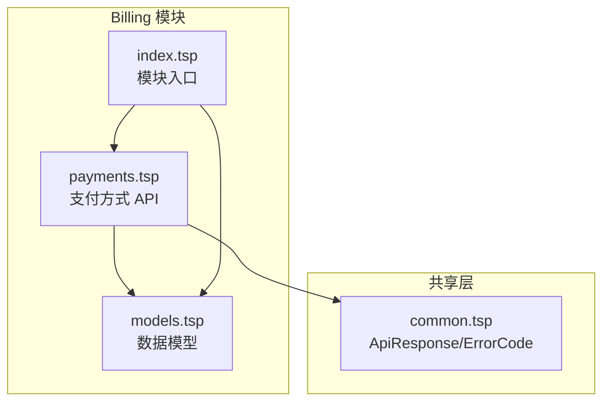
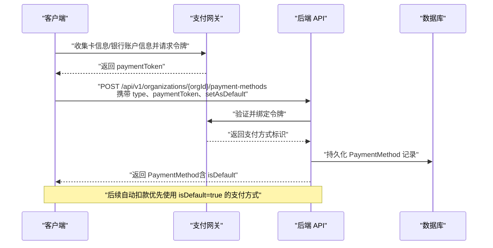
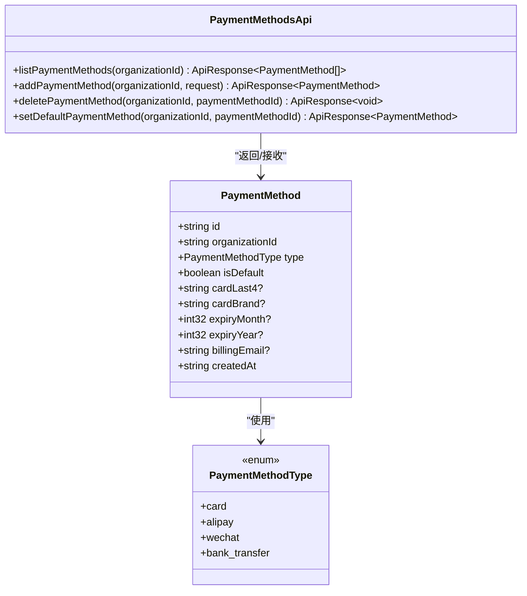
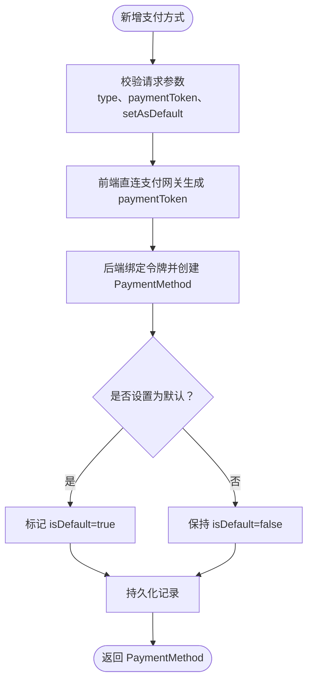
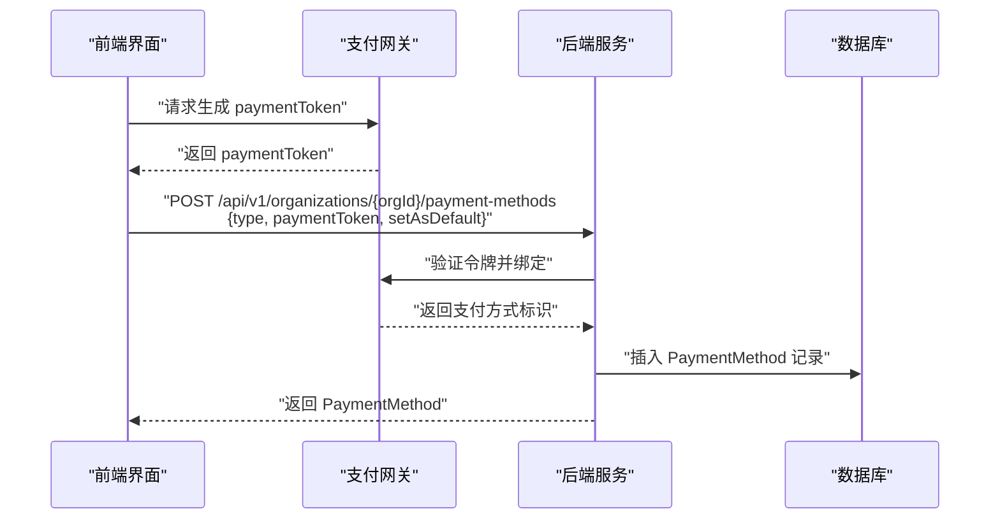
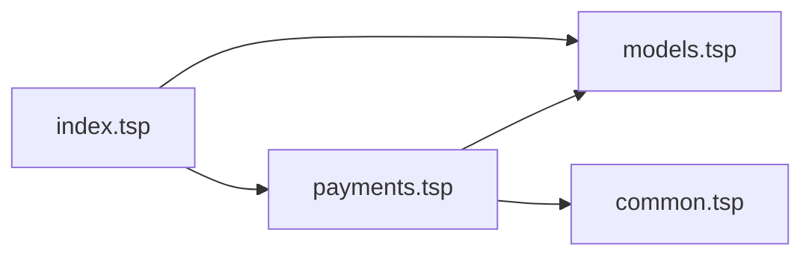

# 支付方式管理

<cite>
**本文引用的文件**
- [payments.tsp](file://api/billing/payments.tsp)
- [models.tsp](file://api/billing/models.tsp)
- [common.tsp](file://api/shared/common.tsp)
- [index.tsp](file://api/billing/index.tsp)
- [best-practices.md](file://docs-src/guides/best-practices.md)
- [authentication.md](file://docs-src/guides/authentication.md)
- [error-codes.md](file://docs-src/references/error-codes.md)
- [WEBHOOK_GUIDE.md](file://api/extensions/webhooks/WEBHOOK_GUIDE.md)
</cite>

## 目录
1. [简介](#简介)
2. [项目结构](#项目结构)
3. [核心组件](#核心组件)
4. [架构总览](#架构总览)
5. [详细组件分析](#详细组件分析)
6. [依赖关系分析](#依赖关系分析)
7. [性能考虑](#性能考虑)
8. [故障排查指南](#故障排查指南)
9. [结论](#结论)
10. [附录](#附录)

## 简介
本技术文档围绕支付方式管理模块，系统阐述 payments.tsp 中定义的支付方式 CRUD 能力：列出可用支付方式、添加新卡或银行账户、删除不再需要的支付方式、设置默认支付方式，并深入解析 PaymentMethod 数据模型的 type 字段支持的支付类型（如信用卡、银行转账等）。同时，重点强调安全最佳实践：paymentToken 必须通过客户端直接与支付网关通信生成，避免服务器直接接触敏感信息；提供添加支付方式的完整流程示例，涵盖前端令牌化与后端绑定协作步骤；说明默认支付方式在自动扣款中的作用及验证失败场景的处理策略；最后描述该模块与支付网关（如 Stripe）的集成架构。

## 项目结构
支付方式管理位于 billing 模块中，核心文件如下：
- 接口定义：api/billing/payments.tsp
- 数据模型：api/billing/models.tsp
- 通用响应与错误码：api/shared/common.tsp
- 模块入口：api/billing/index.tsp

图表来源
- [payments.tsp](file://api/billing/payments.tsp#L1-L74)
- [models.tsp](file://api/billing/models.tsp#L1-L120)
- [common.tsp](file://api/shared/common.tsp#L153-L177)
- [index.tsp](file://api/billing/index.tsp#L1-L11)

章节来源
- [payments.tsp](file://api/billing/payments.tsp#L1-L74)
- [models.tsp](file://api/billing/models.tsp#L1-L120)
- [common.tsp](file://api/shared/common.tsp#L153-L177)
- [index.tsp](file://api/billing/index.tsp#L1-L11)

## 核心组件
- 支付方式 API 接口：提供 listPaymentMethods、addPaymentMethod、deletePaymentMethod、setDefaultPaymentMethod 四个核心操作。
- PaymentMethod 数据模型：包含 type、isDefault、cardLast4、cardBrand、expiryMonth、expiryYear、billingEmail 等字段，用于描述支付方式的类型与基本信息。
- PaymentMethodType 枚举：定义支持的支付类型，如信用卡、支付宝、微信支付、银行转账等。
- 通用响应结构：ApiResponse<T> 统一返回结构，包含 success、code、message、payload 字段，便于前后端一致处理。

章节来源
- [payments.tsp](file://api/billing/payments.tsp#L17-L74)
- [models.tsp](file://api/billing/models.tsp#L93-L103)
- [models.tsp](file://api/billing/models.tsp#L334-L366)
- [common.tsp](file://api/shared/common.tsp#L153-L177)

## 架构总览
支付方式管理与支付网关（如 Stripe）的交互采用“前端直连网关令牌化 + 后端绑定”的模式：
- 前端通过支付网关 SDK 或 API 直接生成 paymentToken，不经过服务器。
- 后端收到 paymentToken 后，调用 addPaymentMethod 将令牌绑定到组织的支付方式列表。
- setDefaultPaymentMethod 用于设置默认支付方式，后续自动扣款优先使用默认方式。
- 删除支付方式使用 deletePaymentMethod，避免继续参与扣款。

图表来源
- [payments.tsp](file://api/billing/payments.tsp#L36-L47)
- [models.tsp](file://api/billing/models.tsp#L334-L366)

## 详细组件分析

### 支付方式 API 接口
- listPaymentMethods：按组织列出其所有支付方式，返回 PaymentMethod[]。
- addPaymentMethod：新增支付方式，请求体包含 type、paymentToken、setAsDefault；返回新增的 PaymentMethod。
- deletePaymentMethod：按支付方式 ID 删除对应记录。
- setDefaultPaymentMethod：将指定支付方式设为默认，返回更新后的 PaymentMethod。

图表来源
- [payments.tsp](file://api/billing/payments.tsp#L17-L74)
- [models.tsp](file://api/billing/models.tsp#L93-L103)
- [models.tsp](file://api/billing/models.tsp#L334-L366)

章节来源
- [payments.tsp](file://api/billing/payments.tsp#L17-L74)

### PaymentMethod 数据模型与类型
- type 字段支持多种支付类型，包括信用卡、支付宝、微信支付、银行转账等。
- isDefault 标识默认支付方式，用于自动扣款优先选择。
- 卡片类支付方式包含 cardLast4、cardBrand、expiryMonth、expiryYear 等脱敏信息。
- 银行转账类支付方式包含 billingEmail 等联系信息。

图表来源
- [payments.tsp](file://api/billing/payments.tsp#L36-L47)
- [models.tsp](file://api/billing/models.tsp#L334-L366)

章节来源
- [models.tsp](file://api/billing/models.tsp#L93-L103)
- [models.tsp](file://api/billing/models.tsp#L334-L366)

### 默认支付方式与自动扣款
- 默认支付方式 isDefault=true 的支付方式优先用于自动扣款。
- 若默认方式失效或验证失败，系统应提示用户更新支付方式或选择其他有效方式。
- 删除默认支付方式时，应先设置新的默认方式，避免扣款中断。

章节来源
- [models.tsp](file://api/billing/models.tsp#L344-L346)

### 安全最佳实践
- paymentToken 必须由前端直接与支付网关通信生成，服务器不应直接接触敏感卡号等信息。
- 传输层必须使用 HTTPS，避免明文传输。
- 对外暴露的 API 应遵循最小权限原则，仅授予必要 scope。
- 令牌刷新与会话管理遵循统一的安全策略。

章节来源
- [payments.tsp](file://api/billing/payments.tsp#L40-L46)
- [authentication.md](file://docs-src/guides/authentication.md#L393-L403)
- [best-practices.md](file://docs-src/guides/best-practices.md#L280-L326)

### 添加支付方式的完整流程示例
- 前端收集用户输入（卡号、有效期、CVV、银行账户信息等），通过支付网关 SDK 或 API 直接请求令牌，获得 paymentToken。
- 前端调用后端 addPaymentMethod，携带 type、paymentToken、setAsDefault。
- 后端验证令牌有效性并创建 PaymentMethod 记录，返回 PaymentMethod。
- 前端展示支付方式列表，用户可随时设置默认支付方式。

图表来源
- [payments.tsp](file://api/billing/payments.tsp#L36-L47)
- [models.tsp](file://api/billing/models.tsp#L334-L366)

章节来源
- [payments.tsp](file://api/billing/payments.tsp#L36-L47)

### 支付方式验证失败场景
- 前端令牌化阶段：若卡信息无效或风控拦截，支付网关会拒绝生成令牌，前端应提示用户修正。
- 后端绑定阶段：若令牌无效或已被使用，后端应返回相应错误码并提示用户重试。
- 默认支付方式验证失败：系统应提示用户更换默认支付方式或修复信息，避免自动扣款失败。

章节来源
- [error-codes.md](file://docs-src/references/error-codes.md#L205-L248)

### 与支付网关（如 Stripe）的集成架构
- 前端直连支付网关：负责收集敏感信息并生成 paymentToken，服务器不接触原始卡号。
- 后端仅处理业务逻辑：接收 paymentToken，调用支付网关完成绑定与持久化，返回标准化 PaymentMethod。
- Webhook 集成：支付网关可通过 Webhook 推送支付状态变化，后端按需处理（如更新账单状态、发送通知等）。

章节来源
- [payments.tsp](file://api/billing/payments.tsp#L40-L46)
- [WEBHOOK_GUIDE.md](file://api/extensions/webhooks/WEBHOOK_GUIDE.md#L234-L308)

## 依赖关系分析
- payments.tsp 依赖 models.tsp 中的 PaymentMethod、PaymentMethodType，以及 common.tsp 中的 ApiResponse。
- index.tsp 将 billing 模块内的各子模块（plans、subscriptions、invoices、payments、usage）统一导出，形成模块入口。

图表来源
- [payments.tsp](file://api/billing/payments.tsp#L1-L16)
- [models.tsp](file://api/billing/models.tsp#L1-L120)
- [common.tsp](file://api/shared/common.tsp#L153-L177)
- [index.tsp](file://api/billing/index.tsp#L1-L11)

章节来源
- [payments.tsp](file://api/billing/payments.tsp#L1-L16)
- [index.tsp](file://api/billing/index.tsp#L1-L11)

## 性能考虑
- 列表查询：listPaymentMethods 支持分页与筛选，建议在前端实现游标分页，避免一次性拉取大量数据。
- 批量操作：尽量减少频繁的小请求，合并必要的批量操作。
- 缓存策略：对不常变动的支付方式列表可做短时缓存，但涉及默认支付方式变更时需及时失效。
- 错误重试：对偶发性网络错误进行指数退避重试，避免雪崩效应。

章节来源
- [best-practices.md](file://docs-src/guides/best-practices.md#L213-L279)

## 故障排查指南
- 参数无效：检查请求体中的 type、paymentToken、setAsDefault 是否符合要求。
- 令牌无效：确认前端是否正确直连支付网关生成令牌，且未过期或被使用。
- 默认支付方式冲突：删除或切换默认支付方式时，确保同一组织仅有一个 isDefault=true。
- 错误码参考：使用统一的 ErrorCode 与 Message，便于定位问题。

章节来源
- [error-codes.md](file://docs-src/references/error-codes.md#L205-L248)
- [common.tsp](file://api/shared/common.tsp#L80-L151)

## 结论
支付方式管理模块通过清晰的 API 与稳健的数据模型，实现了对多种支付类型的统一管理。结合前端直连支付网关令牌化的安全实践，既能满足合规要求，又能简化后端逻辑。默认支付方式在自动扣款中扮演关键角色，应确保其有效性与可替换性。配合 Webhook 机制，可进一步完善支付状态的自动化处理与通知。

## 附录
- 支付方式类型枚举：信用卡、支付宝、微信支付、银行转账。
- 通用响应结构：success、code、message、payload，便于前后端一致处理。
- 安全与最佳实践：令牌化、HTTPS、最小权限、会话管理与速率限制。

章节来源
- [models.tsp](file://api/billing/models.tsp#L93-L103)
- [common.tsp](file://api/shared/common.tsp#L153-L177)
- [best-practices.md](file://docs-src/guides/best-practices.md#L280-L326)