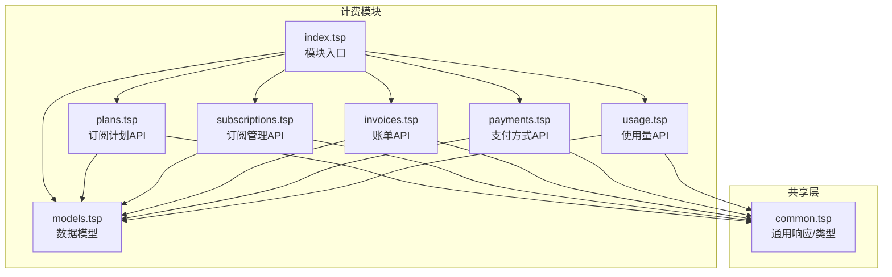
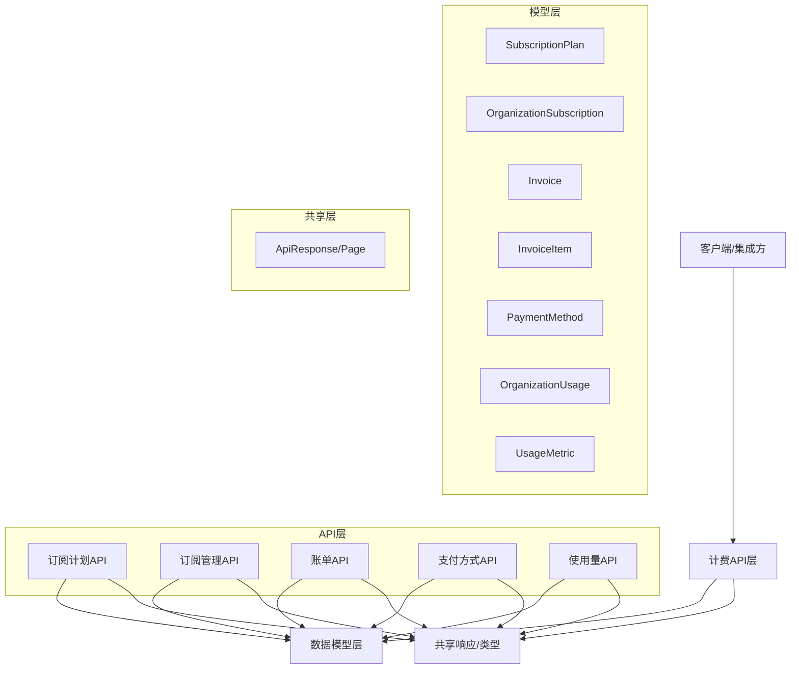
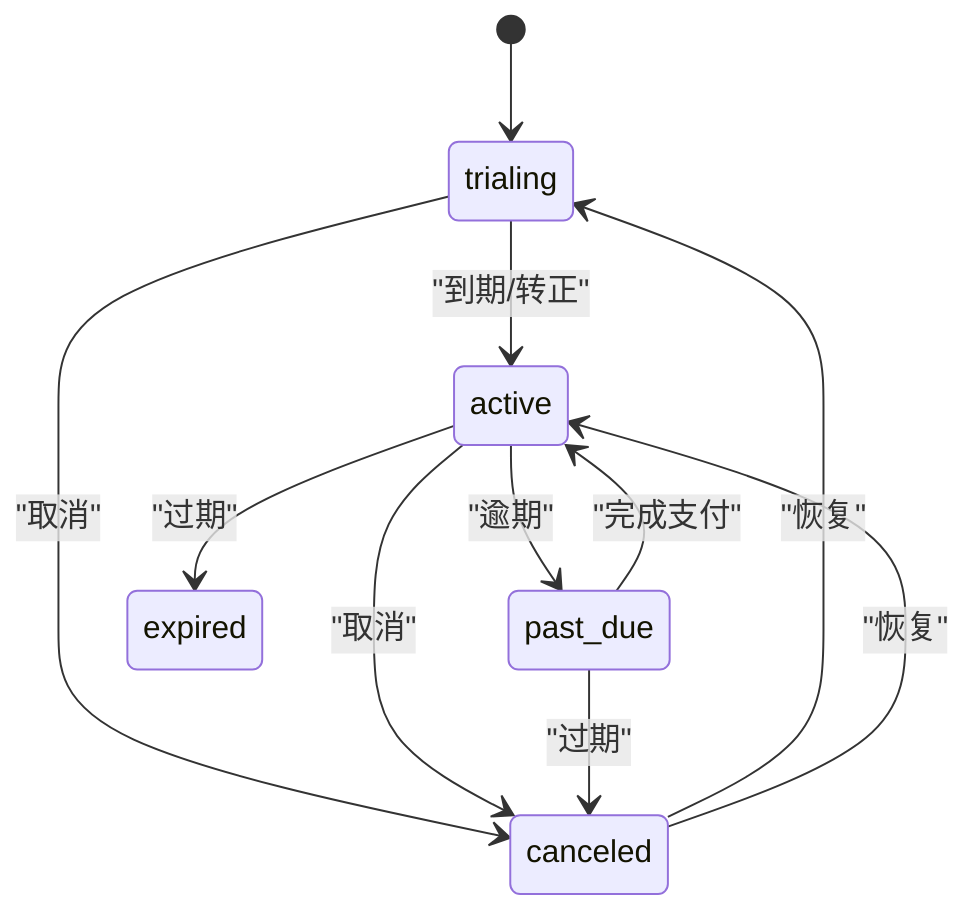
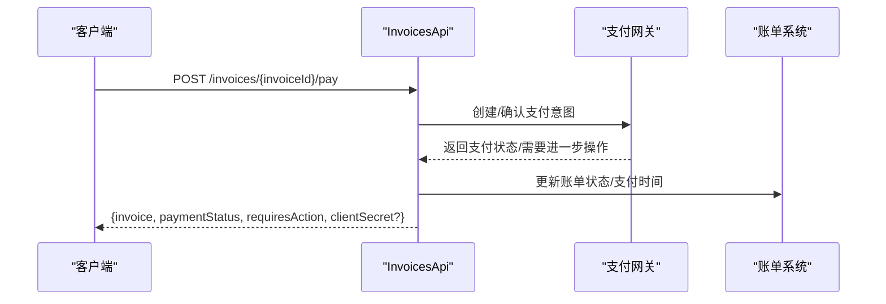
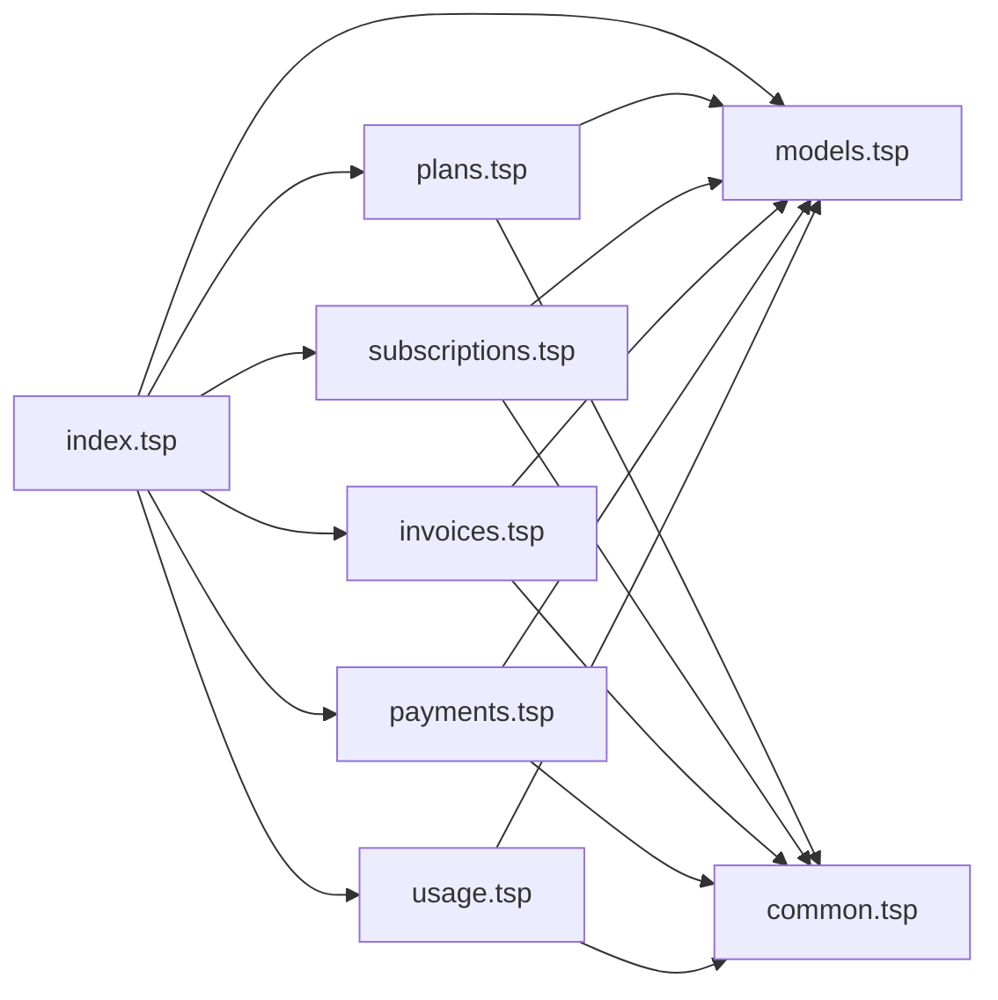
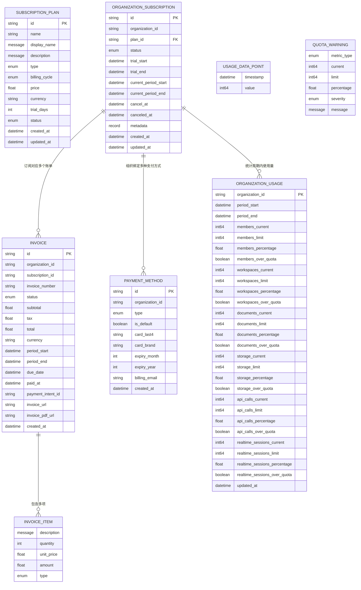

# 计费模块

<cite>
**本文引用的文件**
- [index.tsp](file://api/billing/index.tsp)
- [models.tsp](file://api/billing/models.tsp)
- [common.tsp](file://api/shared/common.tsp)
- [plans.tsp](file://api/billing/plans.tsp)
- [subscriptions.tsp](file://api/billing/subscriptions.tsp)
- [invoices.tsp](file://api/billing/invoices.tsp)
- [payments.tsp](file://api/billing/payments.tsp)
- [usage.tsp](file://api/billing/usage.tsp)
- [error-codes.md](file://docs-src/references/error-codes.md)
- [authentication.md](file://docs-src/guides/authentication.md)
- [best-practices.md](file://docs-src/guides/best-practices.md)
</cite>

## 目录
1. [简介](#简介)
2. [项目结构](#项目结构)
3. [核心组件](#核心组件)
4. [架构总览](#架构总览)
5. [详细组件分析](#详细组件分析)
6. [依赖关系分析](#依赖关系分析)
7. [性能与速率限制](#性能与速率限制)
8. [故障排查指南](#故障排查指南)
9. [结论](#结论)
10. [附录](#附录)

## 简介
本文件为计费模块的完整API文档，覆盖订阅计划管理、订阅生命周期、账单生成、支付处理、使用量跟踪等能力，并说明数据模型之间的关系与集成要点。文档同时给出认证要求、错误码、速率限制策略与第三方支付网关集成的安全建议。

## 项目结构
计费模块位于 api/billing 目录，采用按功能域划分的组织方式，入口文件负责导入各子模块；公共响应模型与通用类型位于 api/shared/common.tsp。

图表来源
- [index.tsp](file://api/billing/index.tsp#L1-L11)
- [models.tsp](file://api/billing/models.tsp#L1-L120)
- [plans.tsp](file://api/billing/plans.tsp#L1-L41)
- [subscriptions.tsp](file://api/billing/subscriptions.tsp#L1-L107)
- [invoices.tsp](file://api/billing/invoices.tsp#L1-L76)
- [payments.tsp](file://api/billing/payments.tsp#L1-L75)
- [usage.tsp](file://api/billing/usage.tsp#L1-L68)
- [common.tsp](file://api/shared/common.tsp#L1-L120)

章节来源
- [index.tsp](file://api/billing/index.tsp#L1-L11)

## 核心组件
- 订阅计划管理：提供计划列表、详情查询能力，支持按归档状态筛选。
- 订阅生命周期：组织维度的订阅创建/更新、变更计划（升级/降级）、取消与恢复。
- 账单生成与支付：列出账单、获取账单详情、支付账单（含需要进一步操作的场景）。
- 支付方式管理：列出、添加、删除支付方式，设置默认支付方式。
- 使用量跟踪：获取组织当前使用量、历史趋势与配额警告。

章节来源
- [plans.tsp](file://api/billing/plans.tsp#L1-L41)
- [subscriptions.tsp](file://api/billing/subscriptions.tsp#L1-L107)
- [invoices.tsp](file://api/billing/invoices.tsp#L1-L76)
- [payments.tsp](file://api/billing/payments.tsp#L1-L75)
- [usage.tsp](file://api/billing/usage.tsp#L1-L68)

## 架构总览
计费模块围绕“订阅-账单-支付-使用量”闭环展开，数据模型定义了枚举与实体，API层提供REST风格接口，统一响应结构由共享层提供。

图表来源
- [models.tsp](file://api/billing/models.tsp#L1-L444)
- [common.tsp](file://api/shared/common.tsp#L150-L210)
- [plans.tsp](file://api/billing/plans.tsp#L1-L41)
- [subscriptions.tsp](file://api/billing/subscriptions.tsp#L1-L107)
- [invoices.tsp](file://api/billing/invoices.tsp#L1-L76)
- [payments.tsp](file://api/billing/payments.tsp#L1-L75)
- [usage.tsp](file://api/billing/usage.tsp#L1-L68)

## 详细组件分析

### 订阅计划管理（plans.tsp）
- 路由：/api/v1/billing/plans
- 方法与路径
  - GET /api/v1/billing/plans
    - 查询参数：includeArchived（布尔，默认false）
    - 响应：ApiResponse<SubscriptionPlan[]>
  - GET /api/v1/billing/plans/{planId}
    - 路径参数：planId（字符串）
    - 响应：ApiResponse<SubscriptionPlan>
- 数据模型要点
  - 计划类型、计费周期、价格、货币、功能特性、配额限制、状态、创建/更新时间等。
- 计费周期与定价模型
  - 计费周期枚举：monthly、yearly
  - 价格以浮点表示，货币代码字符串
  - 配额限制包含成员数、工作区数、文档数、存储空间、API调用、实时会话等
- 实际请求/响应示例（路径引用）
  - 列出计划：GET /api/v1/billing/plans?includeArchived=false
  - 获取计划详情：GET /api/v1/billing/plans/{planId}

章节来源
- [plans.tsp](file://api/billing/plans.tsp#L1-L41)
- [models.tsp](file://api/billing/models.tsp#L170-L212)

### 订阅生命周期（subscriptions.tsp）
- 路由：/api/v1/organizations/{organizationId}/subscription
- 方法与路径
  - GET /api/v1/organizations/{organizationId}/subscription
    - 查询当前组织订阅信息
  - POST /api/v1/organizations/{organizationId}/subscription
    - 请求体：planId、billingCycle、paymentMethodId?
    - 响应：ApiResponse<OrganizationSubscription>
  - POST /api/v1/organizations/{organizationId}/subscription/change-plan
    - 请求体：targetPlanId、billingCycle、effectiveDate（immediate或next_billing_cycle）
    - 响应：ApiResponse<{subscription, prorationAmount, nextBillingDate}>
  - POST /api/v1/organizations/{organizationId}/subscription/cancel
    - 请求体：cancelImmediately（布尔）、reason、feedback
    - 响应：ApiResponse<OrganizationSubscription>
  - POST /api/v1/organizations/{organizationId}/subscription/resume
    - 恢复已取消的订阅
- 状态转换
  - 订阅状态枚举：trialing、active、past_due、canceled、expired
  - 取消时记录cancelAt与canceledAt，恢复后回到active
- 实际请求/响应示例（路径引用）
  - 获取订阅：GET /api/v1/organizations/{organizationId}/subscription
  - 创建/更新订阅：POST /api/v1/organizations/{organizationId}/subscription
  - 变更计划：POST /api/v1/organizations/{organizationId}/subscription/change-plan
  - 取消订阅：POST /api/v1/organizations/{organizationId}/subscription/cancel
  - 恢复订阅：POST /api/v1/organizations/{organizationId}/subscription/resume

图表来源
- [models.tsp](file://api/billing/models.tsp#L56-L81)
- [subscriptions.tsp](file://api/billing/subscriptions.tsp#L1-L107)

章节来源
- [subscriptions.tsp](file://api/billing/subscriptions.tsp#L1-L107)
- [models.tsp](file://api/billing/models.tsp#L214-L257)

### 账单生成与支付（invoices.tsp）
- 路由：/api/v1/organizations/{organizationId}/invoices
- 方法与路径
  - GET /api/v1/organizations/{organizationId}/invoices
    - 查询参数：status（InvoiceStatus）、page、pageSize
    - 响应：ApiResponse<Page<Invoice>>
  - GET /api/v1/organizations/{organizationId}/invoices/{invoiceId}
    - 路径参数：invoiceId
    - 响应：ApiResponse<Invoice>
  - POST /api/v1/organizations/{organizationId}/invoices/{invoiceId}/pay
    - 请求体：paymentMethodId
    - 响应：ApiResponse<{invoice, paymentStatus, requiresAction, clientSecret?}>
- 数据模型要点
  - 账单状态：draft、open、paid、void_status、uncollectible
  - 账单项：描述、数量、单价、金额、类型（subscription、usage、addon）
  - 期间：periodStart、periodEnd、dueDate
  - PDF下载：invoicePdfUrl
- 实际请求/响应示例（路径引用）
  - 列出账单：GET /api/v1/organizations/{organizationId}/invoices
  - 获取账单详情：GET /api/v1/organizations/{organizationId}/invoices/{invoiceId}
  - 支付账单：POST /api/v1/organizations/{organizationId}/invoices/{invoiceId}/pay

图表来源
- [invoices.tsp](file://api/billing/invoices.tsp#L1-L76)
- [models.tsp](file://api/billing/models.tsp#L277-L332)

章节来源
- [invoices.tsp](file://api/billing/invoices.tsp#L1-L76)
- [models.tsp](file://api/billing/models.tsp#L277-L332)

### 支付处理（payments.tsp）
- 路由：/api/v1/organizations/{organizationId}/payment-methods
- 方法与路径
  - GET /api/v1/organizations/{organizationId}/payment-methods
    - 响应：ApiResponse<PaymentMethod[]>
  - POST /api/v1/organizations/{organizationId}/payment-methods
    - 请求体：type（PaymentMethodType）、paymentToken、setAsDefault?
    - 响应：ApiResponse<PaymentMethod>
  - DELETE /api/v1/organizations/{organizationId}/payment-methods/{paymentMethodId}
    - 响应：ApiResponse<{}>
  - POST /api/v1/organizations/{organizationId}/payment-methods/{paymentMethodId}/set-default
    - 响应：ApiResponse<PaymentMethod>
- 数据模型要点
  - 支付方式类型：card、alipay、wechat、bank_transfer
  - 默认标记、卡号后4位、品牌、有效期、账单邮箱等
- 实际请求/响应示例（路径引用）
  - 列出支付方式：GET /api/v1/organizations/{organizationId}/payment-methods
  - 添加支付方式：POST /api/v1/organizations/{organizationId}/payment-methods
  - 删除支付方式：DELETE /api/v1/organizations/{organizationId}/payment-methods/{paymentMethodId}
  - 设置默认支付方式：POST /api/v1/organizations/{organizationId}/payment-methods/{paymentMethodId}/set-default

章节来源
- [payments.tsp](file://api/billing/payments.tsp#L1-L75)
- [models.tsp](file://api/billing/models.tsp#L334-L366)

### 使用量跟踪（usage.tsp）
- 路由：/api/v1/organizations/{organizationId}/usage
- 方法与路径
  - GET /api/v1/organizations/{organizationId}/usage
    - 响应：ApiResponse<OrganizationUsage>
  - GET /api/v1/organizations/{organizationId}/usage/history
    - 查询参数：metricType、startDate、endDate、granularity（hour/day/month，默认day）
    - 响应：ApiResponse<{metricType, dataPoints}>
  - GET /api/v1/organizations/{organizationId}/usage/warnings
    - 响应：ApiResponse<{warnings: QuotaWarning[]}>
- 数据模型要点
  - 指标类型：members、workspaces、documents、storage_gb、api_calls、realtime_sessions
  - 使用量指标：current、limit、percentage、isOverQuota
  - 配额警告：metricType、current、limit、percentage、severity、message
- 实际请求/响应示例（路径引用）
  - 获取当前使用量：GET /api/v1/organizations/{organizationId}/usage
  - 获取使用量历史：GET /api/v1/organizations/{organizationId}/usage/history
  - 获取配额警告：GET /api/v1/organizations/{organizationId}/usage/warnings

章节来源
- [usage.tsp](file://api/billing/usage.tsp#L1-L68)
- [models.tsp](file://api/billing/models.tsp#L367-L444)

## 依赖关系分析
- 计费模块入口导入各API与模型文件，形成清晰的模块边界。
- 所有API均依赖共享的ApiResponse/Page通用响应结构。
- 数据模型集中于models.tsp，被各API复用，保持一致性。

图表来源
- [index.tsp](file://api/billing/index.tsp#L1-L11)
- [models.tsp](file://api/billing/models.tsp#L1-L120)
- [common.tsp](file://api/shared/common.tsp#L150-L210)
- [plans.tsp](file://api/billing/plans.tsp#L1-L41)
- [subscriptions.tsp](file://api/billing/subscriptions.tsp#L1-L107)
- [invoices.tsp](file://api/billing/invoices.tsp#L1-L76)
- [payments.tsp](file://api/billing/payments.tsp#L1-L75)
- [usage.tsp](file://api/billing/usage.tsp#L1-L68)

章节来源
- [index.tsp](file://api/billing/index.tsp#L1-L11)
- [common.tsp](file://api/shared/common.tsp#L150-L210)

## 性能与速率限制
- 速率限制策略
  - 建议在客户端侧实施指数退避与重试策略，避免触发服务端限流。
  - 对于高频查询（如使用量历史），建议合理设置粒度与时间范围，减少数据量。
- 分页与过滤
  - 使用分页参数控制每页数量，避免一次性拉取大量数据。
  - 在服务端进行过滤与聚合，减少网络传输与客户端处理压力。
- 缓存与并发
  - 对只读接口（如计划列表、账单列表）可采用短时缓存，注意与版本控制配合。
  - 并发更新时使用版本号，避免冲突导致的重试风暴。

章节来源
- [best-practices.md](file://docs-src/guides/best-practices.md#L213-L279)
- [best-practices.md](file://docs-src/guides/best-practices.md#L338-L379)

## 故障排查指南
- 认证与授权
  - 缺少或无效的Bearer Token会导致未授权错误，需检查Token有效性与Scope权限。
  - 未提供认证信息时，需在请求头添加Authorization: Bearer YOUR_TOKEN。
- 常见错误码
  - 401：INVALID_TOKEN、UNAUTHORIZED
  - 403：FORBIDDEN、INSUFFICIENT_SCOPE
  - 404：资源不存在
  - 409：资源冲突
  - 429：RATE_LIMIT_EXCEEDED
  - 500：INTERNAL_ERROR
- 建议处理策略
  - 对可重试错误（如内部错误、服务不可用）采用指数退避重试。
  - 对权限不足与参数错误，先修正Scope与请求参数再重试。
  - 记录上下文信息（endpoint、method、userId、timestamp）便于定位问题。

章节来源
- [error-codes.md](file://docs-src/references/error-codes.md#L21-L31)
- [authentication.md](file://docs-src/guides/authentication.md#L451-L500)

## 结论
计费模块提供了从订阅计划、订阅生命周期、账单与支付到使用量跟踪的完整能力集，数据模型清晰、API边界明确。结合统一的认证与错误处理机制，可为企业级商业化运营提供稳定支撑。建议在集成第三方支付网关时遵循安全最佳实践，确保Token与密钥的安全管理与传输加密。

## 附录

### 数据模型关系图

图表来源
- [models.tsp](file://api/billing/models.tsp#L170-L444)

### 第三方支付网关集成最佳实践
- 安全建议
  - 使用HTTPS与TLS 1.2+传输敏感信息。
  - 支付Token仅在创建时返回，后续避免明文存储与日志记录。
  - 严格最小权限原则，仅授予必要的Scope与权限。
- 速率限制
  - 在客户端实现限流与退避策略，避免触发服务端限流。
- 错误处理
  - 对可重试错误采用指数退避重试；对权限不足与参数错误，先修正再重试。
- 认证要求
  - 所有计费相关API均需Bearer Token认证，需在请求头中携带Authorization: Bearer YOUR_TOKEN。

章节来源
- [authentication.md](file://docs-src/guides/authentication.md#L393-L450)
- [best-practices.md](file://docs-src/guides/best-practices.md#L280-L326)
- [error-codes.md](file://docs-src/references/error-codes.md#L21-L31)