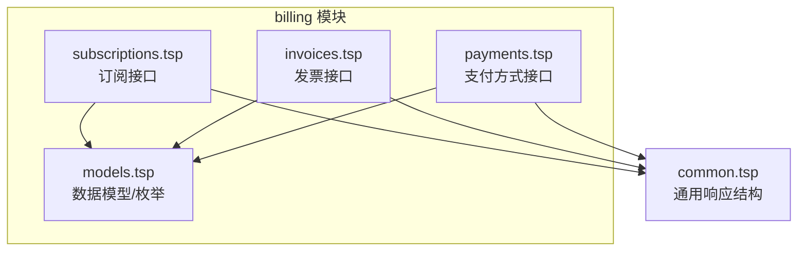
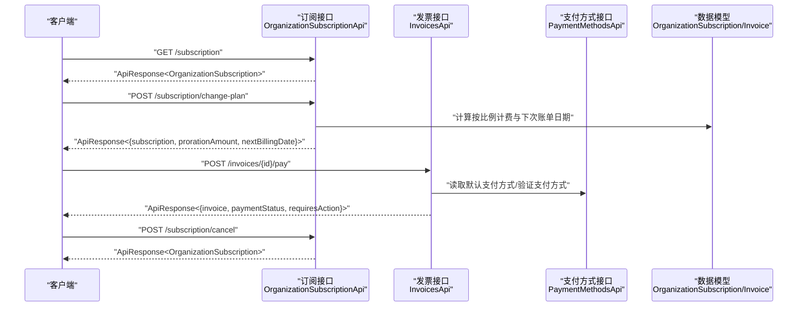
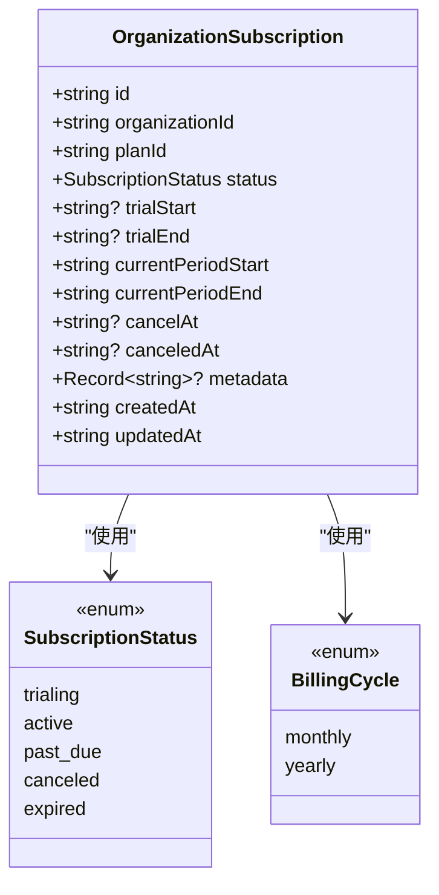
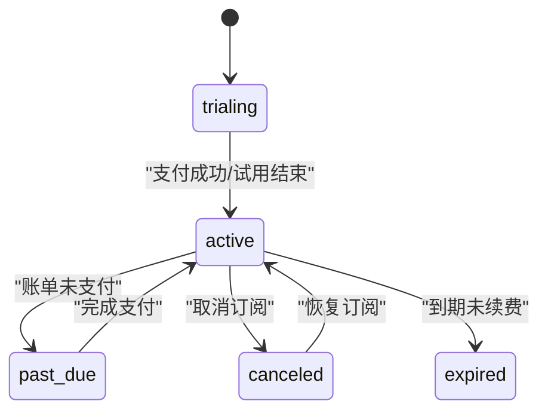
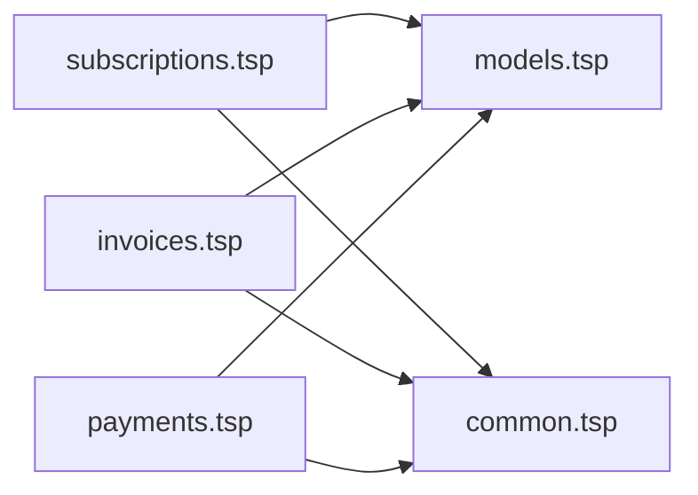

# 订阅生命周期管理

<cite>
**本文引用的文件**
- [subscriptions.tsp](file://api/billing/subscriptions.tsp)
- [models.tsp](file://api/billing/models.tsp)
- [invoices.tsp](file://api/billing/invoices.tsp)
- [payments.tsp](file://api/billing/payments.tsp)
- [common.tsp](file://api/shared/common.tsp)
- [index.tsp](file://api/billing/index.tsp)
</cite>

## 目录
1. [简介](#简介)
2. [项目结构](#项目结构)
3. [核心组件](#核心组件)
4. [架构概览](#架构概览)
5. [详细组件分析](#详细组件分析)
6. [依赖关系分析](#依赖关系分析)
7. [性能考量](#性能考量)
8. [故障排查指南](#故障排查指南)
9. [结论](#结论)
10. [附录](#附录)

## 简介
本文件面向企业客户与平台开发者，系统化阐述订阅生命周期管理模块的完整状态机与关键流程，覆盖从创建订阅、变更计划（升级/降级）、取消订阅到恢复订阅的全链路。重点说明：
- changePlan 的生效策略与按比例计费（proration）计算逻辑
- OrganizationSubscription 数据模型的关键字段及其业务含义
- 订阅状态转换规则（active、canceled、past_due 等）
- 与发票（invoices）与支付（payments）模块的集成点
- 支付失败导致的订阅暂停与后续处理建议

## 项目结构
订阅生命周期管理位于 billing 模块下，核心文件包括：
- 订阅接口定义：api/billing/subscriptions.tsp
- 数据模型与枚举：api/billing/models.tsp
- 发票接口：api/billing/invoices.tsp
- 支付方式接口：api/billing/payments.tsp
- 通用响应结构：api/shared/common.tsp
- 模块入口索引：api/billing/index.tsp

图表来源
- [index.tsp](file://api/billing/index.tsp#L1-L10)
- [subscriptions.tsp](file://api/billing/subscriptions.tsp#L1-L106)
- [models.tsp](file://api/billing/models.tsp#L1-L444)
- [invoices.tsp](file://api/billing/invoices.tsp#L1-L76)
- [payments.tsp](file://api/billing/payments.tsp#L1-L75)
- [common.tsp](file://api/shared/common.tsp#L153-L177)

章节来源
- [index.tsp](file://api/billing/index.tsp#L1-L10)

## 核心组件
- 订阅接口 OrganizationSubscriptionApi：提供获取订阅、创建/更新订阅、变更计划、取消订阅、恢复订阅等能力。
- 数据模型 OrganizationSubscription：承载订阅状态、计费周期、到期时间、取消时间等关键字段。
- 计费周期 BillingCycle：monthly/yearly。
- 订阅状态 SubscriptionStatus：trialing/active/past_due/canceled/expired。
- 发票与支付：通过 invoices 与 payments 接口完成账单生成与支付处理，支撑订阅状态流转。

章节来源
- [subscriptions.tsp](file://api/billing/subscriptions.tsp#L17-L106)
- [models.tsp](file://api/billing/models.tsp#L40-L67)
- [models.tsp](file://api/billing/models.tsp#L214-L257)
- [invoices.tsp](file://api/billing/invoices.tsp#L17-L76)
- [payments.tsp](file://api/billing/payments.tsp#L17-L75)
- [common.tsp](file://api/shared/common.tsp#L153-L177)

## 架构概览
订阅生命周期管理围绕 OrganizationSubscriptionApi 展开，与 invoices、payments 模块协同完成账单与支付闭环；通用响应结构 ApiResponse 统一承载所有接口的返回格式。

图表来源
- [subscriptions.tsp](file://api/billing/subscriptions.tsp#L17-L106)
- [invoices.tsp](file://api/billing/invoices.tsp#L17-L76)
- [payments.tsp](file://api/billing/payments.tsp#L17-L75)
- [models.tsp](file://api/billing/models.tsp#L214-L257)
- [common.tsp](file://api/shared/common.tsp#L153-L177)

## 详细组件分析

### 订阅接口与端点说明
- 获取订阅：GET /api/v1/organizations/{organizationId}/subscription
  - 返回当前组织的订阅信息，类型为 ApiResponse<OrganizationSubscription>。
- 创建或更新订阅：POST /api/v1/organizations/{organizationId}/subscription
  - 请求体包含 planId、billingCycle、paymentMethodId（可选）。
  - 返回 ApiResponse<OrganizationSubscription>。
- 变更订阅计划：POST /api/v1/organizations/{organizationId}/subscription/change-plan
  - 请求体包含 targetPlanId、billingCycle、effectiveDate（immediate 或 next_billing_cycle）。
  - 返回 ApiResponse<{subscription, prorationAmount, nextBillingDate}>。
- 取消订阅：POST /api/v1/organizations/{organizationId}/subscription/cancel
  - 请求体包含 cancelImmediately、reason（可选）、feedback（可选）。
  - 返回 ApiResponse<OrganizationSubscription>。
- 恢复订阅：POST /api/v1/organizations/{organizationId}/subscription/resume
  - 返回 ApiResponse<OrganizationSubscription>。

章节来源
- [subscriptions.tsp](file://api/billing/subscriptions.tsp#L17-L106)
- [common.tsp](file://api/shared/common.tsp#L153-L177)

### OrganizationSubscription 数据模型
关键字段与业务含义：
- id、organizationId、planId：订阅标识、所属组织、订阅计划。
- status：订阅状态（trialing/active/past_due/canceled/expired）。
- trialStart/trialEnd：试用起止时间。
- currentPeriodStart/currentPeriodEnd：当前计费周期起止。
- cancelAt/canceledAt：计划取消时间与实际取消时间。
- metadata：自定义元数据。
- createdAt/updatedAt：创建与更新时间。

图表来源
- [models.tsp](file://api/billing/models.tsp#L214-L257)
- [models.tsp](file://api/billing/models.tsp#L40-L67)

章节来源
- [models.tsp](file://api/billing/models.tsp#L214-L257)

### 订阅状态机与流转规则
- trialing → active：试用期结束且支付成功。
- active → past_due：账单到期未支付。
- active → canceled：主动取消或到期取消。
- past_due → active：完成支付后恢复。
- canceled → active：恢复订阅。
- active → expired：到期且未续费。

说明
- 该图为概念性状态图，用于帮助理解订阅状态之间的常见流转。具体实现细节以各端点行为为准。

## 依赖关系分析
- 订阅接口依赖数据模型（SubscriptionStatus、BillingCycle、OrganizationSubscription）与通用响应结构（ApiResponse）。
- 发票与支付接口与订阅状态密切相关：当订阅处于 active/past_due 时，系统会生成发票并触发支付流程；支付成功后订阅状态可能从 past_due 回到 active。

图表来源
- [subscriptions.tsp](file://api/billing/subscriptions.tsp#L17-L106)
- [models.tsp](file://api/billing/models.tsp#L1-L444)
- [invoices.tsp](file://api/billing/invoices.tsp#L17-L76)
- [payments.tsp](file://api/billing/payments.tsp#L17-L75)
- [common.tsp](file://api/shared/common.tsp#L153-L177)

章节来源
- [index.tsp](file://api/billing/index.tsp#L1-L10)

## 性能考量
- 变更计划（changePlan）涉及按比例计费计算与下次账单日期推导，建议在调用前缓存目标计划与计费周期信息，减少重复查询。
- 取消订阅（cancelSubscription）与恢复订阅（resumeSubscription）应避免频繁调用，建议前端做幂等控制与状态提示。
- 发票支付（payInvoice）可能触发第三方支付网关，注意超时与重试策略，避免对用户造成等待体验。

## 故障排查指南
- 取消订阅失败
  - 检查 cancelImmediately 参数是否符合预期；确认取消原因与反馈字段是否合规。
  - 关注返回的 OrganizationSubscription 状态变化，若仍为 active，需检查是否存在未完成的支付或账单。
- 恢复订阅无效
  - 确认订阅确处于 canceled 状态；若状态为 expired，可能需要重新创建订阅或联系客服。
- 支付失败导致暂停
  - 订阅进入 past_due 后，需引导用户完成支付；可通过 invoices 接口查询待支付账单并使用 payments 接口选择支付方式完成支付。
- 按比例计费异常
  - 确认 effectiveDate 选择 immediate 或 next_billing_cycle 是否正确；检查 prorationAmount 与 nextBillingDate 的返回值是否合理。

章节来源
- [subscriptions.tsp](file://api/billing/subscriptions.tsp#L76-L106)
- [invoices.tsp](file://api/billing/invoices.tsp#L17-L76)
- [payments.tsp](file://api/billing/payments.tsp#L17-L75)
- [models.tsp](file://api/billing/models.tsp#L214-L257)

## 结论
订阅生命周期管理通过清晰的接口与数据模型，实现了从创建、变更、取消到恢复的完整闭环，并与发票与支付模块紧密集成。理解 changePlan 的生效策略与按比例计费逻辑，有助于为用户提供准确的费用预估与平滑的升级/降级体验；同时，结合 invoices 与 payments 的联动，可有效处理支付失败导致的暂停问题，提升订阅稳定性与用户体验。

## 附录

### API 端点与响应结构速览
- GET /api/v1/organizations/{organizationId}/subscription
  - 响应：ApiResponse<OrganizationSubscription>
- POST /api/v1/organizations/{organizationId}/subscription
  - 请求体：{ planId, billingCycle, paymentMethodId? }
  - 响应：ApiResponse<OrganizationSubscription>
- POST /api/v1/organizations/{organizationId}/subscription/change-plan
  - 请求体：{ targetPlanId, billingCycle, effectiveDate }
  - 响应：ApiResponse<{ subscription, prorationAmount, nextBillingDate }>
- POST /api/v1/organizations/{organizationId}/subscription/cancel
  - 请求体：{ cancelImmediately, reason?, feedback? }
  - 响应：ApiResponse<OrganizationSubscription>
- POST /api/v1/organizations/{organizationId}/subscription/resume
  - 响应：ApiResponse<OrganizationSubscription>

章节来源
- [subscriptions.tsp](file://api/billing/subscriptions.tsp#L17-L106)
- [common.tsp](file://api/shared/common.tsp#L153-L177)

### 实际使用场景示例：企业从基础版升级到专业版
- 步骤
  1) 调用 GET /api/v1/organizations/{organizationId}/subscription 获取当前订阅状态与计费周期。
  2) 调用 POST /api/v1/organizations/{organizationId}/subscription/change-plan
     - 传入 targetPlanId 为目标专业版计划 ID，billingCycle 保持当前周期，effectiveDate 选择 immediate。
     - 记录返回的 prorationAmount 与 nextBillingDate，向用户展示按比例扣费与下次账单日期。
  3) 若存在未支付账单，调用 POST /api/v1/organizations/{organizationId}/invoices/{id}/pay 完成支付。
  4) 再次调用 GET /api/v1/organizations/{organizationId}/subscription 确认状态变为 active。
- 注意
  - 如用户希望在下一个计费周期生效，将 effectiveDate 设为 next_billing_cycle，此时不会产生按比例扣费。

章节来源
- [subscriptions.tsp](file://api/billing/subscriptions.tsp#L56-L74)
- [invoices.tsp](file://api/billing/invoices.tsp#L56-L76)

### 按比例计费（proration）与生效策略（effectiveDate）
- prorationAmount：根据剩余周期内新旧计划的价格差计算，仅在 immediate 生效时返回。
- effectiveDate：
  - immediate：立即生效，可能产生 prorationAmount。
  - next_billing_cycle：在当前计费周期结束后生效，不产生 prorationAmount。
- nextBillingDate：变更后的下次账单日期，用于告知用户何时扣款。

章节来源
- [subscriptions.tsp](file://api/billing/subscriptions.tsp#L56-L74)
- [models.tsp](file://api/billing/models.tsp#L237-L241)

### 与 invoices 与 payments 的集成点
- 发票生成：订阅 active/past_due 时，系统会生成对应周期的发票（Invoice），包含 periodStart/periodEnd、dueDate、total 等。
- 支付处理：通过 invoices/{id}/pay 完成支付；若支付需要进一步操作（requiresAction），客户端需按返回的指示完成后续步骤（例如 3D Secure）。
- 支付方式：通过 payments 接口维护与选择默认支付方式，确保自动扣款顺利进行。

章节来源
- [invoices.tsp](file://api/billing/invoices.tsp#L17-L76)
- [payments.tsp](file://api/billing/payments.tsp#L17-L75)
- [models.tsp](file://api/billing/models.tsp#L278-L332)