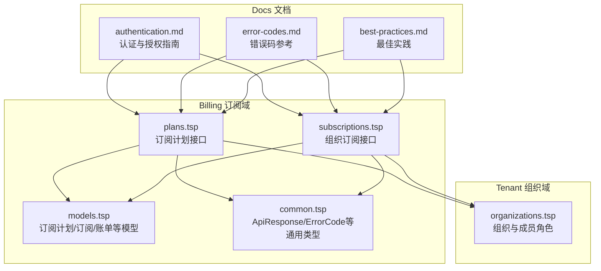
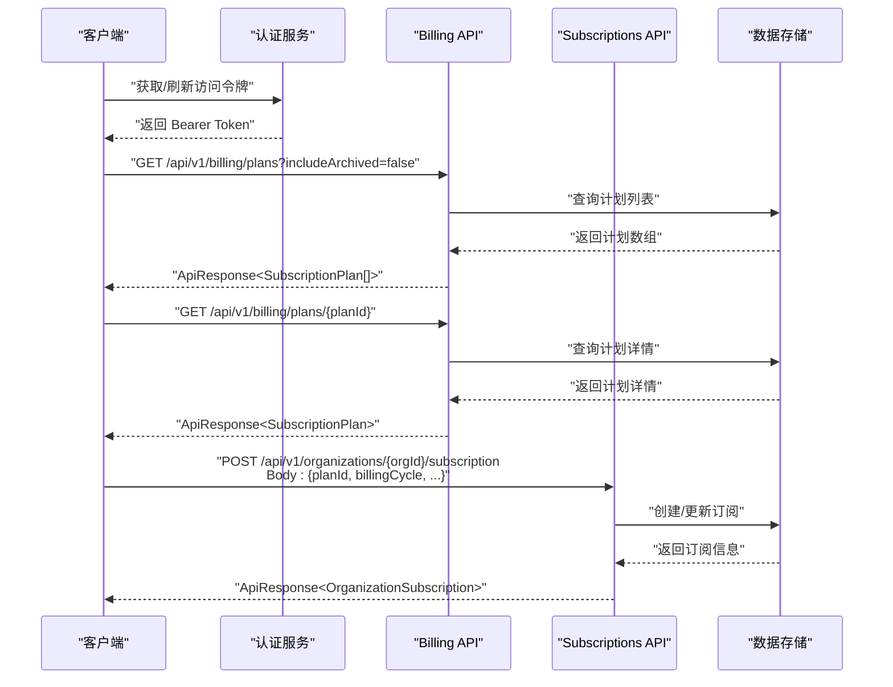
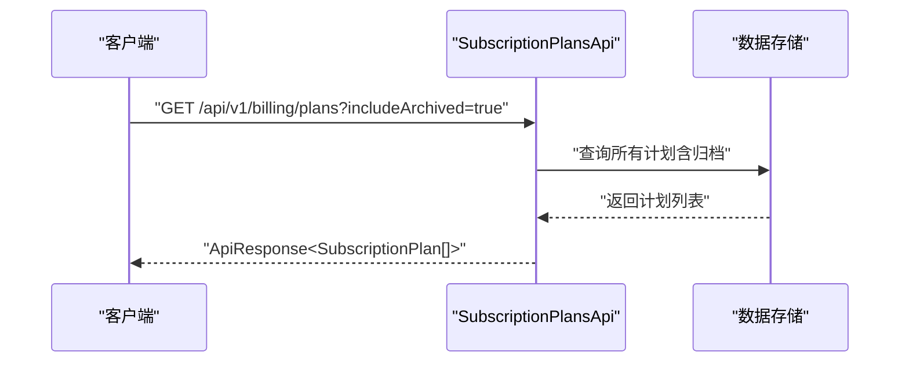
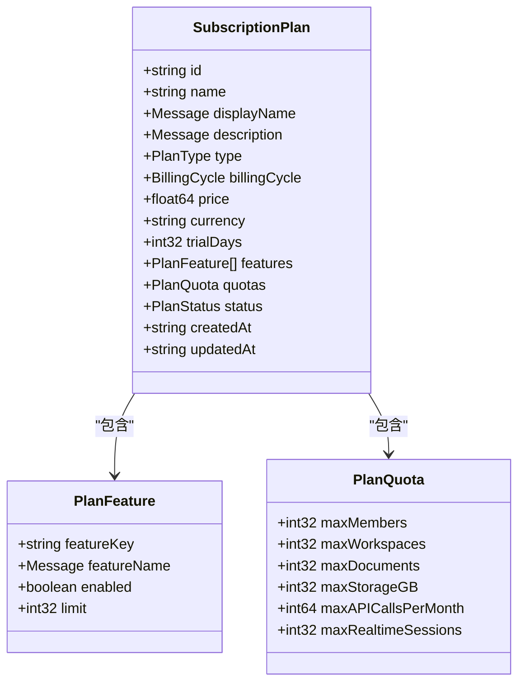
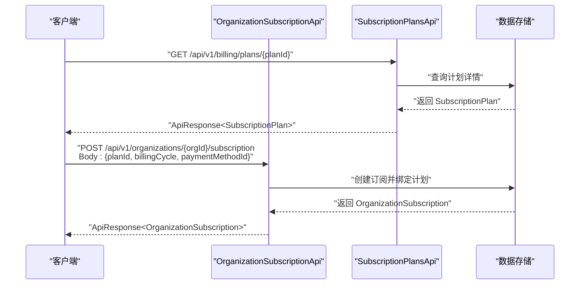
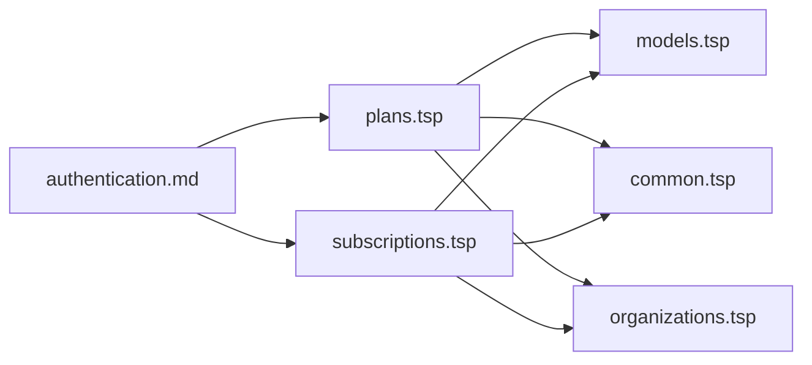

# 订阅计划管理

<cite>
**本文引用的文件**
- [plans.tsp](file://api/billing/plans.tsp)
- [models.tsp](file://api/billing/models.tsp)
- [subscriptions.tsp](file://api/billing/subscriptions.tsp)
- [common.tsp](file://api/shared/common.tsp)
- [organizations.tsp](file://api/tenant/organizations.tsp)
- [authentication.md](file://docs-src/guides/authentication.md)
- [error-codes.md](file://docs-src/references/error-codes.md)
- [best-practices.md](file://docs-src/guides/best-practices.md)
</cite>

## 目录
1. [简介](#简介)
2. [项目结构](#项目结构)
3. [核心组件](#核心组件)
4. [架构概览](#架构概览)
5. [详细组件分析](#详细组件分析)
6. [依赖分析](#依赖分析)
7. [性能考虑](#性能考虑)
8. [故障排查指南](#故障排查指南)
9. [结论](#结论)
10. [附录](#附录)

## 简介
本文件面向订阅计划管理的API文档，聚焦于plans.tsp中定义的订阅计划查询能力，包括listPlans与getPlan两个端点；同时结合billing模块的SubscriptionPlan数据模型，解释计费周期、定价结构、功能配额与状态等字段含义；说明includeArchived查询参数的作用；给出Bearer Token认证与组织管理员角色访问控制要求；并阐述与subscriptions.tsp的关联关系及在创建新订阅时如何引用这些计划。此外，提供与第三方系统同步订阅计划的最佳实践与常见错误处理策略（如404 Plan Not Found）。

## 项目结构
订阅计划管理相关的核心文件位于billing子模块，配合tenant模块的组织角色定义与shared模块的通用响应模型，形成完整的API边界与数据契约。

图表来源
- [plans.tsp](file://api/billing/plans.tsp#L1-L41)
- [models.tsp](file://api/billing/models.tsp#L1-L213)
- [subscriptions.tsp](file://api/billing/subscriptions.tsp#L1-L107)
- [common.tsp](file://api/shared/common.tsp#L153-L177)
- [organizations.tsp](file://api/tenant/organizations.tsp#L396-L424)
- [authentication.md](file://docs-src/guides/authentication.md#L1-L507)
- [error-codes.md](file://docs-src/references/error-codes.md#L1-L312)
- [best-practices.md](file://docs-src/guides/best-practices.md#L1-L474)

章节来源
- [plans.tsp](file://api/billing/plans.tsp#L1-L41)
- [models.tsp](file://api/billing/models.tsp#L1-L213)
- [subscriptions.tsp](file://api/billing/subscriptions.tsp#L1-L107)
- [common.tsp](file://api/shared/common.tsp#L153-L177)
- [organizations.tsp](file://api/tenant/organizations.tsp#L396-L424)

## 核心组件
- 订阅计划接口
  - listPlans：列出可用订阅计划，支持includeArchived查询参数过滤已归档计划
  - getPlan：按计划ID获取订阅计划详情
- 订阅计划数据模型SubscriptionPlan
  - 字段涵盖：标识、名称、多语言显示名与描述、计划类型、计费周期、价格与货币、试用天数、功能特性列表、配额限制、状态、创建/更新时间
- 组织订阅接口
  - createSubscription：创建或更新组织订阅，需传入planId与billingCycle等
- 通用响应模型
  - ApiResponse<T>：统一的成功/失败、错误码、消息与载荷结构

章节来源
- [plans.tsp](file://api/billing/plans.tsp#L17-L40)
- [models.tsp](file://api/billing/models.tsp#L133-L213)
- [subscriptions.tsp](file://api/billing/subscriptions.tsp#L17-L67)
- [common.tsp](file://api/shared/common.tsp#L153-L177)

## 架构概览
订阅计划管理涉及“查询计划”和“创建订阅”的两条路径：前者由plans.tsp提供，后者由subscriptions.tsp提供；两者均依赖billing/models.tsp中的数据模型；认证与授权由authentication.md与organizations.tsp共同定义。

图表来源
- [plans.tsp](file://api/billing/plans.tsp#L17-L40)
- [subscriptions.tsp](file://api/billing/subscriptions.tsp#L17-L67)
- [models.tsp](file://api/billing/models.tsp#L133-L213)
- [authentication.md](file://docs-src/guides/authentication.md#L1-L507)

## 详细组件分析

### 订阅计划接口（listPlans 与 getPlan）
- listPlans
  - 路由：/api/v1/billing/plans
  - 方法：GET
  - 查询参数：
    - includeArchived：布尔，默认false；当为true时包含已归档计划
  - 响应：ApiResponse<SubscriptionPlan[]>
- getPlan
  - 路由：/api/v1/billing/plans/{planId}
  - 方法：GET
  - 路径参数：planId（字符串）
  - 响应：ApiResponse<SubscriptionPlan>

图表来源
- [plans.tsp](file://api/billing/plans.tsp#L17-L40)

章节来源
- [plans.tsp](file://api/billing/plans.tsp#L17-L40)

### SubscriptionPlan 数据模型字段说明
- 基本信息
  - id：计划唯一标识
  - name：计划名称
  - displayName：多语言显示名
  - description：多语言描述
- 类型与周期
  - type：计划类型（trial/standard/custom）
  - billingCycle：计费周期（monthly/yearly）
  - price：价格（浮点）
  - currency：货币代码（如CNY/USD）
  - trialDays：试用天数（可选）
- 功能与配额
  - features：PlanFeature[]，包含featureKey、featureName（Message）、enabled、limit（可选）
  - quotas：PlanQuota，包含maxMembers/maxWorkspaces/maxDocuments/maxStorageGB/maxAPICallsPerMonth/maxRealtimeSessions
- 状态与时间
  - status：PlanStatus（active/archived）
  - createdAt/updatedAt：创建与更新时间

图表来源
- [models.tsp](file://api/billing/models.tsp#L133-L213)

章节来源
- [models.tsp](file://api/billing/models.tsp#L133-L213)

### 与订阅创建的关系（subscriptions.tsp）
- 创建订阅时需提供：
  - planId：目标订阅计划ID
  - billingCycle：计费周期（与SubscriptionPlan.billingCycle一致）
  - paymentMethodId：可选，支付方式ID
- 响应包含OrganizationSubscription，其中planId与plan（可选）字段用于关联计划详情

图表来源
- [subscriptions.tsp](file://api/billing/subscriptions.tsp#L17-L67)
- [plans.tsp](file://api/billing/plans.tsp#L17-L40)
- [models.tsp](file://api/billing/models.tsp#L133-L213)

章节来源
- [subscriptions.tsp](file://api/billing/subscriptions.tsp#L17-L67)
- [models.tsp](file://api/billing/models.tsp#L133-L213)

### 认证与访问控制
- 认证方式
  - 使用Bearer Token进行认证，Token来源于OAuth2/OIDC流程
- 访问控制
  - 订阅计划查询端点本身未显式标注角色要求；但组织订阅创建端点与组织管理密切相关
  - 组织角色枚举包含owner/admin/member/guest，通常创建/管理订阅需要admin或更高权限
- 建议
  - 在调用订阅相关API前，先确认当前用户对目标组织具备相应角色权限
  - 使用最小权限的Scope，避免不必要的授权

章节来源
- [authentication.md](file://docs-src/guides/authentication.md#L1-L507)
- [organizations.tsp](file://api/tenant/organizations.tsp#L396-L424)

### includeArchived 查询参数
- 作用：控制listPlans是否包含已归档计划
- 默认值：false
- 使用建议：
  - 日常查询：保持默认，仅获取active计划
  - 管理后台/审计：传入true，获取全部计划（含archived）

章节来源
- [plans.tsp](file://api/billing/plans.tsp#L24-L28)

### 实际HTTP请求示例（示意）
- 获取标准与企业级订阅计划
  - GET /api/v1/billing/plans?includeArchived=false
- 获取指定计划详情
  - GET /api/v1/billing/plans/{planId}
- 创建组织订阅（引用计划）
  - POST /api/v1/organizations/{organizationId}/subscription
  - Body: { planId, billingCycle, paymentMethodId? }

说明：以上为端点与参数说明，具体请求需携带Authorization: Bearer YOUR_ACCESS_TOKEN。

章节来源
- [plans.tsp](file://api/billing/plans.tsp#L17-L40)
- [subscriptions.tsp](file://api/billing/subscriptions.tsp#L17-L67)
- [authentication.md](file://docs-src/guides/authentication.md#L1-L507)

### 与第三方系统同步订阅计划的最佳实践
- 建议采用“计划ID驱动”的同步策略
  - 以SubscriptionPlan.id为关键键，避免依赖名称或描述的变动
  - 对比本地缓存与远端listPlans结果，识别新增、更新、归档
- 变更检测
  - 增量同步：基于updatedAt时间戳或游标分页
  - 全量同步：定期拉取includeArchived=true的计划列表
- 幂等与回滚
  - 幂等：对同一计划ID的更新应可重复执行
  - 回滚：若同步失败，保留上一次成功状态，避免覆盖
- 错误处理
  - 对404 Plan Not Found：检查计划ID是否仍有效；若已归档，按includeArchived策略决定是否保留
  - 对401/403：刷新Token或调整Scope；对403：确认组织角色权限
  - 对5xx：指数退避重试，记录重试次数与延迟

章节来源
- [error-codes.md](file://docs-src/references/error-codes.md#L1-L312)
- [best-practices.md](file://docs-src/guides/best-practices.md#L1-L474)

## 依赖分析
- plans.tsp依赖
  - models.tsp：SubscriptionPlan、PlanType、BillingCycle、PlanStatus等
  - common.tsp：ApiResponse统一响应包装
- subscriptions.tsp依赖
  - models.tsp：OrganizationSubscription、BillingCycle等
  - common.tsp：ApiResponse统一响应包装
- 认证与授权
  - authentication.md：Bearer Token与OAuth2/OIDC流程
  - organizations.tsp：组织角色枚举，用于判断访问权限

图表来源
- [plans.tsp](file://api/billing/plans.tsp#L1-L41)
- [subscriptions.tsp](file://api/billing/subscriptions.tsp#L1-L107)
- [models.tsp](file://api/billing/models.tsp#L1-L213)
- [common.tsp](file://api/shared/common.tsp#L153-L177)
- [organizations.tsp](file://api/tenant/organizations.tsp#L396-L424)
- [authentication.md](file://docs-src/guides/authentication.md#L1-L507)

章节来源
- [plans.tsp](file://api/billing/plans.tsp#L1-L41)
- [subscriptions.tsp](file://api/billing/subscriptions.tsp#L1-L107)
- [models.tsp](file://api/billing/models.tsp#L1-L213)
- [common.tsp](file://api/shared/common.tsp#L153-L177)
- [organizations.tsp](file://api/tenant/organizations.tsp#L396-L424)
- [authentication.md](file://docs-src/guides/authentication.md#L1-L507)

## 性能考虑
- 列表查询
  - 合理使用includeArchived，避免一次性拉取大量归档数据
  - 若计划数量较大，建议分页或游标分页
- 并发与缓存
  - 对计划详情的热点数据进行短期缓存，减少重复查询
- 错误重试
  - 对5xx与临时性错误采用指数退避重试，避免雪崩

章节来源
- [best-practices.md](file://docs-src/guides/best-practices.md#L1-L474)

## 故障排查指南
- 401/403
  - 确认Authorization头是否包含有效的Bearer Token
  - 检查Token是否过期或Scope不足
- 404 Plan Not Found
  - 检查planId是否正确且未被删除/归档
  - 若includeArchived=false，归档计划不会出现在列表中
- 409/429/500
  - 409：资源冲突（如并发更新），建议重试或加版本号
  - 429：请求过于频繁，遵循限流策略
  - 500：服务器内部错误，指数退避重试并记录上下文

章节来源
- [error-codes.md](file://docs-src/references/error-codes.md#L1-L312)

## 结论
- plans.tsp提供了订阅计划的查询能力，结合includeArchived可灵活控制归档计划的可见性
- SubscriptionPlan模型清晰定义了定价、周期、功能与配额等关键维度
- subscriptions.tsp通过planId与billingCycle将计划与订阅绑定，支撑创建新订阅的业务流程
- 认证采用Bearer Token，访问控制建议基于组织管理员角色
- 同步订阅计划时，建议以计划ID为驱动，结合幂等、回滚与错误重试策略，提升稳定性

## 附录
- 关键端点速览
  - GET /api/v1/billing/plans?includeArchived={boolean}
  - GET /api/v1/billing/plans/{planId}
  - POST /api/v1/organizations/{organizationId}/subscription
- 关键模型速览
  - SubscriptionPlan、PlanFeature、PlanQuota、BillingCycle、PlanStatus