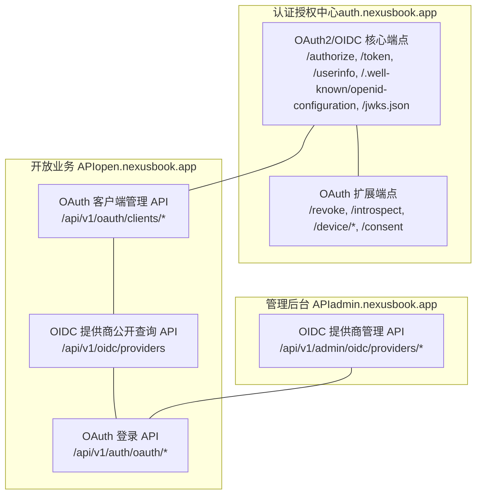
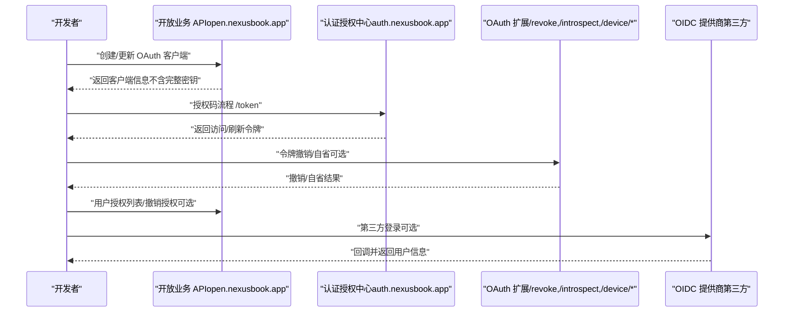
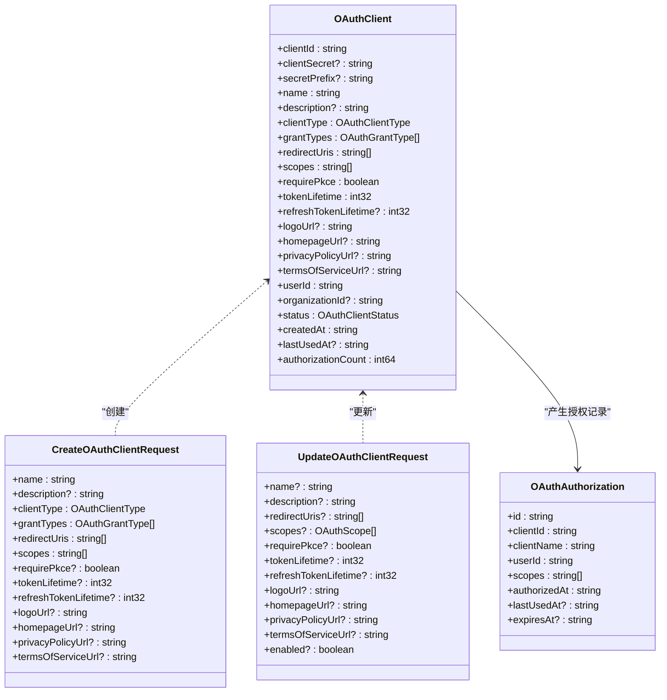
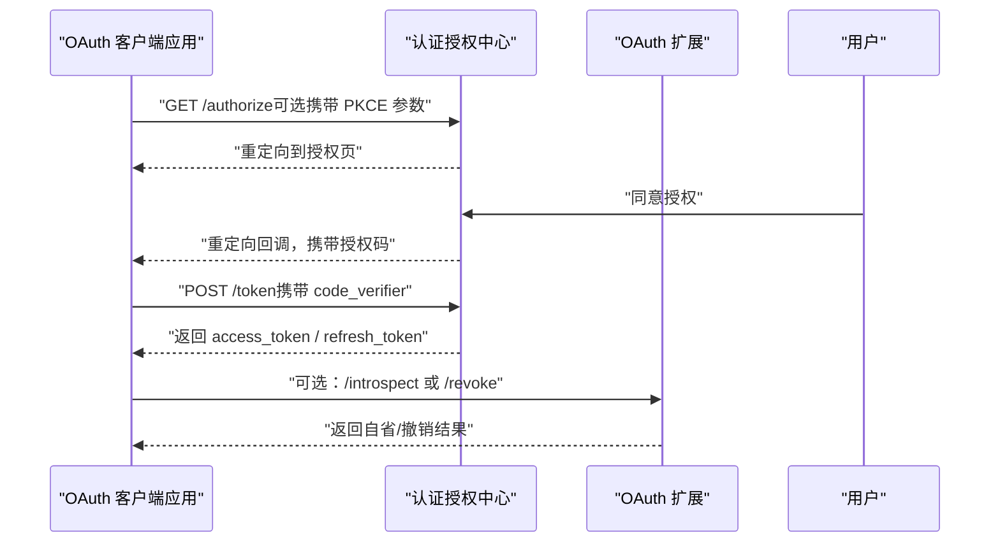
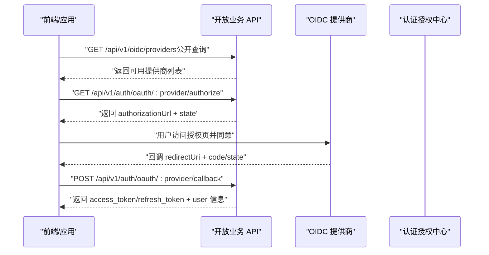
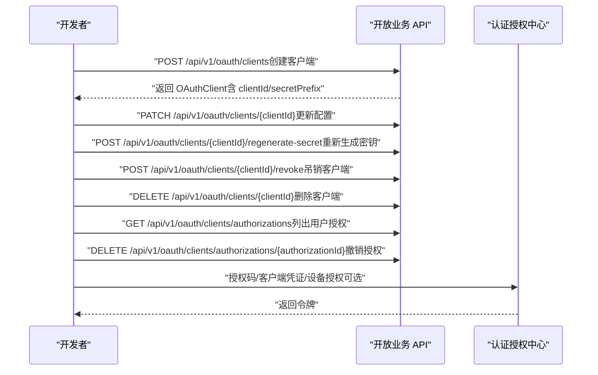
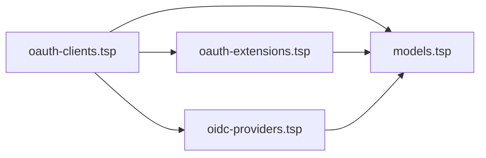

# OAuth 客户端管理

<cite>
**本文引用的文件**
- [oauth-clients.tsp](file://api/auth/oauth-clients.tsp)
- [models.tsp](file://api/auth/models.tsp)
- [oauth-extensions.tsp](file://api/auth/oauth-extensions.tsp)
- [oidc-providers.tsp](file://api/auth/oidc-providers.tsp)
- [common.tsp](file://api/shared/common.tsp)
- [AUTH_MODULES_OVERVIEW.md](file://api/auth/AUTH_MODULES_OVERVIEW.md)
- [AUTH_API_TYPESPEC_ADJUSTMENTS.md](file://AUTH_API_TYPESPEC_ADJUSTMENTS.md)
</cite>

## 目录
1. [简介](#简介)
2. [项目结构](#项目结构)
3. [核心组件](#核心组件)
4. [架构总览](#架构总览)
5. [详细组件分析](#详细组件分析)
6. [依赖分析](#依赖分析)
7. [性能考虑](#性能考虑)
8. [故障排查指南](#故障排查指南)
9. [结论](#结论)
10. [附录](#附录)

## 简介
本文件聚焦于“OAuth 客户端管理”能力，基于仓库中的 TypeSpec 定义与模块化设计，系统梳理 OAuth 客户端应用的生命周期管理、凭证与安全策略（如 PKCE）、授权范围与授权记录、以及与 OIDC 提供商、令牌扩展能力的协同关系。文档同时给出架构视图、关键流程时序图、数据模型关系图，并提供面向开发与运维的实践建议与排障指引。

## 项目结构
OAuth 客户端管理位于认证授权子系统中，采用模块化划分：
- 认证与授权核心（models.tsp）：定义 OAuth2/OIDC 核心端点、令牌响应、用户信息、Provider 元数据等
- OAuth 客户端管理（oauth-clients.tsp）：提供 OAuth 客户端的注册、配置、密钥轮换、吊销与删除，以及用户授权记录管理
- OAuth 扩展（oauth-extensions.tsp）：提供令牌撤销、令牌自省、设备授权、PKCE 参数等扩展能力
- OIDC 提供商（oidc-providers.tsp）：第三方 OIDC 提供商的配置与登录集成
- 通用类型（common.tsp）：统一响应结构、分页、错误码等

图表来源
- [models.tsp](file://api/auth/models.tsp#L41-L583)
- [oauth-clients.tsp](file://api/auth/oauth-clients.tsp#L482-L637)
- [oauth-extensions.tsp](file://api/auth/oauth-extensions.tsp#L454-L571)
- [oidc-providers.tsp](file://api/auth/oidc-providers.tsp#L463-L749)
- [AUTH_API_TYPESPEC_ADJUSTMENTS.md](file://AUTH_API_TYPESPEC_ADJUSTMENTS.md#L51-L119)

章节来源
- [AUTH_MODULES_OVERVIEW.md](file://api/auth/AUTH_MODULES_OVERVIEW.md#L570-L605)
- [AUTH_API_TYPESPEC_ADJUSTMENTS.md](file://AUTH_API_TYPESPEC_ADJUSTMENTS.md#L51-L119)

## 核心组件
- OAuth 客户端模型与生命周期
  - OAuthClient：客户端标识、类型、授权类型、重定向 URI、授权范围、PKCE、令牌有效期、Logo/主页/隐私政策/服务条款链接、所属用户/组织、状态、统计与时间戳
  - CreateOAuthClientRequest / UpdateOAuthClientRequest：创建与更新的输入模型
  - OAuthAuthorization：用户授权记录（授权 ID、客户端信息、授权范围、时间戳）
- OAuth 授权类型与范围
  - OAuthGrantType：授权码、客户端凭证、刷新令牌、设备授权
  - OAuthScope：业务范围与 OIDC 标准范围的组合
- OAuth 客户端管理 API
  - 注册、列出、详情、更新、重新生成密钥、吊销、删除
  - 用户授权列表与撤销授权
- OAuth 扩展能力
  - 令牌撤销、令牌自省、设备授权、PKCE 参数
- OIDC 提供商与登录
  - 提供商配置、公开查询、登录 URL 生成、回调处理、账号关联与解绑

章节来源
- [oauth-clients.tsp](file://api/auth/oauth-clients.tsp#L28-L262)
- [oauth-clients.tsp](file://api/auth/oauth-clients.tsp#L264-L424)
- [oauth-clients.tsp](file://api/auth/oauth-clients.tsp#L426-L636)
- [models.tsp](file://api/auth/models.tsp#L45-L134)
- [oauth-extensions.tsp](file://api/auth/oauth-extensions.tsp#L24-L312)
- [oauth-extensions.tsp](file://api/auth/oauth-extensions.tsp#L165-L312)
- [oidc-providers.tsp](file://api/auth/oidc-providers.tsp#L125-L232)
- [oidc-providers.tsp](file://api/auth/oidc-providers.tsp#L463-L749)

## 架构总览
OAuth 客户端管理贯穿“开放业务 API”与“认证授权中心”，并与 OIDC 提供商、令牌扩展形成闭环：
- 开发者通过开放业务 API 创建与管理 OAuth 客户端
- 应用使用客户端凭据发起授权码/客户端凭证/设备授权等流程
- 认证授权中心负责令牌签发、用户信息、OIDC 元数据与 JWKS
- OAuth 扩展提供令牌撤销、自省与设备授权等增强能力
- OIDC 提供商模块支撑第三方登录与账号关联

图表来源
- [oauth-clients.tsp](file://api/auth/oauth-clients.tsp#L482-L636)
- [models.tsp](file://api/auth/models.tsp#L521-L583)
- [oauth-extensions.tsp](file://api/auth/oauth-extensions.tsp#L454-L571)
- [oidc-providers.tsp](file://api/auth/oidc-providers.tsp#L620-L749)

## 详细组件分析

### OAuth 客户端模型与 API
- 客户端类型与授权类型
  - 公开/机密客户端区分，支持授权码、客户端凭证、刷新令牌、设备授权
- 授权范围与 OIDC 兼容
  - OAuthScope 支持业务范围与 OIDC 标准范围组合
- 安全与合规
  - requirePkce 控制是否强制 PKCE
  - tokenLifetime/refreshTokenLifetime 控制令牌有效期
- 生命周期管理
  - createOAuthClient、listOAuthClients、getOAuthClient、updateOAuthClient
  - regenerateClientSecret、revokeOAuthClient、deleteOAuthClient
  - listUserAuthorizations、revokeUserAuthorization

图表来源
- [oauth-clients.tsp](file://api/auth/oauth-clients.tsp#L123-L262)
- [oauth-clients.tsp](file://api/auth/oauth-clients.tsp#L264-L424)
- [oauth-clients.tsp](file://api/auth/oauth-clients.tsp#L426-L478)

章节来源
- [oauth-clients.tsp](file://api/auth/oauth-clients.tsp#L28-L262)
- [oauth-clients.tsp](file://api/auth/oauth-clients.tsp#L264-L424)
- [oauth-clients.tsp](file://api/auth/oauth-clients.tsp#L426-L636)

### OAuth 授权流程与 PKCE
- 授权码流程
  - 客户端通过 /authorize 获取授权码，再通过 /token 交换访问/刷新令牌
- PKCE 强制
  - requirePkce 为 true 时，授权端点需携带 code_challenge 与 code_challenge_method
- 设备授权流程
  - 通过 /device/authorize 获取设备码与用户码，用户在验证页确认授权后换取令牌

图表来源
- [models.tsp](file://api/auth/models.tsp#L521-L583)
- [oauth-extensions.tsp](file://api/auth/oauth-extensions.tsp#L454-L571)
- [oauth-extensions.tsp](file://api/auth/oauth-extensions.tsp#L165-L312)

章节来源
- [models.tsp](file://api/auth/models.tsp#L521-L583)
- [oauth-extensions.tsp](file://api/auth/oauth-extensions.tsp#L24-L312)
- [oauth-extensions.tsp](file://api/auth/oauth-extensions.tsp#L165-L312)

### OIDC 提供商与第三方登录
- 公开查询
  - 列出可用 OIDC 提供商（不含密钥），用于登录页面展示
- 管理端点（建议迁移至 admin 域名）
  - 添加/获取/更新/删除提供商配置（含密钥）
- 登录流程
  - 获取授权 URL -> 用户授权 -> 回调处理 -> 返回令牌与用户信息
  - 支持账号关联与解绑

图表来源
- [oidc-providers.tsp](file://api/auth/oidc-providers.tsp#L463-L749)
- [AUTH_API_TYPESPEC_ADJUSTMENTS.md](file://AUTH_API_TYPESPEC_ADJUSTMENTS.md#L243-L351)

章节来源
- [oidc-providers.tsp](file://api/auth/oidc-providers.tsp#L463-L749)
- [AUTH_API_TYPESPEC_ADJUSTMENTS.md](file://AUTH_API_TYPESPEC_ADJUSTMENTS.md#L243-L351)

### OAuth 客户端管理 API 时序

图表来源
- [oauth-clients.tsp](file://api/auth/oauth-clients.tsp#L482-L636)
- [models.tsp](file://api/auth/models.tsp#L521-L583)

章节来源
- [oauth-clients.tsp](file://api/auth/oauth-clients.tsp#L482-L636)

## 依赖分析
- 模块耦合
  - oauth-clients.tsp 依赖 models.tsp 中的 AuthScope、OidcStandardScope、TokenResponse 等
  - oauth-extensions.tsp 与 models.tsp 的 ProviderMetadata/JWK/UserInfo 等模型配合
  - oidc-providers.tsp 与 oauth-clients.tsp 在“第三方登录”场景下协作
- 外部依赖
  - 认证授权中心（auth.nexusbook.app）提供标准 OAuth2/OIDC 端点
  - 管理后台（admin.nexusbook.app）用于提供商配置（建议迁移）

图表来源
- [oauth-clients.tsp](file://api/auth/oauth-clients.tsp#L1-L20)
- [models.tsp](file://api/auth/models.tsp#L1-L20)
- [oauth-extensions.tsp](file://api/auth/oauth-extensions.tsp#L1-L20)
- [oidc-providers.tsp](file://api/auth/oidc-providers.tsp#L1-L20)

章节来源
- [oauth-clients.tsp](file://api/auth/oauth-clients.tsp#L1-L20)
- [models.tsp](file://api/auth/models.tsp#L1-L20)
- [oauth-extensions.tsp](file://api/auth/oauth-extensions.tsp#L1-L20)
- [oidc-providers.tsp](file://api/auth/oidc-providers.tsp#L1-L20)

## 性能考虑
- 客户端密钥轮换
  - 重新生成密钥时旧密钥立即失效，建议在灰度切换期间降低并发，避免令牌发放失败
- 授权范围与令牌有效期
  - 合理设置 tokenLifetime/refreshTokenLifetime，避免频繁刷新带来的认证中心压力
- PKCE 强制
  - 对 SPA/移动端等公开客户端强制 PKCE，可减少授权码泄露风险，但会增加前端实现复杂度
- 用户授权列表
  - 列表接口支持分页与筛选，建议结合 status/organizationId 等条件进行高效查询

[本节为通用指导，无需特定文件引用]

## 故障排查指南
- 常见错误码与含义
  - 未授权/禁止访问/无效客户端/无效令牌等错误码可用于定位鉴权问题
- 客户端密钥相关
  - 重新生成密钥后，旧密钥立即失效；若出现“无效客户端”或“无效令牌”，优先检查密钥是否正确且未过期
- 授权范围与重定向 URI
  - scopes 与 redirectUris 需与客户端配置一致；超出范围或不匹配会导致授权失败
- PKCE 参数缺失
  - 若 requirePkce 为 true，授权端点必须携带 code_challenge 与 code_challenge_method；否则授权失败
- OIDC 回调
  - 回调参数（code/state/redirectUri）需与授权请求一致；state 用于防 CSRF，需严格校验

章节来源
- [common.tsp](file://api/shared/common.tsp#L80-L178)
- [oauth-clients.tsp](file://api/auth/oauth-clients.tsp#L160-L202)
- [oauth-extensions.tsp](file://api/auth/oauth-extensions.tsp#L276-L312)
- [oidc-providers.tsp](file://api/auth/oidc-providers.tsp#L463-L749)

## 结论
本项目通过清晰的模块划分与 TypeSpec 定义，提供了完整的 OAuth 客户端生命周期管理能力，并与 OIDC 提供商、令牌扩展形成互补。建议在生产环境中：
- 明确客户端类型与授权类型，合理配置 PKCE 与令牌有效期
- 严格管理密钥与重定向 URI，确保 scopes 与提供商配置一致
- 使用 OIDC 提供商公开查询与登录流程，提升用户体验
- 结合令牌撤销与自省能力，完善安全审计与异常处置

[本节为总结性内容，无需特定文件引用]

## 附录
- 域名与路径规划（建议）
  - 认证授权中心（auth.nexusbook.app）：标准 OAuth2/OIDC 端点
  - 开放业务 API（open.nexusbook.app）：OAuth 客户端管理、OIDC 提供商公开查询、OAuth 登录
  - 管理后台 API（admin.nexusbook.app）：OIDC 提供商管理（建议迁移）
- OAuth 客户端管理核心接口清单
  - 创建、列出、详情、更新、重新生成密钥、吊销、删除
  - 用户授权列表与撤销授权

章节来源
- [AUTH_API_TYPESPEC_ADJUSTMENTS.md](file://AUTH_API_TYPESPEC_ADJUSTMENTS.md#L51-L119)
- [AUTH_MODULES_OVERVIEW.md](file://api/auth/AUTH_MODULES_OVERVIEW.md#L570-L605)