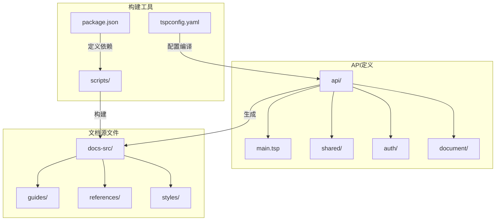
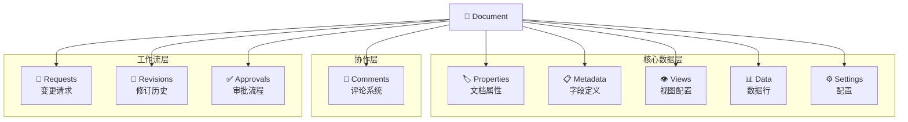
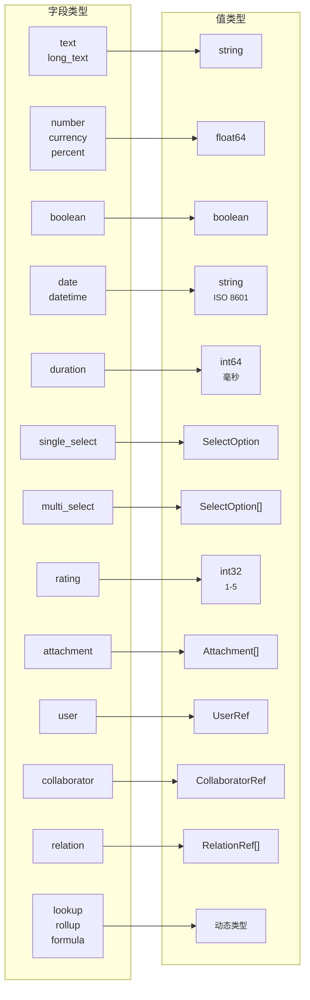
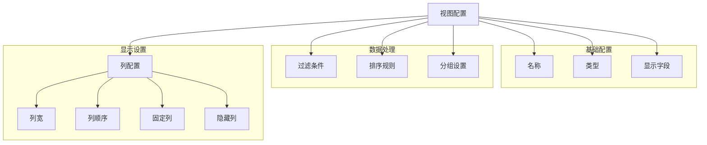
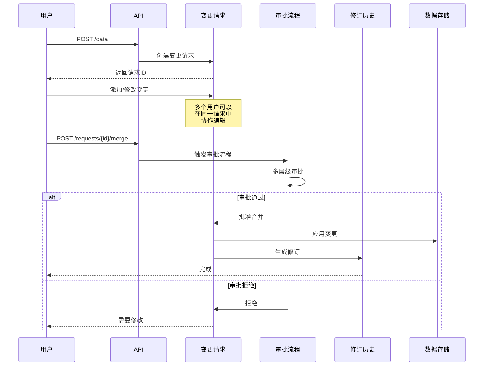
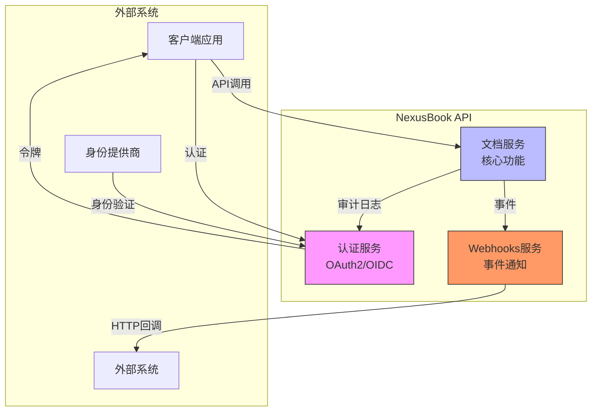

# 项目概述

<cite>
**本文档引用的文件**  
- [README.md](file://README.md)
- [main.tsp](file://api/main.tsp)
- [api/shared/common.tsp](file://api/shared/common.tsp)
- [api/shared/constants.tsp](file://api/shared/constants.tsp)
- [api/document/core/metadata.tsp](file://api/document/core/metadata.tsp)
- [api/document/core/views.tsp](file://api/document/core/views.tsp)
- [api/document/content/comments.tsp](file://api/document/content/comments.tsp)
- [api/document/workflow/approvals.tsp](file://api/document/workflow/approvals.tsp)
- [api/document/workflow/requests.tsp](file://api/document/workflow/requests.tsp)
- [api/document/workflow/revisions.tsp](file://api/document/workflow/revisions.tsp)
- [api/extensions/webhooks/models.tsp](file://api/extensions/webhooks/models.tsp)
- [api/auth/models.tsp](file://api/auth/models.tsp)
- [api/Doc.md](file://api/Doc.md)
- [docs-src/guides/architecture.md](file://docs-src/guides/architecture.md)
</cite>

## 目录
1. [简介](#简介)
2. [项目结构](#项目结构)
3. [核心功能](#核心功能)
4. [统一文档抽象](#统一文档抽象)
5. [字段类型与数据模型](#字段类型与数据模型)
6. [视图系统](#视图系统)
7. [协作功能](#协作功能)
8. [工作流与变更管理](#工作流与变更管理)
9. [事件驱动的Webhooks](#事件驱动的webhooks)
10. [认证与权限控制](#认证与权限控制)
11. [API使用示例](#api使用示例)
12. [系统上下文图](#系统上下文图)
13. [集成与扩展](#集成与扩展)

## 简介

NexusBook API 是一个功能强大的开源文档管理和数据协作平台，旨在为各种业务场景提供统一的文档抽象和灵活的数据管理能力。该平台基于TypeSpec定义并生成符合OpenAPI 3.0规范的API，支持从订货单、发票到项目计划等多种业务类型的管理。

平台的核心优势在于其高度可扩展的架构设计，通过模块化的方式实现了认证授权、文档管理、协作功能和事件驱动扩展等关键特性。开发者可以利用该API构建定制化的业务应用，同时享受标准化的接口文档和开发工具链带来的便利。

本项目采用TypeSpec作为API定义语言，不仅能够生成精确的OpenAPI规范，还支持丰富的元数据注解和类型系统，使得API设计更加清晰和可维护。通过`make`命令可以轻松完成依赖安装、文档生成和本地服务启动等开发任务。

**Section sources**
- [README.md](file://README.md#L1-L187)
- [main.tsp](file://api/main.tsp#L1-L134)

## 项目结构

NexusBook API的项目结构遵循清晰的分层架构原则，主要分为API定义、文档源文件和脚本工具三个部分。API定义目录(api/)采用TypeSpec语言编写，包含了共享模块、认证模块和文档模块等核心组件。

文档模块是整个系统的核心，进一步细分为核心数据模型、内容协作、工作流管理、聚合查询等多个子模块。这种模块化的设计使得各个功能区域职责分明，便于维护和扩展。共享模块(shared/)提供了通用的数据结构和常量定义，确保了跨模块的一致性。

文档源文件(docs-src/)采用Markdown格式编写，包含开发指南、参考文档和样式文件。通过自动化构建流程，这些源文件可以生成完整的文档站点，方便开发者查阅。脚本工具(scripts/)则提供了构建、验证和部署文档的辅助功能。

整个项目通过tspconfig.yaml配置文件定义了TypeSpec编译器的行为，指定使用@typespec/openapi3作为输出目标，并生成YAML格式的OpenAPI文档。package.json中定义了相关的开发依赖和构建脚本，确保开发环境的一致性。



**Diagram sources**
- [README.md](file://README.md#L126-L141)
- [package.json](file://package.json#L1-L16)
- [tspconfig.yaml](file://tspconfig.yaml#L1-L6)

**Section sources**
- [README.md](file://README.md#L126-L141)
- [package.json](file://package.json#L1-L16)
- [tspconfig.yaml](file://tspconfig.yaml#L1-L6)

## 核心功能

NexusBook API提供了一套完整的文档管理和数据协作解决方案，其核心功能涵盖了从基础数据管理到高级协作的各个方面。平台支持统一的文档抽象，能够适应订货单、产品、库存、项目等多种业务类型的需求。

在数据管理方面，系统提供了25种以上的字段类型，包括文本、数字、日期、选择、附件等基本类型，以及公式、查找、汇总等计算型字段。这些丰富的字段类型使得开发者能够灵活地定义各种复杂的数据结构，满足不同业务场景的需求。

视图系统支持表格、看板、日历、图表等8种视图类型，用户可以根据需要选择最适合的数据展示方式。每种视图都可以进行个性化的配置，包括字段显示、过滤条件、排序规则和分组设置，极大地提升了数据的可读性和可用性。

协作功能是平台的一大亮点，支持评论、修订、审批和变更请求等完整的协作流程。用户可以在文档的任何位置添加评论，发起变更请求，并通过审批流程确保数据变更的合规性。所有操作都会被记录在修订历史中，支持版本对比和回滚。

**Section sources**
- [README.md](file://README.md#L19-L29)
- [api/Doc.md](file://api/Doc.md#L1-L832)

## 统一文档抽象

NexusBook API采用统一的文档抽象模型来管理各种类型的业务数据。这个模型将文档视为一个包含多个层次的复合结构，每个层次负责不同的功能，共同构成了完整的文档管理体系。

文档的核心层次包括属性(Properties)、元数据(Metadata)、数据(Data)、视图(Views)、评论(Comments)、修订(Revisions)和设置(Settings)。属性层存储文档本身的元信息，如订货单的订单时间、门店、金额等；元数据层定义文档的字段结构和验证规则；数据层存储实际的数据行内容。

这种分层架构使得文档既具有灵活性又保持一致性。例如，在订货单场景中，属性层可以存储订单的总体信息，元数据层定义产品名称、数量、单价等字段，数据层存储具体的订单项，而视图层则提供不同的数据展示方式。

通过聚合查询机制，系统支持一次性获取文档的多个层次数据，避免了多次API调用带来的性能损耗。客户端可以通过include参数指定需要获取的数据层次，如`include=metadata,views,data`，从而高效地初始化页面或生成报表。



**Diagram sources**
- [api/Doc.md](file://api/Doc.md#L7-L32)
- [docs-src/guides/architecture.md](file://docs-src/guides/architecture.md#L7-L67)

**Section sources**
- [api/Doc.md](file://api/Doc.md#L1-L832)
- [docs-src/guides/architecture.md](file://docs-src/guides/architecture.md#L5-L67)

## 字段类型与数据模型

NexusBook API提供了丰富的字段类型支持，涵盖了25种以上的数据类型，满足各种复杂的业务需求。这些字段类型分为基本类型和计算类型两大类，每种类型都有明确的语义和使用场景。

基本字段类型包括文本(text/long_text)、数字(number/currency/percent)、布尔值(boolean)、日期(date/datetime)、选择(single_select/multi_select)、附件(attachment)、用户(user/collaborator)和关系(relation)等。这些类型构成了数据模型的基础，能够表达绝大多数的业务数据。

计算字段类型是平台的特色功能，包括查找(lookup)、汇总(rollup)和公式(formula)三种。查找字段可以从关联文档中提取特定字段的值；汇总字段可以对关联数据进行统计计算，如求和、平均值等；公式字段支持基于其他字段的表达式计算，提供了强大的数据处理能力。

数据模型采用灵活的键值对结构，支持动态扩展。每个字段都有详细的配置选项，包括是否必填、是否唯一、默认值、验证规则等。对于选择类字段，还可以定义选项列表，包括标签、颜色和禁用状态等属性。



**Diagram sources**
- [api/shared/common.tsp](file://api/shared/common.tsp#L544-L561)
- [api/shared/constants.tsp](file://api/shared/constants.tsp#L145-L259)
- [docs-src/guides/architecture.md](file://docs-src/guides/architecture.md#L316-L362)

**Section sources**
- [api/shared/common.tsp](file://api/shared/common.tsp#L544-L576)
- [api/shared/constants.tsp](file://api/shared/constants.tsp#L145-L259)
- [api/document/core/metadata.tsp](file://api/document/core/metadata.tsp#L29-L52)

## 视图系统

NexusBook API的视图系统提供了8种不同的数据展示方式，满足多样化的业务需求。系统支持表格(grid)、相册(gallery)、看板(kanban)、日历(calendar)、图表(chart)、表单(form)、地图(map)和时间线(timeline)等视图类型，每种类型都有其特定的应用场景。

表格视图适合处理结构化数据，提供类似电子表格的操作体验；相册视图以卡片形式展示数据，特别适合包含图片的内容；看板视图按照状态或分类组织数据，适用于项目管理和工作流跟踪；日历视图将数据按时间轴排列，便于查看时间相关的安排。

视图配置非常灵活，支持字段显示控制、过滤条件、排序规则和分组设置。用户可以自定义哪些字段在视图中显示，设置列宽和显示顺序，应用复杂的过滤逻辑，并按照一个或多个字段进行排序。分组功能可以将数据按特定字段分组显示，配合聚合函数提供统计信息。

API提供了完整的视图管理接口，支持创建、读取、更新和删除视图操作。每个视图都有独立的配置，可以保存为模板供团队共享使用。系统还支持设置默认视图，确保用户每次打开文档时都能看到最相关的信息。



**Diagram sources**
- [api/shared/constants.tsp](file://api/shared/constants.tsp#L91-L139)
- [api/document/core/views.tsp](file://api/document/core/views.tsp#L28-L84)

**Section sources**
- [api/document/core/views.tsp](file://api/document/core/views.tsp#L1-L171)
- [api/shared/constants.tsp](file://api/shared/constants.tsp#L91-L139)

## 协作功能

NexusBook API提供了全面的协作功能，支持团队成员在文档上进行高效的协同工作。系统实现了精确定位的评论系统，允许用户在文档、字段、行或单元格级别添加评论，确保讨论能够聚焦在具体的内容上。

评论系统支持线程化讨论，通过parentId形成回复链，保持对话的逻辑结构。用户可以在评论中@提及相关人员，系统会发送通知提醒被提及者参与讨论。表情反应功能允许用户快速表达对评论的态度，如点赞、惊讶等，提高了沟通效率。

所有评论都有解决状态标记，帮助团队跟踪问题的处理进度。已解决的评论可以被标记为已解决，但仍保留在历史记录中供后续参考。系统还支持评论的置顶功能，将重要的讨论固定在顶部，确保关键信息不会被淹没。

除了评论，系统还提供了实时协作能力，多个用户可以同时编辑同一个文档，变更会实时同步给所有参与者。冲突解决机制确保数据的一致性，避免因并发编辑导致的数据丢失。

**Section sources**
- [api/Doc.md](file://api/Doc.md#L300-L403)
- [api/document/content/comments.tsp](file://api/document/content/comments.tsp)

## 工作流与变更管理

NexusBook API的工作流系统实现了完整的变更管理流程，借鉴了Git的Pull Request模式，确保数据变更的可追溯性和合规性。系统通过请求(Request)、审批(Approval)和修订(Revision)三个核心组件构建了严谨的变更控制机制。

当用户需要修改数据时，系统会创建一个变更请求，而不是直接应用变更。这个请求可以包含多个操作，允许多个团队成员在同一个请求中协作编辑。请求可以被提交给指定的审批人，触发多层级的审批流程。

审批流程支持多种决策类型，包括批准、拒绝和请求修改。每个审批决策都会被记录在案，形成完整的审计轨迹。只有经过批准的请求才会被合并到主文档中，确保关键数据的变更都经过适当的审查。

所有的变更操作都会生成修订记录，包含操作类型、目标位置、新旧值、操作人和时间戳等详细信息。修订历史支持版本对比功能，可以直观地查看两个版本之间的差异。系统还支持回滚到任意历史版本，为数据恢复提供了可靠的保障。



**Diagram sources**
- [docs-src/guides/architecture.md](file://docs-src/guides/architecture.md#L257-L303)
- [api/document/workflow/requests.tsp](file://api/document/workflow/requests.tsp)
- [api/document/workflow/approvals.tsp](file://api/document/workflow/approvals.tsp)
- [api/document/workflow/revisions.tsp](file://api/document/workflow/revisions.tsp)

**Section sources**
- [api/Doc.md](file://api/Doc.md#L405-L498)
- [docs-src/guides/architecture.md](file://docs-src/guides/architecture.md#L257-L312)

## 事件驱动的Webhooks

NexusBook API提供了事件驱动的Webhooks扩展机制，支持20多种事件类型的自动通知。当文档发生重要变更时，系统会向预先注册的URL推送事件通知，实现与其他系统的实时集成。

支持的事件类型涵盖了文档生命周期的各个方面，包括变更请求(create_request, merge_request)、审批(approval_created, approval_approved)、评论(comment_created, comment_resolved)、元数据变更(metadata_updated)和视图变更(view_created)等。这种细粒度的事件划分使得外部系统可以精确地响应特定的业务动作。

Webhooks配置支持安全验证，包括签名验证和重试机制。系统会为每个事件生成签名，接收方可以验证请求的来源可靠性。对于失败的推送，系统会自动进行重试，确保重要通知不会丢失。投递历史和统计功能帮助开发者监控Webhooks的运行状态。

通过Webhooks，企业可以构建丰富的集成场景，如将审批通知发送到企业微信、在数据变更时更新ERP系统、或将评论同步到客户服务系统。这种松耦合的集成方式提高了系统的灵活性和可扩展性。

**Section sources**
- [README.md](file://README.md#L27-L28)
- [api/extensions/webhooks/models.tsp](file://api/extensions/webhooks/models.tsp)
- [api/extensions/webhooks/index.tsp](file://api/extensions/webhooks/index.tsp)

## 认证与权限控制

NexusBook API实现了标准的OAuth2和OIDC兼容认证体系，支持多种认证流程和精细的权限控制。系统支持授权码流程、客户端凭证流程和隐式流程，满足不同应用场景的安全需求。

认证服务提供了完整的JWT令牌管理功能，包括令牌的签发、验证和刷新。标准的OIDC发现端点(.well-known/openid-configuration)使得系统可以轻松集成到现有的身份提供商生态中。用户信息端点支持获取经过验证的用户身份信息。

权限控制基于Scope机制实现，每个API端点都有明确的权限要求。常见的权限范围包括doc:read（文档读取）、doc:write（文档写入）、data:read（数据读取）、data:write（数据写入）等。客户端在获取访问令牌时需要声明所需的权限范围。

系统还支持API密钥管理，为服务间调用提供了一种简单的认证方式。API密钥可以配置权限范围、速率限制和IP白名单，确保接口调用的安全性和可控性。所有认证相关的操作都有详细的日志记录，便于审计和故障排查。

**Section sources**
- [README.md](file://README.md#L28-L29)
- [main.tsp](file://api/main.tsp#L34-L43)
- [api/auth/models.tsp](file://api/auth/models.tsp)
- [api/auth/index.tsp](file://api/auth/index.tsp)

## API使用示例

NexusBook API提供了清晰的使用示例，帮助开发者快速上手。以下是几个典型的API调用场景：

获取访问令牌：
```bash
curl -X POST https://auth.nexusbook.com/token \
  -d 'grant_type=client_credentials' \
  -d 'client_id=YOUR_CLIENT_ID' \
  -d 'client_secret=YOUR_CLIENT_SECRET' \
  -d 'scope=doc:read data:read'
```

获取文档数据：
```bash
curl -H 'Authorization: Bearer YOUR_ACCESS_TOKEN' \
  'https://open.nexusbook.com/api/v1/doc/product/123?include=metadata,views,data'
```

创建数据行：
```bash
curl -X POST 'https://open.nexusbook.com/api/v1/doc/product/123/data?apply=true' \
  -H 'Authorization: Bearer TOKEN' \
  -H 'Content-Type: application/json' \
  -d '{
    "id": "row-1",
    "values": [
      {"fieldId": "name", "value": {"text": "新产品"}},
      {"fieldId": "price", "value": {"number": 99.99}}
    ]
  }'
```

这些示例展示了API的基本使用模式：首先通过认证服务获取访问令牌，然后在后续请求中使用Bearer Token进行身份验证。聚合查询功能允许一次性获取文档的多个组成部分，提高API调用效率。

**Section sources**
- [README.md](file://README.md#L65-L95)
- [main.tsp](file://api/main.tsp#L46-L58)

## 系统上下文图



**Diagram sources**
- [main.tsp](file://api/main.tsp#L96-L134)
- [api/auth/index.tsp](file://api/auth/index.tsp)
- [api/document/index.tsp](file://api/document/index.tsp)
- [api/extensions/webhooks/index.tsp](file://api/extensions/webhooks/index.tsp)

**Section sources**
- [main.tsp](file://api/main.tsp#L96-L134)
- [docs-src/guides/architecture.md](file://docs-src/guides/architecture.md#L122-L219)

## 集成与扩展

NexusBook API的设计充分考虑了可扩展性，通过TypeSpec编译器、HTTP装饰器和OpenAPI 3.0生成器的集成，提供了强大的扩展能力。TypeSpec作为API定义语言，不仅支持丰富的类型系统，还允许通过装饰器添加元数据和行为。

HTTP装饰器用于定义路由、请求方法和参数绑定，使得API定义更加直观和可读。OpenAPI 3.0生成器将TypeSpec定义转换为标准的API规范文档，支持多种格式输出，便于与其他工具集成。这种基于标准的架构确保了API的互操作性和长期可维护性。

系统预留了扩展模块目录(extensions/)，支持通过Webhooks与其他系统集成。开发者可以基于现有的API构建自定义的集成应用，如与CRM、ERP或项目管理工具的连接器。Provider模式的设计允许轻松扩展新的文档类型，而无需修改核心API定义。

通过Redocly等工具，生成的OpenAPI文档可以呈现为交互式的API门户，提供在线测试、代码示例和实时文档功能。这种现代化的开发者体验降低了API的使用门槛，加速了集成开发的进程。

**Section sources**
- [README.md](file://README.md#L17-L18)
- [package.json](file://package.json#L7-L10)
- [tspconfig.yaml](file://tspconfig.yaml)
- [docs-src/guides/architecture.md](file://docs-src/guides/architecture.md#L364-L383)