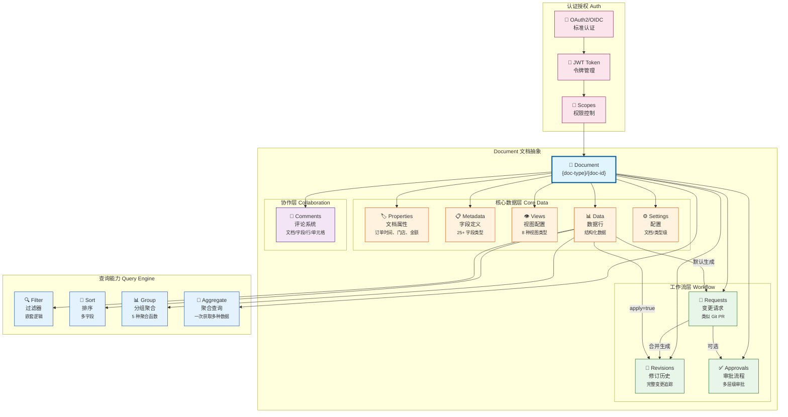
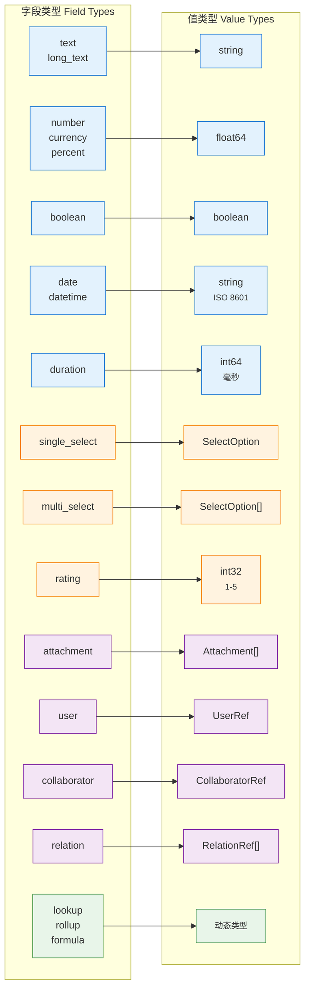
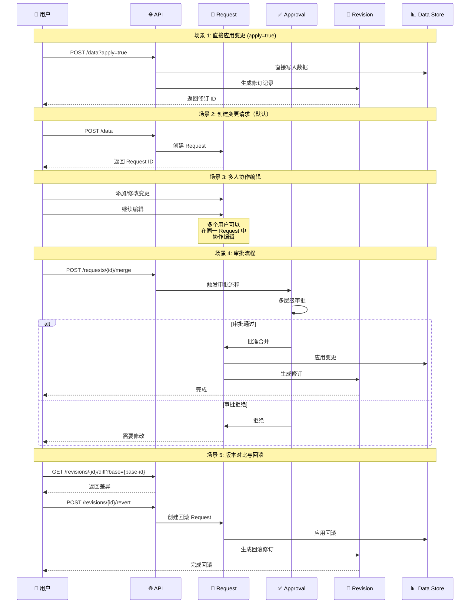
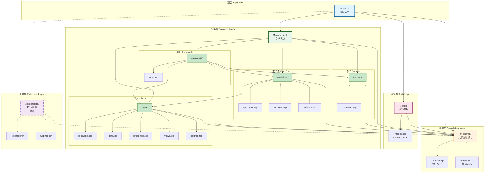

# NexusBook API

<div align="center">

**一个功能强大的开源文档管理和数据协作平台 API**

使用 TypeSpec 定义并生成 OpenAPI 3.0 规范

[](https://typespec.io/)
[](https://www.openapis.org/)
[](LICENSE)

[快速开始](#-快速开始) • [API 文档](#-api-参考) • [架构设计](#-架构设计) • [最佳实践](#-最佳实践)

</div>

---

## 📋 目录

- [概览](#-概览)
- [核心特性](#-核心特性)
- [快速开始](#-快速开始)
- [API 参考](#-api-参考)
- [数据模型](#-数据模型)
- [架构设计](#-架构设计)
- [最佳实践](#-最佳实践)
- [开发指南](#-开发指南)

---

## 🎯 概览

NexusBook API 是一个功能完整的文档管理和数据协作平台，提供：

- **统一的文档抽象** - 支持订货单、产品、库存、项目等多种业务类型
- **强大的数据管理** - 25+ 种字段类型，支持公式、查找、汇总等计算字段
- **灵活的视图系统** - 表格、看板、日历、图表等 8 种视图类型
- **完整的协作功能** - 评论、修订、审批、变更请求等
- **标准的认证授权** - OAuth2 & OIDC 兼容

### 基本信息

| 项目 | 说明 |
|------|------|
| **API 基址** | `https://open.nexusbook.com/api/v1` |
| **认证域名** | `https://auth.nexusbook.com` |
| **API 规范** | OpenAPI 3.0 |
| **定义语言** | TypeSpec 1.6.0 |
| **架构风格** | RESTful + 分层模块化 |

### Document 核心概念架构



**核心概念说明：**

- **Document** - 统一的文档抽象，支持多种业务类型（订货单、产品、库存等）
- **核心数据层** - Properties（文档属性）、Metadata（字段定义）、Views（视图）、Data（数据行）、Settings（配置）
- **协作层** - Comments 支持在文档任何位置进行评论和讨论
- **工作流层** - Requests（变更请求）→ Revisions（修订历史）+ Approvals（审批流程）
- **查询能力** - 强大的过滤、排序、分组和聚合查询
- **认证授权** - OAuth2/OIDC 标准认证，基于 Scope 的权限控制


---

## ✨ 核心特性

### 1. 📊 文档与数据管理

<details>
<summary><b>统一的文档抽象</b></summary>

- 支持多种业务类型（订货单、产品、库存、项目等）
- 灵活的 `doc-type` 路由机制
- 可扩展的 Provider 架构
- 文档级属性管理（订单时间、门店、金额等）

</details>

<details>
<summary><b>强大的字段系统</b></summary>

**25+ 种字段类型：**

- **基础类型**: text, long_text, number, currency, percent, boolean
- **日期时间**: date, datetime, duration
- **选择类型**: single_select, multi_select, rating
- **关联类型**: attachment, user, collaborator, relation
- **计算类型**: lookup, rollup, formula, auto_number
- **系统字段**: created_time, updated_time, created_by, updated_by

**字段配置：**
- 必填、唯一、只读控制
- 默认值设置
- 选项管理
- 公式表达式
- 验证规则

**字段类型与值类型映射：**



</details>

<details>
<summary><b>高级查询能力</b></summary>

- 嵌套过滤和组合逻辑（AND/OR）
- 多字段排序和分组
- 聚合函数（count, sum, avg, min, max）
- 游标分页支持深分页
- 结构化查询 API

</details>

### 2. 👁️ 多视图支持

支持 8 种视图类型，满足不同场景需求：

| 视图类型 | 适用场景 | 特点 |
|---------|---------|------|
| **Table** | 数据浏览和编辑 | 表格形式，支持排序、过滤 |
| **Gallery** | 图片类数据展示 | 相册/网格布局 |
| **Kanban** | 工作流和进度管理 | 看板拖拽 |
| **Calendar** | 时间相关数据 | 日历视图 |
| **Chart** | 数据分析 | 图表可视化 |
| **Form** | 数据录入 | 表单模式 |
| **Map** | 地理位置数据 | 地图展示 |
| **Timeline** | 时间线数据 | 时间轴视图 |

**视图配置：**
- 自定义显示字段
- 过滤和排序条件
- 分组和聚合设置
- 列配置（宽度、顺序、固定、隐藏）

### 3. 💬 协作与工作流

<details>
<summary><b>统一评论系统</b></summary>

支持在任何位置进行评论和讨论：

- **文档级评论** - 针对整个文档
- **字段级评论** - 针对元数据字段
- **行级评论** - 针对数据行
- **单元格评论** - 针对特定单元格

**评论功能：**
- 评论回复和讨论线程
- 富文本和 @提及
- 表情反应
- 置顶和解决标记
- 附件支持

</details>

<details>
<summary><b>版本控制系统</b></summary>

类似 Git 的完整版本控制：

**变更请求（Request）：**
- 类似 Git Pull Request
- 支持多人协作编辑
- 评审和合并机制
- 冲突检测
- 直接应用选项（`?apply=true`）

**修订历史（Revision）：**
- 完整的变更记录
- 行级和字段级追踪
- 版本对比（diff）
- 回滚功能
- 导出历史数据

**工作流：**
```
创建 Request → 多人协作编辑 → 评审 → 合并生成 Revision
```

</details>

<details>
<summary><b>审批工作流</b></summary>

- 多层级、多人审批
- 审批决策（通过/拒绝/请求修改）
- 完整的审批历史
- 基于角色的权限控制

</details>

### 4. 🔐 认证与授权

<details>
<summary><b>OAuth2 & OIDC 支持</b></summary>

**认证流程：**
- OAuth2 授权码流程（Authorization Code Flow）
- OAuth2 客户端凭证流程（Client Credentials Flow）
- OIDC 身份提供商集成

**标准端点：**
- `GET /.well-known/openid-configuration` - OIDC 发现
- `GET /jwks.json` - 公钥集合
- `GET /authorize` - 授权端点
- `POST /token` - 令牌颁发
- `GET /userinfo` - 用户信息

**建议的 Scopes：**
- `doc:read`, `doc:write` - 文档读写
- `data:read`, `data:write` - 数据读写
- `views:manage` - 视图管理
- `comments:write` - 评论权限
- `approvals:manage` - 审批管理
- `requests:manage` - 请求管理

</details>


---

## 🚀 快速开始

### 前置要求

- Node.js 16+
- Go 1.21+ (可选，用于生成 Go 代码)
- Make

### 安装与使用

```bash
# 1. 安装依赖
make deps

# 2. 生成 OpenAPI 文档
make openapi

# 3. 构建 API 文档
make build-docs

# 4. 预览文档（浏览器访问 http://localhost:8091）
make serve-docs

# 5. 生成 Go 服务端代码（可选）
make generate-go

# 6. 启动开发服务器（可选）
make serve-go

# 清理生成的文件
make clean
```

### 输出文件

| 文件 | 说明 |
|------|------|
| `tsp-output/@typespec/openapi3/openapi.NexusBook.Api.yaml` | 业务 API 规范 |
| `tsp-output/@typespec/openapi3/openapi.NexusBook.Auth.yaml` | 认证 API 规范 |
| `dist/redoc/index.html` | Redoc 静态文档 |
| `server/apigen/apigen.gen.go` | Go 服务端代码 |

### 快速示例

#### 1. 获取访问令牌

```bash
curl -X POST https://auth.nexusbook.com/token \
  -d 'grant_type=client_credentials' \
  -d 'client_id=YOUR_CLIENT_ID' \
  -d 'client_secret=YOUR_CLIENT_SECRET' \
  -d 'scope=doc:read data:read'
```

#### 2. 获取文档聚合数据

```bash
curl -H 'Authorization: Bearer YOUR_ACCESS_TOKEN' \
  'https://open.nexusbook.com/api/v1/doc/product/123?include=metadata,views,data'
```

#### 3. 创建数据行

```bash
curl -X POST 'https://open.nexusbook.com/api/v1/doc/product/123/data?apply=true' \
  -H 'Authorization: Bearer TOKEN' \
  -H 'Content-Type: application/json' \
  -d '{
    "id": "row-1",
    "values": [
      {"fieldId": "name", "value": {"text": "新产品"}},
      {"fieldId": "price", "value": {"number": 99.99}}
    ]
  }'
```

#### 4. 结构化查询

```bash
curl -X POST 'https://open.nexusbook.com/api/v1/doc/product/123/data/query' \
  -H 'Authorization: Bearer TOKEN' \
  -H 'Content-Type: application/json' \
  -d '{
    "filters": {
      "logic": "and",
      "conditions": [
        {"field": "status", "operator": "eq", "value": "active"},
        {"field": "price", "operator": "range", "rangeStart": 50, "rangeEnd": 200}
      ]
    },
    "sorts": [{"field": "created_at", "direction": "desc"}],
    "page": 1,
    "pageSize": 20
  }'
```


---

## 📚 API 参考

### 统一响应格式

所有 API 返回统一的 `ApiResponse<T>` 结构：

```typescript
{
  success: boolean,           // 是否成功
  code?: ErrorCode,          // 错误码（失败时）
  message?: {                // 多语言消息
    zh: string,
    en: string
  },
  payload?: T | null         // 实际数据载荷
}
```

**示例：**

```json
{
  "success": false,
  "code": "DOC_NOT_FOUND",
  "message": {
    "zh": "文档不存在",
    "en": "Document not found"
  },
  "payload": null
}
```

### 核心端点

#### 1. 聚合查询

```http
GET /api/v1/doc/{doc-type}/{doc-id}?include=metadata,views,data,comments,revisions,settings
```

一次性获取文档所需的多种数据，支持按需加载。

**查询参数：**
- `include` - 包含的数据部分（逗号分隔）
- `viewId` - 指定视图 ID
- `page`, `pageSize` - 分页参数
- `commentsLimit`, `revisionsLimit` - 限制数量

#### 2. 文档属性

```http
GET    /api/v1/doc/{doc-type}/{doc-id}/properties
POST   /api/v1/doc/{doc-type}/{doc-id}/properties
PUT    /api/v1/doc/{doc-type}/{doc-id}/properties
PATCH  /api/v1/doc/{doc-type}/{doc-id}/properties?merge=true&version=1
DELETE /api/v1/doc/{doc-type}/{doc-id}/properties
GET    /api/v1/doc/{doc-type}/{doc-id}/properties/history
```

管理文档级元信息（订单时间、门店、金额、数量等）。

#### 3. 元数据

```http
GET /api/v1/doc/{doc-type}/{doc-id}/metadata
PUT /api/v1/doc/{doc-type}/{doc-id}/metadata
```

管理字段定义、类型和验证配置。

#### 4. 视图

```http
GET    /api/v1/doc/{doc-type}/{doc-id}/views
POST   /api/v1/doc/{doc-type}/{doc-id}/views
GET    /api/v1/doc/{doc-type}/{doc-id}/views/{view-id}
PUT    /api/v1/doc/{doc-type}/{doc-id}/views/{view-id}
DELETE /api/v1/doc/{doc-type}/{doc-id}/views/{view-id}
POST   /api/v1/doc/{doc-type}/{doc-id}/views/{view-id}/default
```

#### 5. 数据

```http
# 列表查询
GET /api/v1/doc/{doc-type}/{doc-id}/data?page=1&pageSize=20&sort=name:asc

# 结构化查询
POST /api/v1/doc/{doc-type}/{doc-id}/data/query

# 行操作
POST   /api/v1/doc/{doc-type}/{doc-id}/data?apply=true
POST   /api/v1/doc/{doc-type}/{doc-id}/data/bulk?apply=true
GET    /api/v1/doc/{doc-type}/{doc-id}/data/{row-id}
PUT    /api/v1/doc/{doc-type}/{doc-id}/data/{row-id}?apply=true
DELETE /api/v1/doc/{doc-type}/{doc-id}/data/{row-id}?apply=true
```

**查询参数：**
- `apply=true` - 直接应用变更（否则生成合并请求）

#### 6. 评论（统一接口）

```http
# 列表（支持按位置过滤）
GET /api/v1/doc/{doc-type}/{doc-id}/comments?scope=document|field|row|cell&fieldId=&rowId=

# CRUD
POST   /api/v1/doc/{doc-type}/{doc-id}/comments
GET    /api/v1/doc/{doc-type}/{doc-id}/comments/{comment-id}
PUT    /api/v1/doc/{doc-type}/{doc-id}/comments/{comment-id}
DELETE /api/v1/doc/{doc-type}/{doc-id}/comments/{comment-id}

# 操作
POST   /api/v1/doc/{doc-type}/{doc-id}/comments/{comment-id}/pin
POST   /api/v1/doc/{doc-type}/{doc-id}/comments/{comment-id}/unpin
POST   /api/v1/doc/{doc-type}/{doc-id}/comments/{comment-id}/resolve
POST   /api/v1/doc/{doc-type}/{doc-id}/comments/{comment-id}/unresolve
POST   /api/v1/doc/{doc-type}/{doc-id}/comments/{comment-id}/reactions?emoji=👍
DELETE /api/v1/doc/{doc-type}/{doc-id}/comments/{comment-id}/reactions/{emoji}
```

#### 7. 修订历史

```http
GET  /api/v1/doc/{doc-type}/{doc-id}/revisions
GET  /api/v1/doc/{doc-type}/{doc-id}/revisions/{rev-id}
GET  /api/v1/doc/{doc-type}/{doc-id}/revisions/{rev-id}/operations
GET  /api/v1/doc/{doc-type}/{doc-id}/revisions/{rev-id}/diff?base={base-rev-id}
GET  /api/v1/doc/{doc-type}/{doc-id}/revisions/history?targetKind=row&rowId={row-id}
POST /api/v1/doc/{doc-type}/{doc-id}/revisions/{rev-id}/revert
GET  /api/v1/doc/{doc-type}/{doc-id}/revisions/{rev-id}/request
GET  /api/v1/doc/{doc-type}/{doc-id}/revisions/{rev-id}/export?format=json
```

#### 8. 变更请求

```http
GET  /api/v1/doc/{doc-type}/{doc-id}/requests
POST /api/v1/doc/{doc-type}/{doc-id}/requests
GET  /api/v1/doc/{doc-type}/{doc-id}/requests/{req-id}
POST /api/v1/doc/{doc-type}/{doc-id}/requests/{req-id}/merge
POST /api/v1/doc/{doc-type}/{doc-id}/requests/{req-id}/close
POST /api/v1/doc/{doc-type}/{doc-id}/requests/{req-id}/reopen
GET  /api/v1/doc/{doc-type}/{doc-id}/requests/{req-id}/conflicts
```

#### 9. 审批

```http
GET  /api/v1/doc/{doc-type}/{doc-id}/approval
POST /api/v1/doc/{doc-type}/{doc-id}/approval/start
GET  /api/v1/doc/{doc-type}/{doc-id}/approval/{instance-id}
POST /api/v1/doc/{doc-type}/{doc-id}/approval/{instance-id}/decision?result=approved|rejected
```

#### 10. 设置

```http
# 文档级设置
GET /api/v1/doc/{doc-type}/{doc-id}/settings
PUT /api/v1/doc/{doc-type}/{doc-id}/settings

# 类型级设置
GET /api/v1/doc/{doc-type}/setting
PUT /api/v1/doc/{doc-type}/setting
```

#### 11. 认证

```http
GET  /auth/authorize
POST /auth/token
GET  /auth/userinfo
GET  /auth/.well-known/openid-configuration
GET  /auth/jwks.json
```

### 错误码

所有错误通过 `ApiResponse.code` 返回：

<details>
<summary><b>认证相关</b></summary>

- `BAD_USER_NAME` - 用户名错误
- `INVALID_CLIENT` - 无效客户端
- `INVALID_TOKEN` - 无效令牌
- `UNAUTHORIZED` - 未授权
- `FORBIDDEN` - 禁止访问

</details>

<details>
<summary><b>文档相关</b></summary>

- `DOC_NOT_FOUND` - 文档不存在
- `DOC_TYPE_UNKNOWN` - 未知文档类型
- `DOC_ACCESS_DENIED` - 文档访问被拒绝

</details>

<details>
<summary><b>视图相关</b></summary>

- `VIEW_NOT_FOUND` - 视图不存在
- `VIEW_INVALID_DEFINITION` - 视图定义无效

</details>

<details>
<summary><b>数据相关</b></summary>

- `ROW_NOT_FOUND` - 数据行不存在
- `FIELD_TYPE_MISMATCH` - 字段类型不匹配
- `CONSTRAINT_VIOLATION` - 约束违反
- `PAGE_OUT_OF_RANGE` - 页码超出范围

</details>

<details>
<summary><b>评论相关</b></summary>

- `COMMENT_NOT_FOUND` - 评论不存在

</details>

<details>
<summary><b>审批相关</b></summary>

- `APPROVAL_NOT_FOUND` - 审批不存在
- `APPROVAL_INVALID_STATE` - 审批状态无效
- `APPROVAL_DECISION_REQUIRED` - 需要审批决策

</details>

<details>
<summary><b>请求相关</b></summary>

- `REQUEST_NOT_FOUND` - 请求不存在
- `REQUEST_CONFLICT` - 请求冲突
- `REQUEST_ALREADY_CLOSED` - 请求已关闭

</details>


---

## 🗂️ 数据模型

### 资源抽象

```
Doc: {doc-type} + {doc-id}
  ├── properties    # 文档属性（订单时间、门店、金额等）
  ├── metadata      # 字段定义
  ├── views         # 视图配置
  ├── data          # 数据行
  ├── comments      # 评论
  ├── revisions     # 修订历史
  ├── requests      # 变更请求
  ├── approval      # 审批流程
  └── settings      # 设置
```

### 数据流与工作流



**工作流说明：**

1. **直接应用** - 使用 `?apply=true` 参数直接写入数据并生成修订
2. **变更请求** - 默认创建 Request，支持多人协作编辑
3. **审批流程** - 可选的多层级审批机制
4. **修订追踪** - 所有变更都会生成修订记录
5. **版本回滚** - 支持对比和回滚到任意历史版本

### 查询与过滤

#### 过滤操作符

```typescript
FilterOp = 
  | "eq"           // 等于
  | "ne"           // 不等于
  | "in"           // 包含于
  | "range"        // 区间
  | "contains"     // 包含
  | "is_empty"     // 为空
  | "is_not_empty" // 不为空
```

#### 过滤组合

```typescript
FilterGroup {
  logic: "and" | "or",
  conditions: Filter[],
  groups: FilterGroup[]  // 支持嵌套
}
```

#### 排序

```typescript
Sort {
  field: string,
  direction: "asc" | "desc"
}
```

#### 分组与聚合

```typescript
GroupBy {
  fields: string[],
  aggregations: Aggregation[]
}

Aggregation {
  kind: "count" | "sum" | "avg" | "min" | "max",
  field: string
}
```

### 评论位置定位

```typescript
CommentTarget {
  scope: "document" | "field" | "row" | "cell",
  fieldId?: string,  // scope 为 field 或 cell 时
  rowId?: string     // scope 为 row 或 cell 时
}
```

**示例：**

```json
// 文档级评论
{"scope": "document"}

// 字段级评论
{"scope": "field", "fieldId": "field-123"}

// 行级评论
{"scope": "row", "rowId": "row-456"}

// 单元格评论
{"scope": "cell", "rowId": "row-456", "fieldId": "field-123"}
```

### 修订变更操作

```typescript
ChangeOperation {
  id: string,
  type: "row-create" | "row-update" | "row-delete" 
      | "field-create" | "field-update" | "field-delete"
      | "metadata-update" | "settings-update",
  target: {
    kind: "row" | "field" | "metadata" | "settings",
    rowId?: string,
    fieldId?: string
  },
  oldValue?: unknown,  // 更新和删除时
  newValue?: unknown,  // 创建和更新时
  operator?: string,
  timestamp?: string,
  note?: string
}
```


---

## 🏗️ 架构设计

### 目录结构

```
api/
├── main.tsp                    # 顶层入口
│
├── shared/                     # 共享基础模块
│   ├── common.tsp             # 通用类型（ApiResponse, Filter, Value...）
│   ├── constants.tsp          # 枚举定义
│   └── index.tsp              # 模块入口
│
├── auth/                       # 认证模块
│   ├── models.tsp             # OAuth2/OIDC 模型
│   └── index.tsp              # 模块入口
│
└── document/                   # 文档模块
    ├── core/                  # 核心数据模型
    │   ├── metadata.tsp       # 字段定义
    │   ├── data.tsp           # 数据行管理
    │   ├── properties.tsp     # 文档属性
    │   ├── views.tsp          # 视图配置
    │   ├── settings.tsp       # 设置
    │   └── index.tsp
    │
    ├── content/               # 内容协作
    │   ├── comments.tsp       # 评论系统
    │   └── index.tsp
    │
    ├── workflow/              # 工作流管理
    │   ├── approvals.tsp      # 审批流程
    │   ├── requests.tsp       # 变更请求
    │   ├── revisions.tsp      # 修订历史
    │   └── index.tsp
    │
    ├── aggregate/             # 聚合查询
    │   └── index.tsp
    │
    ├── operations/            # 预留目录
    └── index.tsp
```

### 架构层次



**依赖关系说明：**

- **实线箭头** - 直接依赖关系
- **虚线箭头** - 预留/可选依赖
- **颜色分层** - 蓝色（顶层）→ 橙色（基础）→ 粉色（认证）→ 绿色（业务）→ 紫色（扩展）

**依赖原则：**

1. **单向依赖** - 上层依赖下层，下层不依赖上层
2. **基础优先** - 所有模块都依赖 shared 基础层
3. **模块独立** - 同层模块之间尽量独立
4. **聚合组合** - aggregate 模块组合其他模块的功能

### 设计原则

1. **分层架构** - 清晰的 4 层结构（shared → auth → document → extensions）
2. **单一职责** - 每个模块功能明确，职责单一
3. **依赖管理** - 明确的依赖关系，避免循环依赖
4. **可扩展性** - 预留扩展目录，支持动态扩展
5. **模块化** - 高内聚低耦合，便于维护和测试

### 模块职责

| 模块 | 职责 | 主要内容 |
|------|------|---------|
| **shared** | 基础设施 | 通用类型、错误码、过滤器、聚合函数 |
| **auth** | 认证授权 | OAuth2、OIDC、JWT、用户信息 |
| **document/core** | 核心数据 | 元数据、数据行、属性、视图、设置 |
| **document/content** | 内容协作 | 评论系统 |
| **document/workflow** | 工作流 | 审批、请求、修订 |
| **document/aggregate** | 聚合查询 | 一次性获取多种数据 |
| **extensions** | 扩展功能 | 集成、Webhooks（预留） |


---

## 💡 最佳实践

### 1. 认证

**始终使用 Bearer 令牌：**

```bash
curl -H 'Authorization: Bearer YOUR_ACCESS_TOKEN' \
  https://open.nexusbook.com/api/v1/doc/product/123/metadata
```

**令牌管理：**
- 安全存储 access_token 和 refresh_token
- 在令牌过期前刷新
- 使用合适的 scope 限制权限

### 2. 错误处理

**统一错误格式：**
- 所有错误通过 `ApiResponse.code/message` 返回
- HTTP 状态码保持 200
- 业务错误通过 `success: false` 标识

**错误处理示例：**

```typescript
const response = await fetch('/api/v1/doc/product/123/data');
const result = await response.json();

if (!result.success) {
  // 处理错误
  console.error(`Error ${result.code}: ${result.message.zh}`);
  return;
}

// 使用数据
const data = result.payload;
```

### 3. 查询优化

**简单查询使用 GET：**

```bash
GET /api/v1/doc/product/123/data?page=1&pageSize=20&sort=name:asc
```

**复杂查询使用 POST：**

```bash
POST /api/v1/doc/product/123/data/query
{
  "filters": {
    "logic": "and",
    "conditions": [
      {"field": "status", "operator": "eq", "value": "active"},
      {"field": "price", "operator": "range", "rangeStart": 50, "rangeEnd": 200}
    ]
  },
  "sorts": [{"field": "created_at", "direction": "desc"}],
  "page": 1,
  "pageSize": 20
}
```

**性能建议：**
- 使用合适的 pageSize（建议 20-50）
- 深分页使用游标（cursor）
- 只查询需要的字段
- 使用聚合查询减少请求次数

### 4. 并发控制

**使用版本号进行乐观锁：**

```typescript
// 1. 获取当前数据
const row = await getRow('row-123');
console.log(row.version); // 1

// 2. 更新时提供版本号
await updateRow('row-123', {
  ...row,
  version: 1,  // 必须提供当前版本号
  values: [...]
});

// 3. 如果版本号不匹配，更新失败
// 返回 CONSTRAINT_VIOLATION 错误
```

### 5. 变更管理

**默认生成合并请求：**

```bash
# 创建数据行（生成 Request）
POST /api/v1/doc/product/123/data
```

**直接应用变更：**

```bash
# 使用 apply=true 直接应用
POST /api/v1/doc/product/123/data?apply=true
```

**工作流建议：**
- 重要变更使用 Request + 审批流程
- 批量操作使用 Request 避免误操作
- 日常小改动可以直接应用（apply=true）
- 定期查看修订历史进行审计

### 6. 评论最佳实践

**精确定位评论位置：**

```typescript
// 文档级评论 - 整体讨论
{
  "target": {"scope": "document"},
  "content": "这个文档需要更新"
}

// 单元格评论 - 具体问题
{
  "target": {
    "scope": "cell",
    "rowId": "row-123",
    "fieldId": "price"
  },
  "content": "这个价格看起来不对"
}
```

**使用 @提及：**

```typescript
{
  "content": "@张三 请检查这个数据",
  "mentions": [
    {"id": "user-123", "displayName": "张三"}
  ]
}
```

### 7. 文档类型路由

**Provider 模式：**

```
/api/v1/doc/{doc-type}/{doc-id}
              ↓
        Provider 解析
              ↓
    ┌─────────┼─────────┐
    ▼         ▼         ▼
 Product  Purchase   Invoice
 Provider  Provider  Provider
```

**扩展新类型：**
- 实现对应的 Provider
- 注册到路由系统
- 无需修改 API 定义

### 8. 视图使用建议

| 场景 | 推荐视图 | 说明 |
|------|---------|------|
| 数据浏览和编辑 | Table | 表格形式，功能完整 |
| 产品展示 | Gallery | 图片为主的数据 |
| 项目管理 | Kanban | 工作流和进度 |
| 日程安排 | Calendar | 时间相关数据 |
| 数据分析 | Chart | 可视化图表 |
| 数据录入 | Form | 表单模式 |
| 地理数据 | Map | 地图展示 |
| 时间线数据 | Timeline | 时间轴视图 |

### 9. 安全建议

- ✅ 始终使用 HTTPS
- ✅ 妥善保管 client_secret
- ✅ 使用最小权限原则（scope）
- ✅ 定期轮换令牌
- ✅ 验证用户输入
- ✅ 实施速率限制
- ✅ 记录审计日志

### 10. 性能优化

**聚合查询：**

```bash
# 一次获取多种数据，减少请求次数
GET /api/v1/doc/product/123?include=metadata,views,data&pageSize=50
```

**按需加载：**

```bash
# 只获取需要的部分
GET /api/v1/doc/product/123?include=metadata,data
```

**缓存策略：**
- 元数据和视图可以缓存较长时间
- 数据根据更新频率设置缓存
- 使用 ETag 进行条件请求


---

## 🔧 开发指南

### 技术栈

| 技术 | 版本 | 用途 |
|------|------|------|
| **TypeSpec** | 1.6.0 | API 定义语言 |
| **OpenAPI** | 3.0 | API 规范标准 |
| **Redocly** | 2.12.0 | API 文档生成 |
| **oapi-codegen** | latest | Go 代码生成 |
| **Go** | 1.21+ | 后端实现 |

### 项目命令

```bash
# 开发相关
make deps          # 安装依赖
make openapi       # 生成 OpenAPI 规范
make build-docs    # 构建 API 文档
make serve-docs    # 预览文档（端口 8091）

# Go 相关
make generate-go   # 生成 Go 代码
make serve-go      # 启动 Go 服务器

# 清理
make clean         # 清理生成的文件
```

### 添加新模块

1. **在 api/ 下创建模块目录：**

```bash
mkdir -p api/extensions/webhooks
```

2. **创建 TypeSpec 文件：**

```typescript
// api/extensions/webhooks/models.tsp
import "@typespec/http";
import "../../shared/index.tsp";

namespace NexusBook.Extensions.Webhooks {
  model Webhook {
    id: string;
    url: string;
    events: string[];
  }
  
  @route("/webhooks")
  interface WebhooksApi {
    @get list(): ApiResponse<Webhook[]>;
    @post create(@body webhook: Webhook): ApiResponse<Webhook>;
  }
}
```

3. **创建模块入口：**

```typescript
// api/extensions/webhooks/index.tsp
import "./models.tsp";
```

4. **在主入口引入：**

```typescript
// api/main.tsp
import "./extensions/webhooks/index.tsp";
```

5. **重新生成：**

```bash
make openapi
```

### 修改现有模块

1. **编辑对应的 .tsp 文件**
2. **运行 `make openapi` 重新生成**
3. **运行 `make serve-docs` 预览变更**

### 测试 API

**使用 curl：**

```bash
# 设置环境变量
export API_BASE="https://open.nexusbook.com/api/v1"
export TOKEN="your_access_token"

# 测试端点
curl -H "Authorization: Bearer $TOKEN" \
  "$API_BASE/doc/product/123/metadata"
```

**使用 Postman：**

1. 导入生成的 OpenAPI 文件
2. 配置环境变量（base_url, token）
3. 测试各个端点

### 代码生成

**生成 Go 服务端代码：**

```bash
make generate-go
```

生成的代码位于 `server/apigen/apigen.gen.go`，包含：
- 所有数据模型的 Go 结构体
- Gin 路由处理器接口
- 请求/响应绑定

**实现服务端：**

```go
// server/apigen/impl.go
package apigen

import "github.com/gin-gonic/gin"

type ServerImpl struct{}

func (s *ServerImpl) GetMetadata(c *gin.Context, docType string, docId string) {
  // 实现逻辑
  c.JSON(200, ApiResponse{
    Success: true,
    Payload: metadata,
  })
}
```

### 文档注释规范

**使用中英文双语注释：**

```typescript
/**
 * 获取文档元数据
 *
 * Get document metadata
 *
 * 返回字段定义与显示配置，供渲染与校验使用。
 * Returns field definitions and display settings for rendering and validation.
 */
@get
@summary("获取文档元数据")
getMetadata(...): ApiResponse<Metadata>;
```

**添加示例：**

```typescript
/**
 * 创建数据行
 *
 * Create data row
 *
 * 示例（cURL）:
 * ```bash
 * curl -X POST 'https://open.nexusbook.com/api/v1/doc/product/123/data?apply=true' \
 *   -H 'Authorization: Bearer TOKEN' \
 *   -H 'Content-Type: application/json' \
 *   -d '{"id":"row-1","values":[{"fieldId":"name","value":{"text":"新产品"}}]}'
 * ```
 */
```

### 调试技巧

**查看生成的 OpenAPI：**

```bash
# 查看 API 规范
cat tsp-output/@typespec/openapi3/openapi.NexusBook.Api.yaml

# 使用 yq 格式化查看
yq eval tsp-output/@typespec/openapi3/openapi.NexusBook.Api.yaml
```

**验证 TypeSpec 语法：**

```bash
npx tsp compile api/main.tsp --no-emit
```

**查看编译错误：**

TypeSpec 编译器会提供详细的错误信息，包括：
- 文件位置
- 错误类型
- 修复建议

### 常见问题

<details>
<summary><b>Q: 如何添加新的错误码？</b></summary>

在 `api/shared/common.tsp` 中的 `ErrorCode` 枚举添加：

```typescript
enum ErrorCode {
  // ... 现有错误码
  NEW_ERROR_CODE,  // 新错误码
}
```

</details>

<details>
<summary><b>Q: 如何添加新的字段类型？</b></summary>

1. 在 `api/shared/constants.tsp` 的 `FieldType` 枚举添加
2. 在 `api/shared/common.tsp` 的 `Value` union 添加对应类型
3. 重新生成 OpenAPI

</details>

<details>
<summary><b>Q: 如何修改响应格式？</b></summary>

修改 `api/shared/common.tsp` 中的 `ApiResponse` 模型，但建议保持向后兼容。

</details>

<details>
<summary><b>Q: 生成的 Go 代码如何使用？</b></summary>

参考 `server/apigen/impl.go` 和 `cmd/server/main.go` 中的示例实现。

</details>

---

## 📄 许可证

MIT License

---

## 🤝 贡献

欢迎贡献代码、报告问题或提出建议！

**贡献方式：**
1. Fork 本仓库
2. 创建特性分支 (`git checkout -b feature/AmazingFeature`)
3. 提交变更 (`git commit -m 'Add some AmazingFeature'`)
4. 推送到分支 (`git push origin feature/AmazingFeature`)
5. 开启 Pull Request

**开发规范：**
- 遵循现有的代码风格
- 添加适当的注释（中英文）
- 更新相关文档
- 确保 TypeSpec 编译通过

---

## 📞 联系方式

如需更多示例或安全方案在 OpenAPI 中的直接标注，请告知，我将补充到 TypeSpec 并重新生成文档。

For more examples or security scheme annotations in OpenAPI, please let me know and I will add them to TypeSpec and regenerate the documentation.

---

<div align="center">

**[⬆ 回到顶部](#nexusbook-api)**

Made with ❤️ using TypeSpec

</div>
