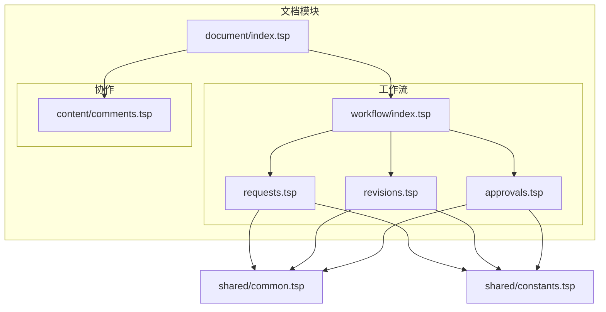
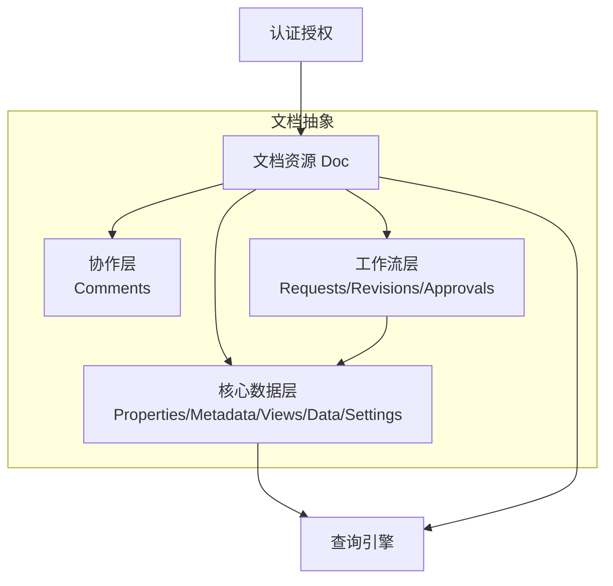
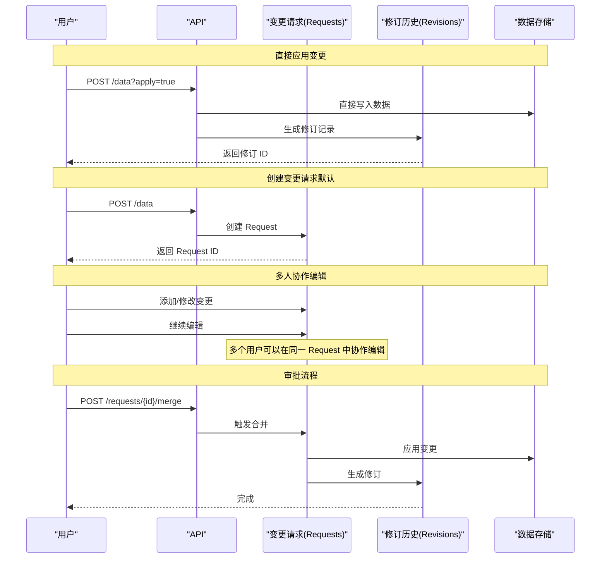
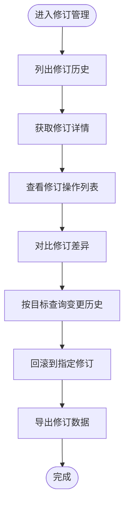
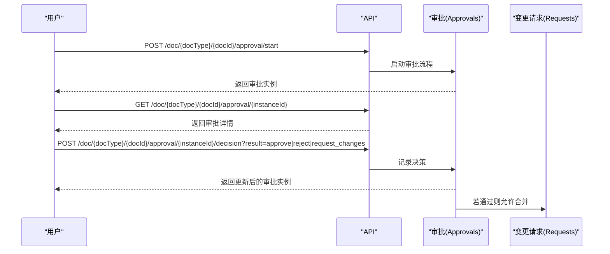
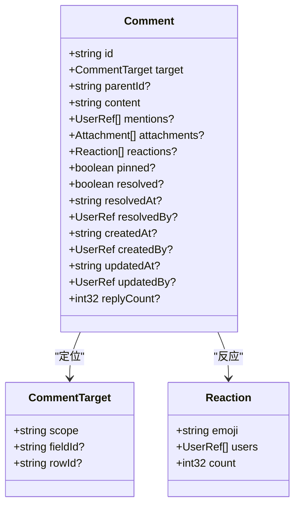
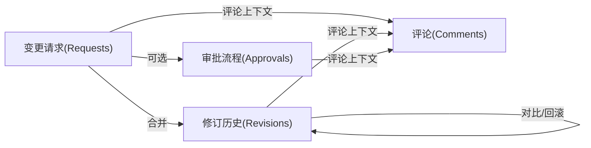
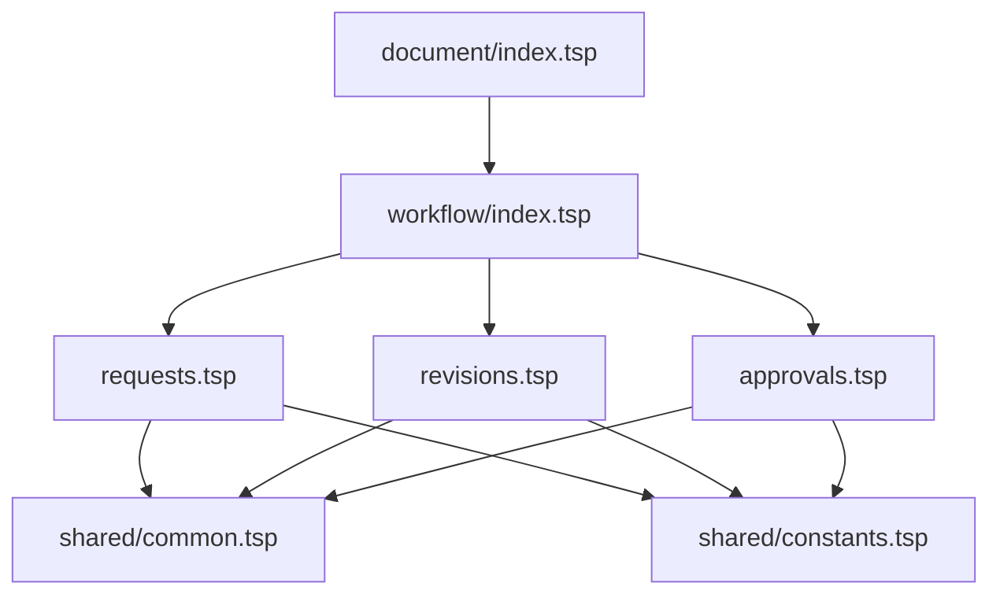

# 协作与工作流

<cite>
**本文引用的文件**
- [api/document/workflow/index.tsp](file://api/document/workflow/index.tsp)
- [api/document/workflow/requests.tsp](file://api/document/workflow/requests.tsp)
- [api/document/workflow/revisions.tsp](file://api/document/workflow/revisions.tsp)
- [api/document/workflow/approvals.tsp](file://api/document/workflow/approvals.tsp)
- [api/document/content/comments.tsp](file://api/document/content/comments.tsp)
- [api/shared/common.tsp](file://api/shared/common.tsp)
- [api/shared/constants.tsp](file://api/shared/constants.tsp)
- [api/document/index.tsp](file://api/document/index.tsp)
- [docs-src/guides/architecture.md](file://docs-src/guides/architecture.md)
</cite>

## 目录
1. [简介](#简介)
2. [项目结构](#项目结构)
3. [核心组件](#核心组件)
4. [架构总览](#架构总览)
5. [详细组件分析](#详细组件分析)
6. [依赖关系分析](#依赖关系分析)
7. [性能考量](#性能考量)
8. [故障排查指南](#故障排查指南)
9. [结论](#结论)

## 简介
本文件聚焦“协作与工作流”能力，系统性阐述工作流层的实现与交互，包括：
- 变更请求（Requests）：类似 Git PR 的协作机制，支持多人编辑、冲突检测与合并。
- 修订历史（Revisions）：完整变更追踪、版本对比、回滚与导出。
- 审批流程（Approvals）：多层级审批、决策与历史记录。
- 评论系统（Comments）：支持文档级、字段级、行级与单元格级评论，配套回复、置顶、解决与表情反应。

结合架构图与序列图，说明从“直接应用变更”到“创建变更请求”，再到“审批流程与合并”的完整数据流与工作流场景。

## 项目结构
工作流层位于文档模块的 workflow 子目录，与协作层（content/comments）并列，共同构成文档的协作与治理能力。整体模块导入关系如下：

图表来源
- [api/document/index.tsp](file://api/document/index.tsp#L1-L31)
- [api/document/workflow/index.tsp](file://api/document/workflow/index.tsp#L1-L17)
- [api/document/workflow/requests.tsp](file://api/document/workflow/requests.tsp#L1-L30)
- [api/document/workflow/revisions.tsp](file://api/document/workflow/revisions.tsp#L1-L30)
- [api/document/workflow/approvals.tsp](file://api/document/workflow/approvals.tsp#L1-L20)
- [api/document/content/comments.tsp](file://api/document/content/comments.tsp#L1-L20)
- [api/shared/common.tsp](file://api/shared/common.tsp#L1-L40)
- [api/shared/constants.tsp](file://api/shared/constants.tsp#L1-L20)

章节来源
- [api/document/index.tsp](file://api/document/index.tsp#L1-L31)
- [api/document/workflow/index.tsp](file://api/document/workflow/index.tsp#L1-L17)

## 核心组件
- 变更请求（Requests）：定义变更集合、状态流转（open/merged/closed）、评审人与贡献者、合并策略（squash、message、deleteBranch），并提供冲突检测与关闭/重新打开等操作。
- 修订历史（Revisions）：记录一次合并产生的完整变更集合，包含变更操作、统计、前后版本链、差异对比、按目标查询历史、回滚与导出等能力。
- 审批流程（Approvals）：定义审批实例状态（pending/approved/rejected/canceled）、历史记录与决策（approve/reject/request_changes），支持启动与决策接口。
- 评论系统（Comments）：统一评论模型，支持文档/字段/行/单元格多层级定位，配套回复树、@提及、附件、置顶、解决标记与表情反应。

章节来源
- [api/document/workflow/requests.tsp](file://api/document/workflow/requests.tsp#L83-L200)
- [api/document/workflow/revisions.tsp](file://api/document/workflow/revisions.tsp#L158-L314)
- [api/document/workflow/approvals.tsp](file://api/document/workflow/approvals.tsp#L40-L94)
- [api/document/content/comments.tsp](file://api/document/content/comments.tsp#L108-L237)

## 架构总览
工作流层在文档抽象之上，与核心数据层、协作层、查询引擎、认证授权共同组成完整的文档平台。Requests 与 Revisions 形成“请求—修订”的闭环；Approvals 可选地介入请求合并前的审批流程；Comments 为协作与审计提供上下文支撑。

图表来源
- [docs-src/guides/architecture.md](file://docs-src/guides/architecture.md#L1-L70)
- [api/document/index.tsp](file://api/document/index.tsp#L1-L31)

## 详细组件分析

### 变更请求（Requests）机制
- 数据模型要点
  - Request：包含标题、描述、状态、作者、评审人、贡献者、变更集、生成的修订ID、时间戳与合并信息等。
  - Change：变更项包含类型（数据/属性/视图/元数据等）、操作（create/update/delete）、目标ID、变更数据、时间与操作人。
- 状态与流转
  - open/merged/closed 三态，支持关闭与重新打开。
- 协作与冲突
  - 支持多人在同一 Request 中编辑变更；提供冲突检测接口。
- 合并与生成修订
  - 合并请求时可选择 squash、附带 message，并可删除关联分支；合并后生成修订，记录贡献者与合并者信息。

图表来源
- [docs-src/guides/architecture.md](file://docs-src/guides/architecture.md#L256-L303)
- [api/document/workflow/requests.tsp](file://api/document/workflow/requests.tsp#L202-L390)
- [api/document/workflow/revisions.tsp](file://api/document/workflow/revisions.tsp#L323-L546)

章节来源
- [api/document/workflow/requests.tsp](file://api/document/workflow/requests.tsp#L83-L200)
- [api/document/workflow/requests.tsp](file://api/document/workflow/requests.tsp#L202-L390)

### 修订历史（Revisions）追踪与对比
- 数据模型要点
  - Revision：包含版本号、源请求ID、标题/描述、主要贡献者、合并者、变更操作集合、统计信息、时间戳与前置修订ID。
  - ChangeOperation：单次增删改操作，包含目标（行/字段/元数据/设置）、旧值/新值、操作人、时间戳与备注。
- 能力范围
  - 列表与详情、按修订操作列表、修订差异对比、按目标（行/字段）查询历史、回滚到指定修订、导出修订数据、关联源请求。
- 版本对比与回滚
  - 对比两个修订之间的差异，支持按目标类型过滤；回滚操作生成新的修订记录（类型为 revert）。

图表来源
- [api/document/workflow/revisions.tsp](file://api/document/workflow/revisions.tsp#L323-L546)

章节来源
- [api/document/workflow/revisions.tsp](file://api/document/workflow/revisions.tsp#L158-L314)
- [api/document/workflow/revisions.tsp](file://api/document/workflow/revisions.tsp#L323-L546)

### 审批流程（Approvals）多层级与决策
- 数据模型要点
  - ApprovalInstance：包含实例ID、状态、当前节点、历史记录（节点ID、操作人、决策、备注、时间戳）。
- 能力范围
  - 获取审批流程定义或实例概览；在文档上发起审批流程；获取审批实例详情；对审批实例进行通过/拒绝/要求修改的决策。
- 多层级审批
  - 通过历史记录与当前节点字段体现多节点流程；决策结果影响请求合并与后续流程。

图表来源
- [api/document/workflow/approvals.tsp](file://api/document/workflow/approvals.tsp#L96-L155)

章节来源
- [api/document/workflow/approvals.tsp](file://api/document/workflow/approvals.tsp#L40-L94)
- [api/document/workflow/approvals.tsp](file://api/document/workflow/approvals.tsp#L96-L155)

### 评论系统（Comments）：文档级/字段级/行级/单元格级
- 数据模型要点
  - CommentTarget：支持 scope(document/field/row/cell)，并可携带 fieldId/rowId 精确定位。
  - Comment：统一评论模型，支持 parentId 形成回复树、@提及、附件、表情反应、置顶、解决标记与统计。
- 能力范围
  - 列出指定位置评论、创建评论（支持回复）、获取详情、更新/删除、置顶/取消置顶、标记/取消已解决、添加/移除表情反应。

图表来源
- [api/document/content/comments.tsp](file://api/document/content/comments.tsp#L50-L75)
- [api/document/content/comments.tsp](file://api/document/content/comments.tsp#L108-L237)

章节来源
- [api/document/content/comments.tsp](file://api/document/content/comments.tsp#L108-L237)

### Requests、Revisions、Approvals 的关系与协作
- Requests 与 Revisions
  - 合并请求（merge）成功后生成修订（Revision），记录源请求ID、贡献者、合并者与变更操作集合。
- Requests 与 Approvals
  - 审批流程可选地在合并前执行，审批通过后才允许合并；审批历史与决策记录在 ApprovalInstance 中。
- Comments 与工作流
  - 评论可用于在文档、字段、行、单元格层面进行讨论，配合 Requests/Revisions/Approvals 提供协作与审计上下文。

图表来源
- [docs-src/guides/architecture.md](file://docs-src/guides/architecture.md#L256-L303)
- [api/document/workflow/requests.tsp](file://api/document/workflow/requests.tsp#L285-L390)
- [api/document/workflow/revisions.tsp](file://api/document/workflow/revisions.tsp#L323-L546)
- [api/document/workflow/approvals.tsp](file://api/document/workflow/approvals.tsp#L96-L155)
- [api/document/content/comments.tsp](file://api/document/content/comments.tsp#L246-L471)

## 依赖关系分析
- 共享类型与常量
  - Requests/Revisions/Approvals 均依赖 shared/common.tsp 的通用响应结构与用户引用等类型。
  - Requests/Revisions/Approvals 依赖 shared/constants.tsp 的枚举类型（RequestStatus、ApprovalStatus、ApprovalDecision）。
- 模块内依赖
  - workflow/index.tsp 统一导入 approvals、requests、revisions。
  - document/index.tsp 统一导入 core/content/workflow/aggregate/relations/attachments/sync/realtime/tenant-document。

图表来源
- [api/document/workflow/index.tsp](file://api/document/workflow/index.tsp#L1-L17)
- [api/document/index.tsp](file://api/document/index.tsp#L1-L31)
- [api/shared/common.tsp](file://api/shared/common.tsp#L153-L177)
- [api/shared/constants.tsp](file://api/shared/constants.tsp#L13-L31)

章节来源
- [api/shared/common.tsp](file://api/shared/common.tsp#L153-L177)
- [api/shared/constants.tsp](file://api/shared/constants.tsp#L13-L31)
- [api/document/workflow/index.tsp](file://api/document/workflow/index.tsp#L1-L17)
- [api/document/index.tsp](file://api/document/index.tsp#L1-L31)

## 性能考量
- 合并策略
  - 合并时可选择 squash，减少修订粒度，降低对比与回滚复杂度。
- 分页与查询
  - 列表与查询接口普遍支持分页参数，建议在大规模修订与评论场景中合理设置 page/pageSize。
- 差异对比
  - 对比两个修订时可按目标类型过滤，缩小计算范围；建议仅在必要时进行全量对比。
- 回滚操作
  - 回滚会生成新的修订，注意在高并发场景下控制回滚频率，避免产生过多修订碎片。

## 故障排查指南
- 常见错误码（来自共享错误定义）
  - 请求相关：REQUEST_NOT_FOUND、REQUEST_CONFLICT、REQUEST_ALREADY_CLOSED。
  - 审批相关：APPROVAL_NOT_FOUND、APPROVAL_INVALID_STATE、APPROVAL_DECISION_REQUIRED。
  - 评论相关：COMMENT_NOT_FOUND。
- 定位思路
  - 若合并失败，先确认请求状态与冲突检测结果；若审批异常，检查审批实例状态与历史记录。
  - 若评论缺失或无法定位，核对 CommentTarget 的 scope 与 fieldId/rowId 是否正确。

章节来源
- [api/shared/common.tsp](file://api/shared/common.tsp#L80-L151)

## 结论
工作流层通过 Requests、Revisions、Approvals 的协同，实现了从“草稿保存与多人协作编辑”到“审批与合并”的完整闭环；配合 Comments 的多层级定位与讨论能力，为文档协作提供了清晰的上下文与审计线索。架构图与序列图展示了从直接应用变更到创建变更请求、触发审批与合并生成修订的典型路径，有助于理解各组件间的依赖与交互。