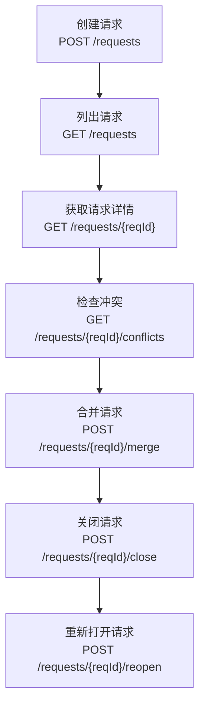
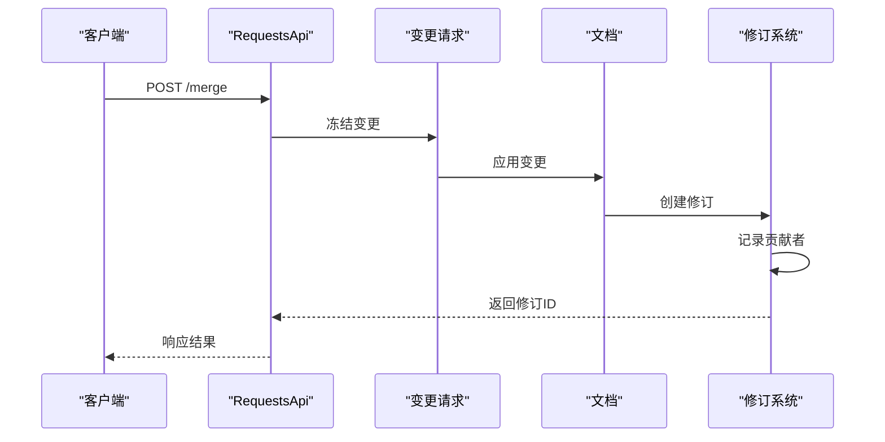
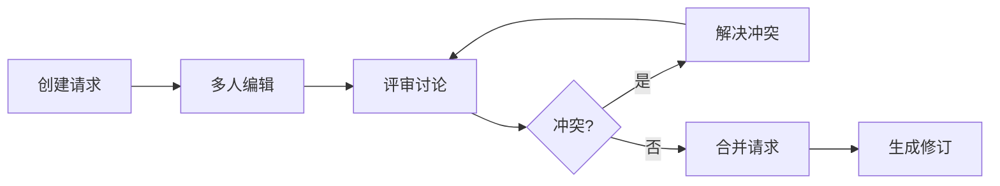

# 变更请求

<cite>
**本文档引用的文件**   
- [requests.tsp](file://api/document/workflow/requests.tsp)
- [common.tsp](file://api/shared/common.tsp)
- [constants.tsp](file://api/shared/constants.tsp)
- [revisions.tsp](file://api/document/workflow/revisions.tsp)
</cite>

## 目录
1. [简介](#简介)
2. [请求模型实现](#请求模型实现)
3. [RequestsApi接口](#requestsapi接口)
4. [合并请求流程](#合并请求流程)
5. [冲突检测机制](#冲突检测机制)
6. [协同编辑工作流](#协同编辑工作流)
7. [最佳实践](#最佳实践)

## 简介

变更请求功能是NexusBook平台的核心协作机制，提供类似Git Pull Request的变更管理能力。该功能支持多用户协同编辑、变更评审和版本控制，确保数据变更的安全性和可追溯性。系统通过三态流转（open/merged/closed）管理变更生命周期，结合修订历史和贡献者追踪，实现完整的变更工作流管理。

**Section sources**
- [requests.tsp](file://api/document/workflow/requests.tsp#L8-L32)

## 请求模型实现

变更请求模型（Request）是变更管理的核心数据结构，包含变更集、状态信息和参与者追踪。模型设计支持复杂的协同编辑场景，确保变更的完整记录和追溯。

### 三态流转

请求模型采用三态流转机制管理变更生命周期：
- **open**：开放状态，变更待审核或直接应用
- **merged**：已合并，变更已生效并生成修订
- **closed**：已关闭，变更被拒绝或取消

状态流转由`RequestStatus`枚举定义，确保状态转换的明确性和一致性。

### 变更集结构

变更集（Change）是请求的核心组成部分，记录具体的变更操作。每个变更项包含：
- **id**：变更唯一标识
- **type**：变更类型（数据、属性、视图等）
- **operation**：操作类型（创建、更新、删除）
- **targetId**：目标ID（行ID、属性ID等）
- **data**：变更数据
- **changedAt**：变更时间
- **changedBy**：变更人

变更集支持多种类型的变更，包括数据行、属性、视图和元数据的增删改操作。

### 贡献者追踪

系统自动追踪所有对请求做出贡献的用户。贡献者（contributors）字段记录在请求生命周期中添加或修改变更的所有用户，确保变更历史的完整性和可追溯性。当请求合并时，所有贡献者信息被继承到生成的修订中。

**Section sources**
- [requests.tsp](file://api/document/workflow/requests.tsp#L39-L200)
- [constants.tsp](file://api/shared/constants.tsp#L12-L31)
- [common.tsp](file://api/shared/common.tsp#L451-L487)

## RequestsApi接口

RequestsApi接口提供变更请求的完整管理功能，支持创建、查询、合并和关闭操作。

### 接口概览

**Diagram sources**
- [requests.tsp](file://api/document/workflow/requests.tsp#L202-L390)

### 核心操作

#### 创建请求

`createRequest`操作创建新的变更请求，提交未生效的变更。请求体包含标题、描述和变更集，系统自动生成请求ID并设置状态为"open"。

#### 列出请求

`listRequests`操作列出文档的所有未生效变更请求，支持分页和过滤。返回的请求列表按创建时间逆序排列，便于查看最新的变更。

#### 获取请求详情

`getRequest`操作获取指定变更请求的完整信息，包括变更集、状态和参与者信息。这是查看请求详细内容的主要方式。

#### 合并请求

`mergeRequest`操作将变更请求的变更应用到文档，生成新的修订。该操作触发完整的变更应用流程，包括变更冻结、应用、修订生成和贡献者记录。

#### 关闭和重新打开

`closeRequest`和`reopenRequest`操作管理请求的关闭状态。关闭的请求不能被合并，但可以重新打开以继续编辑。

**Section sources**
- [requests.tsp](file://api/document/workflow/requests.tsp#L202-L390)

## 合并请求流程

`mergeRequest`操作是变更请求功能的核心，执行完整的变更应用流程。该流程确保变更的安全应用和历史记录。

### 完整流程

**Diagram sources**
- [requests.tsp](file://api/document/workflow/requests.tsp#L244-L347)
- [revisions.tsp](file://api/document/workflow/revisions.tsp#L158-L234)

### 流程步骤

1. **变更冻结**：系统冻结请求中的所有变更，防止在合并过程中被修改
2. **应用变更**：将变更集中的所有操作应用到目标文档
3. **修订生成**：创建新的修订记录整个变更历史，包括所有操作和统计信息
4. **贡献者记录**：记录所有对请求做出贡献的用户，确保变更溯源
5. **返回结果**：返回生成的修订ID、版本号和应用的变更数量

### 请求体选项

合并请求支持以下选项：
- **squash**：是否将多个变更合并为单一变更
- **message**：合并消息，用于修订记录
- **deleteBranch**：合并后是否删除关联分支

### 响应数据结构

合并成功后返回以下信息：
- **revisionId**：生成的修订ID
- **version**：修订版本号
- **changesApplied**：应用的变更数量
- **contributors**：所有贡献者列表
- **mergedAt**：合并时间
- **mergedBy**：合并者

**Section sources**
- [requests.tsp](file://api/document/workflow/requests.tsp#L244-L347)

## 冲突检测机制

冲突检测机制确保数据一致性，防止并发变更导致的数据冲突。

### 冲突检测

`getRequestConflicts`操作检查合并请求与当前文档的冲突。系统比较请求中的变更与文档的当前状态，识别潜在的冲突。冲突可能发生在：
- 同一行的并发修改
- 已删除目标的变更
- 字段定义的不一致

### 冲突处理

当检测到冲突时，系统返回`REQUEST_CONFLICT`错误码，阻止合并操作。用户需要解决冲突后才能继续合并。冲突解决策略包括：
- 手动编辑变更集
- 重新基准到最新文档状态
- 分阶段合并变更

### 防止数据不一致

系统通过以下机制防止数据不一致：
- **变更冻结**：在合并过程中冻结变更，防止中途修改
- **原子操作**：变更应用是原子操作，要么全部成功，要么全部回滚
- **版本控制**：通过修订系统记录所有变更，支持回滚和审计

**Section sources**
- [requests.tsp](file://api/document/workflow/requests.tsp#L377-L389)
- [common.tsp](file://api/shared/common.tsp#L112-L114)

## 协同编辑工作流

变更请求功能支持类似Git PR的协同编辑工作流，允许多用户协作完成复杂变更。

### 工作流模式

**Diagram sources**
- [requests.tsp](file://api/document/workflow/requests.tsp#L249-L261)
- [revisions.tsp](file://api/document/workflow/revisions.tsp#L24-L29)

### 协同特性

- **多人编辑**：多个用户可以同时编辑同一个请求，系统自动合并变更
- **实时协作**：集成实时协同功能，支持光标共享和即时更新
- **评审机制**：支持指定评审人，确保变更质量
- **草稿保存**：未完成的变更可以保存为草稿，稍后继续编辑

### Git PR类比

该功能与Git Pull Request类似：
- **分支**：变更请求相当于功能分支
- **合并**：合并请求相当于合并分支
- **评审**：评审人机制相当于代码评审
- **冲突解决**：冲突检测相当于合并冲突解决

**Section sources**
- [requests.tsp](file://api/document/workflow/requests.tsp#L14-L31)
- [realtime-collaboration.md](file://docs-src/guides/realtime-collaboration.md#L169-L172)

## 最佳实践

### 变更管理

- **小批量变更**：将大变更拆分为多个小请求，便于评审和管理
- **清晰描述**：为每个请求提供清晰的标题和描述，说明变更目的
- **及时合并**：尽快合并已批准的请求，减少冲突风险

### 冲突预防

- **频繁同步**：定期将主干变更合并到请求中，减少冲突
- **沟通协调**：在开始复杂变更前与团队沟通，避免重复工作
- **分阶段实施**：将复杂变更分解为多个阶段，逐步实施

### 团队协作

- **明确评审**：为每个请求指定明确的评审人
- **及时反馈**：对评审请求及时提供反馈
- **贡献认可**：利用贡献者追踪功能，认可团队成员的贡献

**Section sources**
- [requests.tsp](file://api/document/workflow/requests.tsp#L244-L347)
- [realtime-collaboration.md](file://docs-src/guides/realtime-collaboration.md#L169-L172)