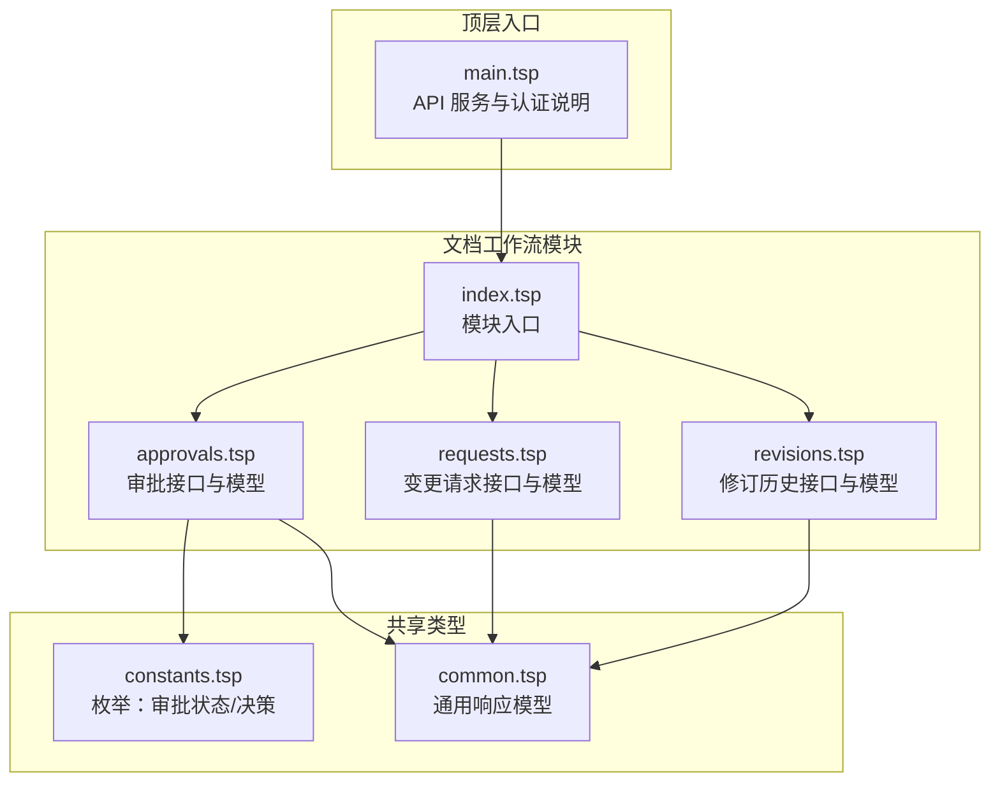
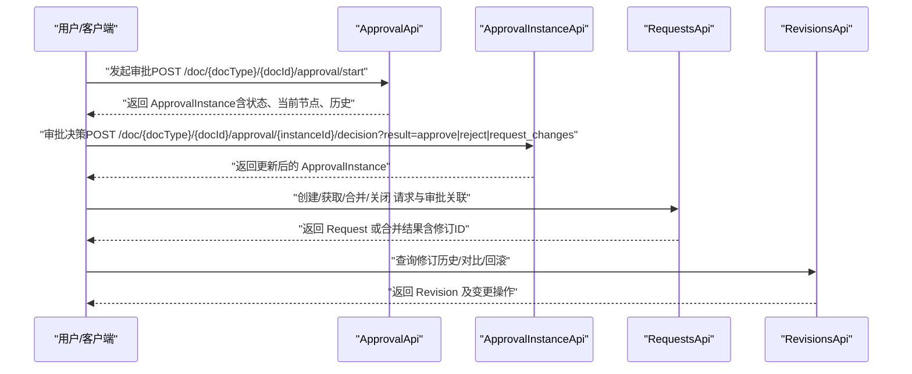
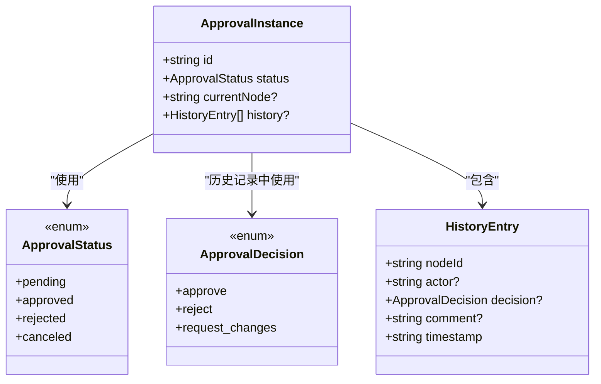
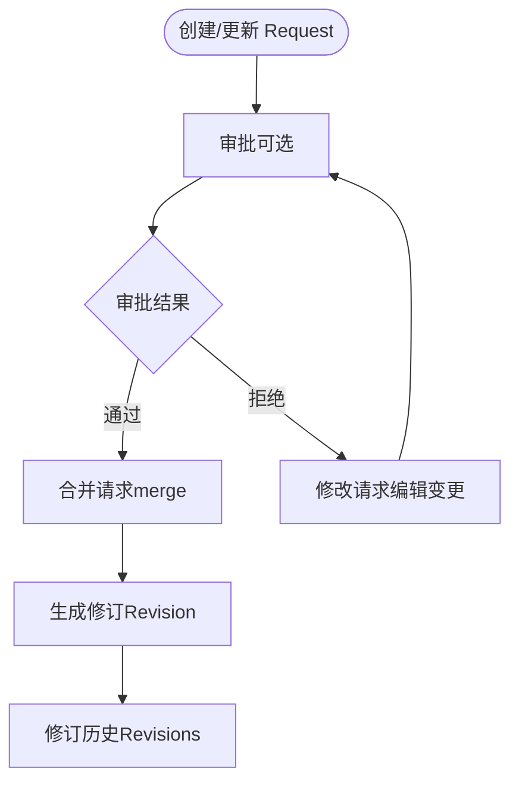
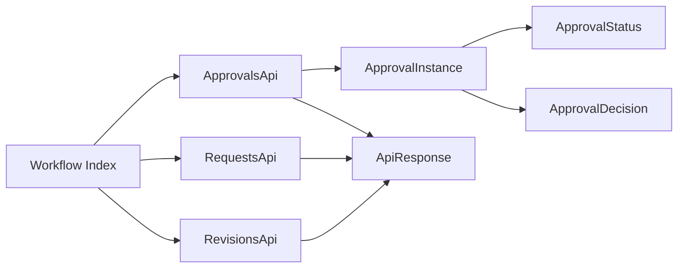

# 审批流程

<cite>
**本文引用的文件**
- [approvals.tsp](file://api/document/workflow/approvals.tsp)
- [requests.tsp](file://api/document/workflow/requests.tsp)
- [index.tsp](file://api/document/workflow/index.tsp)
- [constants.tsp](file://api/shared/constants.tsp)
- [common.tsp](file://api/shared/common.tsp)
- [revisions.tsp](file://api/document/workflow/revisions.tsp)
- [main.tsp](file://api/main.tsp)
- [authentication.md](file://docs-src/guides/authentication.md)
</cite>

## 目录
1. [简介](#简介)
2. [项目结构](#项目结构)
3. [核心组件](#核心组件)
4. [架构总览](#架构总览)
5. [组件详解](#组件详解)
6. [依赖关系分析](#依赖关系分析)
7. [性能考量](#性能考量)
8. [故障排查指南](#故障排查指南)
9. [结论](#结论)
10. [附录](#附录)

## 简介
本文件围绕文档工作流中的“审批流程”能力展开，基于仓库中的 TypeSpec 定义，系统性说明 ApprovalInstance 模型的状态与历史记录结构，阐述 ApprovalApi 与 ApprovalInstanceApi 的端点设计、请求/响应模式及认证要求；并结合变更请求（Request）模块，解释审批流程如何与“变更请求”集成，支持多层级、多人审批的工作流。同时给出基于角色的权限控制机制说明，并提供常见问题（如审批超时与并发冲突）的解决方案思路。

## 项目结构
审批流程位于文档工作流子模块下，与变更请求、修订历史共同构成文档变更与合规体系。整体结构如下：

图表来源
- [index.tsp](file://api/document/workflow/index.tsp#L1-L17)
- [approvals.tsp](file://api/document/workflow/approvals.tsp#L1-L156)
- [requests.tsp](file://api/document/workflow/requests.tsp#L1-L391)
- [revisions.tsp](file://api/document/workflow/revisions.tsp#L1-L547)
- [constants.tsp](file://api/shared/constants.tsp#L1-L120)
- [common.tsp](file://api/shared/common.tsp#L1-L200)
- [main.tsp](file://api/main.tsp#L1-L134)

章节来源
- [index.tsp](file://api/document/workflow/index.tsp#L1-L17)

## 核心组件
- ApprovalInstance：审批实例模型，包含实例标识、状态、当前节点与历史记录数组。
- ApprovalApi：审批流程的入口接口，提供获取流程定义/概览与发起审批的能力。
- ApprovalInstanceApi：针对具体审批实例的接口，提供详情查询与审批决策（通过/拒绝/要求修改）。
- Request：变更请求模型，支持 open/merged/closed 三态流转，承载变更集与评审人等信息。
- Revisions：修订历史模型，记录合并请求产生的完整变更集合与统计信息。
- 枚举与通用类型：ApprovalStatus、ApprovalDecision、ApiResponse 等。

章节来源
- [approvals.tsp](file://api/document/workflow/approvals.tsp#L40-L155)
- [requests.tsp](file://api/document/workflow/requests.tsp#L83-L200)
- [revisions.tsp](file://api/document/workflow/revisions.tsp#L158-L314)
- [constants.tsp](file://api/shared/constants.tsp#L33-L86)
- [common.tsp](file://api/shared/common.tsp#L153-L177)

## 架构总览
审批流程与变更请求的关系如下：变更请求（Request）承载待合并的变更，审批（Approval）负责对请求进行决策；当请求被合并（merge）后，系统生成修订（Revision），形成完整的变更历史链路。

图表来源
- [approvals.tsp](file://api/document/workflow/approvals.tsp#L96-L155)
- [requests.tsp](file://api/document/workflow/requests.tsp#L202-L390)
- [revisions.tsp](file://api/document/workflow/revisions.tsp#L323-L547)

## 组件详解

### ApprovalInstance 模型与状态
- 字段要点
  - id：审批实例标识
  - status：审批状态，取值来自 ApprovalStatus 枚举
  - currentNode：当前审批节点标识（可选）
  - history：审批历史记录数组，每条记录包含节点ID、操作人、决策、备注、时间戳
- 状态语义
  - pending：待审批，流程进行中
  - approved：已批准，审批完成
  - rejected：已拒绝，需要修改重新提交
  - canceled：已取消，审批流程中止

图表来源
- [approvals.tsp](file://api/document/workflow/approvals.tsp#L40-L94)
- [constants.tsp](file://api/shared/constants.tsp#L33-L86)

章节来源
- [approvals.tsp](file://api/document/workflow/approvals.tsp#L40-L94)
- [constants.tsp](file://api/shared/constants.tsp#L33-L86)

### ApprovalApi 接口
- 路由与方法
  - GET /doc/{docType}/{docId}/approval：获取审批流程定义或实例概览
  - POST /doc/{docType}/{docId}/approval/start：在文档上发起审批流程
- 请求/响应
  - 请求：路径参数 docType、docId
  - 响应：ApiResponse 包裹 ApprovalInstance
- 认证要求
  - 所有 API 需携带 Bearer Token（见顶层入口说明）

章节来源
- [approvals.tsp](file://api/document/workflow/approvals.tsp#L96-L123)
- [main.tsp](file://api/main.tsp#L60-L85)

### ApprovalInstanceApi 接口
- 路由与方法
  - GET /doc/{docType}/{docId}/approval/{instanceId}：获取审批实例详情
  - POST /doc/{docType}/{docId}/approval/{instanceId}/decision：对审批实例进行决策
- 请求/响应
  - GET：路径参数 docType、docId、instanceId；响应 ApiResponse<ApprovalInstance>
  - POST：路径参数 docType、docId、instanceId；查询参数 result（ApprovalDecision）；响应 ApiResponse<ApprovalInstance>
- 认证要求
  - 同上，需携带 Bearer Token

章节来源
- [approvals.tsp](file://api/document/workflow/approvals.tsp#L125-L155)
- [main.tsp](file://api/main.tsp#L60-L85)

### 与变更请求（Request）的集成
- Request 模型关键字段
  - id、title、description、status（open/merged/closed）、author、reviewers、contributors、changes、generatedRevisionId、createdAt/updatedAt/mergedAt、mergedBy 等
- 合并流程
  - 当请求被合并时，系统冻结请求中的变更，应用到文档并生成修订；返回修订ID、版本号、应用变更数量、贡献者列表等
- 审批与请求的衔接
  - 审批流程可与请求合并流程配合：在请求创建后触发审批，审批通过后再执行合并；合并后生成修订，形成完整的变更历史链路

图表来源
- [requests.tsp](file://api/document/workflow/requests.tsp#L83-L200)
- [requests.tsp](file://api/document/workflow/requests.tsp#L285-L347)
- [revisions.tsp](file://api/document/workflow/revisions.tsp#L158-L314)

章节来源
- [requests.tsp](file://api/document/workflow/requests.tsp#L83-L200)
- [requests.tsp](file://api/document/workflow/requests.tsp#L285-L347)
- [revisions.tsp](file://api/document/workflow/revisions.tsp#L158-L314)

### 多层级、多人审批的工作流
- 多节点：currentNode 字段可用于标识当前审批节点；history 记录体现审批流转过程
- 多人：审批决策由不同操作人执行，历史记录包含 actor 字段
- 决策类型：ApprovalDecision 包含 approve、reject、request_changes，满足多层级审批的“要求修改”场景

章节来源
- [approvals.tsp](file://api/document/workflow/approvals.tsp#L40-L94)
- [constants.tsp](file://api/shared/constants.tsp#L63-L86)

### 基于角色的权限控制机制
- 认证与授权
  - 所有 API 需携带 Bearer Token
  - 审批管理权限 scope：approvals:manage
- 最小权限原则
  - 仅授予必要的 scope，避免过度授权
- 最佳实践
  - 使用最小权限的 scopes
  - 配置过期时间与 IP 白名单
  - 开启使用日志与速率限制

章节来源
- [main.tsp](file://api/main.tsp#L60-L85)
- [authentication.md](file://docs-src/guides/authentication.md#L323-L377)

## 依赖关系分析
- ApprovalInstance 依赖 ApprovalStatus、ApprovalDecision 枚举
- ApprovalApi/ApprovalInstanceApi 返回 ApiResponse，统一错误与载荷结构
- RequestsApi 与 RevisionsApi 独立存在，但审批可通过请求合并产生修订
- 整体模块通过 workflow/index.tsp 聚合导入

图表来源
- [approvals.tsp](file://api/document/workflow/approvals.tsp#L96-L155)
- [requests.tsp](file://api/document/workflow/requests.tsp#L202-L390)
- [revisions.tsp](file://api/document/workflow/revisions.tsp#L323-L547)
- [index.tsp](file://api/document/workflow/index.tsp#L1-L17)
- [common.tsp](file://api/shared/common.tsp#L153-L177)
- [constants.tsp](file://api/shared/constants.tsp#L33-L86)

章节来源
- [index.tsp](file://api/document/workflow/index.tsp#L1-L17)
- [approvals.tsp](file://api/document/workflow/approvals.tsp#L96-L155)
- [requests.tsp](file://api/document/workflow/requests.tsp#L202-L390)
- [revisions.tsp](file://api/document/workflow/revisions.tsp#L323-L547)
- [common.tsp](file://api/shared/common.tsp#L153-L177)
- [constants.tsp](file://api/shared/constants.tsp#L33-L86)

## 性能考量
- 审批历史记录（history）可能随审批流转增长，建议在前端分页加载与按需查询
- 合并请求（merge）会产生大量变更操作，建议在服务端进行批量应用与事务处理
- 修订历史（Revision）包含变更统计与操作列表，查询时注意索引与分页参数的合理使用

## 故障排查指南
- 审批未找到
  - 错误码：APPROVAL_NOT_FOUND
  - 排查：确认 instanceId 是否正确、文档是否存在
- 审批状态非法
  - 错误码：APPROVAL_INVALID_STATE
  - 排查：确认审批实例当前状态是否允许执行决策
- 缺少审批决策
  - 错误码：APPROVAL_DECISION_REQUIRED
  - 排查：确认请求中是否提供了 result 参数（approve/reject/request_changes）
- 权限不足
  - 错误码：FORBIDDEN
  - 排查：确认 Token 的 scope 是否包含 approvals:manage

章节来源
- [common.tsp](file://api/shared/common.tsp#L80-L152)
- [constants.tsp](file://api/shared/constants.tsp#L107-L110)

## 结论
审批流程通过 ApprovalInstance 模型与 ApprovalApi/ApprovalInstanceApi 实现了从发起到决策的闭环；与变更请求（Request）和修订历史（Revision）的结合，形成了完整的变更合规与审计链路。基于角色的权限控制与最小权限原则，确保了审批操作的安全性与可控性。对于超时与并发冲突，建议在业务层引入超时策略与乐观锁/版本号机制，并在服务端做好幂等与一致性保障。

## 附录

### API 端点一览（摘要）
- 审批流程
  - GET /doc/{docType}/{docId}/approval
  - POST /doc/{docType}/{docId}/approval/start
- 审批实例
  - GET /doc/{docType}/{docId}/approval/{instanceId}
  - POST /doc/{docType}/{docId}/approval/{instanceId}/decision?result={approve|reject|request_changes}
- 变更请求
  - GET /doc/{docType}/{docId}/requests
  - POST /doc/{docType}/{docId}/requests
  - GET /doc/{docType}/{docId}/requests/{reqId}
  - POST /doc/{docType}/{docId}/requests/{reqId}/merge
  - POST /doc/{docType}/{docId}/requests/{reqId}/close
  - POST /doc/{docType}/{docId}/requests/{reqId}/reopen
  - GET /doc/{docType}/{docId}/requests/{reqId}/conflicts
- 修订历史
  - GET /doc/{docType}/{docId}/revisions
  - GET /doc/{docType}/{docId}/revisions/{revId}
  - GET /doc/{docType}/{docId}/revisions/{revId}/operations
  - GET /doc/{docType}/{docId}/revisions/{revId}/diff
  - GET /doc/{docType}/{docId}/revisions/history
  - POST /doc/{docType}/{docId}/revisions/{revId}/revert
  - GET /doc/{docType}/{docId}/revisions/{revId}/request
  - GET /doc/{docType}/{docId}/revisions/{revId}/export

章节来源
- [approvals.tsp](file://api/document/workflow/approvals.tsp#L96-L155)
- [requests.tsp](file://api/document/workflow/requests.tsp#L202-L390)
- [revisions.tsp](file://api/document/workflow/revisions.tsp#L323-L547)