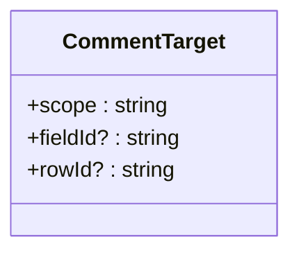
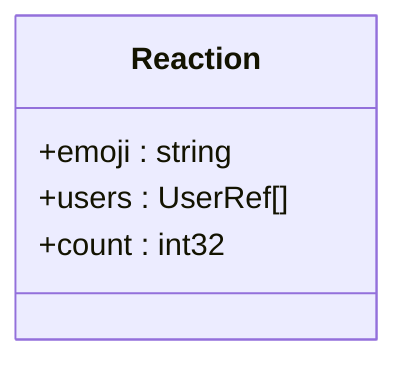
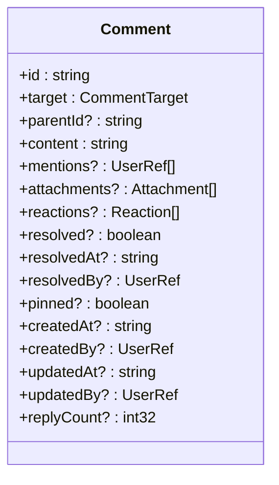
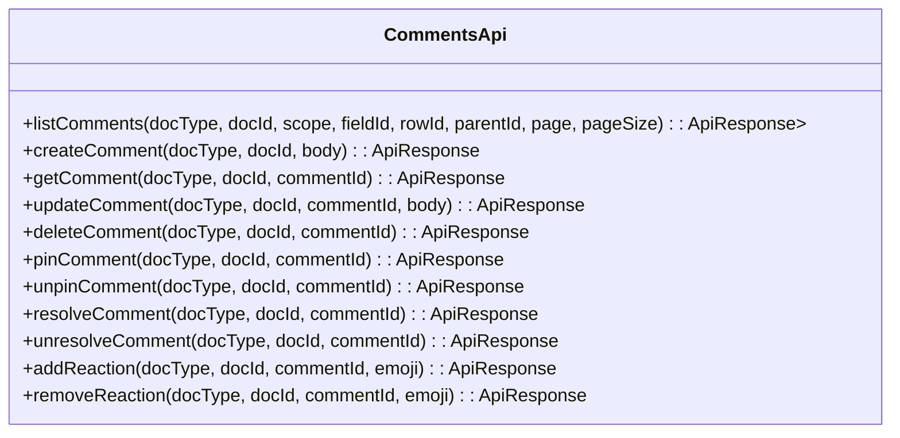
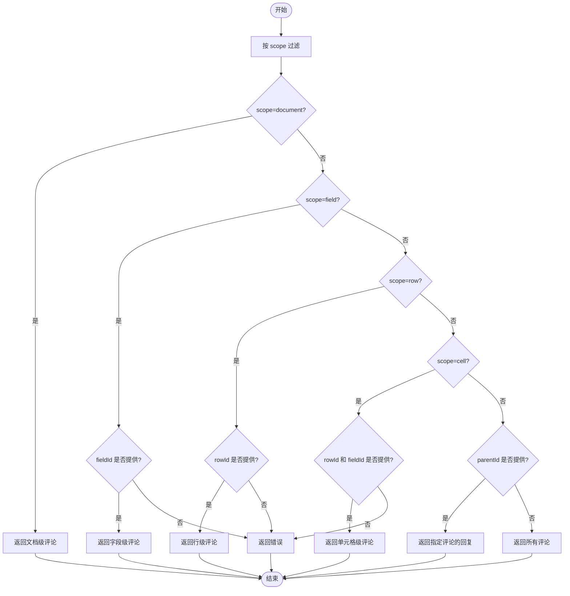
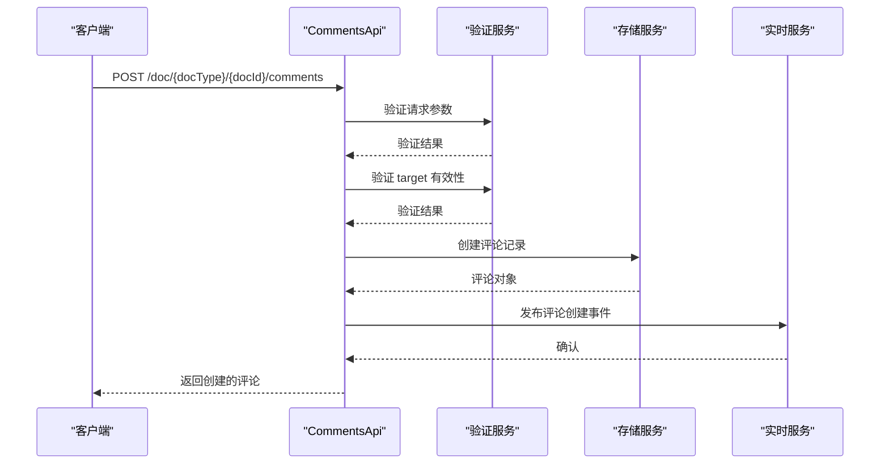
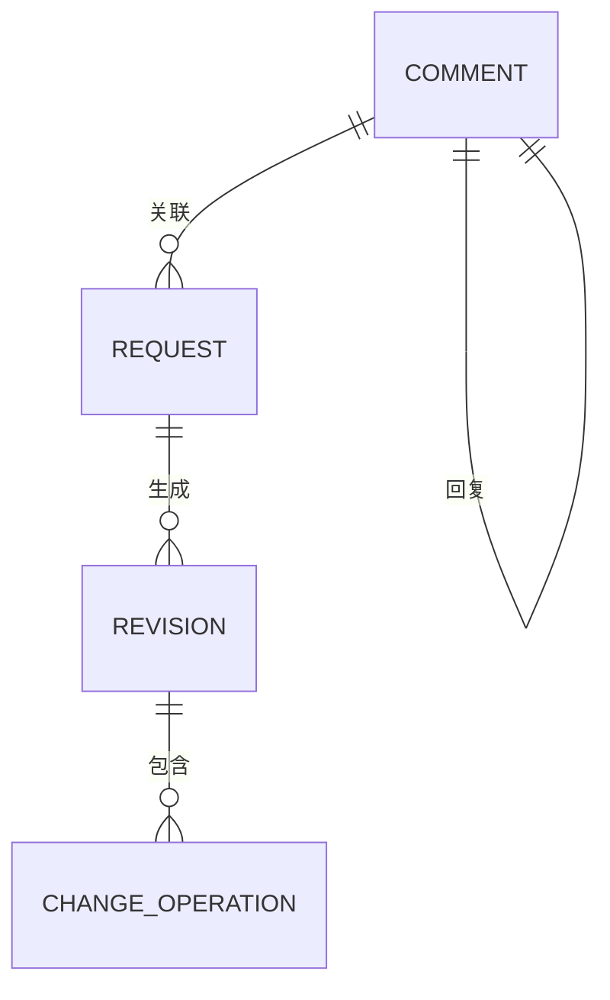
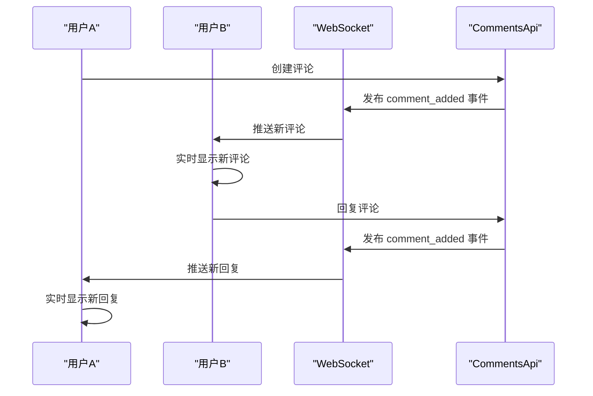
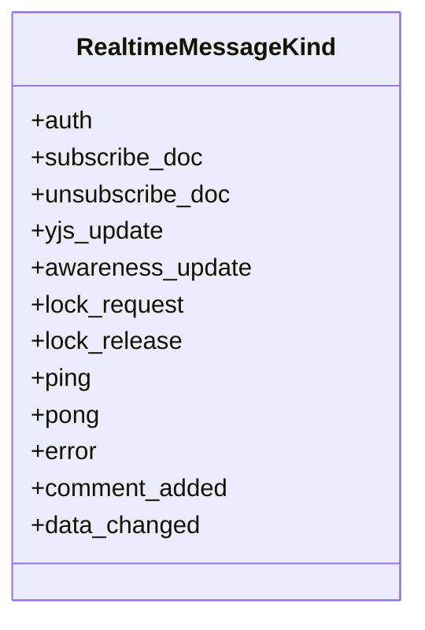
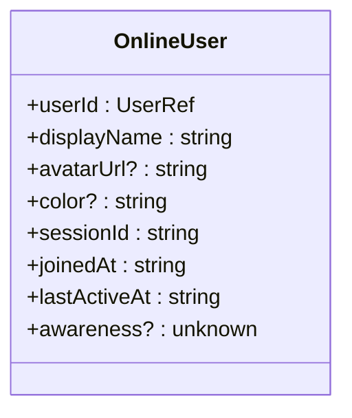

# 评论系统

<cite>
**本文档引用的文件**   
- [comments.tsp](file://api/document/content/comments.tsp)
- [common.tsp](file://api/shared/common.tsp)
- [metadata.tsp](file://api/document/core/metadata.tsp)
- [data.tsp](file://api/document/core/data.tsp)
- [requests.tsp](file://api/document/workflow/requests.tsp)
- [revisions.tsp](file://api/document/workflow/revisions.tsp)
- [messages.tsp](file://api/document/realtime/messages.tsp)
</cite>

## 目录
1. [简介](#简介)
2. [核心模型](#核心模型)
3. [API 接口](#api-接口)
4. [工作流集成](#工作流集成)
5. [实时协作](#实时协作)
6. [最佳实践](#最佳实践)
7. [结论](#结论)

## 简介

评论系统是 NexusBook 协作平台的核心功能之一，提供了一个统一的、灵活的讨论机制，支持在文档的任何位置进行评论和讨论。该系统设计精巧，能够满足从简单文档注释到复杂项目协作的各种需求。

评论系统的主要特点包括：
- **统一评论结构**：单一模型支持所有位置的评论
- **精确位置定位**：使用 target 对象精确记录评论位置（文档/字段/行/单元格）
- **评论关联**：支持评论回复和讨论树
- **富文本支持**：支持格式化文本和 @提及功能
- **附件管理**：评论中附加文件和图片
- **置顶管理**：重要评论置顶展示
- **反应表情**：支持表情反应和讨论增强

该系统与文档的核心数据模型、变更工作流和实时协作功能深度集成，为用户提供了一个完整、高效的协作体验。

**Section sources**
- [comments.tsp](file://api/document/content/comments.tsp#L1-L472)

## 核心模型

### 评论目标定位器 (CommentTarget)

`CommentTarget` 模型是评论系统的核心，它定义了评论在文档中的精确位置。通过一个灵活的结构，系统能够支持多种粒度的评论定位。

**Diagram sources**
- [comments.tsp](file://api/document/content/comments.tsp#L50-L75)

`CommentTarget` 包含以下关键属性：
- **scope**：评论的作用域，定义了评论的层级
  - `"document"`：文档级评论
  - `"field"`：字段级评论（需要 fieldId）
  - `"row"`：行级评论（需要 rowId）
  - `"cell"`：单元格级评论（需要 rowId 和 fieldId）
- **fieldId**：字段ID，当 scope 为 field 或 cell 时使用
- **rowId**：行ID，当 scope 为 row 或 cell 时使用

这种设计允许用户在文档的不同层级进行评论，从宏观的文档整体讨论到微观的单元格数据验证。

### 表情反应 (Reaction)

`Reaction` 模型支持用户对评论进行表情反应，增强讨论的互动性。

**Diagram sources**
- [comments.tsp](file://api/document/content/comments.tsp#L81-L99)

`Reaction` 包含以下属性：
- **emoji**：表情代码，如 "+1"、"heart"、"laugh" 等
- **users**：反应人集合，记录所有对该评论进行反应的用户
- **count**：反应数量，便于快速统计

### 统一评论模型 (Comment)

`Comment` 模型是评论系统的主体，它整合了所有评论相关的属性和功能。

**Diagram sources**
- [comments.tsp](file://api/document/content/comments.tsp#L108-L237)

`Comment` 模型的关键特性包括：
- **target**：评论位置定位，指定评论在文档中的确切位置
- **parentId**：父评论ID，用于构建评论回复树
- **content**：评论内容，支持富文本格式（Markdown 和 HTML）
- **mentions**：@提及用户集合，支持团队协作中的定向通知
- **attachments**：附件集合，允许在评论中附加文件
- **reactions**：表情反应集合，支持多种表情反应
- **resolved**：是否已解决，用于标记问题讨论的状态
- **pinned**：是否置顶，用于突出显示重要评论
- **replyCount**：回复数量，用于快速了解讨论热度

**Section sources**
- [comments.tsp](file://api/document/content/comments.tsp#L108-L237)
- [common.tsp](file://api/shared/common.tsp#L359-L449)

## API 接口

### CommentsApi 接口

`CommentsApi` 接口提供了对评论系统的完整操作支持，包括创建、读取、更新、删除和管理评论。

**Diagram sources**
- [comments.tsp](file://api/document/content/comments.tsp#L246-L471)

#### 列出评论 (listComments)

`listComments` 操作支持通过查询参数过滤不同位置的评论，提供了灵活的评论检索能力。

**Diagram sources**
- [comments.tsp](file://api/document/content/comments.tsp#L271-L282)

#### 创建评论 (createComment)

`createComment` 操作支持创建新评论和回复，是评论系统的主要入口。

**Diagram sources**
- [comments.tsp](file://api/document/content/comments.tsp#L317-L323)

**Section sources**
- [comments.tsp](file://api/document/content/comments.tsp#L271-L323)

## 工作流集成

### 与变更请求的集成

评论系统与变更工作流深度集成，确保评论与数据变更保持一致。

**Diagram sources**
- [comments.tsp](file://api/document/content/comments.tsp#L108-L237)
- [requests.tsp](file://api/document/workflow/requests.tsp#L83-L200)
- [revisions.tsp](file://api/document/workflow/revisions.tsp#L158-L314)

当用户在变更请求中讨论数据变更时，评论会与特定的 `Request` 关联。当请求被合并生成 `Revision` 时，相关的评论也会被归档，确保变更历史的完整性。

### 与实时协作的集成

评论系统与实时协作功能集成，提供即时的讨论体验。

**Diagram sources**
- [messages.tsp](file://api/document/realtime/messages.tsp#L314-L315)
- [comments.tsp](file://api/document/content/comments.tsp#L317-L323)

**Section sources**
- [requests.tsp](file://api/document/workflow/requests.tsp#L83-L200)
- [revisions.tsp](file://api/document/workflow/revisions.tsp#L158-L314)
- [messages.tsp](file://api/document/realtime/messages.tsp#L15-L39)

## 实时协作

### 实时事件流

评论系统的实时功能基于 WebSocket 实现，通过定义清晰的消息格式确保客户端和服务端的一致性。

**Diagram sources**
- [messages.tsp](file://api/document/realtime/messages.tsp#L18-L39)

当有新评论创建时，系统会通过 `comment_added` 事件类型向所有订阅了文档的客户端推送通知，确保团队成员能够实时看到新的讨论。

### 在线状态和光标共享

评论系统与实时协作的在线状态功能集成，用户可以看到其他团队成员的在线状态和光标位置。

**Diagram sources**
- [index.tsp](file://api/document/realtime/index.tsp#L154-L202)

这种集成使得团队协作更加高效，用户可以知道谁正在查看或编辑文档，从而更好地协调讨论和工作。

**Section sources**
- [index.tsp](file://api/document/realtime/index.tsp#L154-L202)
- [messages.tsp](file://api/document/realtime/messages.tsp#L18-L39)

## 最佳实践

### 处理大规模评论数据

对于包含大量评论的文档，建议采用以下最佳实践：

1. **分页查询**：使用 `page` 和 `pageSize` 参数进行分页，避免一次性加载过多数据
2. **精准过滤**：利用 `scope`、`fieldId`、`rowId` 等参数精确过滤所需评论
3. **增量加载**：实现滚动加载或"加载更多"功能，按需加载评论
4. **缓存策略**：对频繁访问的评论数据进行客户端缓存
5. **索引优化**：确保数据库对 `target`、`parentId` 等常用查询字段建立了适当索引

### 高效团队协作

为了最大化评论系统的协作效率，建议：

1. **明确评论位置**：始终使用精确的 `target` 定位评论，避免模糊讨论
2. **合理使用 @提及**：通过 `mentions` 功能定向通知相关成员，提高响应速度
3. **及时解决评论**：使用 `resolved` 标记已解决的讨论，保持评论列表的整洁
4. **置顶重要评论**：使用 `pinned` 功能突出显示关键决策或重要信息
5. **善用表情反应**：通过 `reactions` 快速表达意见，减少简单回复的噪音

**Section sources**
- [comments.tsp](file://api/document/content/comments.tsp#L271-L323)
- [data.tsp](file://api/document/core/data.tsp#L374-L417)

## 结论

NexusBook 的评论系统是一个功能强大、设计精巧的协作工具，它通过统一的模型和灵活的 API，支持在文档的任何位置进行高效的团队讨论。系统与文档的核心数据模型、变更工作流和实时协作功能深度集成，为用户提供了一个完整、连贯的协作体验。

通过精确的位置定位、嵌套的回复结构、富文本内容和表情反应等功能，评论系统能够满足从简单注释到复杂项目协作的各种需求。同时，与变更请求和实时协作的集成确保了讨论与数据变更的同步，提高了团队的工作效率和协作质量。

该系统的设计体现了现代协作工具的核心理念：灵活性、实时性和集成性，为用户提供了强大的讨论和决策支持能力。