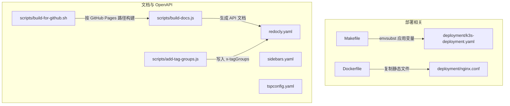
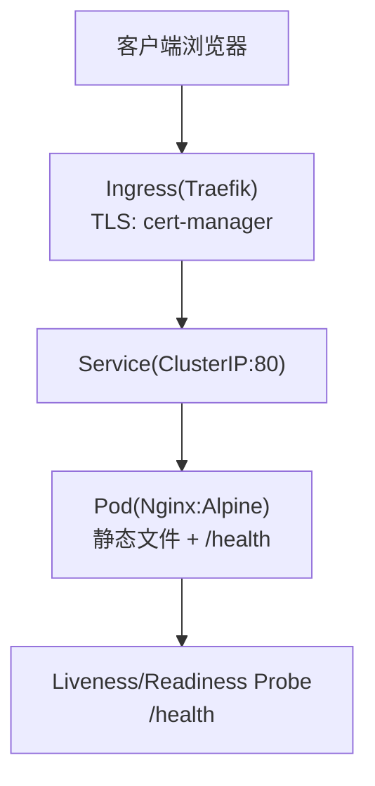
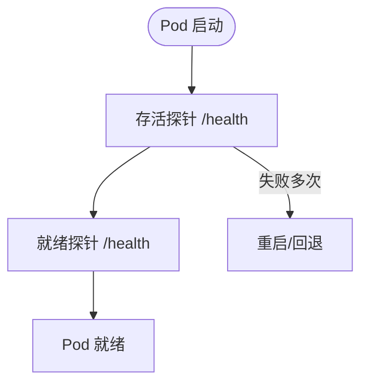
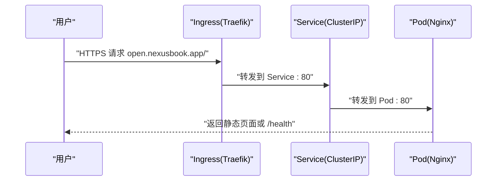
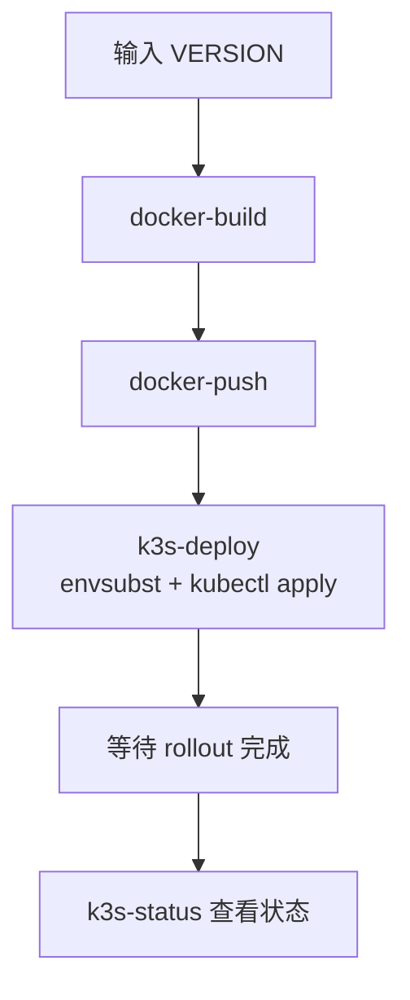
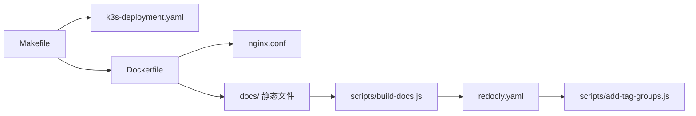

# K3s 部署配置

<cite>
**本文引用的文件**
- [deployment/k3s-deployment.yaml](file://deployment/k3s-deployment.yaml)
- [deployment/README.md](file://deployment/README.md)
- [deployment/nginx.conf](file://deployment/nginx.conf)
- [Dockerfile](file://Dockerfile)
- [Makefile](file://Makefile)
- [scripts/build-for-github.sh](file://scripts/build-for-github.sh)
- [scripts/add-tag-groups.js](file://scripts/add-tag-groups.js)
- [scripts/build-docs.js](file://scripts/build-docs.js)
- [scripts/build-advanced-docs.js](file://scripts/build-advanced-docs.js)
- [redocly.yaml](file://redocly.yaml)
- [sidebars.yaml](file://sidebars.yaml)
- [tspconfig.yaml](file://tspconfig.yaml)
</cite>

## 目录
1. [简介](#简介)
2. [项目结构](#项目结构)
3. [核心组件](#核心组件)
4. [架构总览](#架构总览)
5. [详细组件分析](#详细组件分析)
6. [依赖关系分析](#依赖关系分析)
7. [性能考量](#性能考量)
8. [故障排查指南](#故障排查指南)
9. [结论](#结论)
10. [附录](#附录)

## 简介
本文件聚焦于 K3s 集群上的部署配置与流程，覆盖从镜像构建、资源清单应用到健康检查、扩缩容与回滚的完整链路。同时给出与 GitHub Actions 自动化集成的要点，以及常见问题的定位方法。

## 项目结构
与 K3s 部署直接相关的目录与文件：
- deployment/
  - k3s-deployment.yaml：Kubernetes 资源清单（Deployment、Service、Ingress）
  - nginx.conf：Nginx 配置，提供静态文件服务与健康检查端点
  - README.md：部署指南与操作说明
- Dockerfile：基于 Nginx 镜像构建静态站点镜像
- Makefile：封装镜像构建、推送与 K3s 部署、状态查询、日志查看、清理等常用命令
- scripts/：文档构建与 OpenAPI 处理脚本（与 K3s 部署间接相关）
- 配置文件：redocly.yaml、sidebars.yaml、tspconfig.yaml（文档与 OpenAPI 生成）

图表来源
- [deployment/k3s-deployment.yaml](file://deployment/k3s-deployment.yaml#L1-L101)
- [deployment/nginx.conf](file://deployment/nginx.conf#L1-L71)
- [Dockerfile](file://Dockerfile#L1-L19)
- [Makefile](file://Makefile#L71-L127)
- [scripts/add-tag-groups.js](file://scripts/add-tag-groups.js#L1-L250)
- [scripts/build-docs.js](file://scripts/build-docs.js#L1-L446)
- [scripts/build-for-github.sh](file://scripts/build-for-github.sh#L1-L48)
- [redocly.yaml](file://redocly.yaml#L1-L86)
- [sidebars.yaml](file://sidebars.yaml#L1-L59)
- [tspconfig.yaml](file://tspconfig.yaml#L1-L6)

章节来源
- [deployment/README.md](file://deployment/README.md#L1-L341)

## 核心组件
- 镜像层
  - 基于 Nginx Alpine，复制自定义配置与静态文档内容，暴露 80 端口，并内置健康检查。
- Kubernetes 资源
  - Deployment：滚动更新策略、探针、资源限制与请求；容器端口 80。
  - Service：ClusterIP 暴露 80 端口。
  - Ingress：Traefik 类型，TLS 使用 cert-manager 的 letsencrypt-prod Issuer，域名 open.nexusbook.app。
- Makefile 命令
  - docker-build/docker-push/docker-release：镜像构建与推送。
  - k3s-deploy：创建命名空间、通过 envsubst 注入变量后应用清单、等待 rollout 完成。
  - k3s-status/k3s-logs：查看资源状态与日志。
  - k3s-delete：删除部署资源。
  - release：一键发布（构建 -> 推送 -> 部署 -> 状态检查）。
- Nginx 配置
  - Gzip 压缩、缓存策略、安全头、OpenAPI 文件类型与跨域、静态资源缓存、/health 健康检查端点。

章节来源
- [Dockerfile](file://Dockerfile#L1-L19)
- [deployment/k3s-deployment.yaml](file://deployment/k3s-deployment.yaml#L1-L101)
- [Makefile](file://Makefile#L71-L127)
- [deployment/nginx.conf](file://deployment/nginx.conf#L1-L71)

## 架构总览
K3s 部署采用“Nginx 静态站点”模式，镜像内仅包含静态文件与最小化配置，通过 Ingress 对外提供 HTTPS 访问，证书由 cert-manager 自动签发与续期。

图表来源
- [deployment/k3s-deployment.yaml](file://deployment/k3s-deployment.yaml#L60-L101)
- [deployment/nginx.conf](file://deployment/nginx.conf#L60-L71)

章节来源
- [deployment/README.md](file://deployment/README.md#L1-L341)

## 详细组件分析

### Deployment 与探针
- 滚动更新策略：maxSurge=1，maxUnavailable=0，保证零停机升级。
- 探针：/health，初始延迟、周期、超时与失败阈值均已配置。
- 资源：requests/limits 的 CPU 与内存设置，满足小体量静态站点需求。
- 镜像拉取：默认 Always；若使用私有仓库需配置 imagePullSecrets。

图表来源
- [deployment/k3s-deployment.yaml](file://deployment/k3s-deployment.yaml#L33-L55)

章节来源
- [deployment/k3s-deployment.yaml](file://deployment/k3s-deployment.yaml#L1-L101)

### Service 与 Ingress
- Service：将流量转发至容器端口 80。
- Ingress：
  - ingressClassName: traefik
  - TLS：cert-manager 使用 letsencrypt-prod Issuer，证书 Secret 名称
  - 规则：host=open.nexusbook.app，路径前缀匹配 /，后端指向 Service。

图表来源
- [deployment/k3s-deployment.yaml](file://deployment/k3s-deployment.yaml#L60-L101)

章节来源
- [deployment/k3s-deployment.yaml](file://deployment/k3s-deployment.yaml#L60-L101)

### Makefile 部署流程
- 变量注入：通过 envsubst 将 ${DOCKER_REGISTRY}、${VERSION} 等变量注入到 k3s-deployment.yaml 后再应用。
- 命令：
  - docker-build/docker-push/docker-release：构建与推送镜像。
  - k3s-deploy：创建命名空间、应用清单、等待 rollout。
  - k3s-status：查看 Deployment/Pod/Service/Ingress。
  - k3s-logs：查看 Pod 最近日志。
  - k3s-delete：删除部署资源。
  - release：一键发布。

图表来源
- [Makefile](file://Makefile#L71-L127)
- [deployment/k3s-deployment.yaml](file://deployment/k3s-deployment.yaml#L1-L101)

章节来源
- [Makefile](file://Makefile#L71-L127)

### Nginx 配置要点
- Gzip 压缩与缓存：对文本、JSON、字体、图片等设置缓存与压缩。
- 安全头：X-Frame-Options、X-Content-Type-Options、X-XSS-Protection。
- OpenAPI 文件：对 .yaml/.yml/.json 设置 Content-Type 并允许跨域。
- 静态资源：对 CSS/JS/媒体文件设置长期缓存。
- 健康检查：/health 返回 200 healthy 文本，关闭访问日志。

章节来源
- [deployment/nginx.conf](file://deployment/nginx.conf#L1-L71)

### 文档与 OpenAPI 生成（与 K3s 部署间接相关）
- TypeSpec -> OpenAPI3：tspconfig.yaml 指定 YAML 输出。
- Redocly 构建 API 文档：redocly.yaml 控制主题与侧边栏。
- add-tag-groups.js：为 OpenAPI 写入 x-tagGroups 并更新 tags 描述与映射。
- build-docs.js：生成文档站点（含侧边栏、导航），支持 GitHub Pages 子路径。
- build-for-github.sh：按 GitHub Pages 路径构建并输出 docs/。

章节来源
- [tspconfig.yaml](file://tspconfig.yaml#L1-L6)
- [redocly.yaml](file://redocly.yaml#L1-L86)
- [scripts/add-tag-groups.js](file://scripts/add-tag-groups.js#L1-L250)
- [scripts/build-docs.js](file://scripts/build-docs.js#L1-L446)
- [scripts/build-for-github.sh](file://scripts/build-for-github.sh#L1-L48)

## 依赖关系分析
- Makefile 依赖 k3s-deployment.yaml 进行变量注入与应用。
- Dockerfile 依赖 deployment/nginx.conf 与 docs/ 目录中的静态文件。
- 文档构建链路依赖 scripts/add-tag-groups.js 与 scripts/build-docs.js，最终产出 docs/ 供静态服务使用。
- Ingress 依赖 cert-manager 与 Traefik 控制器。

图表来源
- [Makefile](file://Makefile#L71-L127)
- [deployment/k3s-deployment.yaml](file://deployment/k3s-deployment.yaml#L1-L101)
- [Dockerfile](file://Dockerfile#L1-L19)
- [deployment/nginx.conf](file://deployment/nginx.conf#L1-L71)
- [scripts/build-docs.js](file://scripts/build-docs.js#L1-L446)
- [redocly.yaml](file://redocly.yaml#L1-L86)
- [scripts/add-tag-groups.js](file://scripts/add-tag-groups.js#L1-L250)

章节来源
- [Makefile](file://Makefile#L71-L127)
- [deployment/k3s-deployment.yaml](file://deployment/k3s-deployment.yaml#L1-L101)
- [Dockerfile](file://Dockerfile#L1-L19)
- [deployment/nginx.conf](file://deployment/nginx.conf#L1-L71)
- [scripts/build-docs.js](file://scripts/build-docs.js#L1-L446)
- [redocly.yaml](file://redocly.yaml#L1-L86)
- [scripts/add-tag-groups.js](file://scripts/add-tag-groups.js#L1-L250)

## 性能考量
- 镜像体积：基于 Nginx Alpine，仅包含静态文件与最小配置，镜像小、启动快。
- 资源限制：CPU/内存设置较低，适合静态站点；可根据流量峰值调整。
- 缓存策略：对静态资源设置长缓存，减少带宽与服务器压力。
- 探针：健康检查端点简单高效，避免不必要的复杂逻辑。

[本节为通用建议，无需列出具体文件来源]

## 故障排查指南
- 镜像拉取失败
  - 检查 imagePullSecrets 是否正确配置；若使用私有仓库，创建 docker-registry secret。
- Pod 无法启动/频繁重启
  - 查看 Pod 事件与容器日志；确认 /health 可用且 Nginx 配置无语法错误。
- Ingress 无法访问
  - 检查 Ingress 状态与控制器日志；确认域名解析到集群外部 IP。
- DNS 解析问题
  - 获取 Ingress 外部 IP 并验证 open.nexusbook.app 的 DNS 解析。
- 证书问题
  - 查看 Certificate 资源状态；必要时删除 Secret 由 cert-manager 重新申请。

章节来源
- [deployment/README.md](file://deployment/README.md#L273-L341)

## 结论
本部署方案以 Nginx 静态服务为核心，结合 Ingress 与 cert-manager 实现高可用、自动化的 HTTPS 访问。Makefile 将镜像构建、推送与部署串联，简化运维流程。通过合理的探针、缓存与资源限制，可在 K3s 上稳定运行该静态文档站点。

[本节为总结，无需列出具体文件来源]

## 附录
- 常用命令
  - 构建镜像：make docker-build VERSION=...
  - 推送镜像：make docker-push VERSION=...
  - 发布到 K3s：make k3s-deploy VERSION=...
  - 查看状态：make k3s-status
  - 查看日志：make k3s-logs
  - 删除部署：make k3s-delete
  - 一键发布：make release VERSION=...

章节来源
- [Makefile](file://Makefile#L71-L127)
- [deployment/README.md](file://deployment/README.md#L1-L341)