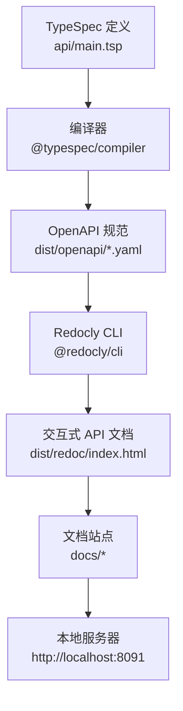
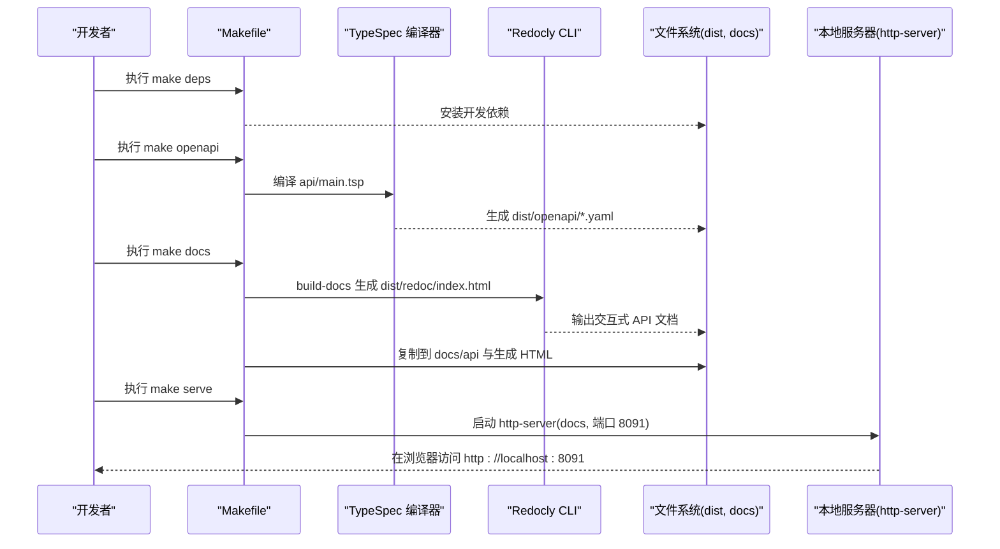
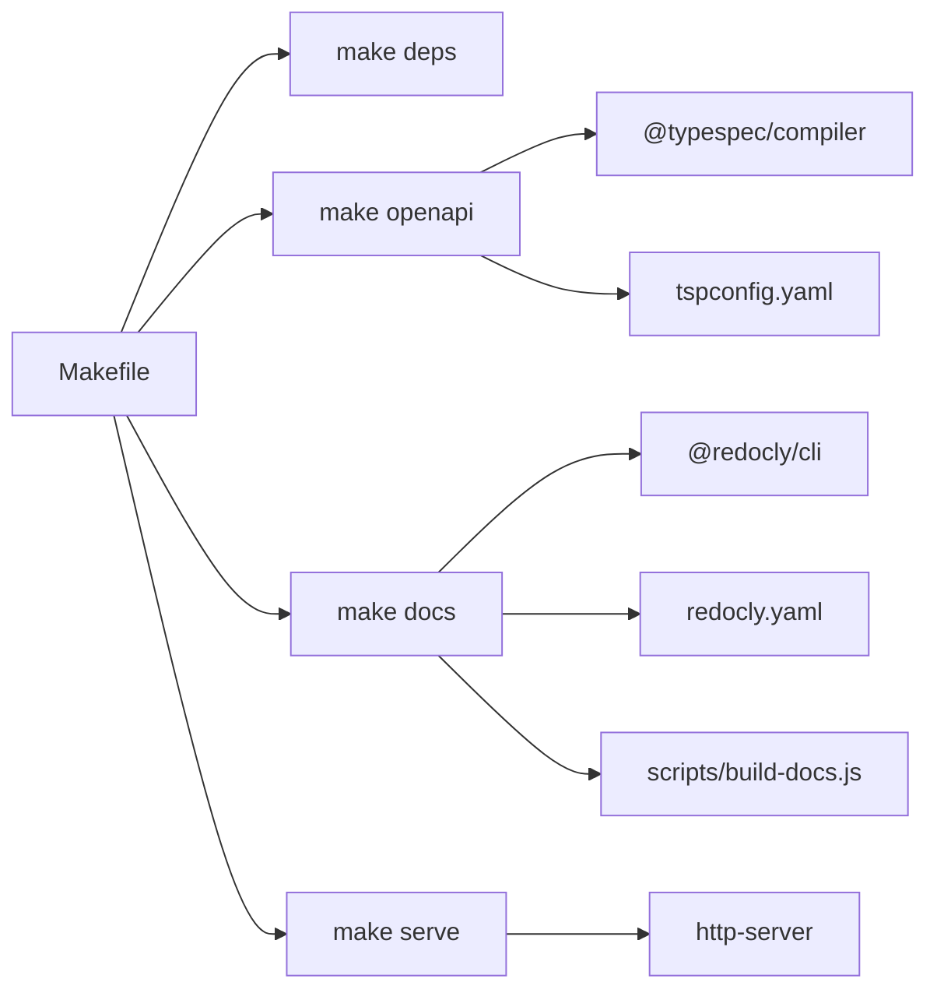

# 快速开始

<cite>
**本文引用的文件**
- [README.md](file://README.md)
- [docs-src/guides/getting-started.md](file://docs-src/guides/getting-started.md)
- [docs-src/index.md](file://docs-src/index.md)
- [Makefile](file://Makefile)
- [package.json](file://package.json)
- [scripts/build-docs.js](file://scripts/build-docs.js)
- [scripts/build-for-github.sh](file://scripts/build-for-github.sh)
- [redocly.yaml](file://redocly.yaml)
- [tspconfig.yaml](file://tspconfig.yaml)
- [docs-src/TROUBLESHOOTING.md](file://docs-src/TROUBLESHOOTING.md)
</cite>

## 目录
1. [简介](#简介)
2. [项目结构](#项目结构)
3. [核心组件](#核心组件)
4. [架构总览](#架构总览)
5. [详细组件分析](#详细组件分析)
6. [依赖关系分析](#依赖关系分析)
7. [性能考虑](#性能考虑)
8. [故障排查指南](#故障排查指南)
9. [结论](#结论)

## 简介
本指南面向初学者，带你从零开始安装并使用 nexusbook-api 的本地开发与文档构建流程。你将学会：
- 准备 Node.js 16+ 与 Make 工具
- 使用 make deps 安装依赖
- 使用 make openapi 生成 OpenAPI 规范
- 使用 make docs 构建文档站点
- 使用 make serve 启动本地服务器并查看交互式文档
- 使用 curl 获取访问令牌、获取文档数据、创建数据行
- 使用客户端凭证流程获取 Bearer Token，并在请求中包含 Authorization 头
- 访问 http://localhost:8091 查看交互式文档

## 项目结构
项目采用“TypeSpec 定义 + OpenAPI 生成 + Redoc 文档 + Markdown 文档站点”的组合方式：
- api/：TypeSpec API 定义（入口为 main.tsp）
- docs-src/：Markdown 文档源文件（指南、参考、样式等）
- scripts/：构建与部署脚本（生成文档站点、GitHub Pages 构建）
- Makefile：统一的构建与服务命令
- package.json：文档构建脚本与开发依赖
- redocly.yaml：Redocly 文档生成配置
- tspconfig.yaml：TypeSpec 编译配置（输出 OpenAPI YAML）

**图表来源**
- [Makefile](file://Makefile#L1-L63)
- [redocly.yaml](file://redocly.yaml#L1-L86)
- [tspconfig.yaml](file://tspconfig.yaml#L1-L6)

**章节来源**
- [README.md](file://README.md#L126-L169)
- [Makefile](file://Makefile#L1-L63)

## 核心组件
- 依赖安装：make deps
  - 安装 TypeSpec 编译器、Redocly CLI、TypeSpec HTTP/OpeanAPI 插件等
- OpenAPI 生成：make openapi
  - 从 api/main.tsp 编译生成 OpenAPI YAML
- 文档站点构建：make docs
  - 复制 API 文档与样式，生成 HTML 页面
- 本地服务：make serve
  - 启动静态服务器，默认端口 8091，访问 http://localhost:8091

提示：README.md 与 docs-src/guides/getting-started.md 提供了相同的命令与流程说明，二者可互相印证。

**章节来源**
- [README.md](file://README.md#L30-L62)
- [docs-src/guides/getting-started.md](file://docs-src/guides/getting-started.md#L22-L58)
- [Makefile](file://Makefile#L1-L63)

## 架构总览
下面的序列图展示了从 TypeSpec 到交互式文档的完整流程，以及本地服务启动与访问过程。

**图表来源**
- [Makefile](file://Makefile#L1-L63)
- [redocly.yaml](file://redocly.yaml#L1-L86)
- [scripts/build-docs.js](file://scripts/build-docs.js#L350-L432)

## 详细组件分析

### 1) 安装与前置条件
- Node.js 16+ 与 Make 工具
- 检查命令参考：
  - README.md 的“前置要求”与“检查环境”
  - docs-src/guides/getting-started.md 的“前置要求”与“检查环境”

**章节来源**
- [README.md](file://README.md#L30-L41)
- [docs-src/guides/getting-started.md](file://docs-src/guides/getting-started.md#L5-L21)

### 2) 依赖安装：make deps
- 功能：安装 TypeSpec 编译器、Redocly CLI、TypeSpec HTTP/OpeanAPI 插件等
- 依据：Makefile 中的 deps 目标

**章节来源**
- [Makefile](file://Makefile#L7-L14)
- [package.json](file://package.json#L1-L16)

### 3) 生成 OpenAPI：make openapi
- 功能：从 api/main.tsp 编译生成 OpenAPI YAML
- 输出：dist/openapi/@typespec/openapi3/*.yaml
- 依据：Makefile 的 openapi 目标与 tspconfig.yaml 的输出配置

**章节来源**
- [Makefile](file://Makefile#L10-L14)
- [tspconfig.yaml](file://tspconfig.yaml#L1-L6)

### 4) 构建文档站点：make docs
- 功能：生成交互式 API 文档并复制到 docs/api，同时生成 HTML 页面
- 依据：Makefile 的 docs 目标与 scripts/build-docs.js 的构建逻辑

**章节来源**
- [Makefile](file://Makefile#L44-L53)
- [scripts/build-docs.js](file://scripts/build-docs.js#L350-L432)

### 5) 启动本地服务器：make serve
- 功能：启动静态服务器，默认端口 8091，访问 http://localhost:8091
- 依据：Makefile 的 serve 目标

**章节来源**
- [Makefile](file://Makefile#L55-L59)

### 6) 使用 curl 获取访问令牌、获取文档数据、创建数据行
- 获取访问令牌（客户端凭证流程）
  - 参考：README.md 的“快速示例”与 docs-src/guides/getting-started.md 的“获取访问令牌”
  - 关键点：使用 Authorization: Bearer YOUR_ACCESS_TOKEN
- 获取文档数据
  - 参考：README.md 的“快速示例”与 docs-src/guides/getting-started.md 的“第一个 API 调用”
- 创建数据行
  - 参考：README.md 的“快速示例”与 docs-src/guides/getting-started.md 的“第一个 API 调用”
  - 注意：写操作需携带 requestId；apply 参数已废弃

**章节来源**
- [README.md](file://README.md#L63-L96)
- [docs-src/guides/getting-started.md](file://docs-src/guides/getting-started.md#L63-L121)
- [docs-src/guides/getting-started.md](file://docs-src/guides/getting-started.md#L167-L188)

### 7) 认证与 Authorization 头
- 客户端凭证流程获取 Bearer Token
  - 参考：docs-src/guides/getting-started.md 的“获取访问令牌”
- 在请求中包含 Authorization 头
  - 参考：README.md 与 docs-src/guides/getting-started.md 的示例

**章节来源**
- [docs-src/guides/getting-started.md](file://docs-src/guides/getting-started.md#L63-L121)
- [README.md](file://README.md#L63-L96)

### 8) 访问本地文档
- 通过 make serve 启动后，在浏览器访问 http://localhost:8091
- 参考：README.md 与 docs-src/index.md 的说明

**章节来源**
- [README.md](file://README.md#L53-L62)
- [docs-src/index.md](file://docs-src/index.md#L46-L79)

## 依赖关系分析
- Makefile 作为统一入口，串联依赖安装、OpenAPI 生成、文档构建与本地服务
- scripts/build-docs.js 负责将 Markdown 文档转换为 HTML，并生成侧边栏与主页
- redocly.yaml 控制 Redocly 的主题、代码示例语言与侧边栏导航
- tspconfig.yaml 控制 TypeSpec 编译器输出 OpenAPI YAML

**图表来源**
- [Makefile](file://Makefile#L1-L63)
- [redocly.yaml](file://redocly.yaml#L1-L86)
- [tspconfig.yaml](file://tspconfig.yaml#L1-L6)
- [scripts/build-docs.js](file://scripts/build-docs.js#L1-L120)

**章节来源**
- [Makefile](file://Makefile#L1-L63)
- [redocly.yaml](file://redocly.yaml#L1-L86)
- [tspconfig.yaml](file://tspconfig.yaml#L1-L6)
- [scripts/build-docs.js](file://scripts/build-docs.js#L1-L120)

## 性能考虑
- 使用批量操作减少请求次数（例如 bulk 接口）
- 合理设置分页参数（page、pageSize）避免一次性拉取过多数据
- 使用并行请求加载多个资源（如 metadata、views、summary）
- 对重复请求进行去重，避免不必要的网络往返

以上建议来自示例与最佳实践文档，有助于提升 API 调用效率与稳定性。

**章节来源**
- [docs-src/guides/examples.md](file://docs-src/guides/examples.md#L482-L546)

## 故障排查指南
- 本地构建与服务常用命令
  - make clean、make deps、make openapi、make docs、make serve
  - 参考：README.md 的“开发命令”与 docs-src/TROUBLESHOOTING.md 的常用命令
- GitHub Pages 部署相关问题
  - Jekyll 处理错误：确保 docs/.nojekyll 存在
  - 样式文件丢失：检查 docs/styles/main.css 是否存在且引用正确
  - 404 错误：确认 GitHub Pages 已启用、工作流成功、URL 正确
  - Mermaid 图表不显示：确认 Mermaid 库已引入、代码块格式正确
  - 权限错误：检查 GitHub Actions 工作流权限配置
- 本地验证与调试
  - 使用 scripts/check-github-pages.sh 或手动执行构建流程进行验证
  - 在浏览器开发者工具中查看网络与控制台错误

**章节来源**
- [README.md](file://README.md#L143-L169)
- [docs-src/TROUBLESHOOTING.md](file://docs-src/TROUBLESHOOTING.md#L1-L120)
- [docs-src/TROUBLESHOOTING.md](file://docs-src/TROUBLESHOOTING.md#L121-L234)
- [docs-src/TROUBLESHOOTING.md](file://docs-src/TROUBLESHOOTING.md#L235-L357)

## 结论
通过本指南，你可以：
- 成功安装 Node.js 16+ 与 Make，并使用 make deps 安装开发依赖
- 使用 make openapi 生成 OpenAPI 规范
- 使用 make docs 构建文档站点
- 使用 make serve 启动本地服务器并在 http://localhost:8091 查看交互式文档
- 使用 curl 完成令牌获取、数据查询与数据行创建，并正确设置 Authorization 头
- 遇到常见问题时，按故障排查指南快速定位与解决

祝你在 NexusBook API 的开发旅程中顺利起步！