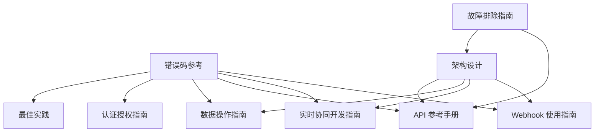
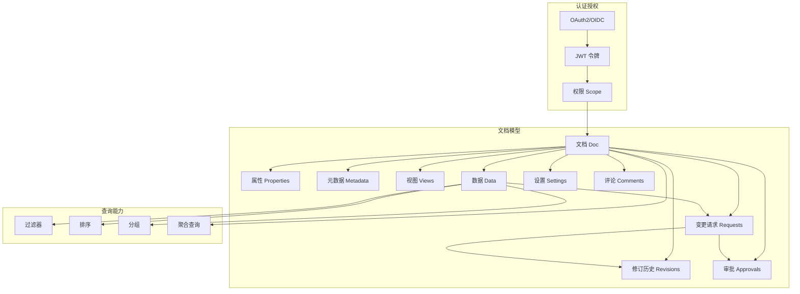
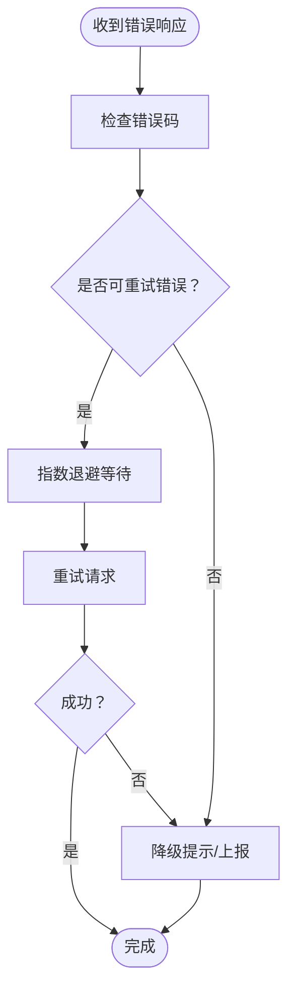
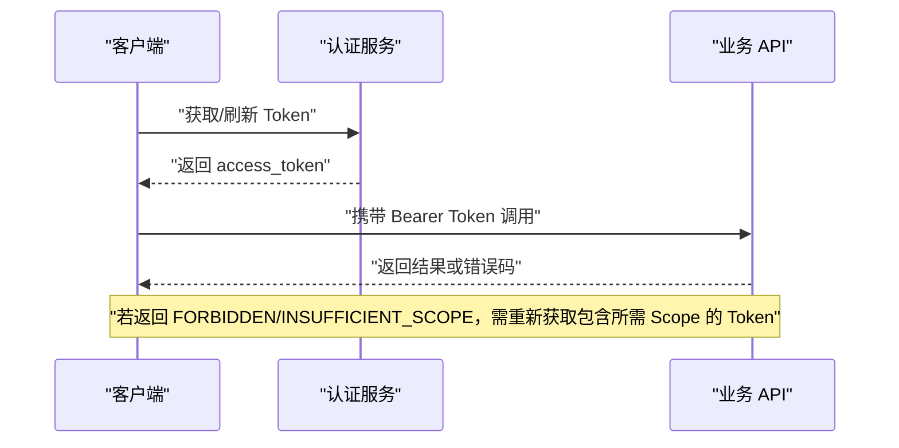
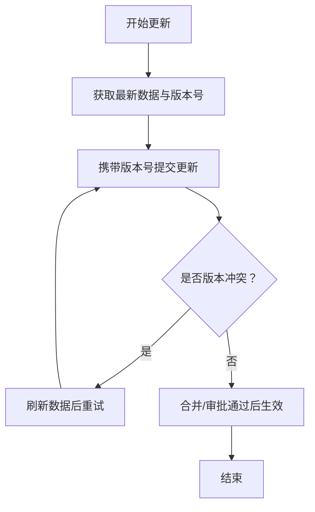
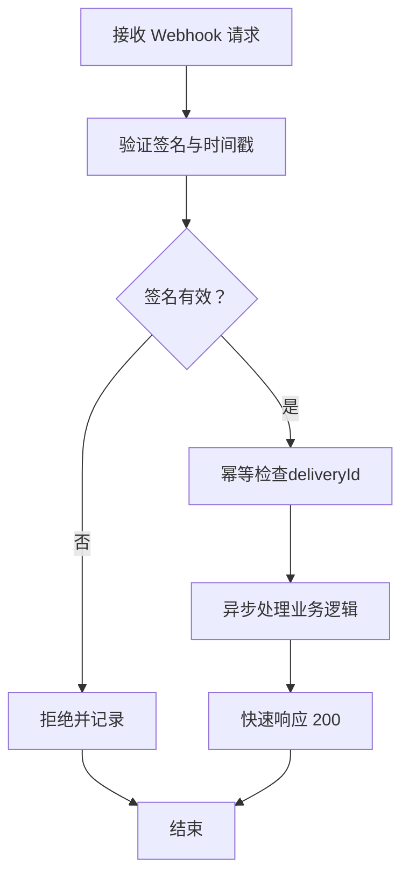
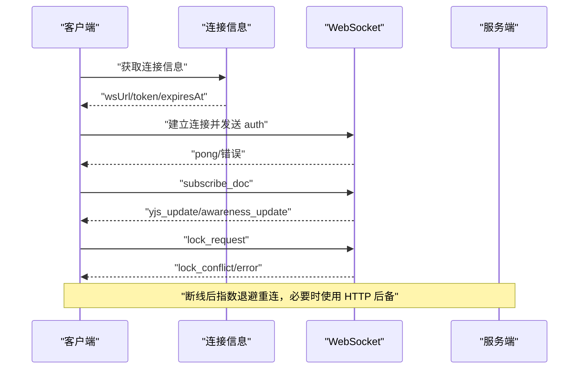
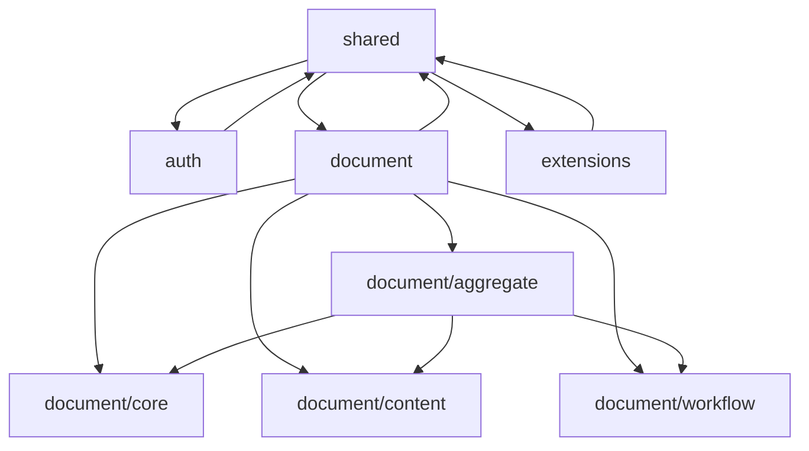

# 故障排除与最佳实践

<cite>
**本文引用的文件**
- [错误码参考](file://docs-src/references/error-codes.md)
- [故障排除指南](file://docs-src/TROUBLESHOOTING.md)
- [最佳实践](file://docs-src/guides/best-practices.md)
- [认证授权指南](file://docs-src/guides/authentication.md)
- [数据操作指南](file://docs-src/guides/data-operations.md)
- [API 参考手册](file://docs-src/references/api-reference.md)
- [架构设计](file://docs-src/guides/architecture.md)
- [实时协同开发指南](file://docs-src/guides/realtime-collaboration.md)
- [Webhook 使用指南](file://docs-src/guides/webhooks.md)
</cite>

## 目录
1. [简介](#简介)
2. [项目结构](#项目结构)
3. [核心组件](#核心组件)
4. [架构总览](#架构总览)
5. [详细组件分析](#详细组件分析)
6. [依赖分析](#依赖分析)
7. [性能考虑](#性能考虑)
8. [故障排除指南](#故障排除指南)
9. [结论](#结论)
10. [附录](#附录)

## 简介
本文件面向开发者与运维人员，系统性整理 NexusBook API 的故障排除与最佳实践。内容覆盖：
- 错误码清单与逐条解决方案
- 常见问题定位与调试步骤
- 性能优化策略（聚合查询、避免 N+1、分页与过滤）
- 安全最佳实践（令牌管理、输入验证、速率限制）
- 监控与日志记录建议
- 迁移与向后兼容注意事项

## 项目结构
围绕故障排除与最佳实践，重点涉及以下文档与指南：
- 错误码参考：统一错误响应格式、HTTP 状态码映射、各类错误的成因与修复建议
- 故障排除指南：文档构建与部署常见问题（Jekyll、样式、404、Mermaid、权限）
- 最佳实践：属性与元数据设计、批量操作、并发控制、错误处理、缓存与性能、安全、测试与监控
- 认证授权指南：OAuth2/OIDC 流程、Token 管理、Scope 权限、安全建议与错误处理
- 数据操作指南：CRUD、批量更新、变更请求工作流、并发冲突与版本控制、性能优化
- API 参考手册：统一响应格式、端点与参数、过滤/排序/分组/聚合、错误码索引
- 架构设计：文档模型、目录结构、模块职责、数据流与工作流
- 实时协同开发指南：连接、消息、Yjs 增量同步、Awareness、单元格锁定、断线重连与后备策略
- Webhook 使用指南：事件类型、签名验证、幂等处理、重试策略、投递历史与统计

**图表来源**
- [错误码参考](file://docs-src/references/error-codes.md#L1-L312)
- [最佳实践](file://docs-src/guides/best-practices.md#L1-L474)
- [认证授权指南](file://docs-src/guides/authentication.md#L1-L507)
- [数据操作指南](file://docs-src/guides/data-operations.md#L1-L403)
- [API 参考手册](file://docs-src/references/api-reference.md#L1-L665)
- [架构设计](file://docs-src/guides/architecture.md#L1-L404)
- [实时协同开发指南](file://docs-src/guides/realtime-collaboration.md#L1-L212)
- [Webhook 使用指南](file://docs-src/guides/webhooks.md#L1-L688)

**章节来源**
- [错误码参考](file://docs-src/references/error-codes.md#L1-L312)
- [最佳实践](file://docs-src/guides/best-practices.md#L1-L474)
- [认证授权指南](file://docs-src/guides/authentication.md#L1-L507)
- [数据操作指南](file://docs-src/guides/data-operations.md#L1-L403)
- [API 参考手册](file://docs-src/references/api-reference.md#L1-L665)
- [架构设计](file://docs-src/guides/architecture.md#L1-L404)
- [实时协同开发指南](file://docs-src/guides/realtime-collaboration.md#L1-L212)
- [Webhook 使用指南](file://docs-src/guides/webhooks.md#L1-L688)

## 核心组件
- 错误码体系：统一响应格式、HTTP 状态码映射、错误分类与重试策略
- 认证与授权：OAuth2/OIDC、Scope 权限、Token 生命周期与刷新
- 数据操作：CRUD、批量更新、变更请求工作流、版本控制与冲突处理
- 实时协同：WebSocket/SSE、Yjs 增量同步、Awareness、单元格锁定、断线重连
- Webhook：事件驱动、签名验证、幂等处理、重试与投递历史
- 性能与安全：批量操作、按需加载、过滤与分页、输入验证、速率限制、日志与监控

**章节来源**
- [错误码参考](file://docs-src/references/error-codes.md#L1-L312)
- [认证授权指南](file://docs-src/guides/authentication.md#L1-L507)
- [数据操作指南](file://docs-src/guides/data-operations.md#L1-L403)
- [实时协同开发指南](file://docs-src/guides/realtime-collaboration.md#L1-L212)
- [Webhook 使用指南](file://docs-src/guides/webhooks.md#L1-L688)
- [最佳实践](file://docs-src/guides/best-practices.md#L1-L474)

## 架构总览
下图展示文档模型与关键模块之间的关系，以及聚合查询与工作流如何贯穿系统。

**图表来源**
- [架构设计](file://docs-src/guides/architecture.md#L1-L404)
- [API 参考手册](file://docs-src/references/api-reference.md#L1-L665)

**章节来源**
- [架构设计](file://docs-src/guides/architecture.md#L1-L404)
- [API 参考手册](file://docs-src/references/api-reference.md#L1-L665)

## 详细组件分析

### 错误码与错误处理最佳实践
- 统一响应格式与 HTTP 状态码映射，便于客户端一致化处理
- 常见错误分类与典型成因：
  - 认证相关：客户端凭证无效、Token 无效/过期、未授权、权限不足、Scope 不足
  - 文档/视图/数据/评论/审批/Webhook/请求/通用错误
- 错误处理最佳实践：
  - 重试策略：针对可恢复错误（如内部错误、服务不可用）采用指数退避
  - 用户友好提示：优先使用 API 返回的多语言消息，必要时提供降级提示
  - 错误日志记录：记录错误码、消息、端点、方法、用户、时间戳，便于定位

**图表来源**
- [错误码参考](file://docs-src/references/error-codes.md#L226-L312)

**章节来源**
- [错误码参考](file://docs-src/references/error-codes.md#L1-L312)

### 认证失败与权限不足
- 常见错误：INVALID_CLIENT、INVALID_TOKEN、UNAUTHORIZED、FORBIDDEN、INSUFFICIENT_SCOPE
- 排查要点：
  - 确认 client_id/client_secret 正确
  - 检查 Authorization 头是否包含有效的 Bearer Token
  - 核对 Token 的 Scope 是否包含所需权限
  - 使用 refresh_token 刷新或重新获取 Token
- 最佳实践：
  - 最小权限原则，仅请求必要的 scope
  - 安全存储 Token，避免明文与客户端存储
  - 实施速率限制，防止滥用

**图表来源**
- [认证授权指南](file://docs-src/guides/authentication.md#L437-L500)

**章节来源**
- [认证授权指南](file://docs-src/guides/authentication.md#L1-L507)
- [错误码参考](file://docs-src/references/error-codes.md#L33-L99)

### 并发冲突与版本控制
- 常见错误：VERSION_CONFLICT、DUPLICATE_ID
- 原因：数据被其他用户修改、ID 冲突
- 处理策略：
  - 使用版本号进行乐观锁更新
  - 发生冲突时刷新数据并重试
  - 避免循环创建，优先批量操作
- 最佳实践：
  - 明确 requestId，统一进入变更请求工作流
  - 使用批量更新（BulkUpdate）减少往返
  - 合理设置分页大小，避免深分页

**图表来源**
- [数据操作指南](file://docs-src/guides/data-operations.md#L234-L273)
- [最佳实践](file://docs-src/guides/best-practices.md#L103-L143)

**章节来源**
- [数据操作指南](file://docs-src/guides/data-operations.md#L1-L403)
- [最佳实践](file://docs-src/guides/best-practices.md#L1-L474)

### Webhook 投递失败与签名验证
- 常见错误：WEBHOOK_NOT_FOUND、WEBHOOK_URL_INVALID、WEBHOOK_DELIVERY_FAILED
- 排查要点：
  - 确认 Webhook URL 可达且支持 HTTPS
  - 校验 X-Webhook-Signature 与时间戳，防止重放
  - 使用 deliveryId 幂等处理，避免重复消费
- 最佳实践：
  - 快速响应（≤30 秒），异步处理业务逻辑
  - 指数退避 + 抖动重试，控制最大重试次数
  - 记录投递历史与统计，便于诊断

**图表来源**
- [Webhook 使用指南](file://docs-src/guides/webhooks.md#L446-L688)

**章节来源**
- [Webhook 使用指南](file://docs-src/guides/webhooks.md#L1-L688)
- [错误码参考](file://docs-src/references/error-codes.md#L170-L206)

### 实时协同错误与断线重连
- 常见错误：WS_AUTH_FAILED、WS_RATE_LIMITED、LOCK_CONFLICT、SSE_UNSUPPORTED
- 排查要点：
  - WebSocket 认证失败：重新获取连接信息并认证
  - 消息速率超限：降低频率或启用批处理
  - 单元格锁冲突：等待释放或申请更长锁定时间
  - 环境不支持 SSE：改用 WebSocket 或轮询
- 最佳实践：
  - 心跳 ping/pong，指数退避重连
  - 断线后拉取快照对齐状态向量
  - 与审批工作流联动，标注 data_changed 与 Request 关联

**图表来源**
- [实时协同开发指南](file://docs-src/guides/realtime-collaboration.md#L1-L212)

**章节来源**
- [实时协同开发指南](file://docs-src/guides/realtime-collaboration.md#L1-L212)
- [错误码参考](file://docs-src/references/error-codes.md#L285-L307)

### API 参考与统一响应格式
- 统一响应结构：success、code、message（多语言）、payload
- 多语言消息：message 为语言代码到文本的映射
- 端点与参数：聚合查询 include、过滤/排序/分组/聚合、变更请求工作流
- 错误码索引：在 API 参考中可直接跳转到错误码参考

**章节来源**
- [API 参考手册](file://docs-src/references/api-reference.md#L1-L200)
- [API 参考手册](file://docs-src/references/api-reference.md#L652-L665)

## 依赖分析
- 模块依赖：shared → auth → document → extensions
- 聚合模块组合核心模块能力，形成统一入口
- 工作流：Requests → Revisions + Approvals，数据默认生成 Requests

**图表来源**
- [架构设计](file://docs-src/guides/architecture.md#L120-L219)

**章节来源**
- [架构设计](file://docs-src/guides/architecture.md#L1-L404)

## 性能考虑
- 聚合查询：使用 include 一次性获取所需数据，避免多次往返
- 批量操作：优先 BulkUpdate，减少请求次数与网络开销
- 分页与过滤：合理 pageSize，服务端过滤优于客户端过滤
- 缓存策略：对只读数据设置 TTL，避免热点重复查询
- 并发控制：乐观锁 + 版本号，避免 N+1 冲突
- 并行请求：对独立资源使用 Promise.all 并行加载
- 请求去重：对相同 key 的请求进行去重，避免重复网络请求

**章节来源**
- [最佳实践](file://docs-src/guides/best-practices.md#L213-L280)
- [数据操作指南](file://docs-src/guides/data-operations.md#L273-L338)
- [API 参考手册](file://docs-src/references/api-reference.md#L56-L120)

## 故障排除指南
- 文档构建与部署（GitHub Pages）：
  - 确保 docs/.nojekyll 存在并复制到构建输出目录
  - 验证构建脚本与工作流权限配置
  - 使用检查脚本与调试日志定位问题
- 样式丢失：检查样式文件存在与 HTML 引用路径
- 404 错误：确认 Pages 设置、工作流状态与 URL
- Mermaid 图表不显示：确认引入 Mermaid 库、代码块格式与浏览器控制台
- 权限错误：检查工作流权限与仓库设置

**章节来源**
- [故障排除指南](file://docs-src/TROUBLESHOOTING.md#L1-L357)

## 结论
通过统一的错误码体系、完善的认证授权与权限控制、严格的并发与版本管理、稳健的 Webhook 与实时协同机制，以及系统化的性能优化与安全实践，NexusBook API 能够在复杂业务场景中保持高可用与高一致性。建议在开发与运维实践中：
- 将错误码与重试策略纳入客户端 SDK
- 严格遵循最小权限与 HTTPS 传输
- 使用聚合查询与批量操作提升性能
- 建立完善的监控与日志体系，配合 Webhook 与审计追踪

## 附录

### 常见错误码一览与处置要点
- 认证相关：INVALID_CLIENT、INVALID_TOKEN、UNAUTHORIZED、FORBIDDEN、INSUFFICIENT_SCOPE
  - 处置：核对凭证与 Token、检查 Scope、刷新或重新获取
- 文档/视图/数据/评论/审批/Webhook/请求/通用：详见错误码参考
  - 处置：按错误说明检查参数、ID、URL、权限与网络可达性
- 实时协同：WS_AUTH_FAILED、WS_RATE_LIMITED、LOCK_CONFLICT、SSE_UNSUPPORTED
  - 处置：重新认证、降低速率、等待锁释放、切换传输协议

**章节来源**
- [错误码参考](file://docs-src/references/error-codes.md#L1-L312)

### 迁移与向后兼容注意事项
- API 版本控制：路径包含版本号，重大变更时升级版本
- 响应格式变更：保持向后兼容，新增字段不破坏旧客户端
- 字段类型与错误码：新增类型与错误码需在 shared 模块集中管理
- 文档生成：TypeSpec 编译与 OpenAPI 规范生成，确保工具链稳定

**章节来源**
- [开发指南](file://docs-src/guides/development.md#L249-L310)
- [API 参考手册](file://docs-src/references/api-reference.md#L1-L60)