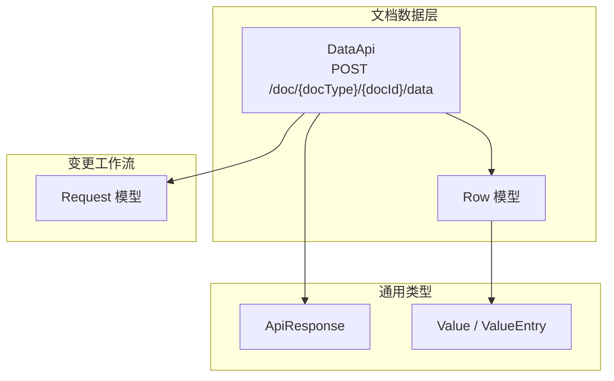
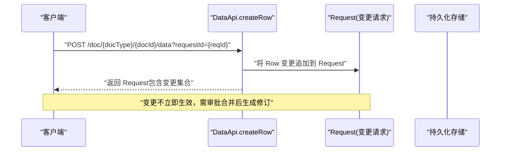
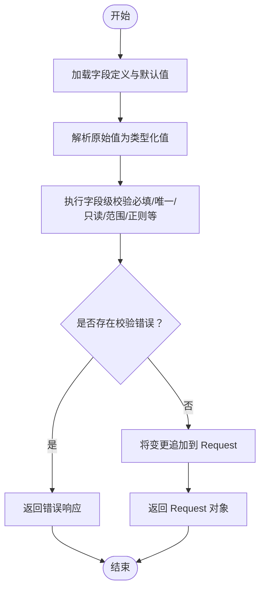
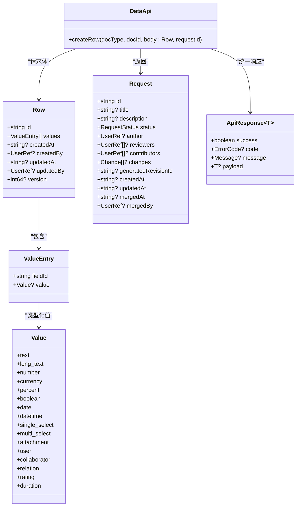

# 创建数据行

<cite>
**本文引用的文件**
- [api/document/core/data.tsp](file://api/document/core/data.tsp)
- [api/document/workflow/requests.tsp](file://api/document/workflow/requests.tsp)
- [api/shared/common.tsp](file://api/shared/common.tsp)
- [docs-src/guides/document-model.md](file://docs-src/guides/document-model.md)
- [docs-src/references/field-types.md](file://docs-src/references/field-types.md)
</cite>

## 目录
1. [简介](#简介)
2. [项目结构](#项目结构)
3. [核心组件](#核心组件)
4. [架构总览](#架构总览)
5. [详细组件分析](#详细组件分析)
6. [依赖分析](#依赖分析)
7. [性能考虑](#性能考虑)
8. [故障排查指南](#故障排查指南)
9. [结论](#结论)
10. [附录](#附录)

## 简介
本文围绕通过 POST /doc/{docType}/{docId}/data 接口创建数据行的完整流程展开，重点说明：
- 必须通过 requestId 参数将新行添加到变更请求中，而非立即生效；
- Row 模型的结构与字段含义（id、values、version 等）；
- 服务端如何基于字段类型定义进行值解析、验证与审计信息生成；
- cURL 示例展示如何创建单行数据；
- 批量创建应使用 bulkUpdate 接口的最佳实践。

## 项目结构
与“创建数据行”直接相关的模块位于文档子系统中，核心文件如下：
- 数据行与批量更新接口定义：api/document/core/data.tsp
- 变更请求模型与工作流：api/document/workflow/requests.tsp
- 通用响应与值类型定义：api/shared/common.tsp
- 文档模型与写操作约定：docs-src/guides/document-model.md
- 字段类型与值结构参考：docs-src/references/field-types.md

图表来源
- [api/document/core/data.tsp](file://api/document/core/data.tsp#L375-L725)
- [api/document/workflow/requests.tsp](file://api/document/workflow/requests.tsp#L83-L200)
- [api/shared/common.tsp](file://api/shared/common/common.tsp#L153-L177)
- [api/shared/common.tsp](file://api/shared/common/common.tsp#L710-L742)

章节来源
- [api/document/core/data.tsp](file://api/document/core/data.tsp#L375-L725)
- [api/document/workflow/requests.tsp](file://api/document/workflow/requests.tsp#L83-L200)
- [api/shared/common.tsp](file://api/shared/common/common.tsp#L153-L177)
- [api/shared/common.tsp](file://api/shared/common/common.tsp#L710-L742)

## 核心组件
- DataApi.createRow：负责接收 Row 请求体并通过 requestId 将变更写入 Request，不直接落库。
- Row：数据行模型，包含 id、values、createdAt/By、updatedAt/By、version 等字段。
- Request：变更请求模型，承载待合并的变更集合，合并后生成修订。
- ApiResponse<T>：统一响应包装，payload 为 Request 或分页 Row 列表。
- Value / ValueEntry：字段值的类型化结构，服务端依据字段类型定义进行解析与校验。

章节来源
- [api/document/core/data.tsp](file://api/document/core/data.tsp#L538-L572)
- [api/document/core/data.tsp](file://api/document/core/data.tsp#L241-L311)
- [api/document/workflow/requests.tsp](file://api/document/workflow/requests.tsp#L83-L200)
- [api/shared/common.tsp](file://api/shared/common/common.tsp#L153-L177)
- [api/shared/common.tsp](file://api/shared/common/common.tsp#L710-L742)

## 架构总览
下图展示了“创建数据行”的端到端调用路径与数据流向。

图表来源
- [api/document/core/data.tsp](file://api/document/core/data.tsp#L538-L572)
- [api/document/workflow/requests.tsp](file://api/document/workflow/requests.tsp#L83-L200)

## 详细组件分析

### Row 模型与字段语义
- id：行唯一标识，客户端在创建时提供，服务端不生成。
- values：字段值集合，元素为 ValueEntry，包含 fieldId 与类型化 value。
- createdAt/createdBy/updatedAt/updatedBy：审计信息，由服务端在变更请求合并时填充。
- version：版本号，用于并发控制（乐观锁）。更新行时需提供当前版本号，避免并发覆盖。

章节来源
- [api/document/core/data.tsp](file://api/document/core/data.tsp#L241-L311)
- [api/shared/common.tsp](file://api/shared/common/common.tsp#L710-L742)

### 字段类型与值解析
- 服务端根据字段类型定义（见字段类型参考）对原始值进行解析与校验。
- 常见类型映射：
  - text/long_text → {"text": "..."}
  - number/currency/percent → {"number": N}
  - boolean → {"boolean": true/false}
  - date → {"date": "YYYY-MM-DD"}
  - datetime → {"datetime": "YYYY-MM-DDTHH:mm:ssZ"}
  - duration → {"duration": ms}
  - single_select → {"selectOption": {...}}
  - multi_select → {"selectOptions": [...]}
  - rating → {"rating": 1..5}
  - attachment → {"attachments": [...]}
  - user → {"user": {...}}
  - collaborator → {"collaborators": [...]}
  - relation → {"relations": [...]}
- 字段配置支持 required、unique、readOnly、defaultValue、validation 等，服务端在解析时进行约束检查。

章节来源
- [docs-src/references/field-types.md](file://docs-src/references/field-types.md#L1-L461)
- [api/document/core/metadata.tsp](file://api/document/core/metadata.tsp#L54-L105)

### 变更请求工作流
- 所有写操作（创建/更新/删除/批量更新）均需携带 requestId，变更先写入 Request。
- 多人可协同编辑同一 Request；审批通过后合并，生成修订并落库。
- Request.status 支持 open/merged/closed 三态流转；合并后记录 contributors、mergedAt、mergedBy 等审计信息。

章节来源
- [api/document/workflow/requests.tsp](file://api/document/workflow/requests.tsp#L83-L200)
- [api/document/workflow/requests.tsp](file://api/document/workflow/requests.tsp#L202-L391)

### POST /doc/{docType}/{docId}/data 创建数据行
- 请求方法：POST
- 路径参数：docType、docId
- 查询参数：requestId（必须）
- 请求体：Row
- 响应：ApiResponse<Request>，返回变更请求对象（包含变更集合）

cURL 示例（创建单行数据）
- 使用 requestId 将变更写入请求
- 请求体为 Row，values 中包含 fieldId 与类型化 value

章节来源
- [api/document/core/data.tsp](file://api/document/core/data.tsp#L538-L572)
- [docs-src/guides/document-model.md](file://docs-src/guides/document-model.md#L274-L297)

### 服务端处理流程（字段类型验证、默认值与审计）
- 获取文档元数据（字段定义、默认值、校验规则）；
- 对每个字段值：
  - 根据字段类型定义解析原始值为类型化值；
  - 校验必填、唯一、只读、精度、范围、正则等约束；
  - 若字段配置了 defaultValue 且未提供值，则使用默认值；
- 将变更写入指定 Request（或新建/追加到默认请求），不直接落库；
- 返回变更请求对象，供后续审批与合并。

图表来源
- [api/document/core/data.tsp](file://api/document/core/data.tsp#L538-L572)
- [docs-src/references/field-types.md](file://docs-src/references/field-types.md#L1-L461)
- [api/document/core/metadata.tsp](file://api/document/core/metadata.tsp#L54-L105)

### 批量创建最佳实践（bulkUpdate）
- 由于批量创建（batch-create）已废弃，统一使用批量更新接口；
- BulkUpdate 采用灵活的 target + 原始 value 结构，服务端根据 metadata 自动解析类型；
- 支持同时更新数据行与文档属性，value 可为单值、对象或数组；
- 批量更新同样必须携带 requestId，变更写入 Request，审批合并后生效。

章节来源
- [api/document/core/data.tsp](file://api/document/core/data.tsp#L574-L667)
- [docs-src/guides/document-model.md](file://docs-src/guides/document-model.md#L240-L300)

## 依赖分析
- DataApi.createRow 依赖：
  - Row 模型（字段值结构）
  - Request 模型（变更载体）
  - ApiResponse<T>（统一响应）
  - Value / ValueEntry（类型化值）
- 字段类型与默认值来源于字段定义（metadata），服务端据此进行解析与校验。

图表来源
- [api/document/core/data.tsp](file://api/document/core/data.tsp#L241-L311)
- [api/document/core/data.tsp](file://api/document/core/data.tsp#L538-L572)
- [api/document/workflow/requests.tsp](file://api/document/workflow/requests.tsp#L83-L200)
- [api/shared/common.tsp](file://api/shared/common/common.tsp#L153-L177)
- [api/shared/common.tsp](file://api/shared/common/common.tsp#L710-L742)

## 性能考虑
- 批量更新（bulkUpdate）适合一次性提交大量行变更，减少往返次数；
- 使用 requestId 协同编辑同一请求，避免重复解析与重复校验；
- 合理分页与条件过滤（查询接口）可降低一次性传输的数据量；
- 在高并发场景下，利用 Row.version 字段进行乐观锁，减少冲突重试成本。

## 故障排查指南
- 缺少 requestId：所有写操作必须携带 requestId，否则无法进入变更请求。
- 字段类型不匹配：确保 values 中的 fieldId 对应的值符合字段类型定义（如 number/currency/date 等）。
- 必填字段缺失：若字段配置为 required，必须提供值；否则触发校验失败。
- 唯一性冲突：若字段配置为 unique，重复值会导致冲突。
- 只读字段：readOnly 字段不允许客户端直接修改。
- 并发冲突：更新行时未提供正确 version 或与其他请求并发修改导致冲突。

章节来源
- [api/document/core/data.tsp](file://api/document/core/data.tsp#L538-L572)
- [docs-src/references/field-types.md](file://docs-src/references/field-types.md#L1-L461)
- [api/document/core/metadata.tsp](file://api/document/core/metadata.tsp#L54-L105)

## 结论
- 创建数据行必须通过 requestId 进入变更请求，经审批合并后才真正生效；
- Row 模型强调字段值的类型化结构与审计信息，version 用于并发控制；
- 服务端基于字段类型定义进行自动解析与校验，支持默认值与多种字段约束；
- 批量创建应统一使用 bulkUpdate 接口，提升效率与一致性。

## 附录
- cURL 示例（创建单行数据）
  - 使用 POST /doc/{docType}/{docId}/data
  - 查询参数：requestId
  - 请求体：Row（包含 id 与 values）
- 批量更新（bulkUpdate）示例
  - 使用 POST /doc/{docType}/{docId}/data/bulk
  - 查询参数：requestId
  - 请求体：BulkUpdate[]（target + 原始 value）

章节来源
- [api/document/core/data.tsp](file://api/document/core/data.tsp#L538-L572)
- [api/document/core/data.tsp](file://api/document/core/data.tsp#L574-L667)
- [docs-src/guides/document-model.md](file://docs-src/guides/document-model.md#L240-L300)