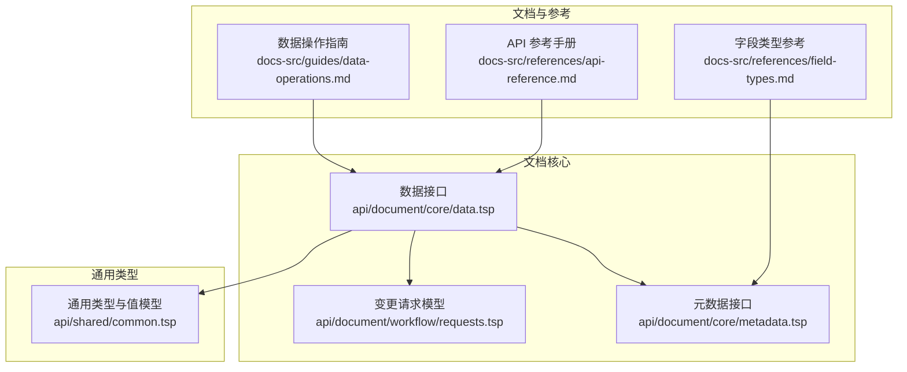
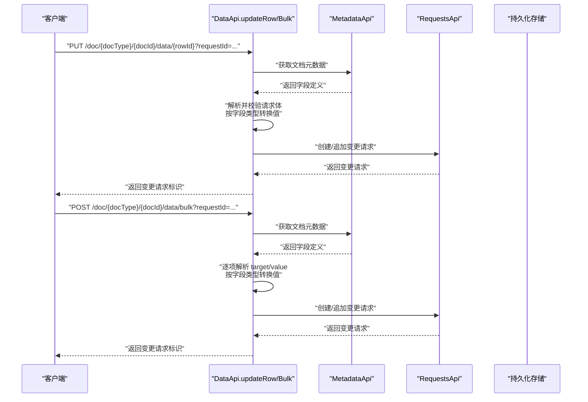
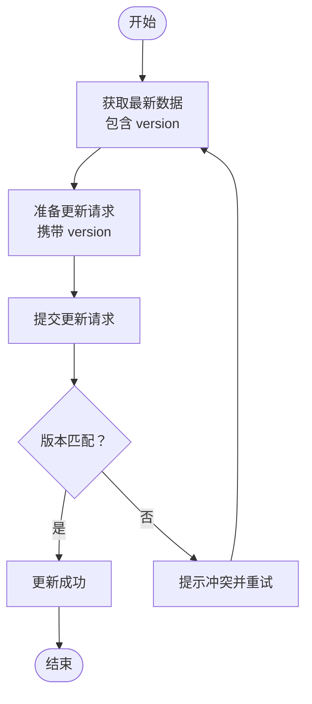
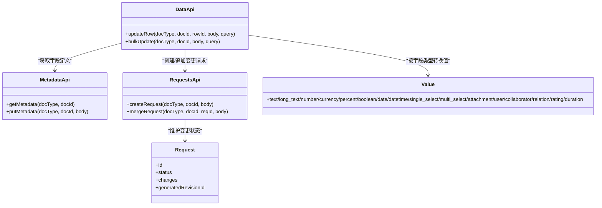

# 更新数据行

<cite>
**本文引用的文件**
- [api/document/core/data.tsp](file://api/document/core/data.tsp)
- [api/document/workflow/requests.tsp](file://api/document/workflow/requests.tsp)
- [api/document/core/metadata.tsp](file://api/document/core/metadata.tsp)
- [api/shared/common.tsp](file://api/shared/common.tsp)
- [docs-src/guides/data-operations.md](file://docs-src/guides/data-operations.md)
- [docs-src/references/api-reference.md](file://docs-src/references/api-reference.md)
- [docs-src/references/field-types.md](file://docs-src/references/field-types.md)
</cite>

## 目录
1. [简介](#简介)
2. [项目结构](#项目结构)
3. [核心组件](#核心组件)
4. [架构概览](#架构概览)
5. [详细组件分析](#详细组件分析)
6. [依赖分析](#依赖分析)
7. [性能考虑](#性能考虑)
8. [故障排查指南](#故障排查指南)
9. [结论](#结论)
10. [附录](#附录)

## 简介
本篇文档围绕“更新数据行”的核心能力展开，重点讲解以下两个接口：
- PUT /api/v1/doc/{docType}/{docId}/data/{rowId}：单行更新（进入变更请求）
- POST /api/v1/doc/{docType}/{docId}/data/bulk：批量更新（进入变更请求）

同时，文档深入说明：
- 乐观锁机制中 version 字段的作用与并发冲突处理流程
- BulkUpdate 模型的灵活 target/value 设计，覆盖单行单字段、多行单字段、整行更新、属性更新、条件更新/删除等场景
- 服务端如何基于 metadata 自动解析原始值类型并进行校验
- 提供 cURL 示例，帮助快速上手

## 项目结构
与“更新数据行”直接相关的模块与文件如下：
- 数据行与批量更新接口定义：api/document/core/data.tsp
- 变更请求模型与工作流：api/document/workflow/requests.tsp
- 元数据与字段类型定义：api/document/core/metadata.tsp
- 通用类型与值模型：api/shared/common.tsp
- 使用指南与示例：docs-src/guides/data-operations.md
- API 参考与端点清单：docs-src/references/api-reference.md
- 字段类型与值映射参考：docs-src/references/field-types.md

图表来源
- [api/document/core/data.tsp](file://api/document/core/data.tsp#L375-L726)
- [api/document/core/metadata.tsp](file://api/document/core/metadata.tsp#L1-L211)
- [api/document/workflow/requests.tsp](file://api/document/workflow/requests.tsp#L83-L201)
- [api/shared/common.tsp](file://api/shared/common.tsp#L710-L742)
- [docs-src/guides/data-operations.md](file://docs-src/guides/data-operations.md#L1-L403)
- [docs-src/references/api-reference.md](file://docs-src/references/api-reference.md#L190-L214)
- [docs-src/references/field-types.md](file://docs-src/references/field-types.md#L98-L200)

章节来源
- [api/document/core/data.tsp](file://api/document/core/data.tsp#L375-L726)
- [api/document/core/metadata.tsp](file://api/document/core/metadata.tsp#L1-L211)
- [api/document/workflow/requests.tsp](file://api/document/workflow/requests.tsp#L83-L201)
- [api/shared/common.tsp](file://api/shared/common.tsp#L710-L742)
- [docs-src/guides/data-operations.md](file://docs-src/guides/data-operations.md#L1-L403)
- [docs-src/references/api-reference.md](file://docs-src/references/api-reference.md#L190-L214)
- [docs-src/references/field-types.md](file://docs-src/references/field-types.md#L98-L200)

## 核心组件
- 数据接口 DataApi：提供 listRows、queryRows、queryGroupedRows、createRow、bulkUpdate、getRow、updateRow、deleteRow 等端点，其中 updateRow 与 bulkUpdate 是本次文档关注的重点。
- 变更请求 Request：所有写操作（创建/更新/删除/批量更新）均进入变更请求，经多人协同与审批后合并生效。
- 元数据 Metadata：包含字段定义与属性定义，用于服务端解析与校验 BulkUpdate 的原始值。
- 通用值模型 Value/ValueEntry：定义字段值的多态结构，支撑服务端按字段类型自动转换与校验。

章节来源
- [api/document/core/data.tsp](file://api/document/core/data.tsp#L375-L726)
- [api/document/workflow/requests.tsp](file://api/document/workflow/requests.tsp#L83-L201)
- [api/document/core/metadata.tsp](file://api/document/core/metadata.tsp#L160-L211)
- [api/shared/common.tsp](file://api/shared/common.tsp#L710-L742)

## 架构概览
下图展示了“更新数据行”的整体调用链路与工作流：

图表来源
- [api/document/core/data.tsp](file://api/document/core/data.tsp#L658-L726)
- [api/document/core/metadata.tsp](file://api/document/core/metadata.tsp#L183-L211)
- [api/document/workflow/requests.tsp](file://api/document/workflow/requests.tsp#L202-L284)

## 详细组件分析

### 接口：PUT /doc/{docType}/{docId}/data/{rowId}
- 功能：更新单行数据（进入变更请求）
- 关键点：
  - 请求体为 Row，包含 values 与 version
  - version 用于乐观锁，确保并发安全
  - 所有写操作统一走 requestId 工作流
- 常见用法：
  - 全量更新整行字段
  - 部分更新（仅提供需要变更的字段）
- 并发冲突处理：
  - 若版本不匹配，服务端返回版本冲突错误
  - 客户端应先拉取最新数据，再提交更新

章节来源
- [api/document/core/data.tsp](file://api/document/core/data.tsp#L689-L726)
- [docs-src/guides/data-operations.md](file://docs-src/guides/data-operations.md#L105-L140)

### 接口：POST /doc/{docType}/{docId}/data/bulk
- 功能：批量更新数据与属性（进入变更请求）
- 关键点：
  - 请求体为 BulkUpdate[]，每项包含 target 与 value
  - target 支持多种灵活目标：单行、多行、单字段、整行、属性、条件更新/删除
  - value 支持原始值、对象、数组，服务端依据 metadata 自动解析与校验
- 适用场景：
  - 单行单字段更新
  - 整行多字段更新
  - 多行同一字段更新
  - 多行同一字段不同值更新
  - 文档属性更新（单个或多个）
  - 条件更新/删除

章节来源
- [api/document/core/data.tsp](file://api/document/core/data.tsp#L575-L667)
- [docs-src/guides/data-operations.md](file://docs-src/guides/data-operations.md#L156-L196)

### BulkUpdate 模型与 target/value 设计
- BulkUpdate 结构
  - target：灵活目标，支持 row/rows/property/properties/condition/delete 等组合
  - value：原始值（数字/字符串/布尔/对象/数组），服务端按字段类型自动转换
- 支持的典型场景
  - 单行单字段：target.row + target.field
  - 整行更新：target.row + value 为对象
  - 多行同一字段：target.rows + target.field
  - 多行不同值：target.rows + target.field + value 为数组
  - 文档属性：target.property 或 target.properties
  - 条件更新/删除：target.condition + target.field/target.delete
  - 删除单行或多行：target.row/target.rows + target.delete:true
- 服务端处理流程
  - 通过 docId 获取 metadata
  - 解析每个 target，识别目标类型（行/属性）
  - 查找字段定义获取类型
  - 将原始值转换为类型化值
  - 验证值有效性
  - 写入指定的变更请求

章节来源
- [api/document/core/data.tsp](file://api/document/core/data.tsp#L71-L239)
- [api/document/core/metadata.tsp](file://api/document/core/metadata.tsp#L160-L211)
- [docs-src/guides/data-operations.md](file://docs-src/guides/data-operations.md#L156-L196)

### 乐观锁与 version 字段
- 作用
  - version 用于乐观锁，避免并发更新导致的数据覆盖
  - 客户端在更新时必须提供当前版本号
- 冲突处理流程
  - 客户端先获取最新 Row（包含 version）
  - 提交更新时携带相同的 version
  - 若版本匹配，更新成功；若不匹配，返回版本冲突错误
  - 客户端收到冲突后，应重新拉取最新数据并重试

图表来源
- [api/document/core/data.tsp](file://api/document/core/data.tsp#L689-L726)
- [docs-src/guides/data-operations.md](file://docs-src/guides/data-operations.md#L234-L272)

章节来源
- [api/document/core/data.tsp](file://api/document/core/data.tsp#L689-L726)
- [docs-src/guides/data-operations.md](file://docs-src/guides/data-operations.md#L234-L272)

### 服务端如何基于 metadata 自动解析与校验
- 步骤
  - 通过 docId 获取文档元数据（包含字段定义）
  - 针对每个 target：
    - 解析目标类型（行字段/属性）
    - 查找字段定义（类型、必填、唯一、只读、校验规则等）
    - 将原始值转换为类型化值（如 number/text/boolean/date 等）
    - 执行字段级校验（必填、唯一、自定义规则等）
  - 将合法变更写入指定的变更请求
- 字段类型与值映射参考
  - 文本/长文本、数值/货币/百分比、布尔、日期/日期时间、单选/多选、附件、用户、协作人、关联、评分、时长等
  - 详见字段类型参考文档

章节来源
- [api/document/core/data.tsp](file://api/document/core/data.tsp#L642-L657)
- [api/document/core/metadata.tsp](file://api/document/core/metadata.tsp#L160-L211)
- [docs-src/references/field-types.md](file://docs-src/references/field-types.md#L98-L200)

### cURL 使用示例（按场景）
以下示例展示不同更新模式的用法。请将 {docType}、{docId}、{rowId}、{requestId}、TOKEN 替换为实际值。

- 单行更新（全量/部分）
  - 全量更新整行字段
  - 部分更新（仅提供需要变更的字段）
  - 参考路径：[示例](file://docs-src/guides/data-operations.md#L107-L134)

- 批量更新（BulkUpdate）
  - 单行单字段
  - 整行多字段
  - 多行同一字段
  - 多行同一字段不同值
  - 文档属性（单个/多个）
  - 条件更新/删除
  - 混合更新（数据 + 属性）
  - 参考路径：[示例](file://docs-src/guides/data-operations.md#L58-L67) 与 [示例](file://docs-src/guides/data-operations.md#L156-L196)

- API 端点清单
  - 单行更新：PUT /api/v1/doc/{docType}/{docId}/data/{rowId}?requestId={request-id}
  - 批量更新：POST /api/v1/doc/{docType}/{docId}/data/bulk?requestId={request-id}
  - 参考路径：[端点清单](file://docs-src/references/api-reference.md#L190-L214)

章节来源
- [docs-src/guides/data-operations.md](file://docs-src/guides/data-operations.md#L58-L67)
- [docs-src/guides/data-operations.md](file://docs-src/guides/data-operations.md#L107-L134)
- [docs-src/guides/data-operations.md](file://docs-src/guides/data-operations.md#L156-L196)
- [docs-src/references/api-reference.md](file://docs-src/references/api-reference.md#L190-L214)

## 依赖分析
- DataApi 依赖
  - MetadataApi：获取字段定义，支撑类型转换与校验
  - RequestsApi：所有写操作进入变更请求，多人协同与审批
  - Common.Value/ValueEntry：字段值的多态结构
- 变更请求 Request
  - 包含变更类型、操作类型、目标ID、变更数据、状态、作者、评审人、贡献者、生成修订ID等
- 元数据 Metadata
  - fields：数据行字段定义（类型、必填、唯一、只读、选项、校验规则等）
  - properties：文档属性字段定义

图表来源
- [api/document/core/data.tsp](file://api/document/core/data.tsp#L375-L726)
- [api/document/core/metadata.tsp](file://api/document/core/metadata.tsp#L183-L211)
- [api/document/workflow/requests.tsp](file://api/document/workflow/requests.tsp#L202-L391)
- [api/shared/common.tsp](file://api/shared/common.tsp#L710-L742)

章节来源
- [api/document/core/data.tsp](file://api/document/core/data.tsp#L375-L726)
- [api/document/core/metadata.tsp](file://api/document/core/metadata.tsp#L183-L211)
- [api/document/workflow/requests.tsp](file://api/document/workflow/requests.tsp#L202-L391)
- [api/shared/common.tsp](file://api/shared/common.tsp#L710-L742)

## 性能考虑
- 优先使用批量更新（POST /doc/{docType}/{docId}/data/bulk）以减少网络往返与请求开销
- 控制分页大小，避免过大响应导致延迟
- 仅查询所需字段，减少不必要的数据传输
- 使用过滤与分组查询，将数据量控制在合理范围

章节来源
- [docs-src/guides/data-operations.md](file://docs-src/guides/data-operations.md#L273-L338)

## 故障排查指南
- 版本冲突（VERSION_CONFLICT）
  - 现象：更新时返回版本冲突错误
  - 处理：重新拉取最新数据，携带最新 version 再次提交
  - 参考路径：[并发控制与冲突处理](file://docs-src/guides/data-operations.md#L234-L272)
- 字段类型不匹配
  - 现象：提交的原始值与字段类型不一致
  - 处理：根据字段类型参考修正值格式
  - 参考路径：[字段类型与值映射](file://docs-src/references/field-types.md#L98-L200)
- 缺少 requestId
  - 现象：写操作未携带 requestId
  - 处理：所有写操作必须携带 requestId
  - 参考路径：[API 端点与说明](file://docs-src/references/api-reference.md#L190-L214)

章节来源
- [docs-src/guides/data-operations.md](file://docs-src/guides/data-operations.md#L234-L272)
- [docs-src/references/field-types.md](file://docs-src/references/field-types.md#L98-L200)
- [docs-src/references/api-reference.md](file://docs-src/references/api-reference.md#L190-L214)

## 结论
- PUT /doc/{docType}/{docId}/data/{rowId} 适合单行更新，配合 version 字段实现乐观锁并发控制
- POST /doc/{docType}/{docId}/data/bulk 提供强大的 BulkUpdate 能力，支持多种灵活的 target/value 场景，并通过 metadata 自动解析与校验，简化客户端实现
- 所有写操作统一进入变更请求工作流，支持多人协同与审批，保障数据可审计与可回滚

## 附录
- API 端点清单
  - 单行更新：PUT /api/v1/doc/{docType}/{docId}/data/{rowId}?requestId={request-id}
  - 批量更新：POST /api/v1/doc/{docType}/{docId}/data/bulk?requestId={request-id}
  - 参考路径：[端点清单](file://docs-src/references/api-reference.md#L190-L214)
- 字段类型与值映射参考
  - 参考路径：[字段类型参考](file://docs-src/references/field-types.md#L98-L200)