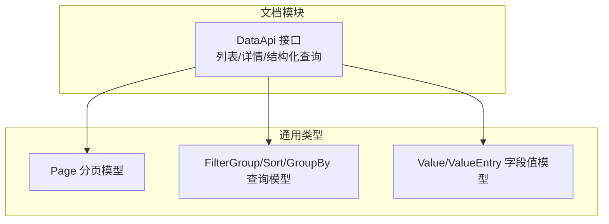
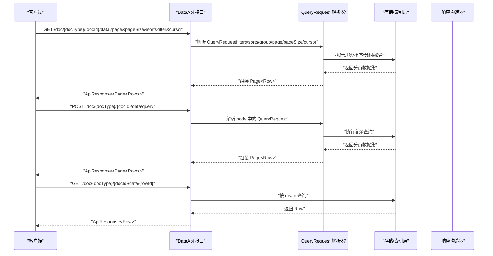
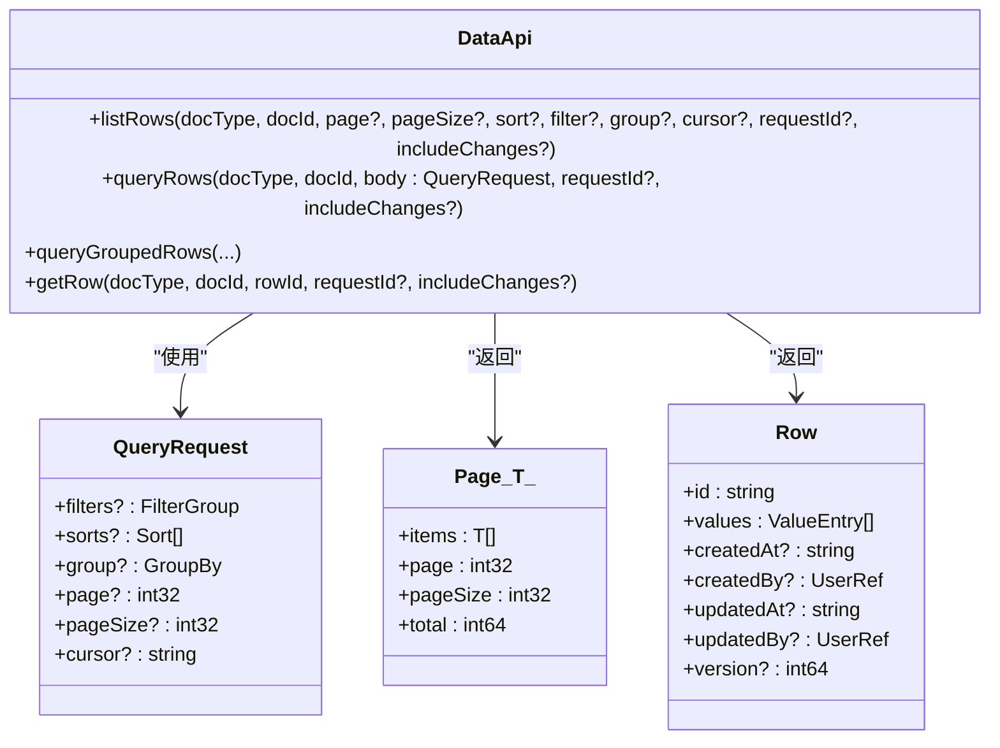

# 读取数据行

<cite>
**本文引用的文件**
- [api/document/core/data.tsp](file://api/document/core/data.tsp)
- [api/shared/common.tsp](file://api/shared/common.tsp)
- [docs-src/guides/data-operations.md](file://docs-src/guides/data-operations.md)
- [docs-src/references/api-reference.md](file://docs-src/references/api-reference.md)
- [api/main.tsp](file://api/main.tsp)
</cite>

## 目录
1. [简介](#简介)
2. [项目结构](#项目结构)
3. [核心组件](#核心组件)
4. [架构概览](#架构概览)
5. [详细组件分析](#详细组件分析)
6. [依赖分析](#依赖分析)
7. [性能考虑](#性能考虑)
8. [故障排查指南](#故障排查指南)
9. [结论](#结论)
10. [附录](#附录)

## 简介
本篇文档聚焦于“读取数据行”的两类核心接口：列表查询与单行详情。我们将系统讲解：
- GET /doc/{docType}/{docId}/data（列表查询）与 GET /doc/{docType}/{docId}/data/{rowId}（单行详情）的使用方法
- 分页机制中的 page、pageSize、cursor 参数及深分页实现
- 结构化查询接口 queryRows 的使用，包括嵌套过滤、排序、分组与聚合
- cURL 示例与响应格式 Page 对象的结构说明

## 项目结构
数据行读取能力主要位于文档模块的“核心数据”接口中，配合通用类型与查询模型，形成统一的查询与分页体系。

图表来源
- [api/document/core/data.tsp](file://api/document/core/data.tsp#L375-L441)
- [api/shared/common.tsp](file://api/shared/common.tsp#L179-L203)
- [api/shared/common.tsp](file://api/shared/common.tsp#L234-L295)
- [api/shared/common.tsp](file://api/shared/common.tsp#L334-L357)
- [api/shared/common.tsp](file://api/shared/common.tsp#L710-L742)

章节来源
- [api/document/core/data.tsp](file://api/document/core/data.tsp#L375-L441)
- [api/shared/common.tsp](file://api/shared/common.tsp#L179-L203)

## 核心组件
- DataApi 接口：提供列表查询、结构化查询、单行详情、批量更新、行 CRUD 等能力
- QueryRequest：结构化查询请求体，支持 filters、sorts、group、page、pageSize、cursor
- Page<T>：统一分页响应载体，包含 items、page、pageSize、total
- Row：数据行模型，包含 id、values、审计信息与版本号
- FilterGroup/Sort/GroupBy：过滤、排序、分组与聚合的查询模型

章节来源
- [api/document/core/data.tsp](file://api/document/core/data.tsp#L313-L373)
- [api/shared/common.tsp](file://api/shared/common.tsp#L179-L203)
- [api/shared/common.tsp](file://api/shared/common.tsp#L234-L295)
- [api/shared/common.tsp](file://api/shared/common.tsp#L334-L357)
- [api/shared/common.tsp](file://api/shared/common.tsp#L241-L270)

## 架构概览
下图展示了“读取数据行”的关键交互路径：客户端通过列表查询或结构化查询获取数据，服务端根据 QueryRequest 解析过滤、排序、分组与分页；单行详情则直接按 rowId 返回 Row。

图表来源
- [api/document/core/data.tsp](file://api/document/core/data.tsp#L375-L441)
- [api/shared/common.tsp](file://api/shared/common.tsp#L179-L203)

## 详细组件分析

### 列表查询：GET /doc/{docType}/{docId}/data
- 功能：以分页返回数据行，支持简单 DSL 查询参数（page、pageSize、sort、filter、group、cursor）
- 响应：ApiResponse<Page<Row>>
- 叠加读取：支持 requestId 查询参数，返回“生产数据 + Request 变更”的叠加视图；可选 includeChanges 参数显示变更标记

参数说明
- page：页码，默认 1
- pageSize：每页数量，默认 20，最大 200
- sort：排序表达式（字段:方向）
- filter：过滤表达式（DSL 字符串）
- group：分组表达式（DSL 字符串）
- cursor：游标，用于深分页
- requestId：变更请求 ID，用于叠加视图
- includeChanges：是否包含变更标记

cURL 示例
- 简单分页
  - curl 'https://open.nexusbook.app/api/v1/doc/product/123/data?page=1&pageSize=20'
- 带排序与过滤
  - curl 'https://open.nexusbook.app/api/v1/doc/product/123/data?sort=name:asc&filter=status:eq:active'
- 深分页（基于游标）
  - 首次请求：curl 'https://open.nexusbook.app/api/v1/doc/product/123/data?pageSize=100'
  - 下一页：curl 'https://open.nexusbook.app/api/v1/doc/product/123/data?pageSize=100&cursor=...'

章节来源
- [api/document/core/data.tsp](file://api/document/core/data.tsp#L404-L417)
- [docs-src/references/api-reference.md](file://docs-src/references/api-reference.md#L194-L214)
- [docs-src/guides/data-operations.md](file://docs-src/guides/data-operations.md#L78-L83)

### 单行详情：GET /doc/{docType}/{docId}/data/{rowId}
- 功能：返回单条数据行详情
- 响应：ApiResponse<Row>
- 叠加读取：支持 requestId 与 includeChanges

cURL 示例
- curl 'https://open.nexusbook.app/api/v1/doc/product/123/data/row-001'

章节来源
- [api/document/core/data.tsp](file://api/document/core/data.tsp#L678-L687)
- [docs-src/references/api-reference.md](file://docs-src/references/api-reference.md#L206-L214)

### 结构化查询：POST /doc/{docType}/{docId}/data/query
- 功能：以结构化体进行复杂查询（嵌套过滤、排序、分组与分页）
- 响应：ApiResponse<Page<Row>>
- 叠加读取：支持 requestId；注意：分组查询请使用 /query/group 接口

QueryRequest 字段
- filters：FilterGroup，支持嵌套逻辑与多条件组合
- sorts：Sort[]，支持多字段排序
- group：GroupBy，支持多级分组与聚合
- page：页码
- pageSize：每页数量
- cursor：游标，用于深分页

cURL 示例
- 基础结构化查询
  - curl -X POST 'https://open.nexusbook.app/api/v1/doc/product/123/data/query' -H 'Content-Type: application/json' -d '{
    "filters": {"logic": "and","conditions": [{"field": "status","operator": "eq","value": "active"}]},
    "sorts": [{"field": "price","direction": "desc"}],
    "page": 1,
    "pageSize": 50
  }'
- 嵌套过滤
  - curl -X POST 'https://open.nexusbook.app/api/v1/doc/product/123/data/query' -d '{
    "filters": {
      "logic": "or",
      "conditions": [
        {"field": "category","operator": "eq","value": "electronics"},
        {"field": "featured","operator": "eq","value": true}
      ]
    }
  }'

章节来源
- [api/document/core/data.tsp](file://api/document/core/data.tsp#L432-L441)
- [api/shared/common.tsp](file://api/shared/common.tsp#L234-L295)
- [api/shared/common.tsp](file://api/shared/common.tsp#L334-L357)
- [docs-src/guides/data-operations.md](file://docs-src/guides/data-operations.md#L85-L103)
- [docs-src/guides/data-operations.md](file://docs-src/guides/data-operations.md#L360-L381)

### 分组查询：POST /doc/{docType}/{docId}/query/group
- 功能：支持多级分组与聚合，返回树状分组结果
- 响应：ApiResponse<GroupedResult>
- 适用场景：需要按字段分组并统计聚合值的报表类查询

章节来源
- [api/document/core/data.tsp](file://api/document/core/data.tsp#L526-L536)
- [api/shared/common.tsp](file://api/shared/common.tsp#L463-L497)

### Page 对象与分页元数据
- Page<T> 字段
  - items：当前页数据项
  - page：当前页码
  - pageSize：每页数量
  - total：总记录数
- 响应格式：ApiResponse<T>，其中 payload 为 Page<Row> 或 GroupedResult

章节来源
- [api/shared/common.tsp](file://api/shared/common.tsp#L179-L203)
- [docs-src/references/api-reference.md](file://docs-src/references/api-reference.md#L1-L26)

### 深分页与游标 cursor
- 适用场景：大数据量、高基数排序、强一致性的翻页
- 使用方式：首次请求指定 pageSize；后续请求带上响应中的 cursor
- 注意事项：cursor 仅在排序稳定的场景下有效；若排序不稳定，建议使用 page/pageSize 或稳定排序键

章节来源
- [docs-src/guides/data-operations.md](file://docs-src/guides/data-operations.md#L340-L358)

### 嵌套过滤、排序、分组与聚合
- 嵌套过滤（FilterGroup）
  - 支持 logic: and/or，conditions 与 groups 嵌套组合
- 排序（Sort[]）
  - 支持多字段排序，方向为 asc/desc
- 分组与聚合（GroupBy）
  - fields：分组字段列表（从第一级到多级）
  - aggregations：聚合函数集合（count、sum、avg、min、max）

章节来源
- [api/shared/common.tsp](file://api/shared/common.tsp#L234-L295)
- [api/shared/common.tsp](file://api/shared/common.tsp#L334-L357)
- [docs-src/references/api-reference.md](file://docs-src/references/api-reference.md#L604-L651)

## 依赖分析
- DataApi 依赖通用类型：Page、FilterGroup、Sort、GroupBy、ValueEntry、UserRef 等
- QueryRequest 作为结构化查询载体，被 listRows 与 queryRows 共用
- Row 作为数据行载体，承载字段值与审计信息

图表来源
- [api/document/core/data.tsp](file://api/document/core/data.tsp#L375-L441)
- [api/shared/common.tsp](file://api/shared/common.tsp#L179-L203)
- [api/shared/common.tsp](file://api/shared/common.tsp#L234-L295)
- [api/shared/common.tsp](file://api/shared/common.tsp#L334-L357)
- [api/shared/common.tsp](file://api/shared/common.tsp#L241-L270)

## 性能考虑
- 合理设置 pageSize：建议 20–100 之间，避免过大导致响应时间过长，过小导致请求次数过多
- 优先在服务端过滤：使用 filters 减少传输与渲染压力
- 仅查询必要字段：避免返回冗余数据
- 使用深分页：在高基数排序场景下，使用 cursor 替代 page/pageSize，提升稳定性与一致性

章节来源
- [docs-src/guides/data-operations.md](file://docs-src/guides/data-operations.md#L294-L305)
- [docs-src/guides/data-operations.md](file://docs-src/guides/data-operations.md#L321-L336)
- [docs-src/guides/data-operations.md](file://docs-src/guides/data-operations.md#L340-L358)

## 故障排查指南
- 常见错误码
  - PAGE_OUT_OF_RANGE：page 超出范围
  - DOC_NOT_FOUND/DOC_TYPE_UNKNOWN：文档或类型不存在
  - ROW_NOT_FOUND：单行不存在
  - VERSION_CONFLICT：并发冲突（版本不匹配）
- 排查步骤
  - 确认 docType/docId 正确
  - 检查 requestId 是否正确，叠加视图下数据可能与生产数据不同
  - 若使用深分页，确认 cursor 未过期或排序键稳定
  - 若出现版本冲突，重新拉取最新数据并带上最新 version 再更新

章节来源
- [api/shared/common.tsp](file://api/shared/common.tsp#L80-L123)
- [docs-src/guides/data-operations.md](file://docs-src/guides/data-operations.md#L234-L271)

## 结论
- 列表查询适合快速浏览与简单筛选，支持 page/pageSize/cursor 深分页
- 结构化查询适合复杂业务场景，支持嵌套过滤、排序、分组与聚合
- 单行详情用于精确读取某一行的完整信息
- 建议结合业务需求选择合适的查询方式，并遵循性能与一致性最佳实践

## 附录

### cURL 示例汇总
- 列表查询（简单）
  - curl 'https://open.nexusbook.app/api/v1/doc/product/123/data?page=1&pageSize=20'
- 列表查询（深分页）
  - 首次：curl 'https://open.nexusbook.app/api/v1/doc/product/123/data?pageSize=100'
  - 下一页：curl 'https://open.nexusbook.app/api/v1/doc/product/123/data?pageSize=100&cursor=...'
- 结构化查询（基础）
  - curl -X POST 'https://open.nexusbook.app/api/v1/doc/product/123/data/query' -H 'Content-Type: application/json' -d '{
    "filters": {"logic": "and","conditions": [{"field": "status","operator": "eq","value": "active"}]},
    "sorts": [{"field": "price","direction": "desc"}],
    "page": 1,
    "pageSize": 50
  }'
- 结构化查询（嵌套过滤）
  - curl -X POST 'https://open.nexusbook.app/api/v1/doc/product/123/data/query' -d '{
    "filters": {
      "logic": "or",
      "conditions": [
        {"field": "category","operator": "eq","value": "electronics"},
        {"field": "featured","operator": "eq","value": true}
      ]
    }
  }'
- 单行详情
  - curl 'https://open.nexusbook.app/api/v1/doc/product/123/data/row-001'

章节来源
- [docs-src/references/api-reference.md](file://docs-src/references/api-reference.md#L194-L214)
- [docs-src/guides/data-operations.md](file://docs-src/guides/data-operations.md#L78-L103)
- [docs-src/guides/data-operations.md](file://docs-src/guides/data-operations.md#L360-L381)