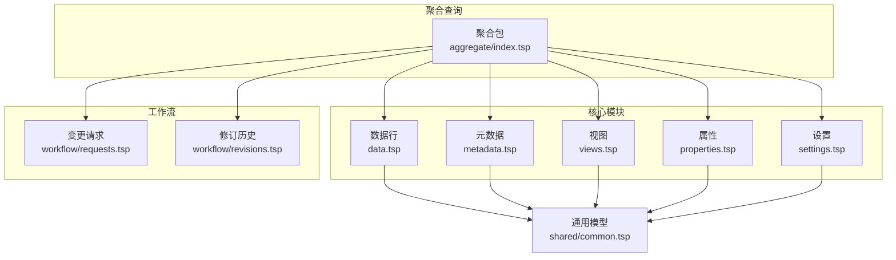
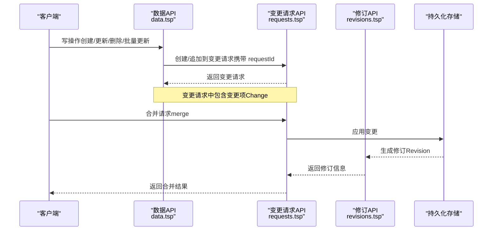
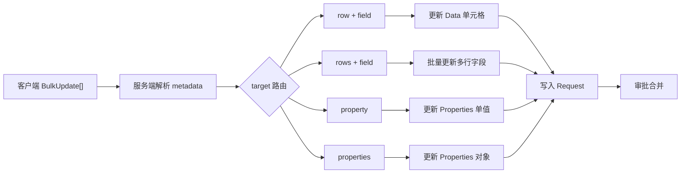
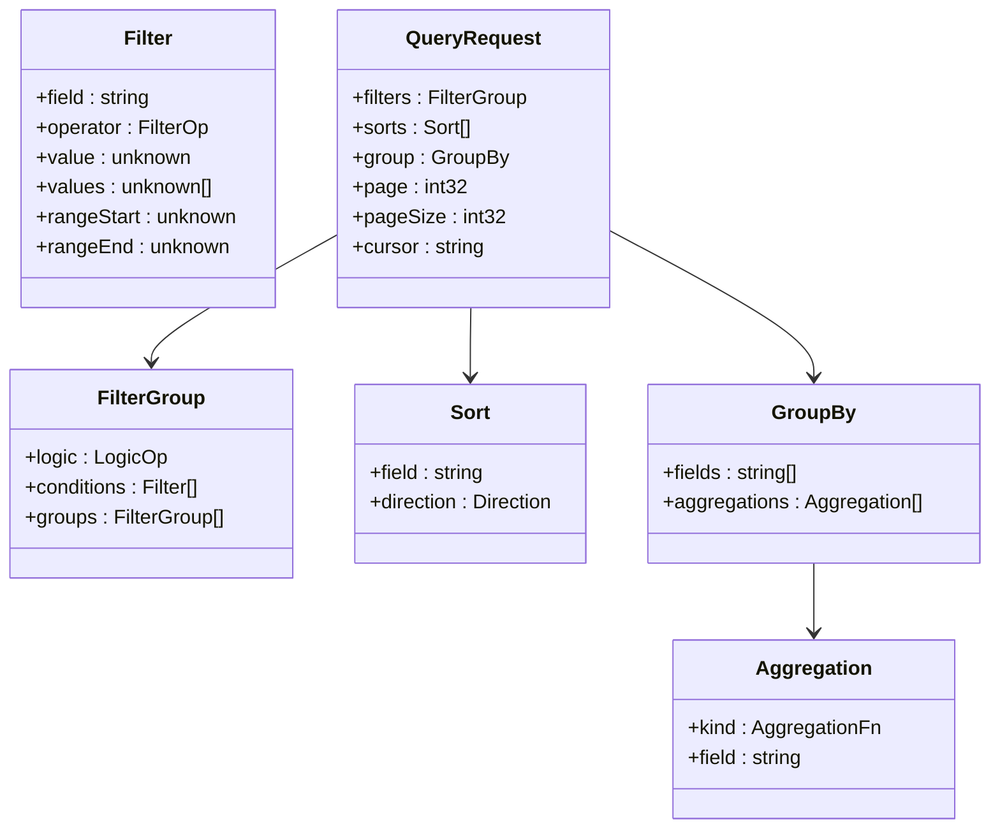
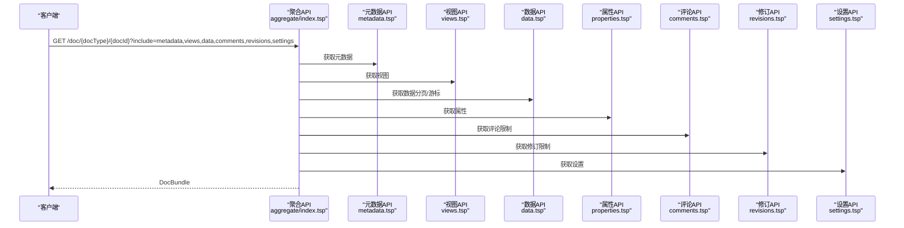
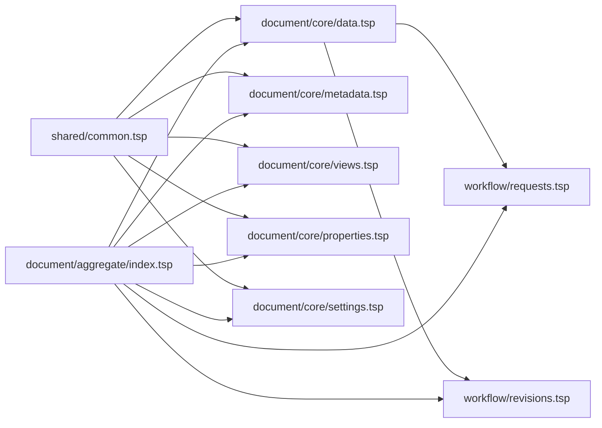

# 数据操作

<cite>
**本文引用的文件**
- [api/document/core/data.tsp](file://api/document/core/data.tsp)
- [api/document/core/metadata.tsp](file://api/document/core/metadata.tsp)
- [api/document/core/views.tsp](file://api/document/core/views.tsp)
- [api/document/core/properties.tsp](file://api/document/core/properties.tsp)
- [api/document/core/settings.tsp](file://api/document/core/settings.tsp)
- [api/document/aggregate/index.tsp](file://api/document/aggregate/index.tsp)
- [api/document/workflow/requests.tsp](file://api/document/workflow/requests.tsp)
- [api/document/workflow/revisions.tsp](file://api/document/workflow/revisions.tsp)
- [api/shared/common.tsp](file://api/shared/common.tsp)
- [docs-src/guides/data-operations.md](file://docs-src/guides/data-operations.md)
</cite>

## 目录
1. [简介](#简介)
2. [项目结构](#项目结构)
3. [核心组件](#核心组件)
4. [架构总览](#架构总览)
5. [详细组件分析](#详细组件分析)
6. [依赖分析](#依赖分析)
7. [性能考虑](#性能考虑)
8. [故障排查指南](#故障排查指南)
9. [结论](#结论)
10. [附录](#附录)

## 简介
本指南聚焦于 NexusBook 文档系统的数据操作能力，覆盖 CRUD（创建、读取、更新、删除）的完整流程，解释变更工作流（requestId）与直接应用（apply）的历史差异，并系统阐述聚合查询、高级查询（嵌套过滤、多字段排序、分组与聚合）与批量操作。文档还提供性能优化建议与最佳实践，帮助在高并发与大数据量场景下稳定高效地使用 API。

## 项目结构
围绕数据操作的关键模块分布如下：
- 核心数据：数据行、元数据、视图、属性、设置
- 聚合查询：一次性获取元数据、视图、数据、评论、修订、设置
- 工作流：变更请求与修订历史
- 通用模型：过滤、排序、分组、聚合、值类型等

图表来源
- [api/document/core/data.tsp](file://api/document/core/data.tsp#L326-L543)
- [api/document/core/metadata.tsp](file://api/document/core/metadata.tsp#L183-L211)
- [api/document/core/views.tsp](file://api/document/core/views.tsp#L86-L171)
- [api/document/core/properties.tsp](file://api/document/core/properties.tsp#L200-L434)
- [api/document/core/settings.tsp](file://api/document/core/settings.tsp#L86-L141)
- [api/document/aggregate/index.tsp](file://api/document/aggregate/index.tsp#L92-L127)
- [api/document/workflow/requests.tsp](file://api/document/workflow/requests.tsp#L202-L391)
- [api/document/workflow/revisions.tsp](file://api/document/workflow/revisions.tsp#L323-L547)
- [api/shared/common.tsp](file://api/shared/common.tsp#L205-L376)

章节来源
- [api/document/core/index.tsp](file://api/document/core/index.tsp#L1-L21)

## 核心组件
- 数据行（Row）：包含字段值集合与审计信息（创建/更新/版本），支持批量更新与结构化查询。
- 元数据（Metadata）：定义字段类型、选项、计算与校验规则，支撑值解析与校验。
- 视图（View）：多视图配置（表格/相册/看板/文档），支持过滤、排序、分组与列配置。
- 属性（DocumentProperties）：文档级元信息（如订单时间、金额、数量等），支持批量更新与修订历史。
- 设置（Settings）：文档/类型级配置（默认视图、分享、权限、保留策略）。
- 聚合包（DocBundle）：一次性返回属性、元数据、视图、数据、评论、修订、设置。
- 变更请求（Request）：变更工作流入口，所有写操作统一进入请求，合并后生成修订。
- 修订历史（Revision）：完整变更追踪与版本控制，支持对比、回滚与导出。

章节来源
- [api/document/core/data.tsp](file://api/document/core/data.tsp#L199-L543)
- [api/document/core/metadata.tsp](file://api/document/core/metadata.tsp#L146-L211)
- [api/document/core/views.tsp](file://api/document/core/views.tsp#L28-L171)
- [api/document/core/properties.tsp](file://api/document/core/properties.tsp#L94-L434)
- [api/document/core/settings.tsp](file://api/document/core/settings.tsp#L33-L141)
- [api/document/aggregate/index.tsp](file://api/document/aggregate/index.tsp#L48-L127)
- [api/document/workflow/requests.tsp](file://api/document/workflow/requests.tsp#L83-L391)
- [api/document/workflow/revisions.tsp](file://api/document/workflow/revisions.tsp#L158-L547)
- [api/shared/common.tsp](file://api/shared/common.tsp#L205-L376)

## 架构总览
数据操作遵循“变更工作流”：所有写操作（创建/更新/删除/批量更新）先写入变更请求，经多人协同与审批后合并，生成修订记录并生效。读取支持两类查询：简单 DSL（分页/排序/过滤/分组/游标）与结构化查询（嵌套过滤、排序、分组与聚合）。

图表来源
- [api/document/core/data.tsp](file://api/document/core/data.tsp#L362-L543)
- [api/document/workflow/requests.tsp](file://api/document/workflow/requests.tsp#L202-L391)
- [api/document/workflow/revisions.tsp](file://api/document/workflow/revisions.tsp#L323-L547)

## 详细组件分析

### CRUD 操作与变更工作流
- 创建数据行：通过 POST /data，携带 requestId，写入变更请求；结构化查询支持批量创建。
- 读取数据行：GET /data 支持简单 DSL 查询；GET /data/{rowId} 获取单行；POST /data/query 支持结构化查询。
- 更新数据行：PUT /data/{rowId}，携带 requestId 与版本号；PATCH 语义在文档中未出现，建议使用 PUT 或统一走变更请求。
- 删除数据行：DELETE /data/{rowId}，携带 requestId。
- 批量更新：POST /data/bulk，支持目标（单行/多行/属性/属性集合）与值（原始格式），统一进入变更请求。

变更工作流要点
- 所有写操作必须携带 requestId，多人可在同一请求中协同编辑。
- 合并请求后才真正生效，并生成修订记录。
- 版本号用于乐观锁并发控制，避免冲突。

章节来源
- [api/document/core/data.tsp](file://api/document/core/data.tsp#L326-L543)
- [docs-src/guides/data-operations.md](file://docs-src/guides/data-operations.md#L36-L155)

### apply=true 参数与变更请求工作流
- apply 参数已废弃：全部写操作统一通过 requestId 工作流进行，不再支持 apply=true 直接应用。
- 建议：在写接口中附带 ?requestId=...，或在请求体中包含 {"requestId":"..."}，便于协作与审计。

章节来源
- [docs-src/guides/data-operations.md](file://docs-src/guides/data-operations.md#L227-L233)

### 批量更新（BulkUpdate）与目标路由
- 目标（target）灵活路由：row/rows + field，property/properties。
- 值（value）保持原始格式，服务端根据 metadata 自动解析类型与校验。
- 支持混合更新（数据 + 属性）。

图表来源
- [api/document/core/data.tsp](file://api/document/core/data.tsp#L151-L190)
- [api/document/core/properties.tsp](file://api/document/core/properties.tsp#L200-L369)

章节来源
- [api/document/core/data.tsp](file://api/document/core/data.tsp#L482-L541)
- [api/document/core/properties.tsp](file://api/document/core/properties.tsp#L200-L369)
- [docs-src/guides/data-operations.md](file://docs-src/guides/data-operations.md#L156-L196)

### 结构化查询与高级能力
- 查询模型：FilterGroup（嵌套 AND/OR）、Sort（多字段排序）、GroupBy（分组 + 聚合）、Page（分页/游标）。
- 聚合函数：count、sum、avg、min、max。
- 支持在结构化查询中组合过滤、排序、分组与聚合，返回分页结果。

图表来源
- [api/shared/common.tsp](file://api/shared/common.tsp#L210-L376)
- [api/document/core/data.tsp](file://api/document/core/data.tsp#L264-L324)

章节来源
- [api/shared/common.tsp](file://api/shared/common.tsp#L210-L376)
- [api/document/core/data.tsp](file://api/document/core/data.tsp#L264-L324)
- [docs-src/guides/data-operations.md](file://docs-src/guides/data-operations.md#L294-L359)

### 聚合查询（一次性获取多种数据）
- 聚合包 DocBundle：一次性返回属性、元数据、视图、数据、评论、修订、设置。
- include 参数选择返回部分；支持视图分页与评论/修订数量限制。
- 适用于前端单次渲染场景，降低往返次数。

图表来源
- [api/document/aggregate/index.tsp](file://api/document/aggregate/index.tsp#L92-L127)
- [api/document/core/metadata.tsp](file://api/document/core/metadata.tsp#L183-L211)
- [api/document/core/views.tsp](file://api/document/core/views.tsp#L86-L171)
- [api/document/core/data.tsp](file://api/document/core/data.tsp#L326-L361)
- [api/document/core/properties.tsp](file://api/document/core/properties.tsp#L200-L217)
- [api/document/workflow/revisions.tsp](file://api/document/workflow/revisions.tsp#L323-L356)
- [api/document/core/settings.tsp](file://api/document/core/settings.tsp#L86-L113)

章节来源
- [api/document/aggregate/index.tsp](file://api/document/aggregate/index.tsp#L15-L127)

### 字段类型与值映射
- 值类型（Value）：text、long_text、number、currency、percent、boolean、date、datetime、single_select、multi_select、attachment、user、collaborator、relation、rating、duration 等。
- 值条目（ValueEntry）：fieldId + value。
- 元数据（Field）：定义字段类型、默认值、选项、只读/唯一/必填、公式/查找/汇总与校验规则。

章节来源
- [api/shared/common.tsp](file://api/shared/common.tsp#L544-L576)
- [api/document/core/metadata.tsp](file://api/document/core/metadata.tsp#L65-L110)

### 并发控制与版本冲突
- 版本号（version）用于乐观锁，更新时必须匹配当前版本。
- 冲突时返回错误，提示刷新后重试。

章节来源
- [api/document/core/data.tsp](file://api/document/core/data.tsp#L254-L262)
- [docs-src/guides/data-operations.md](file://docs-src/guides/data-operations.md#L234-L272)

## 依赖分析
- 数据 API 依赖通用模型（FilterGroup、Sort、GroupBy、AggregationFn、ValueEntry 等）。
- 聚合 API 依赖核心模块（元数据、视图、数据、属性、设置）与工作流（请求、修订）。
- 变更请求与修订历史贯穿写操作生命周期，提供审计与回滚能力。

图表来源
- [api/shared/common.tsp](file://api/shared/common.tsp#L205-L376)
- [api/document/core/data.tsp](file://api/document/core/data.tsp#L326-L543)
- [api/document/aggregate/index.tsp](file://api/document/aggregate/index.tsp#L92-L127)
- [api/document/workflow/requests.tsp](file://api/document/workflow/requests.tsp#L202-L391)
- [api/document/workflow/revisions.tsp](file://api/document/workflow/revisions.tsp#L323-L547)

章节来源
- [api/shared/common.tsp](file://api/shared/common.tsp#L205-L376)
- [api/document/core/data.tsp](file://api/document/core/data.tsp#L326-L543)
- [api/document/aggregate/index.tsp](file://api/document/aggregate/index.tsp#L92-L127)

## 性能考虑
- 优先使用批量操作：一次性提交多行变更，减少往返与请求开销。
- 合理设置分页大小：建议 20–100，兼顾吞吐与延迟。
- 只查询需要的字段：避免通配符查询，减少网络与解析成本。
- 使用服务端过滤：在结构化查询中使用 filters，减少客户端二次过滤。
- 深分页使用游标：在大数据量场景下使用 cursor，避免跳页导致的性能问题。
- 索引与查询优化：基于常用过滤字段建立索引，结合排序字段与分组字段进行复合索引规划（实现层面建议）。

章节来源
- [docs-src/guides/data-operations.md](file://docs-src/guides/data-operations.md#L273-L359)

## 故障排查指南
- 版本冲突：更新返回 VERSION_CONFLICT，提示刷新后重试。
- 缺少 requestId：写操作必须携带 requestId，否则无法进入变更请求。
- 字段类型不匹配：确保 value 符合字段类型定义，服务端会依据 metadata 自动解析。
- 请求冲突检测：可通过请求 API 检查合并请求与当前文档的冲突。

章节来源
- [docs-src/guides/data-operations.md](file://docs-src/guides/data-operations.md#L234-L272)
- [api/document/workflow/requests.tsp](file://api/document/workflow/requests.tsp#L377-L390)

## 结论
NexusBook 的数据操作以“变更工作流”为核心，确保变更可审计、可回滚、可协作。通过结构化查询与聚合包，既能满足复杂检索与多数据一次性拉取需求，又能在高并发与大数据量场景下保持稳定性能。建议在实践中统一使用 requestId 工作流、合理批量提交、利用服务端过滤与游标分页，并结合字段类型与元数据约束，构建健壮的数据层。

## 附录
- 实际示例路径（不展示代码内容，仅提供路径）：
  - [创建数据行示例](file://docs-src/guides/data-operations.md#L38-L57)
  - [批量创建示例](file://docs-src/guides/data-operations.md#L56-L67)
  - [结构化查询示例](file://docs-src/guides/data-operations.md#L85-L103)
  - [全量更新示例](file://docs-src/guides/data-operations.md#L106-L120)
  - [部分更新示例](file://docs-src/guides/data-operations.md#L122-L134)
  - [删除数据行示例](file://docs-src/guides/data-operations.md#L136-L144)
  - [批量删除示例](file://docs-src/guides/data-operations.md#L145-L154)
  - [批量更新（BulkUpdate）格式示例](file://docs-src/guides/data-operations.md#L178-L191)
  - [字段值类型映射参考](file://docs-src/guides/data-operations.md#L197-L212)
  - [并发控制与版本冲突示例](file://docs-src/guides/data-operations.md#L234-L272)
  - [性能优化建议（批量/分页/字段/过滤）](file://docs-src/guides/data-operations.md#L273-L359)