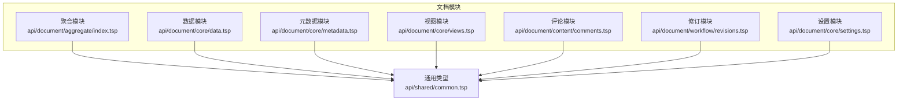
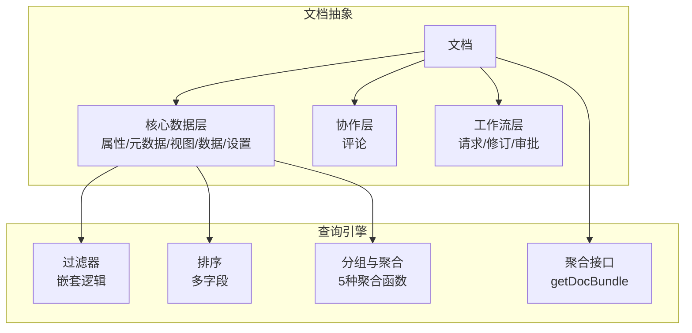
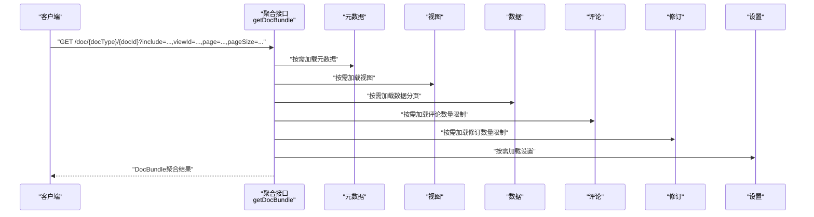
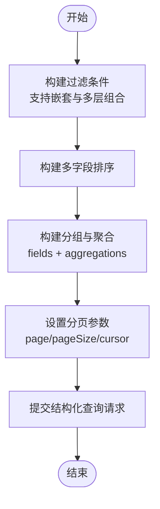
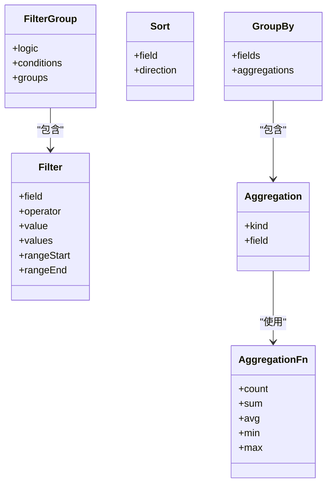
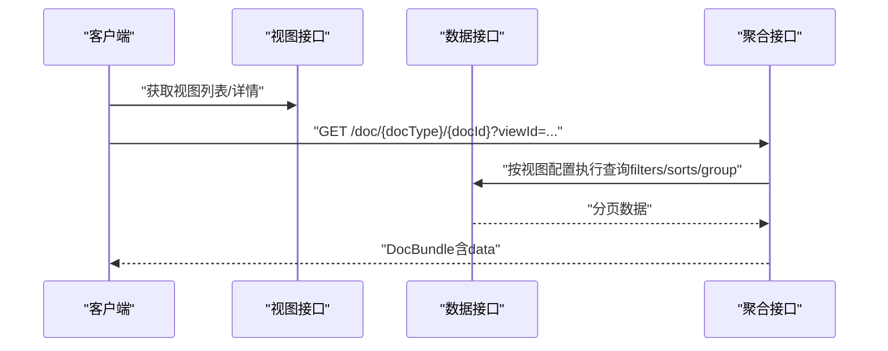
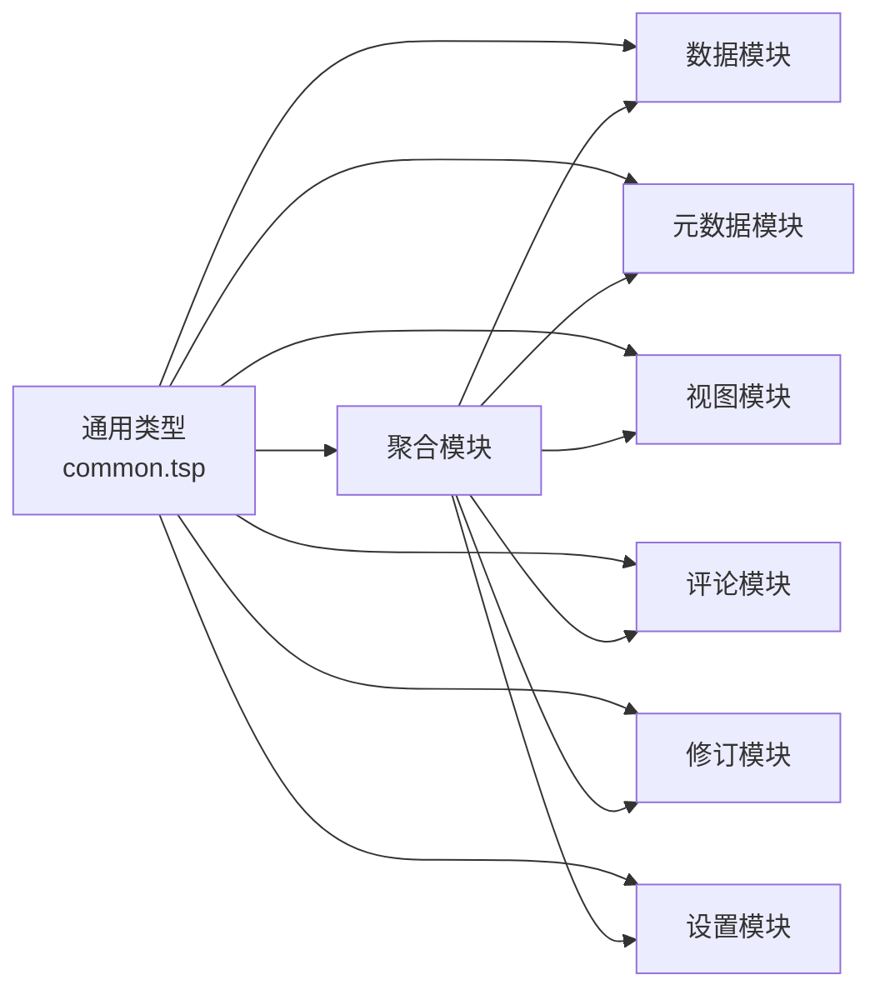

# 查询与聚合

<cite>
**本文引用的文件**
- [README.md](file://README.md)
- [api/document/aggregate/index.tsp](file://api/document/aggregate/index.tsp)
- [api/document/core/data.tsp](file://api/document/core/data.tsp)
- [api/shared/common.tsp](file://api/shared/common.tsp)
- [api/document/core/metadata.tsp](file://api/document/core/metadata.tsp)
- [api/document/core/views.tsp](file://api/document/core/views.tsp)
- [api/document/content/comments.tsp](file://api/document/content/comments.tsp)
- [api/document/workflow/revisions.tsp](file://api/document/workflow/revisions.tsp)
- [api/document/core/settings.tsp](file://api/document/core/settings.tsp)
- [docs-src/references/api-reference.md](file://docs-src/references/api-reference.md)
- [docs-src/guides/examples.md](file://docs-src/guides/examples.md)
</cite>

## 目录
1. [简介](#简介)
2. [项目结构](#项目结构)
3. [核心组件](#核心组件)
4. [架构概览](#架构概览)
5. [详细组件分析](#详细组件分析)
6. [依赖分析](#依赖分析)
7. [性能考虑](#性能考虑)
8. [故障排查指南](#故障排查指南)
9. [结论](#结论)
10. [附录](#附录)

## 简介
本章节聚焦“查询与聚合”能力，围绕以下目标展开：
- 解释结构化查询请求（QueryRequest）的组成：嵌套过滤条件、多字段排序、分组与聚合函数的使用。
- 详述聚合查询接口（getDocBundle）的功能：如何通过 include 参数选择返回的数据部分（metadata、views、data、comments、revisions、settings），以及分页与数量限制的应用。
- 说明视图切换功能：如何通过 viewId 参数指定特定视图进行数据查询。
- 提供实际 API 调用示例，展示复杂查询与聚合请求的构建方法。

## 项目结构
本项目的查询与聚合能力主要由 TypeSpec 定义的 API 模块构成，核心位于文档模块下，配合共享的通用类型与模型。

图表来源
- [api/document/aggregate/index.tsp](file://api/document/aggregate/index.tsp#L1-L127)
- [api/document/core/data.tsp](file://api/document/core/data.tsp#L1-L120)
- [api/shared/common.tsp](file://api/shared/common.tsp#L1-L120)

章节来源
- [README.md](file://README.md#L1-L120)
- [api/document/aggregate/index.tsp](file://api/document/aggregate/index.tsp#L1-L127)
- [api/document/core/data.tsp](file://api/document/core/data.tsp#L1-L120)
- [api/shared/common.tsp](file://api/shared/common.tsp#L1-L120)

## 核心组件
- 聚合查询接口（getDocBundle）
  - 作用：一次性获取文档所需的多种数据，支持按需加载与分页。
  - 关键参数：include、viewId、page、pageSize、commentsLimit、revisionsLimit。
  - 返回：DocBundle，包含 properties、metadata、views、data、comments、revisions、settings。
- 结构化查询请求（QueryRequest）
  - 作用：支持嵌套过滤、多字段排序、分组与聚合，用于复杂查询。
  - 关键字段：filters、sorts、group、page、pageSize、cursor。
- 通用查询模型（FilterGroup、Sort、GroupBy、AggregationFn）
  - 作用：统一的过滤、排序、分组与聚合模型，支撑数据查询与视图配置。

章节来源
- [api/document/aggregate/index.tsp](file://api/document/aggregate/index.tsp#L92-L127)
- [api/document/core/data.tsp](file://api/document/core/data.tsp#L313-L373)
- [api/shared/common.tsp](file://api/shared/common.tsp#L205-L331)

## 架构概览
查询与聚合在文档抽象之上，提供统一的过滤、排序、分组与聚合能力，并通过聚合接口将多源数据打包返回，便于前端一次性渲染。

图表来源
- [docs-src/guides/architecture.md](file://docs-src/guides/architecture.md#L7-L68)
- [api/document/aggregate/index.tsp](file://api/document/aggregate/index.tsp#L15-L32)
- [api/document/core/data.tsp](file://api/document/core/data.tsp#L375-L438)
- [api/shared/common.tsp](file://api/shared/common.tsp#L205-L331)

## 详细组件分析

### 组件A：聚合查询接口（getDocBundle）
- 功能要点
  - 一次性获取文档的 metadata、views、data、comments、revisions、settings。
  - 通过 include 参数选择返回的部分，避免不必要的网络往返。
  - 支持分页（page/pageSize）与数量限制（commentsLimit/revisionsLimit）。
  - 支持通过 viewId 指定特定视图进行数据查询。
- 关键模型
  - DocBundle：聚合返回体，包含 properties、metadata、views、data、comments、revisions、settings。
  - DocumentAggregateApi：定义 getDocBundle 端点与参数。
- 使用场景
  - 前端单次请求完成视图渲染所需的所有数据。
  - 控制评论与修订数量，避免大列表导致的性能问题。

图表来源
- [api/document/aggregate/index.tsp](file://api/document/aggregate/index.tsp#L92-L127)

章节来源
- [api/document/aggregate/index.tsp](file://api/document/aggregate/index.tsp#L92-L127)

### 组件B：结构化查询请求（QueryRequest）
- 组成
  - filters：嵌套过滤条件（支持 AND/OR 与多层嵌套）。
  - sorts：多字段排序。
  - group：分组与聚合（fields + aggregations）。
  - page/pageSize：分页。
  - cursor：深分页游标。
- 适用场景
  - 复杂筛选、排序、分组与聚合的统一入口。
  - 与视图配置联动，实现“视图即查询”的体验。

图表来源
- [api/document/core/data.tsp](file://api/document/core/data.tsp#L313-L373)
- [api/shared/common.tsp](file://api/shared/common.tsp#L205-L331)

章节来源
- [api/document/core/data.tsp](file://api/document/core/data.tsp#L313-L373)
- [api/shared/common.tsp](file://api/shared/common.tsp#L205-L331)

### 组件C：通用查询模型（FilterGroup、Sort、GroupBy、AggregationFn）
- FilterGroup
  - logic：AND/OR。
  - conditions：单个过滤条件集合。
  - groups：嵌套过滤组，支持复杂组合。
- Sort
  - field：字段名。
  - direction：asc/desc。
- GroupBy
  - fields：分组字段数组。
  - aggregations：聚合集合（kind + field）。
- AggregationFn
  - count、sum、avg、min、max。

图表来源
- [api/shared/common.tsp](file://api/shared/common.tsp#L205-L331)

章节来源
- [api/shared/common.tsp](file://api/shared/common.tsp#L205-L331)

### 组件D：视图切换与数据查询
- 视图模块（ViewsApi）
  - 支持创建、获取、更新、删除视图，并设置默认视图。
  - 视图定义中可包含 filters、sorts、group 等查询配置。
- 通过 viewId 参数
  - 在聚合接口中传入 viewId，即可按该视图的配置进行数据查询与渲染。
- 与结构化查询的关系
  - 视图配置可直接映射到 QueryRequest 的 filters/sorts/group，实现“视图即查询”。

图表来源
- [api/document/core/views.tsp](file://api/document/core/views.tsp#L1-L171)
- [api/document/core/data.tsp](file://api/document/core/data.tsp#L375-L438)
- [api/document/aggregate/index.tsp](file://api/document/aggregate/index.tsp#L92-L127)

章节来源
- [api/document/core/views.tsp](file://api/document/core/views.tsp#L1-L171)
- [api/document/core/data.tsp](file://api/document/core/data.tsp#L375-L438)
- [api/document/aggregate/index.tsp](file://api/document/aggregate/index.tsp#L92-L127)

### 组件E：评论与修订数量限制
- 评论（CommentsApi）
  - 支持按位置过滤（文档/字段/行/单元格）与分页。
- 修订（RevisionsApi）
  - 支持列表、详情、操作列表、差异对比、历史查询、回滚等。
- 在聚合接口中
  - 通过 commentsLimit 与 revisionsLimit 控制返回数量，避免大列表带来的性能与带宽压力。

章节来源
- [api/document/content/comments.tsp](file://api/document/content/comments.tsp#L246-L376)
- [api/document/workflow/revisions.tsp](file://api/document/workflow/revisions.tsp#L323-L388)
- [api/document/aggregate/index.tsp](file://api/document/aggregate/index.tsp#L92-L127)

## 依赖分析
- 聚合模块依赖
  - 元数据、视图、数据、评论、修订、设置等模块，通过 include 参数按需装配。
- 查询模型依赖
  - FilterGroup、Sort、GroupBy、AggregationFn 由共享模块提供，统一跨模块使用。
- 端到端依赖
  - getDocBundle → 各子模块读取 → 组装 DocBundle → 返回。

图表来源
- [api/shared/common.tsp](file://api/shared/common.tsp#L1-L120)
- [api/document/aggregate/index.tsp](file://api/document/aggregate/index.tsp#L1-L127)

章节来源
- [api/shared/common.tsp](file://api/shared/common.tsp#L1-L120)
- [api/document/aggregate/index.tsp](file://api/document/aggregate/index.tsp#L1-L127)

## 性能考虑
- 优先使用聚合接口（getDocBundle）一次性拉取所需数据，减少多次往返。
- 合理设置 include，避免不必要的 metadata、comments、revisions 返回。
- 使用 commentsLimit 与 revisionsLimit 控制评论与修订数量，降低响应体积。
- 使用 page/pageSize 与 cursor 实现分页与深分页，避免一次性传输大量数据。
- 在结构化查询中，尽量使用 filters/sorts/group 精准筛选，减少扫描范围。
- 通过 viewId 指定视图，使查询条件内聚，提升命中率与渲染效率。

## 故障排查指南
- 常见错误与定位
  - DOC_NOT_FOUND：确认 docType 与 docId 是否正确。
  - PAGE_OUT_OF_RANGE：检查 page/pageSize/cursor 是否合理。
  - VIEW_NOT_FOUND：确认 viewId 是否存在。
  - REQUEST_NOT_FOUND：确认 requestId 是否有效（若使用叠加读取）。
- 建议排查步骤
  - 先用最小 include（如 include=metadata,views,data）验证基本可用性。
  - 逐步增加 include，定位具体模块的问题。
  - 使用 commentsLimit 与 revisionsLimit 缩小范围，确认是否为数据量过大导致。
  - 若使用 requestId，确认请求状态与合并情况。

章节来源
- [api/shared/common.tsp](file://api/shared/common.tsp#L80-L151)

## 结论
- getDocBundle 提供了“按需加载 + 分页 + 数量限制 + 视图切换”的聚合查询能力，适合前端一次性渲染场景。
- QueryRequest 将过滤、排序、分组与聚合统一建模，便于复杂查询与视图配置的落地。
- 通过 include 与 viewId 的组合，可在保证性能的前提下，灵活控制返回数据与查询行为。
- 建议在实际使用中结合业务场景，合理设置分页与数量限制，优先采用聚合接口，减少网络往返与前端负担。

## 附录

### 实际 API 调用示例（路径与参数说明）
- 聚合查询（按需加载与分页）
  - 路径：GET /api/v1/doc/{doc-type}/{doc-id}
  - 关键参数：include（metadata,views,data,comments,revisions,settings）、viewId、page、pageSize、commentsLimit、revisionsLimit
  - 示例（cURL）：参见 [docs-src/references/api-reference.md](file://docs-src/references/api-reference.md#L60-L86)
- 结构化查询（复杂过滤/排序/分组/聚合）
  - 路径：POST /api/v1/doc/{doc-type}/{doc-id}/data/query
  - 请求体：QueryRequest（filters/sorts/group/page/pageSize/cursor）
  - 示例（cURL）：参见 [docs-src/references/api-reference.md](file://docs-src/references/api-reference.md#L227-L246)
- 视图切换
  - 路径：GET /api/v1/doc/{doc-type}/{doc-id}?viewId={view-id}
  - 示例（cURL）：参见 [docs-src/references/api-reference.md](file://docs-src/references/api-reference.md#L148-L171)
- 数据叠加读取（requestId）
  - 路径：GET/POST /api/v1/doc/{doc-type}/{doc-id}/data?requestId={request-id}
  - 示例（cURL）：参见 [docs-src/references/api-reference.md](file://docs-src/references/api-reference.md#L193-L214)

章节来源
- [docs-src/references/api-reference.md](file://docs-src/references/api-reference.md#L60-L86)
- [docs-src/references/api-reference.md](file://docs-src/references/api-reference.md#L148-L171)
- [docs-src/references/api-reference.md](file://docs-src/references/api-reference.md#L193-L214)
- [docs-src/references/api-reference.md](file://docs-src/references/api-reference.md#L227-L246)