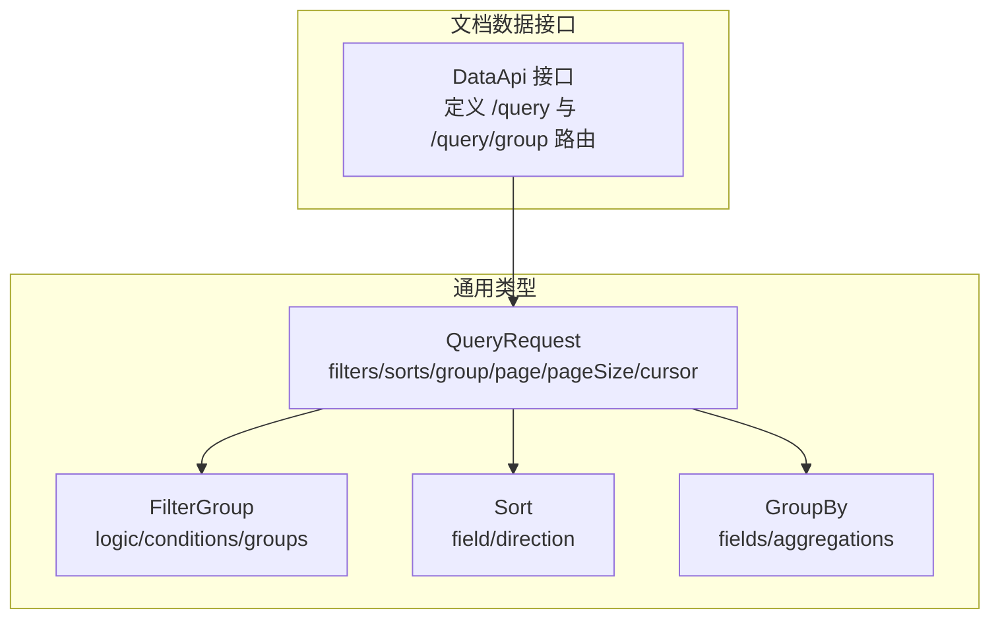
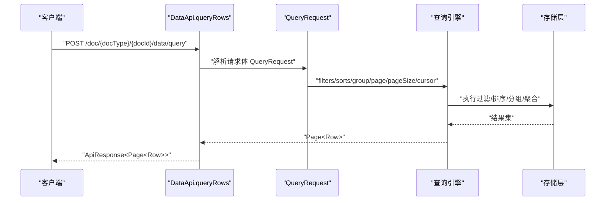
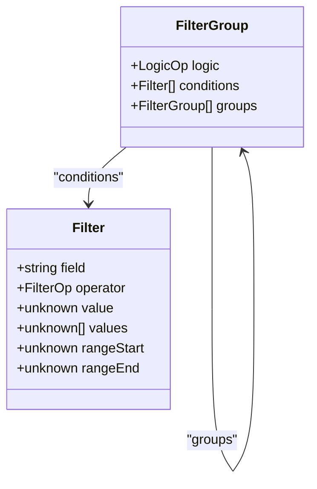
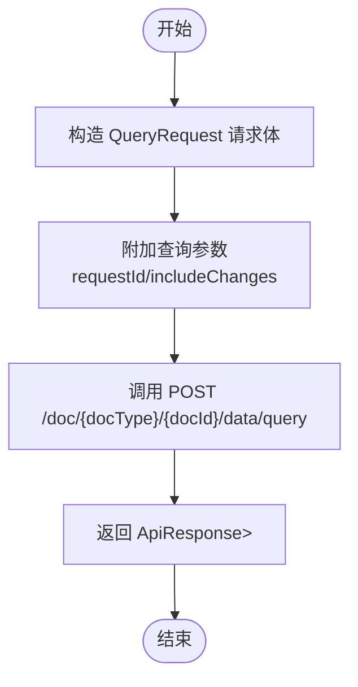
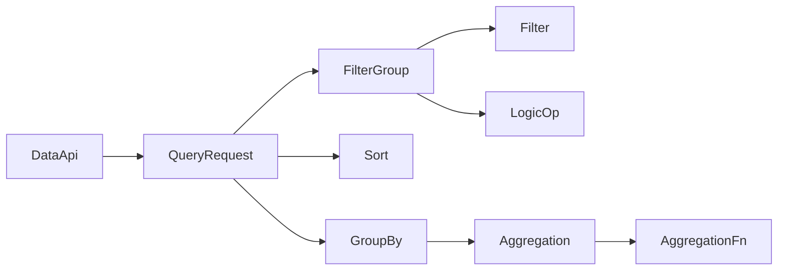

# 结构化查询

<cite>
**本文引用的文件**
- [api/document/core/data.tsp](file://api/document/core/data.tsp)
- [api/shared/common.tsp](file://api/shared/common.tsp)
- [docs-src/guides/data-operations.md](file://docs-src/guides/data-operations.md)
- [docs-src/references/api-reference.md](file://docs-src/references/api-reference.md)
</cite>

## 目录
1. [简介](#简介)
2. [项目结构](#项目结构)
3. [核心组件](#核心组件)
4. [架构概览](#架构概览)
5. [详细组件分析](#详细组件分析)
6. [依赖分析](#依赖分析)
7. [性能考虑](#性能考虑)
8. [故障排查指南](#故障排查指南)
9. [结论](#结论)
10. [附录](#附录)

## 简介
本章节面向希望使用结构化查询能力的开发者，系统性讲解 QueryRequest 模型的组成与使用方法，涵盖：
- 嵌套过滤条件 FilterGroup 的 AND/OR 组合与多层嵌套
- 多字段排序 Sort[] 的构建与执行顺序
- 分组与聚合 GroupBy 的多级分组与聚合函数
- queryRows 接口的实现要点与 POST 请求体传递复杂查询条件的方式
- 实际 API 调用示例，展示嵌套 AND/OR 逻辑、多级排序与分组聚合的构建
- 查询参数与 URL 查询字符串参数的差异与适用场景

## 项目结构
结构化查询能力由“文档数据接口”与“通用类型”共同定义：
- 文档数据接口：定义了结构化查询与分组查询的路由与方法
- 通用类型：定义了 QueryRequest、FilterGroup、Sort、GroupBy 等核心数据模型

图表来源
- [api/document/core/data.tsp](file://api/document/core/data.tsp#L375-L536)
- [api/shared/common.tsp](file://api/shared/common.tsp#L210-L357)

章节来源
- [api/document/core/data.tsp](file://api/document/core/data.tsp#L375-L536)
- [api/shared/common.tsp](file://api/shared/common.tsp#L210-L357)

## 核心组件
- QueryRequest：承载结构化查询的请求体，包含 filters、sorts、group、page、pageSize、cursor 等字段
- FilterGroup：支持 AND/OR 逻辑与多层嵌套的过滤条件组合
- Sort：多字段排序，每项包含 field 与 direction
- GroupBy：多级分组与聚合，fields 定义分组层级，aggregations 定义聚合函数

章节来源
- [api/document/core/data.tsp](file://api/document/core/data.tsp#L313-L373)
- [api/shared/common.tsp](file://api/shared/common.tsp#L210-L357)

## 架构概览
结构化查询在服务端的典型调用链如下：

图表来源
- [api/document/core/data.tsp](file://api/document/core/data.tsp#L432-L441)

章节来源
- [api/document/core/data.tsp](file://api/document/core/data.tsp#L432-L441)

## 详细组件分析

### QueryRequest 模型与字段语义
- filters：嵌套过滤条件，支持 AND/OR 逻辑与多层嵌套
- sorts：多字段排序数组，按数组顺序依次生效
- group：分组与聚合定义，fields 为分组层级，aggregations 为聚合函数集合
- page/pageSize：分页参数，默认页码与默认每页数量
- cursor：深分页游标，适用于大数据量场景

章节来源
- [api/document/core/data.tsp](file://api/document/core/data.tsp#L313-L373)

### FilterGroup：嵌套 AND/OR 逻辑与多层组合
- logic：AND 或 OR
- conditions：单个过滤条件数组
- groups：子 FilterGroup，支持无限层级嵌套
- 过滤条件 Filter：包含 field、operator、value/values/rangeStart/rangeEnd 等

图表来源
- [api/shared/common.tsp](file://api/shared/common.tsp#L234-L270)
- [api/shared/common.tsp](file://api/shared/common.tsp#L277-L295)

章节来源
- [api/shared/common.tsp](file://api/shared/common.tsp#L234-L295)

### Sort[]：多字段排序与执行顺序
- Sort：field 与 direction（asc/desc）
- 多个 Sort 按数组顺序依次生效，先按第一个字段排序，再按第二个字段排序（稳定排序）

章节来源
- [api/shared/common.tsp](file://api/shared/common.tsp#L220-L232)

### GroupBy：多级分组与聚合
- fields：分组字段数组，按顺序定义分组层级
- aggregations：聚合函数数组，支持 count、sum、avg、min、max
- 聚合命名规则：{function}_{field}，例如 "sum_amount"、"avg_price"

章节来源
- [api/shared/common.tsp](file://api/shared/common.tsp#L297-L317)
- [api/shared/common.tsp](file://api/shared/common.tsp#L334-L357)

### queryRows 接口：POST 请求体与参数传递
- 路由：POST /doc/{docType}/{docId}/data/query
- 请求体：QueryRequest（filters/sorts/group/page/pageSize/cursor）
- 查询参数：
  - requestId：用于获取“生产数据 + Request 叠加视图”
  - includeChanges：是否包含变更标记（与 requestId 搭配使用）

图表来源
- [api/document/core/data.tsp](file://api/document/core/data.tsp#L432-L441)

章节来源
- [api/document/core/data.tsp](file://api/document/core/data.tsp#L432-L441)

### 分组查询接口：queryGroupedRows
- 路由：POST /doc/{docType}/{docId}/data/query/group
- 请求体：QueryRequest（需包含 group 字段）
- 查询参数：
  - requestId：叠加视图
  - includeChanges：包含变更标记
  - includeRows：是否返回每组内的数据行（可选）

章节来源
- [api/document/core/data.tsp](file://api/document/core/data.tsp#L526-L536)

## 依赖分析
- DataApi 依赖 QueryRequest
- QueryRequest 依赖 FilterGroup、Sort、GroupBy
- FilterGroup 依赖 Filter 与 LogicOp
- GroupBy 依赖 Aggregation 与 AggregationFn

图表来源
- [api/document/core/data.tsp](file://api/document/core/data.tsp#L313-L373)
- [api/shared/common.tsp](file://api/shared/common.tsp#L210-L357)

章节来源
- [api/document/core/data.tsp](file://api/document/core/data.tsp#L313-L373)
- [api/shared/common.tsp](file://api/shared/common.tsp#L210-L357)

## 性能考虑
- 使用 filters 在服务端尽早缩小数据集，避免客户端二次过滤
- 合理设置 page/pageSize，避免过大响应体
- 使用 cursor 进行深分页，提升大数据量下的翻页性能
- 多字段排序时，尽量减少排序字段数量，优先选择索引友好的字段
- 分组聚合时，仅对必要字段进行聚合，避免不必要的计算

## 故障排查指南
- 错误码参考：可在 API 参考中查阅统一错误码定义与说明
- 字段类型参考：确保过滤与聚合字段类型正确，避免类型不匹配导致的查询失败
- 常见问题：在数据操作指南中有针对复杂查询、游标分页、批量导出等常见问题的说明与示例

章节来源
- [docs-src/references/api-reference.md](file://docs-src/references/api-reference.md#L600-L665)
- [docs-src/guides/data-operations.md](file://docs-src/guides/data-operations.md#L338-L381)

## 结论
结构化查询通过 QueryRequest 将过滤、排序、分组与分页整合在一个请求体中，配合嵌套 FilterGroup、多字段 Sort 与 GroupBy，能够高效表达复杂的业务查询需求。结合分组查询接口与查询参数（requestId/includeChanges），可满足从明细查询到聚合分析的多样化场景。

## 附录

### API 调用示例（路径引用）
- 结构化查询（POST 请求体）示例路径：
  - [示例：结构化查询请求体](file://docs-src/guides/data-operations.md#L85-L103)
- 嵌套 AND/OR 逻辑示例路径：
  - [示例：嵌套过滤条件](file://docs-src/guides/data-operations.md#L359-L381)
- 多字段排序示例路径：
  - [示例：排序字段](file://docs-src/guides/data-operations.md#L85-L103)
- 分组与聚合示例路径：
  - [示例：分组查询接口说明](file://api/document/core/data.tsp#L443-L536)

### 查询参数与 URL 查询字符串参数的差异与适用场景
- URL 查询参数（listRows）：
  - 适合简单查询，参数包括 page、pageSize、sort、filter、group、cursor 等
  - 适用于轻量查询与快速调试
- 结构化查询（queryRows）：
  - 通过请求体传递复杂 QueryRequest，适合嵌套过滤、多字段排序、分组聚合等复杂场景
  - 与 requestId/includeChanges 搭配，支持“生产数据 + Request 叠加视图”的预览与变更标记

章节来源
- [api/document/core/data.tsp](file://api/document/core/data.tsp#L404-L418)
- [api/document/core/data.tsp](file://api/document/core/data.tsp#L432-L441)