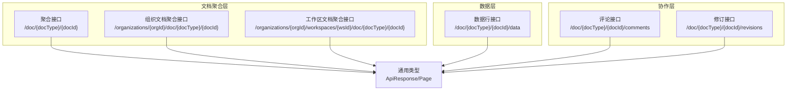
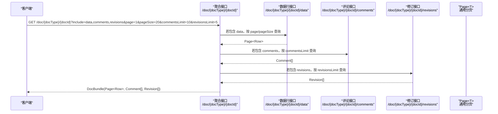
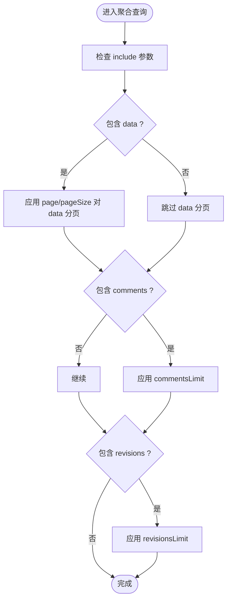
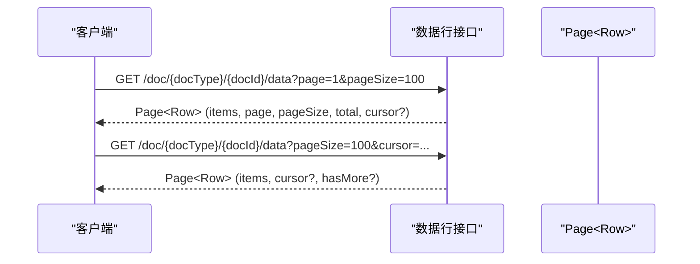
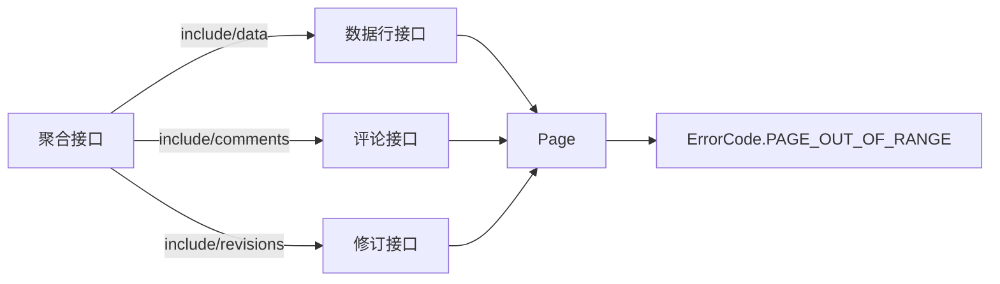

# 分页控制

<cite>
**本文引用的文件**
- [api/document/aggregate/index.tsp](file://api/document/aggregate/index.tsp)
- [api/document/tenant-document.tsp](file://api/document/tenant-document.tsp)
- [api/document/core/data.tsp](file://api/document/core/data.tsp)
- [api/document/content/comments.tsp](file://api/document/content/comments.tsp)
- [api/document/workflow/revisions.tsp](file://api/document/workflow/revisions.tsp)
- [api/shared/common.tsp](file://api/shared/common.tsp)
- [docs-src/guides/best-practices.md](file://docs-src/guides/best-practices.md)
- [docs-src/guides/data-operations.md](file://docs-src/guides/data-operations.md)
</cite>

## 目录
1. [简介](#简介)
2. [项目结构](#项目结构)
3. [核心组件](#核心组件)
4. [架构概览](#架构概览)
5. [详细组件分析](#详细组件分析)
6. [依赖分析](#依赖分析)
7. [性能考虑](#性能考虑)
8. [故障排查指南](#故障排查指南)
9. [结论](#结论)
10. [附录](#附录)

## 简介
本章节聚焦“分页控制”能力，系统性说明在聚合查询中如何通过 page、pageSize 控制数据行分页，以及通过 commentsLimit、revisionsLimit 参数限制评论与修订记录的数量。文档将详细阐述：
- 分页参数的作用范围与相互影响
- 当请求包含 data 时分页参数的应用方式
- 实际 API 调用示例与不同分页配置下的响应形态
- 默认值、最大值限制与边界情况处理
- 与游标分页配合使用以处理大数据集

## 项目结构
围绕分页控制的关键文件与职责如下：
- 聚合查询接口：提供 include 选择与分页控制，支持 commentsLimit、revisionsLimit
- 数据行接口：提供 page、pageSize、cursor 等分页参数
- 评论接口：提供 page、pageSize 分页
- 修订接口：提供 page、pageSize 分页
- 通用类型：统一的分页结构 Page 与错误码定义

图表来源
- [api/document/aggregate/index.tsp](file://api/document/aggregate/index.tsp#L92-L127)
- [api/document/tenant-document.tsp](file://api/document/tenant-document.tsp#L131-L191)
- [api/document/tenant-document.tsp](file://api/document/tenant-document.tsp#L280-L345)
- [api/document/core/data.tsp](file://api/document/core/data.tsp#L404-L417)
- [api/document/content/comments.tsp](file://api/document/content/comments.tsp#L271-L282)
- [api/document/workflow/revisions.tsp](file://api/document/workflow/revisions.tsp#L346-L355)
- [api/shared/common.tsp](file://api/shared/common.tsp#L153-L203)

章节来源
- [api/document/aggregate/index.tsp](file://api/document/aggregate/index.tsp#L92-L127)
- [api/document/tenant-document.tsp](file://api/document/tenant-document.tsp#L131-L191)
- [api/document/tenant-document.tsp](file://api/document/tenant-document.tsp#L280-L345)
- [api/document/core/data.tsp](file://api/document/core/data.tsp#L404-L417)
- [api/document/content/comments.tsp](file://api/document/content/comments.tsp#L271-L282)
- [api/document/workflow/revisions.tsp](file://api/document/workflow/revisions.tsp#L346-L355)
- [api/shared/common.tsp](file://api/shared/common.tsp#L153-L203)

## 核心组件
- 聚合查询接口
  - 支持 include 选择返回部分（metadata、views、data、comments、revisions、settings）
  - 支持 page/pageSize 对 data 进行分页
  - 支持 commentsLimit/revisionsLimit 限制评论与修订数量
- 数据行接口
  - 支持 page/pageSize 简单分页
  - 支持 cursor 深分页
  - 支持 requestId 与 includeChanges 参数（用于预览变更叠加视图）
- 评论接口
  - 支持 page/pageSize 分页
- 修订接口
  - 支持 page/pageSize 分页
- 通用类型
  - ApiResponse<T> 统一响应结构
  - Page<T> 统一分页结构（items、page、pageSize、total）

章节来源
- [api/document/aggregate/index.tsp](file://api/document/aggregate/index.tsp#L92-L127)
- [api/document/core/data.tsp](file://api/document/core/data.tsp#L404-L417)
- [api/document/content/comments.tsp](file://api/document/content/comments.tsp#L271-L282)
- [api/document/workflow/revisions.tsp](file://api/document/workflow/revisions.tsp#L346-L355)
- [api/shared/common.tsp](file://api/shared/common.tsp#L153-L203)

## 架构概览
下图展示了聚合查询中分页参数与数据行、评论、修订的关系：

图表来源
- [api/document/aggregate/index.tsp](file://api/document/aggregate/index.tsp#L92-L127)
- [api/document/core/data.tsp](file://api/document/core/data.tsp#L404-L417)
- [api/document/content/comments.tsp](file://api/document/content/comments.tsp#L271-L282)
- [api/document/workflow/revisions.tsp](file://api/document/workflow/revisions.tsp#L346-L355)
- [api/shared/common.tsp](file://api/shared/common.tsp#L153-L203)

## 详细组件分析

### 聚合查询中的分页控制
- 参数说明
  - page、pageSize：仅对 data 生效，控制数据行分页
  - commentsLimit：限制返回的评论数量
  - revisionsLimit：限制返回的修订数量
- 作用范围与相互影响
  - include=data 时，page/pageSize 控制 data 的分页；commentsLimit/revisionsLimit 不影响 data 的分页
  - include=comments 时，commentsLimit 控制评论列表数量；若同时 include=revisions，revisionsLimit 控制修订数量
  - include=revisions 时，revisionsLimit 控制修订列表数量；若同时 include=comments，commentsLimit 控制评论数量
- 请求包含 data 时的分页应用
  - 仅当 include 中包含 data 时，page/pageSize 才会应用于数据行查询
  - commentsLimit/revisionsLimit 仅影响对应集合的数量上限，不影响 data 的分页
- 默认值与最大值
  - page 默认值：1
  - pageSize 默认值：20
  - pageSize 最大值：200（在数据行接口中定义）
- 边界情况
  - 当 page 超出范围时，可能返回 PAGE_OUT_OF_RANGE 错误码
  - 当 pageSize 超过最大值时，服务端可能拒绝请求或截断为最大值
  - 当 commentsLimit/revisionsLimit 为负数或过大时，服务端可能按最大允许值处理

图表来源
- [api/document/aggregate/index.tsp](file://api/document/aggregate/index.tsp#L92-L127)
- [api/document/core/data.tsp](file://api/document/core/data.tsp#L347-L373)
- [api/shared/common.tsp](file://api/shared/common.tsp#L80-L151)

章节来源
- [api/document/aggregate/index.tsp](file://api/document/aggregate/index.tsp#L92-L127)
- [api/document/tenant-document.tsp](file://api/document/tenant-document.tsp#L131-L191)
- [api/document/tenant-document.tsp](file://api/document/tenant-document.tsp#L280-L345)
- [api/document/core/data.tsp](file://api/document/core/data.tsp#L347-L373)
- [api/shared/common.tsp](file://api/shared/common.tsp#L80-L151)

### 数据行接口的分页与游标
- 参数
  - page/pageSize：简单分页
  - cursor：深分页游标
  - requestId/includeChanges：预览变更叠加视图（非分页参数，但会影响返回数据）
- 默认值与最大值
  - page 默认值：1
  - pageSize 默认值：20
  - pageSize 最大值：200
- 游标分页
  - 首次请求：提供 pageSize
  - 响应包含 cursor 与 hasMore（若有）
  - 下一页：携带 cursor 继续请求
- 与聚合查询的关系
  - 聚合查询中的 page/pageSize 仅对 data 生效
  - 若需深分页，建议在数据行接口使用 cursor

图表来源
- [api/document/core/data.tsp](file://api/document/core/data.tsp#L404-L417)
- [api/document/core/data.tsp](file://api/document/core/data.tsp#L319-L373)
- [docs-src/guides/best-practices.md](file://docs-src/guides/best-practices.md#L213-L234)

章节来源
- [api/document/core/data.tsp](file://api/document/core/data.tsp#L404-L417)
- [api/document/core/data.tsp](file://api/document/core/data.tsp#L319-L373)
- [docs-src/guides/best-practices.md](file://docs-src/guides/best-practices.md#L213-L234)
- [docs-src/guides/data-operations.md](file://docs-src/guides/data-operations.md#L294-L359)

### 评论与修订的分页
- 评论接口
  - 支持 page/pageSize 分页
  - 适合对评论列表进行分页浏览
- 修订接口
  - 支持 page/pageSize 分页
  - 支持按贡献者、搜索等过滤
  - 适合查看修订历史与变更操作列表

章节来源
- [api/document/content/comments.tsp](file://api/document/content/comments.tsp#L271-L282)
- [api/document/workflow/revisions.tsp](file://api/document/workflow/revisions.tsp#L346-L355)

### API 调用示例与响应形态
- 聚合查询示例
  - 获取包含 data 的文档包，并对 data 分页
    - GET /doc/{docType}/{docId}?include=data&page=1&pageSize=20
  - 获取包含 comments/revisions 的文档包，并限制数量
    - GET /doc/{docType}/{docId}?include=comments,revisions&commentsLimit=10&revisionsLimit=5
- 数据行接口示例
  - 简单分页
    - GET /doc/{docType}/{docId}/data?page=1&pageSize=50
  - 游标分页（深分页）
    - GET /doc/{docType}/{docId}/data?pageSize=100
    - GET /doc/{docType}/{docId}/data?pageSize=100&cursor=...
- 评论接口示例
  - GET /doc/{docType}/{docId}/comments?page=1&pageSize=20
- 修订接口示例
  - GET /doc/{docType}/{docId}/revisions?page=1&pageSize=20

章节来源
- [api/document/aggregate/index.tsp](file://api/document/aggregate/index.tsp#L28-L32)
- [api/document/aggregate/index.tsp](file://api/document/aggregate/index.tsp#L114-L126)
- [api/document/core/data.tsp](file://api/document/core/data.tsp#L404-L417)
- [api/document/content/comments.tsp](file://api/document/content/comments.tsp#L271-L282)
- [api/document/workflow/revisions.tsp](file://api/document/workflow/revisions.tsp#L346-L355)

## 依赖分析
- 聚合查询接口依赖
  - include 参数决定返回哪些部分
  - commentsLimit/revisionsLimit 仅影响对应集合数量
  - page/pageSize 仅对 data 生效
- 数据行接口依赖
  - page/pageSize 与 cursor 共同提供分页能力
  - requestId/includeChanges 影响数据视图，但不改变分页语义
- 通用类型依赖
  - Page<T> 统一承载分页字段
  - ErrorCode 中的 PAGE_OUT_OF_RANGE 用于分页越界场景

图表来源
- [api/document/aggregate/index.tsp](file://api/document/aggregate/index.tsp#L92-L127)
- [api/document/core/data.tsp](file://api/document/core/data.tsp#L404-L417)
- [api/document/content/comments.tsp](file://api/document/content/comments.tsp#L271-L282)
- [api/document/workflow/revisions.tsp](file://api/document/workflow/revisions.tsp#L346-L355)
- [api/shared/common.tsp](file://api/shared/common.tsp#L153-L203)
- [api/shared/common.tsp](file://api/shared/common.tsp#L80-L151)

章节来源
- [api/document/aggregate/index.tsp](file://api/document/aggregate/index.tsp#L92-L127)
- [api/document/core/data.tsp](file://api/document/core/data.tsp#L404-L417)
- [api/document/content/comments.tsp](file://api/document/content/comments.tsp#L271-L282)
- [api/document/workflow/revisions.tsp](file://api/document/workflow/revisions.tsp#L346-L355)
- [api/shared/common.tsp](file://api/shared/common.tsp#L153-L203)
- [api/shared/common.tsp](file://api/shared/common.tsp#L80-L151)

## 性能考虑
- 合理设置 pageSize
  - 太小：请求次数增多，增加网络开销
  - 太大：响应体积增大，延迟上升
  - 推荐范围：20–100（依据指南）
- 使用游标分页处理大数据集
  - 首次请求提供 pageSize
  - 依据响应中的 cursor 与 hasMore 进行后续请求
- 按需加载
  - 仅 include 必要部分，避免不必要的 comments/revisions 数据传输
- 过滤与排序
  - 在服务端进行过滤与排序，减少传输量

章节来源
- [docs-src/guides/best-practices.md](file://docs-src/guides/best-practices.md#L213-L234)
- [docs-src/guides/data-operations.md](file://docs-src/guides/data-operations.md#L294-L359)

## 故障排查指南
- PAGE_OUT_OF_RANGE
  - 现象：请求的 page 超出有效范围
  - 处理：调整 page 至合理范围或检查 total 与 pageSize
- 分页参数未生效
  - 检查 include 是否包含 data，否则 page/pageSize 不会应用于 data
  - 检查 commentsLimit/revisionsLimit 是否与 include 冲突
- 响应中缺少 cursor
  - 仅在需要深分页且服务端支持时返回
  - 确认使用数据行接口的 cursor 参数
- 响应过大或超时
  - 减小 pageSize 或改为游标分页
  - 仅 include 必要部分

章节来源
- [api/shared/common.tsp](file://api/shared/common.tsp#L80-L151)
- [api/document/core/data.tsp](file://api/document/core/data.tsp#L347-L373)
- [docs-src/guides/best-practices.md](file://docs-src/guides/best-practices.md#L213-L234)

## 结论
- 聚合查询中的分页参数仅对 data 生效，commentsLimit/revisionsLimit 仅限制对应集合数量
- 数据行接口提供 page/pageSize 与 cursor 双重分页能力，适合不同规模的数据场景
- 建议优先使用游标分页处理大规模数据，结合合理的 pageSize 与按需加载策略提升性能与稳定性

## 附录
- 关键参数汇总
  - page：默认 1
  - pageSize：默认 20，最大 200（数据行接口）
  - commentsLimit：限制评论数量
  - revisionsLimit：限制修订数量
  - cursor：深分页游标（数据行接口）

章节来源
- [api/document/core/data.tsp](file://api/document/core/data.tsp#L347-L373)
- [api/document/aggregate/index.tsp](file://api/document/aggregate/index.tsp#L114-L126)
- [api/document/tenant-document.tsp](file://api/document/tenant-document.tsp#L131-L191)
- [api/document/tenant-document.tsp](file://api/document/tenant-document.tsp#L280-L345)