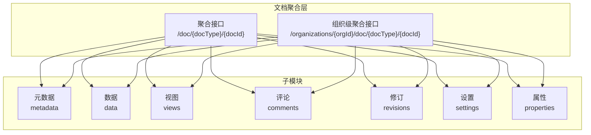
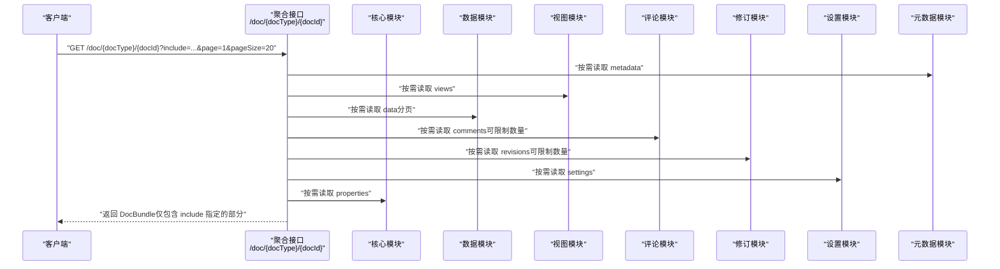
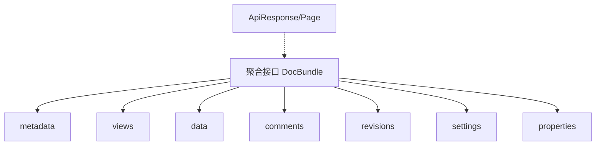

# 按需加载

<cite>
**本文引用的文件**
- [api/document/aggregate/index.tsp](file://api/document/aggregate/index.tsp)
- [api/document/tenant-document.tsp](file://api/document/tenant-document.tsp)
- [api/document/core/metadata.tsp](file://api/document/core/metadata.tsp)
- [api/document/core/data.tsp](file://api/document/core/data.tsp)
- [api/document/content/comments.tsp](file://api/document/content/comments.tsp)
- [api/document/workflow/revisions.tsp](file://api/document/workflow/revisions.tsp)
- [api/document/core/views.tsp](file://api/document/core/views.tsp)
- [api/document/core/settings.tsp](file://api/document/core/settings.tsp)
- [api/shared/common.tsp](file://api/shared/common.tsp)
- [docs-src/guides/document-model.md](file://docs-src/guides/document-model.md)
</cite>

## 目录
1. [简介](#简介)
2. [项目结构](#项目结构)
3. [核心组件](#核心组件)
4. [架构总览](#架构总览)
5. [详细组件分析](#详细组件分析)
6. [依赖分析](#依赖分析)
7. [性能考虑](#性能考虑)
8. [故障排查指南](#故障排查指南)
9. [结论](#结论)
10. [附录](#附录)

## 简介
本文围绕“按需加载”能力展开，聚焦于通过 include 参数在聚合查询接口中选择性返回文档的不同组成部分，从而显著降低网络传输与前端渲染成本。include 支持的选项包括：metadata、views、data、comments、revisions、settings、properties。我们将逐一说明每个 include 选项对应的数据结构与返回内容，并给出组合使用策略、默认行为与边界情况处理，辅以实际 API 调用示例路径，帮助读者在真实场景中高效利用该能力。

## 项目结构
按需加载能力主要由“文档聚合模块”提供，它将文档的多个层次（属性、元数据、视图、数据、评论、修订、设置）整合在一个请求中，通过 include 参数进行选择性返回。核心文件如下：
- 聚合接口与 DocBundle 模型：api/document/aggregate/index.tsp
- 组织级文档聚合接口（支持 include）：api/document/tenant-document.tsp
- 各子模块接口（用于理解返回内容结构）：
  - 元数据：api/document/core/metadata.tsp
  - 数据：api/document/core/data.tsp
  - 视图：api/document/core/views.tsp
  - 评论：api/document/content/comments.tsp
  - 修订：api/document/workflow/revisions.tsp
  - 设置：api/document/core/settings.tsp
- 通用响应与分页模型：api/shared/common.tsp
- 文档模型与聚合示例文档：docs-src/guides/document-model.md

图表来源
- [api/document/aggregate/index.tsp](file://api/document/aggregate/index.tsp#L92-L126)
- [api/document/tenant-document.tsp](file://api/document/tenant-document.tsp#L105-L191)

章节来源
- [api/document/aggregate/index.tsp](file://api/document/aggregate/index.tsp#L1-L127)
- [api/document/tenant-document.tsp](file://api/document/tenant-document.tsp#L105-L191)

## 核心组件
- 聚合接口（include 参数）：提供一次性获取多个部分的能力，支持分页与数量限制。
- DocBundle：聚合返回载体，包含 properties、metadata、views、data、comments、revisions、settings 等字段。
- include 选项：逗号分隔的字符串，如 "metadata,views,data"，用于选择返回哪些部分。
- 组织级聚合接口：支持 include、viewId、page、pageSize、commentsLimit、revisionsLimit 等参数。

章节来源
- [api/document/aggregate/index.tsp](file://api/document/aggregate/index.tsp#L48-L91)
- [api/document/aggregate/index.tsp](file://api/document/aggregate/index.tsp#L92-L126)
- [api/document/tenant-document.tsp](file://api/document/tenant-document.tsp#L105-L191)

## 架构总览
下图展示了聚合查询的典型调用序列，从客户端发起请求到服务端按 include 选择性组装 DocBundle 并返回。

图表来源
- [api/document/aggregate/index.tsp](file://api/document/aggregate/index.tsp#L92-L126)
- [api/document/core/data.tsp](file://api/document/core/data.tsp#L375-L417)
- [api/document/content/comments.tsp](file://api/document/content/comments.tsp#L246-L376)
- [api/document/workflow/revisions.tsp](file://api/document/workflow/revisions.tsp#L323-L373)
- [api/document/core/settings.tsp](file://api/document/core/settings.tsp#L86-L113)
- [api/document/core/metadata.tsp](file://api/document/core/metadata.tsp#L183-L211)
- [api/document/core/views.tsp](file://api/document/core/views.tsp#L86-L171)

## 详细组件分析

### include 参数与 DocBundle 结构
- DocBundle 字段
  - properties：文档属性（如订单时间、门店、金额、数量等）
  - metadata：字段定义与显示配置
  - views：视图列表
  - data：分页后的数据行集合
  - comments：评论集合
  - revisions：修订记录
  - settings：文档设置
- include 选项
  - 支持值：properties、metadata、views、data、comments、revisions、settings
  - 组合使用：以逗号分隔，如 "metadata,views,data" 或 "comments,revisions"
- 组织级接口额外参数
  - viewId：指定视图ID
  - page、pageSize：数据分页
  - commentsLimit、revisionsLimit：评论与修订数量限制

章节来源
- [api/document/aggregate/index.tsp](file://api/document/aggregate/index.tsp#L48-L91)
- [api/document/aggregate/index.tsp](file://api/document/aggregate/index.tsp#L92-L126)
- [api/document/tenant-document.tsp](file://api/document/tenant-document.tsp#L105-L191)

### 每个 include 选项的数据结构与返回内容
- include=metadata
  - 返回：metadata 字段
  - 结构要点：字段定义数组、文档属性字段定义等
  - 适用场景：渲染界面、校验字段、动态表单
  章节来源
  - [api/document/core/metadata.tsp](file://api/document/core/metadata.tsp#L160-L181)
  - [api/document/core/metadata.tsp](file://api/document/core/metadata.tsp#L183-L211)

- include=views
  - 返回：views 数组
  - 结构要点：视图ID、名称、类型、显示字段、过滤、排序、分组、列配置等
  - 适用场景：页面初始化时加载视图配置，避免二次请求
  章节来源
  - [api/document/core/views.tsp](file://api/document/core/views.tsp#L28-L84)
  - [api/document/core/views.tsp](file://api/document/core/views.tsp#L86-L171)

- include=data
  - 返回：data（分页对象，包含 items、page、pageSize、total）
  - 结构要点：行ID、字段值集合、审计信息、版本号
  - 适用场景：表格/看板等视图的数据展示
  章节来源
  - [api/document/core/data.tsp](file://api/document/core/data.tsp#L241-L311)
  - [api/shared/common.tsp](file://api/shared/common.tsp#L179-L203)

- include=comments
  - 返回：comments 数组
  - 结构要点：评论ID、目标定位（文档/字段/行/单元格）、内容、@提及、附件、反应、解决状态、置顶、时间线等
  - 适用场景：评论面板、讨论线程
  章节来源
  - [api/document/content/comments.tsp](file://api/document/content/comments.tsp#L101-L177)
  - [api/document/content/comments.tsp](file://api/document/content/comments.tsp#L246-L376)

- include=revisions
  - 返回：revisions 数组
  - 结构要点：修订ID、版本号、源请求ID、标题/描述、贡献者、合并者、变更操作集合、统计、时间戳、前置修订ID
  - 适用场景：审计、对比、回溯
  章节来源
  - [api/document/workflow/revisions.tsp](file://api/document/workflow/revisions.tsp#L151-L315)
  - [api/document/workflow/revisions.tsp](file://api/document/workflow/revisions.tsp#L323-L373)

- include=settings
  - 返回：settings 对象
  - 结构要点：默认视图ID、分享配置（公开链接开关、密码）、权限策略、保留策略（修订最大条数/天数）
  - 适用场景：权限控制、分享设置、保留策略
  章节来源
  - [api/document/core/settings.tsp](file://api/document/core/settings.tsp#L33-L84)
  - [api/document/core/settings.tsp](file://api/document/core/settings.tsp#L86-L113)

- include=properties
  - 返回：properties 对象
  - 结构要点：文档属性键值对、版本号、时间线、更新人
  - 适用场景：文档摘要、元信息展示
  章节来源
  - [docs-src/guides/document-model.md](file://docs-src/guides/document-model.md#L74-L142)

### 组合使用策略与性能优化
- 最佳实践
  - 页面初始化：include=metadata,views,data&page=1&pageSize=20
  - 仅展示摘要：include=properties,metadata,comments,revisions&commentsLimit=5&revisionsLimit=3
  - 仅加载数据：include=data&page=1&pageSize=50
  - 仅加载视图与元数据：include=metadata,views
- 性能收益
  - 减少往返次数：一次请求获取多个部分
  - 控制数据量：通过 page/pageSize、commentsLimit、revisionsLimit 限制
  - 降低前端复杂度：避免手动拼装多个请求
- 注意事项
  - include 为逗号分隔字符串，大小写敏感
  - 未指定 include 时，默认返回空集（即不包含任何部分），需显式声明
  - commentsLimit/revisionsLimit 仅在 include=comments 或 include=revisions 时生效

章节来源
- [api/document/aggregate/index.tsp](file://api/document/aggregate/index.tsp#L92-L126)
- [api/document/tenant-document.tsp](file://api/document/tenant-document.tsp#L105-L191)

### 默认行为与边界情况
- 默认行为
  - 未提供 include 参数时，聚合接口返回 DocBundle，但各字段均为缺失（空），即不包含任何部分
- 边界情况
  - include 值无效：服务端将忽略无效值，仅返回有效 include 对应的部分
  - include 重复：重复值会被去重处理
  - 分页与限制
    - data：page/pageSize 控制分页
    - comments：commentsLimit 控制数量
    - revisions：revisionsLimit 控制数量
  - 组织级接口：支持 viewId 指定视图，结合 include 实现“按视图加载数据”
- 错误码与响应
  - 通用响应结构：success、code、message、payload
  - 常见错误：文档不存在、访问权限不足、分页越界等

章节来源
- [api/document/aggregate/index.tsp](file://api/document/aggregate/index.tsp#L92-L126)
- [api/shared/common.tsp](file://api/shared/common.tsp#L153-L177)

### 实际 API 调用示例（示例路径）
以下为常见使用场景的 cURL 示例路径（不含具体请求体内容）：
- 仅请求元数据
  - 路径：GET /api/v1/doc/{docType}/{docId}?include=metadata
  - 参考：[api/document/aggregate/index.tsp](file://api/document/aggregate/index.tsp#L92-L126)
- 仅请求数据行
  - 路径：GET /api/v1/doc/{docType}/{docId}?include=data&page=1&pageSize=50
  - 参考：[api/document/core/data.tsp](file://api/document/core/data.tsp#L375-L417)
- 组合请求多个部分
  - 路径：GET /api/v1/doc/{docType}/{docId}?include=metadata,views,data&page=1&pageSize=20
  - 参考：[api/document/aggregate/index.tsp](file://api/document/aggregate/index.tsp#L92-L126)
- 仅请求评论与修订（带数量限制）
  - 路径：GET /api/v1/doc/{docType}/{docId}?include=comments,revisions&commentsLimit=5&revisionsLimit=3
  - 参考：[api/document/aggregate/index.tsp](file://api/document/aggregate/index.tsp#L92-L126)
- 组织级文档聚合（include 与视图）
  - 路径：GET /api/v1/organizations/{organizationId}/doc/{docType}/{docId}?include=metadata,views,data&viewId={viewId}&page=1&pageSize=20
  - 参考：[api/document/tenant-document.tsp](file://api/document/tenant-document.tsp#L105-L191)

## 依赖分析
- 聚合接口对各子模块的依赖
  - metadata：字段定义与显示配置
  - views：视图定义与配置
  - data：分页数据与查询能力
  - comments：评论列表与回复树
  - revisions：修订历史与变更操作
  - settings：文档设置与权限策略
  - properties：文档属性
- 通用类型依赖
  - ApiResponse、Page：统一响应与分页结构
- 依赖关系可视化

图表来源
- [api/document/aggregate/index.tsp](file://api/document/aggregate/index.tsp#L48-L91)
- [api/shared/common.tsp](file://api/shared/common.tsp#L153-L203)

章节来源
- [api/document/aggregate/index.tsp](file://api/document/aggregate/index.tsp#L1-L127)
- [api/shared/common.tsp](file://api/shared/common.tsp#L153-L203)

## 性能考虑
- 网络层面
  - 通过 include 一次性返回多个部分，减少 HTTP 往返次数
  - 使用 page/pageSize、commentsLimit、revisionsLimit 控制数据规模
- 计算层面
  - 仅在 include 指定的情况下加载对应模块数据，避免不必要的 IO
  - 视图切换时可结合 viewId，减少无关数据传输
- 前端层面
  - 降低前端状态管理复杂度，避免分散请求导致的竞态与重复渲染
  - 与分页配合，实现“懒加载”与“深分页”

## 故障排查指南
- 常见问题
  - include 参数无效：检查值是否为合法选项（properties、metadata、views、data、comments、revisions、settings）
  - 数据为空：确认 include 是否正确；检查 page/pageSize、commentsLimit、revisionsLimit 是否过小
  - 权限不足：确保具备访问对应模块的权限
- 错误码参考
  - 文档相关：DOC_NOT_FOUND、DOC_ACCESS_DENIED
  - 数据相关：PAGE_OUT_OF_RANGE
  - 评论相关：COMMENT_NOT_FOUND
  - 请求相关：REQUEST_NOT_FOUND
  - 用户相关：UNAUTHORIZED、FORBIDDEN
- 建议排查步骤
  - 先尝试最小 include（如 include=metadata）确认鉴权与文档存在
  - 逐步增加 include 项，定位具体模块问题
  - 检查分页参数与限制参数是否合理

章节来源
- [api/shared/common.tsp](file://api/shared/common.tsp#L80-L152)

## 结论
通过 include 参数，聚合查询实现了对文档多部分数据的按需加载，显著降低了网络与前端开销。结合分页与数量限制，可以在保证体验的同时最大化性能。建议在页面初始化、摘要展示、数据导出等场景中优先使用聚合查询，并根据实际需求组合 include 选项，以获得最佳的响应速度与用户体验。

## 附录
- 文档模型与聚合示例（概念性说明）
  - 文档模型包含属性、元数据、视图、数据、评论、修订、设置七层，聚合查询可一次性返回其中若干层
  - 参考：[docs-src/guides/document-model.md](file://docs-src/guides/document-model.md#L694-L770)