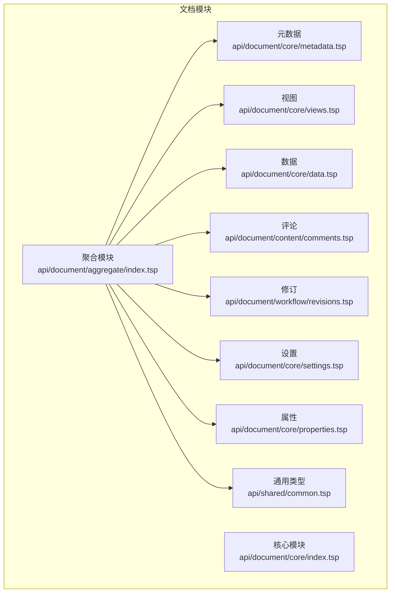
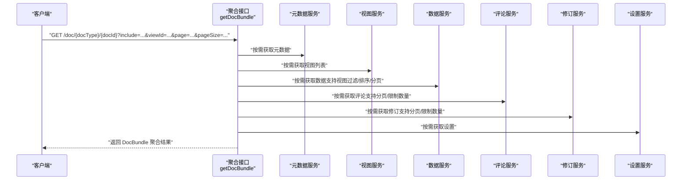
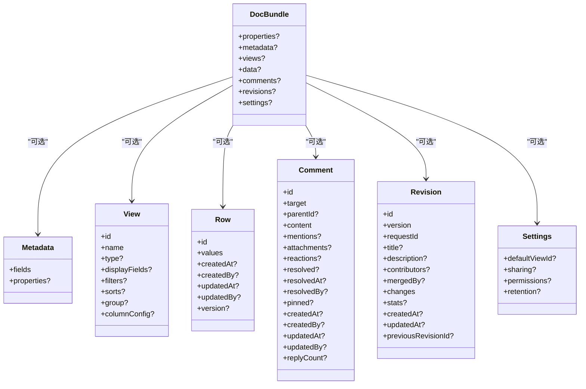
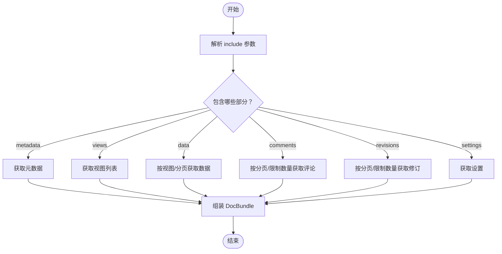
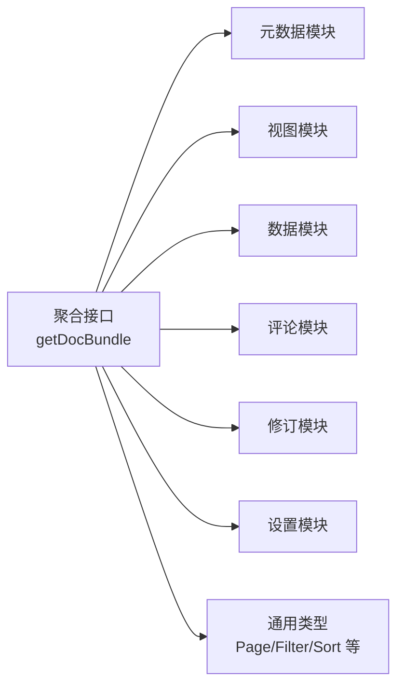

# 聚合查询

<cite>
**本文引用的文件**
- [api/document/aggregate/index.tsp](file://api/document/aggregate/index.tsp)
- [api/document/core/metadata.tsp](file://api/document/core/metadata.tsp)
- [api/document/core/views.tsp](file://api/document/core/views.tsp)
- [api/document/core/data.tsp](file://api/document/core/data.tsp)
- [api/document/content/comments.tsp](file://api/document/content/comments.tsp)
- [api/document/workflow/revisions.tsp](file://api/document/workflow/revisions.tsp)
- [api/document/core/settings.tsp](file://api/document/core/settings.tsp)
- [api/document/core/properties.tsp](file://api/document/core/properties.tsp)
- [api/shared/common.tsp](file://api/shared/common.tsp)
- [docs-src/references/api-reference.md](file://docs-src/references/api-reference.md)
</cite>

## 目录
1. [简介](#简介)
2. [项目结构](#项目结构)
3. [核心组件](#核心组件)
4. [架构总览](#架构总览)
5. [详细组件分析](#详细组件分析)
6. [依赖分析](#依赖分析)
7. [性能考虑](#性能考虑)
8. [故障排查指南](#故障排查指南)
9. [结论](#结论)
10. [附录](#附录)

## 简介
本篇文档围绕“聚合查询”能力展开，重点说明 DocBundle 模型的结构与 getDocBundle 接口的使用方式，帮助开发者一次性获取文档的元数据、视图、数据、评论、修订、设置等多个部分，并讲解 include 参数的组合、分页机制在数据与评论/修订数量限制中的应用，以及如何通过 viewId 指定特定视图进行数据查询。文末提供多种 include 组合与分页参数的实际调用示例，便于快速落地。

## 项目结构
聚合查询位于文档模块的聚合子模块下，DocBundle 作为统一的聚合载荷模型，将元数据、视图、数据、评论、修订、设置等部分整合在一个响应中，配合 getDocBundle 接口按需返回。

图表来源
- [api/document/aggregate/index.tsp](file://api/document/aggregate/index.tsp#L1-L127)
- [api/document/core/index.tsp](file://api/document/core/index.tsp#L1-L21)

章节来源
- [api/document/aggregate/index.tsp](file://api/document/aggregate/index.tsp#L1-L127)
- [api/document/core/index.tsp](file://api/document/core/index.tsp#L1-L21)

## 核心组件
- DocBundle：聚合载荷模型，包含 properties、metadata、views、data、comments、revisions、settings 等字段，用于一次性返回文档所需数据。
- getDocBundle 接口：支持 include 参数选择返回部分，支持 viewId 指定视图、page/pageSize 分页、commentsLimit/revisionsLimit 限制数量。
- 通用分页 Page：统一的分页结构，包含 items、page、pageSize、total。

章节来源
- [api/document/aggregate/index.tsp](file://api/document/aggregate/index.tsp#L48-L90)
- [api/document/aggregate/index.tsp](file://api/document/aggregate/index.tsp#L92-L126)
- [api/shared/common.tsp](file://api/shared/common.tsp#L179-L203)

## 架构总览
聚合查询的整体交互流程如下：

图表来源
- [api/document/aggregate/index.tsp](file://api/document/aggregate/index.tsp#L92-L126)
- [api/document/core/metadata.tsp](file://api/document/core/metadata.tsp#L183-L210)
- [api/document/core/views.tsp](file://api/document/core/views.tsp#L86-L171)
- [api/document/core/data.tsp](file://api/document/core/data.tsp#L375-L417)
- [api/document/content/comments.tsp](file://api/document/content/comments.tsp#L246-L282)
- [api/document/workflow/revisions.tsp](file://api/document/workflow/revisions.tsp#L323-L355)
- [api/document/core/settings.tsp](file://api/document/core/settings.tsp#L86-L113)

## 详细组件分析

### DocBundle 模型结构
DocBundle 是聚合查询的统一输出载体，包含以下字段：
- properties：文档属性（如订单时间、门店、金额、数量等），来源于属性模块。
- metadata：字段定义与显示配置，来源于元数据模块。
- views：视图列表，来源于视图模块。
- data：数据分页结果，来源于数据模块。
- comments：评论集合，来源于评论模块。
- revisions：修订记录，来源于修订模块。
- settings：文档设置，来源于设置模块。

图表来源
- [api/document/aggregate/index.tsp](file://api/document/aggregate/index.tsp#L48-L90)
- [api/document/core/metadata.tsp](file://api/document/core/metadata.tsp#L160-L181)
- [api/document/core/views.tsp](file://api/document/core/views.tsp#L28-L84)
- [api/document/core/data.tsp](file://api/document/core/data.tsp#L248-L311)
- [api/document/content/comments.tsp](file://api/document/content/comments.tsp#L108-L237)
- [api/document/workflow/revisions.tsp](file://api/document/workflow/revisions.tsp#L158-L314)
- [api/document/core/settings.tsp](file://api/document/core/settings.tsp#L33-L84)

章节来源
- [api/document/aggregate/index.tsp](file://api/document/aggregate/index.tsp#L48-L90)
- [api/document/core/metadata.tsp](file://api/document/core/metadata.tsp#L160-L181)
- [api/document/core/views.tsp](file://api/document/core/views.tsp#L28-L84)
- [api/document/core/data.tsp](file://api/document/core/data.tsp#L248-L311)
- [api/document/content/comments.tsp](file://api/document/content/comments.tsp#L108-L237)
- [api/document/workflow/revisions.tsp](file://api/document/workflow/revisions.tsp#L158-L314)
- [api/document/core/settings.tsp](file://api/document/core/settings.tsp#L33-L84)

### getDocBundle 接口与 include 参数
- 路径：/doc/{docType}/{docId}
- 方法：GET
- 关键查询参数：
  - include：逗号分隔的包含部分，支持 metadata、views、data、comments、revisions、settings。
  - viewId：指定视图 ID，用于按视图的过滤/排序/分组等条件查询数据。
  - page、pageSize：数据分页参数；commentsLimit、revisionsLimit：评论/修订数量限制。
- 返回：ApiResponse<DocBundle>，DocBundle 中对应 include 的部分会被填充。

图表来源
- [api/document/aggregate/index.tsp](file://api/document/aggregate/index.tsp#L92-L126)

章节来源
- [api/document/aggregate/index.tsp](file://api/document/aggregate/index.tsp#L92-L126)
- [docs-src/references/api-reference.md](file://docs-src/references/api-reference.md#L58-L86)

### 分页机制与数量限制
- 数据分页：当 include 包含 data 时，可通过 page、pageSize 控制数据分页；数据模块支持简单 DSL 查询参数（page/pageSize/sort/filter/group/cursor）。
- 评论/修订数量限制：当 include 包含 comments 或 revisions 时，可通过 commentsLimit、revisionsLimit 限制返回数量。
- 通用分页结构：Page<...>，包含 items、page、pageSize、total。

章节来源
- [api/document/core/data.tsp](file://api/document/core/data.tsp#L375-L417)
- [api/document/content/comments.tsp](file://api/document/content/comments.tsp#L246-L282)
- [api/document/workflow/revisions.tsp](file://api/document/workflow/revisions.tsp#L323-L355)
- [api/shared/common.tsp](file://api/shared/common.tsp#L179-L203)

### 通过 viewId 指定视图进行数据查询
- 当 include 包含 data 且提供了 viewId 时，数据查询将遵循该视图的过滤、排序、分组等配置，从而实现“按视图渲染”的数据查询。
- 视图定义来源于视图模块，包含 displayFields、filters、sorts、group、columnConfig 等。

章节来源
- [api/document/core/views.tsp](file://api/document/core/views.tsp#L28-L84)
- [api/document/core/data.tsp](file://api/document/core/data.tsp#L375-L417)

### include 参数支持的选项与行为
- metadata：返回字段定义与显示配置。
- views：返回视图列表。
- data：返回数据分页结果，可结合 viewId、page、pageSize。
- comments：返回评论集合，可结合 commentsLimit。
- revisions：返回修订记录，可结合 revisionsLimit。
- settings：返回文档设置。

章节来源
- [api/document/aggregate/index.tsp](file://api/document/aggregate/index.tsp#L92-L126)
- [docs-src/references/api-reference.md](file://docs-src/references/api-reference.md#L58-L86)

## 依赖分析
聚合查询接口对各子模块存在按需依赖，include 决定实际调用的服务范围，耦合度低、内聚性高。

图表来源
- [api/document/aggregate/index.tsp](file://api/document/aggregate/index.tsp#L92-L126)
- [api/shared/common.tsp](file://api/shared/common.tsp#L179-L203)

章节来源
- [api/document/aggregate/index.tsp](file://api/document/aggregate/index.tsp#L92-L126)
- [api/shared/common.tsp](file://api/shared/common.tsp#L179-L203)

## 性能考虑
- 合理使用 include：仅包含需要的部分，避免不必要的网络往返与序列化开销。
- 分页与限制：对 data、comments、revisions 使用分页与数量限制，降低单次响应体积。
- 视图驱动查询：通过 viewId 将过滤/排序/分组下推至服务端，减少客户端二次处理。
- 并发与缓存：在客户端对 DocBundle 进行缓存，避免重复请求；对高频查询可考虑并行请求不同 include 组合。

[本节为通用指导，不涉及具体文件分析]

## 故障排查指南
- 404/文档不存在：确认 docType 与 docId 是否正确。
- 403/权限不足：确认 Token 权限与文档访问策略。
- 400/参数非法：检查 include、viewId、page、pageSize、commentsLimit、revisionsLimit 的取值范围与格式。
- 500/服务异常：重试或联系支持，关注日志与错误码。

章节来源
- [api/shared/common.tsp](file://api/shared/common.tsp#L80-L151)

## 结论
聚合查询通过 DocBundle 将文档的元数据、视图、数据、评论、修订、设置等多部分整合在一个接口中，借助 include 参数实现按需加载，结合 viewId、分页与数量限制，既能满足前端一次性渲染需求，又能兼顾性能与可维护性。建议在实际项目中根据页面需求选择合适的 include 组合，并充分利用视图与分页能力提升用户体验与系统性能。

[本节为总结性内容，不涉及具体文件分析]

## 附录

### 实际 API 调用示例（基于仓库示例与参考文档）
以下示例均来自仓库中的示例与参考文档，便于对照理解参数与行为。

- 获取元数据、视图与数据
  - 示例路径：[docs-src/references/api-reference.md](file://docs-src/references/api-reference.md#L58-L86)
  - 示例路径：[api/document/aggregate/index.tsp](file://api/document/aggregate/index.tsp#L28-L31)

- 指定视图进行数据查询
  - 示例路径：[api/document/aggregate/index.tsp](file://api/document/aggregate/index.tsp#L28-L31)

- 数据分页查询
  - 示例路径：[api/document/core/data.tsp](file://api/document/core/data.tsp#L375-L417)

- 评论分页与限制数量
  - 示例路径：[api/document/content/comments.tsp](file://api/document/content/comments.tsp#L246-L282)

- 修订分页与限制数量
  - 示例路径：[api/document/workflow/revisions.tsp](file://api/document/workflow/revisions.tsp#L323-L355)

- 设置获取
  - 示例路径：[api/document/core/settings.tsp](file://api/document/core/settings.tsp#L86-L113)