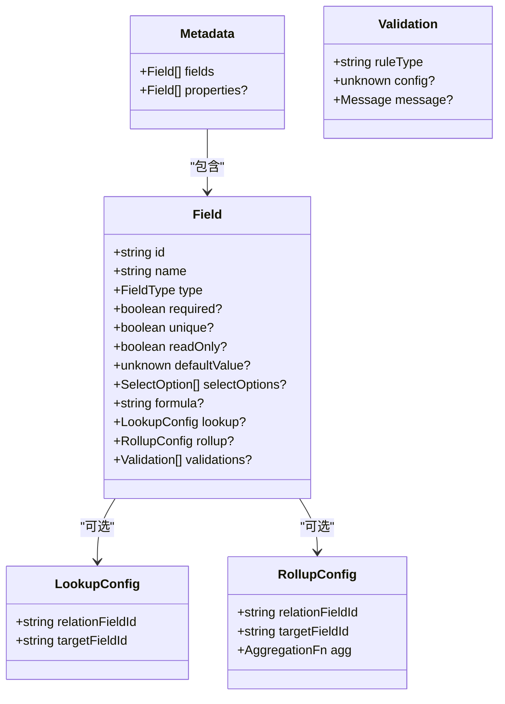

# 元数据API

<cite>
**本文引用的文件**
- [api/document/core/metadata.tsp](file://api/document/core/metadata.tsp)
- [api/shared/common.tsp](file://api/shared/common.tsp)
- [api/document/workflow/revisions.tsp](file://api/document/workflow/revisions.tsp)
- [api/document/workflow/requests.tsp](file://api/document/workflow/requests.tsp)
- [api/document/core/data.tsp](file://api/document/core/data.tsp)
- [docs-src/guides/best-practices.md](file://docs-src/guides/best-practices.md)
- [docs-src/references/api-reference.md](file://docs-src/references/api-reference.md)
</cite>

## 目录
1. [简介](#简介)
2. [项目结构](#项目结构)
3. [核心组件](#核心组件)
4. [架构总览](#架构总览)
5. [详细组件分析](#详细组件分析)
6. [依赖分析](#依赖分析)
7. [性能考虑](#性能考虑)
8. [故障排查指南](#故障排查指南)
9. [结论](#结论)
10. [附录](#附录)

## 简介
本文件面向nexusbook-api的元数据管理API，聚焦于MetadataApi接口的两个端点：
- GET /doc/{docType}/{docId}/metadata：返回完整的字段定义与属性配置，供前端表单渲染与数据校验使用
- PUT /doc/{docType}/{docId}/metadata：更新字段与显示配置，涉及权限校验、并发控制与变更审计

文档还阐述了元数据API与工作流系统的集成方式（变更请求、审批、修订），并给出性能特征与缓存策略建议。

## 项目结构
围绕元数据API的相关模块与文件如下：
- 文档核心元数据定义与接口：api/document/core/metadata.tsp
- 通用响应与类型：api/shared/common.tsp
- 变更工作流与修订：api/document/workflow/requests.tsp、api/document/workflow/revisions.tsp
- 数据行与并发控制参考：api/document/core/data.tsp
- 最佳实践与缓存建议：docs-src/guides/best-practices.md
- API参考示例：docs-src/references/api-reference.md

图表来源
- [api/document/core/metadata.tsp](file://api/document/core/metadata.tsp#L1-L211)
- [api/shared/common.tsp](file://api/shared/common.tsp#L1-L180)
- [api/document/workflow/requests.tsp](file://api/document/workflow/requests.tsp#L1-L200)
- [api/document/workflow/revisions.tsp](file://api/document/workflow/revisions.tsp#L1-L160)
- [api/document/core/data.tsp](file://api/document/core/data.tsp#L1-L120)
- [docs-src/guides/best-practices.md](file://docs-src/guides/best-practices.md#L255-L279)
- [docs-src/references/api-reference.md](file://docs-src/references/api-reference.md#L128-L139)

章节来源
- [api/document/core/metadata.tsp](file://api/document/core/metadata.tsp#L1-L211)
- [api/shared/common.tsp](file://api/shared/common.tsp#L1-L180)
- [api/document/workflow/requests.tsp](file://api/document/workflow/requests.tsp#L1-L200)
- [api/document/workflow/revisions.tsp](file://api/document/workflow/revisions.tsp#L1-L160)
- [api/document/core/data.tsp](file://api/document/core/data.tsp#L1-L120)
- [docs-src/guides/best-practices.md](file://docs-src/guides/best-practices.md#L255-L279)
- [docs-src/references/api-reference.md](file://docs-src/references/api-reference.md#L128-L139)

## 核心组件
- Metadata模型：包含fields（数据行字段定义）与properties（文档属性字段定义）。字段定义涵盖类型、必填、唯一、只读、默认值、选项、公式/查找/汇总配置与校验规则。
- Field模型：字段ID、名称、类型、必填/唯一/只读、默认值、选择类选项、公式/查找/汇总配置、校验规则数组。
- LookupConfig/RollupConfig：分别用于“查找”和“汇总”计算的关联字段与目标字段、聚合函数。
- MetadataApi接口：提供getMetadata与putMetadata两个端点，均返回ApiResponse包装的Metadata。

章节来源
- [api/document/core/metadata.tsp](file://api/document/core/metadata.tsp#L29-L210)
- [api/shared/common.tsp](file://api/shared/common.tsp#L153-L177)

## 架构总览
元数据API与工作流系统的关系如下：
- GET /doc/{docType}/{docId}/metadata：直接返回当前文档的Metadata，供前端渲染与校验。
- PUT /doc/{docType}/{docId}/metadata：更新元数据时，遵循变更工作流（变更请求、审批、合并、修订）以确保合规与审计。

图表来源
- [api/document/core/metadata.tsp](file://api/document/core/metadata.tsp#L183-L210)
- [api/document/workflow/requests.tsp](file://api/document/workflow/requests.tsp#L202-L391)
- [api/document/workflow/revisions.tsp](file://api/document/workflow/revisions.tsp#L316-L547)

## 详细组件分析

### GET /doc/{docType}/{docId}/metadata
- 目的：返回完整的字段定义与属性配置，供前端表单渲染与数据校验使用。
- 响应：ApiResponse<Metadata>，其中Metadata包含fields与可选的properties。
- 字段定义要点：
  - 字段类型：覆盖文本、数值、日期时间、布尔、选择、附件、用户、协作者、关联、计算型（公式/查找/汇总/自增/时间戳/创建者/更新者等）。
  - 字段属性：必填、唯一、只读、默认值、选择类选项、校验规则（规则类型+配置+多语言消息）。
  - 计算型字段：formula、lookup、rollup，分别对应表达式、关联字段+目标字段、关联字段+目标字段+聚合函数。
- 使用场景：
  - 前端根据Metadata动态生成表单控件与校验器。
  - 客户端在提交数据前进行本地校验，减少无效请求。

图表来源
- [api/document/core/metadata.tsp](file://api/document/core/metadata.tsp#L183-L210)
- [api/shared/common.tsp](file://api/shared/common.tsp#L153-L177)

章节来源
- [api/document/core/metadata.tsp](file://api/document/core/metadata.tsp#L183-L210)
- [api/shared/common.tsp](file://api/shared/common.tsp#L153-L177)

### PUT /doc/{docType}/{docId}/metadata
- 目的：更新字段与显示配置，需具备管理权限。
- 请求体：Metadata（fields与可选properties）。
- 权限校验：需要管理权限（scope或角色层面的管理权限）。
- 并发控制：通过version字段实现乐观锁，避免并发覆盖。
- 变更审计：更新元数据属于“元数据更新”类型，合并后生成修订（Revision），记录变更历史与贡献者。

图表来源
- [api/document/core/metadata.tsp](file://api/document/core/metadata.tsp#L183-L210)
- [api/document/workflow/requests.tsp](file://api/document/workflow/requests.tsp#L202-L391)
- [api/document/workflow/revisions.tsp](file://api/document/workflow/revisions.tsp#L316-L547)

章节来源
- [api/document/core/metadata.tsp](file://api/document/core/metadata.tsp#L183-L210)
- [api/document/workflow/requests.tsp](file://api/document/workflow/requests.tsp#L202-L391)
- [api/document/workflow/revisions.tsp](file://api/document/workflow/revisions.tsp#L316-L547)

### 元数据模型与字段类型
- FieldType枚举：覆盖多维表格常见类型，包括文本、数值、货币、百分比、日期、日期时间、布尔、单选/多选、附件、用户、协作者、关联、查找、汇总、公式、自增、创建/更新时间、创建/更新者等。
- Field模型关键字段：
  - id/name/type/required/unique/readOnly/defaultValue/selectOptions
  - 计算配置：formula、lookup、rollup
  - 校验规则：validations（ruleType/config/message）

图表来源
- [api/document/core/metadata.tsp](file://api/document/core/metadata.tsp#L29-L181)
- [api/shared/common.tsp](file://api/shared/common.tsp#L499-L742)

章节来源
- [api/document/core/metadata.tsp](file://api/document/core/metadata.tsp#L29-L181)
- [api/shared/common.tsp](file://api/shared/common.tsp#L499-L742)

### 与工作流系统集成
- 变更请求（Request）：所有元数据更新先进入变更请求，支持多人协同编辑、评审与合并。
- 合并（Merge）：合并请求时生成修订（Revision），记录变更操作、贡献者、统计信息与时间戳。
- 审批（Approval）：虽然元数据更新本身未强制要求审批，但可通过工作流模块发起审批流程，确保关键变更得到授权。

图表来源
- [api/document/workflow/requests.tsp](file://api/document/workflow/requests.tsp#L202-L391)
- [api/document/workflow/revisions.tsp](file://api/document/workflow/revisions.tsp#L316-L547)

章节来源
- [api/document/workflow/requests.tsp](file://api/document/workflow/requests.tsp#L202-L391)
- [api/document/workflow/revisions.tsp](file://api/document/workflow/revisions.tsp#L316-L547)

## 依赖分析
- MetadataApi依赖：
  - Metadata/Field/FieldType模型（定义字段类型与配置）
  - ApiResponse通用响应包装（success/code/message/payload）
- 并发控制与审计：
  - 数据行模块展示了基于version的乐观锁并发控制思路，元数据更新同样遵循变更工作流与修订记录。
- 工作流依赖：
  - 变更请求与修订模型为元数据更新提供审计与追溯能力。

图表来源
- [api/document/core/metadata.tsp](file://api/document/core/metadata.tsp#L183-L210)
- [api/shared/common.tsp](file://api/shared/common.tsp#L153-L177)
- [api/document/workflow/requests.tsp](file://api/document/workflow/requests.tsp#L202-L391)
- [api/document/workflow/revisions.tsp](file://api/document/workflow/revisions.tsp#L316-L547)

章节来源
- [api/document/core/metadata.tsp](file://api/document/core/metadata.tsp#L183-L210)
- [api/shared/common.tsp](file://api/shared/common.tsp#L153-L177)
- [api/document/workflow/requests.tsp](file://api/document/workflow/requests.tsp#L202-L391)
- [api/document/workflow/revisions.tsp](file://api/document/workflow/revisions.tsp#L316-L547)

## 性能考虑
- 缓存策略：建议在客户端对元数据进行短期缓存（例如1分钟），以减少重复请求；当文档元数据发生变更（合并请求合并后生成修订）时，应失效相关缓存键。
- 按需加载：前端仅在需要时请求元数据，避免在文档整体加载时携带大量元数据。
- 分页与查询：虽然元数据接口不涉及分页，但在使用数据行接口时遵循合理的分页大小与服务端过滤，有助于整体性能。

章节来源
- [docs-src/guides/best-practices.md](file://docs-src/guides/best-practices.md#L255-L279)

## 故障排查指南
- 版本冲突（并发更新）：若更新时version不匹配，应提示用户重新拉取最新数据并重试。
- 权限不足：更新元数据需要管理权限，若返回权限错误，检查token的scope或角色。
- 变更未生效：确认变更请求是否已合并，合并后才会生成修订并真正生效。
- 审批阻塞：若启用审批流程，等待审批通过后再尝试合并。

章节来源
- [api/document/core/metadata.tsp](file://api/document/core/metadata.tsp#L183-L210)
- [api/document/workflow/requests.tsp](file://api/document/workflow/requests.tsp#L202-L391)
- [api/document/workflow/revisions.tsp](file://api/document/workflow/revisions.tsp#L316-L547)

## 结论
元数据API通过清晰的字段定义与配置模型，为前端表单渲染与数据校验提供基础；通过变更工作流与修订机制，确保元数据变更具备合规性与可追溯性。结合缓存与按需加载策略，可在保证一致性的同时提升性能与用户体验。

## 附录

### 请求/响应示例（路径引用）
- GET /doc/{docType}/{docId}/metadata
  - 请求：无请求体
  - 响应：ApiResponse<Metadata>
  - 参考路径：[api/document/core/metadata.tsp](file://api/document/core/metadata.tsp#L183-L210)，[api/shared/common.tsp](file://api/shared/common.tsp#L153-L177)
- PUT /doc/{docType}/{docId}/metadata
  - 请求体：Metadata（fields与可选properties）
  - 响应：ApiResponse<Metadata>
  - 参考路径：[api/document/core/metadata.tsp](file://api/document/core/metadata.tsp#L183-L210)，[api/shared/common.tsp](file://api/shared/common.tsp#L153-L177)

### API参考示例（路径引用）
- 元数据端点示例（GET/PUT）
  - 参考路径：[docs-src/references/api-reference.md](file://docs-src/references/api-reference.md#L128-L139)