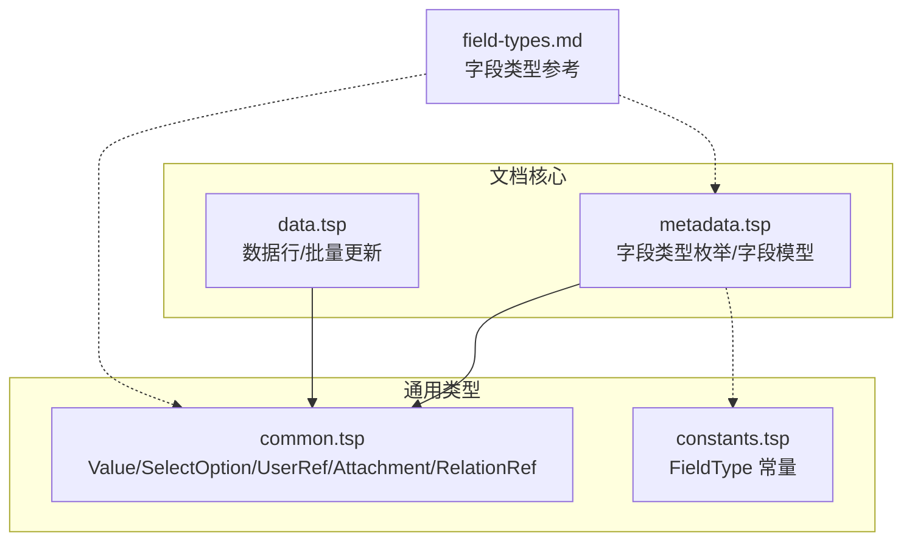
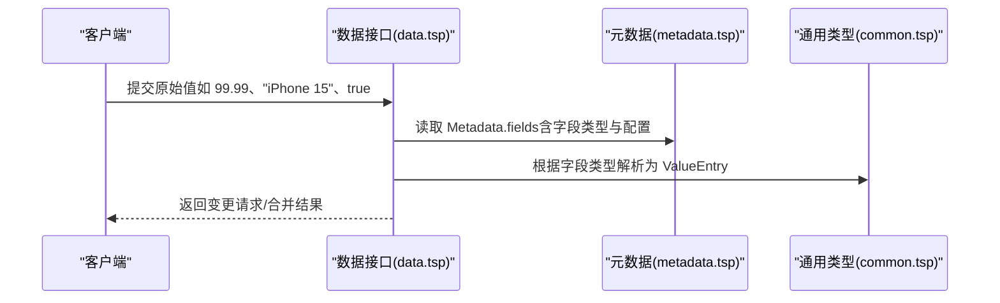
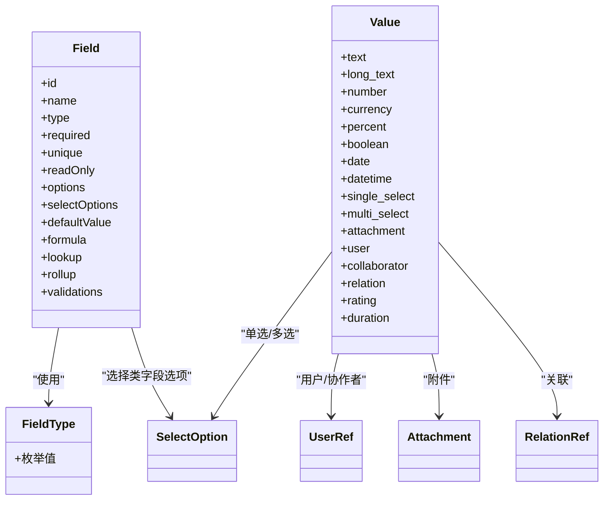

# 字段类型

<cite>
**本文引用的文件**
- [metadata.tsp](file://api/document/core/metadata.tsp)
- [common.tsp](file://api/shared/common.tsp)
- [constants.tsp](file://api/shared/constants.tsp)
- [data.tsp](file://api/document/core/data.tsp)
- [field-types.md](file://docs-src/references/field-types.md)
</cite>

## 目录
1. [简介](#简介)
2. [项目结构](#项目结构)
3. [核心组件](#核心组件)
4. [架构总览](#架构总览)
5. [详细组件分析](#详细组件分析)
6. [依赖分析](#依赖分析)
7. [性能考虑](#性能考虑)
8. [故障排查指南](#故障排查指南)
9. [结论](#结论)
10. [附录](#附录)

## 简介
本文件面向开发者与产品人员，系统化梳理 nexusbook-api 中“字段类型”的完整数据模型与使用规范。围绕 FieldType 枚举定义的 25+ 种字段类型，逐类说明其语义、值类型约束、典型使用场景、在数据验证与 UI 渲染中的作用，以及在元数据配置中的特殊属性（如 single_select 的选项集）。同时给出字段类型与实际数据值的映射关系示例，帮助在 Field 模型中正确声明不同类型的字段，并理解类型安全机制如何保障数据一致性。

## 项目结构
字段类型相关的核心定义分布在以下模块：
- 字段类型枚举与字段模型：api/document/core/metadata.tsp
- 通用值类型与引用类型：api/shared/common.tsp
- 字段类型常量（另一处定义）：api/shared/constants.tsp
- 数据行与批量更新（值解析与类型转换）：api/document/core/data.tsp
- 字段类型参考文档：docs-src/references/field-types.md

图表来源
- [metadata.tsp](file://api/document/core/metadata.tsp#L29-L52)
- [common.tsp](file://api/shared/common.tsp#L544-L561)
- [constants.tsp](file://api/shared/constants.tsp#L145-L259)
- [data.tsp](file://api/document/core/data.tsp#L248-L311)
- [field-types.md](file://docs-src/references/field-types.md#L1-L40)

章节来源
- [metadata.tsp](file://api/document/core/metadata.tsp#L29-L52)
- [common.tsp](file://api/shared/common.tsp#L544-L561)
- [constants.tsp](file://api/shared/constants.tsp#L145-L259)
- [data.tsp](file://api/document/core/data.tsp#L248-L311)
- [field-types.md](file://docs-src/references/field-types.md#L1-L40)

## 核心组件
- FieldType 枚举：定义了全部字段类型，覆盖文本、数值、日期时间、选择、附件、用户、关联、计算型、系统字段等类别。
- Field 模型：描述字段的类型、是否必填/唯一/只读、默认值、选择类字段的选项集、计算配置（formula/lookup/rollup）与校验规则。
- Value 联合类型：统一承载各字段类型的值结构，确保客户端/服务端在传输层按类型安全地传递值。
- 通用引用类型：SelectOption、UserRef、Attachment、RelationRef 等，支撑选择、用户、附件、关联等字段类型的值结构。
- 数据行与批量更新：Row 与 BulkUpdate 的设计体现了“原始值 + 元数据解析”的类型安全机制，避免客户端感知字段类型细节。

章节来源
- [metadata.tsp](file://api/document/core/metadata.tsp#L29-L52)
- [metadata.tsp](file://api/document/core/metadata.tsp#L65-L110)
- [common.tsp](file://api/shared/common.tsp#L544-L561)
- [common.tsp](file://api/shared/common.tsp#L333-L357)
- [common.tsp](file://api/shared/common.tsp#L451-L487)
- [common.tsp](file://api/shared/common.tsp#L515-L542)
- [data.tsp](file://api/document/core/data.tsp#L248-L311)
- [data.tsp](file://api/document/core/data.tsp#L189-L239)

## 架构总览
字段类型在系统中的作用链路如下：
- 元数据层：通过 Metadata.fields 定义字段类型与配置（必填、唯一、只读、默认值、选项、计算与校验）。
- 值结构层：Value 联合类型统一承载各字段类型的值，保证传输层类型安全。
- 数据层：Row.values 以 ValueEntry 形式存储字段值；批量更新接口以原始值传入，服务端依据元数据自动解析为类型化值。
- 计算层：lookup/rollup/formula 等计算字段通过配置在运行时解析关联或表达式，产出值。
- UI/验证层：前端基于字段类型与配置渲染输入控件、执行前端校验；后端在持久化前进行类型与业务规则校验。

图表来源
- [data.tsp](file://api/document/core/data.tsp#L544-L559)
- [metadata.tsp](file://api/document/core/metadata.tsp#L65-L110)
- [common.tsp](file://api/shared/common.tsp#L544-L561)

章节来源
- [data.tsp](file://api/document/core/data.tsp#L544-L559)
- [metadata.tsp](file://api/document/core/metadata.tsp#L65-L110)
- [common.tsp](file://api/shared/common.tsp#L544-L561)

## 详细组件分析

### FieldType 枚举与分类
- 基础类型：text、long_text、number、currency、percent、boolean、date、datetime、duration
- 选择类型：single_select、multi_select、rating
- 关联类型：attachment、user、collaborator、relation
- 计算类型：lookup、rollup、formula、auto_number
- 系统字段：created_time、updated_time、created_by、updated_by

章节来源
- [metadata.tsp](file://api/document/core/metadata.tsp#L29-L52)
- [constants.tsp](file://api/shared/constants.tsp#L145-L259)

### 字段模型 Field
- 关键属性
  - id/name/type：字段标识、显示名与类型
  - required/unique/readOnly：必填、唯一、只读
  - options/selectOptions：旧版选项与新版选择类字段选项集
  - defaultValue：默认值
  - formula/lookup/rollup：计算配置（字符串表达式或关联+目标字段+聚合）
  - validations：校验规则（ruleType + config + 多语言消息）

章节来源
- [metadata.tsp](file://api/document/core/metadata.tsp#L65-L110)

### 值类型与映射关系
- Value 联合类型统一承载各字段类型的值结构，确保类型安全传输
- 常见映射关系（示例）
  - text/long_text → {"text": string}
  - number/currency/percent → {"number": 浮点数}
  - boolean → {"boolean": 布尔值}
  - date → {"date": ISO 8601 字符串}
  - datetime → {"datetime": ISO 8601 字符串}
  - duration → {"duration": 毫秒整数}
  - single_select → {"selectOption": SelectOption}
  - multi_select → {"selectOptions": SelectOption[]}
  - rating → {"rating": 1-5 整数}
  - attachment → {"attachments": Attachment[]}
  - user/collaborator → {"user"/"collaborators": UserRef}
  - relation → {"relations": RelationRef[]}

章节来源
- [common.tsp](file://api/shared/common.tsp#L544-L561)
- [field-types.md](file://docs-src/references/field-types.md#L439-L454)

### 通用引用类型
- SelectOption：选项标识、标签、颜色、禁用状态
- Attachment：附件标识、文件名、URL、MIME 类型、大小、校验和、宽高、创建时间与创建人
- UserRef/CollaboratorRef：用户标识、展示名、邮箱、头像
- RelationRef：目标文档类型、目标文档ID、行ID

章节来源
- [common.tsp](file://api/shared/common.tsp#L333-L357)
- [common.tsp](file://api/shared/common.tsp#L359-L449)
- [common.tsp](file://api/shared/common.tsp#L451-L487)
- [common.tsp](file://api/shared/common.tsp#L489-L513)
- [common.tsp](file://api/shared/common.tsp#L515-L542)

### 数据行与批量更新中的类型安全
- Row.values 以 ValueEntry 存储字段值，服务端根据字段类型自动解析
- BulkUpdate 支持单值、对象、数组等多种形式，服务端依据元数据解析为类型化值
- 并发控制：Row.version 用于乐观锁，防止并发冲突

章节来源
- [data.tsp](file://api/document/core/data.tsp#L248-L311)
- [data.tsp](file://api/document/core/data.tsp#L189-L239)

### 字段类型详解与使用建议

#### 文本与长文本
- 语义：短文本/多行文本，适合名称、标题、描述、备注等
- 值类型：{"text": string}
- 典型配置：长度限制、正则校验
- UI/验证：文本框、富文本（long_text），支持最小/最大长度与模式校验

章节来源
- [field-types.md](file://docs-src/references/field-types.md#L18-L56)
- [field-types.md](file://docs-src/references/field-types.md#L32-L42)

#### 数值与货币/百分比
- 语义：数值、货币金额、百分比
- 值类型：{"number": 浮点数}
- 典型配置：范围、精度（货币）、货币代码（货币）
- UI/验证：数字输入框，支持最小/最大、精度校验

章节来源
- [field-types.md](file://docs-src/references/field-types.md#L58-L82)
- [field-types.md](file://docs-src/references/field-types.md#L84-L105)
- [field-types.md](file://docs-src/references/field-types.md#L107-L119)

#### 布尔值
- 语义：是/否、真/假
- 值类型：{"boolean": boolean}
- 典型配置：无
- UI/验证：开关/复选框

章节来源
- [field-types.md](file://docs-src/references/field-types.md#L121-L133)

#### 日期/日期时间/时长
- 语义：日期、完整日期时间、时间段
- 值类型：{"date": ISO 8601 字符串}、{"datetime": ISO 8601 字符串}、{"duration": 毫秒整数}
- 典型配置：无
- UI/验证：日期选择器、时间选择器、时长输入

章节来源
- [field-types.md](file://docs-src/references/field-types.md#L135-L177)

#### 选择类型
- single_select：单选，值为 {"selectOption": SelectOption}
  - 配置：options/selectOptions（新版推荐）
- multi_select：多选，值为 {"selectOptions": SelectOption[]}
- rating：评分，值为 {"rating": 1-5 整数}
- 特殊属性：selectOptions（选项集合）
- UI/验证：下拉/多选/评分星标，选项必须来自定义的选项集

章节来源
- [field-types.md](file://docs-src/references/field-types.md#L180-L243)
- [field-types.md](file://docs-src/references/field-types.md#L201-L210)
- [metadata.tsp](file://api/document/core/metadata.tsp#L90-L92)

#### 关联类型
- attachment：附件，值为 {"attachments": Attachment[]}
- user：单个用户引用，值为 {"user": UserRef}
- collaborator：多个用户引用，值为 {"collaborators": UserRef[]}
- relation：关联到其他文档的数据行，值为 {"relations": RelationRef[]}
- 特殊属性：无（值结构即引用）
- UI/验证：文件上传、用户选择、关联选择器

章节来源
- [field-types.md](file://docs-src/references/field-types.md#L245-L314)
- [common.tsp](file://api/shared/common.tsp#L359-L449)
- [common.tsp](file://api/shared/common.tsp#L451-L487)
- [common.tsp](file://api/shared/common.tsp#L489-L513)
- [common.tsp](file://api/shared/common.tsp#L515-L542)

#### 计算类型
- lookup：从关联记录中查找值，配置包含 relationField 与 lookupField
- rollup：对关联记录进行聚合（count/sum/avg/min/max），配置包含 relationField、rollupField 与 aggregateFunction
- formula：根据公式计算，支持算术、比较、逻辑与函数
- auto_number：自动编号，配置包含前缀、位数、起始值
- 特殊属性：formula/lookup/rollup 的配置对象
- UI/验证：计算字段通常只读，值由系统根据配置生成

章节来源
- [field-types.md](file://docs-src/references/field-types.md#L316-L387)
- [metadata.tsp](file://api/document/core/metadata.tsp#L93-L98)

#### 系统字段
- created_time/updated_time：值为 {"datetime": string}
- created_by/updated_by：值为 {"user": UserRef}
- 特殊属性：系统自动维护，不可手动修改
- UI/验证：通常隐藏或只读

章节来源
- [field-types.md](file://docs-src/references/field-types.md#L388-L407)

### 字段类型与 UI 渲染、验证、计算的作用
- UI 渲染：前端根据字段类型与配置渲染合适的输入控件（文本框、数字输入、日期选择、单选/多选、评分、附件上传、用户/关联选择等），并应用长度、范围、正则等校验。
- 数据验证：后端在持久化前依据字段类型与配置进行类型转换与业务规则校验，确保值符合预期。
- 计算逻辑：计算字段（lookup/rollup/formula/auto_number）在运行时解析配置，产出值，减少前端负担并保证一致性。

章节来源
- [field-types.md](file://docs-src/references/field-types.md#L408-L454)
- [metadata.tsp](file://api/document/core/metadata.tsp#L65-L110)

### 类型安全机制
- 传输层类型安全：Value 联合类型确保客户端/服务端按字段类型传递值，避免类型错配。
- 元数据驱动：Field.type 与 Metadata.fields 决定值的结构与约束，服务端据此解析与校验。
- 原始值到类型化值：批量更新接口允许客户端以原始值提交，服务端根据元数据自动解析为 ValueEntry，降低客户端复杂度。
- 并发控制：Row.version 与变更请求工作流共同保障数据一致性。

章节来源
- [common.tsp](file://api/shared/common.tsp#L544-L561)
- [data.tsp](file://api/document/core/data.tsp#L544-L559)
- [data.tsp](file://api/document/core/data.tsp#L248-L311)

## 依赖分析
- 字段类型枚举
  - metadata.tsp 定义 FieldType（覆盖多维表格常见类型）
  - constants.tsp 定义 FieldType 常量（与 metadata.tsp 枚举一致）
- 字段模型依赖通用类型
  - Field.selectOptions 引用 SelectOption
  - 计算字段配置引用 LookupConfig/RollupConfig
  - Value 联合类型引用 SelectOption/UserRef/Attachment/RelationRef
- 数据层依赖元数据与通用类型
  - Row.values 与 ValueEntry 依赖 Value 联合类型
  - 批量更新接口依赖元数据解析值类型

图表来源
- [metadata.tsp](file://api/document/core/metadata.tsp#L29-L52)
- [metadata.tsp](file://api/document/core/metadata.tsp#L65-L110)
- [common.tsp](file://api/shared/common.tsp#L544-L561)
- [common.tsp](file://api/shared/common.tsp#L333-L357)
- [common.tsp](file://api/shared/common.tsp#L451-L487)
- [common.tsp](file://api/shared/common.tsp#L515-L542)

章节来源
- [metadata.tsp](file://api/document/core/metadata.tsp#L29-L52)
- [metadata.tsp](file://api/document/core/metadata.tsp#L65-L110)
- [common.tsp](file://api/shared/common.tsp#L544-L561)

## 性能考虑
- 传输层：Value 联合类型避免冗余包装，减少序列化开销
- 计算字段：lookup/rollup/formula 的计算应在必要时触发，避免频繁全量重算
- 查询与分页：合理使用过滤、排序、分组与游标分页，减少一次性加载大量数据
- 附件：尽量使用轻量缩略图或仅传递必要元信息，避免大文件频繁传输

[本节为通用指导，不涉及具体文件分析]

## 故障排查指南
- 字段类型不匹配
  - 现象：FIELD_TYPE_MISMATCH 错误
  - 排查：确认 Field.type 与 ValueEntry.value 的结构一致
- 选择类字段选项缺失
  - 现象：校验失败或值无效
  - 排查：检查 selectOptions 是否正确配置，且值来自选项集
- 计算字段异常
  - 现象：lookup/rollup/formula 无法解析或结果为空
  - 排查：核对 relationField/targetField/aggregateFunction 配置是否正确
- 附件/用户/关联引用无效
  - 现象：引用字段值无法解析
  - 排查：确认 Attachment/UserRef/RelationRef 的标识与存在性

章节来源
- [common.tsp](file://api/shared/common.tsp#L80-L120)
- [field-types.md](file://docs-src/references/field-types.md#L201-L210)
- [field-types.md](file://docs-src/references/field-types.md#L316-L387)

## 结论
nexusbook-api 的字段类型体系以 FieldType 枚举为核心，配合 Field 模型与 Value 联合类型，实现了从元数据到值结构再到计算与 UI 渲染的完整闭环。通过元数据驱动的类型安全机制与批量更新的原始值解析，既简化了客户端实现，又确保了数据一致性与可扩展性。建议在新增字段类型时，同步完善元数据定义、值结构与 UI/校验逻辑，并在文档中补充相应示例与配置说明。

[本节为总结，不涉及具体文件分析]

## 附录

### 字段类型与值类型映射表
- text/long_text → {"text": string}
- number/currency/percent → {"number": 浮点数}
- boolean → {"boolean": 布尔值}
- date → {"date": ISO 8601 字符串}
- datetime → {"datetime": ISO 8601 字符串}
- duration → {"duration": 毫秒整数}
- single_select → {"selectOption": SelectOption}
- multi_select → {"selectOptions": SelectOption[]}
- rating → {"rating": 1-5 整数}
- attachment → {"attachments": Attachment[]}
- user/collaborator → {"user"/"collaborators": UserRef}
- relation → {"relations": RelationRef[]}

章节来源
- [field-types.md](file://docs-src/references/field-types.md#L439-L454)
- [common.tsp](file://api/shared/common.tsp#L544-L561)