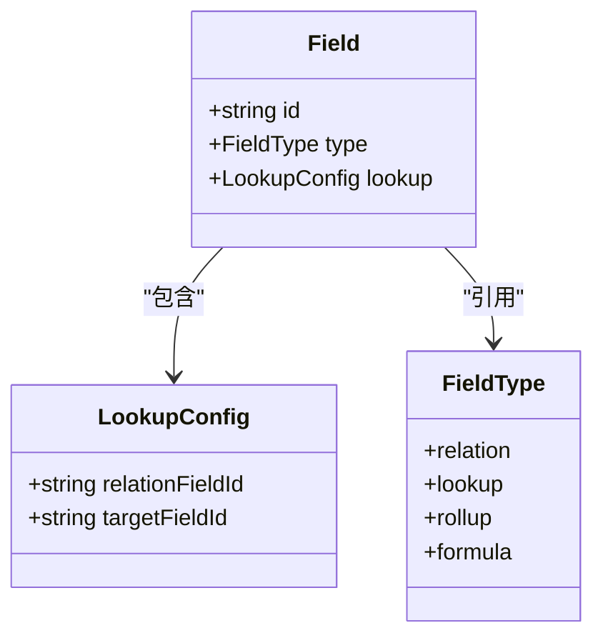
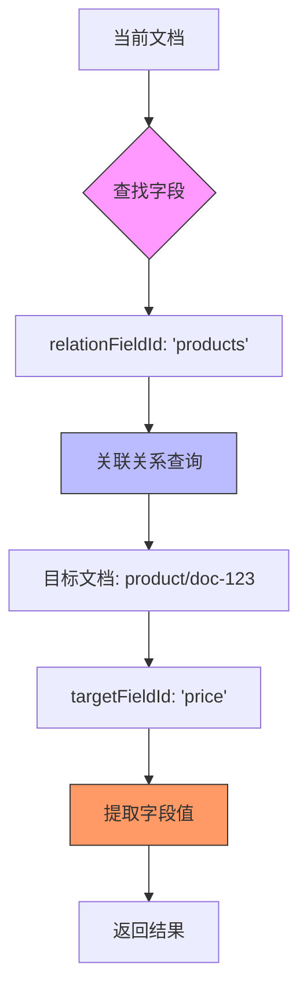
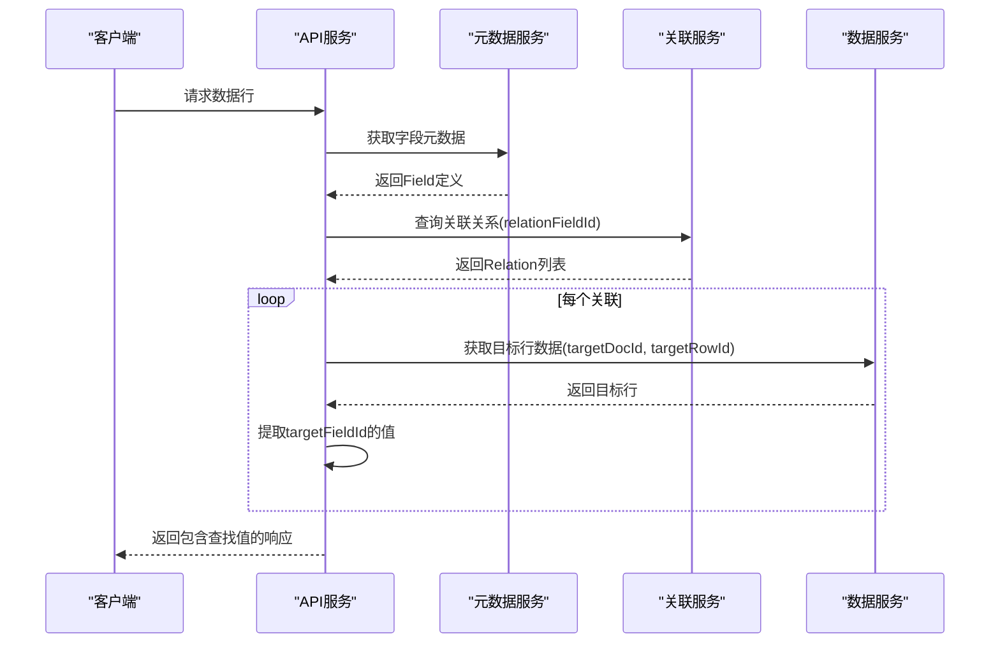
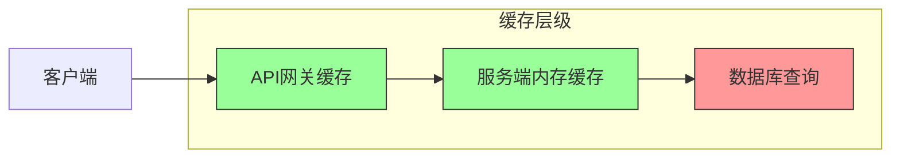
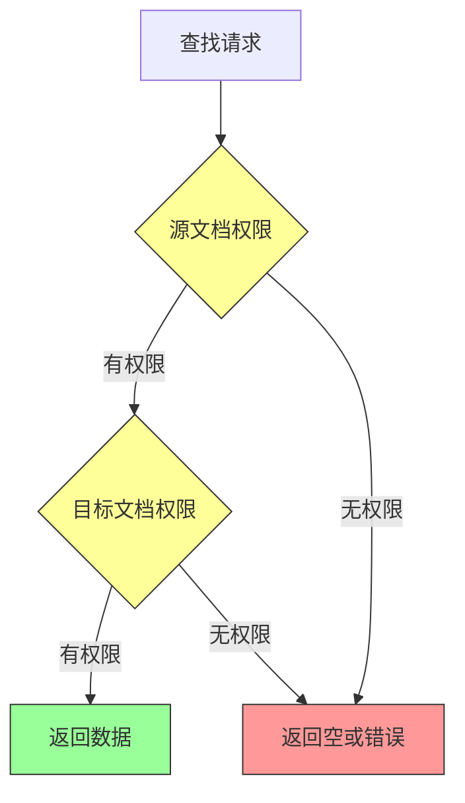
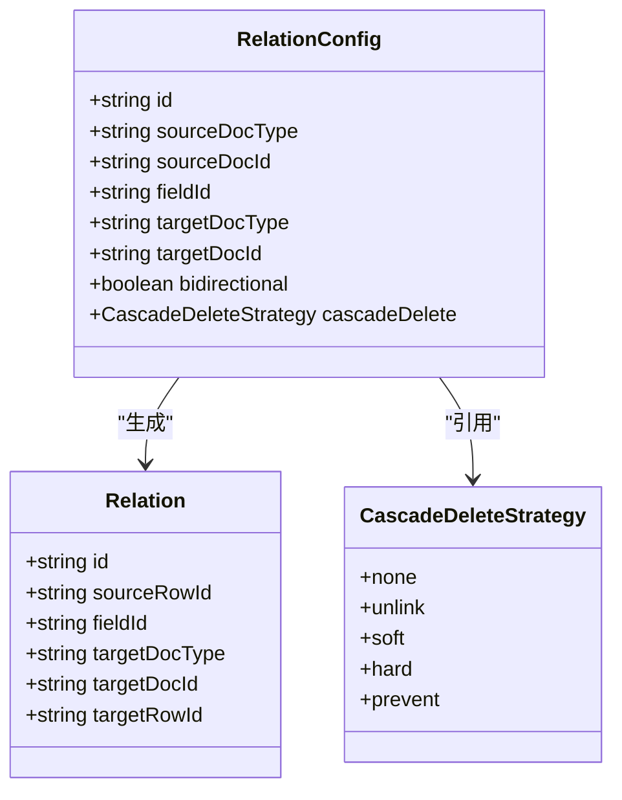

# 查找字段

<cite>
**本文档引用文件**   
- [metadata.tsp](file://api/document/core/metadata.tsp)
- [field-types.md](file://docs-src/references/field-types.md)
- [constants.tsp](file://api/shared/constants.tsp)
- [index.tsp](file://api/document/relations/index.tsp)
- [document-model.md](file://docs-src/guides/document-model.md)
</cite>

## 目录
1. [简介](#简介)
2. [核心模型与配置](#核心模型与配置)
3. [查找字段工作原理](#查找字段工作原理)
4. [配置示例](#配置示例)
5. [服务端查询解析](#服务端查询解析)
6. [性能优化与缓存策略](#性能优化与缓存策略)
7. [权限控制机制](#权限控制机制)
8. [关联关系管理](#关联关系管理)
9. [最佳实践](#最佳实践)

## 简介
查找字段是nexusbook-api中用于跨文档数据关联的核心功能。它允许用户通过定义关联关系，从目标文档或行中提取特定字段的值，并在当前上下文中展示。该功能基于灵活的元数据模型和强大的关系引擎，支持复杂的业务场景如订单明细中查找产品名称或单价等。

查找字段通过`LookupConfig`模型进行配置，该模型定义了如何通过关联字段找到目标记录，并从中提取指定字段的值。整个过程遵循严格的权限控制，确保数据安全性和完整性。

**Section sources**
- [metadata.tsp](file://api/document/core/metadata.tsp#L54-L105)
- [field-types.md](file://docs-src/references/field-types.md#L303-L329)

## 核心模型与配置
查找字段的核心在于`LookupConfig`模型的配置，它定义了关联路径和目标字段的映射关系。

### LookupConfig 模型
`LookupConfig`模型包含两个关键属性：`relationFieldId`和`targetFieldId`，它们共同定义了数据提取路径。



**Diagram sources **
- [metadata.tsp](file://api/document/core/metadata.tsp#L112-L124)
- [constants.tsp](file://api/shared/constants.tsp#L224-L235)

#### relationFieldId（关联字段ID）
`relationFieldId`指定了用于建立关联的字段ID。这个字段必须是类型为`relation`的字段，它存储了指向目标文档或行的引用关系。服务端会根据此字段ID查找相关的关联记录。

#### targetFieldId（目标字段ID）
`targetFieldId`指定了要从目标文档或行中提取的字段ID。一旦通过`relationFieldId`找到关联的目标记录，系统就会查询该记录中`targetFieldId`对应的字段值并返回。

### 字段类型枚举
系统定义了多种字段类型，其中`lookup`作为计算型字段的一种，专门用于实现查找功能。

```mermaid
classDiagram
enum FieldType {
text
number
date
relation
lookup
rollup
formula
}
```

**Diagram sources **
- [constants.tsp](file://api/shared/constants.tsp#L224-L246)

**Section sources**
- [metadata.tsp](file://api/document/core/metadata.tsp#L112-L124)
- [constants.tsp](file://api/shared/constants.tsp#L224-L246)

## 查找字段工作原理
查找字段的工作流程涉及元数据解析、关联查询和值提取三个主要步骤。

### 数据流图


**Diagram sources **
- [metadata.tsp](file://api/document/core/metadata.tsp#L96)
- [index.tsp](file://api/document/relations/index.tsp#L188-L254)

### 执行流程
1. **元数据解析**：服务端首先获取当前文档的元数据，识别出哪些字段是查找字段及其`LookupConfig`配置。
2. **关联查询**：使用`relationFieldId`查询关联服务，获取所有相关的`Relation`记录。
3. **目标定位**：根据`Relation`中的`targetDocType`、`targetDocId`和`targetRowId`定位到目标文档和行。
4. **值提取**：从目标行的数据中提取`targetFieldId`对应的字段值。
5. **结果组装**：将提取的值组装成响应格式返回给客户端。

该机制支持一对多的关联场景，当一个关联字段指向多个目标记录时，查找字段会返回一个值数组。

**Section sources**
- [metadata.tsp](file://api/document/core/metadata.tsp#L54-L168)
- [index.tsp](file://api/document/relations/index.tsp#L188-L254)

## 配置示例
以下是一些典型的查找字段配置示例，展示了如何在实际业务场景中应用该功能。

### 订单明细中查找产品信息
在订单系统中，订单明细行可以通过关联字段查找对应产品的名称和单价。

```json
{
  "fieldId": "productName",
  "type": "lookup",
  "lookup": {
    "relationFieldId": "productRef",
    "targetFieldId": "name"
  }
}
```

```json
{
  "fieldId": "unitPrice",
  "type": "lookup",
  "lookup": {
    "relationFieldId": "productRef",
    "targetFieldId": "price"
  }
}
```

### 库存管理中查找供应商信息
在库存管理系统中，库存记录可以查找关联供应商的联系方式。

```json
{
  "fieldId": "supplierContact",
  "type": "lookup",
  "lookup": {
    "relationFieldId": "supplierLink",
    "targetFieldId": "contactPerson"
  }
}
```

这些配置使得用户无需手动输入重复信息，系统自动从关联记录中提取最新数据，保证了数据的一致性和准确性。

**Section sources**
- [field-types.md](file://docs-src/references/field-types.md#L323-L328)
- [document-model.md](file://docs-src/guides/document-model.md#L588-L695)

## 服务端查询解析
服务端在处理查找字段请求时，需要解析关联路径并执行跨文档查询。

### 查询解析流程


**Diagram sources **
- [metadata.tsp](file://api/document/core/metadata.tsp#L183-L210)
- [index.tsp](file://api/document/relations/index.tsp#L280-L446)
- [data.tsp](file://api/document/core/data.tsp#L375-L441)

### 关联路径解析
服务端通过以下步骤解析关联路径：
1. 验证`relationFieldId`是否存在且类型正确
2. 查询`/relations`接口获取所有匹配的关联记录
3. 对每个关联记录，构造目标文档和行的查询条件
4. 并行查询所有目标记录以提高性能
5. 提取`targetFieldId`对应的字段值
6. 处理可能的空值或权限不足情况

这种设计确保了即使在复杂关联场景下也能高效准确地获取数据。

**Section sources**
- [data.tsp](file://api/document/core/data.tsp#L375-L441)
- [index.tsp](file://api/document/relations/index.tsp#L280-L446)

## 性能优化与缓存策略
为提升查找字段的性能，系统实现了多层次的缓存策略。

### 缓存架构


**Diagram sources **
- [best-practices.md](file://docs-src/guides/best-practices.md#L255-L278)

### 缓存策略
1. **元数据缓存**：文档元数据在内存中缓存1分钟，减少重复查询
2. **关联关系缓存**：关联配置和关系记录采用短时缓存（30秒）
3. **数据行缓存**：频繁访问的数据行进行LRU缓存
4. **查询结果缓存**：相同条件的查找查询结果缓存60秒

此外，系统支持批量查询优化，当多个查找字段指向同一目标文档时，会合并为单次查询以减少数据库压力。

**Section sources**
- [best-practices.md](file://docs-src/guides/best-practices.md#L255-L278)
- [settings.tsp](file://api/document/core/settings.tsp#L63-L83)

## 权限控制机制
查找字段严格遵循系统的权限控制机制，确保用户只能访问其有权限查看的目标数据。

### 权限验证流程


**Diagram sources **
- [document-model.md](file://docs-src/guides/document-model.md#L653-L657)

### 安全原则
- **最小权限原则**：用户必须同时拥有源文档和目标文档的读取权限才能获取查找值
- **脱敏处理**：在权限不足时，仅暴露目标文档ID和类型，不返回具体数据
- **审计日志**：所有跨文档查询操作都会记录在审计日志中
- **组织隔离**：跨租户的关联查询被严格禁止

这些机制确保了数据的安全性和合规性，防止越权访问。

**Section sources**
- [document-model.md](file://docs-src/guides/document-model.md#L653-L657)
- [index.tsp](file://api/document/relations/index.tsp#L148-L182)

## 关联关系管理
查找字段依赖于完善的关联关系管理系统，该系统提供了完整的CRUD操作支持。

### 关联配置API
系统提供了专门的API来管理关联配置：



**Diagram sources **
- [index.tsp](file://api/document/relations/index.tsp#L50-L146)
- [index.tsp](file://api/document/relations/index.tsp#L152-L182)

通过`/relations/configs`接口可以创建和管理关联配置，支持双向关联、级联删除等高级特性。

**Section sources**
- [index.tsp](file://api/document/relations/index.tsp#L50-L182)

## 最佳实践
为有效使用查找字段功能，建议遵循以下最佳实践：

1. **合理设计关联**：避免过度复杂的关联链，保持数据模型简洁
2. **控制关联数量**：设置合理的最大关联数限制，防止性能下降
3. **利用缓存**：对于频繁查询的查找字段，适当延长缓存时间
4. **权限规划**：提前规划好文档间的访问权限，确保业务需求与安全要求平衡
5. **监控性能**：关注查找字段的查询响应时间，及时优化慢查询

通过遵循这些实践，可以充分发挥查找字段的优势，构建高效、安全的数据关联系统。

**Section sources**
- [best-practices.md](file://docs-src/guides/best-practices.md#L191-L279)
- [document-model.md](file://docs-src/guides/document-model.md#L588-L695)