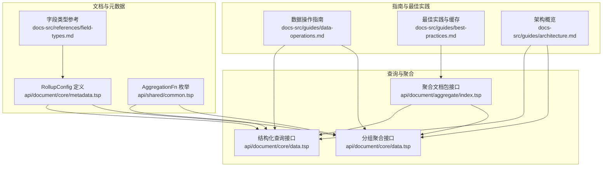
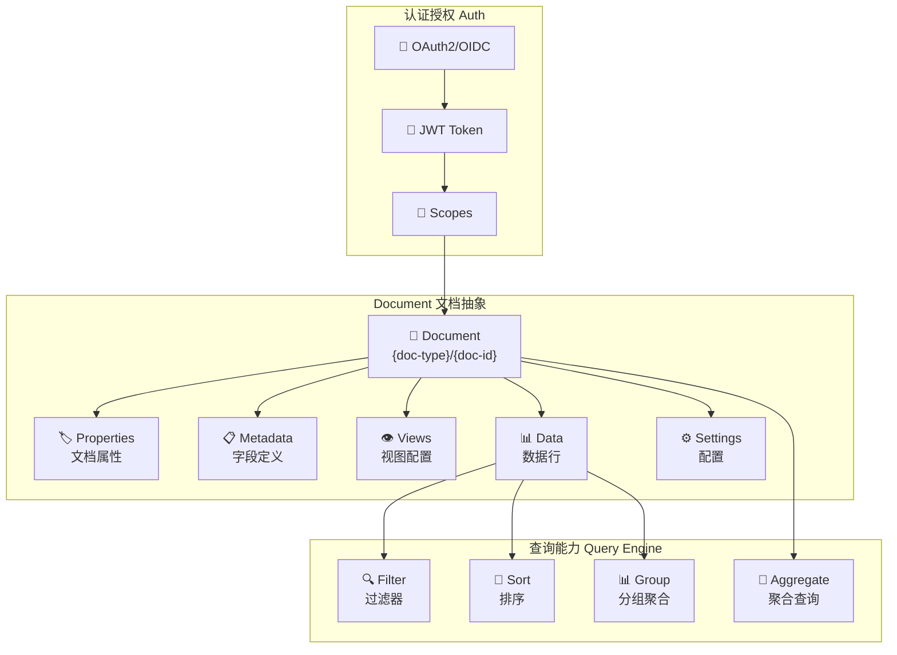
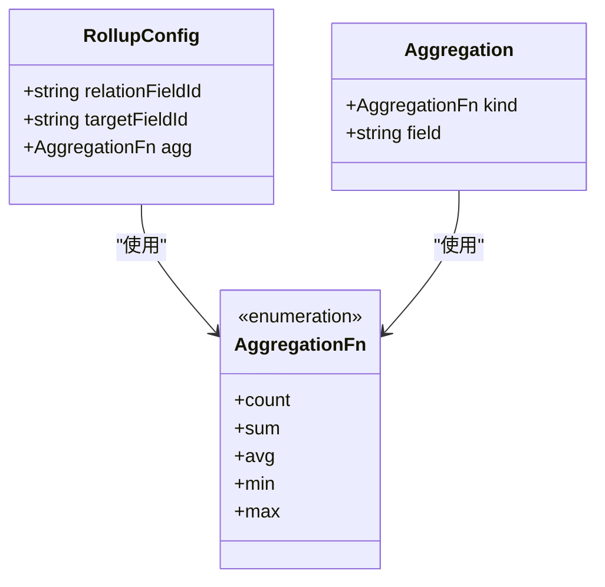
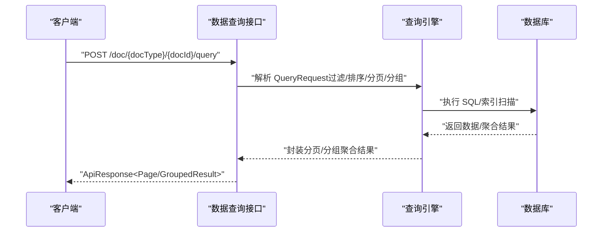
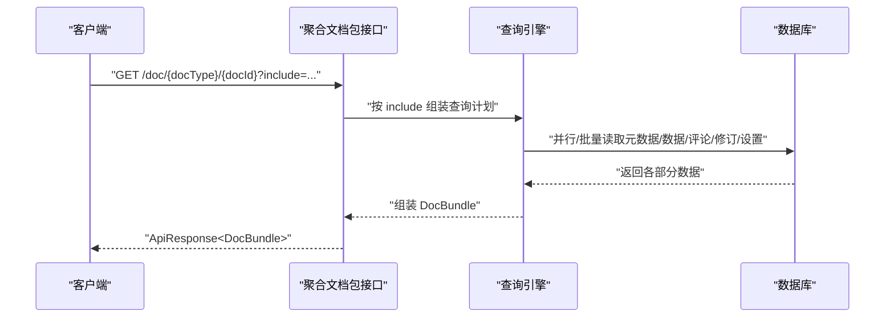
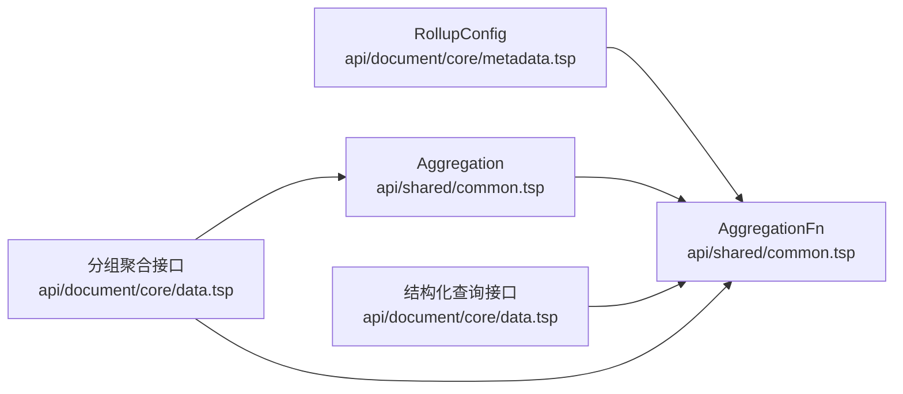

# 汇总字段

<cite>
**本文引用的文件**
- [api/document/core/metadata.tsp](file://api/document/core/metadata.tsp)
- [api/shared/common.tsp](file://api/shared/common.tsp)
- [api/document/core/data.tsp](file://api/document/core/data.tsp)
- [api/document/aggregate/index.tsp](file://api/document/aggregate/index.tsp)
- [docs-src/references/field-types.md](file://docs-src/references/field-types.md)
- [docs-src/guides/data-operations.md](file://docs-src/guides/data-operations.md)
- [docs-src/guides/best-practices.md](file://docs-src/guides/best-practices.md)
- [docs-src/guides/architecture.md](file://docs-src/guides/architecture.md)
</cite>

## 目录
1. [简介](#简介)
2. [项目结构](#项目结构)
3. [核心组件](#核心组件)
4. [架构概览](#架构概览)
5. [详细组件分析](#详细组件分析)
6. [依赖分析](#依赖分析)
7. [性能考虑](#性能考虑)
8. [故障排查指南](#故障排查指南)
9. [结论](#结论)
10. [附录](#附录)

## 简介
本文件聚焦于 NexusBook API 中“汇总字段（Rollup）”的详细功能说明，围绕 RollupConfig 模型的三个核心属性 relationFieldId、targetFieldId 与 agg 聚合函数展开，解释如何通过关联字段定位目标数据集，并对指定字段执行计数、求和、平均值、最大值、最小值等聚合操作。文档还提供实际使用案例（如统计某项目下的任务完成数量、计算客户订单总金额），并讨论服务端聚合查询的执行方式、数据库层面的优化策略与结果缓存机制，以及在大规模数据场景下的分页处理方案。

## 项目结构
与汇总字段直接相关的核心文件分布在以下模块：
- 字段与计算配置：api/document/core/metadata.tsp
- 通用类型与聚合枚举：api/shared/common.tsp
- 数据查询与分组聚合接口：api/document/core/data.tsp
- 聚合文档包接口：api/document/aggregate/index.tsp
- 字段类型参考与示例：docs-src/references/field-types.md
- 数据操作与分页实践：docs-src/guides/data-operations.md
- 最佳实践与缓存策略：docs-src/guides/best-practices.md
- 架构概览与查询能力：docs-src/guides/architecture.md

图表来源
- [api/document/core/metadata.tsp](file://api/document/core/metadata.tsp#L112-L144)
- [api/shared/common.tsp](file://api/shared/common.tsp#L297-L303)
- [api/document/core/data.tsp](file://api/document/core/data.tsp#L329-L441)
- [api/document/aggregate/index.tsp](file://api/document/aggregate/index.tsp#L35-L90)
- [docs-src/references/field-types.md](file://docs-src/references/field-types.md#L316-L351)
- [docs-src/guides/data-operations.md](file://docs-src/guides/data-operations.md#L294-L359)
- [docs-src/guides/best-practices.md](file://docs-src/guides/best-practices.md#L213-L279)
- [docs-src/guides/architecture.md](file://docs-src/guides/architecture.md#L7-L68)

章节来源
- [api/document/core/metadata.tsp](file://api/document/core/metadata.tsp#L112-L144)
- [api/shared/common.tsp](file://api/shared/common.tsp#L297-L303)
- [api/document/core/data.tsp](file://api/document/core/data.tsp#L329-L441)
- [api/document/aggregate/index.tsp](file://api/document/aggregate/index.tsp#L35-L90)
- [docs-src/references/field-types.md](file://docs-src/references/field-types.md#L316-L351)
- [docs-src/guides/data-operations.md](file://docs-src/guides/data-operations.md#L294-L359)
- [docs-src/guides/best-practices.md](file://docs-src/guides/best-practices.md#L213-L279)
- [docs-src/guides/architecture.md](file://docs-src/guides/architecture.md#L7-L68)

## 核心组件
- RollupConfig 模型
  - relationFieldId：关联字段 ID，用于定位“被汇总”的数据行集合
  - targetFieldId：目标字段 ID，用于在被汇总的数据行中选取具体数值字段
  - agg：聚合函数，支持 count、sum、avg、min、max
- AggregationFn 枚举与 Aggregation 模型
  - AggregationFn 定义了可用的聚合函数
  - Aggregation 模型用于分组查询中的聚合定义
- 查询与分页
  - 结构化查询接口支持过滤、排序、分页
  - 分组聚合接口支持多级分组与聚合
  - 聚合文档包接口支持一次性获取元数据、视图、数据、评论、修订与设置

章节来源
- [api/document/core/metadata.tsp](file://api/document/core/metadata.tsp#L112-L144)
- [api/shared/common.tsp](file://api/shared/common.tsp#L297-L303)
- [api/shared/common.tsp](file://api/shared/common.tsp#L305-L317)
- [api/document/core/data.tsp](file://api/document/core/data.tsp#L329-L441)
- [api/document/aggregate/index.tsp](file://api/document/aggregate/index.tsp#L35-L90)

## 架构概览
NexusBook 的查询能力包含过滤、排序、分组与聚合，文档聚合接口支持一次性拉取多种数据，以降低客户端往返次数。架构图展示了文档抽象、核心数据层、协作层、工作流层与查询能力之间的关系。

图表来源
- [docs-src/guides/architecture.md](file://docs-src/guides/architecture.md#L7-L68)

章节来源
- [docs-src/guides/architecture.md](file://docs-src/guides/architecture.md#L7-L68)

## 详细组件分析

### RollupConfig 模型与聚合函数
RollupConfig 用于定义“汇总字段”的计算规则，其三个核心属性如下：
- relationFieldId：关联字段 ID，用于定位“被汇总”的数据行集合
- targetFieldId：目标字段 ID，用于在被汇总的数据行中选取具体数值字段
- agg：聚合函数，支持 count、sum、avg、min、max

图表来源
- [api/document/core/metadata.tsp](file://api/document/core/metadata.tsp#L112-L144)
- [api/shared/common.tsp](file://api/shared/common.tsp#L297-L303)
- [api/shared/common.tsp](file://api/shared/common.tsp#L305-L317)

章节来源
- [api/document/core/metadata.tsp](file://api/document/core/metadata.tsp#L112-L144)
- [api/shared/common.tsp](file://api/shared/common.tsp#L297-L303)
- [api/shared/common.tsp](file://api/shared/common.tsp#L305-L317)

### 字段类型与 rollup 配置示例
字段类型参考文档提供了 rollup 的配置示例与支持的聚合函数列表，便于在元数据中定义汇总字段。

章节来源
- [docs-src/references/field-types.md](file://docs-src/references/field-types.md#L316-L351)

### 结构化查询与分组聚合
- 结构化查询接口支持过滤、排序、分页，适合常规数据查询
- 分组聚合接口支持多级分组与聚合，适合统计分析场景

图表来源
- [api/document/core/data.tsp](file://api/document/core/data.tsp#L329-L441)
- [api/shared/common.tsp](file://api/shared/common.tsp#L179-L203)
- [api/shared/common.tsp](file://api/shared/common.tsp#L334-L357)
- [api/shared/common.tsp](file://api/shared/common.tsp#L470-L497)

章节来源
- [api/document/core/data.tsp](file://api/document/core/data.tsp#L329-L441)
- [api/shared/common.tsp](file://api/shared/common.tsp#L179-L203)
- [api/shared/common.tsp](file://api/shared/common.tsp#L334-L357)
- [api/shared/common.tsp](file://api/shared/common.tsp#L470-L497)

### 聚合文档包接口
聚合文档包接口支持一次性获取元数据、视图、数据、评论、修订与设置，结合 include 参数按需加载，有助于减少网络往返与前端渲染压力。

图表来源
- [api/document/aggregate/index.tsp](file://api/document/aggregate/index.tsp#L35-L90)
- [api/document/aggregate/index.tsp](file://api/document/aggregate/index.tsp#L92-L126)

章节来源
- [api/document/aggregate/index.tsp](file://api/document/aggregate/index.tsp#L35-L90)
- [api/document/aggregate/index.tsp](file://api/document/aggregate/index.tsp#L92-L126)

### 实际使用案例
- 统计某项目下的任务完成数量
  - 在项目文档中定义一个 rollup 字段，relationFieldId 指向“任务”关联字段，targetFieldId 指向“状态”字段，agg 选择 count；当“状态”为“完成”时，可通过过滤器在查询阶段筛选后再聚合，或在 rollup 中按需配置 lookup/rollup 的组合
- 计算客户订单的总金额
  - 在客户文档中定义一个 rollup 字段，relationFieldId 指向“订单”关联字段，targetFieldId 指向“金额”字段，agg 选择 sum；若存在折扣/税费等子项，可在订单明细中再做一层 rollup 或使用分组聚合接口进行多字段聚合

章节来源
- [docs-src/references/field-types.md](file://docs-src/references/field-types.md#L316-L351)
- [api/document/core/metadata.tsp](file://api/document/core/metadata.tsp#L112-L144)

## 依赖分析
RollupConfig 与通用聚合类型的关系如下：
- RollupConfig 使用 AggregationFn 枚举定义聚合函数
- 分组查询使用 Aggregation 模型定义聚合函数与目标字段
- 查询接口（结构化查询与分组聚合）依赖通用的过滤、排序、分页与分组模型

图表来源
- [api/document/core/metadata.tsp](file://api/document/core/metadata.tsp#L112-L144)
- [api/shared/common.tsp](file://api/shared/common.tsp#L297-L303)
- [api/shared/common.tsp](file://api/shared/common.tsp#L305-L317)
- [api/document/core/data.tsp](file://api/document/core/data.tsp#L329-L441)

章节来源
- [api/document/core/metadata.tsp](file://api/document/core/metadata.tsp#L112-L144)
- [api/shared/common.tsp](file://api/shared/common.tsp#L297-L303)
- [api/shared/common.tsp](file://api/shared/common.tsp#L305-L317)
- [api/document/core/data.tsp](file://api/document/core/data.tsp#L329-L441)

## 性能考虑
- 服务端聚合查询的数据库优化策略
  - 使用合适的索引：针对 relationFieldId、targetFieldId 所在字段建立索引，加速关联与过滤
  - 过滤前置：在聚合前通过 filters 缩小数据集，减少聚合计算量
  - 分组裁剪：仅在必要时启用 includeRows，避免返回大量明细数据
  - 批量读取：聚合文档包接口支持一次性拉取多部分数据，减少多次往返
- 结果缓存机制
  - 元数据与视图等静态或低频变化数据可采用短期缓存（如最佳实践中建议的分钟级 TTL）
  - 对于高频但稳定的聚合结果，可考虑在应用层缓存热点查询结果，结合失效策略
- 大规模数据下的分页处理
  - 使用游标分页（cursor）处理深分页，避免 offset 深翻页导致的性能退化
  - 合理设置分页大小（如 20-100），平衡请求次数与响应时间
  - 对于超大数据集，优先使用过滤与分组聚合接口，避免一次性返回全量明细

章节来源
- [docs-src/guides/data-operations.md](file://docs-src/guides/data-operations.md#L294-L359)
- [docs-src/guides/best-practices.md](file://docs-src/guides/best-practices.md#L213-L279)
- [api/document/core/data.tsp](file://api/document/core/data.tsp#L329-L441)

## 故障排查指南
- 版本冲突与并发控制
  - 写操作需携带 requestId，并使用版本号进行乐观锁控制；若出现版本冲突，需重新获取最新数据并重试
- 查询性能问题
  - 检查是否缺少必要的索引；确认 filters 是否合理；避免一次性请求过多 include 部分
- 分页异常
  - 使用游标分页替代深度 offset；确保 cursor 参数正确传递
- 缓存命中率低
  - 检查缓存键与过期时间；对热点数据增加缓存层；避免频繁变更元数据导致缓存失效

章节来源
- [docs-src/guides/best-practices.md](file://docs-src/guides/best-practices.md#L103-L142)
- [docs-src/guides/data-operations.md](file://docs-src/guides/data-operations.md#L294-L359)

## 结论
RollupConfig 通过 relationFieldId、targetFieldId 与 agg 三个关键属性，实现了对关联数据的灵活聚合。结合结构化查询与分组聚合接口，可以在服务端高效完成统计分析；配合过滤、排序、分页与缓存策略，可在大规模数据场景下保持良好的性能与用户体验。建议在设计阶段充分考虑字段索引、查询计划与缓存策略，以获得稳定高效的汇总能力。

## 附录
- 字段类型参考与 rollup 示例
  - 参考路径：docs-src/references/field-types.md
- 数据操作与分页实践
  - 参考路径：docs-src/guides/data-operations.md
- 最佳实践与缓存策略
  - 参考路径：docs-src/guides/best-practices.md
- 架构概览与查询能力
  - 参考路径：docs-src/guides/architecture.md