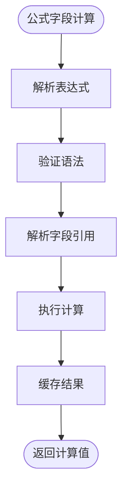
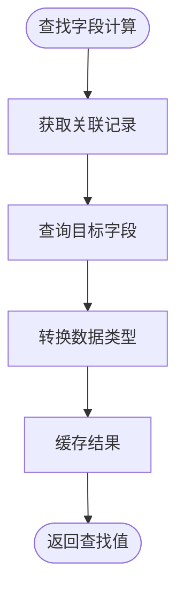
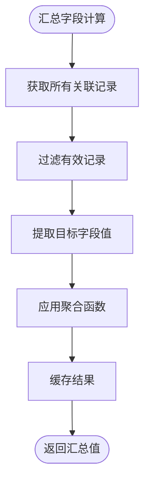
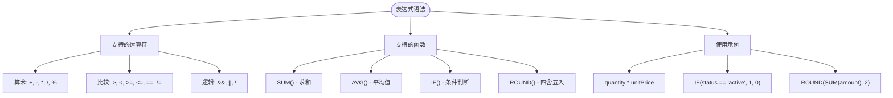
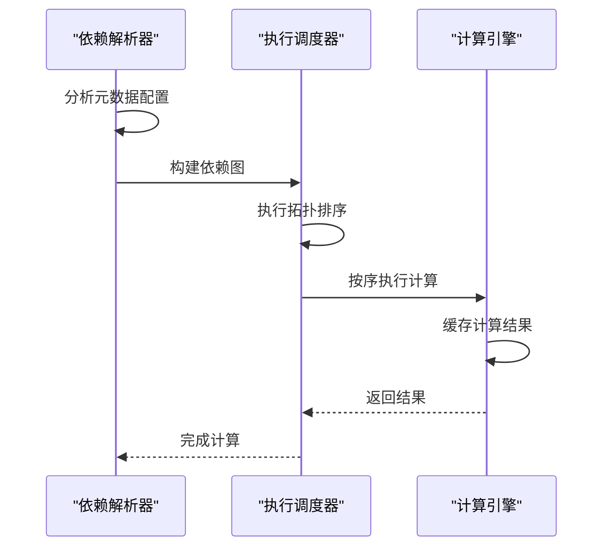
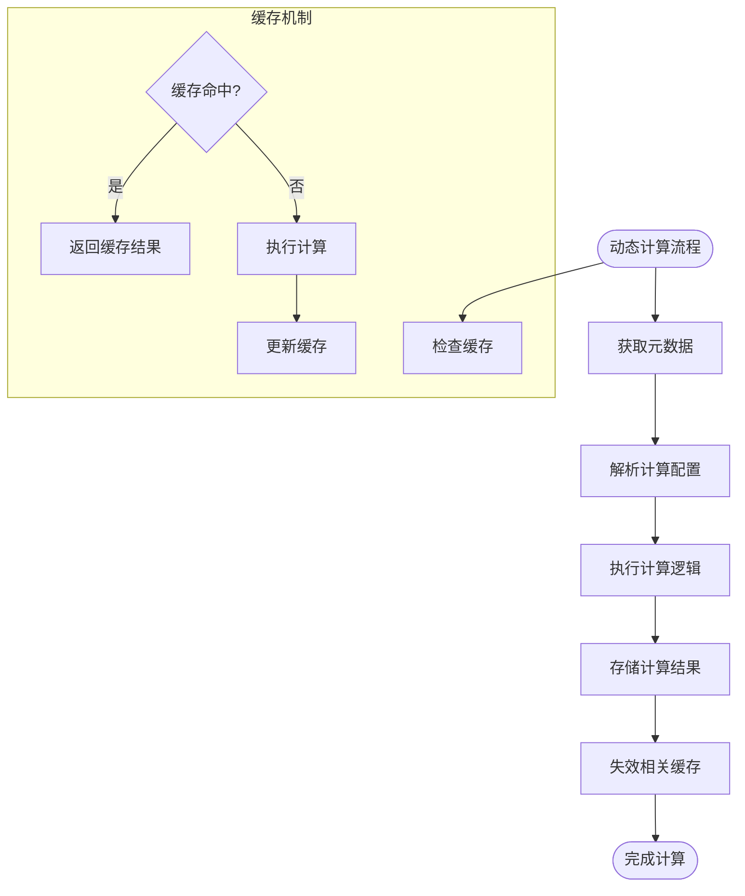
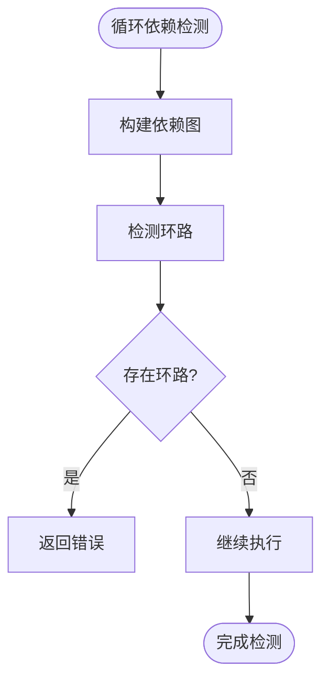

# 计算字段

<cite>
**本文档引用文件**  
- [metadata.tsp](file://api/document/core/metadata.tsp)
- [field-types.md](file://docs-src/references/field-types.md)
- [common.tsp](file://api/shared/common.tsp)
- [data.tsp](file://api/document/core/data.tsp)
- [constants.tsp](file://api/shared/constants.tsp)
- [examples.md](file://docs-src/guides/examples.md)
</cite>

## 目录
1. [引言](#引言)
2. [计算字段类型详解](#计算字段类型详解)
3. [LookupConfig与RollupConfig模型结构](#lookupconfig与rollupconfig模型结构)
4. [计算表达式语法](#计算表达式语法)
5. [依赖关系解析与执行时序](#依赖关系解析与执行时序)
6. [动态计算与缓存机制](#动态计算与缓存机制)
7. [实际业务场景应用](#实际业务场景应用)
8. [性能优化与循环依赖检测](#性能优化与循环依赖检测)
9. [结论](#结论)

## 引言

计算字段是nexusbook-api中实现数据自动化处理的核心功能，允许用户通过配置而非编码的方式实现复杂的数据计算逻辑。系统支持三种主要的计算字段类型：formula（公式）、lookup（查找）和rollup（汇总），这些字段能够自动计算并更新值，极大地提升了数据处理的效率和准确性。计算字段不仅支持基本的算术运算，还能进行跨表关联查询和数据聚合，满足各种复杂的业务需求。

**Section sources**
- [metadata.tsp](file://api/document/core/metadata.tsp#L54-L64)
- [field-types.md](file://docs-src/references/field-types.md#L316-L370)

## 计算字段类型详解

nexusbook-api提供了三种核心计算字段类型，每种类型都有其特定的应用场景和配置方式。

### formula（公式）字段

公式字段允许用户通过定义数学表达式来计算字段值。这种字段类型适用于需要基于同一记录内其他字段进行计算的场景，如计算订单行的小计金额（quantity * unitPrice）。公式字段的配置相对简单，只需要提供一个表达式字符串即可。



**Diagram sources**
- [metadata.tsp](file://api/document/core/metadata.tsp#L94)
- [field-types.md](file://docs-src/references/field-types.md#L352-L362)

### lookup（查找）字段

查找字段用于从关联记录中提取特定字段的值。这种字段类型在处理一对多或一对一关系时非常有用，例如从产品表中查找关联产品的价格。查找字段的配置需要指定关联字段和目标字段。



**Diagram sources**
- [metadata.tsp](file://api/document/core/metadata.tsp#L96)
- [field-types.md](file://docs-src/references/field-types.md#L318-L329)

### rollup（汇总）字段

汇总字段用于对关联记录进行聚合计算，支持计数、求和、平均值、最小值和最大值等聚合函数。这种字段类型在需要统计关联数据的场景中非常有用，如计算订单中所有商品的总金额。汇总字段的配置需要指定关联字段、目标字段和聚合函数。



**Diagram sources**
- [metadata.tsp](file://api/document/core/metadata.tsp#L97)
- [field-types.md](file://docs-src/references/field-types.md#L331-L343)

**Section sources**
- [metadata.tsp](file://api/document/core/metadata.tsp#L94-L98)
- [field-types.md](file://docs-src/references/field-types.md#L316-L370)

## LookupConfig与RollupConfig模型结构

### LookupConfig模型

LookupConfig模型定义了查找字段的配置结构，包含两个核心属性：relationFieldId和targetFieldId。relationFieldId指定了用于建立关联的字段ID，而targetFieldId指定了要从关联记录中提取的字段ID。这种设计使得系统能够精确地定位到需要查找的数据。

```mermaid
classDiagram
class LookupConfig {
+string relationFieldId
+string targetFieldId
}
note right of LookupConfig
用于配置查找字段的模型
relationFieldId : 关联字段ID
targetFieldId : 目标字段ID
end note
```

**Diagram sources**
- [metadata.tsp](file://api/document/core/metadata.tsp#L112-L124)

### RollupConfig模型

RollupConfig模型定义了汇总字段的配置结构，包含三个核心属性：relationFieldId、targetFieldId和agg。前两个属性与LookupConfig相同，用于指定关联和目标字段，而agg属性指定了要使用的聚合函数。聚合函数的类型由AggregationFn枚举定义，确保了类型安全和可扩展性。

```mermaid
classDiagram
class RollupConfig {
+string relationFieldId
+string targetFieldId
+AggregationFn agg
}
class AggregationFn {
+count
+sum
+avg
+min
+max
}
RollupConfig --> AggregationFn : "使用"
note right of RollupConfig
用于配置汇总字段的模型
relationFieldId : 关联字段ID
targetFieldId : 目标字段ID
agg : 聚合函数
end note
```

**Diagram sources**
- [metadata.tsp](file://api/document/core/metadata.tsp#L126-L144)
- [common.tsp](file://api/shared/common.tsp#L297-L303)

**Section sources**
- [metadata.tsp](file://api/document/core/metadata.tsp#L112-L144)
- [common.tsp](file://api/shared/common.tsp#L297-L303)

## 计算表达式语法

### 字段引用

在计算表达式中，字段引用是通过字段ID来实现的。系统会自动解析这些引用并获取相应的字段值。字段引用可以是简单的字段名，也可以包含路径表达式以支持嵌套数据结构。

### 运算符

系统支持多种运算符，包括算术运算符（+、-、*、/、%）、比较运算符（>、<、>=、<=、==、!=）和逻辑运算符（&&、||、!）。这些运算符遵循标准的数学优先级规则，确保计算结果的准确性。

### 函数使用

除了基本的运算符，系统还支持一系列内置函数，如SUM()、AVG()、IF()和ROUND()。这些函数大大扩展了计算表达式的能力，使得复杂的业务逻辑可以通过简单的配置实现。



**Diagram sources**
- [field-types.md](file://docs-src/references/field-types.md#L364-L368)

**Section sources**
- [field-types.md](file://docs-src/references/field-types.md#L364-L368)

## 依赖关系解析与执行时序

### 依赖关系解析

系统在计算字段值之前，会首先解析字段间的依赖关系。这包括直接依赖（如公式字段引用其他字段）和间接依赖（如查找字段依赖于关联字段的值）。依赖关系的解析是通过分析元数据配置完成的，确保了计算的正确性和完整性。

### 执行时序控制

为了确保计算结果的准确性，系统实现了严格的执行时序控制。计算按照拓扑排序的顺序进行，确保所有依赖字段的值在被引用之前已经计算完成。这种机制有效避免了因执行顺序不当导致的计算错误。



**Diagram sources**
- [metadata.tsp](file://api/document/core/metadata.tsp#L94-L98)
- [data.tsp](file://api/document/core/data.tsp#L658-L667)

**Section sources**
- [metadata.tsp](file://api/document/core/metadata.tsp#L94-L98)
- [data.tsp](file://api/document/core/data.tsp#L658-L667)

## 动态计算与缓存机制

### 动态计算流程

服务端根据元数据配置动态计算字段值的过程包括多个步骤：首先获取相关记录的元数据，然后解析计算配置，接着执行相应的计算逻辑，最后将结果存储到相应字段中。这个过程是完全自动化的，用户无需干预。

### 缓存策略

为了提高性能，系统实现了多层次的缓存机制。计算结果会被缓存，避免重复计算。缓存的失效策略基于数据变更事件，确保了数据的一致性和实时性。当关联数据发生变化时，相关的计算字段会自动重新计算并更新缓存。



**Diagram sources**
- [metadata.tsp](file://api/document/core/metadata.tsp#L160-L181)
- [data.tsp](file://api/document/core/data.tsp#L375-L726)

**Section sources**
- [metadata.tsp](file://api/document/core/metadata.tsp#L160-L181)
- [data.tsp](file://api/document/core/data.tsp#L375-L726)

## 实际业务场景应用

### 订单总金额计算

在订单管理系统中，可以使用汇总字段来自动计算订单的总金额。通过配置一个汇总字段，关联到订单项表，并对每个订单项的小计金额进行求和，系统能够自动维护订单的总金额，无需手动计算。

### 跨表数据引用

在库存管理系统中，可以使用查找字段来实现跨表数据引用。例如，产品表中的价格字段可以配置为查找字段，从供应商报价表中自动获取最新的价格信息。这样，当供应商更新报价时，所有相关产品的价格都会自动同步更新。

```mermaid
flowchart LR
subgraph "订单系统"
Order[订单]
OrderItem[订单项]
TotalField[总金额字段]
end
subgraph "库存系统"
Product[产品]
PriceField[价格字段]
Supplier[供应商]
end
Order --> OrderItem : "包含"
Order --> TotalField : "使用汇总"
Product --> PriceField : "使用查找"
PriceField --> Supplier : "引用报价"
```

**Diagram sources**
- [examples.md](file://docs-src/guides/examples.md#L20-L210)
- [field-types.md](file://docs-src/references/field-types.md#L331-L343)

**Section sources**
- [examples.md](file://docs-src/guides/examples.md#L20-L210)

## 性能优化与循环依赖检测

### 性能优化策略

系统采用了多种性能优化策略来确保计算字段的高效执行。这包括批量计算、异步处理和智能缓存。批量计算允许系统一次性处理多个计算任务，减少I/O开销；异步处理确保了计算不会阻塞主线程；智能缓存则通过预测和预计算来进一步提升性能。

### 循环依赖检测

为了避免因配置错误导致的无限循环计算，系统实现了循环依赖检测机制。在解析依赖关系时，系统会检查是否存在循环引用，如果发现循环依赖，将阻止计算执行并返回错误信息。这种机制确保了系统的稳定性和可靠性。



**Diagram sources**
- [data.tsp](file://api/document/core/data.tsp#L658-L667)
- [metadata.tsp](file://api/document/core/metadata.tsp#L94-L98)

**Section sources**
- [data.tsp](file://api/document/core/data.tsp#L658-L667)
- [metadata.tsp](file://api/document/core/metadata.tsp#L94-L98)

## 结论

nexusbook-api的计算字段功能提供了一套强大而灵活的数据自动化处理机制。通过formula、lookup和rollup三种计算字段类型，结合精心设计的LookupConfig和RollupConfig模型，系统能够满足各种复杂的业务需求。计算表达式的丰富语法支持、精确的依赖关系解析、高效的动态计算与缓存机制，以及完善的性能优化和循环依赖检测，共同构成了一个稳定可靠的计算引擎。这些功能不仅提升了数据处理的效率，还大大降低了业务逻辑实现的复杂度，为用户提供了卓越的使用体验。