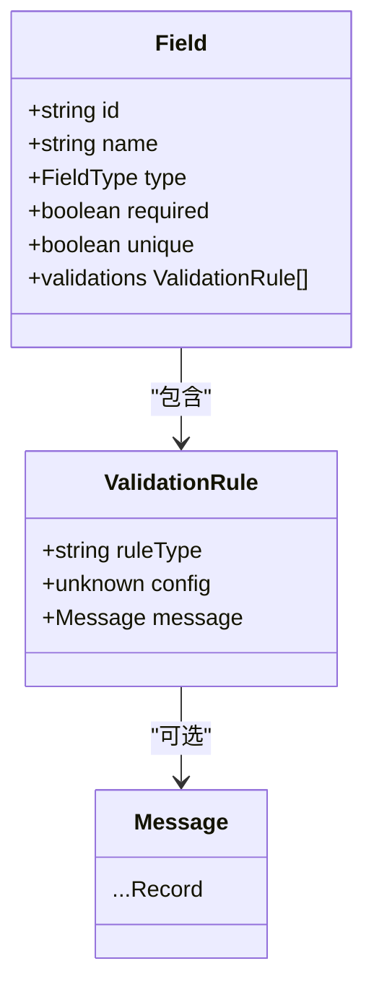
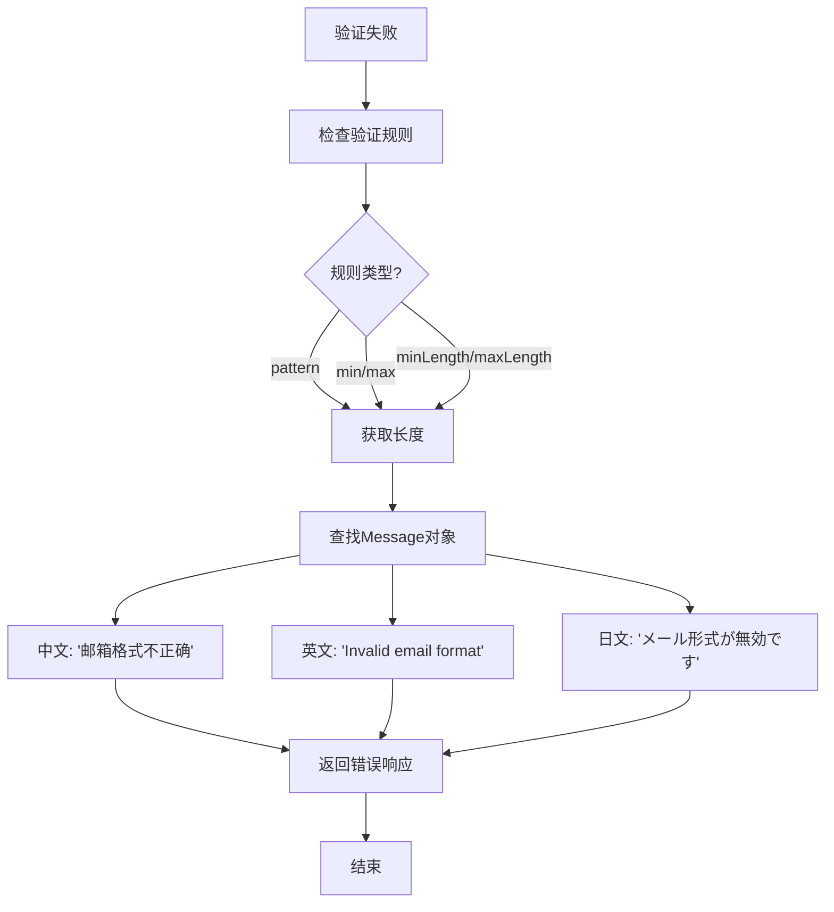

# 常见验证规则

<cite>
**本文档引用的文件**   
- [metadata.tsp](file://api/document/core/metadata.tsp)
- [common.tsp](file://api/shared/common.tsp)
- [models.tsp](file://api/tenant/models.tsp)
- [data.tsp](file://api/document/core/data.tsp)
</cite>

## 目录
1. [简介](#简介)
2. [核心验证规则类型](#核心验证规则类型)
3. [验证规则配置方法](#验证规则配置方法)
4. [多语言错误提示](#多语言错误提示)
5. [实际应用示例](#实际应用示例)

## 简介

NexusBook.API 支持在字段级别定义丰富的验证规则，确保数据的完整性和一致性。这些验证规则通过 `validations` 数组在 `Field` 模型中声明，每个规则包含规则类型、配置参数和多语言错误消息。本指南系统化整理了支持的常见验证规则类型及其配置方法。

**Section sources**
- [metadata.tsp](file://api/document/core/metadata.tsp#L54-L109)

## 核心验证规则类型

NexusBook.API 支持多种核心验证规则，涵盖数据完整性、格式、范围和唯一性等关键场景。

### 必填校验 (required)
确保字段值不为空。虽然 `required` 是一个独立的布尔字段，但它是最基础的验证形式。

### 格式校验 (pattern)
通过正则表达式验证字段值的格式，适用于邮箱、手机号等需要特定格式的字段。

### 数值范围校验 (min/max)
限制数值类型字段（如 `number`, `currency`）的取值范围，确保数据在合理区间内。

### 字符串长度限制 (length)
限制文本类型字段（如 `text`, `long_text`）的字符长度，防止数据过长。

### 唯一性检查 (unique)
确保字段值在整个文档中具有唯一性，常用于ID、编号等字段。

**Section sources**
- [metadata.tsp](file://api/document/core/metadata.tsp#L75-L79)

## 验证规则配置方法

验证规则在 `Field` 模型的 `validations` 数组中进行声明。每个验证规则对象包含 `ruleType`、`config` 和可选的 `message` 字段。



**Diagram sources **
- [metadata.tsp](file://api/document/core/metadata.tsp#L65-L109)
- [common.tsp](file://api/shared/common.tsp#L69-L77)

### ruleType 字符串值

`ruleType` 字段定义了验证规则的类型，常见的值包括：
- `"required"`: 必填校验
- `"pattern"`: 格式校验
- `"min"`: 最小值校验
- `"max"`: 最大值校验
- `"minLength"`: 最小长度校验
- `"maxLength"`: 最大长度校验

### config 对象结构

`config` 字段的结构根据 `ruleType` 的不同而变化：
- 对于 `"pattern"` 规则，`config` 是一个包含正则表达式的字符串。
- 对于 `"min"` 和 `"max"` 规则，`config` 是一个数值。
- 对于 `"minLength"` 和 `"maxLength"` 规则，`config` 是一个整数。

**Section sources**
- [metadata.tsp](file://api/document/core/metadata.tsp#L100-L105)

## 多语言错误提示

NexusBook.API 使用 `NexusBook.Api.Common.Message` 类型为验证失败场景提供多语言错误提示。`Message` 是一个以语言代码为键的动态对象，支持任意语言。



**Diagram sources **
- [common.tsp](file://api/shared/common.tsp#L69-L77)
- [metadata.tsp](file://api/document/core/metadata.tsp#L108-L109)

### Message 类型定义

`Message` 类型定义如下，允许为不同语言提供定制化的错误信息：

```typescript
model Message {
    ...Record<string>;
}
```

**Section sources**
- [common.tsp](file://api/shared/common.tsp#L69-L77)

## 实际应用示例

以下示例展示了如何在 `Field` 模型中配置各种验证规则。

### 邮箱格式验证

配置一个邮箱字段，使用正则表达式验证格式，并提供中英文错误提示：

```json
{
  "id": "email",
  "name": "邮箱",
  "type": "text",
  "validations": [
    {
      "ruleType": "pattern",
      "config": "^[a-zA-Z0-9._%+-]+@[a-zA-Z0-9.-]+\\.[a-zA-Z]{2,}$",
      "message": {
        "zh": "请输入有效的邮箱地址",
        "en": "Please enter a valid email address"
      }
    }
  ]
}
```

### 数值范围验证

配置一个价格字段，限制其值在 0 到 10000 之间：

```json
{
  "id": "price",
  "name": "价格",
  "type": "currency",
  "validations": [
    {
      "ruleType": "min",
      "config": 0,
      "message": {
        "zh": "价格不能为负数",
        "en": "Price cannot be negative"
      }
    },
    {
      "ruleType": "max",
      "config": 10000,
      "message": {
        "zh": "价格不能超过 10000",
        "en": "Price cannot exceed 10000"
      }
    }
  ]
}
```

### 字符串长度限制

配置一个产品名称字段，限制其长度在 2 到 50 个字符之间：

```json
{
  "id": "productName",
  "name": "产品名称",
  "type": "text",
  "validations": [
    {
      "ruleType": "minLength",
      "config": 2,
      "message": {
        "zh": "产品名称至少需要 2 个字符",
        "en": "Product name must be at least 2 characters"
      }
    },
    {
      "ruleType": "maxLength",
      "config": 50,
      "message": {
        "zh": "产品名称不能超过 50 个字符",
        "en": "Product name cannot exceed 50 characters"
      }
    }
  ]
}
```

**Section sources**
- [metadata.tsp](file://api/document/core/metadata.tsp#L99-L109)