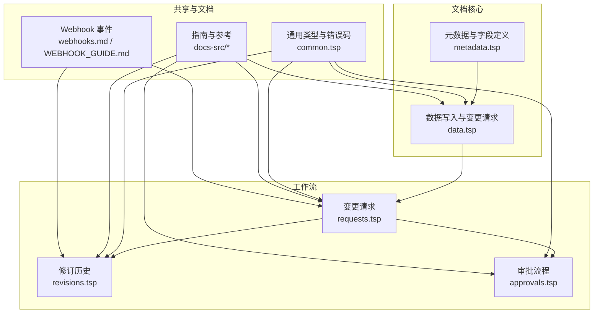
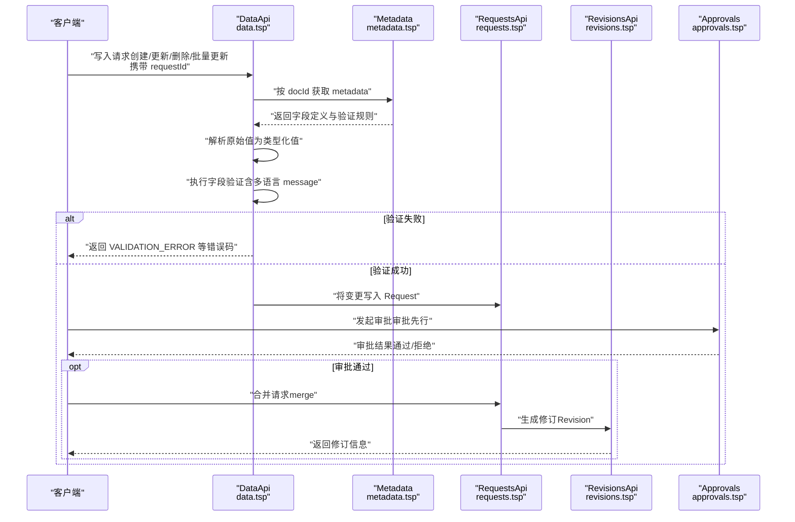
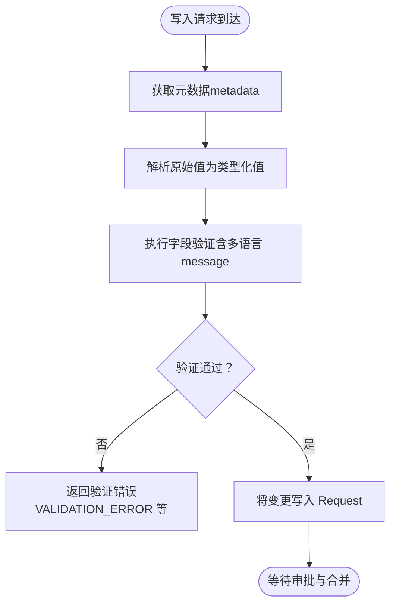
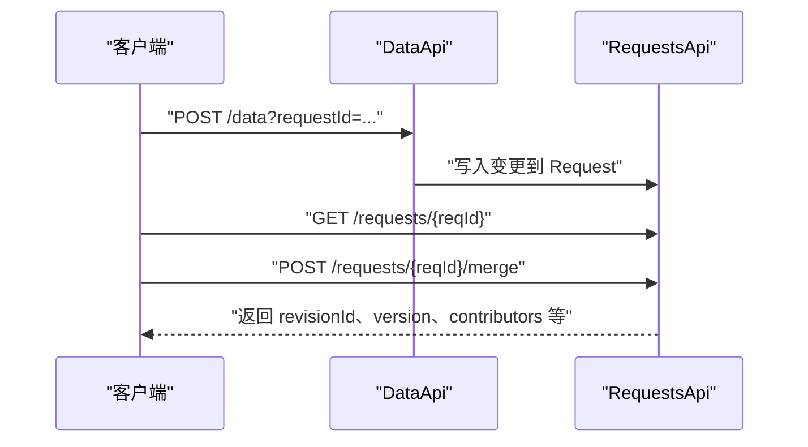
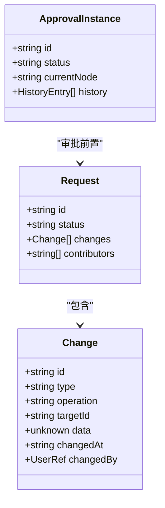
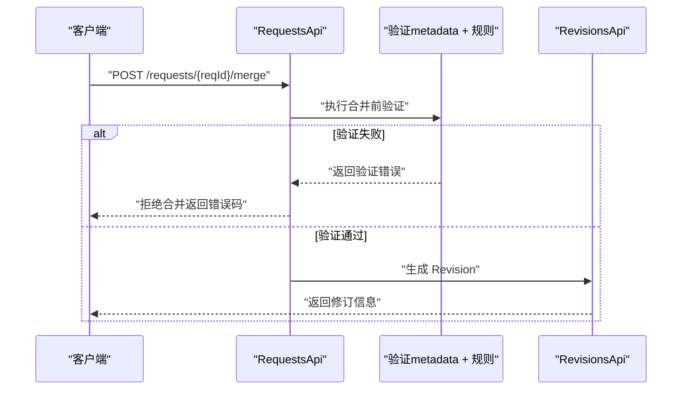
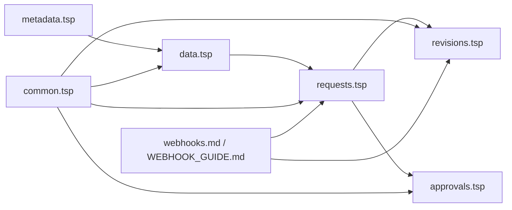

# 执行机制

<cite>
**本文引用的文件**
- [api/document/core/metadata.tsp](file://api/document/core/metadata.tsp)
- [api/document/core/data.tsp](file://api/document/core/data.tsp)
- [api/document/workflow/requests.tsp](file://api/document/workflow/requests.tsp)
- [api/document/workflow/revisions.tsp](file://api/document/workflow/revisions.tsp)
- [api/document/workflow/approvals.tsp](file://api/document/workflow/approvals.tsp)
- [api/shared/common.tsp](file://api/shared/common.tsp)
- [docs-src/guides/document-model.md](file://docs-src/guides/document-model.md)
- [docs-src/guides/data-operations.md](file://docs-src/guides/data-operations.md)
- [docs-src/references/error-codes.md](file://docs-src/references/error-codes.md)
- [docs-src/guides/webhooks.md](file://docs-src/guides/webhooks.md)
- [api/extensions/webhooks/WEBHOOK_GUIDE.md](file://api/extensions/webhooks/WEBHOOK_GUIDE.md)
</cite>

## 目录
1. [引言](#引言)
2. [项目结构](#项目结构)
3. [核心组件](#核心组件)
4. [架构总览](#架构总览)
5. [详细组件分析](#详细组件分析)
6. [依赖分析](#依赖分析)
7. [性能考虑](#性能考虑)
8. [故障排查指南](#故障排查指南)
9. [结论](#结论)

## 引言
本文件聚焦于 nexusbook-api 中“验证规则”的执行机制与生命周期，围绕以下关键目标展开：
- 明确验证规则在数据写入生命周期中的触发时机，特别是在通过 Request 进行变更请求时的验证执行点；
- 说明系统如何在接收到包含 requestId 的写操作（创建/更新/删除）时，自动根据 Metadata 中的字段验证规则对数据进行校验；
- 阐述验证失败时的处理策略，包括返回详细的错误信息（包含多语言 message）、阻止变更请求的合并（merge）以及在 Revision 历史中记录验证失败事件；
- 结合文档模型指南中描述的“审批先行”原则，解释验证规则如何作为工作流审批前的守门人，确保只有符合业务规则的数据才能进入审批流程。

## 项目结构
本项目采用基于领域与职责的模块化组织方式，验证规则与工作流紧密耦合：
- 元数据与字段定义：位于 core/metadata.tsp，定义字段类型、必填、唯一、只读以及验证规则（含多语言 message）；
- 数据写入与变更请求：位于 core/data.tsp，所有写操作（创建/更新/删除/批量更新）均进入 Request；
- 变更请求与合并：位于 workflow/requests.tsp，定义 Request 的状态、变更集与合并行为；
- 修订历史与审计：位于 workflow/revisions.tsp，合并后生成 Revision，记录变更操作、贡献者与统计；
- 审批流程：位于 workflow/approvals.tsp，定义审批实例与决策；
- 错误码与通用类型：位于 shared/common.tsp；
- 文档模型与数据操作指南：位于 docs-src/guides 下；
- Webhook 事件：位于 docs-src/guides/webhooks.md 与 api/extensions/webhooks/WEBHOOK_GUIDE.md。

图表来源
- [api/document/core/metadata.tsp](file://api/document/core/metadata.tsp#L1-L211)
- [api/document/core/data.tsp](file://api/document/core/data.tsp#L1-L726)
- [api/document/workflow/requests.tsp](file://api/document/workflow/requests.tsp#L1-L391)
- [api/document/workflow/revisions.tsp](file://api/document/workflow/revisions.tsp#L1-L547)
- [api/document/workflow/approvals.tsp](file://api/document/workflow/approvals.tsp#L1-L156)
- [api/shared/common.tsp](file://api/shared/common.tsp#L80-L151)
- [docs-src/guides/document-model.md](file://docs-src/guides/document-model.md#L260-L300)
- [docs-src/guides/data-operations.md](file://docs-src/guides/data-operations.md#L193-L224)
- [docs-src/guides/webhooks.md](file://docs-src/guides/webhooks.md#L1-L80)
- [api/extensions/webhooks/WEBHOOK_GUIDE.md](file://api/extensions/webhooks/WEBHOOK_GUIDE.md#L1-L80)

章节来源
- [api/document/core/metadata.tsp](file://api/document/core/metadata.tsp#L1-L211)
- [api/document/core/data.tsp](file://api/document/core/data.tsp#L1-L726)
- [api/document/workflow/requests.tsp](file://api/document/workflow/requests.tsp#L1-L391)
- [api/document/workflow/revisions.tsp](file://api/document/workflow/revisions.tsp#L1-L547)
- [api/document/workflow/approvals.tsp](file://api/document/workflow/approvals.tsp#L1-L156)
- [api/shared/common.tsp](file://api/shared/common.tsp#L80-L151)
- [docs-src/guides/document-model.md](file://docs-src/guides/document-model.md#L260-L300)
- [docs-src/guides/data-operations.md](file://docs-src/guides/data-operations.md#L193-L224)
- [docs-src/guides/webhooks.md](file://docs-src/guides/webhooks.md#L1-L80)
- [api/extensions/webhooks/WEBHOOK_GUIDE.md](file://api/extensions/webhooks/WEBHOOK_GUIDE.md#L1-L80)

## 核心组件
- 元数据与字段验证规则
  - 字段模型包含 validations 数组，每条规则包含 ruleType、config 与多语言 message；
  - 服务端在批量更新与行级写入时，依据 docId 获取 metadata，并按字段定义进行类型解析与验证；
- 变更请求（Request）
  - 所有写操作（创建/更新/删除/批量更新）均进入 Request，不直接写入生产数据；
  - Request 支持多人协同编辑，合并（merge）后才真正生效；
- 修订历史（Revision）
  - 合并时生成 Revision，记录变更操作、贡献者与统计；
- 审批流程（Approval）
  - 审批先行原则：变更仅在审批通过后进入合并阶段；
- 错误码与消息
  - 通用错误码覆盖字段类型不匹配、约束违反、请求冲突等；
  - 验证失败对应 VALIDATION_ERROR，配合多语言 message 返回给客户端。

章节来源
- [api/document/core/metadata.tsp](file://api/document/core/metadata.tsp#L65-L110)
- [api/document/core/data.tsp](file://api/document/core/data.tsp#L538-L725)
- [api/document/workflow/requests.tsp](file://api/document/workflow/requests.tsp#L244-L390)
- [api/document/workflow/revisions.tsp](file://api/document/workflow/revisions.tsp#L158-L314)
- [api/document/workflow/approvals.tsp](file://api/document/workflow/approvals.tsp#L1-L156)
- [api/shared/common.tsp](file://api/shared/common.tsp#L80-L151)
- [docs-src/references/error-codes.md](file://docs-src/references/error-codes.md#L131-L140)

## 架构总览
下图展示了“写入—验证—请求—审批—合并—修订”的闭环流程，强调验证规则在“请求阶段”与“合并阶段”的关键作用。

图表来源
- [api/document/core/data.tsp](file://api/document/core/data.tsp#L538-L725)
- [api/document/core/metadata.tsp](file://api/document/core/metadata.tsp#L160-L210)
- [api/document/workflow/requests.tsp](file://api/document/workflow/requests.tsp#L244-L390)
- [api/document/workflow/revisions.tsp](file://api/document/workflow/revisions.tsp#L158-L314)
- [api/document/workflow/approvals.tsp](file://api/document/workflow/approvals.tsp#L96-L156)

## 详细组件分析

### 验证规则的数据模型与触发点
- 字段验证规则结构
  - Field.validations 为数组，每条规则包含 ruleType、config 与 message（多语言）；
  - 该结构为服务端执行验证提供了统一入口。
- 触发时机
  - 写入阶段：在批量更新与行级写入时，服务端先获取 metadata，再将原始值转换为类型化值并执行验证；
  - 请求阶段：即使验证通过，变更仍进入 Request，不直接写入生产数据；
  - 合并阶段：合并前的最终一致性检查与冲突检测，若存在冲突或验证失败，阻止合并。

图表来源
- [api/document/core/metadata.tsp](file://api/document/core/metadata.tsp#L65-L110)
- [api/document/core/data.tsp](file://api/document/core/data.tsp#L642-L657)

章节来源
- [api/document/core/metadata.tsp](file://api/document/core/metadata.tsp#L65-L110)
- [api/document/core/data.tsp](file://api/document/core/data.tsp#L642-L657)

### 写入生命周期与 Request 的作用
- 写入生命周期
  - 所有写操作（创建/更新/删除/批量更新）均携带 requestId；
  - 服务端解析并写入 Request，不直接写入生产数据；
  - 多人可在同一 Request 协同编辑；
  - 审批通过后，Request 合并（merge）才真正生效；
- Request 的状态与变更集
  - Request.status 支持 open/merged/closed；
  - Request.changes 记录变更项（类型、操作、目标、数据、时间、人员）；
- 合并与冲突检测
  - 合并接口支持 squash、message、deleteBranch 等选项；
  - 提供冲突检查接口，用于在合并前发现潜在冲突。

图表来源
- [api/document/core/data.tsp](file://api/document/core/data.tsp#L538-L725)
- [api/document/workflow/requests.tsp](file://api/document/workflow/requests.tsp#L202-L390)

章节来源
- [api/document/core/data.tsp](file://api/document/core/data.tsp#L538-L725)
- [api/document/workflow/requests.tsp](file://api/document/workflow/requests.tsp#L202-L390)
- [docs-src/guides/document-model.md](file://docs-src/guides/document-model.md#L267-L272)
- [docs-src/guides/data-operations.md](file://docs-src/guides/data-operations.md#L213-L224)

### 审批先行原则与验证守门人
- 审批先行
  - Request 合并前必须经过审批流程；
  - 审批实例包含状态、当前节点、历史记录等；
- 验证作为守门人
  - 验证失败将阻止变更进入 Request 或合并阶段；
  - 若合并后发现验证失败（例如冲突导致的不一致），系统应阻止合并并返回错误；
  - 合并成功后生成 Revision，记录变更操作与贡献者，便于审计与回溯。

图表来源
- [api/document/workflow/requests.tsp](file://api/document/workflow/requests.tsp#L39-L81)
- [api/document/workflow/requests.tsp](file://api/document/workflow/requests.tsp#L83-L200)
- [api/document/workflow/approvals.tsp](file://api/document/workflow/approvals.tsp#L40-L94)

章节来源
- [api/document/workflow/approvals.tsp](file://api/document/workflow/approvals.tsp#L1-L156)
- [api/document/workflow/requests.tsp](file://api/document/workflow/requests.tsp#L1-L200)

### 修订历史与验证失败记录
- 合并生成修订
  - 合并请求后生成 Revision，包含变更操作集合、贡献者、统计等；
- 验证失败事件记录
  - 若验证失败导致请求无法合并或被拒绝，应在 Revision 中体现为“未生效变更”或“拒绝合并”；
  - Webhook 事件可用于通知外部系统（如审批系统）验证失败导致的拒绝合并。

图表来源
- [api/document/workflow/revisions.tsp](file://api/document/workflow/revisions.tsp#L158-L314)
- [api/document/workflow/requests.tsp](file://api/document/workflow/requests.tsp#L244-L390)
- [docs-src/guides/webhooks.md](file://docs-src/guides/webhooks.md#L1-L80)
- [api/extensions/webhooks/WEBHOOK_GUIDE.md](file://api/extensions/webhooks/WEBHOOK_GUIDE.md#L1-L80)

章节来源
- [api/document/workflow/revisions.tsp](file://api/document/workflow/revisions.tsp#L158-L314)
- [docs-src/guides/webhooks.md](file://docs-src/guides/webhooks.md#L1-L80)
- [api/extensions/webhooks/WEBHOOK_GUIDE.md](file://api/extensions/webhooks/WEBHOOK_GUIDE.md#L1-L80)

### 错误处理与多语言消息
- 错误码
  - 通用错误码覆盖字段类型不匹配、约束违反、请求冲突等；
  - 验证失败对应 VALIDATION_ERROR；
- 多语言消息
  - Field.validations.message 支持多语言 message，服务端在验证失败时返回给客户端；
- Webhook 事件
  - request_closed、request_merged 等事件可用于通知外部系统验证失败导致的拒绝合并。

章节来源
- [api/shared/common.tsp](file://api/shared/common.tsp#L80-L151)
- [docs-src/references/error-codes.md](file://docs-src/references/error-codes.md#L131-L140)
- [api/document/core/metadata.tsp](file://api/document/core/metadata.tsp#L99-L110)
- [docs-src/guides/webhooks.md](file://docs-src/guides/webhooks.md#L1-L80)
- [api/extensions/webhooks/WEBHOOK_GUIDE.md](file://api/extensions/webhooks/WEBHOOK_GUIDE.md#L1-L80)

## 依赖分析
- 组件耦合
  - data.tsp 依赖 metadata.tsp（获取字段定义与验证规则）；
  - requests.tsp 依赖 data.tsp 的写入接口与变更模型；
  - revisions.tsp 依赖 requests.tsp 的合并结果；
  - approvals.tsp 与 requests.tsp 协同，实现“审批先行”；
  - common.tsp 为各模块提供通用类型与错误码。
- 外部集成
  - Webhook 事件用于通知外部系统（如审批系统）请求合并、关闭等状态变化。

图表来源
- [api/document/core/metadata.tsp](file://api/document/core/metadata.tsp#L1-L211)
- [api/document/core/data.tsp](file://api/document/core/data.tsp#L1-L726)
- [api/document/workflow/requests.tsp](file://api/document/workflow/requests.tsp#L1-L391)
- [api/document/workflow/revisions.tsp](file://api/document/workflow/revisions.tsp#L1-L547)
- [api/document/workflow/approvals.tsp](file://api/document/workflow/approvals.tsp#L1-L156)
- [api/shared/common.tsp](file://api/shared/common.tsp#L80-L151)
- [docs-src/guides/webhooks.md](file://docs-src/guides/webhooks.md#L1-L80)
- [api/extensions/webhooks/WEBHOOK_GUIDE.md](file://api/extensions/webhooks/WEBHOOK_GUIDE.md#L1-L80)

章节来源
- [api/document/core/metadata.tsp](file://api/document/core/metadata.tsp#L1-L211)
- [api/document/core/data.tsp](file://api/document/core/data.tsp#L1-L726)
- [api/document/workflow/requests.tsp](file://api/document/workflow/requests.tsp#L1-L391)
- [api/document/workflow/revisions.tsp](file://api/document/workflow/revisions.tsp#L1-L547)
- [api/document/workflow/approvals.tsp](file://api/document/workflow/approvals.tsp#L1-L156)
- [api/shared/common.tsp](file://api/shared/common.tsp#L80-L151)
- [docs-src/guides/webhooks.md](file://docs-src/guides/webhooks.md#L1-L80)
- [api/extensions/webhooks/WEBHOOK_GUIDE.md](file://api/extensions/webhooks/WEBHOOK_GUIDE.md#L1-L80)

## 性能考虑
- 元数据缓存
  - 在高频写入场景下，建议对 metadata 进行缓存，减少重复查询；
- 批量更新优化
  - 批量更新接口支持多目标与多值，服务端按字段定义解析与验证，建议客户端尽量减少不必要的字段更新；
- 合并前验证
  - 合并前的冲突检测与验证应尽可能轻量化，避免阻塞主线程；
- Webhook 幂等
  - Webhook 接收端应保证幂等处理，避免重复消费导致的副作用。

## 故障排查指南
- 常见验证错误
  - 字段类型不匹配、必填字段缺失、约束违反、验证失败等；
- 定位步骤
  - 检查请求体中的原始值是否符合字段类型定义；
  - 确认 requestId 是否正确，变更是否已写入 Request；
  - 若合并失败，检查冲突检测结果与审批状态；
- 建议
  - 使用 includeChanges 参数预览 Request 中的变更效果；
  - 通过 revisions 接口查看历史变更与统计，定位问题。

章节来源
- [docs-src/references/error-codes.md](file://docs-src/references/error-codes.md#L121-L203)
- [api/document/core/data.tsp](file://api/document/core/data.tsp#L375-L418)
- [api/document/workflow/revisions.tsp](file://api/document/workflow/revisions.tsp#L316-L475)

## 结论
- 验证规则在 nexusbook-api 中贯穿“写入—请求—审批—合并—修订”的全生命周期；
- 写入阶段即执行字段验证，验证失败将阻止变更进入 Request；
- 审批先行原则确保只有符合业务规则的数据才能进入合并阶段；
- 合并后生成修订，记录变更与贡献者，便于审计与回溯；
- 多语言 message 与通用错误码为客户端提供清晰的错误反馈；
- Webhook 事件可用于外部系统感知验证失败导致的拒绝合并，实现跨系统的协同与通知。