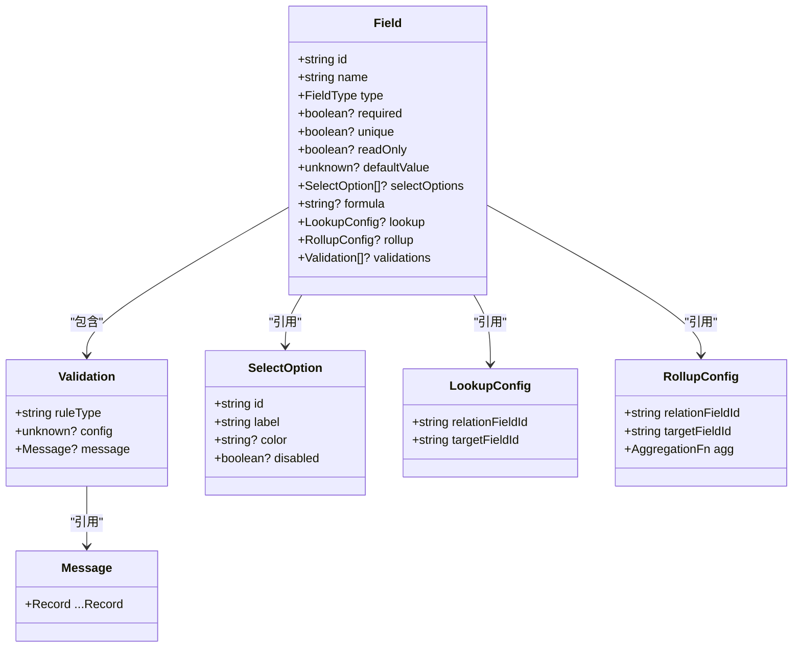
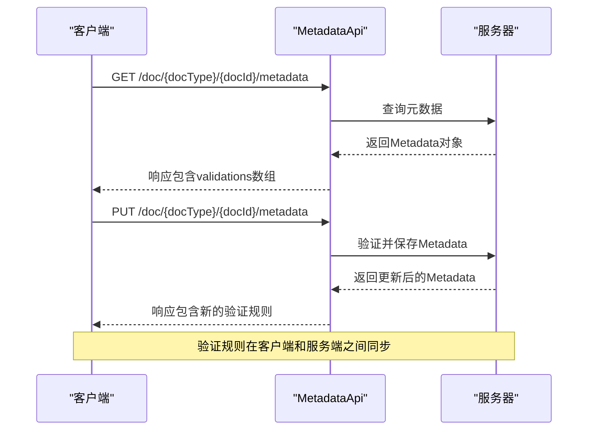
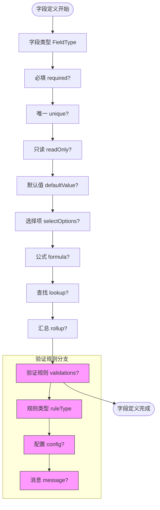
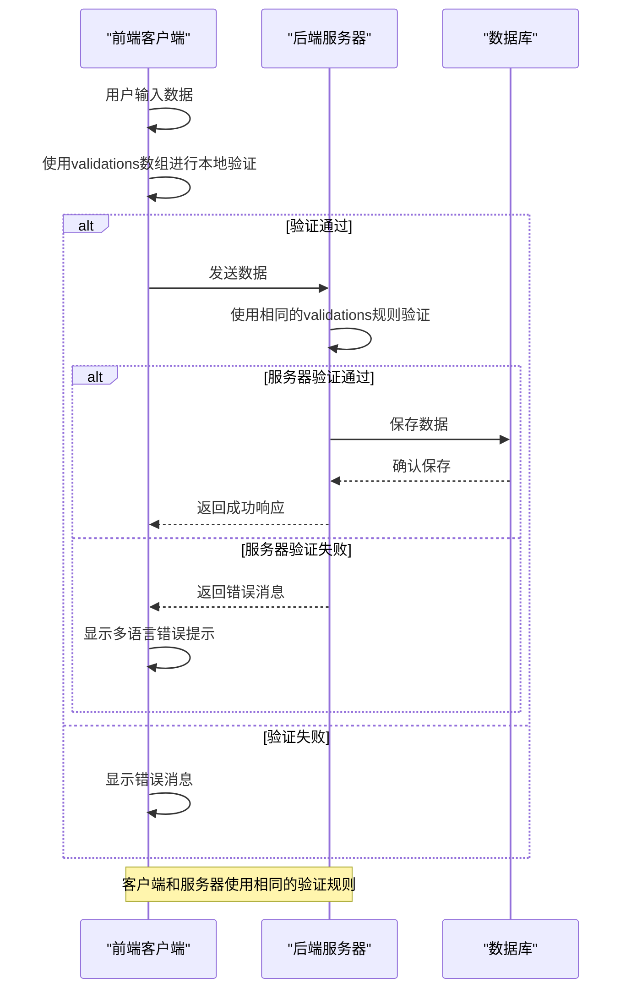
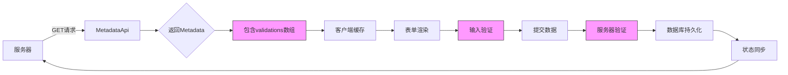

# 规则定义

<cite>
**本文档引用的文件**
- [metadata.tsp](file://api/document/core/metadata.tsp#L54-L109)
- [common.tsp](file://api/shared/common.tsp#L69-L77)
- [i18n.md](file://docs-src/references/i18n.md)
- [field-types.md](file://docs-src/references/field-types.md)
</cite>

## 目录
1. [引言](#引言)
2. [验证规则结构设计](#验证规则结构设计)
3. [核心字段详解](#核心字段详解)
4. [API层面的规则声明](#apilevel的规则声明)
5. [客户端与服务器端一致性](#客户端与服务器端一致性)
6. [最佳实践与示例](#最佳实践与示例)

## 引言
NexusBook API 提供了一套完整的字段级验证机制，通过在 `Field` 模型中定义 `validations` 数组来实现复杂的验证逻辑。这套机制不仅支持多种验证规则类型，还通过多语言消息系统确保了国际化支持，为客户端表单验证和服务器端数据校验提供了一致的规则基础。

**Section sources**
- [metadata.tsp](file://api/document/core/metadata.tsp#L8-L19)

## 验证规则结构设计
验证规则的设计基于 `Field` 模型中的 `validations` 数组，每个验证规则由三个核心部分组成：`ruleType`（规则类型）、`config`（配置参数）和 `message`（错误消息）。这种设计模式允许灵活地组合多种验证规则，并为每种规则提供必要的配置和本地化的错误提示。



**Diagram sources**
- [metadata.tsp](file://api/document/core/metadata.tsp#L65-L109)
- [common.tsp](file://api/shared/common.tsp#L69-L77)

**Section sources**
- [metadata.tsp](file://api/document/core/metadata.tsp#L54-L109)

## 核心字段详解
验证规则的核心由三个字段构成，它们共同定义了验证的逻辑、参数和用户反馈。

### ruleType（规则类型）
`ruleType` 字段用于标识不同的验证逻辑类型。它是一个字符串值，代表了具体的验证规则。常见的规则类型包括：

- `required`：必填验证
- `pattern`：正则表达式匹配
- `range`：数值范围验证
- `length`：长度限制
- `unique`：唯一性验证

这些规则类型在系统中被预定义并实现相应的验证逻辑，开发者可以通过简单的字符串标识来启用特定的验证功能。

**Section sources**
- [metadata.tsp](file://api/document/core/metadata.tsp#L101-L102)

### config（配置参数）
`config` 字段提供了规则执行所需的参数配置。由于不同规则需要的参数类型各异，该字段被定义为 `unknown` 类型，以支持灵活的数据结构。

对于不同的 `ruleType`，`config` 的结构也有所不同：
- 当 `ruleType` 为 `pattern` 时，`config` 包含正则表达式字符串
- 当 `ruleType` 为 `range` 时，`config` 包含最小值和最大值
- 当 `ruleType` 为 `length` 时，`config` 包含最小长度和最大长度

这种设计使得验证系统既能保持类型安全，又能适应各种复杂的配置需求。

**Section sources**
- [metadata.tsp](file://api/document/core/metadata.tsp#L104-L105)

### message（错误消息）
`message` 字段支持多语言错误提示，使用 `NexusBook.Api.Common.Message` 类型。这是一个基于 `Record<string>` 的动态对象，以 ISO 639-1 语言代码作为键，消息文本作为值。

支持的主要语言代码包括：
- `zh`：中文
- `en`：英文
- `ja`：日语
- `ko`：韩语
- `es`：西班牙语
- `fr`：法语

当验证失败时，系统会根据客户端请求的语言偏好返回相应的错误消息，确保用户能够理解错误原因。

```mermaid
erDiagram
VALIDATION_RULE ||--o{ ERROR_MESSAGE : "产生"
VALIDATION_RULE {
string ruleType PK
unknown config
}
ERROR_MESSAGE {
string langCode PK
string messageText
}
NOTE ON VALIDATION_RULE, ERROR_MESSAGE {
多语言错误消息支持
Multi-language error message support
}
```

**Diagram sources**
- [metadata.tsp](file://api/document/core/metadata.tsp#L107-L108)
- [common.tsp](file://api/shared/common.tsp#L69-L77)

**Section sources**
- [metadata.tsp](file://api/document/core/metadata.tsp#L107-L108)
- [common.tsp](file://api/shared/common.tsp#L69-L77)
- [i18n.md](file://docs-src/references/i18n.md)

## API层面的规则声明
在 API 层面，验证规则通过 `Field` 模型的 `validations` 数组进行声明。这使得字段定义不仅包含基本的元数据信息，还包含了完整的验证逻辑。

### 元数据接口
`MetadataApi` 接口提供了获取和更新元数据的功能，其中包含了验证规则的传输：



**Diagram sources**
- [metadata.tsp](file://api/document/core/metadata.tsp#L183-L209)

**Section sources**
- [metadata.tsp](file://api/document/core/metadata.tsp#L183-L209)

### 字段模型定义
`Field` 模型是验证规则的核心载体，它整合了字段的基本属性和验证配置：



**Diagram sources**
- [metadata.tsp](file://api/document/core/metadata.tsp#L65-L109)

**Section sources**
- [metadata.tsp](file://api/document/core/metadata.tsp#L65-L109)

## 客户端与服务器端一致性
验证规则的设计确保了客户端表单验证和服务器端数据校验的一致性，这是系统可靠性的关键。

### 验证流程一致性


**Diagram sources**
- [metadata.tsp](file://api/document/core/metadata.tsp#L99-L109)
- [common.tsp](file://api/shared/common.tsp#L69-L77)

**Section sources**
- [metadata.tsp](file://api/document/core/metadata.tsp#L99-L109)
- [common.tsp](file://api/shared/common.tsp#L69-L77)

### 数据流分析
验证规则通过元数据接口从服务器传输到客户端，形成一个闭环的数据流：



**Diagram sources**
- [metadata.tsp](file://api/document/core/metadata.tsp#L183-L209)

**Section sources**
- [metadata.tsp](file://api/document/core/metadata.tsp#L183-L209)

## 最佳实践与示例
为了有效使用验证规则系统，建议遵循以下最佳实践。

### 推荐的验证规则组合
在实际应用中，可以根据业务需求组合多种验证规则：

```mermaid
classDiagram
class EmailField {
+id : string
+name : string
+type : FieldType
+validations : Validation[]
}
class Validation {
+ruleType : string
+config? : unknown
+message? : Message
}
class RequiredValidation {
+ruleType : "required"
+config : null
+message : {"zh" : "邮箱不能为空", "en" : "Email is required"}
}
class PatternValidation {
+ruleType : "pattern"
+config : {"regex" : "^[a-zA-Z0-9._%+-]+@[a-zA-Z0-9.-]+\\.[a-zA-Z]{2,}$"}
+message : {"zh" : "请输入有效的邮箱地址", "en" : "Please enter a valid email address"}
}
class LengthValidation {
+ruleType : "length"
+config : {"min" : 5, "max" : 254}
+message : {"zh" : "邮箱长度必须在5-254个字符之间", "en" : "Email length must be between 5 and 254 characters"}
}
EmailField --> Validation : "包含"
Validation <|-- RequiredValidation
Validation <|-- PatternValidation
Validation <|-- LengthValidation
note right of EmailField
邮箱字段的完整验证规则组合
包含必填、格式和长度验证
end note
```

**Diagram sources**
- [metadata.tsp](file://api/document/core/metadata.tsp#L99-L109)

**Section sources**
- [metadata.tsp](file://api/document/core/metadata.tsp#L99-L109)

### 多语言支持实现
多语言消息系统的实现确保了全球用户的良好体验：

```mermaid
stateDiagram-v2
[*] --> RequestReceived
RequestReceived --> DetermineLanguage
DetermineLanguage --> zh : Accept-Language包含zh
DetermineLanguage --> en : Accept-Language包含en
DetermineLanguage --> ja : Accept-Language包含ja
DetermineLanguage --> ko : Accept-Language包含ko
DetermineLanguage --> Default : 其他语言
zh --> ReturnChineseMessage
en --> ReturnEnglishMessage
ja --> ReturnJapaneseMessage
ko --> ReturnKoreanMessage
Default --> ReturnEnglishMessage
ReturnChineseMessage --> ResponseSent
ReturnEnglishMessage --> ResponseSent
ReturnJapaneseMessage --> ResponseSent
ReturnKoreanMessage --> ResponseSent
ResponseSent --> [*]
note right of DetermineLanguage
根据HTTP头中的Accept-Language
确定响应语言
end note
```

**Diagram sources**
- [common.tsp](file://api/shared/common.tsp#L69-L77)
- [i18n.md](file://docs-src/references/i18n.md)

**Section sources**
- [common.tsp](file://api/shared/common.tsp#L69-L77)
- [i18n.md](file://docs-src/references/i18n.md)