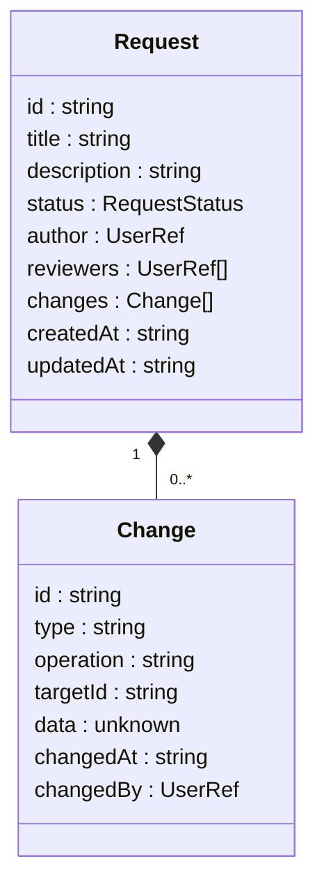

# 验证规则

<cite>
**本文档引用的文件**
- [metadata.tsp](file://api/document/core/metadata.tsp)
- [common.tsp](file://api/shared/common.tsp)
- [requests.tsp](file://api/document/workflow/requests.tsp)
- [constants.tsp](file://api/shared/constants.tsp)
- [i18n.md](file://docs-src/references/i18n.md)
</cite>

## 目录
1. [引言](#引言)
2. [验证规则结构](#验证规则结构)
3. [数据完整性约束实现](#数据完整性约束实现)
4. [常见验证规则类型配置示例](#常见验证规则类型配置示例)
5. [多语言错误消息机制](#多语言错误消息机制)
6. [验证规则执行流程](#验证规则执行流程)
7. [与变更请求工作流的集成](#与变更请求工作流的集成)
8. [结论](#结论)

## 引言

验证规则是nexusbook-api系统中确保数据质量和一致性的核心机制。通过在字段定义中配置验证规则，系统能够在数据写入前进行完整性检查，防止无效或不合规的数据进入系统。本文档详细说明了验证规则的结构、配置方式、执行时机以及与变更请求工作流的集成，为开发者和系统管理员提供全面的参考。

## 验证规则结构

验证规则定义在字段模型的`validations`数组中，每个验证规则包含三个核心字段：`ruleType`、`config`和`message`。

**验证规则结构**
- [metadata.tsp](file://api/document/core/metadata.tsp#L100-L109)

### ruleType字段

`ruleType`字段定义了验证规则的类型，是一个字符串值，用于标识具体的验证逻辑。系统根据此类型决定执行何种验证检查。

**Section sources**
- [metadata.tsp](file://api/document/core/metadata.tsp#L102)

### config字段

`config`字段包含了验证规则的具体配置参数，其结构根据`ruleType`的不同而变化。该字段为可选的未知类型，允许灵活的配置结构。

**Section sources**
- [metadata.tsp](file://api/document/core/metadata.tsp#L105)

### message字段

`message`字段定义了验证失败时返回的错误消息，采用多语言格式，支持国际化场景。

**Section sources**
- [metadata.tsp](file://api/document/core/metadata.tsp#L108)

## 数据完整性约束实现

验证规则通过在数据写入流程中执行各种检查来实现数据完整性约束。系统支持多种类型的约束，包括格式校验、范围限制和唯一性检查。

### 格式校验

格式校验通过正则表达式或其他模式匹配机制来验证数据的格式是否符合要求。例如，可以验证邮箱地址、电话号码或特定文本模式。

### 范围限制

范围限制用于验证数值或日期类型的数据是否在指定范围内。这包括最小值、最大值、长度限制等约束。

### 唯一性检查

唯一性检查确保字段值在指定范围内是唯一的。这可以通过数据库约束或应用层检查来实现。

**Section sources**
- [metadata.tsp](file://api/document/core/metadata.tsp#L79)

## 常见验证规则类型配置示例

以下是一些常见的验证规则类型及其配置示例。

### 正则表达式匹配

正则表达式匹配规则用于验证文本是否符合特定模式。配置中包含正则表达式模式和可选的标志。

```json
{
  "ruleType": "regex",
  "config": {
    "pattern": "^[a-zA-Z0-9._%+-]+@[a-zA-Z0-9.-]+\\.[a-zA-Z]{2,}$",
    "flags": "i"
  },
  "message": {
    "zh": "请输入有效的邮箱地址",
    "en": "Please enter a valid email address"
  }
}
```

**Section sources**
- [metadata.tsp](file://api/document/core/metadata.tsp#L100-L109)

### 数值区间

数值区间规则用于验证数字是否在指定范围内。配置中包含最小值和最大值。

```json
{
  "ruleType": "range",
  "config": {
    "min": 0,
    "max": 100
  },
  "message": {
    "zh": "数值必须在0到100之间",
    "en": "Value must be between 0 and 100"
  }
}
```

**Section sources**
- [metadata.tsp](file://api/document/core/metadata.tsp#L100-L109)

### 必填校验

必填校验规则确保字段值不为空。虽然可以通过字段的`required`属性实现，但也可以作为验证规则配置。

```json
{
  "ruleType": "required",
  "message": {
    "zh": "此字段为必填项",
    "en": "This field is required"
  }
}
```

**Section sources**
- [metadata.tsp](file://api/document/core/metadata.tsp#L76)

## 多语言错误消息机制

多语言错误消息机制通过`Message`类型实现，支持国际化场景下的错误提示。

### Message类型定义

`Message`类型定义在`common.tsp`文件中，是一个动态对象，使用语言代码作为键，消息文本作为值。

```mermaid
classDiagram
class Message {
...Record<string>
}
note right of Message
语言代码到消息文本的映射
键为 ISO 639-1 语言代码如 zh, en, ja 等
end note
```

**Diagram sources**
- [common.tsp](file://api/shared/common.tsp#L69-L78)

**Section sources**
- [common.tsp](file://api/shared/common.tsp#L69-L78)

### 国际化应用

在国际化场景中，系统根据用户的语言偏好返回相应的错误消息。客户端应实现降级策略，优先使用用户首选语言，然后降级到英语，最后使用任意可用语言。

**Section sources**
- [i18n.md](file://docs-src/references/i18n.md#L120-L128)

## 验证规则执行流程

验证规则在数据写入流程中的特定时机执行，并有明确的失败处理策略。

### 执行时机

验证规则在数据写入前执行，通常在API请求处理的早期阶段。系统会收集所有相关的验证规则并按顺序执行。

### 失败处理策略

当验证规则执行失败时，系统会中断数据写入流程，返回包含错误消息的响应。响应中包含错误码和多语言错误消息，帮助客户端理解和处理错误。

**Section sources**
- [metadata.tsp](file://api/document/core/metadata.tsp#L100-L109)

## 与变更请求工作流的集成

验证规则与变更请求（Request）工作流紧密集成，确保只有通过验证的数据才能提交审批。

### 变更请求模型

变更请求模型定义在`requests.tsp`文件中，包含变更集和状态管理。



**Diagram sources**
- [requests.tsp](file://api/document/workflow/requests.tsp#L83-L200)

**Section sources**
- [requests.tsp](file://api/document/workflow/requests.tsp#L83-L200)

### 集成机制

在创建或更新变更请求时，系统会验证请求中的所有变更数据。只有通过所有验证规则的数据才能成功创建或更新变更请求。当变更请求被合并时，系统会再次执行验证，确保数据的一致性。

**Section sources**
- [requests.tsp](file://api/document/workflow/requests.tsp#L224-L228)

## 结论

验证规则是nexusbook-api系统中确保数据质量和一致性的关键组件。通过灵活的规则类型和配置，系统能够实现各种数据完整性约束。多语言错误消息机制支持国际化场景，提升用户体验。与变更请求工作流的集成确保了数据变更的合规性和可追溯性。开发者应充分利用这些功能，构建可靠和高质量的应用。