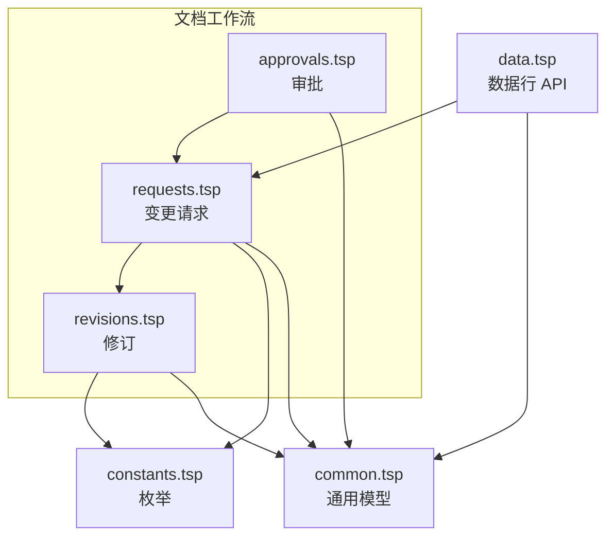
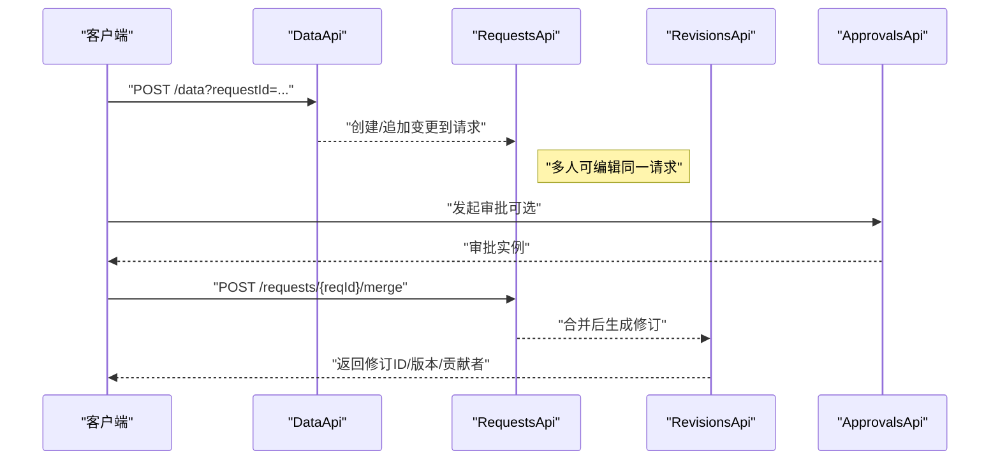
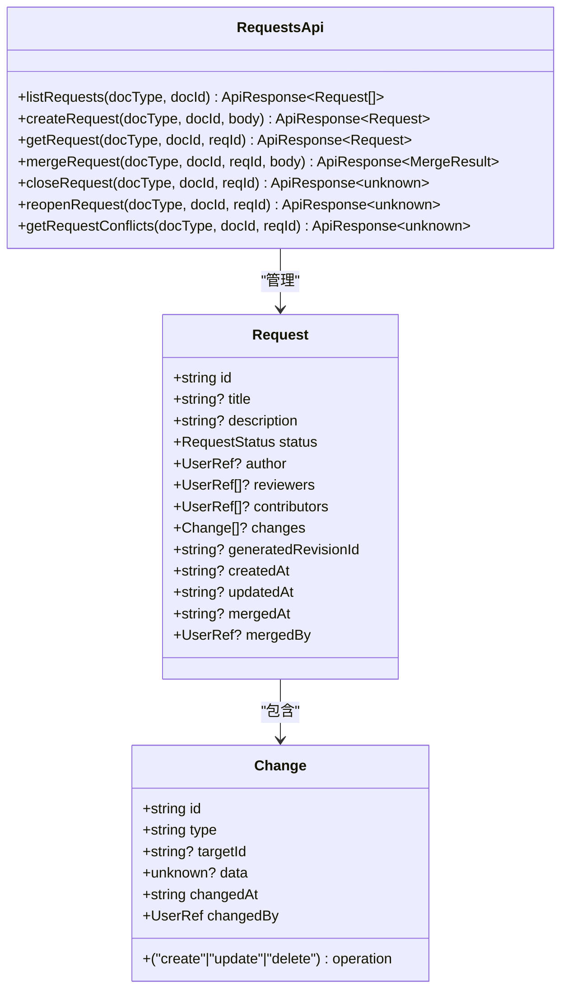
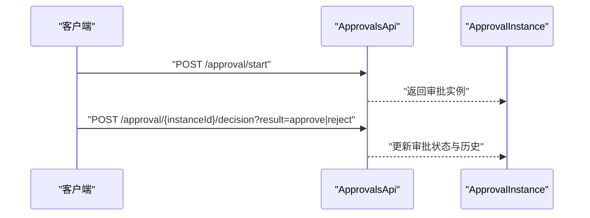
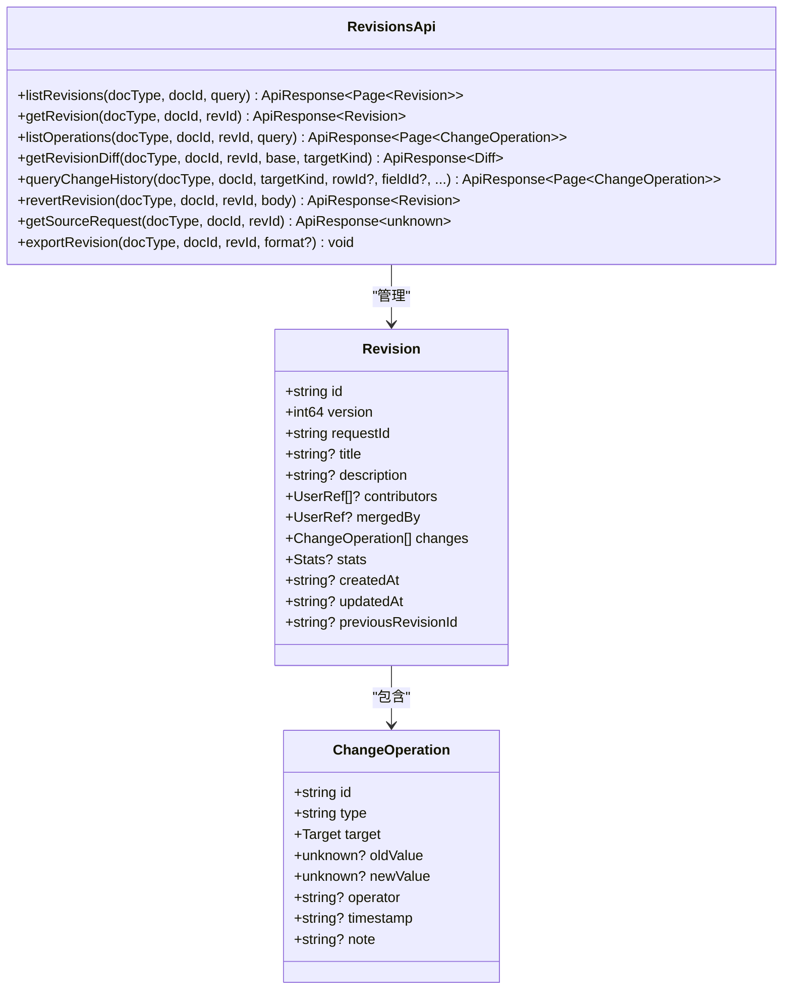
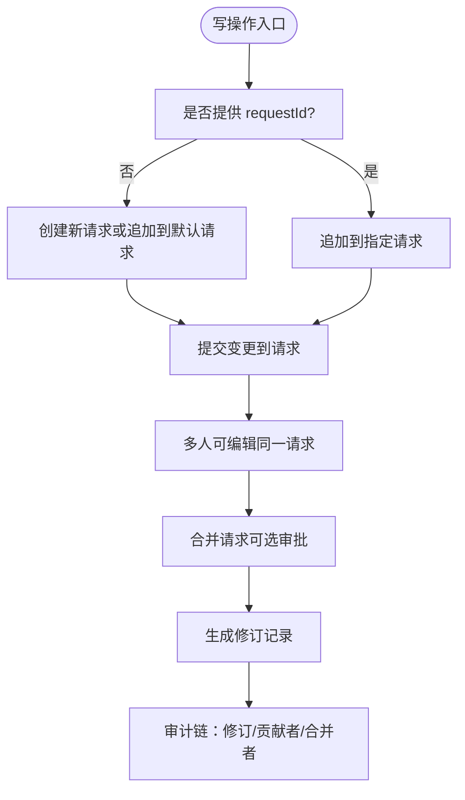
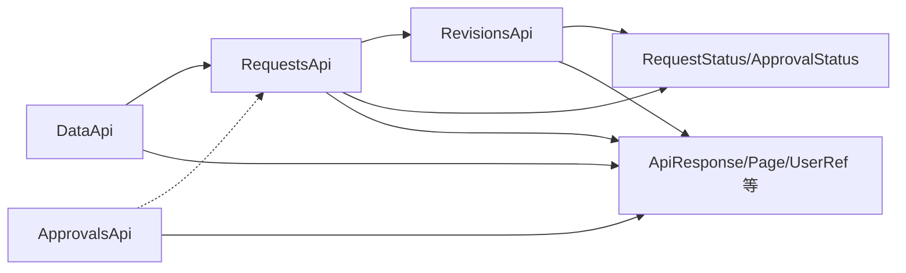

# 变更请求工作流集成

<cite>
**本文引用的文件**
- [api/document/workflow/index.tsp](file://api/document/workflow/index.tsp)
- [api/document/workflow/requests.tsp](file://api/document/workflow/requests.tsp)
- [api/document/workflow/approvals.tsp](file://api/document/workflow/approvals.tsp)
- [api/document/workflow/revisions.tsp](file://api/document/workflow/revisions.tsp)
- [api/document/core/data.tsp](file://api/document/core/data.tsp)
- [api/shared/constants.tsp](file://api/shared/constants.tsp)
- [api/shared/common.tsp](file://api/shared/common.tsp)
- [docs-src/guides/realtime-collaboration.md](file://docs-src/guides/realtime-collaboration.md)
- [docs-src/guides/webhooks.md](file://docs-src/guides/webhooks.md)
</cite>

## 目录
1. [简介](#简介)
2. [项目结构](#项目结构)
3. [核心组件](#核心组件)
4. [架构总览](#架构总览)
5. [详细组件分析](#详细组件分析)
6. [依赖分析](#依赖分析)
7. [性能考虑](#性能考虑)
8. [故障排查指南](#故障排查指南)
9. [结论](#结论)
10. [附录：cURL 示例](#附录curl-示例)

## 简介
本文件面向使用 nexusbook-api 的开发者，系统性说明“数据操作与变更请求工作流”的集成方式。重点涵盖：
- 所有写操作（创建、更新、删除）如何通过 requestId 参数与变更请求关联；
- 变更请求的生命周期：从创建/追加请求，到多人协同编辑，再到审批合并后生效并生成修订记录；
- 未指定 requestId 时的默认行为（创建新请求或追加到默认请求）；
- 协作场景下的优势：防止并发冲突、支持审批流程、提供完整审计链；
- 在变更请求中进行数据修改的完整 cURL 示例。

## 项目结构
围绕“变更请求工作流”，核心代码位于文档工作流模块与数据行模块：
- 工作流模块：requests（变更请求）、approvals（审批）、revisions（修订）
- 数据模块：data（数据行 API，统一走变更请求）
- 共享模块：constants（枚举）、common（通用响应/模型）

图表来源
- [api/document/workflow/index.tsp](file://api/document/workflow/index.tsp#L1-L17)
- [api/document/workflow/requests.tsp](file://api/document/workflow/requests.tsp#L1-L391)
- [api/document/workflow/approvals.tsp](file://api/document/workflow/approvals.tsp#L1-L156)
- [api/document/workflow/revisions.tsp](file://api/document/workflow/revisions.tsp#L1-L547)
- [api/document/core/data.tsp](file://api/document/core/data.tsp#L1-L726)
- [api/shared/constants.tsp](file://api/shared/constants.tsp#L1-L314)
- [api/shared/common.tsp](file://api/shared/common.tsp#L1-L742)

章节来源
- [api/document/workflow/index.tsp](file://api/document/workflow/index.tsp#L1-L17)

## 核心组件
- 变更请求（Request）：承载待合并的变更集合，支持多人协同编辑，状态包含 open/merged/closed。
- 审批（Approval）：定义审批流程、节点与决策，支持多节点、多评审人。
- 修订（Revision）：合并请求生效后生成的完整变更记录，包含变更操作、贡献者、合并者等。
- 数据行 API（DataApi）：所有写操作（创建/批量更新/更新/删除）均进入变更请求，不直接写入生产数据。

章节来源
- [api/document/workflow/requests.tsp](file://api/document/workflow/requests.tsp#L83-L200)
- [api/document/workflow/approvals.tsp](file://api/document/workflow/approvals.tsp#L38-L95)
- [api/document/workflow/revisions.tsp](file://api/document/workflow/revisions.tsp#L158-L315)
- [api/document/core/data.tsp](file://api/document/core/data.tsp#L538-L726)
- [api/shared/constants.tsp](file://api/shared/constants.tsp#L13-L31)

## 架构总览
下图展示“写操作 → 变更请求 → 审批 → 合并 → 修订”的端到端流程。

图表来源
- [api/document/core/data.tsp](file://api/document/core/data.tsp#L538-L726)
- [api/document/workflow/requests.tsp](file://api/document/workflow/requests.tsp#L202-L390)
- [api/document/workflow/revisions.tsp](file://api/document/workflow/revisions.tsp#L316-L547)
- [api/document/workflow/approvals.tsp](file://api/document/workflow/approvals.tsp#L96-L156)

## 详细组件分析

### 变更请求（RequestsApi）
- 列表/创建/获取/合并/关闭/重新打开/冲突检查
- 合并时冻结请求中的变更，应用到文档，生成修订，并记录贡献者与合并者
- 支持 squash、message、deleteBranch 等合并选项

图表来源
- [api/document/workflow/requests.tsp](file://api/document/workflow/requests.tsp#L39-L81)
- [api/document/workflow/requests.tsp](file://api/document/workflow/requests.tsp#L83-L200)
- [api/document/workflow/requests.tsp](file://api/document/workflow/requests.tsp#L202-L390)

章节来源
- [api/document/workflow/requests.tsp](file://api/document/workflow/requests.tsp#L1-L391)
- [api/shared/constants.tsp](file://api/shared/constants.tsp#L13-L31)
- [api/shared/common.tsp](file://api/shared/common.tsp#L617-L653)

### 审批（ApprovalsApi）
- 获取/启动审批流程
- 对审批实例进行决策（通过/拒绝/要求修改）
- 审批状态：pending/approved/rejected/canceled

图表来源
- [api/document/workflow/approvals.tsp](file://api/document/workflow/approvals.tsp#L96-L156)
- [api/shared/constants.tsp](file://api/shared/constants.tsp#L33-L86)

章节来源
- [api/document/workflow/approvals.tsp](file://api/document/workflow/approvals.tsp#L1-L156)
- [api/shared/constants.tsp](file://api/shared/constants.tsp#L33-L86)

### 修订（RevisionsApi）
- 列表/详情/操作列表/差异对比/历史查询/回滚/导出
- 修订记录包含变更操作集合、贡献者、合并者、统计信息等
- 修订与源请求关联，支持查询源请求

图表来源
- [api/document/workflow/revisions.tsp](file://api/document/workflow/revisions.tsp#L151-L315)
- [api/document/workflow/revisions.tsp](file://api/document/workflow/revisions.tsp#L316-L547)

章节来源
- [api/document/workflow/revisions.tsp](file://api/document/workflow/revisions.tsp#L1-L547)

### 数据行 API（DataApi）与变更请求
- 所有写操作（创建/批量更新/更新/删除）均进入变更请求，不直接写入生产数据
- 通过 requestId 参数将变更追加到指定请求，或在未指定时创建/追加到默认请求
- 支持在查询时叠加请求中的变更，预览效果

图表来源
- [api/document/core/data.tsp](file://api/document/core/data.tsp#L538-L726)
- [api/document/workflow/requests.tsp](file://api/document/workflow/requests.tsp#L202-L390)
- [api/document/workflow/revisions.tsp](file://api/document/workflow/revisions.tsp#L316-L547)

章节来源
- [api/document/core/data.tsp](file://api/document/core/data.tsp#L375-L726)

## 依赖分析
- DataApi 依赖 RequestsApi（写操作进入请求）
- RequestsApi 依赖 RevisionsApi（合并后生成修订）
- ApprovalsApi 与 RequestsApi 解耦，可选参与
- 共享模块提供通用模型与枚举（RequestStatus、ApprovalStatus、UserRef 等）

图表来源
- [api/document/core/data.tsp](file://api/document/core/data.tsp#L538-L726)
- [api/document/workflow/requests.tsp](file://api/document/workflow/requests.tsp#L202-L390)
- [api/document/workflow/revisions.tsp](file://api/document/workflow/revisions.tsp#L316-L547)
- [api/document/workflow/approvals.tsp](file://api/document/workflow/approvals.tsp#L96-L156)
- [api/shared/constants.tsp](file://api/shared/constants.tsp#L13-L86)
- [api/shared/common.tsp](file://api/shared/common.tsp#L153-L203)

章节来源
- [api/shared/constants.tsp](file://api/shared/constants.tsp#L13-L86)
- [api/shared/common.tsp](file://api/shared/common.tsp#L153-L203)

## 性能考虑
- 叠加视图：查询时通过 requestId 叠加请求变更，避免重复计算，但需注意大规模变更时的渲染与网络传输成本
- 合并策略：支持 squash 选项减少修订粒度，降低存储与检索开销
- 并发控制：数据行更新采用乐观锁（version），避免写冲突
- 审批与协作：多人编辑同一请求时，建议配合实时协同（Yjs/Awareness/Lock）减少冲突

[本节为通用指导，不直接分析具体文件]

## 故障排查指南
- 请求不存在/已关闭：合并请求前先确认请求状态
- 冲突检测：合并前调用冲突检查接口，定位与当前文档的冲突
- 审批异常：审批状态不合法或缺少决策
- 并发冲突：更新时提供正确版本号，避免覆盖他人变更
- Webhook 事件：关注 request_created/request_merged/request_closed/request_reopened 等事件，辅助自动化与审计

章节来源
- [api/document/workflow/requests.tsp](file://api/document/workflow/requests.tsp#L377-L390)
- [api/shared/common.tsp](file://api/shared/common.tsp#L80-L151)
- [docs-src/guides/webhooks.md](file://docs-src/guides/webhooks.md#L1-L59)

## 结论
通过“写操作 → 变更请求 → 审批 → 合并 → 修订”的闭环，nexusbook-api 提供了可审计、可协作、可追溯的变更管理能力。未指定 requestId 时，默认创建/追加到请求，确保所有写操作均可被评审与追踪；合并后生成修订，完整记录变更历史与贡献者，满足合规与审计需求。

[本节为总结，不直接分析具体文件]

## 附录：cURL 示例
以下示例展示在变更请求中进行数据修改的关键步骤。请将占位符替换为实际值，并在需要时添加 Authorization 头。

- 创建变更请求
  - POST /api/v1/doc/{docType}/{docId}/requests
  - Body：请求基本信息（标题/描述/评审人等）
  - 返回：新建请求的 id

- 追加变更到指定请求
  - POST /api/v1/doc/{docType}/{docId}/data?requestId={reqId}
  - Body：创建/更新/删除数据行的请求体
  - 返回：变更所在的请求对象

- 批量更新（进入变更请求）
  - POST /api/v1/doc/{docType}/{docId}/data/bulk?requestId={reqId}
  - Body：BulkUpdate 数组（支持单行/多行/属性等）

- 合并请求并生成修订
  - POST /api/v1/doc/{docType}/{docId}/requests/{reqId}/merge
  - Body：可选 squash、message、deleteBranch
  - 返回：revisionId、version、changesApplied、contributors、mergedAt、mergedBy

- 查询修订历史
  - GET /api/v1/doc/{docType}/{docId}/revisions
  - 查询参数：page、pageSize、contributor、search

- 对比修订差异
  - GET /api/v1/doc/{docType}/{docId}/revisions/{revId}/diff?base={revId}
  - 查询参数：targetKind

- 回滚到指定修订
  - POST /api/v1/doc/{docType}/{docId}/revisions/{revId}/revert
  - Body：reason、selectiveTypes（可选）

- 实时协同与审批（可选）
  - 实时协同参考实时协同指南
  - 审批流程参考审批 API

章节来源
- [api/document/core/data.tsp](file://api/document/core/data.tsp#L538-L726)
- [api/document/workflow/requests.tsp](file://api/document/workflow/requests.tsp#L202-L390)
- [api/document/workflow/revisions.tsp](file://api/document/workflow/revisions.tsp#L316-L547)
- [docs-src/guides/realtime-collaboration.md](file://docs-src/guides/realtime-collaboration.md#L1-L212)