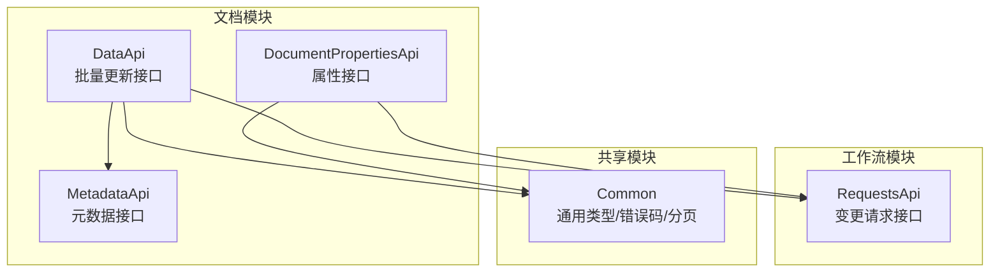
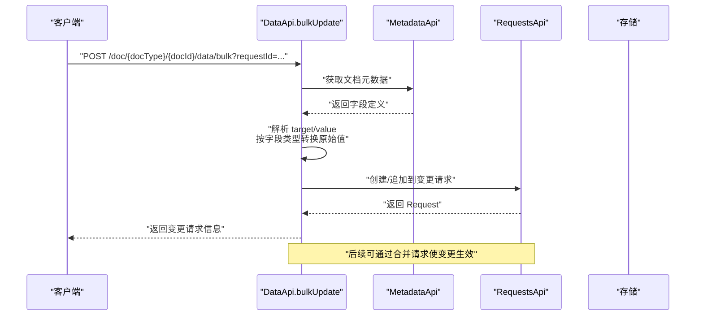
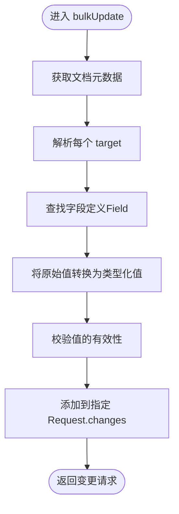
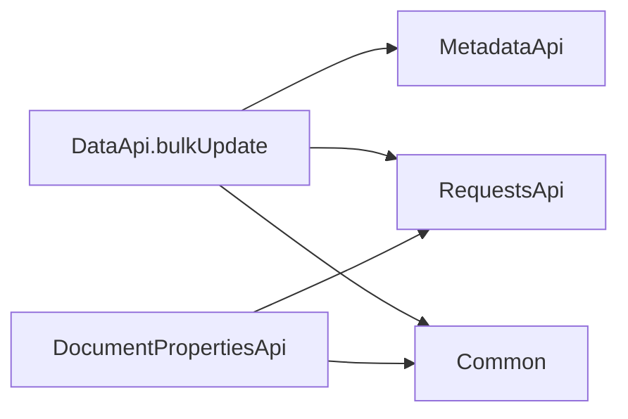

# 批量更新机制

<cite>
**本文引用的文件**
- [api/document/core/data.tsp](file://api/document/core/data.tsp)
- [api/document/core/metadata.tsp](file://api/document/core/metadata.tsp)
- [api/document/core/properties.tsp](file://api/document/core/properties.tsp)
- [api/document/workflow/requests.tsp](file://api/document/workflow/requests.tsp)
- [api/shared/common.tsp](file://api/shared/common.tsp)
- [docs-src/guides/document-model.md](file://docs-src/guides/document-model.md)
- [docs-src/guides/examples.md](file://docs-src/guides/examples.md)
</cite>

## 目录
1. [简介](#简介)
2. [项目结构](#项目结构)
3. [核心组件](#核心组件)
4. [架构总览](#架构总览)
5. [详细组件分析](#详细组件分析)
6. [依赖分析](#依赖分析)
7. [性能考虑](#性能考虑)
8. [故障排查指南](#故障排查指南)
9. [结论](#结论)
10. [附录](#附录)

## 简介
本文件系统性阐述 nexusbook-api 的“批量更新”机制，重点围绕 BulkUpdate 模型的设计与实现，解释 target 与 value 字段的灵活结构，说明五种目标指定方式与三种值格式支持，并结合服务端基于 metadata 的自动类型解析与转换流程，给出七种典型使用场景的 cURL 示例（含混合更新）。同时，梳理批量更新在变更请求工作流中的处理流程，帮助开发者高效、安全地进行数据与属性的批量变更。

## 项目结构
- 批量更新能力由文档模块提供，核心接口位于数据层，变更请求与工作流由工作流模块承接。
- 通用类型（如值类型、分页、错误码）由共享模块提供，元数据与字段定义由核心元数据模块提供，文档属性由属性模块提供。

图表来源
- [api/document/core/data.tsp](file://api/document/core/data.tsp#L574-L667)
- [api/document/core/properties.tsp](file://api/document/core/properties.tsp#L200-L441)
- [api/document/core/metadata.tsp](file://api/document/core/metadata.tsp#L183-L211)
- [api/document/workflow/requests.tsp](file://api/document/workflow/requests.tsp#L202-L391)
- [api/shared/common.tsp](file://api/shared/common.tsp#L153-L177)

章节来源
- [api/document/core/data.tsp](file://api/document/core/data.tsp#L574-L667)
- [api/document/core/properties.tsp](file://api/document/core/properties.tsp#L200-L441)
- [api/document/core/metadata.tsp](file://api/document/core/metadata.tsp#L183-L211)
- [api/document/workflow/requests.tsp](file://api/document/workflow/requests.tsp#L202-L391)
- [api/shared/common.tsp](file://api/shared/common.tsp#L153-L177)

## 核心组件
- BulkUpdate 模型：定义批量更新的最小单元，包含 target 与 value 字段，支持灵活的目标与值结构。
- DataApi.bulkUpdate：接收 BulkUpdate 数组，将变更写入指定的变更请求。
- Request：变更请求实体，承载待合并的变更集合，支持合并、关闭、冲突检测等。
- Metadata：提供字段定义与类型信息，用于服务端将原始值转换为类型化值。
- ValueEntry/Value：通用值结构，用于数据行与属性值的类型化表达。

章节来源
- [api/document/core/data.tsp](file://api/document/core/data.tsp#L189-L239)
- [api/document/core/data.tsp](file://api/document/core/data.tsp#L574-L667)
- [api/document/workflow/requests.tsp](file://api/document/workflow/requests.tsp#L39-L81)
- [api/document/workflow/requests.tsp](file://api/document/workflow/requests.tsp#L83-L200)
- [api/document/core/metadata.tsp](file://api/document/core/metadata.tsp#L65-L110)
- [api/shared/common.tsp](file://api/shared/common.tsp#L710-L742)

## 架构总览
批量更新在变更请求工作流中的整体流程如下：

图表来源
- [api/document/core/data.tsp](file://api/document/core/data.tsp#L574-L667)
- [api/document/core/metadata.tsp](file://api/document/core/metadata.tsp#L183-L211)
- [api/document/workflow/requests.tsp](file://api/document/workflow/requests.tsp#L202-L391)

## 详细组件分析

### BulkUpdate 模型与目标类型
- 目标（target）支持五种灵活指定方式：
  - 单行单字段：{ row: "...", field: "..." }
  - 整行更新：{ row: "..." }（value 为对象，包含多个字段）
  - 多行同字段：{ rows: ["...","..."], field: "..." }
  - 文档属性单个：{ property: "..." }
  - 文档属性多个：{ properties: true }（value 为对象，包含多个属性）
- 删除操作：
  - 单行删除：{ row: "...", delete: true }（无需 value）
  - 多行删除：{ rows: ["...","..."], delete: true }（无需 value）
  - 条件删除：{ condition: {...}, delete: true }（无需 value）
- 条件更新：
  - { condition: {...}, field: "..." }（配合 value）

章节来源
- [api/document/core/data.tsp](file://api/document/core/data.tsp#L71-L188)
- [api/document/core/data.tsp](file://api/document/core/data.tsp#L189-L239)

### 值（value）与类型解析
- 值支持三种格式：
  - 单个原始值：数字、字符串、布尔等
  - 对象（多个字段）：value 为对象，包含多个字段与其原始值
  - 数组（批量值）：当 rows 指定时，value 为数组，按顺序对应每行的值
- 服务端依据文档元数据（Metadata）自动解析与转换：
  - 根据 fieldId 或 propertyId 查找字段定义（Field.type）
  - 将原始值转换为类型化值（Value union）
  - 进行有效性校验（如必填、唯一、验证规则）
  - 将变更写入指定的变更请求（Request.changes）

章节来源
- [api/document/core/data.tsp](file://api/document/core/data.tsp#L189-L239)
- [api/document/core/metadata.tsp](file://api/document/core/metadata.tsp#L65-L110)
- [api/shared/common.tsp](file://api/shared/common.tsp#L710-L742)

### 变更请求（Request）与工作流
- 变更请求（Request）承载变更集合（Change），支持 open/merged/closed 三态流转。
- 批量更新接口将变更追加到指定请求；多人可编辑同一请求；合并后生成修订记录。
- 变更类型（Change.type）涵盖数据、属性、视图、元数据等。

章节来源
- [api/document/workflow/requests.tsp](file://api/document/workflow/requests.tsp#L39-L81)
- [api/document/workflow/requests.tsp](file://api/document/workflow/requests.tsp#L83-L200)

### 文档属性（Properties）与批量更新
- 文档属性支持单个属性更新与多个属性更新，也支持通过批量更新接口混合更新数据与属性。
- 属性更新同样进入变更请求，遵循同样的工作流。

章节来源
- [api/document/core/properties.tsp](file://api/document/core/properties.tsp#L31-L54)
- [api/document/core/properties.tsp](file://api/document/core/properties.tsp#L200-L441)

### 七种典型使用场景（cURL 示例）
以下示例均通过批量更新接口提交，建议在请求中携带 requestId 以便将变更写入同一变更请求，便于后续合并。

- 场景1：修改单个字段
  - 目标：单行单字段
  - cURL 示例路径：[示例路径](file://api/document/core/data.tsp#L594-L596)
- 场景2：修改整行（多个字段）
  - 目标：整行，value 为对象
  - cURL 示例路径：[示例路径](file://api/document/core/data.tsp#L600-L604)
- 场景3：修改多行的同一字段（相同值）
  - 目标：多行同字段，value 为单值
  - cURL 示例路径：[示例路径](file://api/document/core/data.tsp#L608-L612)
- 场景4：修改多行的同一字段（不同值）
  - 目标：多行同字段，value 为数组
  - cURL 示例路径：[示例路径](file://api/document/core/data.tsp#L616-L620)
- 场景5：修改单个文档属性
  - 目标：property
  - cURL 示例路径：[示例路径](file://api/document/core/data.tsp#L624-L625)
- 场景6：修改多个文档属性
  - 目标：properties
  - cURL 示例路径：[示例路径](file://api/document/core/data.tsp#L629-L633)
- 场景7：混合更新（数据 + 属性）
  - 目标：数据行 + 属性，value 为原始值
  - cURL 示例路径：[示例路径](file://api/document/core/data.tsp#L637-L639)

章节来源
- [api/document/core/data.tsp](file://api/document/core/data.tsp#L591-L640)

### 服务端处理流程（算法流程图）

图表来源
- [api/document/core/data.tsp](file://api/document/core/data.tsp#L642-L657)
- [api/document/core/metadata.tsp](file://api/document/core/metadata.tsp#L65-L110)
- [api/shared/common.tsp](file://api/shared/common.tsp#L710-L742)

## 依赖分析
- DataApi.bulkUpdate 依赖：
  - MetadataApi：获取字段定义与类型
  - RequestsApi：创建/追加变更请求
  - Common：统一响应格式、错误码、分页等
- 属性更新与数据更新共享同一变更请求工作流，二者在请求体中通过 target 的不同形式区分。

图表来源
- [api/document/core/data.tsp](file://api/document/core/data.tsp#L574-L667)
- [api/document/core/properties.tsp](file://api/document/core/properties.tsp#L200-L441)
- [api/document/core/metadata.tsp](file://api/document/core/metadata.tsp#L183-L211)
- [api/document/workflow/requests.tsp](file://api/document/workflow/requests.tsp#L202-L391)
- [api/shared/common.tsp](file://api/shared/common.tsp#L153-L177)

章节来源
- [api/document/core/data.tsp](file://api/document/core/data.tsp#L574-L667)
- [api/document/core/properties.tsp](file://api/document/core/properties.tsp#L200-L441)
- [api/document/core/metadata.tsp](file://api/document/core/metadata.tsp#L183-L211)
- [api/document/workflow/requests.tsp](file://api/document/workflow/requests.tsp#L202-L391)
- [api/shared/common.tsp](file://api/shared/common.tsp#L153-L177)

## 性能考虑
- 批量提交：通过一次请求提交多个变更，减少往返次数，提升吞吐。
- 并行处理：服务端可并行解析多个 target，但需注意数据库写入的并发控制与事务边界。
- 元数据缓存：对频繁使用的文档元数据进行缓存，降低解析成本。
- 分页与游标：大批量数据查询与导出时，使用分页与游标避免一次性拉取过多数据。

## 故障排查指南
- 字段类型不匹配：检查字段定义与传入值类型是否一致（例如 number 与 currency 的差异）。
- 必填/唯一约束：违反必填或唯一约束会导致校验失败，需修正值或字段配置。
- 并发冲突：若版本号不正确，可能导致更新失败，需重新获取最新版本号后重试。
- 变更请求冲突：合并前检查冲突，必要时先解决冲突再合并。
- 错误码参考：统一错误响应包含 success、code、message 等字段，便于定位问题。

章节来源
- [api/shared/common.tsp](file://api/shared/common.tsp#L80-L151)
- [api/shared/common.tsp](file://api/shared/common.tsp#L153-L177)
- [api/document/workflow/requests.tsp](file://api/document/workflow/requests.tsp#L377-L391)

## 结论
批量更新机制通过灵活的 target 与 value 设计，实现了对数据行与文档属性的统一、安全、可审计的批量变更。借助变更请求工作流，团队可以协同编辑、审批与合并变更，确保数据一致性与可追溯性。服务端基于元数据的自动类型解析与转换，进一步降低了客户端的复杂度，提升了易用性与扩展性。

## 附录
- 更多示例与最佳实践可参考：
  - [文档模型指南](file://docs-src/guides/document-model.md#L67-L145)
  - [完整示例](file://docs-src/guides/examples.md#L1-L210)