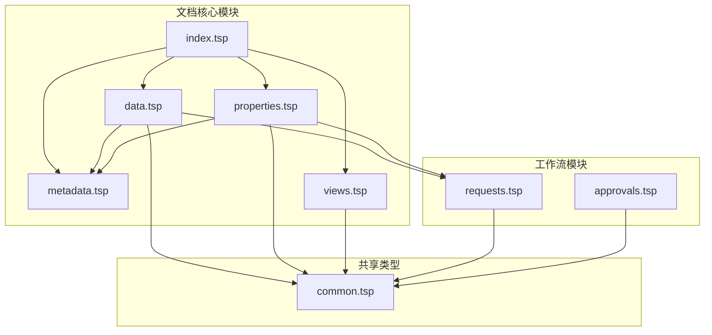
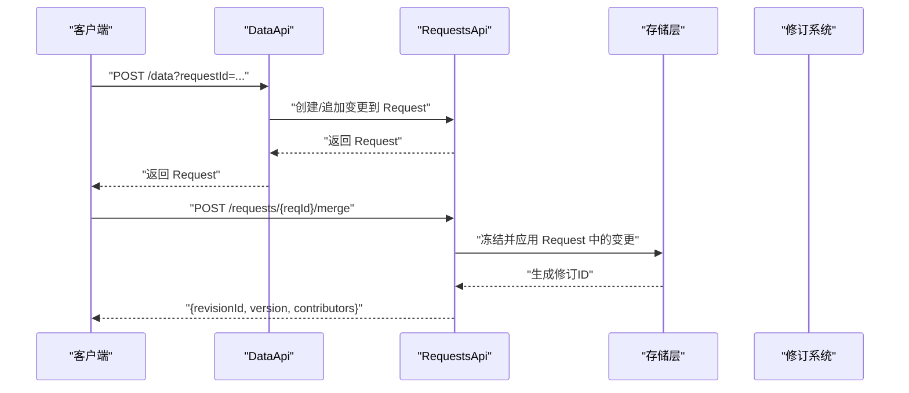
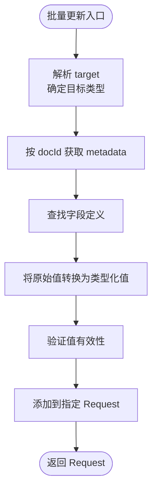
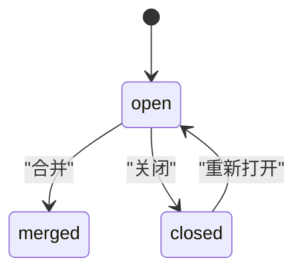

# 数据行管理

<cite>
**本文引用的文件**
- [api/document/core/data.tsp](file://api/document/core/data.tsp)
- [api/document/core/index.tsp](file://api/document/core/index.tsp)
- [api/document/core/metadata.tsp](file://api/document/core/metadata.tsp)
- [api/document/core/properties.tsp](file://api/document/core/properties.tsp)
- [api/document/core/views.tsp](file://api/document/core/views.tsp)
- [api/document/workflow/requests.tsp](file://api/document/workflow/requests.tsp)
- [api/document/workflow/approvals.tsp](file://api/document/workflow/approvals.tsp)
- [api/shared/common.tsp](file://api/shared/common.tsp)
- [docs-src/references/api-reference.md](file://docs-src/references/api-reference.md)
- [docs-src/guides/best-practices.md](file://docs-src/guides/best-practices.md)
- [docs-src/guides/document-model.md](file://docs-src/guides/document-model.md)
</cite>

## 目录
1. [简介](#简介)
2. [项目结构](#项目结构)
3. [核心组件](#核心组件)
4. [架构总览](#架构总览)
5. [详细组件分析](#详细组件分析)
6. [依赖关系分析](#依赖关系分析)
7. [性能考量](#性能考量)
8. [故障排查指南](#故障排查指南)
9. [结论](#结论)
10. [附录](#附录)

## 简介
本文件面向“nexusbook-api”的数据行管理能力，系统性阐述数据行的创建、读取、更新、删除（CRUD）操作，以及这些操作在变更请求工作流中的处理机制；详解批量更新接口的设计原理与灵活的目标指定方式（单行、多行、属性等）；说明数据行结构中的字段值集合、审计信息与版本控制机制；提供结构化查询功能的使用方法（过滤、排序、分组与聚合）；展示乐观锁并发控制的实现方式；并给出完整的API端点清单与使用示例。

## 项目结构
数据行管理位于“文档核心模块”，与元数据、属性、视图、工作流共同构成文档数据的完整生命周期。核心文件分布如下：
- 文档核心模块入口：导入并聚合 metadata、data、properties、views、settings
- 数据行模块：定义 Row、BulkUpdate、QueryRequest 与 DataApi 接口
- 元数据模块：定义字段类型、字段定义与验证规则
- 属性模块：文档级属性的增删改查与版本控制
- 视图模块：多视图配置与展示
- 工作流模块：变更请求与审批流程
- 共享类型模块：统一响应、过滤、排序、分组聚合、值类型等



图表来源
- [api/document/core/index.tsp](file://api/document/core/index.tsp#L1-L21)
- [api/document/core/data.tsp](file://api/document/core/data.tsp#L375-L628)
- [api/document/core/metadata.tsp](file://api/document/core/metadata.tsp#L1-L211)
- [api/document/core/properties.tsp](file://api/document/core/properties.tsp#L1-L441)
- [api/document/core/views.tsp](file://api/document/core/views.tsp#L1-L171)
- [api/document/workflow/requests.tsp](file://api/document/workflow/requests.tsp#L1-L391)
- [api/document/workflow/approvals.tsp](file://api/document/workflow/approvals.tsp#L1-L156)
- [api/shared/common.tsp](file://api/shared/common.tsp#L1-L576)

章节来源
- [api/document/core/index.tsp](file://api/document/core/index.tsp#L1-L21)

## 核心组件
- 数据行模型 Row：包含字段值集合、审计信息（创建/更新/版本）与可选的创建者/更新者引用。
- 批量更新模型 BulkUpdate：以灵活的 target/value 结构支持单行/多行/属性的批量更新。
- 结构化查询模型 QueryRequest：支持 filters、sorts、group、page/pageSize、cursor 等参数。
- 变更请求模型 Request：承载待合并的变更，支持 open/merged/closed 状态流转。
- 共享类型 ValueEntry/Value：统一的字段值结构，支持多字段类型（文本、数字、货币、日期、布尔、选择、附件、用户、关联、计算等）。

章节来源
- [api/document/core/data.tsp](file://api/document/core/data.tsp#L241-L311)
- [api/document/core/data.tsp](file://api/document/core/data.tsp#L189-L239)
- [api/document/core/data.tsp](file://api/document/core/data.tsp#L313-L373)
- [api/document/workflow/requests.tsp](file://api/document/workflow/requests.tsp#L83-L200)
- [api/shared/common.tsp](file://api/shared/common.tsp#L544-L576)

## 架构总览
数据行管理遵循“先变更、后合并”的工作流：所有写操作（创建、更新、删除）均进入变更请求（Request），经审批后合并生效，并生成修订（Revision）记录变更历史与贡献者。



图表来源
- [api/document/core/data.tsp](file://api/document/core/data.tsp#L440-L627)
- [api/document/workflow/requests.tsp](file://api/document/workflow/requests.tsp#L202-L390)

## 详细组件分析

### 数据行模型与审计信息
- 字段值集合：values 为 ValueEntry[]，每项包含 fieldId 与 typed value。
- 审计信息：createdAt/createdBy、updatedAt/updatedBy、version。
- 版本控制：version 用于乐观锁，避免并发覆盖。

章节来源
- [api/document/core/data.tsp](file://api/document/core/data.tsp#L241-L311)
- [api/shared/common.tsp](file://api/shared/common.tsp#L544-L576)

### 批量更新接口设计与灵活目标指定
- 目标（target）支持多种形式：
  - 单行：{row: "..."}
  - 单行单字段：{row: "...", field: "..."}
  - 多行同一字段：{rows: ["...","..."], field: "..."}
  - 单个属性：{property: "..."}
  - 多个属性：{properties: true}
  - 删除单行：{row: "...", delete: true}
  - 删除多行：{rows: ["...","..."], delete: true}
  - 按条件更新：{condition: {...}, field: "..."}
  - 按条件删除：{condition: {...}, delete: true}
- 值（value）支持：
  - 单个原始值（如数字、文本、布尔）
  - 对象（多个字段）
  - 数组（多行不同值）
- 服务端处理流程：
  1) 根据 docId 获取 metadata
  2) 解析 target 类型（行/属性）
  3) 查找字段定义获取类型
  4) 将原始值转换为类型化值
  5) 验证值有效性
  6) 添加到指定的 Request



图表来源
- [api/document/core/data.tsp](file://api/document/core/data.tsp#L189-L239)
- [api/document/core/data.tsp](file://api/document/core/data.tsp#L560-L627)

章节来源
- [api/document/core/data.tsp](file://api/document/core/data.tsp#L189-L239)
- [api/document/core/data.tsp](file://api/document/core/data.tsp#L560-L627)

### 结构化查询与分页
- QueryRequest 支持：
  - filters：FilterGroup（支持 and/or、嵌套条件、区间、包含、空值判断等）
  - sorts：Sort[]
  - group：GroupBy（fields + aggregations）
  - page/pageSize/cursor：分页与深分页
- includeChanges：在读取时叠加 Request 变更，便于预览效果
- 数据叠加读取：通过 requestId 参数返回“生产数据 + Request 变更”的合并视图

章节来源
- [api/document/core/data.tsp](file://api/document/core/data.tsp#L313-L373)
- [api/shared/common.tsp](file://api/shared/common.tsp#L210-L331)

### 变更请求工作流
- 所有写操作（创建/更新/删除数据行、属性）均进入 Request，不立即生效
- 支持多人协同编辑同一 Request
- 合并后生成修订（Revision），记录 contributors 与变更历史
- 冲突检测：合并前可检查与当前文档的冲突
- 审批：可结合审批模块对 Request 进行审批



图表来源
- [api/document/workflow/requests.tsp](file://api/document/workflow/requests.tsp#L83-L200)
- [api/document/workflow/requests.tsp](file://api/document/workflow/requests.tsp#L202-L390)

章节来源
- [api/document/core/data.tsp](file://api/document/core/data.tsp#L440-L627)
- [api/document/workflow/requests.tsp](file://api/document/workflow/requests.tsp#L202-L390)

### 乐观锁并发控制
- Row/DocumentProperties 均包含 version 字段
- 更新时需提供当前版本号，若版本不匹配则判定为并发冲突
- 最佳实践：先读取最新数据，再携带 version 执行更新；遇到冲突可重试

章节来源
- [api/document/core/data.tsp](file://api/document/core/data.tsp#L303-L311)
- [api/document/core/properties.tsp](file://api/document/core/properties.tsp#L163-L171)
- [docs-src/guides/best-practices.md](file://docs-src/guides/best-practices.md#L105-L142)

### 字段类型与值结构
- ValueUnion 支持 text/long_text/number/currency/percent/boolean/date/datetime/single_select/multi_select/attachment/user/collaborator/relation/rating/duration 等
- ValueEntry 为 fieldId + Value 的组合
- 元数据 Field 定义字段类型、默认值、选项、只读/唯一/必填、公式/查找/汇总与校验规则

章节来源
- [api/shared/common.tsp](file://api/shared/common.tsp#L544-L576)
- [api/document/core/metadata.tsp](file://api/document/core/metadata.tsp#L22-L53)
- [api/document/core/metadata.tsp](file://api/document/core/metadata.tsp#L65-L110)

## 依赖关系分析
- DataApi 依赖：
  - Row/ValueEntry/Value：来自共享类型
  - Request：来自工作流模块
  - Metadata：来自元数据模块
- 属性与数据行共享相同的值结构（ValueEntry），便于统一处理
- 视图模块 View 使用通用的过滤/排序/分组聚合模型

```mermaid
classDiagram
class Row {
+string id
+ValueEntry[] values
+string? createdAt
+UserRef? createdBy
+string? updatedAt
+UserRef? updatedBy
+int64? version
}
class BulkUpdate {
+target : {}
+value? : unknown
}
class QueryRequest {
+FilterGroup? filters
+Sort[]? sorts
+GroupBy? group
+int32? page
+int32? pageSize
+string? cursor
}
class Request {
+string id
+string? title
+string? description
+RequestStatus status
+UserRef? author
+UserRef[]? reviewers
+UserRef[]? contributors
+Change[]? changes
+string? generatedRevisionId
+string? createdAt
+string? updatedAt
+string? mergedAt
+UserRef? mergedBy
}
class ValueEntry {
+string fieldId
+Value? value
}
class Value {
<<union>>
}
Row --> ValueEntry : "包含"
ValueEntry --> Value : "使用"
BulkUpdate --> Row : "批量更新目标"
QueryRequest --> FilterGroup : "使用"
QueryRequest --> Sort : "使用"
QueryRequest --> GroupBy : "使用"
Request --> Change : "包含"
```

图表来源
- [api/document/core/data.tsp](file://api/document/core/data.tsp#L241-L311)
- [api/document/core/data.tsp](file://api/document/core/data.tsp#L189-L239)
- [api/document/core/data.tsp](file://api/document/core/data.tsp#L313-L373)
- [api/document/workflow/requests.tsp](file://api/document/workflow/requests.tsp#L83-L200)
- [api/shared/common.tsp](file://api/shared/common.tsp#L544-L576)

## 性能考量
- 结构化查询支持分页与游标，避免一次性拉取大量数据
- 批量更新以最小化客户端负担为目标，服务端自动解析类型，减少往返
- 叠加读取（includeChanges）仅在需要预览时启用，避免不必要的合并计算
- 建议在高并发场景下配合乐观锁与重试策略，降低冲突概率

## 故障排查指南
- 版本冲突（VERSION_CONFLICT）：更新时提供最新 version；若持续冲突，考虑重试或合并策略
- 字段类型不匹配（FIELD_TYPE_MISMATCH）：确认字段定义与提交的原始值类型一致
- 请求冲突（REQUEST_CONFLICT）：合并前先检查冲突，必要时调整变更范围
- 权限不足（FORBIDDEN/ORG_PERMISSION_DENIED）：确认用户对文档的写权限与组织/工作区权限

章节来源
- [docs-src/guides/best-practices.md](file://docs-src/guides/best-practices.md#L105-L142)
- [api/shared/common.tsp](file://api/shared/common.tsp#L80-L151)

## 结论
数据行管理通过“变更请求 + 审批 + 合并 + 修订”的闭环，确保数据变更的可控、可追溯与可回滚；批量更新接口以灵活的目标指定与类型自动解析，显著降低了客户端复杂度；结构化查询提供了强大的过滤、排序、分组与聚合能力；乐观锁与版本控制保障了并发安全性。整体设计兼顾易用性与可靠性，适用于复杂业务场景下的协作与治理。

## 附录

### API 端点清单与使用示例
- 列表查询（简单）
  - GET /api/v1/doc/{doc-type}/{doc-id}/data?page=1&pageSize=20&sort=name:asc
- 结构化查询
  - POST /api/v1/doc/{doc-type}/{doc-id}/data/query
  - Body: QueryRequest（filters/sorts/group/page/pageSize/cursor）
- 创建数据行（进入变更请求）
  - POST /api/v1/doc/{doc-type}/{doc-id}/data?requestId={request-id}
  - Body: Row
- 批量更新（target/value）
  - POST /api/v1/doc/{doc-type}/{doc-id}/data/bulk?requestId={request-id}
  - Body: BulkUpdate[]
- 获取单行详情（支持叠加读取）
  - GET /api/v1/doc/{doc-type}/{doc-id}/data/{row-id}?requestId={request-id}&includeChanges=true
- 更新数据行（进入变更请求）
  - PUT /api/v1/doc/{doc-type}/{doc-id}/data/{row-id}?requestId={request-id}
  - Body: Row
- 删除数据行（进入变更请求）
  - DELETE /api/v1/doc/{doc-type}/{doc-id}/data/{row-id}?requestId={request-id}

章节来源
- [docs-src/references/api-reference.md](file://docs-src/references/api-reference.md#L190-L218)
- [docs-src/references/api-reference.md](file://docs-src/references/api-reference.md#L219-L247)
- [docs-src/references/api-reference.md](file://docs-src/references/api-reference.md#L248-L264)
- [api/document/core/data.tsp](file://api/document/core/data.tsp#L375-L627)

### 结构化查询参数说明
- filters：FilterGroup（logic: and/or；conditions/groups 支持嵌套）
- sorts：Sort[]（field + direction）
- group：GroupBy（fields + aggregations）
- page/pageSize：分页参数（默认20，最大200）
- cursor：深分页游标
- includeChanges：叠加 Request 变更视图

章节来源
- [api/document/core/data.tsp](file://api/document/core/data.tsp#L313-L373)
- [api/shared/common.tsp](file://api/shared/common.tsp#L210-L331)

### 批量更新目标与值的灵活用法
- 单行单字段、整行多字段、多行同一字段、多行不同值、单个属性、多个属性、按条件更新/删除、删除单行/多行
- 值支持原始值、对象（多字段）、数组（多行不同值）

章节来源
- [api/document/core/data.tsp](file://api/document/core/data.tsp#L189-L239)
- [api/document/core/data.tsp](file://api/document/core/data.tsp#L440-L627)

### 变更请求与审批工作流
- 变更请求：open/merged/closed 三态流转，支持冲突检测、合并（可选择 squash/message/deleteBranch）
- 审批：多节点、多人审批，支持通过/拒绝/取消/节点完成等事件

章节来源
- [api/document/workflow/requests.tsp](file://api/document/workflow/requests.tsp#L202-L390)
- [api/document/workflow/approvals.tsp](file://api/document/workflow/approvals.tsp#L96-L156)

### 文档模型与工作流集成
- 完整流程：创建文档 → 初始化 Properties/Metadata/Views → 添加/更新 Data → 协作与评论 → 创建 Request（协同编辑） → 审批 → 合并生成 Revision → 回溯与对比

章节来源
- [docs-src/guides/document-model.md](file://docs-src/guides/document-model.md#L771-L822)