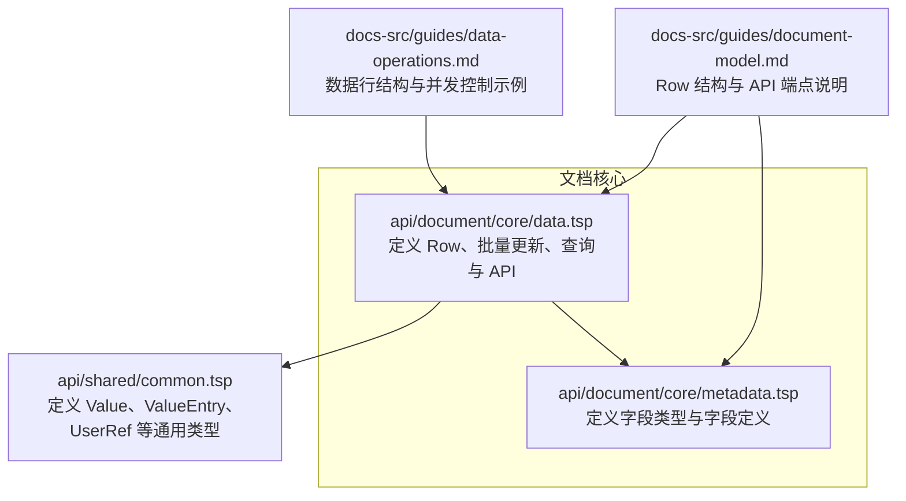
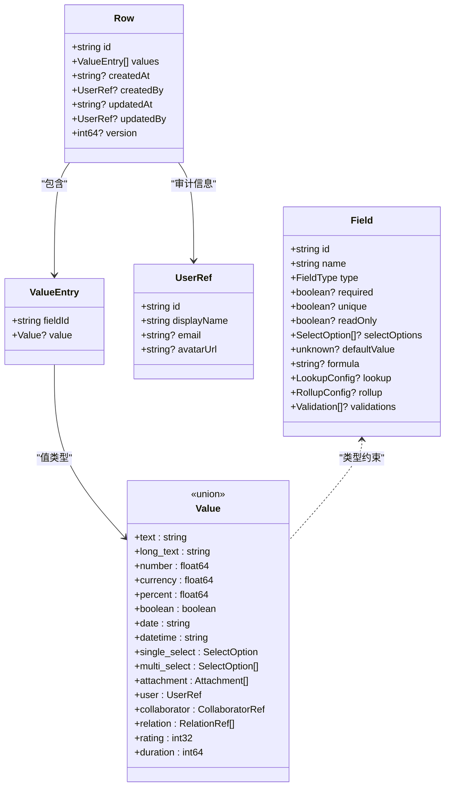
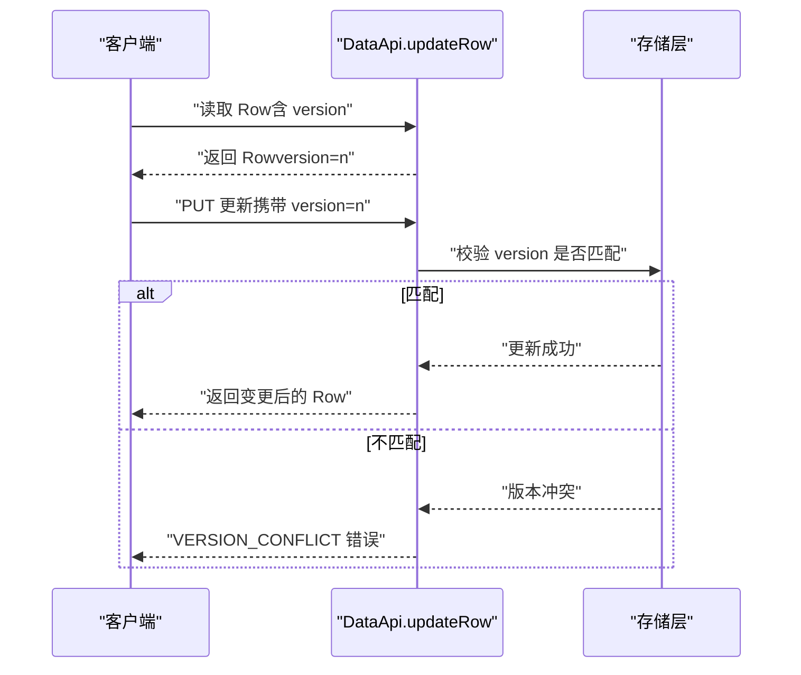
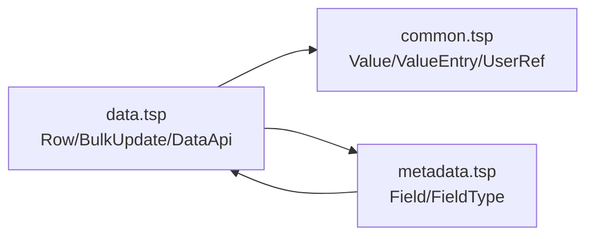

# 数据行结构

<cite>
**本文引用的文件**
- [api/document/core/data.tsp](file://api/document/core/data.tsp)
- [api/shared/common.tsp](file://api/shared/common.tsp)
- [api/document/core/metadata.tsp](file://api/document/core/metadata.tsp)
- [docs-src/guides/data-operations.md](file://docs-src/guides/data-operations.md)
- [docs-src/guides/document-model.md](file://docs-src/guides/document-model.md)
- [docs-src/guides/best-practices.md](file://docs-src/guides/best-practices.md)
</cite>

## 目录
1. [简介](#简介)
2. [项目结构](#项目结构)
3. [核心组件](#核心组件)
4. [架构总览](#架构总览)
5. [详细组件分析](#详细组件分析)
6. [依赖分析](#依赖分析)
7. [性能考虑](#性能考虑)
8. [故障排查指南](#故障排查指南)
9. [结论](#结论)
10. [附录](#附录)

## 简介
本文件聚焦于 nexusbook-api 的数据行结构，系统性说明 Row 模型的字段定义与行为，包括：
- Row 的字段：id、values、createdAt、createdBy、updatedAt、updatedBy、version
- values 数组中 ValueEntry 的结构，以及 fieldId 与 metadata 的关联
- 版本号（version）在乐观锁并发控制中的作用机制
- 审计信息（创建/更新时间与用户）的记录方式及其在协作场景中的重要性
- 完整的数据行 JSON 示例与字段含义说明

## 项目结构
围绕数据行结构的相关代码主要分布在以下模块：
- 文档核心数据层：定义 Row、批量更新、查询与 API 接口
- 通用类型：定义 Value、ValueEntry、UserRef 等基础类型
- 元数据层：定义字段类型与字段定义，为 Row.values 的类型解析提供依据
- 指南文档：提供数据行结构、并发控制与最佳实践的说明与示例



图表来源
- [api/document/core/data.tsp](file://api/document/core/data.tsp#L241-L311)
- [api/shared/common.tsp](file://api/shared/common.tsp#L544-L576)
- [api/document/core/metadata.tsp](file://api/document/core/metadata.tsp#L29-L52)
- [docs-src/guides/data-operations.md](file://docs-src/guides/data-operations.md#L1-L34)
- [docs-src/guides/document-model.md](file://docs-src/guides/document-model.md#L206-L238)

章节来源
- [api/document/core/data.tsp](file://api/document/core/data.tsp#L241-L311)
- [api/shared/common.tsp](file://api/shared/common.tsp#L544-L576)
- [api/document/core/metadata.tsp](file://api/document/core/metadata.tsp#L29-L52)
- [docs-src/guides/data-operations.md](file://docs-src/guides/data-operations.md#L1-L34)
- [docs-src/guides/document-model.md](file://docs-src/guides/document-model.md#L206-L238)

## 核心组件
- Row：数据行模型，承载行标识、字段值集合、审计信息与版本号
- ValueEntry：字段值条目，包含 fieldId 与 value
- Value：字段值的联合类型，涵盖文本、数值、布尔、日期、选择、附件、用户、关联、评分、时长等
- UserRef：用户引用，用于 createdBy/updatedBy 的审计信息
- Metadata.Field：字段定义，为 Row.values 的类型解析提供依据

章节来源
- [api/document/core/data.tsp](file://api/document/core/data.tsp#L241-L311)
- [api/shared/common.tsp](file://api/shared/common.tsp#L544-L576)
- [api/shared/common.tsp](file://api/shared/common.tsp#L451-L487)
- [api/document/core/metadata.tsp](file://api/document/core/metadata.tsp#L65-L110)

## 架构总览
数据行结构在系统中的位置与交互如下：



图表来源
- [api/document/core/data.tsp](file://api/document/core/data.tsp#L241-L311)
- [api/shared/common.tsp](file://api/shared/common.tsp#L544-L576)
- [api/shared/common.tsp](file://api/shared/common.tsp#L451-L487)
- [api/document/core/metadata.tsp](file://api/document/core/metadata.tsp#L65-L110)

## 详细组件分析

### Row 模型字段定义与职责
- id：行唯一标识，用于定位与引用
- values：字段值集合，元素为 ValueEntry，包含 fieldId 与 value
- createdAt/createdBy：创建时间与创建者，用于审计溯源
- updatedAt/updatedBy：更新时间与更新者，用于审计溯源
- version：版本号，用于乐观锁并发控制

章节来源
- [api/document/core/data.tsp](file://api/document/core/data.tsp#L241-L311)

### ValueEntry 与字段类型映射
- ValueEntry.fieldId：与 Metadata.Field.id 对应，确保 Row.values 中的字段与元数据一致
- ValueEntry.value：使用 Value 联合类型，根据字段类型映射到具体值结构
- 服务端根据 docId 获取 Metadata，再根据 fieldId 查找 Field.type，将客户端提供的原始值转换为类型化值

章节来源
- [api/document/core/data.tsp](file://api/document/core/data.tsp#L218-L239)
- [api/shared/common.tsp](file://api/shared/common.tsp#L544-L576)
- [api/document/core/metadata.tsp](file://api/document/core/metadata.tsp#L65-L110)

### 字段类型与值结构映射
- 文本/长文本：{"text": "..."} 或 {"long_text": "..."}
- 数值/货币/百分比：{"number": 123.45}
- 布尔：{"boolean": true/false}
- 日期/日期时间：{"date": "YYYY-MM-DD"} / {"datetime": "RFC3339"}
- 选择（单选/多选）：{"selectOption": {...}} / {"selectOptions": [...]}
- 附件：{"attachments": [...]}
- 用户/协作者：{"user": {...}} / {"collaborators": [...]}
- 关联：{"relations": [...]}
- 评分：{"rating": 4}
- 时长：{"duration": 3600000}

章节来源
- [docs-src/guides/data-operations.md](file://docs-src/guides/data-operations.md#L197-L212)
- [docs-src/references/field-types.md](file://docs-src/references/field-types.md#L98-L454)

### 版本号与乐观锁并发控制
- 更新行时需提供当前版本号（version），服务端以乐观锁判断是否允许更新
- 若版本不匹配，返回版本冲突错误，提示刷新后重试
- 建议在更新前先读取最新 Row，携带其 version 进行更新；若失败可重试



图表来源
- [docs-src/guides/data-operations.md](file://docs-src/guides/data-operations.md#L234-L272)
- [docs-src/guides/best-practices.md](file://docs-src/guides/best-practices.md#L105-L175)

章节来源
- [docs-src/guides/data-operations.md](file://docs-src/guides/data-operations.md#L234-L272)
- [docs-src/guides/best-practices.md](file://docs-src/guides/best-practices.md#L105-L175)

### 审计信息（创建/更新时间与用户）
- Row.createdBy/updatedBy 使用 UserRef 引用用户信息，便于协作场景中识别责任人
- createdAt/updatedAt 记录时间戳，配合 requestId 可在变更请求与修订历史中定位操作轨迹
- 在协作场景中，审计信息有助于追溯修改来源、责任归属与合规审计

章节来源
- [api/document/core/data.tsp](file://api/document/core/data.tsp#L274-L301)
- [api/shared/common.tsp](file://api/shared/common.tsp#L451-L487)

### 数据行 JSON 示例与字段说明
以下为一个典型数据行的 JSON 结构与字段含义说明（字段值类型以文本/数值为例，实际值类型以字段类型为准）：

```json
{
  "id": "row-001",
  "values": [
    {
      "fieldId": "productName",
      "value": { "text": "产品名称" }
    },
    {
      "fieldId": "quantity",
      "value": { "number": 10 }
    },
    {
      "fieldId": "price",
      "value": { "number": 799.99 }
    }
  ],
  "version": 1,
  "createdAt": "2024-12-01T10:00:00Z",
  "createdBy": { "id": "user-123", "displayName": "张三", "email": "zhangsan@example.com" },
  "updatedAt": "2024-12-01T11:00:00Z",
  "updatedBy": { "id": "user-456", "displayName": "李四", "email": "lisi@example.com" }
}
```

字段说明
- id：行唯一标识
- values：字段值数组，每个元素为 ValueEntry
- version：版本号，用于乐观锁
- createdAt/createdBy：创建时间与创建者
- updatedAt/updatedBy：更新时间与更新者

章节来源
- [docs-src/guides/data-operations.md](file://docs-src/guides/data-operations.md#L1-L34)
- [docs-src/guides/document-model.md](file://docs-src/guides/document-model.md#L206-L238)

## 依赖分析
- Row 依赖 ValueEntry 与 UserRef
- ValueEntry 依赖 Value 联合类型
- 服务端在批量更新与行更新时，会根据 docId 获取 Metadata，再根据 fieldId 查找 Field.type，完成值的类型解析与校验
- 文档模型指南强调：Metadata 定义字段，Data 必须遵守；values[].fieldId 必须存在于 Metadata



图表来源
- [api/document/core/data.tsp](file://api/document/core/data.tsp#L241-L311)
- [api/shared/common.tsp](file://api/shared/common.tsp#L544-L576)
- [api/document/core/metadata.tsp](file://api/document/core/metadata.tsp#L65-L110)

章节来源
- [api/document/core/data.tsp](file://api/document/core/data.tsp#L241-L311)
- [api/shared/common.tsp](file://api/shared/common.tsp#L544-L576)
- [api/document/core/metadata.tsp](file://api/document/core/metadata.tsp#L65-L110)
- [docs-src/guides/document-model.md](file://docs-src/guides/document-model.md#L60-L66)

## 性能考虑
- 优先使用批量更新接口，减少网络往返与解析成本
- 合理设置分页大小，避免过大响应导致延迟
- 仅查询需要的字段，减少序列化与传输开销
- 使用过滤条件在服务端裁剪数据，降低客户端处理压力

章节来源
- [docs-src/guides/data-operations.md](file://docs-src/guides/data-operations.md#L273-L306)
- [docs-src/guides/data-operations.md](file://docs-src/guides/data-operations.md#L307-L336)

## 故障排查指南
- 版本冲突（VERSION_CONFLICT）
  - 现象：更新时返回版本冲突错误
  - 处理：重新获取最新 Row，携带其 version 再次更新；可设置重试次数
- 字段类型不匹配
  - 现象：提交的值类型与字段定义不一致
  - 处理：根据 Metadata.Field.type 提供正确的值结构；服务端会自动解析与校验
- 审计信息缺失
  - 现象：createdBy/updatedBy 为空
  - 处理：确认鉴权与用户上下文；确保接口调用包含有效的用户身份

章节来源
- [docs-src/guides/data-operations.md](file://docs-src/guides/data-operations.md#L259-L272)
- [docs-src/guides/best-practices.md](file://docs-src/guides/best-practices.md#L105-L175)

## 结论
- Row 模型通过明确的字段定义、类型化值结构与审计信息，支撑了灵活而可靠的文档数据管理
- values 与 metadata 的强约束保证了数据一致性与可解析性
- version 与 requestId 工作流共同实现了协作场景下的并发控制与可审计性
- 建议在实际使用中遵循批量更新、合理分页与最小字段集查询的最佳实践，提升性能与稳定性

## 附录
- API 端点与工作流
  - 列表/查询/结构化查询：支持分页、过滤、排序、分组与聚合
  - 创建/更新/删除：统一通过 requestId 协同编辑，审批后合并生效
  - 批量更新：统一使用 BulkUpdate 结构，支持数据与属性混合更新

章节来源
- [api/document/core/data.tsp](file://api/document/core/data.tsp#L375-L628)
- [docs-src/guides/data-operations.md](file://docs-src/guides/data-operations.md#L156-L196)