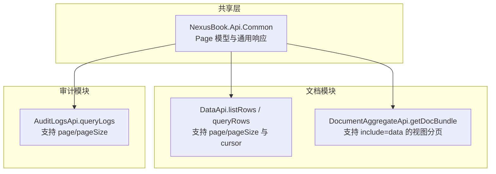
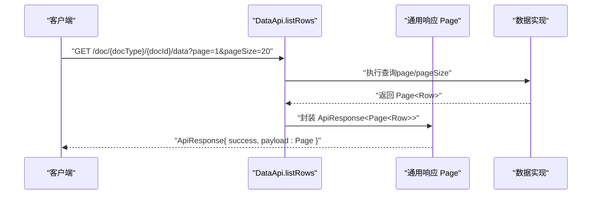
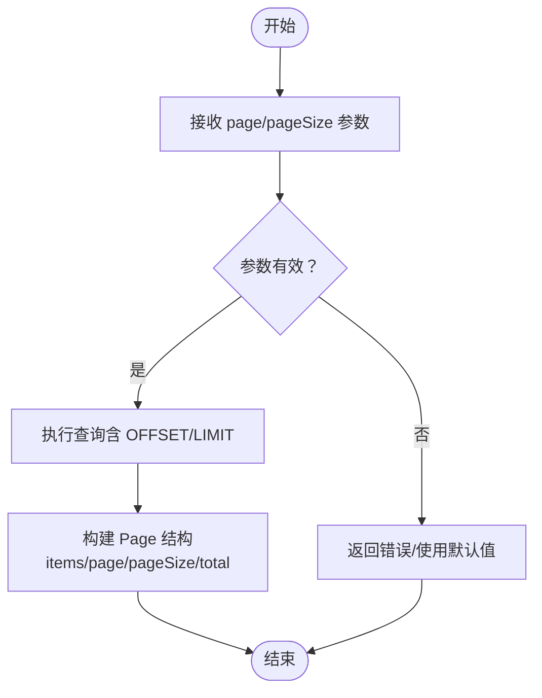
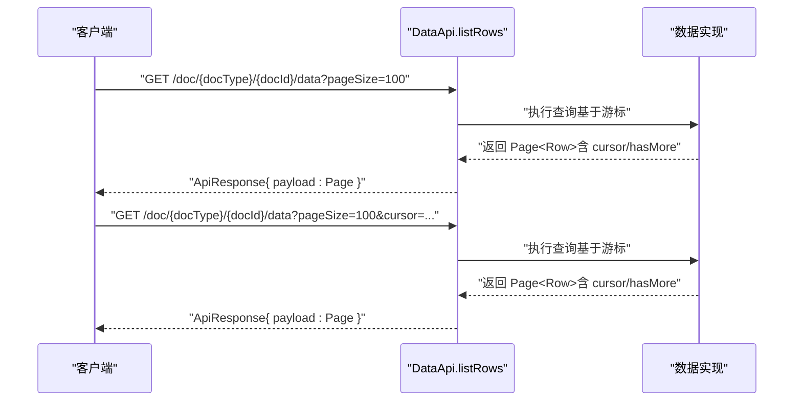
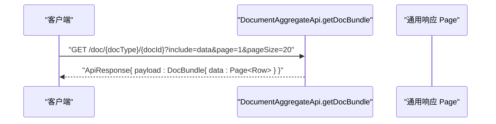
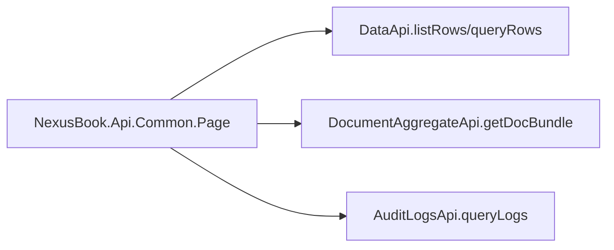

# 分页机制

<cite>
**本文引用的文件**
- [api/main.tsp](file://api/main.tsp)
- [api/shared/common.tsp](file://api/shared/common.tsp)
- [api/document/core/data.tsp](file://api/document/core/data.tsp)
- [api/document/aggregate/index.tsp](file://api/document/aggregate/index.tsp)
- [api/audit/logs.tsp](file://api/audit/logs.tsp)
- [docs-src/guides/best-practices.md](file://docs-src/guides/best-practices.md)
- [docs-src/guides/data-operations.md](file://docs-src/guides/data-operations.md)
</cite>

## 目录
1. [简介](#简介)
2. [项目结构](#项目结构)
3. [核心组件](#核心组件)
4. [架构总览](#架构总览)
5. [详细组件分析](#详细组件分析)
6. [依赖关系分析](#依赖关系分析)
7. [性能考量](#性能考量)
8. [故障排查指南](#故障排查指南)
9. [结论](#结论)
10. [附录](#附录)

## 简介
本文件系统性阐述 nexusbook-api 的分页机制，覆盖两种分页模式：
- 基于 page 与 pageSize 的页码分页：适用于常规场景，但存在深分页性能问题（OFFSET 开销随页码增大而上升）。
- 基于 cursor 的游标分页：通过唯一标识符定位下一页起点，适合深分页，避免 OFFSET 带来的性能下降。

文档还解释了 cursor 参数的生成与使用方式，提供从 API 响应中提取 cursor 并用于下一页请求的完整示例；讨论两种分页方式的性能特点与适用场景，并给出最佳实践建议（如设置合理的 pageSize 上限、处理最后一页的 hasMore 标志等）。

## 项目结构
分页能力在多个模块中体现：
- 通用分页模型与响应格式定义位于共享模块，确保各接口一致性。
- 文档数据模块提供 listRows 与 queryRows 接口，支持 page/pageSize 与 cursor。
- 聚合接口支持 include=data 时的视图分页（page/pageSize）。
- 审计日志接口支持 page/pageSize。
- 最佳实践与数据操作指南提供了游标分页示例与性能建议。

图表来源
- [api/shared/common.tsp](file://api/shared/common.tsp#L179-L203)
- [api/document/core/data.tsp](file://api/document/core/data.tsp#L404-L441)
- [api/document/aggregate/index.tsp](file://api/document/aggregate/index.tsp#L114-L126)
- [api/audit/logs.tsp](file://api/audit/logs.tsp#L37-L54)

章节来源
- [api/main.tsp](file://api/main.tsp#L85-L95)
- [api/shared/common.tsp](file://api/shared/common.tsp#L179-L203)
- [api/document/core/data.tsp](file://api/document/core/data.tsp#L404-L441)
- [api/document/aggregate/index.tsp](file://api/document/aggregate/index.tsp#L114-L126)
- [api/audit/logs.tsp](file://api/audit/logs.tsp#L37-L54)

## 核心组件
- 通用分页模型 Page
  - 字段：items、page、pageSize、total
  - 用途：统一承载分页结果，便于客户端处理
- 查询请求 QueryRequest
  - 字段：filters、sorts、group、page、pageSize、cursor
  - 用途：支持复杂查询与分页参数传递
- 数据接口 DataApi
  - listRows：支持 page/pageSize 与 cursor
  - queryRows：支持 QueryRequest.body 中的 page/pageSize/cursor
- 聚合接口 DocumentAggregateApi
  - getDocBundle：支持 include=data 时的 page/pageSize
- 审计日志接口 AuditLogsApi
  - queryLogs：支持 page/pageSize

章节来源
- [api/shared/common.tsp](file://api/shared/common.tsp#L179-L203)
- [api/document/core/data.tsp](file://api/document/core/data.tsp#L319-L373)
- [api/document/core/data.tsp](file://api/document/core/data.tsp#L404-L441)
- [api/document/aggregate/index.tsp](file://api/document/aggregate/index.tsp#L114-L126)
- [api/audit/logs.tsp](file://api/audit/logs.tsp#L37-L54)

## 架构总览
分页在 API 层通过参数传递，在共享层统一响应结构，具体实现由各业务模块负责。

图表来源
- [api/document/core/data.tsp](file://api/document/core/data.tsp#L404-L417)
- [api/shared/common.tsp](file://api/shared/common.tsp#L153-L177)
- [api/shared/common.tsp](file://api/shared/common.tsp#L179-L203)

## 详细组件分析

### 页码分页（page/pageSize）
- 适用场景
  - 常规列表浏览、小到中等规模数据集
  - 需要跳转到指定页码的场景
- 性能特点
  - 基于 OFFSET 的实现会在深页时产生额外扫描成本，导致延迟与数据库压力上升
- 实现要点
  - page 默认从 1 开始
  - pageSize 有默认值与上限约束（如默认 20，最大 200）
  - 响应包含 total 与当前 page/pageSize，便于前端展示分页信息

图表来源
- [api/document/core/data.tsp](file://api/document/core/data.tsp#L347-L363)
- [api/shared/common.tsp](file://api/shared/common.tsp#L179-L203)

章节来源
- [api/document/core/data.tsp](file://api/document/core/data.tsp#L347-L363)
- [api/shared/common.tsp](file://api/shared/common.tsp#L179-L203)

### 游标分页（cursor）
- 适用场景
  - 深分页（深层翻页）、实时数据流、持续增长列表
- 性能特点
  - 基于唯一标识符定位下一页起点，避免 OFFSET 带来的扫描成本
- 实现要点
  - cursor 作为查询参数传递
  - 响应中包含 cursor 与 hasMore 标志，用于判断是否还有下一页
  - 首次请求仅提供 pageSize；后续请求带上上次响应中的 cursor

图表来源
- [api/document/core/data.tsp](file://api/document/core/data.tsp#L404-L417)
- [docs-src/guides/data-operations.md](file://docs-src/guides/data-operations.md#L340-L358)
- [docs-src/guides/best-practices.md](file://docs-src/guides/best-practices.md#L215-L234)

章节来源
- [api/document/core/data.tsp](file://api/document/core/data.tsp#L365-L373)
- [api/document/core/data.tsp](file://api/document/core/data.tsp#L404-L417)
- [docs-src/guides/data-operations.md](file://docs-src/guides/data-operations.md#L340-L358)
- [docs-src/guides/best-practices.md](file://docs-src/guides/best-practices.md#L215-L234)

### 聚合接口中的分页
- DocumentAggregateApi.getDocBundle 支持 include=data 时的视图分页（page/pageSize）
- 适合一次性拉取文档聚合数据并进行分页

图表来源
- [api/document/aggregate/index.tsp](file://api/document/aggregate/index.tsp#L114-L126)
- [api/shared/common.tsp](file://api/shared/common.tsp#L179-L203)

章节来源
- [api/document/aggregate/index.tsp](file://api/document/aggregate/index.tsp#L114-L126)

### 审计日志的分页
- AuditLogsApi.queryLogs 支持 page/pageSize
- 适合审计日志列表的分页浏览

章节来源
- [api/audit/logs.tsp](file://api/audit/logs.tsp#L37-L54)

## 依赖关系分析
- DataApi 依赖通用 Page 模型与 ApiResponse
- 聚合接口依赖通用 Page 模型
- 审计日志接口依赖通用 Page 模型

图表来源
- [api/shared/common.tsp](file://api/shared/common.tsp#L179-L203)
- [api/document/core/data.tsp](file://api/document/core/data.tsp#L404-L441)
- [api/document/aggregate/index.tsp](file://api/document/aggregate/index.tsp#L114-L126)
- [api/audit/logs.tsp](file://api/audit/logs.tsp#L37-L54)

章节来源
- [api/shared/common.tsp](file://api/shared/common.tsp#L179-L203)
- [api/document/core/data.tsp](file://api/document/core/data.tsp#L404-L441)
- [api/document/aggregate/index.tsp](file://api/document/aggregate/index.tsp#L114-L126)
- [api/audit/logs.tsp](file://api/audit/logs.tsp#L37-L54)

## 性能考量
- 页码分页的深分页性能问题
  - OFFSET 随页码增大而增加，数据库需要扫描并丢弃前面的记录，导致延迟与资源消耗上升
- 游标分页的优势
  - 基于唯一标识符定位下一页起点，避免 OFFSET 扫描，适合深分页与持续增长列表
- 合理设置 pageSize
  - 建议在 20-100 之间，兼顾请求次数与响应体积
- 按需加载
  - 仅请求必要的 include 与字段，减少传输与处理开销
- 过滤与排序
  - 在服务端进行过滤与排序，避免客户端二次处理

章节来源
- [docs-src/guides/best-practices.md](file://docs-src/guides/best-practices.md#L215-L234)
- [docs-src/guides/data-operations.md](file://docs-src/guides/data-operations.md#L294-L305)

## 故障排查指南
- 常见错误与处理
  - 版本冲突（VERSION_CONFLICT）：更新时需提供最新版本号，避免并发冲突
  - 分页参数无效：检查 page 是否从 1 开始，pageSize 是否超过上限
  - 游标无效：确保每次请求使用上一次响应中的 cursor，不要自行构造
- 建议的调试步骤
  - 首先使用较小 pageSize 验证接口可用性
  - 使用 cursor 进行深分页时，逐页打印 cursor 与 hasMore，确认迭代逻辑正确
  - 对复杂查询，先在服务端过滤，再进行分页

章节来源
- [docs-src/guides/best-practices.md](file://docs-src/guides/best-practices.md#L103-L142)
- [api/document/core/data.tsp](file://api/document/core/data.tsp#L347-L363)
- [docs-src/guides/data-operations.md](file://docs-src/guides/data-operations.md#L340-L358)

## 结论
- 页码分页适合常规场景，但深分页存在性能隐患；游标分页更适合深分页与持续增长列表。
- 建议在深分页场景优先使用 cursor，并结合合理的 pageSize 上限与按需加载策略提升整体性能。
- 通过统一的 Page 模型与 ApiResponse，各模块保持一致的分页体验与错误处理。

## 附录
- 从响应中提取 cursor 并用于下一页请求的完整示例（步骤说明）
  - 步骤 1：首次请求，仅提供 pageSize
  - 步骤 2：从响应中读取 cursor 与 hasMore
  - 步骤 3：若 hasMore 为真，使用相同的 pageSize 与上一次的 cursor 发起下一页请求
  - 步骤 4：重复步骤 2-3，直到 hasMore 为假

章节来源
- [docs-src/guides/data-operations.md](file://docs-src/guides/data-operations.md#L340-L358)
- [docs-src/guides/best-practices.md](file://docs-src/guides/best-practices.md#L215-L234)