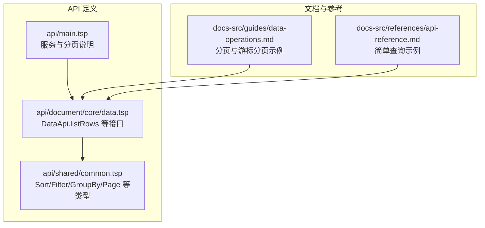
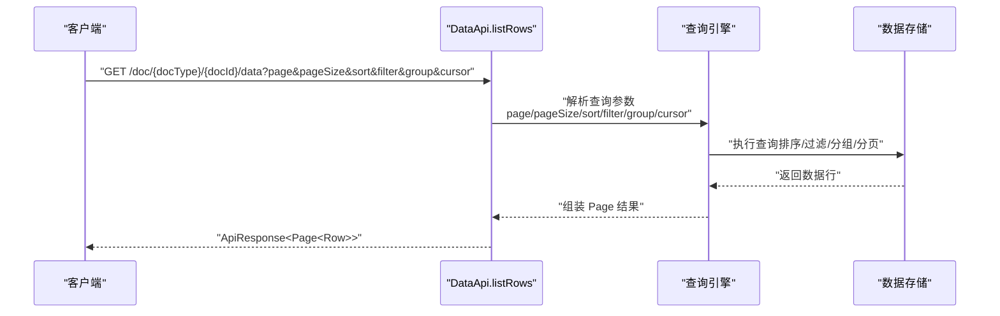
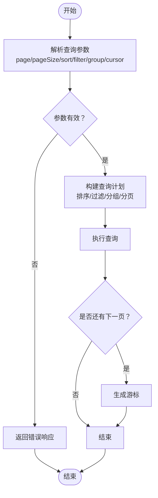
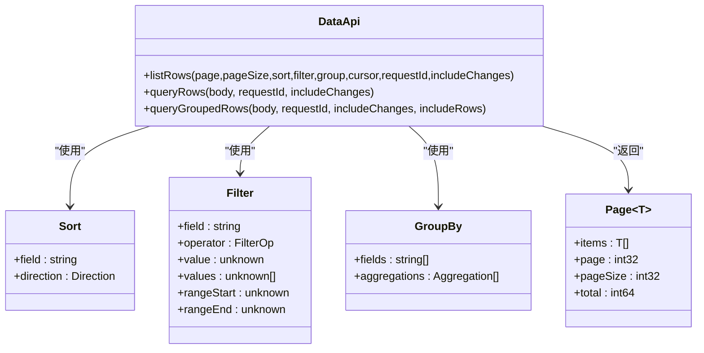

# 简单查询

<cite>
**本文引用的文件**
- [api/main.tsp](file://api/main.tsp)
- [api/document/core/data.tsp](file://api/document/core/data.tsp)
- [api/shared/common.tsp](file://api/shared/common.tsp)
- [docs-src/guides/data-operations.md](file://docs-src/guides/data-operations.md)
- [docs-src/references/api-reference.md](file://docs-src/references/api-reference.md)
</cite>

## 目录
1. [简介](#简介)
2. [项目结构](#项目结构)
3. [核心组件](#核心组件)
4. [架构概览](#架构概览)
5. [详细组件分析](#详细组件分析)
6. [依赖关系分析](#依赖关系分析)
7. [性能考虑](#性能考虑)
8. [故障排查指南](#故障排查指南)
9. [结论](#结论)
10. [附录](#附录)

## 简介
本章节面向希望使用“简单查询”快速获取数据的开发者，聚焦于通过查询参数实现的轻量级查询方式。简单查询支持 page、pageSize、sort、filter、group 和 cursor 等参数，适合前端分页、快速筛选与排序等常见场景。文档将说明各参数的格式要求与默认值，并提供实际的 cURL 示例；同时对比结构化查询，指出简单查询的优势与局限，并给出性能建议。

## 项目结构
简单查询能力由“文档数据行”模块暴露，核心接口位于数据行接口中，查询参数通过路径参数与查询字符串传递；通用的查询模型与类型定义位于共享模块。

图表来源
- [api/main.tsp](file://api/main.tsp#L85-L95)
- [api/document/core/data.tsp](file://api/document/core/data.tsp#L404-L417)
- [api/shared/common.tsp](file://api/shared/common.tsp#L197-L203)

章节来源
- [api/main.tsp](file://api/main.tsp#L85-L95)
- [api/document/core/data.tsp](file://api/document/core/data.tsp#L404-L417)
- [api/shared/common.tsp](file://api/shared/common.tsp#L197-L203)

## 核心组件
- 数据行接口（DataApi）提供两类查询入口：
  - GET /doc/{docType}/{docId}/data：支持简单查询参数（page、pageSize、sort、filter、group、cursor、requestId、includeChanges）
  - POST /doc/{docType}/{docId}/data/query：支持结构化查询（filters、sorts、group、page、pageSize）
- 通用类型（common.tsp）定义了排序、过滤、分组、分页等数据结构，用于简单与结构化查询。

章节来源
- [api/document/core/data.tsp](file://api/document/core/data.tsp#L404-L417)
- [api/document/core/data.tsp](file://api/document/core/data.tsp#L432-L441)
- [api/shared/common.tsp](file://api/shared/common.tsp#L205-L232)
- [api/shared/common.tsp](file://api/shared/common.tsp#L234-L295)
- [api/shared/common.tsp](file://api/shared/common.tsp#L334-L357)

## 架构概览
简单查询通过 HTTP GET 请求携带查询参数，服务端解析并执行分页、排序、过滤与分组，返回分页结果。

图表来源
- [api/document/core/data.tsp](file://api/document/core/data.tsp#L404-L417)
- [api/shared/common.tsp](file://api/shared/common.tsp#L197-L203)

## 详细组件分析

### 简单查询参数说明
- page
  - 类型：整数
  - 默认值：1
  - 作用：页码，从 1 开始
- pageSize
  - 类型：整数
  - 默认值：20
  - 最大值：200
  - 作用：每页返回的行数
- sort
  - 类型：字符串
  - 格式：字段名:方向（例如 "name:asc" 或 "created_at:desc"）
  - 方向：asc（升序）、desc（降序）
  - 作用：对结果进行排序
- filter
  - 类型：字符串
  - 作用：简单条件过滤（具体语法与支持的操作符以服务端解析为准）
- group
  - 类型：字符串
  - 作用：基础分组（支持多字段分组，具体语法以服务端解析为准）
- cursor
  - 类型：字符串
  - 作用：深分页游标，用于后续页请求
- requestId
  - 类型：字符串
  - 作用：返回“生产数据 + Request 变更”的叠加视图
- includeChanges
  - 类型：布尔
  - 作用：与 requestId 搭配，返回变更详情标记

章节来源
- [api/document/core/data.tsp](file://api/document/core/data.tsp#L404-L417)
- [api/shared/common.tsp](file://api/shared/common.tsp#L205-L232)
- [api/shared/common.tsp](file://api/shared/common.tsp#L234-L295)
- [api/shared/common.tsp](file://api/shared/common.tsp#L334-L357)

### 简单查询与结构化查询对比
- 简单查询（GET /data）
  - 优点：参数直观、易用、适合前端分页与快速筛选
  - 适用场景：快速获取数据、前端分页、简单排序与过滤
  - 局限：不支持嵌套过滤、复杂聚合与多级分组
- 结构化查询（POST /data/query）
  - 优点：支持嵌套过滤、多字段排序、多级分组与聚合
  - 适用场景：复杂业务查询、报表与统计分析
  - 局限：请求体较复杂，不适合极简场景

章节来源
- [api/document/core/data.tsp](file://api/document/core/data.tsp#L419-L441)
- [api/document/core/data.tsp](file://api/document/core/data.tsp#L443-L536)

### 查询参数格式与默认值
- page
  - 默认值：1
- pageSize
  - 默认值：20
  - 最大值：200
- sort
  - 格式：字段名:方向
  - 方向：asc/desc
- filter
  - 类型：字符串
  - 说明：服务端解析为过滤条件（具体支持的操作符以实现为准）
- group
  - 类型：字符串
  - 说明：服务端解析为分组字段（支持多字段分组）
- cursor
  - 类型：字符串
  - 说明：深分页游标，用于下一页请求

章节来源
- [api/document/core/data.tsp](file://api/document/core/data.tsp#L404-L417)
- [api/shared/common.tsp](file://api/shared/common.tsp#L205-L232)
- [api/shared/common.tsp](file://api/shared/common.tsp#L234-L295)
- [api/shared/common.tsp](file://api/shared/common.tsp#L334-L357)

### 实际 cURL 示例
以下示例展示了如何使用简单查询参数构建请求。注意：示例中的主机与令牌需替换为实际值。

- 获取列表（默认第 1 页，每页 20 条）
  - 示例路径：[示例](file://docs-src/references/api-reference.md#L194-L204)
- 按名称升序排序
  - 示例路径：[示例](file://docs-src/references/api-reference.md#L220-L226)
- 使用过滤条件（结构化查询，展示 filters/sorts/page/pageSize）
  - 示例路径：[示例](file://docs-src/references/api-reference.md#L227-L246)
- 合理设置分页大小（20-100）
  - 示例路径：[示例](file://docs-src/guides/data-operations.md#L294-L305)
- 使用游标分页（深分页）
  - 示例路径：[示例](file://docs-src/guides/data-operations.md#L340-L357)

章节来源
- [docs-src/references/api-reference.md](file://docs-src/references/api-reference.md#L194-L204)
- [docs-src/references/api-reference.md](file://docs-src/references/api-reference.md#L220-L226)
- [docs-src/references/api-reference.md](file://docs-src/references/api-reference.md#L227-L246)
- [docs-src/guides/data-operations.md](file://docs-src/guides/data-operations.md#L294-L305)
- [docs-src/guides/data-operations.md](file://docs-src/guides/data-operations.md#L340-L357)

### 简单查询处理流程（算法视角）

图表来源
- [api/document/core/data.tsp](file://api/document/core/data.tsp#L404-L417)
- [api/shared/common.tsp](file://api/shared/common.tsp#L197-L203)

## 依赖关系分析
- DataApi.listRows 依赖通用类型（Sort、Filter、GroupBy、Page）进行参数校验与结果封装
- 简单查询参数与结构化查询参数在语义上互补：简单查询适合快速场景，结构化查询适合复杂场景

图表来源
- [api/document/core/data.tsp](file://api/document/core/data.tsp#L404-L417)
- [api/document/core/data.tsp](file://api/document/core/data.tsp#L432-L441)
- [api/document/core/data.tsp](file://api/document/core/data.tsp#L443-L536)
- [api/shared/common.tsp](file://api/shared/common.tsp#L205-L232)
- [api/shared/common.tsp](file://api/shared/common.tsp#L234-L295)
- [api/shared/common.tsp](file://api/shared/common.tsp#L334-L357)
- [api/shared/common.tsp](file://api/shared/common.tsp#L197-L203)

章节来源
- [api/document/core/data.tsp](file://api/document/core/data.tsp#L404-L417)
- [api/document/core/data.tsp](file://api/document/core/data.tsp#L432-L441)
- [api/document/core/data.tsp](file://api/document/core/data.tsp#L443-L536)
- [api/shared/common.tsp](file://api/shared/common.tsp#L205-L232)
- [api/shared/common.tsp](file://api/shared/common.tsp#L234-L295)
- [api/shared/common.tsp](file://api/shared/common.tsp#L334-L357)
- [api/shared/common.tsp](file://api/shared/common.tsp#L197-L203)

## 性能考虑
- 合理设置 pageSize
  - 建议范围：20-100
  - 过小会导致请求次数增多，过大可能导致响应时间变长
  - 示例路径：[示例](file://docs-src/guides/data-operations.md#L294-L305)
- 使用过滤减少数据量
  - 在服务端进行过滤优于全量拉取后再在客户端过滤
  - 示例路径：[示例](file://docs-src/guides/data-operations.md#L321-L336)
- 使用游标分页处理大数据量
  - 首次请求与后续请求使用 cursor
  - 示例路径：[示例](file://docs-src/guides/data-operations.md#L340-L357)

章节来源
- [docs-src/guides/data-operations.md](file://docs-src/guides/data-operations.md#L294-L305)
- [docs-src/guides/data-operations.md](file://docs-src/guides/data-operations.md#L321-L336)
- [docs-src/guides/data-operations.md](file://docs-src/guides/data-operations.md#L340-L357)

## 故障排查指南
- 常见问题
  - 大数据量场景：使用游标分页
    - 示例路径：[示例](file://docs-src/guides/data-operations.md#L340-L357)
  - 复杂查询需求：改用结构化查询（POST /data/query）
    - 示例路径：[示例](file://docs-src/references/api-reference.md#L227-L246)
- 错误码与统一响应
  - 通用响应结构与错误码定义参见共享模块
  - 示例路径：[示例](file://api/shared/common.tsp#L153-L177)

章节来源
- [docs-src/guides/data-operations.md](file://docs-src/guides/data-operations.md#L338-L359)
- [docs-src/references/api-reference.md](file://docs-src/references/api-reference.md#L227-L246)
- [api/shared/common.tsp](file://api/shared/common.tsp#L153-L177)

## 结论
简单查询通过少量查询参数即可满足大多数前端分页与快速筛选需求，具备易用、直观的特点。对于需要嵌套过滤、多级分组与复杂聚合的场景，应选择结构化查询。在性能方面，建议合理设置 pageSize、在服务端进行过滤，并在大数据量场景使用游标分页。

## 附录
- 服务端分页与查询说明
  - 参考路径：[说明](file://api/main.tsp#L85-L95)
- 简单查询与结构化查询示例
  - 参考路径：[示例](file://docs-src/references/api-reference.md#L194-L204)
  - 参考路径：[示例](file://docs-src/references/api-reference.md#L220-L226)
  - 参考路径：[示例](file://docs-src/references/api-reference.md#L227-L246)

章节来源
- [api/main.tsp](file://api/main.tsp#L85-L95)
- [docs-src/references/api-reference.md](file://docs-src/references/api-reference.md#L194-L204)
- [docs-src/references/api-reference.md](file://docs-src/references/api-reference.md#L220-L226)
- [docs-src/references/api-reference.md](file://docs-src/references/api-reference.md#L227-L246)