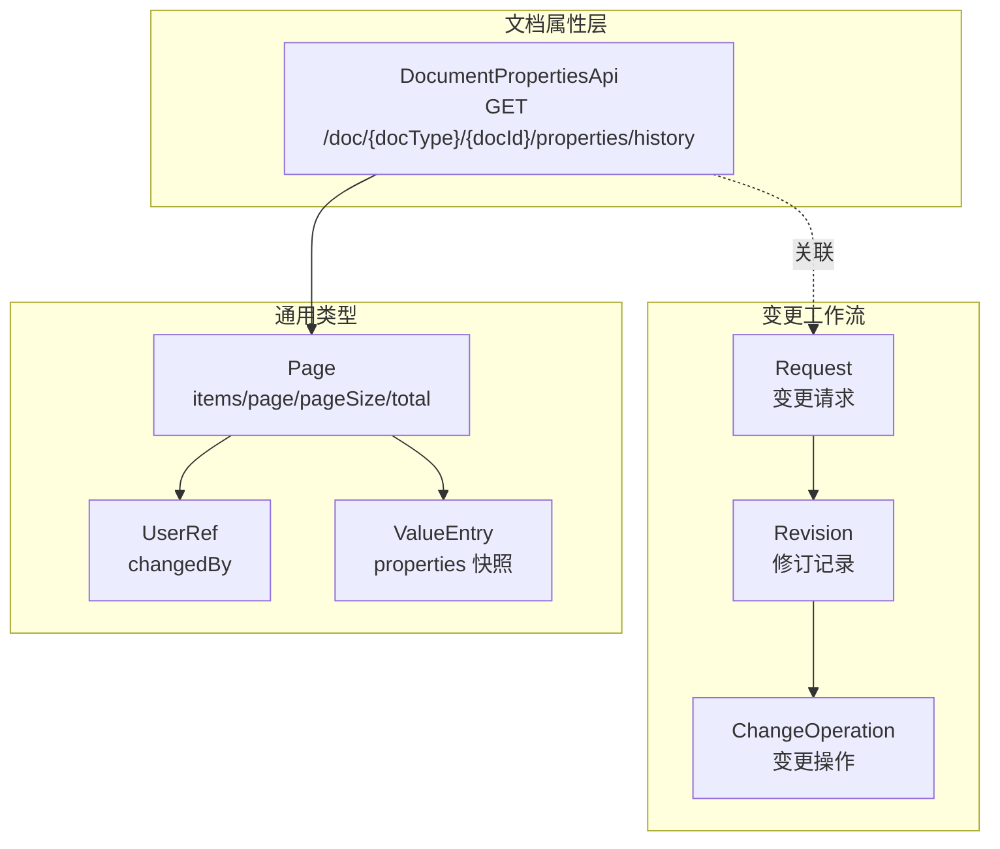
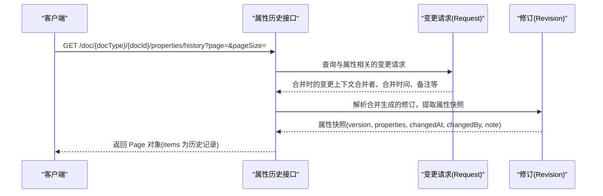
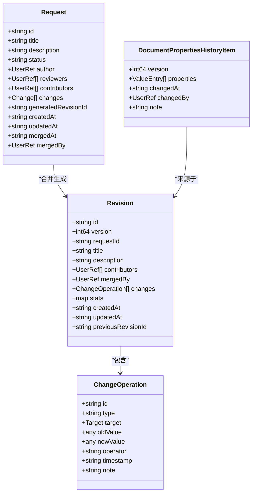
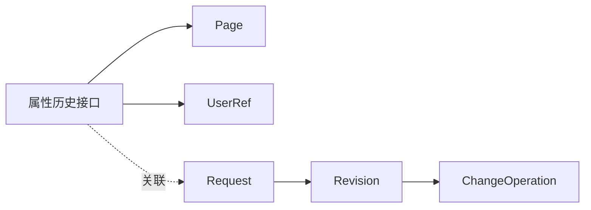

# 修订历史查询

<cite>
**本文引用的文件**
- [api/document/core/properties.tsp](file://api/document/core/properties.tsp)
- [api/document/workflow/revisions.tsp](file://api/document/workflow/revisions.tsp)
- [api/document/workflow/requests.tsp](file://api/document/workflow/requests.tsp)
- [api/shared/common.tsp](file://api/shared/common.tsp)
- [api/Doc.md](file://api/Doc.md)
- [docs-src/guides/document-model.md](file://docs-src/guides/document-model.md)
</cite>

## 目录
1. [简介](#简介)
2. [项目结构](#项目结构)
3. [核心组件](#核心组件)
4. [架构概览](#架构概览)
5. [详细组件分析](#详细组件分析)
6. [依赖分析](#依赖分析)
7. [性能考虑](#性能考虑)
8. [故障排查指南](#故障排查指南)
9. [结论](#结论)

## 简介
本文档面向“修订历史查询”能力，聚焦于通过 GET /doc/{docType}/{docId}/properties/history 端点查看文档属性的历史变更记录。我们将说明：
- 接口行为与返回结构
- 分页参数 page、pageSize 的使用与默认值
- 返回 Page 对象的字段含义（items、page、pageSize、total）
- 历史记录与变更请求（Request）及修订（Revision）系统的关联关系
- 如何利用该能力进行审计追踪与变更回溯

## 项目结构
该能力位于文档属性模块，配合变更工作流（请求与修订）共同构成完整的审计链路。关键文件如下：
- 属性历史接口定义：api/document/core/properties.tsp
- 修订与变更操作模型：api/document/workflow/revisions.tsp
- 变更请求模型与合并流程：api/document/workflow/requests.tsp
- 通用分页与用户引用类型：api/shared/common.tsp
- 文档模型与端点概览：api/Doc.md、docs-src/guides/document-model.md

图表来源
- [api/document/core/properties.tsp](file://api/document/core/properties.tsp#L385-L424)
- [api/document/workflow/revisions.tsp](file://api/document/workflow/revisions.tsp#L151-L314)
- [api/document/workflow/requests.tsp](file://api/document/workflow/requests.tsp#L83-L200)
- [api/shared/common.tsp](file://api/shared/common.tsp#L179-L203)

章节来源
- [api/document/core/properties.tsp](file://api/document/core/properties.tsp#L385-L424)
- [api/shared/common.tsp](file://api/shared/common.tsp#L179-L203)

## 核心组件
- 属性历史接口：提供按文档类型与文档ID查询属性历史的能力，返回 Page 对象，其中 items 为历史记录条目，每条记录包含变更版本、属性快照、变更时间、变更人与变更说明等字段。
- 通用分页 Page：统一承载分页信息，包含 items、page、pageSize、total。
- 变更请求与修订：属性历史记录来源于变更请求合并后生成的修订，通过合并流程冻结历史，形成可审计的变更链路。

章节来源
- [api/document/core/properties.tsp](file://api/document/core/properties.tsp#L385-L424)
- [api/shared/common.tsp](file://api/shared/common.tsp#L179-L203)
- [api/document/workflow/revisions.tsp](file://api/document/workflow/revisions.tsp#L151-L314)
- [api/document/workflow/requests.tsp](file://api/document/workflow/requests.tsp#L83-L200)

## 架构概览
属性历史查询与变更工作流的关系如下：
- 用户在变更请求中提交属性变更
- 审批通过后合并请求，系统生成修订（Revision），冻结该请求中的所有变更
- 属性历史接口返回的是“属性维度”的历史快照，每条记录对应一次属性层面的变更版本
- 历史记录中的 changedBy、changedAt、note 等字段来自请求合并时的上下文

图表来源
- [api/document/core/properties.tsp](file://api/document/core/properties.tsp#L385-L424)
- [api/document/workflow/requests.tsp](file://api/document/workflow/requests.tsp#L285-L347)
- [api/document/workflow/revisions.tsp](file://api/document/workflow/revisions.tsp#L151-L314)

## 详细组件分析

### 接口定义与返回结构
- 端点：GET /doc/{docType}/{docId}/properties/history
- 查询参数：
  - page：页码，默认值为 1（参见数据接口中的默认值说明）
  - pageSize：每页数量，默认值为 20（参见数据接口中的默认值说明）
- 返回结构：ApiResponse<Page<属性历史项>>
  - Page.items：历史记录数组
  - Page.page：当前页码
  - Page.pageSize：每页数量
  - Page.total：总记录数
- 属性历史项字段：
  - version：变更版本（int64）
  - properties：属性值快照（ValueEntry[]）
  - changedAt：变更时间（string，ISO 8601）
  - changedBy：变更人（UserRef）
  - note：变更说明（string，可选）

章节来源
- [api/document/core/properties.tsp](file://api/document/core/properties.tsp#L385-L424)
- [api/shared/common.tsp](file://api/shared/common.tsp#L179-L203)

### 分页参数与默认值
- page 默认值：1
- pageSize 默认值：20
- 以上默认值参考了数据接口中的分页参数注释，属性历史接口复用相同的分页语义。

章节来源
- [api/document/core/data.tsp](file://api/document/core/data.tsp#L347-L365)

### 历史记录与审计链路
- 变更请求（Request）：多人协作编辑、评审与合并的载体
- 修订（Revision）：合并时生成，包含变更操作集合与统计信息
- 属性历史：基于合并上下文生成，记录属性层面的版本快照
- 审计追踪：通过 changedBy、changedAt、note 等字段，结合修订与请求，形成可追溯的审计链路

图表来源
- [api/document/workflow/requests.tsp](file://api/document/workflow/requests.tsp#L83-L200)
- [api/document/workflow/revisions.tsp](file://api/document/workflow/revisions.tsp#L151-L314)
- [api/document/core/properties.tsp](file://api/document/core/properties.tsp#L385-L424)

章节来源
- [api/document/workflow/requests.tsp](file://api/document/workflow/requests.tsp#L83-L200)
- [api/document/workflow/revisions.tsp](file://api/document/workflow/revisions.tsp#L151-L314)
- [api/document/core/properties.tsp](file://api/document/core/properties.tsp#L385-L424)

### API 调用示例（路径与参数）
- 基本调用
  - 方法：GET
  - 路径：/doc/{docType}/{docId}/properties/history
  - 查询参数：
    - page：页码（默认 1）
    - pageSize：每页数量（默认 20）
- 返回示例（结构）
  - items：历史记录数组，每条记录包含 version、properties、changedAt、changedBy、note
  - page：当前页
  - pageSize：每页数量
  - total：总记录数

章节来源
- [api/document/core/properties.tsp](file://api/document/core/properties.tsp#L385-L424)
- [api/shared/common.tsp](file://api/shared/common.tsp#L179-L203)

### 审计追踪与变更回溯
- 审计追踪：通过 changedBy、changedAt、note，可定位每次属性变更的执行人、时间与说明
- 变更回溯：结合请求与修订，可定位变更来源与影响范围；若需行级或字段级回溯，可使用修订历史与变更操作列表接口

章节来源
- [api/document/workflow/revisions.tsp](file://api/document/workflow/revisions.tsp#L316-L546)
- [api/document/workflow/requests.tsp](file://api/document/workflow/requests.tsp#L202-L390)

## 依赖分析
- 属性历史接口依赖通用分页 Page 与用户引用 UserRef
- 属性历史记录与变更请求合并流程强关联，最终沉淀为修订
- 与其他历史查询接口（如修订历史、变更操作列表）共同构成完整的审计体系

图表来源
- [api/document/core/properties.tsp](file://api/document/core/properties.tsp#L385-L424)
- [api/shared/common.tsp](file://api/shared/common.tsp#L179-L203)
- [api/document/workflow/requests.tsp](file://api/document/workflow/requests.tsp#L83-L200)
- [api/document/workflow/revisions.tsp](file://api/document/workflow/revisions.tsp#L151-L314)

章节来源
- [api/document/core/properties.tsp](file://api/document/core/properties.tsp#L385-L424)
- [api/shared/common.tsp](file://api/shared/common.tsp#L179-L203)
- [api/document/workflow/requests.tsp](file://api/document/workflow/requests.tsp#L83-L200)
- [api/document/workflow/revisions.tsp](file://api/document/workflow/revisions.tsp#L151-L314)

## 性能考虑
- 合理设置 pageSize：避免过大导致响应时间过长，避免过小导致请求次数过多
- 优先使用服务端过滤与排序，减少不必要的数据传输
- 对历史查询进行必要的筛选（如按时间范围、变更人等），以降低数据量

## 故障排查指南
- 分页异常：确认 page 与 pageSize 的取值范围与默认值
- 权限不足：检查访问令牌与文档权限
- 数据不存在：确认 docType 与 docId 是否正确
- 审计链路缺失：确认请求是否已合并，合并后才会生成修订与属性历史

## 结论
属性历史查询接口提供了面向属性维度的审计能力，结合变更请求与修订系统，能够完整还原属性值的演变过程。通过合理的分页参数与筛选条件，用户可在海量历史中高效定位关键变更，满足合规与审计需求。